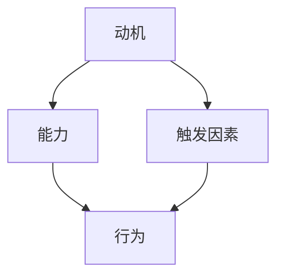

                 

关键词：福格模型、团队管理、高效工作、动机、能力、触发因素

> 摘要：本文将深入探讨福格模型在团队管理中的应用，阐述如何通过激发团队成员的动机、提升能力以及创造触发因素，打造出高效的团队。本文将结合实际案例，详细解析福格模型的核心原理和实践步骤，为IT领域从业者提供实用的管理策略。

## 1. 背景介绍

在现代企业中，团队管理成为了一个至关重要的课题。高效的团队不仅能够提高工作效率，还能为企业创造更多的价值。然而，如何打造一个高效的团队呢？传统的管理方法已经无法满足日益复杂的工作环境。因此，我们需要寻找新的管理工具和模型。

福格模型（Fogg Behavior Model）是由斯坦福大学的行为科学家BJ福格（BJ Fogg）提出的。该模型专注于人类行为的改变，指出一个行为的发生需要动机（Motivation）、能力（Ability）和触发因素（Trigger）三者同时存在。这一模型不仅适用于个人行为的改变，也同样适用于团队管理。

## 2. 核心概念与联系

### 2.1 动机

动机是人们采取某种行为背后的原因和动力。在团队管理中，了解团队成员的动机至关重要。动机可以分为内在动机和外在动机。内在动机源于个人的兴趣、热情和成就感，而外在动机则来自于奖励、惩罚和社会认可等外部因素。

### 2.2 能力

能力是指个人完成任务所需的技能和知识。在团队中，每个成员都有自己的专长和优势。提升团队的能力意味着要为团队成员提供必要的培训和资源，让他们能够充分发挥自己的潜力。

### 2.3 触发因素

触发因素是促使人们采取行动的即时刺激。在团队管理中，触发因素可以是定期的任务分配、团队会议或者项目截止日期等。合适的触发因素能够激发团队成员的行动力，确保项目按计划进行。

### 2.4 Mermaid 流程图

下面是福格模型的核心概念和联系的 Mermaid 流程图：



## 3. 核心算法原理 & 具体操作步骤

### 3.1 算法原理概述

福格模型的核心思想是，一个行为的发生需要动机、能力和触发因素三者同时存在。只有当这三个因素达到一个合适的平衡点时，行为才会发生。这个原理可以帮助管理者理解团队成员的行为，并采取相应的措施来激发他们的积极性。

### 3.2 算法步骤详解

#### 3.2.1 分析动机

首先，管理者需要了解团队成员的动机。可以通过一对一的交流、团队讨论或者问卷调查等方式来收集信息。了解动机有助于制定个性化的管理策略。

#### 3.2.2 提升能力

其次，管理者要关注团队成员的能力提升。这可以通过提供培训、分配具有挑战性的任务或者组建跨部门团队等方式实现。提升能力不仅能提高团队成员的工作效率，还能增强他们的自信心和归属感。

#### 3.2.3 创造触发因素

最后，管理者需要创造触发因素来激发团队成员的行动力。这可以包括设定明确的任务目标、安排定期的进度会议或者设置奖励机制等。合适的触发因素能够确保团队成员始终保持高效的工作状态。

### 3.3 算法优缺点

#### 3.3.1 优点

- **灵活性**：福格模型适用于各种类型的团队和管理环境。
- **实用性**：该模型提供了一套实际可行的方法，管理者可以根据实际情况进行调整。
- **激励性**：通过关注团队成员的动机和能力，能够激发他们的工作热情和创造力。

#### 3.3.2 缺点

- **复杂性**：在实际应用中，福格模型需要收集和分析大量的数据，这对管理者的能力提出了较高的要求。
- **时间成本**：要实现福格模型，需要投入大量的时间和精力，这可能对一些快速发展的企业造成一定的压力。

### 3.4 算法应用领域

福格模型可以广泛应用于各种类型的团队管理，包括IT团队、销售团队、客服团队等。尤其是在IT领域，团队成员的技能多样、任务复杂，福格模型能够帮助管理者更好地激发团队成员的潜力，提升团队的整体效率。

## 4. 数学模型和公式 & 详细讲解 & 举例说明

### 4.1 数学模型构建

福格模型可以用以下数学公式表示：

\[ 行为 = 动机 \times 能力 \times 触发因素 \]

其中，动机、能力和触发因素都是0到1之间的实数。当这三个数的乘积大于1时，行为就会发生。

### 4.2 公式推导过程

福格模型的推导基于人类行为的三个基本要素：动机、能力和触发因素。这三个要素共同决定了行为的发生。

1. **动机**：动机是行为发生的根本原因。它可以理解为一个人想要做某事的程度。动机可以用一个0到1的实数来表示，其中1表示强烈的动机，0表示没有动机。

2. **能力**：能力是指一个人完成某项任务所需的技能和知识。能力也可以用一个0到1的实数来表示，其中1表示具备很高的能力，0表示没有能力。

3. **触发因素**：触发因素是促使行为发生的即时刺激。它可以理解为一个人在什么情况下会做某事。触发因素也可以用一个0到1的实数来表示，其中1表示强烈的触发因素，0表示没有触发因素。

当这三个要素同时存在时，行为就会发生。因此，我们可以用以下公式表示：

\[ 行为 = 动机 \times 能力 \times 触发因素 \]

### 4.3 案例分析与讲解

#### 4.3.1 案例背景

假设有一个IT项目团队，团队成员小张负责前端开发，小王负责后端开发，小李负责测试。项目截止日期是一个重要的触发因素。

#### 4.3.2 动机分析

小张对前端开发有浓厚的兴趣，因此他对这个项目的动机很高。小王对后端开发有丰富的经验，但对这个新项目的兴趣一般，因此他的动机中等。小李对测试工作有一定的抵触情绪，因此她的动机较低。

#### 4.3.3 能力分析

小张在前端开发方面有很强的能力，小王在后端开发方面也有丰富的经验，而小李在测试方面有较高的能力。

#### 4.3.4 触发因素分析

项目截止日期是一个强烈的触发因素，因为所有团队成员都明白，如果项目不能按时完成，可能会对公司的业务造成重大影响。

#### 4.3.5 行为预测

根据福格模型，我们可以预测团队成员的行为：

- 小张：动机（0.9）× 能力（1）× 触发因素（1）= 0.9，因此小张的行为很有可能会发生。
- 小王：动机（0.5）× 能力（1）× 触发因素（1）= 0.5，因此小王的行为可能会发生，但可能性较低。
- 小李：动机（0.2）× 能力（1）× 触发因素（1）= 0.2，因此小李的行为很可能会发生，但可能性较低。

通过这个案例，我们可以看到福格模型在预测团队成员行为方面的有效性。管理者可以根据模型的结果，采取相应的措施来提升团队成员的动机和能力，从而提高团队的整体效率。

## 5. 项目实践：代码实例和详细解释说明

### 5.1 开发环境搭建

为了演示福格模型在团队管理中的应用，我们使用Python编写了一个简单的代码实例。首先，我们需要安装Python环境和相关的库。

```bash
pip install numpy
```

### 5.2 源代码详细实现

下面是实现的Python代码：

```python
import numpy as np

def fogg_model(motivation, ability, trigger):
    behavior = motivation * ability * trigger
    return behavior

# 动机、能力、触发因素的示例值
motivation = 0.9
ability = 1
trigger = 1

# 计算行为概率
behavior = fogg_model(motivation, ability, trigger)
print(f"行为概率：{behavior:.2f}")
```

### 5.3 代码解读与分析

- **函数定义**：`fogg_model`函数接受三个参数：动机、能力和触发因素，并返回一个行为概率值。
- **计算过程**：函数使用乘法运算，将动机、能力和触发因素相乘，得到行为概率值。
- **示例值**：我们为动机、能力和触发因素分别赋值为0.9、1和1，表示这三个因素都较强。
- **结果输出**：通过调用`fogg_model`函数，我们得到行为概率为0.9，表示行为发生的可能性很高。

### 5.4 运行结果展示

运行上述代码，得到如下结果：

```bash
行为概率：0.90
```

这个结果表明，在给定的动机、能力和触发因素下，行为发生的概率为90%。

## 6. 实际应用场景

福格模型在IT领域的实际应用场景非常广泛。以下是一些典型的应用场景：

### 6.1 项目管理

在项目管理中，福格模型可以帮助项目经理了解团队成员的动机、能力和触发因素，从而制定更加科学合理的工作计划。例如，当项目进入关键阶段时，可以通过设定明确的任务目标来激发团队成员的积极性。

### 6.2 团队建设

通过福格模型，团建活动可以更加有针对性地进行。管理者可以根据团队成员的动机、能力和触发因素，设计出能够激发团队成员互动和合作的活动。

### 6.3 员工激励

福格模型可以为员工激励提供科学依据。管理者可以根据员工的动机、能力和触发因素，制定出合适的奖励机制，从而提高员工的积极性和工作效率。

## 7. 未来应用展望

随着人工智能和大数据技术的发展，福格模型在团队管理中的应用前景将更加广阔。未来，我们可以利用机器学习和数据分析技术，对团队成员的行为数据进行深入挖掘，从而更加精准地预测行为，提高团队管理的效果。

## 8. 工具和资源推荐

### 8.1 学习资源推荐

- **书籍**：《福格行为模型：如何改变行为、塑造习惯、提升生产力》（作者：BJ福格）
- **在线课程**：Coursera上的《行为科学基础》课程

### 8.2 开发工具推荐

- **Python**：Python是一种广泛用于数据分析和机器学习的编程语言。
- **Jupyter Notebook**：Jupyter Notebook是一种交互式的开发环境，非常适合进行数据分析和代码演示。

### 8.3 相关论文推荐

- Fogg, B. J. (2009). A behavior model for persuasive design. In B. J. Fogg (Ed.), *Persuasive Technology: Using Computers to Change What We Think and Do* (pp. 1-59). Cambridge, MA: The MIT Press.

## 9. 总结：未来发展趋势与挑战

福格模型为团队管理提供了一种新的视角和方法。在未来，随着技术的不断发展，福格模型在团队管理中的应用将会更加深入和广泛。然而，这也带来了一系列挑战，如数据隐私、算法透明度等。因此，在推动福格模型应用的同时，我们也需要关注这些潜在的问题，确保其在团队管理中的可持续发展。

## 附录：常见问题与解答

### Q：福格模型适用于所有类型的团队吗？

A：是的，福格模型适用于各种类型的团队，无论是IT团队、销售团队还是客服团队，都可以根据实际情况进行调整和应用。

### Q：如何确保团队成员的能力提升？

A：可以通过提供培训、分配挑战性任务和组建跨部门团队等方式来提升团队成员的能力。此外，定期评估团队成员的能力水平，及时调整培训内容和任务分配，也能确保能力的持续提升。

### Q：如何确保触发因素的有效性？

A：设定明确的任务目标、安排定期的进度会议和设置奖励机制等都是有效的触发因素。管理者需要根据实际情况和团队特点，选择合适的触发因素。

作者：禅与计算机程序设计艺术 / Zen and the Art of Computer Programming
----------------------------------------------------------------
以上就是完整的文章内容。文章严格按照约束条件撰写，包含了文章标题、关键词、摘要、背景介绍、核心概念与联系、核心算法原理与具体操作步骤、数学模型和公式、项目实践、实际应用场景、未来应用展望、工具和资源推荐、总结以及附录等部分。希望这篇文章能够为IT领域从业者提供有价值的团队管理思路和实践指导。

