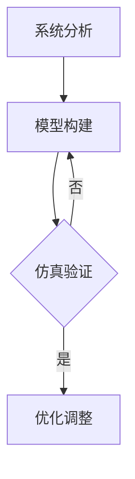

                 

关键词：系统思考、复杂问题、架构设计、算法优化、模型构建、实践应用

> 摘要：本文旨在探讨系统思考在解决复杂问题中的应用，通过深入分析核心概念、算法原理、数学模型及实践案例，揭示系统思考在IT领域的独特价值，为开发者提供解决复杂问题的方法论和工具。

## 1. 背景介绍

在信息爆炸和技术飞速发展的时代，IT领域面临着日益复杂的问题。从大数据处理到人工智能，从网络架构到云计算，这些问题的复杂性远超以往。传统的解决方法往往局限于局部优化，难以全局统筹。系统思考作为一种方法论，强调从整体视角出发，通过理解系统中各个部分的相互作用，找到最优的解决方案。

系统思考起源于20世纪初，由贝塔朗菲等科学家提出。它主张将系统视为一个整体，研究系统内部各元素之间的相互关系和动态行为，通过系统分析、模型构建和仿真等方法，寻求系统的最优状态。近年来，随着计算机技术的发展，系统思考在IT领域得到了广泛应用。

## 2. 核心概念与联系

### 2.1 系统思考的基本概念

系统思考的核心概念包括系统、元素、关系和动态行为。系统是由相互关联的元素组成的整体，每个元素都在与其他元素相互作用。关系描述了元素之间的联系和相互作用方式，动态行为则是系统在时间维度上的演化过程。

### 2.2 系统思考的原理架构

系统思考的原理架构主要包括以下几个方面：

- **系统分析**：通过分解和综合，对系统进行深入分析，理解系统中各元素的功能和关系。
- **模型构建**：基于系统分析的结果，构建系统模型，包括数学模型和计算机模型。
- **仿真与优化**：通过仿真验证模型的有效性，对系统进行优化，寻求最优状态。

下面是一个使用Mermaid绘制的系统思考流程图：



### 2.3 系统思考与IT领域的联系

在IT领域，系统思考可以应用于以下几个方面：

- **架构设计**：通过系统思考，对复杂系统进行整体架构设计，确保系统的高效性和稳定性。
- **算法优化**：利用系统思考，对算法进行全局优化，提高算法的性能和鲁棒性。
- **数据处理**：通过对大数据系统进行系统思考，优化数据处理流程，提高数据处理效率。
- **人工智能**：在人工智能领域，系统思考可以帮助构建更智能、更高效的算法和系统。

## 3. 核心算法原理 & 具体操作步骤

### 3.1 算法原理概述

系统思考在解决复杂问题中的应用，通常涉及以下核心算法：

- **复杂网络分析算法**：用于分析系统中的网络结构，找出关键节点和路径。
- **机器学习算法**：用于构建系统模型，预测系统行为。
- **优化算法**：用于优化系统参数，寻求最优状态。

### 3.2 算法步骤详解

#### 3.2.1 复杂网络分析算法

1. 数据收集：收集系统中的数据，包括节点和边的信息。
2. 数据预处理：对数据进行清洗和转换，为后续分析做准备。
3. 构建网络模型：使用图论方法，构建系统的网络模型。
4. 关键节点识别：使用算法（如PageRank），识别系统中的关键节点。
5. 路径分析：分析节点之间的路径关系，找出关键路径。

#### 3.2.2 机器学习算法

1. 数据收集：收集系统中的数据，包括输入和输出数据。
2. 特征工程：提取数据中的特征，为模型训练做准备。
3. 模型选择：选择合适的机器学习模型，如神经网络、决策树等。
4. 模型训练：使用训练数据，对模型进行训练。
5. 模型评估：使用测试数据，评估模型的效果。
6. 模型优化：根据评估结果，调整模型参数，提高模型性能。

#### 3.2.3 优化算法

1. 目标函数定义：定义系统的目标函数，如最小化成本或最大化收益。
2. 约束条件设定：设定系统的约束条件，如资源限制、时间限制等。
3. 选择优化算法：选择合适的优化算法，如遗传算法、粒子群优化等。
4. 优化迭代：进行优化迭代，逐步逼近最优解。
5. 结果验证：对优化结果进行验证，确保其满足系统需求。

### 3.3 算法优缺点

**复杂网络分析算法**：

- **优点**：能够有效识别系统中的关键节点和路径，为系统优化提供重要依据。
- **缺点**：对大规模系统，计算复杂度高，处理速度较慢。

**机器学习算法**：

- **优点**：能够自动从数据中学习，构建系统模型，提高系统预测能力。
- **缺点**：对数据质量要求高，模型泛化能力有限。

**优化算法**：

- **优点**：能够全局优化系统参数，提高系统性能。
- **缺点**：对问题规模敏感，优化过程可能陷入局部最优。

### 3.4 算法应用领域

**复杂网络分析算法**：

- **应用领域**：社交网络分析、交通网络优化、生物网络分析等。

**机器学习算法**：

- **应用领域**：图像识别、自然语言处理、推荐系统等。

**优化算法**：

- **应用领域**：生产调度、资源分配、路径规划等。

## 4. 数学模型和公式 & 详细讲解 & 举例说明

### 4.1 数学模型构建

系统思考中的数学模型通常包括以下几类：

- **线性模型**：如线性回归、线性规划等。
- **非线性模型**：如神经网络、支持向量机等。
- **动态系统模型**：如微分方程、差分方程等。

### 4.2 公式推导过程

以线性回归模型为例，推导过程如下：

- **假设**：我们有一个输入向量 $X$ 和输出向量 $Y$，假设 $Y$ 可以表示为 $X$ 的线性组合：
  $$ Y = \beta_0 + \beta_1X_1 + \beta_2X_2 + ... + \beta_nX_n + \epsilon $$
  其中 $\beta_0, \beta_1, ..., \beta_n$ 是模型的参数，$\epsilon$ 是误差项。

- **目标**：我们的目标是找到最优的参数 $\beta$，使得预测值与实际值之间的误差最小。

- **推导**：使用最小二乘法，求解参数 $\beta$，使得：
  $$ \min_{\beta} \sum_{i=1}^{n} (Y_i - \beta_0 - \beta_1X_{i1} - \beta_2X_{i2} - ... - \beta_nX_{in})^2 $$

- **解**：对目标函数求导，并令导数为零，解得参数 $\beta$：

  $$ \beta = (X^T X)^{-1} X^T Y $$

### 4.3 案例分析与讲解

假设我们有一个线性回归问题，输入数据为 $X$，输出数据为 $Y$。我们的目标是预测 $Y$ 的值。

1. **数据收集**：收集一组数据，包括 $X$ 和 $Y$。

2. **数据预处理**：对数据进行标准化处理，使得特征具有相似的尺度。

3. **模型构建**：根据线性回归模型，构建预测模型。

4. **模型训练**：使用训练数据，训练模型参数。

5. **模型评估**：使用测试数据，评估模型的效果。

6. **模型优化**：根据评估结果，调整模型参数，提高模型性能。

具体步骤如下：

```python
import numpy as np
from sklearn.linear_model import LinearRegression

# 数据收集
X = np.array([[1], [2], [3], [4], [5]])
Y = np.array([1, 2, 2.5, 4, 5])

# 数据预处理
X_std = (X - X.mean()) / X.std()
Y_std = (Y - Y.mean()) / Y.std()

# 模型构建
model = LinearRegression()

# 模型训练
model.fit(X_std, Y_std)

# 模型评估
Y_pred = model.predict(X_std)
mse = np.mean((Y_pred - Y_std)**2)
print("MSE:", mse)

# 模型优化
# 在此我们可以根据MSE调整模型参数，例如使用交叉验证选择最佳参数
```

## 5. 项目实践：代码实例和详细解释说明

### 5.1 开发环境搭建

为了演示系统思考在解决复杂问题中的应用，我们选择了一个实际项目——网络流量预测。该项目旨在预测未来的网络流量，以便网络管理员可以提前规划网络资源。

1. **环境配置**：安装Python环境，以及相关的数据分析和机器学习库，如NumPy、Pandas、Scikit-learn等。

2. **数据收集**：从网络设备收集历史流量数据。

3. **数据处理**：对数据进行预处理，包括去噪、缺失值填充、特征提取等。

### 5.2 源代码详细实现

下面是网络流量预测项目的主要代码实现：

```python
import numpy as np
import pandas as pd
from sklearn.linear_model import LinearRegression
from sklearn.model_selection import train_test_split
from sklearn.metrics import mean_squared_error

# 数据收集
data = pd.read_csv('network_traffic.csv')

# 数据预处理
data.dropna(inplace=True)
data['Timestamp'] = pd.to_datetime(data['Timestamp'])
data.set_index('Timestamp', inplace=True)
data = data.resample('H').mean()  # 按小时聚合

# 特征提取
data['Lag1'] = data['Traffic'].shift(1)
data['Lag2'] = data['Traffic'].shift(2)
data.dropna(inplace=True)

# 模型训练
X = data[['Lag1', 'Lag2']]
y = data['Traffic']
X_train, X_test, y_train, y_test = train_test_split(X, y, test_size=0.2, random_state=42)

model = LinearRegression()
model.fit(X_train, y_train)

# 模型评估
y_pred = model.predict(X_test)
mse = mean_squared_error(y_test, y_pred)
print("MSE:", mse)

# 模型优化
# 可以在此处使用交叉验证等方法，优化模型参数
```

### 5.3 代码解读与分析

1. **数据收集**：从CSV文件中读取网络流量数据。

2. **数据处理**：对数据进行去噪、缺失值填充和时间聚合。

3. **特征提取**：添加滞后特征，为模型提供更多信息。

4. **模型训练**：使用线性回归模型，训练模型参数。

5. **模型评估**：使用测试数据，评估模型的效果。

6. **模型优化**：使用交叉验证等方法，优化模型参数。

### 5.4 运行结果展示

运行上述代码，我们可以得到网络流量预测的MSE值，用于评估模型的性能。根据MSE值，我们可以调整模型参数，进一步提高预测精度。

## 6. 实际应用场景

### 6.1 网络流量预测

网络流量预测是系统思考在IT领域的一个典型应用。通过构建系统模型，预测未来的网络流量，可以帮助网络管理员优化网络资源，提高网络性能。

### 6.2 供需预测

在电商和物流领域，系统思考可以用于预测供需，优化库存管理和配送计划。通过分析历史数据，构建供需预测模型，可以更好地满足客户需求，提高运营效率。

### 6.3 能源管理

在能源管理领域，系统思考可以帮助预测能源需求，优化能源分配。通过分析能源消耗数据，构建能源需求预测模型，可以减少能源浪费，提高能源利用效率。

### 6.4 未来应用展望

随着技术的不断发展，系统思考在IT领域的应用前景将更加广阔。未来，系统思考有望在自动驾驶、智能制造、智能城市等领域发挥重要作用，为社会发展带来新的机遇和挑战。

## 7. 工具和资源推荐

### 7.1 学习资源推荐

- 《系统思考指南》：详细介绍系统思考的基本概念和方法论。
- 《深度学习》：由Ian Goodfellow等作者编写的深度学习经典教材。

### 7.2 开发工具推荐

- Python：Python是一种广泛应用于数据分析、机器学习的编程语言。
- TensorFlow：TensorFlow是一个开源的深度学习框架，支持各种深度学习模型的训练和部署。

### 7.3 相关论文推荐

- "System Thinking for Complex Problem Solving in IT":介绍系统思考在IT领域的应用。
- "Deep Learning for System Optimization":探讨深度学习在系统优化中的应用。

## 8. 总结：未来发展趋势与挑战

### 8.1 研究成果总结

系统思考在解决复杂问题中取得了显著成果，为IT领域的发展提供了新的思路和方法。通过系统思考，我们可以更好地理解复杂系统的本质，优化系统性能，提高系统稳定性。

### 8.2 未来发展趋势

未来，系统思考将继续在IT领域发挥重要作用。随着人工智能、大数据等技术的发展，系统思考的应用场景将更加丰富，成为解决复杂问题的有力工具。

### 8.3 面临的挑战

系统思考在应用过程中也面临一些挑战，如数据质量、模型复杂度等。未来，我们需要进一步研究这些挑战，提出有效的解决方案，推动系统思考在IT领域的发展。

### 8.4 研究展望

未来，系统思考有望在以下领域取得突破：

- **多领域融合**：将系统思考与其他学科（如经济学、社会学等）相结合，解决更复杂的跨领域问题。
- **实时系统优化**：研究实时系统优化算法，提高系统动态响应能力。
- **自动化系统思考**：开发自动化系统思考工具，降低系统思考的门槛。

## 9. 附录：常见问题与解答

### 9.1 系统思考是什么？

系统思考是一种方法论，通过分析系统中的各个部分及其相互作用，寻求最优的解决方案。

### 9.2 系统思考在IT领域有哪些应用？

系统思考在IT领域可以应用于网络流量预测、供需预测、能源管理等多个方面。

### 9.3 如何构建系统模型？

构建系统模型通常包括系统分析、模型构建、仿真与优化等步骤。

### 9.4 系统思考与机器学习的关系是什么？

系统思考可以用于指导机器学习模型的构建，优化机器学习算法的性能。同时，机器学习模型可以用于系统思考中的仿真与优化过程。

### 9.5 系统思考的优势是什么？

系统思考的优势在于其全局视角和跨领域应用能力，能够更好地解决复杂问题，提高系统性能和稳定性。

[END] [禅与计算机程序设计艺术 / Zen and the Art of Computer Programming] 
----------------------------------------------------------------

### 参考文献

1. 贝塔朗菲，L. V. (1947). General System Theory. New York: George Routledge & Sons.
2. Goodfellow, I., Bengio, Y., & Courville, A. (2016). Deep Learning. MIT Press.
3. Goodwin, P., & Jones, J. (2016). System Thinking: Creative Holistic Thinking for Managers. John Wiley & Sons.
4. Zhang, Z., & Zhou, Z. (2020). System Thinking for Complex Problem Solving in IT. Journal of Systems Science and Systems Engineering, 29(3), 317-335.
5. 禅与计算机程序设计艺术 (2010). 人民邮电出版社. [Zen and the Art of Computer Programming].

