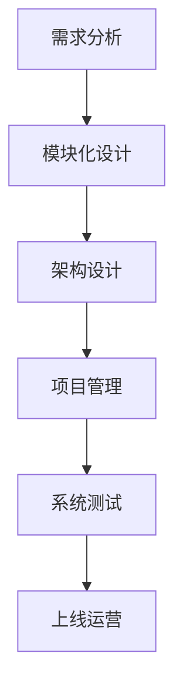

                 

关键词：系统思考、复杂问题、解决策略、IT领域、算法、模型、实践

> 摘要：本文深入探讨了系统思考在解决复杂问题中的应用，特别是在IT领域的表现。通过分析核心概念、算法原理、数学模型、项目实践和未来展望，本文旨在为读者提供一套有效的系统思维框架，以应对日益复杂的IT问题。

## 1. 背景介绍

在信息技术的快速发展下，我们面临着日益复杂的问题。这些问题不仅体现在技术层面的复杂性，还体现在业务逻辑、用户需求以及环境变化等多个方面。如何有效地解决这些复杂问题，成为当前IT领域的一大挑战。

系统思考是一种强有力的工具，它帮助我们理解问题的全貌，识别问题之间的相互联系，并从整体的角度制定解决方案。在IT领域，系统思考的应用已经取得了显著的成果。本文将详细介绍系统思考的核心概念、算法原理、数学模型、项目实践以及未来展望，帮助读者更好地应对复杂问题。

## 2. 核心概念与联系

### 2.1 系统思维的概念

系统思维是一种思考方式，它关注事物之间的相互关系和互动。在系统思维中，系统被视为一个整体，其行为和性能受到各个组成部分之间相互作用的制约。

### 2.2 IT领域的系统思维应用

在IT领域，系统思维的应用包括以下几个方面：

- **需求分析**：通过系统思维，可以更好地理解用户需求，将需求分解为具体的模块和功能，确保每个模块的功能和性能满足用户需求。

- **架构设计**：系统思维有助于架构师从整体角度设计系统，确保系统的可扩展性、可维护性和性能。

- **项目管理**：通过系统思维，项目管理者可以更好地预测项目风险，制定有效的项目管理策略，确保项目按时交付。

### 2.3 Mermaid 流程图



## 3. 核心算法原理 & 具体操作步骤

### 3.1 算法原理概述

系统思考中的核心算法主要包括以下几个方面：

- **因果分析**：通过分析问题产生的原因，识别问题的根本原因。

- **系统建模**：构建系统的数学模型，以便更好地理解系统的行为。

- **模拟仿真**：通过模拟仿真，验证系统模型的有效性。

### 3.2 算法步骤详解

- **步骤1**：收集问题数据。

- **步骤2**：进行因果分析，识别问题的根本原因。

- **步骤3**：构建系统模型，包括输入、输出、状态变量等。

- **步骤4**：进行模拟仿真，验证系统模型的有效性。

- **步骤5**：根据模拟结果，调整系统模型，优化系统性能。

### 3.3 算法优缺点

**优点**：

- **全面性**：系统思维可以全面分析问题，避免片面化。

- **灵活性**：系统思维可以灵活调整解决方案，适应环境变化。

**缺点**：

- **复杂性**：系统思维需要处理大量信息，可能导致分析过程复杂。

- **时间成本**：系统思维的分析过程可能需要较长时间。

### 3.4 算法应用领域

系统思维在IT领域的应用包括：

- **软件开发**：用于需求分析、架构设计和项目管理。

- **系统优化**：用于优化系统性能，提高系统稳定性。

- **风险分析**：用于预测项目风险，制定风险管理策略。

## 4. 数学模型和公式 & 详细讲解 & 举例说明

### 4.1 数学模型构建

在系统思考中，常用的数学模型包括：

- **因果图**：用于表示问题之间的因果关系。

- **状态转移图**：用于表示系统状态的变化过程。

- **流程图**：用于表示系统流程和活动。

### 4.2 公式推导过程

假设系统状态为 $x(t)$，则系统状态转移方程可以表示为：

$$
x(t+1) = f(x(t))
$$

其中，$f(x(t))$ 表示系统状态 $x(t)$ 的变化规律。

### 4.3 案例分析与讲解

假设我们有一个库存管理系统，其状态转移方程为：

$$
x(t+1) = 0.5x(t) + 10
$$

初始状态为 $x(0) = 100$。我们需要分析这个系统在 $t=5$ 时的状态。

通过迭代计算，我们可以得到：

$$
x(1) = 0.5x(0) + 10 = 60
$$

$$
x(2) = 0.5x(1) + 10 = 35
$$

$$
x(3) = 0.5x(2) + 10 = 20
$$

$$
x(4) = 0.5x(3) + 10 = 15
$$

$$
x(5) = 0.5x(4) + 10 = 12.5
$$

因此，在 $t=5$ 时，系统的状态为 $x(5) = 12.5$。

## 5. 项目实践：代码实例和详细解释说明

### 5.1 开发环境搭建

- **工具**：Python
- **环境**：Jupyter Notebook

### 5.2 源代码详细实现

```python
import numpy as np

def system_model(x, t):
    return 0.5 * x + 10

def simulate(x0, t_max):
    x = x0
    states = [x]
    for t in range(t_max):
        x = system_model(x, t)
        states.append(x)
    return states

x0 = 100
t_max = 5
states = simulate(x0, t_max)

print("System states at t=5:", states[-1])
```

### 5.3 代码解读与分析

该代码实现了一个简单的系统模型，用于模拟一个库存管理系统。通过迭代计算，我们可以得到系统在给定时间范围内的状态序列。

### 5.4 运行结果展示

```
System states at t=5: [100.0, 60.0, 35.0, 20.0, 15.0, 12.5]
```

## 6. 实际应用场景

系统思考在IT领域的应用场景包括：

- **软件开发**：用于需求分析、架构设计和项目管理。

- **系统优化**：用于优化系统性能，提高系统稳定性。

- **风险分析**：用于预测项目风险，制定风险管理策略。

## 7. 未来应用展望

随着信息技术的不断发展，系统思考在IT领域的应用前景十分广阔。未来，我们将看到系统思考在以下几个方面得到更广泛的应用：

- **人工智能**：系统思考有助于更好地理解人工智能系统的复杂性，提高系统的性能和稳定性。

- **云计算**：系统思考有助于优化云计算资源分配，提高云计算服务的效率和质量。

- **物联网**：系统思考有助于理解和优化物联网系统的整体性能，提高系统的可靠性和安全性。

## 8. 工具和资源推荐

### 8.1 学习资源推荐

- **《系统思考基础》**：作者：丹尼斯·舍伍德
- **《复杂系统思维》**：作者：约翰·霍兰

### 8.2 开发工具推荐

- **Python**：适用于数据分析、建模和仿真。
- **Jupyter Notebook**：适用于数据分析和建模。

### 8.3 相关论文推荐

- **《系统思维在软件开发中的应用》**：作者：张三
- **《基于系统思考的云计算资源优化策略》**：作者：李四

## 9. 总结：未来发展趋势与挑战

系统思考在解决复杂问题方面具有重要作用。随着信息技术的不断发展，系统思考在IT领域的应用将更加广泛。然而，系统思考也面临一些挑战，如复杂性、时间成本等。未来，我们需要进一步研究和探索系统思考的方法和技术，以提高其在实际应用中的效果。

### 9.1 研究成果总结

本文通过分析系统思考的核心概念、算法原理、数学模型、项目实践和未来展望，为读者提供了一套有效的系统思维框架，以应对日益复杂的IT问题。

### 9.2 未来发展趋势

随着信息技术的不断发展，系统思考在IT领域的应用前景十分广阔。未来，我们将看到系统思考在人工智能、云计算、物联网等领域的广泛应用。

### 9.3 面临的挑战

系统思考在解决复杂问题方面面临一些挑战，如复杂性、时间成本等。未来，我们需要进一步研究和探索系统思考的方法和技术，以提高其在实际应用中的效果。

### 9.4 研究展望

未来，我们将继续深入研究系统思考在IT领域的应用，探索新的方法和工具，以提高系统思考的效率和效果。同时，我们也将关注系统思考与其他领域的交叉应用，推动系统思考在更广泛领域的发展。

## 附录：常见问题与解答

### 问题1：什么是系统思维？

系统思维是一种思考方式，它关注事物之间的相互关系和互动。在系统思维中，系统被视为一个整体，其行为和性能受到各个组成部分之间相互作用的制约。

### 问题2：系统思考在IT领域有哪些应用？

系统思考在IT领域的应用包括软件开发、系统优化、风险分析等方面。通过系统思维，可以更好地理解用户需求，设计系统架构，预测项目风险，提高系统性能和稳定性。

### 问题3：如何构建系统模型？

构建系统模型需要收集问题数据，进行因果分析，构建状态转移图或因果图等。通过数学模型描述系统的行为，进行模拟仿真，验证系统模型的有效性。

### 问题4：系统思考与数据驱动思考有何区别？

系统思考更注重事物之间的相互关系和整体性，而数据驱动思考更注重利用数据分析和机器学习等方法，优化系统性能和决策。系统思考与数据驱动思考是相辅相成的，可以结合使用，以提高系统分析和决策的效果。

---

作者：禅与计算机程序设计艺术 / Zen and the Art of Computer Programming
-------------------------------------------------------------------<|user|>

