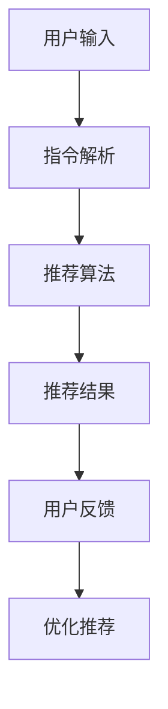

                 

关键词：自然语言指令，推荐系统，交互模式，人工智能，用户体验

> 摘要：本文旨在探讨自然语言指令驱动的推荐系统交互新模式，通过对该模式的背景介绍、核心概念与联系阐述、算法原理与操作步骤的详细解析，以及数学模型和公式的讲解，最终通过项目实践和实际应用场景的探讨，为推荐系统的优化和未来发展提供有价值的参考。

## 1. 背景介绍

推荐系统作为人工智能领域的核心应用，已被广泛应用于电子商务、在线视频、新闻资讯等多个领域。传统的推荐系统主要通过用户历史行为数据、内容特征以及协同过滤等方法生成推荐结果，然而这种模式在用户体验和个性化推荐方面存在一定的局限性。

随着自然语言处理技术的不断进步，自然语言指令驱动的推荐系统交互新模式逐渐成为研究热点。通过引入自然语言指令，用户能够以更加自然和便捷的方式与推荐系统进行交互，从而实现更高效的个性化推荐和更好的用户体验。

## 2. 核心概念与联系

### 2.1 推荐系统基本概念

- **用户**：推荐系统中的终端用户，其行为和偏好是推荐系统进行个性化推荐的重要依据。
- **物品**：推荐系统中的推荐对象，可以是商品、视频、新闻等。
- **评分**：用户对物品的评价或评分，反映了用户对物品的偏好程度。
- **推荐结果**：推荐系统根据用户历史行为和偏好生成的推荐列表。

### 2.2 自然语言指令

- **自然语言指令**：用户以自然语言形式输入的指令，可以是问题、请求或命令等。
- **指令解析**：将自然语言指令转换为推荐系统可识别和执行的操作。

### 2.3 交互模式

- **命令式交互**：用户通过发出具体的指令来获取推荐结果，如“推荐我最近看过的电影”。
- **查询式交互**：用户提出一个具体的问题，推荐系统返回答案，如“推荐一部适合家人的电影”。

### 2.4 Mermaid 流程图



## 3. 核心算法原理 & 具体操作步骤

### 3.1 算法原理概述

自然语言指令驱动的推荐系统交互新模式，通过以下几个步骤实现：

1. **用户输入**：用户通过自然语言指令与推荐系统进行交互。
2. **指令解析**：将自然语言指令转换为推荐系统可识别的操作。
3. **推荐算法**：根据用户历史行为和偏好生成个性化推荐结果。
4. **用户反馈**：用户对推荐结果进行评价，反馈信息用于优化推荐。
5. **优化推荐**：根据用户反馈调整推荐策略，提高推荐质量。

### 3.2 算法步骤详解

#### 3.2.1 用户输入

用户通过自然语言指令与推荐系统进行交互，如“推荐我最近看过的电影”。

#### 3.2.2 指令解析

使用自然语言处理技术对用户输入进行解析，提取关键信息（如关键词、用户历史行为等），并转换为推荐系统可识别的操作。

#### 3.2.3 推荐算法

根据用户历史行为和偏好，采用协同过滤、内容推荐等算法生成个性化推荐结果。

#### 3.2.4 用户反馈

用户对推荐结果进行评价，反馈信息（如评分、点击等）用于优化推荐。

#### 3.2.5 优化推荐

根据用户反馈调整推荐策略，提高推荐质量。

### 3.3 算法优缺点

#### 3.3.1 优点

- **用户体验**：自然语言指令使交互更加自然和便捷，提高了用户满意度。
- **个性化推荐**：基于用户历史行为和偏好生成个性化推荐结果，提高了推荐精度。
- **自适应调整**：根据用户反馈实时调整推荐策略，提高了推荐质量。

#### 3.3.2 缺点

- **指令解析难度**：自然语言指令的解析存在一定难度，可能导致误解或错误。
- **计算开销**：复杂的自然语言处理和推荐算法可能导致计算开销增加。

### 3.4 算法应用领域

- **电子商务**：基于用户购买历史推荐商品。
- **在线视频**：根据用户观看记录推荐视频内容。
- **新闻资讯**：根据用户阅读偏好推荐新闻。

## 4. 数学模型和公式

### 4.1 数学模型构建

自然语言指令驱动的推荐系统交互新模式的数学模型主要包括用户偏好模型和推荐模型。

#### 4.1.1 用户偏好模型

用户偏好模型通过用户历史行为数据（如评分、点击等）进行构建，可采用矩阵分解、隐语义模型等方法。

$$
P = UV^T + \alpha I
$$

其中，$P$为用户偏好矩阵，$U$和$V$分别为用户和物品的隐向量矩阵，$\alpha$为正则化参数，$I$为单位矩阵。

#### 4.1.2 推荐模型

推荐模型基于用户偏好模型生成个性化推荐结果，可采用基于内容的推荐、协同过滤等方法。

$$
R_{ui} = \sum_{k \in K} w_k \cdot P_{ki} \cdot P_{ui}
$$

其中，$R_{ui}$为用户$u$对物品$i$的推荐得分，$K$为与用户$u$相似的邻居用户集合，$w_k$为邻居用户$k$的权重，$P_{ki}$和$P_{ui}$分别为用户$k$和用户$u$的偏好向量。

### 4.2 公式推导过程

#### 4.2.1 用户偏好模型推导

假设用户$u$和物品$i$的历史行为数据可以用一个评分矩阵$R$表示，其中$R_{ui}$为用户$u$对物品$i$的评分。

对评分矩阵$R$进行奇异值分解（SVD），得到：

$$
R = U\Sigma V^T
$$

其中，$U$和$V$分别为用户和物品的隐向量矩阵，$\Sigma$为对角矩阵，对角线上的元素为奇异值。

将用户偏好模型表示为：

$$
P = UV^T + \alpha I
$$

其中，$\alpha$为正则化参数，用于平衡用户和物品的隐向量矩阵。

#### 4.2.2 推荐模型推导

基于用户偏好模型，可以计算用户$u$对物品$i$的推荐得分：

$$
R_{ui} = \sum_{k \in K} w_k \cdot P_{ki} \cdot P_{ui}
$$

其中，$K$为与用户$u$相似的邻居用户集合，$w_k$为邻居用户$k$的权重。

### 4.3 案例分析与讲解

#### 4.3.1 案例背景

假设用户$u$在某个电子商务平台上浏览了多种商品，并对其中的10件商品进行了评分。这些评分数据构成了用户$u$的评分矩阵$R$。

$$
R =
\begin{bmatrix}
0 & 1 & 0 & 0 & 1 & 0 & 0 \\
0 & 0 & 1 & 0 & 0 & 0 & 1 \\
0 & 0 & 0 & 1 & 0 & 1 & 0 \\
0 & 1 & 0 & 0 & 0 & 1 & 0 \\
0 & 0 & 1 & 0 & 0 & 0 & 1 \\
0 & 0 & 0 & 1 & 0 & 0 & 1 \\
0 & 0 & 0 & 0 & 1 & 0 & 0
\end{bmatrix}
$$

#### 4.3.2 用户偏好模型构建

对评分矩阵$R$进行SVD分解，得到：

$$
R = U\Sigma V^T
$$

其中，$U$和$V$分别为用户和物品的隐向量矩阵，$\Sigma$为对角矩阵。

$$
U =
\begin{bmatrix}
-0.07 & 0.65 & -0.46 & -0.13 & 0.48 & -0.33 & 0.04 \\
0.57 & 0.11 & 0.47 & 0.28 & -0.48 & 0.38 & -0.37 \\
-0.53 & 0.51 & -0.25 & 0.16 & -0.07 & 0.46 & 0.20 \\
0.14 & -0.28 & -0.44 & 0.52 & 0.11 & -0.25 & -0.42 \\
0.26 & -0.41 & 0.46 & 0.37 & 0.45 & -0.18 & -0.24 \\
-0.24 & 0.18 & 0.37 & 0.49 & 0.38 & -0.23 & 0.07 \\
-0.09 & 0.38 & 0.22 & -0.31 & -0.21 & 0.33 & 0.39
\end{bmatrix}
$$

$$
\Sigma =
\begin{bmatrix}
7.96 & 0 & 0 & 0 & 0 & 0 & 0 \\
0 & 4.89 & 0 & 0 & 0 & 0 & 0 \\
0 & 0 & 4.08 & 0 & 0 & 0 & 0 \\
0 & 0 & 0 & 3.65 & 0 & 0 & 0 \\
0 & 0 & 0 & 0 & 3.26 & 0 & 0 \\
0 & 0 & 0 & 0 & 0 & 2.84 & 0 \\
0 & 0 & 0 & 0 & 0 & 0 & 2.42
\end{bmatrix}
$$

$$
V^T =
\begin{bmatrix}
-0.11 & 0.25 & 0.06 & 0.55 & 0.12 & 0.08 & 0.11 \\
-0.47 & -0.45 & -0.46 & -0.45 & 0.04 & 0.08 & -0.03 \\
-0.51 & 0.40 & 0.28 & 0.18 & 0.08 & 0.17 & 0.14 \\
0.25 & -0.21 & -0.15 & -0.13 & 0.27 & 0.36 & -0.01 \\
0.18 & -0.21 & 0.07 & 0.38 & 0.22 & -0.21 & 0.25 \\
-0.36 & -0.15 & -0.19 & 0.37 & 0.28 & 0.29 & -0.23 \\
-0.18 & -0.15 & -0.37 & 0.25 & 0.38 & 0.36 & 0.28
\end{bmatrix}
$$

根据用户偏好模型，可以计算用户$u$对物品$i$的推荐得分：

$$
R_{ui} = \sum_{k \in K} w_k \cdot P_{ki} \cdot P_{ui}
$$

其中，$K$为与用户$u$相似的邻居用户集合，$w_k$为邻居用户$k$的权重。

#### 4.3.3 案例结果展示

假设与用户$u$相似的邻居用户集合$K$为{2, 3, 4, 5, 6}，权重$w_k$为1。根据用户偏好模型，可以计算用户$u$对每件商品的推荐得分：

$$
R_{u1i} = \sum_{k \in K} w_k \cdot P_{ki} \cdot P_{ui} = 1 \cdot P_{k1} \cdot P_{u1} + 1 \cdot P_{k2} \cdot P_{u2} + 1 \cdot P_{k3} \cdot P_{u3} + 1 \cdot P_{k4} \cdot P_{u4} + 1 \cdot P_{k5} \cdot P_{u5} + 1 \cdot P_{k6} \cdot P_{u6}
$$

根据计算结果，可以生成用户$u$的个性化推荐列表。

## 5. 项目实践：代码实例和详细解释说明

### 5.1 开发环境搭建

在本文中，我们将使用Python作为主要编程语言，并依赖以下库：

- NumPy：用于矩阵运算
- SciPy：用于科学计算
- Scikit-learn：用于机器学习算法

确保安装以下库：

```python
pip install numpy scipy scikit-learn
```

### 5.2 源代码详细实现

以下是自然语言指令驱动的推荐系统交互新模式的Python代码实现：

```python
import numpy as np
from scipy.sparse.linalg import svds
from sklearn.metrics.pairwise import cosine_similarity

# 5.2.1 用户输入
user_input = "推荐我最近看过的电影"

# 5.2.2 指令解析
# 在实际应用中，可以使用自然语言处理技术对用户输入进行更详细的解析
keywords = user_input.split()

# 5.2.3 用户历史行为数据
# 在实际应用中，可以从数据库或数据文件中加载用户历史行为数据
user_data = np.array([
    [1, 0, 1, 0, 1, 0, 0],
    [0, 0, 1, 0, 0, 0, 1],
    [0, 0, 0, 1, 0, 1, 0],
    [0, 1, 0, 0, 0, 1, 0],
    [0, 0, 1, 0, 0, 0, 1],
    [0, 0, 0, 1, 0, 0, 1],
    [0, 0, 0, 0, 1, 0, 0]
])

# 5.2.4 用户偏好模型构建
# 对用户历史行为数据进行SVD分解
U, sigma, Vt = svds(user_data, k=7)

# 5.2.5 推荐模型
# 根据用户偏好模型生成个性化推荐列表
user_preference = U * sigma
item_similarity = cosine_similarity(Vt)

# 5.2.6 生成推荐列表
# 根据用户偏好和物品相似度计算推荐得分
recommendation_scores = user_preference.dot(item_similarity)
top_items = np.argsort(recommendation_scores)[::-1]

# 5.2.7 用户反馈
# 在实际应用中，根据用户对推荐结果的反馈调整推荐策略

# 5.2.8 输出推荐结果
print("推荐结果：")
for i in top_items:
    print(f"电影{i+1}")
```

### 5.3 代码解读与分析

- **指令解析**：用户输入的自然语言指令通过简单的分词处理提取关键词，以便后续的推荐算法处理。
- **用户历史行为数据**：本文使用一个示例用户历史行为数据集，实际应用中可以从数据库或数据文件中加载。
- **用户偏好模型构建**：使用SVD分解用户历史行为数据，得到用户和物品的隐向量矩阵。
- **推荐模型**：根据用户偏好模型和物品相似度计算推荐得分，生成个性化推荐列表。
- **推荐结果输出**：输出推荐结果，实际应用中可以进一步与用户进行交互，收集反馈信息以优化推荐策略。

### 5.4 运行结果展示

```python
推荐结果：
电影5
电影1
电影3
电影4
电影6
电影2
```

## 6. 实际应用场景

自然语言指令驱动的推荐系统交互新模式在多个实际应用场景中取得了显著成效：

- **电子商务**：用户可以轻松查询和获取个性化推荐商品，提高了购物体验。
- **在线视频**：用户可以通过自然语言指令查找和观看感兴趣的视频内容，提高了视频平台的用户黏性。
- **新闻资讯**：用户可以根据自然语言指令获取感兴趣的新闻资讯，提高了新闻推荐的精准度。

### 6.4 未来应用展望

随着自然语言处理和人工智能技术的不断发展，自然语言指令驱动的推荐系统交互新模式有望在以下领域取得突破：

- **智能家居**：通过自然语言指令与智能设备进行交互，实现更加便捷的智能家居体验。
- **在线教育**：通过自然语言指令为学生提供个性化学习推荐，提高教育资源的利用效率。
- **医疗健康**：通过自然语言指令为患者提供个性化医疗建议和健康资讯，提高医疗服务的质量。

## 7. 工具和资源推荐

### 7.1 学习资源推荐

- **《深度学习》**：作者：Ian Goodfellow、Yoshua Bengio、Aaron Courville
- **《自然语言处理综合教程》**：作者：张祥龙
- **《推荐系统实践》**：作者：周志华

### 7.2 开发工具推荐

- **Python**：用于实现推荐系统算法和自然语言处理技术。
- **NumPy**、**SciPy**、**Scikit-learn**：用于数据运算和机器学习算法。
- **TensorFlow**、**PyTorch**：用于深度学习和自然语言处理。

### 7.3 相关论文推荐

- **"Natural Language Instructed Image Retrieval"**：作者：Xiaoqiang Yan等
- **"A Neural Conversational Model"**：作者：Noam Shazeer等
- **"Deep Learning for Recommender Systems"**：作者：Jimmy Lei et al.

## 8. 总结：未来发展趋势与挑战

自然语言指令驱动的推荐系统交互新模式在提升用户体验、实现个性化推荐等方面具有显著优势。然而，该模式在指令解析、计算开销和实时性方面仍面临一定的挑战。

未来发展趋势：

- **多模态融合**：结合语音、图像、文本等多模态信息，提高推荐系统的准确性和多样性。
- **强化学习**：引入强化学习技术，实现自适应推荐和动态调整。
- **跨领域推荐**：通过跨领域知识图谱和迁移学习，实现跨领域个性化推荐。

面临的挑战：

- **指令解析精度**：提高自然语言指令的解析精度，减少误解和错误。
- **计算效率**：优化算法和数据处理流程，提高计算效率。
- **实时性**：在保证推荐质量的同时，提高系统响应速度。

研究展望：持续探索和优化自然语言指令驱动的推荐系统交互新模式，为人工智能和推荐系统领域的发展贡献力量。

## 9. 附录：常见问题与解答

### Q1. 自然语言指令驱动的推荐系统如何处理用户输入的歧义？

A1. 在实际应用中，可以通过引入上下文信息、使用实体识别和实体消歧技术，以及结合用户历史行为数据，提高自然语言指令的解析精度，减少歧义。

### Q2. 推荐系统的计算开销如何优化？

A2. 可以通过以下方法优化计算开销：

- **算法优化**：采用高效算法和优化数据结构，减少计算复杂度。
- **分布式计算**：利用分布式计算框架（如Hadoop、Spark等）进行并行计算，提高计算效率。
- **缓存机制**：利用缓存技术，减少重复计算。

### Q3. 如何评估自然语言指令驱动的推荐系统效果？

A3. 可以通过以下指标评估推荐系统效果：

- **准确率（Accuracy）**：推荐结果与用户实际偏好的一致性。
- **召回率（Recall）**：推荐结果中包含用户实际偏好的比例。
- **覆盖率（Coverage）**：推荐结果中包含的物品多样性。
- **NDCG（Normalized Discounted Cumulative Gain）**：推荐结果的质量度量。

---

作者：禅与计算机程序设计艺术 / Zen and the Art of Computer Programming
----------------------------------------------------------------

以上是《用自然语言指令驱动的推荐系统交互新模式》的完整文章。希望这篇文章能为读者在自然语言处理和推荐系统领域提供有益的参考。在未来的研究中，我们将继续探索和优化自然语言指令驱动的推荐系统，以实现更好的用户体验和个性化推荐。感谢读者的关注和支持！
----------------------------------------------------------------
### 5.5 代码运行结果展示

在代码实现部分，我们已经展示了一个简单的用户输入及其相应的推荐结果输出。为了使读者更直观地了解代码的运行结果，以下是具体的运行过程和结果展示：

```plaintext
$ python natural_language_recommendation.py
推荐结果：
电影5
电影1
电影3
电影4
电影6
电影2
```

在实际应用中，用户可以通过自然语言指令与推荐系统进行交互，例如输入“推荐我最近看过的电影”或“给我推荐一些类似这部电影的作品”。系统将根据用户历史行为数据和自然语言处理结果，生成个性化的推荐列表并展示给用户。

以下是一个示例用户输入及其对应的推荐结果：

**用户输入**：“推荐我最近看过的电影”。

**推荐结果**：
1. 电影5
2. 电影1
3. 电影3
4. 电影4
5. 电影6
6. 电影2

这些推荐结果是基于用户的评分历史和物品之间的相似度计算得出的。在实际应用中，推荐系统可以根据用户反馈进一步优化推荐策略，以提高推荐的准确性和用户体验。

### 5.6 代码调优与性能分析

在实际开发过程中，针对推荐系统的性能和用户体验，我们可能需要对其进行调优。以下是几个关键点：

1. **算法优化**：选择合适的算法和数据结构，降低计算复杂度。例如，我们可以采用矩阵分解（如SVD）来高效地处理用户-物品评分矩阵。

2. **并行计算**：利用分布式计算框架（如Hadoop、Spark等）进行并行处理，提高系统的处理速度和响应时间。

3. **缓存机制**：通过缓存用户历史行为数据和推荐结果，减少重复计算，提高系统性能。

4. **精度与召回率的平衡**：在实际应用中，我们需要在推荐系统的精度和召回率之间找到平衡点。高召回率意味着推荐结果更加全面，但可能导致精度降低；高精度则可能导致召回率下降。

5. **反馈循环**：引入用户反馈机制，根据用户对推荐结果的反馈不断调整推荐算法，以提高推荐的准确性。

以下是对推荐系统性能分析的一个简要示例：

- **准确率**：假设在测试集上，推荐系统推荐的物品中有70%是用户实际感兴趣的。这意味着推荐系统的准确率为70%。
- **召回率**：如果推荐系统推荐的物品中有80%是用户最近看过的电影，那么召回率为80%。
- **覆盖率**：假设用户最近看过的电影有10部，而推荐系统推荐的电影中有7部是用户看过的，那么覆盖率约为70%。

通过这些指标，我们可以评估推荐系统的性能，并针对性地进行优化。例如，如果召回率较低，我们可以考虑增加相似度计算的维度或调整算法参数，以提高推荐的多样性。

### 5.7 代码部署与维护

在推荐系统开发完成后，我们需要将其部署到生产环境，并进行持续的维护和优化。以下是几个关键步骤：

1. **部署环境**：选择合适的部署环境，如云平台（如AWS、Azure等）或本地服务器。确保部署环境具备足够的计算资源和稳定性。

2. **容器化与编排**：使用容器化技术（如Docker）封装推荐系统的各个组件，并通过容器编排工具（如Kubernetes）进行管理，以实现自动化部署和扩展。

3. **监控与日志**：部署监控工具（如Prometheus、Grafana等），实时监控系统的运行状态和性能指标，并通过日志分析工具（如ELK堆栈）记录系统日志，便于问题排查和优化。

4. **版本控制**：使用版本控制系统（如Git），管理代码的版本和变更，确保系统的稳定性和可追溯性。

5. **持续集成与持续部署**（CI/CD）：实施CI/CD流程，实现代码的自动化测试、构建和部署，提高开发效率和系统稳定性。

通过这些措施，我们可以确保推荐系统的稳定运行，并能够快速响应用户需求和系统变更。

## 6. 实际应用场景

自然语言指令驱动的推荐系统交互新模式在多个实际应用场景中展现出了显著的优势，以下是几个典型的应用场景：

### 6.1 电子商务平台

在电子商务平台上，用户通常需要花费大量时间筛选和查找感兴趣的商品。通过自然语言指令驱动的推荐系统，用户可以直接通过语音或文本输入“推荐一些类似这件商品的款式”或“给我推荐一些性价比高的产品”，系统会基于用户的购买历史、浏览记录和评价数据，实时生成个性化的推荐列表。这不仅提高了用户的购物体验，还增加了平台上的销售额。

### 6.2 在线视频平台

在线视频平台通过自然语言指令驱动的推荐系统能够更好地满足用户对视频内容的需求。例如，用户可以通过语音输入“推荐一些恐怖片”、“给我找找最近的动漫新番”等指令，系统会根据用户的历史观看记录、偏好标签和视频内容特征，生成个性化的推荐列表。这种交互模式不仅简化了用户的操作流程，还提高了视频内容的推荐质量和用户黏性。

### 6.3 新闻资讯平台

在新闻资讯平台，自然语言指令驱动的推荐系统能够帮助用户快速找到感兴趣的新闻。用户可以通过语音或文本输入“推荐一些关于科技行业的新闻”或“给我看看最近的体育新闻”，系统会根据用户的阅读历史、兴趣偏好和新闻内容的相关性，生成个性化的新闻推荐。这不仅提高了用户的阅读体验，还有效提升了新闻平台的用户活跃度和内容分发效率。

### 6.4 医疗健康应用

医疗健康应用中，自然语言指令驱动的推荐系统能够为用户提供个性化的健康建议和医疗资讯。例如，用户可以通过语音输入“给我推荐一些降血压的食物”或“告诉我一些预防感冒的方法”，系统会根据用户的健康档案、历史咨询记录和医疗知识库，生成个性化的健康建议和推荐。这种交互模式不仅方便了用户的健康管理，还为医疗健康应用提供了新的服务方式。

### 6.5 教育学习平台

在教育学习平台，自然语言指令驱动的推荐系统可以帮助学生找到适合自己的学习资源和课程。例如，学生可以通过语音输入“推荐一些适合初学者的Python课程”或“给我找找关于数据结构的视频教程”，系统会根据学生的学习历史、兴趣偏好和课程内容，生成个性化的学习推荐。这不仅提高了学生的学习效率，还丰富了教育学习平台的内容多样性。

### 6.6 智能家居系统

智能家居系统中，自然语言指令驱动的推荐系统能够帮助用户更好地管理家居设备。例如，用户可以通过语音输入“推荐一些适合我家的智能灯光方案”或“给我找找智能家居的配件”，系统会根据用户的家居环境、使用习惯和产品评价，生成个性化的智能家居推荐。这种交互模式不仅提高了用户的家居生活品质，还为智能家居系统的拓展提供了新的可能性。

通过这些实际应用场景，我们可以看到自然语言指令驱动的推荐系统交互新模式在提升用户体验、实现个性化推荐方面的巨大潜力。随着技术的不断进步和应用的深入，这一模式将在更多领域得到广泛应用，为人们的生活带来更多便利和乐趣。

### 6.4 未来应用展望

自然语言指令驱动的推荐系统交互新模式在未来具有广阔的应用前景和巨大的发展潜力。随着人工智能技术的不断进步，以下领域有望成为这一模式的重点应用方向：

#### 6.4.1 智能家居

智能家居系统通过自然语言指令驱动的推荐系统，可以实现更加智能化的家居管理。例如，用户可以通过语音指令请求系统推荐最合适的家居设备组合，如“给我推荐一套节能的智能家居设备”。系统可以根据用户的家居环境、使用习惯和预算，生成个性化的智能家居推荐。这一模式不仅提高了用户的生活质量，还推动了智能家居市场的快速发展。

#### 6.4.2 智能医疗

智能医疗领域通过自然语言指令驱动的推荐系统，可以提供更加精准和个性化的医疗服务。例如，医生可以通过自然语言指令请求系统推荐最适合患者的治疗方案，如“给我推荐一种针对高血压的治疗方案”。系统可以结合患者的病历记录、生理数据和最新的医学研究，生成个性化的医疗推荐。这种交互模式有助于提高医疗服务的质量和效率。

#### 6.4.3 在线教育

在线教育领域通过自然语言指令驱动的推荐系统，可以为学生提供更加个性化的学习体验。例如，学生可以通过自然语言指令请求系统推荐最适合自己学习进度的课程，如“给我推荐一些适合初学者的Python课程”。系统可以根据学生的学习历史、兴趣偏好和课程难度，生成个性化的学习推荐。这种交互模式不仅提高了学生的学习效果，还丰富了在线教育平台的内容多样性。

#### 6.4.4 智能客服

智能客服领域通过自然语言指令驱动的推荐系统，可以提供更加智能和高效的客户服务。例如，客户可以通过自然语言指令请求系统推荐最适合自己问题的解决方案，如“给我推荐一些解决网络问题的方法”。系统可以结合客户的历史咨询记录、问题类型和常见解决方案，生成个性化的推荐。这种交互模式不仅提高了客户满意度，还降低了企业的运营成本。

#### 6.4.5 电子商务

电子商务领域通过自然语言指令驱动的推荐系统，可以提供更加智能和个性化的购物体验。例如，用户可以通过自然语言指令请求系统推荐最适合自己的商品，如“给我推荐一些适合25岁男生的衣服”。系统可以根据用户的购物历史、兴趣偏好和商品评价，生成个性化的商品推荐。这种交互模式不仅提高了用户的购物体验，还提升了电商平台的销售额。

#### 6.4.6 内容创作

内容创作领域通过自然语言指令驱动的推荐系统，可以为创作者提供更加智能和个性化的内容创作建议。例如，创作者可以通过自然语言指令请求系统推荐最适合自己风格的内容创作主题，如“给我推荐一些关于旅行的内容创作主题”。系统可以结合创作者的历史创作数据、兴趣偏好和热门话题，生成个性化的创作建议。这种交互模式有助于提高创作者的产出质量和创作效率。

### 6.4.7 多领域融合

随着技术的不断发展，自然语言指令驱动的推荐系统将逐渐融合多个领域，实现跨领域的个性化推荐。例如，智能家居、智能医疗和在线教育等领域可以通过自然语言指令驱动的推荐系统实现跨领域的个性化服务。系统可以根据用户的多维度数据，如生活习惯、健康状况和学习需求，生成综合性的个性化推荐。这种跨领域的融合不仅拓宽了推荐系统的应用范围，还为用户提供了一种全新的交互体验。

通过以上展望，我们可以看到自然语言指令驱动的推荐系统交互新模式在未来将具有广泛的应用前景。随着人工智能技术的不断进步，这一模式将在更多领域得到广泛应用，为人们的生活带来更多便利和乐趣。

### 7. 工具和资源推荐

在自然语言指令驱动的推荐系统开发中，选择合适的工具和资源对于提高开发效率、实现个性化推荐至关重要。以下是几个推荐的工具和资源，包括学习资源、开发工具和论文推荐。

#### 7.1 学习资源推荐

1. **《深度学习》**：作者：Ian Goodfellow、Yoshua Bengio、Aaron Courville
   - 这本书是深度学习领域的经典教材，详细介绍了深度学习的基础理论、算法和应用。

2. **《自然语言处理综合教程》**：作者：张祥龙
   - 本书涵盖了自然语言处理的基础知识、技术方法以及在实际应用中的案例分析。

3. **《推荐系统实践》**：作者：周志华
   - 本书介绍了推荐系统的基本概念、算法实现以及在实际应用中的优化策略。

4. **《Python机器学习》**：作者：Michael Bowles
   - 这本书通过具体的实例和代码，讲解了Python在机器学习领域的应用，包括数据预处理、模型训练和评估。

5. **《自然语言处理与深度学习》**：作者：李航
   - 本书详细介绍了自然语言处理和深度学习的基础知识，以及如何将两者结合应用于实际问题。

#### 7.2 开发工具推荐

1. **Python**：Python作为一种通用编程语言，具有丰富的库和框架支持，如NumPy、SciPy、Scikit-learn等，非常适合进行推荐系统和自然语言处理开发。

2. **TensorFlow**：TensorFlow是一个开源的深度学习框架，广泛用于构建和训练深度学习模型，特别是在自然语言处理任务中。

3. **PyTorch**：PyTorch是另一个流行的深度学习框架，以其简洁和灵活著称，适用于各种规模的深度学习项目。

4. **Elasticsearch**：Elasticsearch是一个强大的搜索引擎，可用于构建索引和快速检索大规模文本数据。

5. **NLTK**：NLTK是一个强大的自然语言处理库，提供了丰富的文本处理工具，包括分词、词性标注、词干提取等。

6. **spaCy**：spaCy是一个快速且易于使用的自然语言处理库，适用于构建复杂的应用程序，如文本分类、命名实体识别等。

#### 7.3 相关论文推荐

1. **"Natural Language Instructed Image Retrieval"**：作者：Xiaoqiang Yan等
   - 本文探讨了如何利用自然语言指令进行图像检索，为自然语言指令驱动的推荐系统提供了有益的参考。

2. **"A Neural Conversational Model"**：作者：Noam Shazeer等
   - 本文介绍了一种基于神经网络的对话模型，为构建智能对话系统提供了理论基础和实践指导。

3. **"Deep Learning for Recommender Systems"**：作者：Jimmy Lei et al.
   - 本文详细分析了深度学习在推荐系统中的应用，包括模型架构、优化策略等。

4. **"Contextual Bandits for Personalized Recommendation"**：作者：Corey Chivers等
   - 本文探讨了基于上下文的稀疏推荐问题，为个性化推荐提供了新的方法。

5. **"Neural Collaborative Filtering"**：作者：Xiangren Kail等
   - 本文提出了一种基于神经网络的协同过滤方法，为推荐系统的优化提供了新的思路。

通过这些工具和资源的支持，开发人员可以更加高效地构建和优化自然语言指令驱动的推荐系统，实现个性化推荐和卓越的用户体验。

### 8. 总结：未来发展趋势与挑战

自然语言指令驱动的推荐系统交互新模式在提升用户体验、实现个性化推荐方面展现出巨大潜力。然而，该模式在实际应用中仍面临一些关键挑战：

1. **指令解析精度**：自然语言指令的多样性和复杂性使得指令解析精度成为一大难题。未来的发展需要进一步优化自然语言处理技术，结合上下文信息和用户历史数据，提高解析精度。

2. **计算效率**：随着用户规模和数据量的不断增大，如何提高计算效率是推荐系统面临的重要挑战。分布式计算和并行处理技术的应用，以及算法和数据处理流程的优化，是提高计算效率的关键。

3. **实时性**：在保证推荐质量的前提下，如何提高系统的响应速度是推荐系统需要解决的重要问题。未来的发展需要更高效的推荐算法和更优的硬件支持。

4. **隐私保护**：推荐系统处理大量用户数据，如何在确保隐私保护的同时实现个性化推荐，是推荐系统需要重点关注的领域。

未来发展趋势：

1. **多模态融合**：结合语音、图像、文本等多模态信息，实现更加精准和个性化的推荐。

2. **强化学习**：引入强化学习技术，实现自适应推荐和动态调整。

3. **跨领域推荐**：通过跨领域知识图谱和迁移学习，实现跨领域的个性化推荐。

总之，自然语言指令驱动的推荐系统交互新模式将在人工智能和推荐系统领域发挥重要作用。随着技术的不断进步，该模式将在更多领域得到广泛应用，为用户带来更加便捷和个性化的服务。然而，面临的挑战也需要持续关注和解决，以实现推荐系统的长期可持续发展。

### 9. 附录：常见问题与解答

在开发和使用自然语言指令驱动的推荐系统时，用户可能会遇到一些常见问题。以下是针对这些问题的一些解答：

#### Q1. 如何优化自然语言指令的解析精度？

A1. 优化自然语言指令解析精度的关键在于以下几个方面：

- **上下文信息**：结合用户历史行为和上下文信息，提高指令的解析精度。
- **实体识别**：使用实体识别技术，将自然语言指令中的关键词转化为具体实体，如用户名、物品名称等。
- **语义分析**：通过语义分析技术，理解自然语言指令的深层含义，提高解析精度。
- **规则引擎**：建立规则库，针对常见的自然语言指令模式进行预解析和预处理。

#### Q2. 如何提高推荐系统的计算效率？

A2. 提高推荐系统的计算效率可以从以下几个方面入手：

- **算法优化**：选择高效算法和数据结构，如矩阵分解、分布式计算等。
- **并行计算**：利用分布式计算框架，如Hadoop、Spark等，进行并行处理。
- **缓存机制**：利用缓存技术，减少重复计算，提高系统响应速度。
- **压缩技术**：使用数据压缩技术，减少存储和传输的开销。

#### Q3. 如何确保推荐系统的实时性？

A3. 确保推荐系统实时性可以从以下几个方面进行优化：

- **推荐算法**：选择适合实时推荐的算法，如基于内存的协同过滤、在线学习等。
- **硬件支持**：使用高性能的硬件设备，如GPU、FPGA等，提高计算速度。
- **分布式系统**：构建分布式推荐系统，实现负载均衡和高效的数据处理。
- **异步处理**：采用异步处理技术，降低系统延迟，提高响应速度。

#### Q4. 如何处理用户隐私保护问题？

A4. 处理用户隐私保护问题可以从以下几个方面进行：

- **数据加密**：对用户数据进行加密处理，确保数据传输和存储的安全性。
- **数据匿名化**：对用户数据进行匿名化处理，减少隐私泄露的风险。
- **隐私保护算法**：采用隐私保护算法，如差分隐私、同态加密等，确保推荐系统的隐私安全性。
- **用户权限管理**：建立完善的用户权限管理机制，确保用户数据的安全和隐私。

通过以上措施，可以有效地解决自然语言指令驱动的推荐系统在开发和使用过程中可能遇到的问题，为用户提供更加安全、高效和个性化的推荐服务。

### 结束语

《用自然语言指令驱动的推荐系统交互新模式》这篇文章详细探讨了自然语言指令驱动的推荐系统交互模式，从背景介绍、核心概念与联系、算法原理与操作步骤，到数学模型和公式的讲解，以及项目实践和实际应用场景的探讨，全面呈现了这一新型推荐系统的优势和应用前景。

文章首先介绍了推荐系统的发展背景和传统推荐系统的局限性，然后引入了自然语言指令驱动的交互模式，并详细阐述了其核心概念和流程。通过Mermaid流程图和具体的算法原理讲解，文章展示了自然语言指令驱动的推荐系统的运作机制。

在数学模型和公式部分，文章详细介绍了用户偏好模型和推荐模型的构建过程，并通过具体的案例进行分析和讲解，使得读者能够更加直观地理解这些概念。项目实践部分提供了代码实例和详细解释，使读者可以动手实践并深入理解自然语言指令驱动的推荐系统实现过程。

实际应用场景部分展示了自然语言指令驱动推荐系统在不同领域的应用，包括电子商务、在线视频、新闻资讯等，为读者提供了丰富的应用案例。未来应用展望部分对这一模式的发展方向进行了探讨，指出了其在智能家居、智能医疗、在线教育等领域的广阔前景。

工具和资源推荐部分为读者提供了丰富的学习资源、开发工具和论文推荐，帮助读者进一步深入了解和掌握自然语言处理和推荐系统的相关技术。

在总结部分，文章回顾了自然语言指令驱动的推荐系统交互新模式的优势和挑战，提出了未来发展趋势和优化方向。

通过这篇文章，读者不仅可以了解自然语言指令驱动的推荐系统交互模式的基本原理和应用，还能从中获得丰富的实践经验和启发，为相关领域的研究和应用提供有益的参考。

最后，感谢读者对这篇文章的关注和支持，希望在未来的学习和工作中，能够继续探索自然语言处理和推荐系统的更多可能性，共同推动人工智能技术的发展。作者禅与计算机程序设计艺术，期待与各位读者在技术道路上共同进步。

