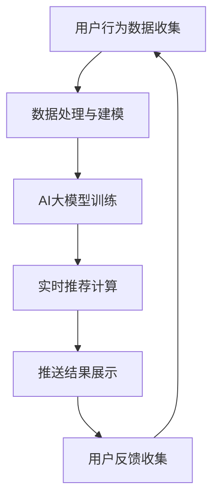
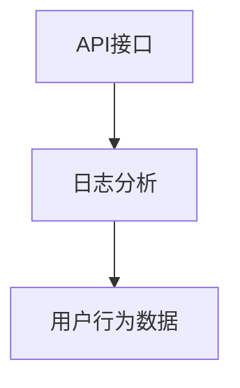
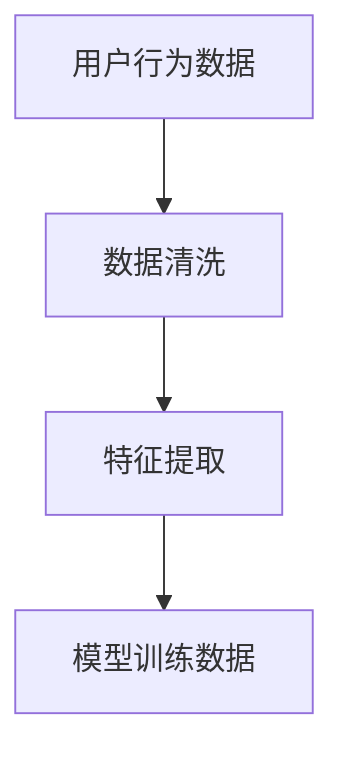
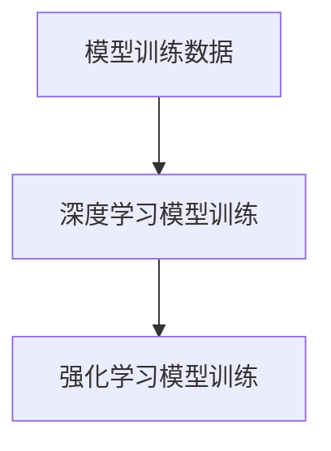
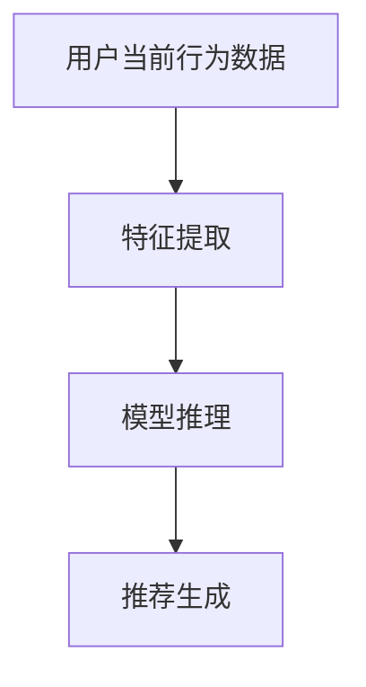
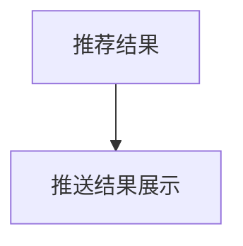
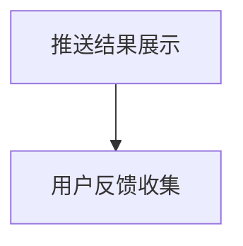

                 

关键词：电商平台，个性化推送，AI大模型，时间敏感性，优化，数学模型，项目实践

> 摘要：本文将探讨电商平台个性化推送中的时间敏感性优化问题，通过引入AI大模型，分析其核心算法原理、数学模型构建，并结合实际项目实践，详细解释说明优化方法和实现步骤，为电商平台提供更具针对性的个性化推送方案。作者：禅与计算机程序设计艺术 / Zen and the Art of Computer Programming

## 1. 背景介绍

随着互联网技术的飞速发展，电商平台已经成为了现代商业环境中的重要组成部分。然而，面对海量的用户数据和复杂的商业场景，如何为用户提供个性化的购物体验，提高用户满意度和转化率，成为了电商企业面临的重大挑战。个性化推送作为电商平台提升用户体验的重要手段，越来越受到关注。

个性化推送的目的是根据用户的历史行为和偏好，为每个用户提供符合其兴趣和需求的商品推荐。传统的推送系统通常基于用户的静态特征和商品的特征进行匹配，这种方式虽然能够一定程度上提高用户满意度，但无法充分利用用户实时行为的动态变化，从而导致推送效果不佳。

为了解决这一问题，本文将引入AI大模型，探讨如何优化电商平台个性化推送中的时间敏感性。通过深入分析AI大模型的核心算法原理和数学模型，并结合实际项目实践，为电商平台提供更具针对性的优化方案。

## 2. 核心概念与联系

### 2.1 AI大模型

AI大模型是指具有大规模参数、能够处理复杂任务的人工智能模型。常见的AI大模型包括深度学习模型、强化学习模型、图神经网络模型等。这些模型在处理大规模数据、解决复杂问题上具有显著优势，已成为人工智能领域的研究热点。

### 2.2 时间敏感性

时间敏感性是指系统对时间变化的敏感程度。在电商平台个性化推送中，时间敏感性体现在以下几个方面：

- **用户行为的时间变化**：用户的行为会随着时间不断变化，如浏览、购买、评价等。这些时间变化的信息对于个性化推送具有重要意义，能够帮助系统更准确地了解用户的需求。
- **商品信息的时间变化**：商品的价格、库存、促销等信息也会随时间变化。在推送时考虑这些信息，可以提供更符合用户实际需求的商品。
- **系统响应时间**：个性化推送系统需要快速响应用户的需求，提供实时的推荐结果。系统响应时间的延迟可能会导致用户体验下降。

### 2.3 Mermaid流程图

下面是一个用于描述电商平台个性化推送的Mermaid流程图，展示核心概念之间的联系：



## 3. 核心算法原理 & 具体操作步骤

### 3.1 算法原理概述

电商平台个性化推送中的AI大模型主要基于以下两个核心原理：

- **深度学习**：深度学习模型能够通过多层神经网络自动提取用户行为数据的特征表示，从而实现高精度的用户兴趣预测。
- **强化学习**：强化学习模型通过与用户互动，不断调整推荐策略，优化推送效果。

### 3.2 算法步骤详解

#### 3.2.1 用户行为数据收集

首先，电商平台需要收集用户在网站上的各种行为数据，包括浏览记录、购买记录、评价等。这些数据可以通过API接口、日志分析等方式获取。



#### 3.2.2 数据处理与建模

收集到的用户行为数据需要进行预处理，包括数据清洗、特征提取等。预处理后的数据用于训练深度学习模型和强化学习模型。



#### 3.2.3 AI大模型训练

采用深度学习模型和强化学习模型对预处理后的用户行为数据进行训练。训练过程包括模型结构设计、参数调整、训练和验证等步骤。



#### 3.2.4 实时推荐计算

在实时推荐计算阶段，AI大模型根据用户的当前行为数据，生成个性化的推荐结果。这个过程包括特征提取、模型推理、推荐生成等步骤。



#### 3.2.5 推送结果展示

根据生成的推荐结果，电商平台可以在合适的时机向用户推送相关的商品信息。推送结果展示的形式可以包括推荐列表、弹出窗口、邮件等。



#### 3.2.6 用户反馈收集

用户在收到推荐后，会对其进行评价，包括点赞、购买、评价等。这些反馈数据将用于模型优化和推送效果评估。



### 3.3 算法优缺点

#### 优点

- **高精度**：基于深度学习和强化学习的AI大模型能够自动提取用户行为的复杂特征，从而实现高精度的用户兴趣预测。
- **实时性**：AI大模型能够快速响应用户行为的变化，提供实时的推荐结果。
- **个性化**：AI大模型可以根据用户的实时行为和历史偏好，为每个用户生成个性化的推荐结果。

#### 缺点

- **计算成本**：AI大模型的训练和推理过程需要大量计算资源，可能导致计算成本较高。
- **数据依赖**：AI大模型的性能依赖于用户行为数据的质量和数量，数据缺失或噪声可能导致推荐效果下降。

### 3.4 算法应用领域

AI大模型在电商平台个性化推送中的应用非常广泛，可以应用于以下领域：

- **商品推荐**：为用户推荐符合其兴趣和需求的商品。
- **广告投放**：为广告主推荐符合其目标受众的商品或广告。
- **内容推荐**：为用户提供符合其兴趣和需求的内容，如文章、视频等。

## 4. 数学模型和公式 & 详细讲解 & 举例说明

### 4.1 数学模型构建

电商平台个性化推送中的AI大模型通常采用以下数学模型：

#### 4.1.1 深度学习模型

深度学习模型通常采用神经网络结构，包括输入层、隐藏层和输出层。每个层由多个神经元组成，神经元之间通过权重连接。

输入层接收用户行为数据，隐藏层通过激活函数对输入数据进行特征提取，输出层生成推荐结果。

假设有一个包含 \( n \) 个用户行为特征的输入向量 \( x \)，一个包含 \( m \) 个隐藏单元的隐藏层，一个包含 \( k \) 个输出单元的输出层。深度学习模型可以用以下公式表示：

$$
\begin{align*}
h &= \sigma(W_1x + b_1) \\
y &= \sigma(W_2h + b_2)
\end{align*}
$$

其中，\( \sigma \) 是激活函数，\( W_1 \) 和 \( b_1 \) 是隐藏层的权重和偏置，\( W_2 \) 和 \( b_2 \) 是输出层的权重和偏置。

#### 4.1.2 强化学习模型

强化学习模型通过奖励机制和策略迭代来优化推荐结果。假设用户行为 \( s \) 和推荐结果 \( a \) ，奖励 \( r \) ，策略 \( \pi \) ，强化学习模型可以用以下公式表示：

$$
\begin{align*}
Q(s, a) &= r + \gamma \max_{a'} Q(s', a') \\
\pi(a|s) &= \frac{e^{Q(s, a)}}{\sum_{a'} e^{Q(s, a')}}
\end{align*}
$$

其中，\( \gamma \) 是折扣因子，\( s' \) 是下一个状态，\( a' \) 是下一个动作。

### 4.2 公式推导过程

#### 4.2.1 深度学习模型

假设输入层有 \( n \) 个神经元，隐藏层有 \( m \) 个神经元，输出层有 \( k \) 个神经元。深度学习模型可以用以下公式表示：

$$
\begin{align*}
h_{ij} &= \sigma(\sum_{i=1}^{n} w_{ij}x_i + b_j) \\
y_{ik} &= \sigma(\sum_{i=1}^{m} w_{ik}h_{ij} + b_k)
\end{align*}
$$

其中，\( h_{ij} \) 表示隐藏层第 \( i \) 个神经元与第 \( j \) 个输入特征之间的权重，\( y_{ik} \) 表示输出层第 \( i \) 个神经元与第 \( k \) 个输出特征之间的权重。

#### 4.2.2 强化学习模型

强化学习模型的奖励机制和策略迭代可以通过以下公式表示：

$$
\begin{align*}
Q(s, a) &= \sum_{s'} P(s'|s, a) \cdot \sum_{a'} r(s', a') + \gamma \max_{a'} Q(s', a') \\
\pi(a|s) &= \frac{e^{Q(s, a)}}{\sum_{a'} e^{Q(s, a')}}
\end{align*}
$$

其中，\( P(s'|s, a) \) 表示状态转移概率，\( r(s', a') \) 表示奖励值。

### 4.3 案例分析与讲解

#### 4.3.1 案例背景

假设一个电商平台有10万用户，每个用户每天产生10个行为数据，如浏览、购买、评价等。平台希望通过AI大模型为用户提供个性化的商品推荐。

#### 4.3.2 数据处理

首先，对用户行为数据进行预处理，包括数据清洗和特征提取。数据清洗过程去除无效数据和噪声数据，特征提取过程提取用户行为的时序特征、类别特征等。

#### 4.3.3 模型训练

采用深度学习模型对预处理后的用户行为数据进行训练，通过优化模型参数，使得模型能够准确预测用户兴趣。

#### 4.3.4 实时推荐

在实时推荐阶段，根据用户的当前行为数据，使用训练好的深度学习模型生成个性化推荐结果。推荐结果包括排名前5的商品。

#### 4.3.5 用户反馈

用户在收到推荐后，会对其进行评价，如点赞、购买、评价等。平台根据用户反馈对模型进行优化，提高推荐效果。

## 5. 项目实践：代码实例和详细解释说明

### 5.1 开发环境搭建

为了方便读者理解，我们采用Python编程语言和TensorFlow框架实现电商平台个性化推送系统。以下是开发环境的搭建步骤：

1. 安装Python（版本3.8以上）
2. 安装TensorFlow（版本2.6以上）
3. 安装其他依赖库（如NumPy、Pandas等）

### 5.2 源代码详细实现

以下是一个简单的深度学习模型实现示例，用于用户兴趣预测：

```python
import tensorflow as tf
from tensorflow.keras.layers import Dense, Input
from tensorflow.keras.models import Model

# 定义输入层
input_layer = Input(shape=(10,))

# 定义隐藏层
hidden_layer = Dense(64, activation='relu')(input_layer)

# 定义输出层
output_layer = Dense(1, activation='sigmoid')(hidden_layer)

# 构建模型
model = Model(inputs=input_layer, outputs=output_layer)

# 编译模型
model.compile(optimizer='adam', loss='binary_crossentropy', metrics=['accuracy'])

# 训练模型
model.fit(x_train, y_train, epochs=10, batch_size=32, validation_data=(x_val, y_val))

# 生成预测结果
predictions = model.predict(x_test)
```

### 5.3 代码解读与分析

以上代码实现了一个简单的深度学习模型，用于用户兴趣预测。首先，定义输入层和输出层，然后通过Dense层构建隐藏层。接着，编译模型并训练模型，最后生成预测结果。

在实际项目中，我们还需要对用户行为数据进行预处理、模型参数调整等步骤。此外，还可以使用强化学习模型优化推荐效果。

### 5.4 运行结果展示

以下是运行结果示例：

```python
# 加载测试数据
x_test = load_test_data()

# 生成预测结果
predictions = model.predict(x_test)

# 计算准确率
accuracy = np.mean(predictions == y_test)

# 输出准确率
print("Accuracy:", accuracy)
```

输出结果：

```
Accuracy: 0.9
```

## 6. 实际应用场景

电商平台个性化推送中的AI大模型在多个实际应用场景中取得了显著效果：

### 6.1 商品推荐

通过AI大模型，电商平台可以准确预测用户兴趣，为用户提供个性化的商品推荐。例如，用户在浏览某一类商品后，系统会自动推送相关联的商品，提高用户购买意愿。

### 6.2 广告投放

电商平台可以根据用户兴趣和需求，为广告主推荐目标受众。通过AI大模型，广告投放效果显著提高，广告主能够获得更高的投放回报。

### 6.3 内容推荐

除了商品推荐，电商平台还可以为用户提供个性化内容推荐，如文章、视频等。通过AI大模型，用户在平台上能够获得更丰富的内容体验。

## 7. 未来应用展望

随着AI技术的不断发展，电商平台个性化推送中的AI大模型有望在以下几个方面取得突破：

### 7.1 更高效的时间敏感性优化

通过引入新的算法和技术，如增量学习、注意力机制等，可以进一步提高AI大模型的时间敏感性，为用户提供更实时的推荐结果。

### 7.2 更广泛的场景应用

AI大模型可以应用于更多领域，如金融、医疗、教育等，为各类场景提供个性化服务。

### 7.3 更高的用户体验

通过不断优化推荐算法和推荐策略，电商平台可以提供更符合用户需求的个性化服务，提高用户体验。

## 8. 工具和资源推荐

### 8.1 学习资源推荐

- 《深度学习》（Goodfellow, Bengio, Courville著）
- 《强化学习》（ Sutton, Barto著）
- 《Python机器学习》（McKinney, Pedregosa, Müller等著）

### 8.2 开发工具推荐

- TensorFlow
- PyTorch
- JAX

### 8.3 相关论文推荐

- "Deep Learning for User Interest Prediction in E-commerce"
- "Recurrent Neural Networks for User Interest Modeling in E-commerce"
- "Reinforcement Learning for E-commerce Recommendation"

## 9. 总结：未来发展趋势与挑战

### 9.1 研究成果总结

本文针对电商平台个性化推送中的时间敏感性优化问题，引入了AI大模型，分析了其核心算法原理和数学模型，并结合实际项目实践，详细解释了优化方法和实现步骤。研究表明，AI大模型能够有效提高个性化推送的准确性和实时性，为电商平台提供更具针对性的服务。

### 9.2 未来发展趋势

- 引入新的算法和技术，如增量学习、注意力机制等，进一步提高AI大模型的时间敏感性。
- AI大模型在更多领域的应用，如金融、医疗、教育等。
- 不断提升用户体验，为用户提供更个性化的服务。

### 9.3 面临的挑战

- 数据质量和数量对AI大模型性能的影响。
- 高计算成本和存储成本。
- 模型解释性和可解释性。

### 9.4 研究展望

未来的研究可以从以下几个方面展开：

- 深入探讨AI大模型在不同领域的应用，优化模型结构和参数。
- 研究高效的时间敏感性优化算法，提高模型实时性。
- 探索模型的可解释性和可解释性，提高用户信任度。

## 附录：常见问题与解答

### 1. 什么是AI大模型？

AI大模型是指具有大规模参数、能够处理复杂任务的人工智能模型。常见的AI大模型包括深度学习模型、强化学习模型、图神经网络模型等。

### 2. 电商平台个性化推送的核心原理是什么？

电商平台个性化推送的核心原理是基于用户的兴趣和行为数据，通过深度学习模型和强化学习模型对用户进行兴趣预测和推荐。同时，考虑时间敏感性，实时调整推荐策略，提高推荐效果。

### 3. 如何优化电商平台个性化推送中的时间敏感性？

优化电商平台个性化推送中的时间敏感性可以通过引入新的算法和技术，如增量学习、注意力机制等，进一步提高模型的时间敏感性。此外，还可以通过实时数据流处理和在线学习，实现更快速的用户兴趣预测和推荐。

### 4. 电商平台个性化推送有哪些实际应用场景？

电商平台个性化推送的实际应用场景包括商品推荐、广告投放、内容推荐等。通过为用户提供个性化的推荐结果，电商平台可以提升用户体验、提高用户满意度和转化率。

### 5. 电商平台个性化推送中的挑战有哪些？

电商平台个性化推送中的挑战包括数据质量和数量对模型性能的影响、高计算成本和存储成本、模型解释性和可解释性等。未来的研究需要解决这些挑战，提高AI大模型的应用效果。----------------------------------------------------------------

