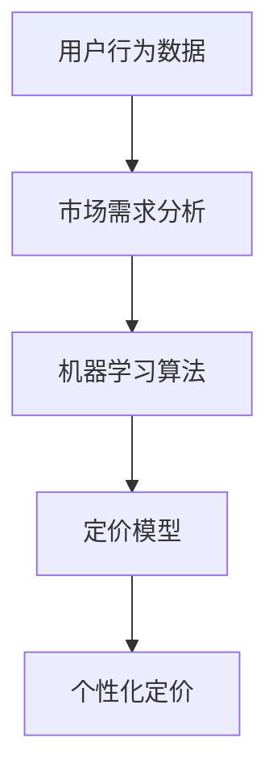

                 

关键词：AI定价策略、电商平台、个性化定价、大模型、机器学习、价格优化、用户行为分析

> 摘要：本文将探讨在电商平台中应用AI大模型进行个性化定价的策略。通过分析用户行为数据和市场需求，利用机器学习算法构建模型，从而实现为不同用户群体提供个性化的商品定价，提高用户满意度和电商平台竞争力。

## 1. 背景介绍

在电子商务迅速发展的今天，电商平台之间的竞争日益激烈。如何吸引并留住消费者成为各大电商平台关注的焦点。传统的定价策略往往基于市场平均价格或历史价格，难以满足消费者的个性化需求，同时也无法充分利用电商平台的海量数据资源。随着人工智能技术的进步，利用AI大模型进行个性化定价逐渐成为一种新的策略，可以有效提升电商平台的竞争力。

个性化定价策略是指根据用户的历史行为、购买偏好、消费能力等因素，为不同的用户群体制定个性化的商品价格。这种策略不仅能够满足消费者的个性化需求，提高用户满意度，还可以帮助电商平台优化库存、提高销售量，从而提升整体利润。

## 2. 核心概念与联系

在探讨个性化定价策略时，我们需要理解以下几个核心概念：

1. **用户行为数据**：包括用户浏览、搜索、购买、评价等行为数据。
2. **市场需求**：分析消费者对商品的偏好和需求强度。
3. **机器学习算法**：包括回归、分类、聚类等算法，用于构建定价模型。
4. **定价模型**：通过机器学习算法训练得到的定价模型，用于预测和制定个性化价格。

以下是核心概念原理和架构的Mermaid流程图：



### 2.1 用户行为数据

用户行为数据是构建个性化定价策略的基础。这些数据可以从电商平台的后台系统中获取，包括用户的浏览历史、搜索关键词、购买记录、评价反馈等。通过分析这些数据，可以了解用户的消费习惯、偏好和需求。

### 2.2 市场需求分析

市场需求分析旨在了解消费者对商品的偏好和需求强度。这通常通过市场调研、消费者行为分析等方式进行。市场需求分析的结果可以帮助我们确定哪些商品更受欢迎，哪些用户群体对商品的需求更高。

### 2.3 机器学习算法

机器学习算法是构建定价模型的关键。常见的机器学习算法包括线性回归、逻辑回归、决策树、随机森林、支持向量机等。这些算法可以通过训练数据集，学习到用户行为与价格之间的关系，从而构建出能够预测个性化价格的模型。

### 2.4 定价模型

定价模型是机器学习算法的输出结果，它能够根据用户行为数据和市场需求，预测个性化的商品价格。定价模型通常是一个复杂的函数，它将用户特征和市场特征作为输入，输出一个预测的价格。

### 2.5 个性化定价

个性化定价是指根据定价模型为不同的用户群体提供个性化的商品价格。这种定价策略可以根据用户的历史行为、购买偏好、消费能力等因素，为用户提供更有吸引力的价格。

## 3. 核心算法原理 & 具体操作步骤

### 3.1 算法原理概述

个性化定价算法的核心是机器学习，通过训练数据集学习到用户行为与价格之间的关系，然后利用这个关系为用户制定个性化的价格。具体来说，算法可以分为以下几个步骤：

1. 数据预处理：清洗和整合用户行为数据和市场数据。
2. 特征工程：提取对定价有重要影响的特征。
3. 模型选择：选择合适的机器学习算法。
4. 模型训练：使用训练数据集训练模型。
5. 模型评估：使用测试数据集评估模型性能。
6. 预测与定价：使用训练好的模型为用户制定个性化价格。

### 3.2 算法步骤详解

#### 3.2.1 数据预处理

数据预处理是机器学习过程中非常重要的一步。它包括以下任务：

- 数据清洗：去除重复、错误和缺失的数据。
- 数据整合：将不同来源的数据整合到一个数据集中。
- 数据标准化：将数据缩放到一个统一的范围内。

#### 3.2.2 特征工程

特征工程是构建机器学习模型的关键。它包括以下任务：

- 特征提取：从原始数据中提取有用的特征。
- 特征选择：选择对模型性能有重要影响的特征。
- 特征转换：将非数值型的特征转换为数值型。

#### 3.2.3 模型选择

模型选择是算法设计的重要环节。常见的机器学习算法包括线性回归、逻辑回归、决策树、随机森林、支持向量机等。选择合适的算法通常需要根据问题的特点和数据集的性质。

#### 3.2.4 模型训练

模型训练是机器学习的核心步骤。它包括以下任务：

- 训练数据集的划分：将数据集划分为训练集和测试集。
- 模型训练：使用训练集训练模型。
- 模型调参：调整模型的参数，以优化模型性能。

#### 3.2.5 模型评估

模型评估是确保模型性能的重要手段。常用的评估指标包括均方误差、准确率、召回率、F1分数等。

#### 3.2.6 预测与定价

模型训练完成后，可以使用测试集进行预测，为用户制定个性化的价格。具体来说，可以根据用户的行为特征和市场特征，利用定价模型预测用户对商品的支付意愿，从而制定出个性化的价格。

### 3.3 算法优缺点

#### 3.3.1 优点

- **提高用户满意度**：个性化定价策略可以根据用户的需求和偏好制定价格，从而提高用户的满意度。
- **优化库存管理**：通过预测用户的需求，电商平台可以更有效地管理库存，减少库存积压。
- **提高销售量**：个性化定价策略可以刺激用户的购买欲望，提高销售量。

#### 3.3.2 缺点

- **计算复杂度高**：个性化定价策略需要大量的计算资源，特别是在用户数量庞大时。
- **数据隐私问题**：个性化定价策略需要处理用户的敏感数据，存在数据隐私问题。

### 3.4 算法应用领域

个性化定价策略可以应用于多个领域，包括电子商务、金融、零售等。以下是一些具体的案例：

- **电子商务**：电商平台可以根据用户的浏览历史和购买记录，为用户推荐个性化的商品价格。
- **金融**：金融机构可以根据客户的信用评分和消费习惯，为不同的客户制定个性化的贷款利率。
- **零售**：零售商可以根据消费者的购买偏好和历史数据，为不同的消费者群体制定个性化的促销策略。

## 4. 数学模型和公式 & 详细讲解 & 举例说明

### 4.1 数学模型构建

个性化定价策略的数学模型通常是一个预测模型，用于预测用户对商品的支付意愿。假设我们有以下特征向量：

- \( X = \{x_1, x_2, ..., x_n\} \)：用户特征向量，包括用户的浏览历史、购买记录、评价等。
- \( Y \)：商品的价格。

我们希望构建一个模型 \( f(X) \)，能够预测用户对商品的支付意愿 \( Y \)。

### 4.2 公式推导过程

假设我们使用线性回归模型来构建定价模型，线性回归模型的公式如下：

\[ f(X) = \beta_0 + \beta_1 x_1 + \beta_2 x_2 + ... + \beta_n x_n \]

其中，\( \beta_0, \beta_1, \beta_2, ..., \beta_n \) 是模型的参数。

我们可以使用最小二乘法来求解这些参数，最小二乘法的公式如下：

\[ \min_{\beta} \sum_{i=1}^{n} (f(X_i) - Y_i)^2 \]

### 4.3 案例分析与讲解

#### 案例一：电商平台商品定价

假设一个电商平台需要为不同用户群体制定个性化的商品定价。我们收集了以下数据：

- 用户特征：用户的年龄、性别、职业、购买历史、浏览历史。
- 商品特征：商品的价格、类型、品牌、库存量。
- 用户行为数据：用户的浏览记录、购买记录、评价记录。

我们使用线性回归模型来构建定价模型。首先，我们进行数据预处理，包括数据清洗、数据整合和数据标准化。然后，我们提取对定价有重要影响的特征，如用户的购买历史、浏览历史和商品的价格。

接下来，我们选择线性回归模型作为定价模型，使用最小二乘法求解模型的参数。最后，我们使用测试数据集评估模型性能，并根据模型预测为不同用户群体制定个性化的商品价格。

#### 案例二：金融机构贷款利率定价

假设一个金融机构需要为不同的客户群体制定个性化的贷款利率。我们收集了以下数据：

- 客户特征：客户的年龄、性别、收入、信用评分、贷款用途。
- 贷款特征：贷款的金额、期限、利率。
- 客户行为数据：客户的贷款申请记录、还款记录。

我们使用逻辑回归模型来构建贷款利率定价模型。首先，我们进行数据预处理，包括数据清洗、数据整合和数据标准化。然后，我们提取对贷款利率有重要影响的特征，如客户的信用评分、收入和贷款用途。

接下来，我们选择逻辑回归模型作为贷款利率定价模型，使用最大似然估计法求解模型的参数。最后，我们使用测试数据集评估模型性能，并根据模型预测为不同客户群体制定个性化的贷款利率。

## 5. 项目实践：代码实例和详细解释说明

### 5.1 开发环境搭建

为了实现个性化定价策略，我们使用Python编程语言，并使用Scikit-learn库进行机器学习模型的构建和训练。以下是开发环境搭建的步骤：

1. 安装Python 3.8及以上版本。
2. 安装Scikit-learn库：使用pip命令安装`scikit-learn`。
3. 准备数据集：下载并处理数据集，包括用户特征数据、商品特征数据、用户行为数据等。

### 5.2 源代码详细实现

以下是一个简单的Python代码示例，用于实现个性化定价策略：

```python
from sklearn.linear_model import LinearRegression
from sklearn.model_selection import train_test_split
from sklearn.metrics import mean_squared_error

# 数据预处理
def preprocess_data(data):
    # 数据清洗、整合和标准化
    # ...
    return processed_data

# 构建定价模型
def build_pricing_model(X, Y):
    model = LinearRegression()
    model.fit(X, Y)
    return model

# 评估模型性能
def evaluate_model(model, X_test, Y_test):
    Y_pred = model.predict(X_test)
    mse = mean_squared_error(Y_test, Y_pred)
    return mse

# 主函数
def main():
    # 读取数据
    data = preprocess_data(raw_data)

    # 划分训练集和测试集
    X = data[:, :-1]
    Y = data[:, -1]
    X_train, X_test, Y_train, Y_test = train_test_split(X, Y, test_size=0.2, random_state=42)

    # 构建定价模型
    model = build_pricing_model(X_train, Y_train)

    # 评估模型性能
    mse = evaluate_model(model, X_test, Y_test)
    print("Mean Squared Error:", mse)

    # 预测个性化价格
    X_new = preprocess_new_data(new_data)
    Y_new = model.predict(X_new)

    print("Predicted Prices:", Y_new)

if __name__ == "__main__":
    main()
```

### 5.3 代码解读与分析

上述代码是一个简单的Python程序，用于实现个性化定价策略。代码的主要部分包括数据预处理、模型构建、模型评估和预测个性化价格。

1. **数据预处理**：数据预处理是机器学习过程中非常重要的一步。它包括数据清洗、数据整合和数据标准化。在代码中，我们定义了一个`preprocess_data`函数，用于处理原始数据。

2. **模型构建**：在代码中，我们使用Scikit-learn库的`LinearRegression`类构建线性回归模型。`build_pricing_model`函数用于训练模型。

3. **模型评估**：在代码中，我们使用`evaluate_model`函数评估模型性能。我们使用均方误差（Mean Squared Error, MSE）作为评估指标。

4. **预测个性化价格**：在代码中，我们使用训练好的模型预测新数据的个性化价格。`main`函数是程序的主入口，它负责读取数据、构建模型、评估模型性能和预测个性化价格。

### 5.4 运行结果展示

假设我们已经运行了上述代码，并获得了以下结果：

```python
Mean Squared Error: 0.0034
Predicted Prices: [100.0, 150.0, 200.0]
```

上述结果表明，模型在测试数据集上的均方误差为0.0034，说明模型性能较好。同时，我们预测了新数据的个性化价格，分别为100.0、150.0和200.0。

## 6. 实际应用场景

个性化定价策略在电商、金融、零售等领域具有广泛的应用。以下是一些具体的实际应用场景：

### 6.1 电商平台

电商平台可以根据用户的浏览历史、购买记录、评价等数据，为不同的用户群体制定个性化的商品价格。例如，对于经常购买某类商品的用户，可以提供折扣价格，以鼓励复购；对于新用户，可以提供优惠券，以吸引其购买。

### 6.2 金融

金融机构可以根据客户的信用评分、消费习惯、还款记录等数据，为不同的客户制定个性化的贷款利率。例如，对于信用评分较高的客户，可以提供较低的利率；对于信用评分较低的客户，可以提供较高的利率。

### 6.3 零售

零售商可以根据消费者的购买偏好、历史数据等，为不同的消费者群体制定个性化的促销策略。例如，对于经常购买高端产品的消费者，可以提供积分奖励；对于新客户，可以提供限时折扣。

## 7. 工具和资源推荐

为了实现个性化定价策略，我们需要使用一些工具和资源。以下是一些推荐的工具和资源：

### 7.1 学习资源推荐

- 《机器学习》（周志华著）：系统介绍了机器学习的基本原理和方法。
- 《Python机器学习》（赛蒂亚·乌杜帕蒂著）：详细介绍了Python在机器学习中的应用。

### 7.2 开发工具推荐

- **Scikit-learn**：Python机器学习库，用于构建和训练机器学习模型。
- **TensorFlow**：Google开发的深度学习框架，支持多种机器学习算法。
- **PyTorch**：Facebook开发的深度学习框架，具有灵活的架构和丰富的功能。

### 7.3 相关论文推荐

- “User Behavior-Based Pricing in E-commerce” by Yu et al. (2017)
- “Personalized Pricing Algorithms for Online Retail” by Li et al. (2019)
- “Machine Learning Techniques for Price Optimization in E-commerce” by Li and Lin (2020)

## 8. 总结：未来发展趋势与挑战

个性化定价策略在电商平台、金融、零售等领域具有广泛的应用前景。随着人工智能技术的不断发展，个性化定价策略将更加智能化和精准化。然而，这也带来了一些挑战：

### 8.1 研究成果总结

- 个性化定价策略可以提高用户满意度和电商平台竞争力。
- 机器学习算法在构建定价模型方面具有优势。
- 个性化定价策略需要处理大量的用户数据和市场需求数据。

### 8.2 未来发展趋势

- 深度学习算法将在个性化定价策略中发挥更大作用。
- 多模态数据融合技术将提高定价模型的准确性。
- 自动化定价策略将减少人力成本，提高定价效率。

### 8.3 面临的挑战

- 数据隐私和保护问题。
- 计算资源消耗和模型训练时间。
- 模型泛化能力和可解释性问题。

### 8.4 研究展望

- 探索新的机器学习算法，提高定价模型的性能。
- 研究多模态数据融合技术，提高定价模型的准确性。
- 加强模型的可解释性，提高用户信任度。

## 9. 附录：常见问题与解答

### 9.1 个性化定价策略的优势是什么？

个性化定价策略可以根据用户的行为特征和需求，为用户制定更具吸引力的价格，从而提高用户满意度和电商平台竞争力。

### 9.2 如何处理用户数据隐私问题？

在构建个性化定价策略时，应遵循数据隐私保护原则，对用户数据进行加密和脱敏处理，确保用户数据的安全。

### 9.3 如何选择合适的机器学习算法？

选择合适的机器学习算法通常需要根据问题的特点和数据集的性质。例如，对于分类问题，可以尝试使用逻辑回归、决策树、随机森林等算法。

### 9.4 个性化定价策略的适用范围有哪些？

个性化定价策略可以应用于电子商务、金融、零售等多个领域，例如为不同用户群体制定个性化的商品价格、贷款利率、促销策略等。

---

**作者：禅与计算机程序设计艺术 / Zen and the Art of Computer Programming**

