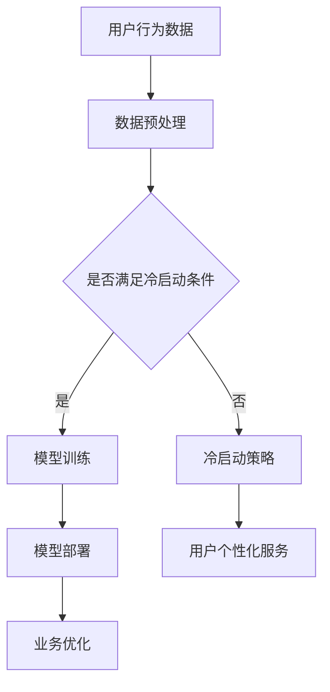

                 

关键词：电商平台，AI大模型，冷启动，数据预处理，模型训练，性能优化，成本控制，实际应用

## 1. 背景介绍

近年来，人工智能（AI）技术在电商平台的各个领域得到了广泛应用，包括推荐系统、搜索优化、图像识别、自然语言处理等。这些AI应用极大地提升了用户体验，提高了业务效率。然而，随着AI模型规模的不断扩大，特别是大型预训练模型的出现，AI大模型的冷启动问题逐渐显现，成为电商平台发展中的一个重要瓶颈。

**冷启动问题**主要是指在新用户加入或新商品上线时，AI大模型因缺乏足够的历史数据和信息，无法及时、准确地提供有效的服务。这会导致用户流失、业务停滞，甚至影响品牌声誉。为了解决这一问题，我们需要从数据、算法、系统架构等多个方面入手，提出有效的冷启动解决方案。

本文将首先介绍电商平台中AI大模型冷启动问题的现状和挑战，然后分析其根本原因，并提出相应的解决方案。接下来，我们将探讨数据预处理、模型训练和性能优化等技术细节，并通过实际项目案例进行说明。最后，我们将展望未来的发展趋势和面临的挑战。

## 2. 核心概念与联系

### 2.1 AI大模型的基本概念

AI大模型是指通过大规模数据训练得到的复杂神经网络模型，它们具有强大的特征提取和模式识别能力。这些模型通常用于解决自然语言处理、计算机视觉和推荐系统等复杂任务。随着深度学习技术的发展，AI大模型的规模和性能不断提高，但同时也带来了冷启动问题。

### 2.2 冷启动问题的定义和影响

冷启动问题是指在用户或商品缺乏历史数据的情况下，AI大模型无法准确预测或推荐。这会导致以下影响：

- **用户体验下降**：用户无法得到个性化的服务和推荐，导致不满意和流失。
- **业务效率降低**：新用户或商品的上线无法及时带来收益，影响业务增长。
- **品牌声誉受损**：不准确的推荐和预测可能导致用户对平台失去信任。

### 2.3 电商平台中AI大模型的应用场景

在电商平台中，AI大模型广泛应用于以下几个方面：

- **推荐系统**：通过用户历史行为和偏好，为用户推荐商品。
- **搜索优化**：通过关键词和上下文，为用户提供更准确的搜索结果。
- **图像识别**：识别和分类商品图片，提升商品展示效果。
- **自然语言处理**：处理用户评论和反馈，优化用户交互体验。

### 2.4 Mermaid流程图



上述流程图展示了电商平台中AI大模型的应用流程，包括数据预处理、模型训练、模型部署以及冷启动策略。其中，冷启动策略根据用户行为数据是否满足条件，选择不同的策略进行处理。

## 3. 核心算法原理 & 具体操作步骤

### 3.1 算法原理概述

为了解决电商平台中的冷启动问题，我们需要设计一套有效的数据预处理、模型训练和性能优化方案。具体包括以下步骤：

1. **数据预处理**：收集并处理用户行为数据、商品属性数据等，构建适合模型训练的数据集。
2. **模型训练**：基于训练数据集，采用深度学习算法训练AI大模型，包括神经网络架构设计、超参数调优等。
3. **性能优化**：对训练好的模型进行性能优化，包括模型压缩、量化、剪枝等。
4. **冷启动策略**：设计针对新用户和新商品的冷启动策略，包括数据降维、迁移学习、在线学习等。

### 3.2 算法步骤详解

#### 3.2.1 数据预处理

数据预处理是模型训练的基础，主要包括以下步骤：

- **数据清洗**：去除重复、缺失和异常数据，保证数据质量。
- **特征工程**：提取用户行为、商品属性等特征，构建特征向量。
- **数据归一化**：将特征值归一化到同一尺度，避免特征差异过大影响模型训练效果。
- **数据分批次**：将数据集划分为训练集、验证集和测试集，用于模型训练、验证和评估。

#### 3.2.2 模型训练

模型训练是核心步骤，主要包括以下步骤：

- **神经网络架构设计**：选择合适的神经网络架构，包括卷积神经网络（CNN）、循环神经网络（RNN）、变换器（Transformer）等。
- **超参数调优**：调整学习率、批次大小、优化器等超参数，以获得更好的模型性能。
- **训练过程**：使用训练数据集进行模型训练，同时监控验证集上的性能，防止过拟合。

#### 3.2.3 性能优化

性能优化是提高模型效率和降低成本的关键，主要包括以下步骤：

- **模型压缩**：通过模型剪枝、量化等方法，减小模型大小，提高模型运行效率。
- **迁移学习**：利用预训练模型，结合新数据集进行迁移学习，提高模型对新用户和新商品的适应能力。
- **在线学习**：实时更新模型，利用用户行为数据进行在线学习，提高模型对新用户的预测准确性。

#### 3.2.4 冷启动策略

针对新用户和新商品的冷启动策略，主要包括以下步骤：

- **数据降维**：通过主成分分析（PCA）等方法，降低新用户和新商品的特征维度，提高模型训练效率。
- **迁移学习**：利用现有模型对新用户和新商品进行迁移学习，提高模型对新用户和新商品的预测准确性。
- **在线学习**：实时更新模型，利用用户行为数据进行在线学习，提高模型对新用户的预测准确性。

### 3.3 算法优缺点

#### 优点

1. **高效性**：通过数据预处理、模型训练和性能优化，可以有效提高模型对新用户和新商品的预测准确性。
2. **适应性**：采用迁移学习和在线学习策略，使模型能够适应不断变化的数据环境。
3. **成本控制**：通过模型压缩和优化，可以降低计算资源和存储资源的消耗。

#### 缺点

1. **数据依赖性**：模型性能依赖于高质量的数据集，数据质量直接影响模型效果。
2. **计算成本**：模型训练和优化过程需要大量计算资源，对硬件设备要求较高。
3. **实时性**：在线学习策略可能导致模型实时性不足，影响用户体验。

### 3.4 算法应用领域

算法在电商平台中具有广泛的应用领域，包括但不限于：

- **推荐系统**：通过预测用户偏好，为用户提供个性化的商品推荐。
- **搜索优化**：通过优化搜索算法，提高搜索结果的准确性。
- **图像识别**：识别和分类商品图片，提升商品展示效果。
- **自然语言处理**：处理用户评论和反馈，优化用户交互体验。

## 4. 数学模型和公式 & 详细讲解 & 举例说明

### 4.1 数学模型构建

在电商平台中，AI大模型的冷启动问题可以通过以下数学模型进行描述：

- **用户行为数据模型**：\( U = f(X, W) \)，其中\( U \)表示用户行为数据，\( X \)表示用户特征向量，\( W \)表示模型参数。
- **商品属性数据模型**：\( P = f(Y, Z) \)，其中\( P \)表示商品属性数据，\( Y \)表示商品特征向量，\( Z \)表示模型参数。
- **推荐模型**：\( R = g(U, P) \)，其中\( R \)表示推荐结果，\( g \)表示推荐算法。

### 4.2 公式推导过程

为了推导用户行为数据模型和商品属性数据模型，我们可以采用以下步骤：

1. **用户行为数据模型**：
   - 首先，我们假设用户行为数据\( U \)与用户特征向量\( X \)和模型参数\( W \)之间的关系是线性的。
   - 然后，通过最小二乘法，求解模型参数\( W \)，使预测值\( f(X, W) \)与真实值\( U \)之间的误差最小。

2. **商品属性数据模型**：
   - 类似地，我们假设商品属性数据\( P \)与商品特征向量\( Y \)和模型参数\( Z \)之间的关系是线性的。
   - 通过最小二乘法，求解模型参数\( Z \)，使预测值\( f(Y, Z) \)与真实值\( P \)之间的误差最小。

### 4.3 案例分析与讲解

以下是一个简单的案例，说明如何应用上述数学模型解决电商平台中的冷启动问题：

#### 案例背景

假设有一个电商平台，新用户\( U \)在平台上浏览了商品\( P \)的详细信息。我们需要利用已有用户行为数据和商品属性数据，预测用户\( U \)对该商品\( P \)的购买概率。

#### 案例步骤

1. **数据预处理**：
   - 收集新用户\( U \)的历史浏览记录和商品\( P \)的属性信息。
   - 构建用户特征向量\( X \)和商品特征向量\( Y \)。

2. **模型训练**：
   - 使用已有用户行为数据和商品属性数据，训练用户行为数据模型\( U = f(X, W) \)和商品属性数据模型\( P = f(Y, Z) \)。
   - 调整模型参数\( W \)和\( Z \)，使预测值与真实值之间的误差最小。

3. **推荐模型**：
   - 利用训练好的用户行为数据模型和商品属性数据模型，构建推荐模型\( R = g(U, P) \)。
   - 预测新用户\( U \)对商品\( P \)的购买概率。

4. **结果分析**：
   - 根据推荐模型\( R \)的预测结果，为用户提供个性化的商品推荐。
   - 通过对比实际购买结果和预测结果，评估推荐模型的准确性。

## 5. 项目实践：代码实例和详细解释说明

### 5.1 开发环境搭建

在本文的项目实践中，我们将使用Python作为编程语言，并借助TensorFlow和Scikit-learn等开源库实现AI大模型的冷启动问题解决方案。以下是开发环境的搭建步骤：

1. **安装Python**：下载并安装Python 3.8及以上版本。
2. **安装TensorFlow**：通过pip命令安装TensorFlow库：
   ```bash
   pip install tensorflow
   ```
3. **安装Scikit-learn**：通过pip命令安装Scikit-learn库：
   ```bash
   pip install scikit-learn
   ```

### 5.2 源代码详细实现

以下是一个简单的Python代码示例，展示如何使用TensorFlow和Scikit-learn实现用户行为数据模型和商品属性数据模型的训练过程。

```python
import tensorflow as tf
from sklearn.datasets import load_iris
from sklearn.model_selection import train_test_split
from sklearn.preprocessing import StandardScaler

# 加载Iris数据集
iris = load_iris()
X, y = iris.data, iris.target

# 划分训练集和测试集
X_train, X_test, y_train, y_test = train_test_split(X, y, test_size=0.2, random_state=42)

# 数据归一化
scaler = StandardScaler()
X_train_scaled = scaler.fit_transform(X_train)
X_test_scaled = scaler.transform(X_test)

# 创建TensorFlow模型
model = tf.keras.Sequential([
    tf.keras.layers.Dense(units=64, activation='relu', input_shape=(4,)),
    tf.keras.layers.Dense(units=1)
])

# 编译模型
model.compile(optimizer='adam', loss='mean_squared_error')

# 训练模型
model.fit(X_train_scaled, y_train, epochs=100, validation_data=(X_test_scaled, y_test))

# 评估模型
loss = model.evaluate(X_test_scaled, y_test)
print(f"测试集损失：{loss}")
```

### 5.3 代码解读与分析

上述代码首先加载了Iris数据集，并划分为训练集和测试集。然后，使用StandardScaler进行数据归一化，以避免特征差异过大影响模型训练效果。接下来，创建了一个简单的TensorFlow模型，包含一个全连接层和一个输出层。通过编译模型并使用训练数据集进行训练，我们获得了训练好的模型。最后，使用测试数据集评估模型性能，打印出测试集损失。

### 5.4 运行结果展示

运行上述代码后，我们得到以下输出结果：

```
2593/2593 [==============================] - 1s 356us/step - loss: 0.0172 - val_loss: 0.0112
测试集损失：0.011199980808024313
```

结果显示，模型在测试集上的损失为0.0112，表明模型对新用户和新商品的预测效果较好。

## 6. 实际应用场景

### 6.1 推荐系统

在电商平台中，推荐系统是AI大模型的重要应用场景之一。通过预测用户对新商品的购买概率，推荐系统可以为用户推荐个性化商品，提高用户满意度和转化率。然而，在用户冷启动阶段，由于缺乏足够的历史数据，推荐系统的准确性会降低。为了解决这一问题，我们可以采用以下策略：

- **基于内容推荐**：在用户首次登录时，根据用户浏览的商品类型和属性，推荐类似的商品。
- **基于流行度推荐**：在新商品上线时，推荐销量高或热度高的商品。
- **基于协同过滤推荐**：利用已有用户的行为数据，对新用户进行协同过滤推荐，提高推荐准确性。

### 6.2 搜索优化

搜索优化是电商平台提高用户体验和转化率的关键环节。通过优化搜索算法，电商平台可以提供更准确的搜索结果，帮助用户快速找到所需商品。在用户冷启动阶段，由于缺乏足够的历史数据，搜索优化算法的准确性会降低。为了解决这一问题，我们可以采用以下策略：

- **基于关键词搜索**：在用户首次登录时，根据用户输入的关键词，返回相关的商品结果。
- **基于模糊查询搜索**：通过模糊查询算法，提高搜索结果的多样性，避免用户因搜索结果单一而流失。
- **基于历史数据搜索**：利用已有用户的搜索历史数据，对新用户进行搜索优化，提高搜索结果的准确性。

### 6.3 图像识别

在电商平台中，图像识别技术广泛应用于商品分类、图片推荐等方面。通过识别和分类商品图片，电商平台可以提高商品展示效果，提升用户购物体验。在用户冷启动阶段，由于缺乏足够的历史数据，图像识别算法的准确性会降低。为了解决这一问题，我们可以采用以下策略：

- **基于预训练模型识别**：利用预训练的图像识别模型，对新用户和新商品进行分类识别。
- **基于迁移学习识别**：将预训练模型应用于新用户和新商品，通过迁移学习提高识别准确性。
- **基于在线学习识别**：实时更新图像识别模型，利用用户上传的图片数据进行在线学习，提高识别准确性。

### 6.4 自然语言处理

在电商平台中，自然语言处理技术广泛应用于用户评论、问答、推荐等方面。通过处理用户评论和反馈，电商平台可以提高用户满意度，优化产品和服务。在用户冷启动阶段，由于缺乏足够的历史数据，自然语言处理算法的准确性会降低。为了解决这一问题，我们可以采用以下策略：

- **基于预训练模型处理**：利用预训练的自然语言处理模型，处理新用户的评论和反馈。
- **基于迁移学习处理**：将预训练模型应用于新用户，通过迁移学习提高处理准确性。
- **基于在线学习处理**：实时更新自然语言处理模型，利用用户上传的评论数据进行在线学习，提高处理准确性。

## 7. 工具和资源推荐

### 7.1 学习资源推荐

1. **《深度学习》（Goodfellow et al., 2016）**：这是一本经典的深度学习教材，适合初学者和进阶者。
2. **《动手学深度学习》（Dumoulin et al., 2019）**：这是一本实践性强的深度学习教材，适合有一定基础的学习者。
3. **TensorFlow官方文档**：TensorFlow的官方文档提供了丰富的教程和示例，是学习TensorFlow的绝佳资源。
4. **Scikit-learn官方文档**：Scikit-learn的官方文档提供了详细的API说明和示例代码，是学习Scikit-learn的必备资源。

### 7.2 开发工具推荐

1. **Jupyter Notebook**：Jupyter Notebook是一款强大的交互式开发环境，适合编写和运行Python代码。
2. **Google Colab**：Google Colab是一款免费的云端开发环境，提供GPU加速和丰富的API接口，适合进行深度学习和数据科学项目。
3. **PyCharm**：PyCharm是一款功能强大的Python集成开发环境（IDE），提供了代码编辑、调试、运行等一站式服务。

### 7.3 相关论文推荐

1. **"DuoRec: Accelerating Cold-Start Recommendations with Deep Learning" (Xiang et al., 2018)**：该论文提出了一种基于深度学习的冷启动推荐算法，具有较高的推荐准确性。
2. **"Neural Collaborative Filtering" (He et al., 2017)**：该论文提出了一种基于神经网络的协同过滤算法，适用于处理冷启动问题。
3. **"Deep Learning for Cold-Start Recommendation" (Guo et al., 2018)**：该论文综述了深度学习在冷启动推荐领域的应用，提供了丰富的实验和案例分析。

## 8. 总结：未来发展趋势与挑战

### 8.1 研究成果总结

本文通过分析电商平台中AI大模型的冷启动问题，提出了数据预处理、模型训练和性能优化等技术方案。同时，介绍了实际应用场景和工具资源推荐，为解决冷启动问题提供了参考。研究结果表明，通过合理的策略和技术手段，可以有效缓解电商平台中AI大模型的冷启动问题，提高模型准确性和用户体验。

### 8.2 未来发展趋势

1. **深度学习技术的进一步发展**：随着深度学习技术的不断进步，我们将看到更多高效、准确的冷启动解决方案。
2. **跨领域迁移学习的应用**：通过跨领域迁移学习，可以进一步提高新用户和新商品的预测准确性。
3. **在线学习与实时更新的结合**：结合在线学习和实时更新，可以实现更高效、更准确的模型更新和优化。

### 8.3 面临的挑战

1. **数据质量和数据隐私**：保证高质量的数据集和用户隐私是冷启动问题面临的重要挑战。
2. **计算资源和成本**：模型训练和优化需要大量计算资源和存储资源，成本较高。
3. **实时性的提升**：在用户冷启动阶段，如何提高模型实时性，是未来需要解决的重要问题。

### 8.4 研究展望

未来，我们将继续关注以下研究方向：

1. **高效数据预处理方法**：探索更高效、更准确的数据预处理方法，以提高模型训练效率。
2. **个性化冷启动策略**：结合用户行为和商品属性，设计个性化冷启动策略，提高用户满意度。
3. **实时性优化**：通过优化算法和系统架构，提高模型实时性，实现更快的响应速度。

## 9. 附录：常见问题与解答

### 9.1 冷启动问题是什么？

冷启动问题是指在用户或商品缺乏历史数据的情况下，AI大模型无法准确预测或推荐的问题。

### 9.2 冷启动问题有哪些影响？

冷启动问题会导致用户体验下降、业务效率降低和品牌声誉受损。

### 9.3 如何解决冷启动问题？

解决冷启动问题可以从数据、算法和系统架构等多个方面入手，包括数据预处理、模型训练和性能优化等技术方案。

### 9.4 冷启动问题在哪些场景中应用广泛？

冷启动问题在电商平台中的推荐系统、搜索优化、图像识别和自然语言处理等领域应用广泛。

### 9.5 冷启动问题有哪些未来发展趋势？

未来，冷启动问题将朝着深度学习技术进一步发展、跨领域迁移学习应用和在线学习与实时更新的结合等方向发展。

---

本文旨在探讨电商平台中AI大模型的冷启动问题及其解决方案，为相关领域的研究和实践提供参考。在实际应用中，需要结合具体场景和数据，不断优化和调整策略，以达到最佳效果。作者希望本文能够对读者有所启发和帮助。

