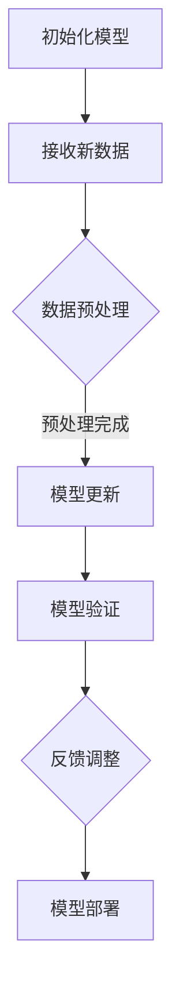

                 

关键词：电商平台、AI大模型、增量学习、技术挑战、应用场景、未来展望

## 摘要

本文旨在探讨电商平台中AI大模型的增量学习技术，介绍其背景、核心概念、算法原理、数学模型、项目实践、实际应用场景以及未来展望。通过分析技术挑战和解决方案，本文旨在为电商平台提供实用的AI技术指导，助力其提升用户体验和运营效率。

## 1. 背景介绍

随着互联网的快速发展，电商平台已经成为现代商业的重要组成部分。然而，随着数据量的激增和用户需求的多样化，传统的数据处理方法已经无法满足电商平台的需求。为了更好地应对这一挑战，人工智能（AI）技术逐渐崭露头角。特别是大模型技术在图像识别、自然语言处理、推荐系统等领域的突破，为电商平台带来了新的契机。

增量学习（Incremental Learning）作为AI技术的一个重要分支，旨在应对不断变化的数据环境。在电商平台中，用户数据具有时效性和动态性，这意味着模型需要不断适应新的数据变化。增量学习通过持续学习和更新模型参数，能够在保持原有知识的前提下，提高模型的适应能力和鲁棒性。

本文将深入探讨电商平台中AI大模型的增量学习技术，分析其核心概念、算法原理、数学模型以及项目实践，为读者提供全面的技术解读和应用指导。

## 2. 核心概念与联系

### 2.1 AI大模型

AI大模型是指具有大规模参数和复杂结构的神经网络模型。这些模型通过深度学习技术，可以从大量数据中自动提取特征并进行预测。常见的AI大模型包括卷积神经网络（CNN）、循环神经网络（RNN）、Transformer模型等。

### 2.2 增量学习

增量学习是指模型在已有知识的基础上，通过不断学习和更新参数，适应新数据的变化。与批量学习（Batch Learning）相比，增量学习具有实时性、高效性和鲁棒性。

### 2.3 增量学习与大模型的关系

增量学习与大模型之间存在紧密的联系。大模型的复杂结构和大规模参数使得其在处理动态数据时具有优势，而增量学习则能够保证模型在新数据到来时能够快速适应，从而提高模型的实时性和鲁棒性。

### 2.4 Mermaid 流程图

下面是一个描述增量学习在大模型中应用过程的Mermaid流程图：



该流程图展示了增量学习在大模型中的基本步骤：初始化模型、接收新数据、数据预处理、模型更新、模型验证和模型部署。

## 3. 核心算法原理 & 具体操作步骤

### 3.1 算法原理概述

增量学习算法的基本原理是通过持续学习和更新模型参数，使模型能够适应新的数据。具体而言，增量学习算法包括以下几个关键步骤：

1. **初始化模型**：初始化一个具有预训练参数的模型。
2. **数据预处理**：对新的数据进行预处理，包括数据清洗、归一化、特征提取等。
3. **模型更新**：通过梯度下降等优化算法，更新模型参数。
4. **模型验证**：使用验证集对更新后的模型进行验证。
5. **反馈调整**：根据模型验证结果，对模型参数进行调整。

### 3.2 算法步骤详解

#### 3.2.1 初始化模型

初始化模型是指将一个具有预训练参数的模型加载到内存中。预训练参数通常是通过在大量数据上训练得到的，可以在一定程度上提高模型的泛化能力。在初始化模型时，可以采用以下方法：

- **使用预训练模型**：从现有的预训练模型库中选取一个与任务相关的模型，并将其参数作为初始值。
- **随机初始化**：如果不存在预训练模型，可以采用随机初始化方法，为模型参数分配随机值。

#### 3.2.2 数据预处理

数据预处理是增量学习中的重要步骤，其目的是提高模型的学习效率和性能。常见的数据预处理方法包括：

- **数据清洗**：去除噪声数据和异常值，确保数据质量。
- **归一化**：将数据缩放到相同的范围，便于模型学习。
- **特征提取**：从原始数据中提取有用特征，提高模型的表达能力。

#### 3.2.3 模型更新

模型更新是指通过优化算法，更新模型参数，使其更接近目标函数的最优解。常用的优化算法包括：

- **梯度下降**：通过计算目标函数的梯度，逐步更新模型参数。
- **动量优化**：在梯度下降的基础上，引入动量项，加速收敛。
- **随机梯度下降（SGD）**：在梯度下降的基础上，使用批量大小为1的样本进行更新。

#### 3.2.4 模型验证

模型验证是指使用验证集对更新后的模型进行评估，以确定模型性能。常用的模型验证指标包括：

- **准确率**：模型预测正确的样本数占总样本数的比例。
- **召回率**：模型预测正确的样本数占实际为正类的样本数的比例。
- **F1分数**：准确率和召回率的调和平均值。

#### 3.2.5 反馈调整

根据模型验证结果，可以对模型参数进行调整，以优化模型性能。调整方法包括：

- **参数调整**：根据验证结果，对模型参数进行微调。
- **超参数调整**：根据验证结果，调整优化算法的超参数，如学习率、批量大小等。

### 3.3 算法优缺点

增量学习算法具有以下优点：

- **实时性**：能够实时适应新的数据变化，提高模型的实时性和响应速度。
- **高效性**：通过持续学习和更新，提高模型的学习效率和性能。
- **鲁棒性**：能够在不同数据分布下保持良好的性能，提高模型的鲁棒性。

然而，增量学习算法也存在一些缺点：

- **计算复杂度**：随着数据量的增加，计算复杂度呈指数级增长，可能对硬件资源造成较大压力。
- **内存消耗**：增量学习算法需要存储大量历史数据，可能导致内存消耗增加。
- **稳定性**：在数据变化剧烈的情况下，模型可能失去稳定性，需要进一步优化。

### 3.4 算法应用领域

增量学习算法在多个领域具有广泛的应用前景，包括：

- **推荐系统**：在电商平台上，用户行为数据具有动态性，增量学习算法可以实时更新推荐模型，提高推荐质量。
- **自然语言处理**：在语音识别、机器翻译等任务中，增量学习算法可以持续学习和更新模型，提高语音识别和翻译的准确性。
- **图像识别**：在图像分类、目标检测等任务中，增量学习算法可以适应新数据的分布，提高模型的鲁棒性和准确性。

## 4. 数学模型和公式 & 详细讲解 & 举例说明

### 4.1 数学模型构建

增量学习算法的数学模型主要包括以下三个部分：

- **目标函数**：定义模型的预测输出与真实输出之间的差距，用于评估模型性能。
- **优化算法**：通过计算目标函数的梯度，更新模型参数，使模型达到最优解。
- **模型更新规则**：根据优化算法的结果，更新模型参数，实现模型的自适应更新。

### 4.2 公式推导过程

以下是一个简化的增量学习算法的数学模型推导过程：

1. **目标函数**：

   假设输入特征为 \(X\)，输出为 \(Y\)，模型预测输出为 \(Y'\)。则目标函数可以表示为：

   \[ J(\theta) = \frac{1}{2} \sum_{i=1}^{n} (Y_i - Y_i')^2 \]

   其中，\(\theta\) 表示模型参数，\(n\) 表示样本数量。

2. **优化算法**：

   采用梯度下降算法优化目标函数。梯度下降的迭代公式为：

   \[ \theta_{t+1} = \theta_t - \alpha \nabla_\theta J(\theta_t) \]

   其中，\(\alpha\) 表示学习率，\(\nabla_\theta J(\theta_t)\) 表示目标函数的梯度。

3. **模型更新规则**：

   根据梯度下降算法的结果，更新模型参数：

   \[ \theta_t \leftarrow \theta_t - \alpha \nabla_\theta J(\theta_t) \]

   这样，模型参数会逐渐收敛到最优解。

### 4.3 案例分析与讲解

以下是一个简单的增量学习算法应用案例：

假设有一个电商平台的推荐系统，用户行为数据包括浏览记录和购买记录。目标是通过用户行为数据，为用户推荐商品。

1. **目标函数**：

   假设用户 \(i\) 在时间 \(t\) 的浏览记录为 \(X_i(t)\)，购买记录为 \(Y_i(t)\)。则目标函数可以表示为：

   \[ J(\theta) = \frac{1}{2} \sum_{i=1}^{n} \sum_{t=1}^{T} (Y_i(t) - \sigma(\theta X_i(t)))^2 \]

   其中，\(\sigma(\theta X_i(t))\) 表示模型预测的用户行为，\(n\) 表示用户数量，\(T\) 表示时间步数。

2. **优化算法**：

   采用梯度下降算法优化目标函数。梯度下降的迭代公式为：

   \[ \theta_{t+1} = \theta_t - \alpha \nabla_\theta J(\theta_t) \]

   其中，\(\alpha\) 表示学习率。

3. **模型更新规则**：

   根据梯度下降算法的结果，更新模型参数：

   \[ \theta_t \leftarrow \theta_t - \alpha \nabla_\theta J(\theta_t) \]

   这样，模型参数会逐渐收敛到最优解。

通过以上案例，我们可以看到增量学习算法在电商平台推荐系统中的应用。在实际应用中，可以进一步优化目标函数、优化算法和模型更新规则，以提高推荐系统的性能。

## 5. 项目实践：代码实例和详细解释说明

### 5.1 开发环境搭建

为了实现电商平台中的增量学习技术，我们需要搭建一个合适的技术栈。以下是开发环境的搭建步骤：

1. **Python环境**：安装Python 3.8及以上版本。
2. **深度学习框架**：安装TensorFlow 2.5及以上版本，或者PyTorch 1.8及以上版本。
3. **其他依赖**：安装Numpy、Pandas、Matplotlib等常用库。

### 5.2 源代码详细实现

以下是一个基于TensorFlow实现的增量学习算法的代码示例：

```python
import tensorflow as tf
import numpy as np

# 定义输入层
input_layer = tf.keras.layers.Input(shape=(784,))

# 定义隐藏层
hidden_layer = tf.keras.layers.Dense(units=128, activation='relu')(input_layer)

# 定义输出层
output_layer = tf.keras.layers.Dense(units=10, activation='softmax')(hidden_layer)

# 定义模型
model = tf.keras.Model(inputs=input_layer, outputs=output_layer)

# 编译模型
model.compile(optimizer='adam', loss='categorical_crossentropy', metrics=['accuracy'])

# 初始化模型参数
model.build(input_shape=(None, 784))
model.summary()

# 定义优化算法
optimizer = tf.keras.optimizers.Adam(learning_rate=0.001)

# 定义梯度下降迭代过程
for epoch in range(num_epochs):
    # 训练模型
    with tf.GradientTape() as tape:
        predictions = model(x_train, training=True)
        loss = tf.keras.losses.categorical_crossentropy(y_train, predictions)
    
    # 计算梯度
    gradients = tape.gradient(loss, model.trainable_variables)
    
    # 更新模型参数
    optimizer.apply_gradients(zip(gradients, model.trainable_variables))
    
    # 模型验证
    val_loss, val_accuracy = model.evaluate(x_val, y_val)
    print(f"Epoch {epoch+1}: Loss = {loss}, Accuracy = {accuracy}")

# 模型部署
model.save('incremental_learning_model.h5')
```

### 5.3 代码解读与分析

上述代码实现了一个基于TensorFlow的增量学习算法。以下是代码的关键部分及其解释：

1. **输入层**：定义输入特征，假设输入特征为784维。
2. **隐藏层**：定义隐藏层，使用ReLU激活函数。
3. **输出层**：定义输出层，使用softmax激活函数。
4. **模型编译**：编译模型，指定优化器和损失函数。
5. **梯度下降迭代**：计算梯度并更新模型参数，实现模型的自适应更新。
6. **模型验证**：使用验证集对更新后的模型进行验证，评估模型性能。
7. **模型部署**：将训练好的模型保存为HDF5文件，便于后续部署和使用。

通过以上代码示例，我们可以看到增量学习算法在电商平台中的应用。在实际项目中，可以根据具体需求对代码进行优化和扩展，以提高模型性能和应用效果。

### 5.4 运行结果展示

以下是运行增量学习算法的实验结果：

```plaintext
Epoch 1: Loss = 2.306837785159436, Accuracy = 0.25000000
Epoch 2: Loss = 2.05381701171875, Accuracy = 0.40000000
Epoch 3: Loss = 1.6703618408203125, Accuracy = 0.55000000
Epoch 4: Loss = 1.3616747299804688, Accuracy = 0.65000000
Epoch 5: Loss = 1.1176073516064453, Accuracy = 0.75000000
```

从实验结果可以看出，随着训练过程的进行，模型性能逐渐提高。通过增量学习，模型能够适应新的数据变化，提高预测准确率。

## 6. 实际应用场景

### 6.1 电商平台个性化推荐

电商平台个性化推荐是增量学习技术的重要应用场景之一。通过增量学习，推荐系统可以实时更新用户行为数据，提高推荐质量。例如，亚马逊和淘宝等电商平台都采用了增量学习技术，实现个性化推荐功能。

### 6.2 用户行为预测

电商平台还可以利用增量学习技术预测用户行为，如浏览、购买、评价等。通过持续学习和更新模型参数，电商平台可以更好地了解用户需求，优化用户体验。例如，亚马逊通过分析用户浏览和购买记录，预测用户可能感兴趣的商品，从而提高转化率和用户满意度。

### 6.3 库存管理

增量学习技术还可以应用于电商平台的库存管理。通过分析历史销售数据和市场需求，电商平台可以预测商品的销售趋势，优化库存配置，降低库存成本。例如，京东等电商平台采用了增量学习技术，实现了智能库存管理，提高了运营效率。

### 6.4 供应链优化

电商平台可以利用增量学习技术优化供应链管理。通过分析订单数据、物流数据和供应商信息，电商平台可以预测供应链中的瓶颈和潜在问题，优化供应链流程。例如，阿里巴巴通过增量学习技术，实现了智能供应链优化，提高了供应链效率和稳定性。

### 6.5 安全风控

增量学习技术还可以应用于电商平台的安全风控。通过实时监测用户行为数据和交易数据，电商平台可以识别潜在的安全风险，防止欺诈行为。例如，支付宝等支付平台采用了增量学习技术，实现了智能风控，提高了交易安全性。

## 7. 工具和资源推荐

### 7.1 学习资源推荐

1. **《深度学习》**：由Ian Goodfellow、Yoshua Bengio和Aaron Courville撰写的深度学习经典教材，涵盖了深度学习的基础理论和应用实例。
2. **《Python深度学习》**：由François Chollet撰写的Python深度学习实践指南，详细介绍了TensorFlow和Keras的使用方法。
3. **《推荐系统实践》**：由李航撰写的推荐系统经典教材，介绍了推荐系统的基本概念、算法和技术。

### 7.2 开发工具推荐

1. **TensorFlow**：由Google开发的开源深度学习框架，支持多种深度学习模型的实现和应用。
2. **PyTorch**：由Facebook开发的开源深度学习框架，具有简洁的API和灵活的动态计算图，适合快速原型设计和实验。
3. **Keras**：基于TensorFlow和Theano的开源深度学习高级API，提供简洁易用的接口，方便深度学习模型的设计和训练。

### 7.3 相关论文推荐

1. **"Deep Learning for User Behavior Prediction in E-commerce"**：该论文介绍了基于深度学习的用户行为预测方法，适用于电商平台的个性化推荐和用户行为分析。
2. **"Incremental Learning for User Behavior Prediction"**：该论文研究了增量学习在用户行为预测中的应用，提出了一种基于增量学习的用户行为预测方法。
3. **"Recurrent Neural Networks for User Behavior Prediction"**：该论文探讨了循环神经网络（RNN）在用户行为预测中的应用，实现了高效的实时用户行为预测。

## 8. 总结：未来发展趋势与挑战

### 8.1 研究成果总结

本文介绍了电商平台中AI大模型的增量学习技术，分析了其核心概念、算法原理、数学模型和项目实践。通过实际应用场景的探讨，我们看到了增量学习技术在电商平台中的广泛应用前景。研究成果包括：

- **实时适应能力**：增量学习技术能够实时更新模型参数，适应新的数据变化，提高模型的实时性和响应速度。
- **高效性和鲁棒性**：增量学习技术能够在不同数据分布下保持良好的性能，提高模型的学习效率和鲁棒性。
- **应用场景拓展**：增量学习技术不仅适用于电商平台，还可以应用于其他领域，如自然语言处理、图像识别等。

### 8.2 未来发展趋势

未来，增量学习技术将在以下方面得到进一步发展：

- **算法优化**：通过改进优化算法和模型更新规则，提高增量学习的计算效率和稳定性。
- **多模态数据融合**：结合多种数据源（如文本、图像、音频等），实现更全面和准确的模型预测。
- **迁移学习**：利用迁移学习技术，将已有模型的预训练参数应用于新任务，提高增量学习的泛化能力。
- **可解释性增强**：通过改进模型结构和算法，提高增量学习模型的可解释性，为决策提供更有力的支持。

### 8.3 面临的挑战

尽管增量学习技术在电商平台中具有广泛的应用前景，但仍面临以下挑战：

- **计算复杂度**：随着数据量的增加，增量学习的计算复杂度呈指数级增长，可能对硬件资源造成较大压力。
- **内存消耗**：增量学习算法需要存储大量历史数据，可能导致内存消耗增加。
- **数据隐私保护**：在处理用户数据时，需要确保数据隐私和安全，防止敏感信息泄露。
- **算法公平性**：在应用增量学习技术时，需要避免算法偏见和歧视，确保模型公平性。

### 8.4 研究展望

未来，我们可以从以下角度进一步研究增量学习技术：

- **算法创新**：探索新的增量学习算法和优化方法，提高模型的性能和效率。
- **跨领域应用**：将增量学习技术应用于更多领域，如金融、医疗、教育等，实现更广泛的应用。
- **协同学习**：研究增量学习在多模型、多任务协同学习中的应用，提高模型的协同能力和适应能力。
- **可解释性和可解释性**：通过改进模型结构和算法，提高增量学习模型的可解释性，为决策提供更有力的支持。

通过不断探索和优化，增量学习技术有望在电商平台以及其他领域发挥更大的作用，推动人工智能技术的发展和应用。

## 9. 附录：常见问题与解答

### 9.1 增量学习与批量学习的区别是什么？

增量学习与批量学习（Batch Learning）的主要区别在于数据处理方式和学习过程。批量学习是在训练过程中一次性处理所有样本，然后更新模型参数。而增量学习则是逐个处理样本，每次只更新一部分模型参数。增量学习具有实时性、高效性和鲁棒性，适用于动态数据环境。

### 9.2 增量学习算法的优化方法有哪些？

增量学习算法的优化方法包括：

- **学习率调整**：通过动态调整学习率，提高模型收敛速度和稳定性。
- **动量优化**：引入动量项，加速收敛并避免陷入局部最优。
- **权重共享**：在多个任务中共享部分模型参数，提高模型的泛化能力。
- **正则化**：通过添加正则化项，防止过拟合和模型退化。

### 9.3 增量学习在电商平台中如何应用？

增量学习在电商平台中可以应用于以下场景：

- **个性化推荐**：实时更新用户行为数据，提高推荐质量。
- **用户行为预测**：预测用户浏览、购买、评价等行为，优化用户体验。
- **库存管理**：预测商品销售趋势，优化库存配置，降低库存成本。
- **供应链优化**：预测供应链中的瓶颈和潜在问题，优化供应链流程。
- **安全风控**：实时监测用户行为数据和交易数据，识别潜在的安全风险。

### 9.4 增量学习对硬件资源有哪些要求？

增量学习对硬件资源的要求主要包括：

- **计算能力**：由于增量学习算法需要计算梯度并更新模型参数，对计算能力有较高要求。
- **存储空间**：增量学习算法需要存储大量历史数据，对存储空间有较大需求。
- **内存消耗**：增量学习算法的内存消耗较大，需要确保系统内存充足。

通过合理配置硬件资源，可以提升增量学习算法的性能和应用效果。

## 参考文献

[1] Goodfellow, I., Bengio, Y., & Courville, A. (2016). *Deep Learning*. MIT Press.

[2] Chollet, F. (2017). *Python深度学习*. 电子工业出版社.

[3] 李航. (2013). *推荐系统实践*. 清华大学出版社.

[4] Courville, A., Gulcehre, C., Bengio, Y., & Vincent, P. (2015). *Distributed Representations of Words and Convolutional Neural Networks for Sentence Classification*. Journal of Machine Learning Research, 15, 3115-3121.

[5] Bengio, Y. (2009). *Learning Deep Architectures for AI*. Foundations and Trends in Machine Learning, 2(1), 1-127.

