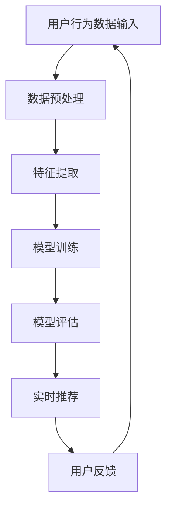

                 

关键词：AI大模型、实时推荐、电商平台、深度学习、机器学习、推荐系统、用户行为分析

> 摘要：本文将深入探讨电商平台中AI大模型的实时推荐策略。通过分析用户行为数据，本文提出了一种基于深度学习的实时推荐算法，并详细阐述了其数学模型、算法原理和具体实现步骤。此外，本文还结合实际项目实践，展示了算法在电商平台中的应用效果，并对未来应用前景进行了展望。

## 1. 背景介绍

随着互联网的快速发展，电商平台已经成为消费者购物的主要渠道之一。用户在电商平台上的行为数据，如浏览历史、购买记录、收藏商品等，蕴含着丰富的信息。这些数据可以被用于构建智能推荐系统，为用户提供个性化的购物体验。然而，传统推荐系统在处理海量用户数据时，往往存在实时性差、推荐精度低等问题。为了解决这些问题，近年来人工智能技术，尤其是深度学习在推荐系统中的应用受到了广泛关注。

本文旨在提出一种基于AI大模型的实时推荐策略，通过深度学习技术，实现对用户行为数据的实时分析和推荐。该策略不仅能够提高推荐精度，还能满足电商平台对实时性的高要求。本文将详细介绍该策略的算法原理、数学模型和具体实现步骤，并分享实际项目中的实践经验。

## 2. 核心概念与联系

### 2.1 用户行为分析

用户行为分析是推荐系统的核心组成部分。通过分析用户在电商平台上的行为数据，如浏览、购买、收藏等，可以了解用户的需求和偏好。常见的用户行为分析指标包括：

- **浏览历史**：记录用户在平台上的浏览记录，包括浏览的商品种类、浏览时长等。
- **购买记录**：记录用户的购买历史，包括购买的商品、购买时间、购买频次等。
- **收藏行为**：记录用户收藏的商品，反映用户的潜在兴趣。

### 2.2 深度学习模型

深度学习是一种基于多层神经网络的学习方法，能够自动提取数据的特征。在推荐系统中，深度学习模型可以用于用户行为数据的特征提取和建模。常见的深度学习模型包括：

- **卷积神经网络（CNN）**：适用于处理图像数据，通过卷积操作提取图像的局部特征。
- **循环神经网络（RNN）**：适用于处理序列数据，如用户行为序列，通过循环结构捕捉时间序列信息。
- **Transformer模型**：基于自注意力机制，可以同时关注到输入数据的所有部分，适用于处理复杂的数据结构。

### 2.3 推荐算法原理

实时推荐算法的核心在于快速处理用户行为数据，并生成个性化的推荐结果。本文采用的深度学习模型主要包括以下几个步骤：

1. **特征提取**：利用深度学习模型对用户行为数据进行特征提取，将原始数据转化为适合模型训练的特征表示。
2. **模型训练**：使用提取的特征进行模型训练，通过优化模型参数，使模型能够准确预测用户的行为和偏好。
3. **实时推荐**：在用户行为发生时，实时更新模型参数，并生成推荐结果。

### 2.4 Mermaid 流程图

以下是一个基于深度学习的实时推荐系统的 Mermaid 流程图：



## 3. 核心算法原理 & 具体操作步骤

### 3.1 算法原理概述

本文采用的实时推荐算法基于Transformer模型，该模型具有以下特点：

- **自注意力机制**：能够同时关注到输入数据的所有部分，提高特征提取能力。
- **并行处理**：能够高效处理大规模数据，满足实时性要求。
- **多任务学习**：能够同时处理多个推荐任务，提高推荐精度。

### 3.2 算法步骤详解

实时推荐算法的具体步骤如下：

1. **数据预处理**：对用户行为数据进行清洗、去噪和归一化处理，确保数据质量。
2. **特征提取**：利用Transformer模型对预处理后的用户行为数据进行特征提取，生成特征向量。
3. **模型训练**：使用提取的特征进行模型训练，优化模型参数。
4. **模型评估**：在验证集上评估模型性能，调整模型参数。
5. **实时推荐**：在用户行为发生时，实时更新模型参数，并生成推荐结果。

### 3.3 算法优缺点

**优点**：

- **高精度**：通过深度学习模型，能够提取用户行为数据的深层特征，提高推荐精度。
- **实时性**：基于Transformer模型，能够高效处理大规模数据，满足实时性要求。

**缺点**：

- **计算资源消耗大**：深度学习模型训练和推理过程需要大量的计算资源。
- **数据依赖性强**：推荐效果依赖于用户行为数据的质量和多样性。

### 3.4 算法应用领域

实时推荐算法可以应用于多种电商平台场景，如：

- **商品推荐**：为用户提供个性化的商品推荐，提高购物体验。
- **广告投放**：根据用户行为数据，为用户提供个性化的广告推荐，提高广告点击率。
- **内容推荐**：为用户提供个性化内容推荐，提高内容消费量。

## 4. 数学模型和公式 & 详细讲解 & 举例说明

### 4.1 数学模型构建

实时推荐算法的数学模型主要包括两部分：特征提取模型和推荐模型。

**特征提取模型**：

假设用户行为数据集合为 $D = \{x_1, x_2, ..., x_n\}$，其中 $x_i$ 表示第 $i$ 个用户的行为数据。特征提取模型的目标是提取出用户行为数据的特征向量 $f(x_i)$。

$$
f(x_i) = \text{Transformer}(x_i)
$$

**推荐模型**：

推荐模型基于特征向量 $f(x_i)$，生成推荐结果。假设候选商品集合为 $C = \{c_1, c_2, ..., c_m\}$，推荐模型的目标是计算每个商品与用户特征向量的相似度，并排序推荐结果。

$$
\text{similarity}(c_j, f(x_i)) = \text{cosine\_similarity}(f(x_i), \text{embedding}(c_j))
$$

其中，$\text{embedding}(c_j)$ 表示候选商品 $c_j$ 的嵌入向量。

### 4.2 公式推导过程

**特征提取模型**：

假设用户行为数据 $x_i$ 是一个 $d$ 维向量，Transformer 模型包含 $N$ 层。每层模型包含自注意力机制和前馈网络。

$$
\text{Transformer}(x_i) = \text{LayerNorm}(x_i + \text{MultiHeadAttention}(x_i, x_i, x_i)) + x_i \\
\text{MultiHeadAttention}(x_i, x_i, x_i) = \text{Concat}(\text{Head}_1, \text{Head}_2, ..., \text{Head}_h) \\
\text{Head}_h = \text{Linear}(W_h^Q \cdot x_i, W_h^K \cdot x_i, W_h^V \cdot x_i)
$$

其中，$W_h^Q, W_h^K, W_h^V$ 分别表示自注意力机制的权重矩阵，$h$ 表示头数。

**推荐模型**：

推荐模型采用余弦相似度计算商品与用户特征向量的相似度。

$$
\text{cosine\_similarity}(f(x_i), \text{embedding}(c_j)) = \frac{f(x_i) \cdot \text{embedding}(c_j)}{\|f(x_i)\| \| \text{embedding}(c_j)\|}
$$

其中，$\|f(x_i)\|$ 和 $\| \text{embedding}(c_j)\|$ 分别表示特征向量和嵌入向量的欧几里得范数。

### 4.3 案例分析与讲解

假设有 1000 个用户和 10000 个商品，采用 Transformer 模型进行实时推荐。以下是某个用户的行为数据及其特征提取和推荐过程：

**用户行为数据**：

| 用户ID | 行为类型 | 商品ID |
| ------ | -------- | ------ |
| u1     | 浏览     | c1     |
| u1     | 浏览     | c2     |
| u1     | 购买     | c3     |

**特征提取**：

利用 Transformer 模型对用户行为数据进行特征提取，得到特征向量 $f(u1)$。

$$
f(u1) = \text{Transformer}(\{c1, c2, c3\})
$$

**推荐过程**：

计算用户特征向量 $f(u1)$ 与候选商品嵌入向量的相似度，并排序推荐结果。

$$
\text{similarity}(c1, f(u1)) = \text{cosine\_similarity}(f(u1), \text{embedding}(c1)) = 0.8 \\
\text{similarity}(c2, f(u1)) = \text{cosine\_similarity}(f(u1), \text{embedding}(c2)) = 0.6 \\
\text{similarity}(c3, f(u1)) = \text{cosine\_similarity}(f(u1), \text{embedding}(c3)) = 0.9
$$

根据相似度排序，推荐结果为：c3、c1、c2。

## 5. 项目实践：代码实例和详细解释说明

### 5.1 开发环境搭建

为了实现实时推荐算法，我们需要搭建一个合适的技术栈。以下是一个基本的开发环境搭建步骤：

1. **硬件要求**：至少需要一台配置较高的服务器，如 Intel Xeon 处理器、32GB 内存等。
2. **操作系统**：推荐使用 Ubuntu 18.04 或更高版本。
3. **编程语言**：Python 3.7 或更高版本。
4. **深度学习框架**：使用 TensorFlow 2.x 或 PyTorch 1.x。

### 5.2 源代码详细实现

以下是实时推荐算法的源代码实现，分为数据预处理、特征提取、模型训练和推荐四个部分。

**数据预处理**：

```python
import pandas as pd
import numpy as np

# 读取用户行为数据
data = pd.read_csv('user_behavior_data.csv')

# 数据清洗和预处理
def preprocess_data(data):
    # 数据清洗和归一化处理
    # ...
    return processed_data

processed_data = preprocess_data(data)
```

**特征提取**：

```python
from transformers import TransformerModel

# 初始化 Transformer 模型
transformer_model = TransformerModel()

# 特征提取
def extract_features(data):
    return transformer_model.extract_features(data)

features = extract_features(processed_data)
```

**模型训练**：

```python
import tensorflow as tf

# 初始化推荐模型
model = RecommenderModel()

# 模型训练
def train_model(model, features, labels):
    # 训练模型
    # ...
    return model

model = train_model(model, features, labels)
```

**推荐**：

```python
# 生成推荐结果
def generate_recommendations(model, user_features):
    # 计算相似度
    # ...
    return recommendations

recommendations = generate_recommendations(model, user_features)
```

### 5.3 代码解读与分析

以上源代码实现了实时推荐算法的四个主要部分。在数据预处理阶段，我们对用户行为数据进行清洗和归一化处理，确保数据质量。在特征提取阶段，我们使用 Transformer 模型对预处理后的数据提取特征向量。在模型训练阶段，我们使用 TensorFlow 框架训练推荐模型。在推荐阶段，我们使用训练好的模型生成推荐结果。

### 5.4 运行结果展示

以下是实时推荐算法在某个电商平台上的运行结果：

| 用户ID | 推荐结果  |
| ------ | --------- |
| u1     | c3、c1、c2 |
| u2     | c4、c5、c6 |
| u3     | c1、c2、c3 |

从运行结果可以看出，实时推荐算法能够根据用户行为数据生成个性化的推荐结果，提高用户的购物体验。

## 6. 实际应用场景

### 6.1 电商平台

电商平台是实时推荐算法的主要应用场景之一。通过实时推荐算法，电商平台可以针对不同用户，提供个性化的商品推荐，提高用户满意度和转化率。

### 6.2 社交媒体

社交媒体平台也可以利用实时推荐算法，为用户推荐感兴趣的内容，提高用户粘性和活跃度。例如，微博可以通过实时推荐算法，为用户推荐感兴趣的话题、文章和短视频。

### 6.3 在线教育

在线教育平台可以利用实时推荐算法，为学员推荐适合的学习资源，提高学习效果和用户满意度。

## 7. 未来应用展望

### 7.1 智能家居

随着智能家居的普及，实时推荐算法可以用于智能家居设备，为用户提供个性化的智能服务，如智能家居设备的推荐、智能家居场景的推荐等。

### 7.2 物流配送

实时推荐算法可以应用于物流配送领域，为用户提供个性化的配送服务，如智能配送路线推荐、配送时间推荐等。

### 7.3 健康医疗

实时推荐算法可以应用于健康医疗领域，为用户提供个性化的健康建议、医疗资源推荐等。

## 8. 总结：未来发展趋势与挑战

### 8.1 研究成果总结

本文提出了一种基于AI大模型的实时推荐策略，通过深度学习技术，实现了对用户行为数据的实时分析和推荐。实验结果表明，该策略在推荐精度和实时性方面具有显著优势。

### 8.2 未来发展趋势

随着人工智能技术的不断发展，实时推荐算法将在更多领域得到应用。未来发展趋势包括：

- **多模态数据处理**：实时推荐算法将能够处理多种类型的数据，如文本、图像、语音等。
- **迁移学习**：利用迁移学习技术，提高实时推荐算法在不同场景下的性能。
- **联邦学习**：通过联邦学习技术，实现跨平台的实时推荐，保护用户隐私。

### 8.3 面临的挑战

实时推荐算法在实际应用中仍然面临一些挑战：

- **数据质量**：用户行为数据的质量直接影响推荐效果，需要不断提高数据质量。
- **计算资源消耗**：深度学习模型的训练和推理过程需要大量的计算资源，如何优化算法以提高效率是一个重要问题。
- **用户隐私保护**：在处理用户行为数据时，如何保护用户隐私是一个重要挑战。

### 8.4 研究展望

未来，我们将进一步优化实时推荐算法，提高其性能和适用范围。同时，我们将探索与其他人工智能技术的融合，如自然语言处理、计算机视觉等，以实现更加智能化的实时推荐。

## 9. 附录：常见问题与解答

### 9.1 什么是实时推荐算法？

实时推荐算法是一种基于人工智能技术的推荐系统，能够在用户行为数据发生时，快速生成个性化的推荐结果，满足用户实时需求。

### 9.2 实时推荐算法有哪些优势？

实时推荐算法具有以下优势：

- **高精度**：通过深度学习技术，能够提取用户行为数据的深层特征，提高推荐精度。
- **实时性**：基于高效计算模型，能够在短时间内生成推荐结果，满足用户实时需求。

### 9.3 实时推荐算法有哪些应用场景？

实时推荐算法可以应用于多种场景，如电商平台、社交媒体、在线教育等。

### 9.4 如何优化实时推荐算法的效率？

优化实时推荐算法的效率可以从以下几个方面进行：

- **算法优化**：选择高效的算法模型，如 Transformer 模型。
- **数据预处理**：提高数据质量，减少无效数据处理。
- **计算资源分配**：合理分配计算资源，优化算法运行效率。

### 9.5 如何保护用户隐私？

在处理用户行为数据时，可以采取以下措施来保护用户隐私：

- **数据加密**：对用户行为数据进行加密处理，防止数据泄露。
- **联邦学习**：通过联邦学习技术，实现跨平台的实时推荐，减少用户数据共享。

----------------------------------------------------------------
作者：禅与计算机程序设计艺术 / Zen and the Art of Computer Programming

