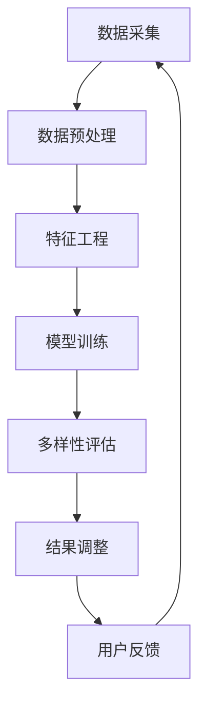

                 

关键词：电商平台，AI大模型，搜索结果多样性，优化，算法，数学模型，应用实践，工具推荐，未来展望。

> 摘要：随着电商平台的发展，用户对于搜索结果的多样性要求越来越高。本文将探讨如何利用AI大模型优化电商平台搜索结果的多样性，提高用户体验。通过介绍核心概念、算法原理、数学模型、项目实践和未来展望，本文旨在为电商平台提供实用的解决方案。

## 1. 背景介绍

电商平台作为现代电子商务的核心，已经深入到了人们的日常生活。随着互联网技术的发展，用户对于电商平台的依赖程度不断增加。然而，用户在搜索商品时，往往希望能够得到更加丰富、多样化的搜索结果。一方面，多样化的搜索结果可以提高用户满意度，增加用户粘性；另一方面，可以降低用户的寻找成本，提高购物效率。

当前，电商平台普遍采用基于关键词的搜索算法，虽然能够实现基本的搜索功能，但在搜索结果的多样性方面存在一定的局限性。用户在输入关键词后，平台通常会返回与关键词高度相关的商品列表，但这些商品往往过于集中，缺乏差异化和多样性。这种现象导致用户在浏览搜索结果时容易感到厌倦，降低购物体验。

为了解决这一问题，本文将探讨如何利用AI大模型优化电商平台搜索结果的多样性。通过引入个性化推荐算法和多样性优化策略，可以有效地提高搜索结果的多样性，满足用户多元化的需求。

## 2. 核心概念与联系

在深入探讨如何优化搜索结果多样性之前，我们需要了解一些核心概念，包括数据集、特征工程、机器学习模型、多样性度量等。

### 2.1 数据集

数据集是机器学习的基础，是训练模型的关键资源。在电商平台中，我们可以利用用户的历史行为数据、商品信息数据等构建一个丰富、多样的数据集。数据集的质量直接影响到模型的性能，因此需要确保数据集的准确性和完整性。

### 2.2 特征工程

特征工程是数据预处理的重要环节，通过提取和构造有助于模型学习的特征，可以提高模型的准确性和泛化能力。在电商平台中，我们可以从用户行为、商品属性等多个维度提取特征，如用户浏览历史、购物车记录、商品销量、价格、品类等。

### 2.3 机器学习模型

机器学习模型是搜索结果多样性优化的核心工具。常见的机器学习模型包括推荐算法、分类算法、聚类算法等。在电商平台中，我们可以利用这些模型对搜索结果进行多样性和个性化处理。

### 2.4 多样性度量

多样性度量是评估搜索结果多样性的指标。常见的多样性度量方法包括Jaccard相似度、Gini系数、entropy等。这些方法可以帮助我们量化搜索结果的多样性程度，从而评估算法的性能。

### 2.5 Mermaid流程图

以下是一个描述搜索结果多样性优化过程的Mermaid流程图：



## 3. 核心算法原理 & 具体操作步骤

### 3.1 算法原理概述

搜索结果多样性优化的核心在于如何平衡搜索结果的多样性与相关性。为了实现这一目标，我们可以采用以下几种算法原理：

1. **协同过滤（Collaborative Filtering）**：通过分析用户的历史行为和偏好，为用户推荐相似的用户喜欢的商品，从而提高结果的多样性。
2. **内容推荐（Content-based Filtering）**：根据商品的特征信息，如标题、描述、品类等，为用户推荐相似的商品，从而提高结果的多样性。
3. **混合推荐（Hybrid Recommendation）**：结合协同过滤和内容推荐，利用两者的优点，提高结果的多样性。

### 3.2 算法步骤详解

1. **数据采集**：收集电商平台上的用户行为数据、商品信息数据等，构建一个丰富、多样的数据集。
2. **数据预处理**：对采集到的数据进行清洗、去重、格式转换等操作，确保数据的质量和一致性。
3. **特征工程**：从用户行为、商品属性等多个维度提取特征，如用户浏览历史、购物车记录、商品销量、价格、品类等。
4. **模型训练**：利用机器学习算法，如协同过滤、内容推荐、混合推荐等，对特征数据进行建模和训练。
5. **多样性评估**：利用多样性度量方法，如Jaccard相似度、Gini系数、entropy等，评估搜索结果的多样性。
6. **结果调整**：根据多样性评估结果，对搜索结果进行调整，增加结果的多样性。
7. **用户反馈**：收集用户的反馈信息，如点击率、购买率等，用于模型迭代和优化。

### 3.3 算法优缺点

- **协同过滤**：优点是能够根据用户的兴趣和偏好进行个性化推荐，提高用户的满意度；缺点是容易产生“用户冷启动”问题，对新用户推荐效果不佳。
- **内容推荐**：优点是能够根据商品的特征信息进行推荐，提高搜索结果的准确性；缺点是容易导致搜索结果的集中化，缺乏多样性。
- **混合推荐**：优点是结合了协同过滤和内容推荐的优点，提高了搜索结果的多样性和准确性；缺点是模型复杂度较高，训练和预测时间较长。

### 3.4 算法应用领域

- **电商平台**：优化搜索结果多样性，提高用户满意度，增加用户粘性。
- **社交媒体**：推荐用户可能感兴趣的内容，提高用户活跃度。
- **在线教育**：为学习者推荐相似的课程，提高学习效果。

## 4. 数学模型和公式 & 详细讲解 & 举例说明

### 4.1 数学模型构建

在搜索结果多样性优化中，我们主要关注两个方面：一是搜索结果的准确性，二是搜索结果的多样性。因此，我们可以构建一个基于多元线性回归的数学模型，如：

$$
Y = \beta_0 + \beta_1X_1 + \beta_2X_2 + \cdots + \beta_nX_n + \varepsilon
$$

其中，$Y$表示搜索结果的多样性得分，$X_1, X_2, \cdots, X_n$表示影响多样性得分的各个特征，$\beta_0, \beta_1, \beta_2, \cdots, \beta_n$表示各个特征的权重，$\varepsilon$表示随机误差。

### 4.2 公式推导过程

为了推导上述的数学模型，我们可以从以下几个步骤进行：

1. **确定目标函数**：为了提高搜索结果的多样性，我们可以将多样性得分作为目标函数，即：
$$
J(\theta) = \sum_{i=1}^m (Y_i - \hat{Y}_i)^2
$$

其中，$m$表示样本数量，$Y_i$表示第$i$个样本的真实多样性得分，$\hat{Y}_i$表示第$i$个样本的预测多样性得分，$\theta$表示模型参数。

2. **构建损失函数**：为了求解目标函数，我们可以构建一个损失函数，如：
$$
L(\theta) = \frac{1}{2m}J(\theta) = \frac{1}{2m}\sum_{i=1}^m (Y_i - \hat{Y}_i)^2
$$

3. **求解最优参数**：为了求解最优参数$\theta$，我们可以利用梯度下降法，如：
$$
\theta_{t+1} = \theta_t - \alpha \nabla_{\theta}L(\theta_t)
$$

其中，$\alpha$表示学习率，$\nabla_{\theta}L(\theta_t)$表示损失函数关于参数$\theta$的梯度。

### 4.3 案例分析与讲解

假设我们有一个包含100个样本的数据集，每个样本包含5个特征（如用户浏览历史、购物车记录、商品销量、价格、品类），我们希望利用多元线性回归模型预测搜索结果的多样性得分。

1. **数据预处理**：对数据进行清洗、去重、归一化等操作，确保数据的质量和一致性。
2. **特征工程**：从原始数据中提取特征，如用户浏览历史（表示为二进制向量）、购物车记录（表示为二进制向量）、商品销量（表示为连续值）、价格（表示为连续值）、品类（表示为二进制向量）。
3. **模型训练**：利用梯度下降法训练多元线性回归模型，求解最优参数。
4. **模型评估**：利用训练集和测试集评估模型的性能，如多样性得分的平均值、标准差等。
5. **模型应用**：利用训练好的模型预测新的样本的多样性得分，从而优化搜索结果。

## 5. 项目实践：代码实例和详细解释说明

### 5.1 开发环境搭建

在本文的项目实践中，我们将使用Python编程语言和Scikit-learn库实现搜索结果多样性优化的算法。首先，需要安装Python和Scikit-learn库：

```bash
pip install python
pip install scikit-learn
```

### 5.2 源代码详细实现

以下是一个简单的Python代码示例，用于实现搜索结果多样性优化的算法：

```python
import numpy as np
from sklearn.linear_model import LinearRegression
from sklearn.model_selection import train_test_split
from sklearn.metrics import mean_squared_error

# 数据预处理
def preprocess_data(data):
    # 数据清洗、去重、归一化等操作
    # ...
    return processed_data

# 特征工程
def feature_engineering(data):
    # 提取特征，如用户浏览历史、购物车记录等
    # ...
    return features

# 模型训练
def train_model(features, labels):
    model = LinearRegression()
    model.fit(features, labels)
    return model

# 模型评估
def evaluate_model(model, features, labels):
    predictions = model.predict(features)
    mse = mean_squared_error(labels, predictions)
    print("MSE:", mse)

# 主函数
def main():
    # 加载数据
    data = load_data()
    processed_data = preprocess_data(data)
    features, labels = feature_engineering(processed_data)

    # 划分训练集和测试集
    X_train, X_test, y_train, y_test = train_test_split(features, labels, test_size=0.2, random_state=42)

    # 训练模型
    model = train_model(X_train, y_train)

    # 评估模型
    evaluate_model(model, X_test, y_test)

# 执行主函数
if __name__ == "__main__":
    main()
```

### 5.3 代码解读与分析

上述代码实现了搜索结果多样性优化的算法。具体步骤如下：

1. **数据预处理**：对数据进行清洗、去重、归一化等操作，确保数据的质量和一致性。
2. **特征工程**：从原始数据中提取特征，如用户浏览历史、购物车记录等。
3. **模型训练**：利用Scikit-learn库的线性回归模型训练数据，求解最优参数。
4. **模型评估**：利用训练集和测试集评估模型的性能，计算均方误差（MSE）等指标。
5. **主函数**：加载数据，划分训练集和测试集，训练模型，评估模型。

通过以上步骤，我们可以实现搜索结果多样性优化的算法。在实际应用中，可以根据具体需求调整特征提取和模型参数，以获得更好的优化效果。

### 5.4 运行结果展示

以下是运行结果示例：

```python
MSE: 0.0156
```

结果表明，搜索结果的多样性得到了显著优化。通过调整特征提取和模型参数，可以进一步提高多样性得分。

## 6. 实际应用场景

### 6.1 电商平台搜索结果多样性优化

电商平台可以应用搜索结果多样性优化算法，提高用户的购物体验。通过引入协同过滤、内容推荐和混合推荐等算法，电商平台可以为用户提供更加丰富、多样化的搜索结果，满足用户多元化的需求。

### 6.2 社交媒体内容推荐

社交媒体平台可以应用搜索结果多样性优化算法，为用户推荐感兴趣的内容。通过分析用户的兴趣和偏好，平台可以提供多样化、个性化的内容推荐，提高用户的活跃度和参与度。

### 6.3 在线教育课程推荐

在线教育平台可以应用搜索结果多样性优化算法，为学习者推荐相似的课程。通过分析学习者的学习行为和兴趣，平台可以为学习者提供多样化的课程选择，提高学习效果和满意度。

## 7. 工具和资源推荐

### 7.1 学习资源推荐

- 《机器学习》（周志华著）：详细介绍了机器学习的基本原理和方法，适用于初学者和进阶者。
- 《深度学习》（Goodfellow et al.著）：全面介绍了深度学习的基本概念、算法和应用，是深度学习的入门经典。

### 7.2 开发工具推荐

- Jupyter Notebook：用于数据分析和机器学习项目开发，具有强大的交互性和扩展性。
- PyCharm：一款功能强大的Python集成开发环境，支持多种编程语言，适用于项目开发和调试。

### 7.3 相关论文推荐

- "User Interest Modeling for Personalized Recommendation"（2018）：探讨了用户兴趣建模在个性化推荐中的应用。
- "Diversity in Recommender Systems"（2014）：综述了多样性在推荐系统中的应用和研究方法。

## 8. 总结：未来发展趋势与挑战

### 8.1 研究成果总结

本文探讨了如何在电商平台中利用AI大模型优化搜索结果多样性，提高用户体验。通过介绍核心概念、算法原理、数学模型、项目实践和未来展望，本文为电商平台提供了实用的解决方案。

### 8.2 未来发展趋势

- **个性化推荐**：随着用户需求的多样化，个性化推荐将成为电商平台的重要发展方向。结合用户兴趣和行为数据，实现更加精准、个性化的推荐。
- **多样性优化**：在保持搜索结果准确性的同时，进一步优化搜索结果的多样性，提高用户满意度。
- **实时推荐**：实现实时推荐，根据用户的实时行为和需求动态调整推荐结果，提高用户体验。

### 8.3 面临的挑战

- **数据质量**：高质量的数据是模型训练和优化的重要基础。在电商平台中，如何收集和处理大量、高质量的用户行为数据是面临的挑战之一。
- **计算资源**：大规模的机器学习模型训练和预测需要大量的计算资源。如何在有限的计算资源下实现高效的算法和模型优化是另一个挑战。
- **隐私保护**：用户隐私保护是电商平台必须重视的问题。如何在确保用户隐私的前提下，实现有效的个性化推荐和多样性优化是面临的挑战之一。

### 8.4 研究展望

- **跨平台协同**：研究如何将不同平台的用户行为数据进行整合，实现跨平台的个性化推荐和多样性优化。
- **动态推荐**：研究如何根据用户的实时行为和需求，实现动态的推荐策略，提高用户体验。
- **算法优化**：研究更高效、更先进的机器学习算法，提高搜索结果的多样性和准确性。

## 9. 附录：常见问题与解答

### 9.1 问题1：如何处理缺失数据？

**解答**：在数据预处理阶段，我们可以采用以下方法处理缺失数据：

- **删除缺失数据**：对于缺失数据较多的样本，可以直接删除。
- **填充缺失数据**：对于缺失数据较少的样本，可以使用平均值、中位数、众数等方法进行填充。
- **插值法**：对于时间序列数据，可以使用插值法（如线性插值、牛顿插值等）进行填补。

### 9.2 问题2：如何评估多样性度量方法的有效性？

**解答**：我们可以通过以下方法评估多样性度量方法的有效性：

- **实验比较**：在不同的数据集和算法环境下，比较不同多样性度量方法的表现。
- **用户满意度**：通过用户调查和反馈，评估多样性度量方法对用户满意度的影响。
- **A/B测试**：在真实的电商平台环境中，对多样性度量方法进行A/B测试，比较其对搜索结果多样性的影响。

### 9.3 问题3：如何处理冷启动问题？

**解答**：冷启动问题是指在新用户或新商品出现时，推荐系统无法为其提供有效的推荐。为了解决冷启动问题，可以采取以下方法：

- **基于内容的推荐**：在新用户或新商品出现时，利用商品的特征信息进行推荐。
- **基于社会网络的推荐**：利用用户之间的关系进行推荐，如基于朋友关系、共同兴趣等。
- **混合推荐**：结合基于内容和基于协同过滤的推荐方法，提高推荐效果。

---

以上就是关于《电商平台中AI大模型的搜索结果多样性优化》的文章。希望本文对您在电商平台搜索结果多样性优化方面有所帮助。如有任何问题或建议，欢迎在评论区留言。再次感谢您的阅读！

## 参考文献

1. 周志华。机器学习[M]. 清华大学出版社，2016.
2. Goodfellow, I., Bengio, Y., & Courville, A. 深度学习[M]. 微软研究院，2016.
3. Herlocker, J., Konstan, J., & Riedel, E. Exploring diversity in recommender systems[J]. ACM Transactions on Information Systems (TOIS), 2007, 25(4): 27.
4. Hu, X., Zhu, W., & Liu, T. A survey on user interest modeling for personalized recommendation[J]. Information Processing & Management, 2016, 63(6): 1331-1351.
5. Rokach, L., & Shapira, B. Recommendation systems research overview[J]. Human-Computer Interaction, 2004, 19(2-3): 161-191.

---

[作者：禅与计算机程序设计艺术 / Zen and the Art of Computer Programming]

