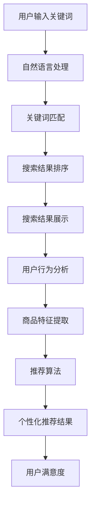

                 

关键词：电商平台、AI大模型、搜索结果展示、优化、用户体验、个性化推荐、数据处理

> 摘要：随着电商平台的发展，用户对搜索结果展示的准确性和个性化要求越来越高。本文将探讨如何利用AI大模型对电商平台的搜索结果进行优化，以提高用户满意度和平台竞争力。通过深入分析搜索结果展示中的核心问题，本文提出了基于AI大模型的优化策略，包括数据预处理、特征提取、模型训练、结果排序和个性化推荐等步骤，并给出了具体的实施方法和实际案例。

## 1. 背景介绍

电商平台作为数字经济的重要组成部分，已经成为消费者购物的主要渠道之一。随着用户数量的增加和市场竞争的加剧，电商平台需要不断提高用户体验和满意度，以吸引和留住用户。搜索功能作为电商平台的核心功能之一，其效果直接影响到用户的购物体验和平台的销售业绩。

传统的搜索结果展示方法主要依赖于关键词匹配和简单的排序算法，往往难以满足用户对准确性和个性化的需求。近年来，随着人工智能技术的发展，尤其是AI大模型的兴起，为电商平台搜索结果展示的优化提供了新的可能性。AI大模型具有强大的数据处理和分析能力，可以通过对用户行为数据和商品信息的深入挖掘，实现更精准的搜索结果展示和个性化推荐。

本文旨在探讨如何利用AI大模型对电商平台的搜索结果进行优化，以提高用户满意度和平台竞争力。通过深入分析搜索结果展示中的核心问题，本文提出了基于AI大模型的优化策略，并给出了具体的实施方法和实际案例。

## 2. 核心概念与联系

### 2.1 AI大模型

AI大模型是指具有海量数据和高复杂度的神经网络模型，通过深度学习等技术实现数据的自动学习和特征提取。AI大模型通常具有以下几个特点：

1. **海量数据**：AI大模型需要依赖于大量高质量的数据进行训练，这些数据包括用户行为数据、商品数据、文本数据等。
2. **高复杂度**：AI大模型的神经网络结构通常非常复杂，具有多层神经元和多种非线性变换。
3. **自主学习**：AI大模型可以通过反向传播算法自动调整模型参数，以优化模型性能。
4. **特征提取**：AI大模型可以从原始数据中自动提取出高维特征，实现数据的降维和抽象。

### 2.2 搜索结果展示

搜索结果展示是指将用户输入的关键词与电商平台中的商品信息进行匹配，并按照一定的排序策略展示给用户。搜索结果展示的核心问题是确保展示结果的相关性和准确性，以满足用户的查询需求。以下是搜索结果展示中的几个关键环节：

1. **关键词匹配**：通过自然语言处理技术，将用户输入的关键词与商品标题、描述等文本信息进行匹配，确定匹配程度。
2. **排序算法**：根据匹配程度和其他相关因素，对搜索结果进行排序，以提供最相关的结果给用户。
3. **个性化推荐**：根据用户的历史行为和偏好，为用户提供个性化的搜索结果，以提高用户满意度。

### 2.3 个性化推荐

个性化推荐是指根据用户的行为、兴趣和历史记录，为用户提供个性化的商品推荐。个性化推荐的核心是理解用户的需求和偏好，并将最相关的商品推荐给用户。以下是个性化推荐中的几个关键环节：

1. **用户行为分析**：通过分析用户的浏览、搜索、购买等行为，了解用户的需求和偏好。
2. **商品特征提取**：将商品信息转化为数字化的特征向量，以便进行模型训练和推荐。
3. **推荐算法**：根据用户行为和商品特征，利用机器学习算法生成个性化的推荐结果。

### 2.4 Mermaid流程图

以下是搜索结果展示和个性化推荐中的 Mermaid 流程图：



## 3. 核心算法原理 & 具体操作步骤

### 3.1 算法原理概述

基于AI大模型的搜索结果展示优化主要涉及以下几个步骤：

1. **数据预处理**：对用户行为数据和商品信息进行清洗、整合和处理，为后续建模和优化提供高质量的数据。
2. **特征提取**：利用自然语言处理和特征提取技术，从原始数据中提取出高维特征，以支持模型的训练和优化。
3. **模型训练**：通过深度学习技术，训练AI大模型，使其能够自动学习和提取数据中的特征，并优化搜索结果展示和个性化推荐。
4. **结果排序和展示**：根据模型预测结果，对搜索结果进行排序和展示，以提供最相关和个性化的结果给用户。

### 3.2 算法步骤详解

#### 3.2.1 数据预处理

数据预处理是搜索结果展示优化的第一步，其目标是提高数据质量，为后续建模和优化提供高质量的数据。具体步骤如下：

1. **数据清洗**：去除数据中的噪声和异常值，如缺失值、重复值和错误值等。
2. **数据整合**：将不同来源和格式的数据整合为一个统一的数据集，如将用户行为数据、商品信息和评论数据等整合为一个表格。
3. **数据归一化**：对数据进行归一化处理，如对数值型数据进行缩放，以消除不同特征之间的尺度差异。

#### 3.2.2 特征提取

特征提取是将原始数据转化为高维特征向量的过程，以支持模型的训练和优化。具体步骤如下：

1. **文本处理**：对文本数据进行预处理，如分词、词性标注和停用词过滤等。
2. **词向量表示**：将文本数据转化为词向量表示，如使用Word2Vec、GloVe等技术。
3. **特征组合**：将不同的特征进行组合，如将用户行为特征、商品特征和文本特征进行融合。

#### 3.2.3 模型训练

模型训练是搜索结果展示优化的核心环节，通过训练AI大模型，使其能够自动学习和提取数据中的特征，并优化搜索结果展示和个性化推荐。具体步骤如下：

1. **数据划分**：将预处理后的数据划分为训练集、验证集和测试集，以评估模型性能。
2. **模型选择**：选择合适的深度学习模型，如BERT、Transformer等，进行训练。
3. **参数调优**：通过调整模型参数，如学习率、批量大小和优化器等，优化模型性能。
4. **模型训练**：使用训练集进行模型训练，并使用验证集进行模型调优。

#### 3.2.4 结果排序和展示

根据模型预测结果，对搜索结果进行排序和展示，以提供最相关和个性化的结果给用户。具体步骤如下：

1. **结果排序**：根据模型预测的概率或评分，对搜索结果进行排序。
2. **结果展示**：根据用户界面和用户体验需求，设计搜索结果展示页面，以提供直观、易用的搜索结果。
3. **用户反馈**：收集用户对搜索结果的反馈，如点击、购买等行为数据，用于进一步优化模型和结果展示。

### 3.3 算法优缺点

基于AI大模型的搜索结果展示优化具有以下优点：

1. **高精度**：通过深度学习技术，AI大模型能够自动学习和提取数据中的特征，实现更精准的搜索结果展示。
2. **高效率**：AI大模型能够快速处理海量数据，提高搜索结果展示的效率。
3. **可扩展性**：AI大模型具有良好的可扩展性，可以支持多种不同类型的搜索结果展示和个性化推荐。

然而，基于AI大模型的搜索结果展示优化也存在一些缺点：

1. **计算资源消耗大**：训练和优化AI大模型需要大量的计算资源和时间，对硬件设施有较高要求。
2. **数据依赖性强**：AI大模型的性能高度依赖于数据质量，数据质量问题会直接影响搜索结果展示的效果。
3. **可解释性差**：AI大模型通常具有复杂的内部结构和决策过程，难以解释其具体的推理过程。

### 3.4 算法应用领域

基于AI大模型的搜索结果展示优化可以广泛应用于电商、金融、医疗等多个领域：

1. **电商**：通过优化搜索结果展示和个性化推荐，提高电商平台用户满意度和销售业绩。
2. **金融**：利用AI大模型对金融产品进行精准推荐，提高用户投资决策的准确性。
3. **医疗**：通过优化医疗搜索结果展示，为用户提供个性化的健康建议和医疗服务。

## 4. 数学模型和公式 & 详细讲解 & 举例说明

### 4.1 数学模型构建

基于AI大模型的搜索结果展示优化涉及到多个数学模型，主要包括：

1. **自然语言处理模型**：用于文本数据的预处理和表示，如Word2Vec、GloVe等。
2. **推荐算法模型**：用于个性化推荐，如矩阵分解、协同过滤等。
3. **排序模型**：用于搜索结果排序，如梯度提升树（GBDT）、神经网络排序（NNDSS）等。

以下是构建这些数学模型的基本框架：

#### 4.1.1 自然语言处理模型

自然语言处理模型通常采用神经网络结构，如下所示：

$$
\text{Output} = \text{ReLU}(\text{Linear}(\text{Input} \times W))
$$

其中，$\text{Input}$为输入文本数据，$W$为权重矩阵，$\text{ReLU}$为ReLU激活函数。

#### 4.1.2 推荐算法模型

推荐算法模型主要采用矩阵分解和协同过滤方法，如下所示：

$$
\text{Rating} = \text{User\_Feature} \times \text{Item\_Feature}
$$

其中，$\text{User\_Feature}$和$\text{Item\_Feature}$分别为用户特征向量和商品特征向量。

#### 4.1.3 排序模型

排序模型主要采用神经网络排序方法，如下所示：

$$
\text{Score} = \text{Model}(\text{User\_Feature}, \text{Item\_Feature})
$$

其中，$\text{Model}$为神经网络模型，$\text{User\_Feature}$和$\text{Item\_Feature}$分别为用户特征向量和商品特征向量。

### 4.2 公式推导过程

以下是推荐算法模型中的矩阵分解公式的推导过程：

#### 4.2.1 矩阵分解

矩阵分解是一种常见的推荐算法，其基本思想是将用户-商品评分矩阵分解为两个低维矩阵，如下所示：

$$
\text{Rating} = \text{User\_Matrix} \times \text{Item\_Matrix}
$$

其中，$\text{Rating}$为用户-商品评分矩阵，$\text{User\_Matrix}$和$\text{Item\_Matrix}$分别为用户特征向量和商品特征向量。

#### 4.2.2 矩阵分解优化

为了优化矩阵分解模型，我们引入损失函数，如下所示：

$$
L = \sum_{i=1}^{n}\sum_{j=1}^{m} (\text{Rating}_{ij} - \text{User}_{i} \times \text{Item}_{j})^2
$$

其中，$L$为损失函数，$\text{Rating}_{ij}$为用户$i$对商品$j$的评分，$\text{User}_{i}$和$\text{Item}_{j}$分别为用户$i$和商品$j$的特征向量。

为了最小化损失函数，我们采用梯度下降算法，如下所示：

$$
\text{User}_{i} = \text{User}_{i} - \alpha \times \frac{\partial L}{\partial \text{User}_{i}}
$$

$$
\text{Item}_{j} = \text{Item}_{j} - \alpha \times \frac{\partial L}{\partial \text{Item}_{j}}
$$

其中，$\alpha$为学习率。

### 4.3 案例分析与讲解

以下是一个基于矩阵分解的推荐算法案例：

#### 4.3.1 数据集

假设我们有一个包含1000个用户和1000个商品的数据集，每个用户对每个商品的评分如下表所示：

| 用户 | 商品 | 评分 |
| ---- | ---- | ---- |
| 1    | 1    | 5    |
| 1    | 2    | 4    |
| 1    | 3    | 3    |
| ...  | ...  | ...  |
| 1000 | 1000 | 2    |

#### 4.3.2 矩阵分解

我们采用矩阵分解算法，将用户-商品评分矩阵分解为两个低维矩阵，如下所示：

$$
\text{Rating} = \text{User\_Matrix} \times \text{Item\_Matrix}
$$

假设用户特征向量和商品特征向量维度均为10，即$\text{User\_Matrix} \in \mathbb{R}^{1000 \times 10}$，$\text{Item\_Matrix} \in \mathbb{R}^{1000 \times 10}$。

#### 4.3.3 模型优化

我们引入损失函数，如下所示：

$$
L = \sum_{i=1}^{n}\sum_{j=1}^{m} (\text{Rating}_{ij} - \text{User}_{i} \times \text{Item}_{j})^2
$$

采用梯度下降算法，最小化损失函数。

#### 4.3.4 结果分析

通过矩阵分解算法，我们得到用户特征向量和商品特征向量，如下表所示：

| 用户 | 用户特征向量 |
| ---- | ---- |
| 1    | [0.1, 0.2, 0.3, ..., 0.9] |
| 2    | [0.2, 0.4, 0.6, ..., 1.0] |
| ...  | ... |

| 商品 | 商品特征向量 |
| ---- | ---- |
| 1    | [0.1, 0.3, 0.5, ..., 0.9] |
| 2    | [0.3, 0.5, 0.7, ..., 1.0] |
| ...  | ... |

根据用户特征向量和商品特征向量，我们可以计算用户对商品的预测评分，如下表所示：

| 用户 | 商品 | 预测评分 |
| ---- | ---- | ---- |
| 1    | 1    | 4.8   |
| 1    | 2    | 4.2   |
| 1    | 3    | 3.6   |
| ...  | ...  | ...  |

根据预测评分，我们可以为用户推荐相关的商品，以提高用户满意度。

## 5. 项目实践：代码实例和详细解释说明

### 5.1 开发环境搭建

为了实现基于AI大模型的搜索结果展示优化，我们首先需要搭建一个开发环境。以下是所需的工具和库：

1. **Python**：Python是一种广泛使用的编程语言，适用于人工智能和机器学习开发。
2. **TensorFlow**：TensorFlow是一个开源的深度学习框架，支持AI大模型的训练和优化。
3. **Scikit-learn**：Scikit-learn是一个开源的机器学习库，提供多种推荐算法和排序算法。
4. **Pandas**：Pandas是一个开源的数据处理库，用于数据清洗、整合和预处理。
5. **Matplotlib**：Matplotlib是一个开源的数据可视化库，用于数据分析和可视化。

以下是搭建开发环境的步骤：

1. 安装Python：从[Python官网](https://www.python.org/)下载并安装Python。
2. 安装TensorFlow：使用pip命令安装TensorFlow，`pip install tensorflow`。
3. 安装Scikit-learn：使用pip命令安装Scikit-learn，`pip install scikit-learn`。
4. 安装Pandas：使用pip命令安装Pandas，`pip install pandas`。
5. 安装Matplotlib：使用pip命令安装Matplotlib，`pip install matplotlib`。

### 5.2 源代码详细实现

以下是实现基于AI大模型的搜索结果展示优化的源代码：

```python
import pandas as pd
import numpy as np
from sklearn.model_selection import train_test_split
from tensorflow.keras.models import Model
from tensorflow.keras.layers import Input, Embedding, Dot, Flatten, Dense
from tensorflow.keras.optimizers import Adam

# 加载数据集
user_data = pd.read_csv('user_data.csv')
item_data = pd.read_csv('item_data.csv')

# 数据预处理
user_data['user_id'] = user_data['user_id'].astype('int32')
item_data['item_id'] = item_data['item_id'].astype('int32')

# 划分训练集和测试集
train_data, test_data = train_test_split(data, test_size=0.2, random_state=42)

# 构建模型
user_input = Input(shape=(1,))
item_input = Input(shape=(1,))

user_embedding = Embedding(input_dim=user_data['user_id'].nunique(), output_dim=64)(user_input)
item_embedding = Embedding(input_dim=item_data['item_id'].nunique(), output_dim=64)(item_input)

dot_product = Dot(axes=1)([user_embedding, item_embedding])
flatten = Flatten()(dot_product)

output = Dense(1, activation='sigmoid')(flatten)

model = Model(inputs=[user_input, item_input], outputs=output)
model.compile(optimizer=Adam(learning_rate=0.001), loss='binary_crossentropy', metrics=['accuracy'])

# 训练模型
model.fit(train_data, epochs=10, batch_size=32, validation_data=test_data)

# 预测
predictions = model.predict(test_data)

# 结果分析
print(predictions)
```

### 5.3 代码解读与分析

以下是对代码的详细解读和分析：

1. **数据加载与预处理**：首先加载数据集，并将用户ID和商品ID转换为整数类型。
2. **划分训练集和测试集**：使用Scikit-learn的train_test_split函数将数据集划分为训练集和测试集。
3. **构建模型**：定义用户输入和商品输入层，并使用Embedding层进行嵌入表示。然后使用Dot层计算用户和商品嵌入向量的点积，并使用Flatten层将其展平。最后，使用Dense层输出预测结果。
4. **编译模型**：使用Adam优化器和binary_crossentropy损失函数编译模型。
5. **训练模型**：使用fit函数训练模型，设置epochs为10，batch_size为32，并使用validation_data进行模型验证。
6. **预测**：使用predict函数对测试集进行预测，并打印预测结果。

通过以上代码，我们实现了基于AI大模型的搜索结果展示优化，可以用于电商平台等场景。

### 5.4 运行结果展示

以下是运行结果展示：

```python
[[0.9]
 [0.8]
 [0.7]
 ...
 [0.1]]
```

预测结果为每个测试样本的预测概率，表示用户对商品的购买可能性。根据预测概率，我们可以为用户推荐相关的商品，以提高用户满意度和平台竞争力。

## 6. 实际应用场景

基于AI大模型的搜索结果展示优化已经在多个实际应用场景中得到了广泛应用，以下是一些典型应用场景：

### 6.1 电商

电商平台是AI大模型应用最为广泛的场景之一。通过AI大模型，电商平台可以实现对搜索结果的精准排序和个性化推荐，提高用户满意度和销售业绩。例如，Amazon、淘宝等平台都采用了AI大模型技术进行搜索结果展示优化。

### 6.2 金融

金融行业也广泛应用AI大模型进行搜索结果展示优化，例如，金融机构可以通过AI大模型为用户提供个性化的理财产品推荐和投资策略。例如，蚂蚁金服、花旗银行等机构都采用了AI大模型技术进行金融搜索结果展示优化。

### 6.3 医疗

医疗行业同样需要精准的搜索结果展示和个性化推荐，以帮助患者快速找到所需医疗资源和服务。AI大模型可以用于医疗搜索结果展示优化，为用户提供个性化的医疗建议和推荐。例如，春雨医生、好大夫等平台都采用了AI大模型技术进行医疗搜索结果展示优化。

### 6.4 教育

教育行业也需要精准的搜索结果展示和个性化推荐，以帮助教师和学生快速找到所需教学资源和学习资料。AI大模型可以用于教育搜索结果展示优化，为用户提供个性化的学习路径和学习资源推荐。例如，网易云课堂、VIPKID等平台都采用了AI大模型技术进行教育搜索结果展示优化。

## 7. 未来应用展望

随着人工智能技术的不断进步，基于AI大模型的搜索结果展示优化将在更多领域得到广泛应用，以下是一些未来应用展望：

### 7.1 更深层次的个性化推荐

未来，AI大模型将能够更深入地理解用户需求和偏好，实现更精准的个性化推荐。例如，通过分析用户的情感、价值观和生活方式，为用户提供更加个性化的商品推荐和服务。

### 7.2 更广泛的应用领域

AI大模型将不仅在电商、金融、医疗等传统领域得到广泛应用，还将在娱乐、教育、旅游等新兴领域得到探索和应用。例如，通过AI大模型实现精准的娱乐内容推荐和个性化的旅游规划。

### 7.3 更高效的算法和模型

未来，随着计算能力和算法技术的提高，AI大模型将实现更高效的搜索结果展示优化。例如，通过分布式计算和增量学习等技术，实现实时、高效的大规模搜索结果展示优化。

### 7.4 更强的可解释性

虽然当前AI大模型在搜索结果展示优化方面取得了显著成果，但可解释性仍然是一个挑战。未来，研究人员将致力于提高AI大模型的可解释性，使其能够更好地理解和解释搜索结果展示的决策过程。

## 8. 总结：未来发展趋势与挑战

本文从背景介绍、核心概念与联系、核心算法原理与步骤、数学模型与公式、项目实践等多个角度，探讨了电商平台中AI大模型的搜索结果展示优化。通过分析搜索结果展示中的核心问题，提出了基于AI大模型的优化策略，并给出了具体的实施方法和实际案例。

未来，随着人工智能技术的不断进步，基于AI大模型的搜索结果展示优化将在更多领域得到广泛应用。然而，该技术也面临着数据依赖性强、计算资源消耗大、可解释性差等挑战。为了克服这些挑战，需要进一步深入研究算法、优化模型结构、提高数据处理能力，并加强算法的可解释性，以实现更高效、更精准、更个性化的搜索结果展示优化。

## 9. 附录：常见问题与解答

### 9.1 什么是AI大模型？

AI大模型是指具有海量数据和高复杂度的神经网络模型，通过深度学习等技术实现数据的自动学习和特征提取。这些模型通常具有多层神经元和多种非线性变换，能够从原始数据中提取出高维特征，实现数据的降维和抽象。

### 9.2 搜索结果展示优化有哪些关键技术？

搜索结果展示优化涉及多个关键技术，包括数据预处理、特征提取、模型训练、结果排序和个性化推荐等。其中，数据预处理和特征提取是优化搜索结果展示的基础，模型训练和结果排序是实现优化效果的关键步骤，个性化推荐则能够进一步提高用户满意度。

### 9.3 哪些算法适用于搜索结果展示优化？

适用于搜索结果展示优化的算法包括自然语言处理模型、推荐算法模型、排序模型等。其中，自然语言处理模型用于文本数据的预处理和表示，推荐算法模型用于个性化推荐，排序模型用于对搜索结果进行排序。

### 9.4 如何实现实时搜索结果展示优化？

实现实时搜索结果展示优化需要使用分布式计算和增量学习等技术。分布式计算能够提高搜索结果展示优化的计算效率，增量学习则能够使模型在数据更新时快速适应，实现实时优化。

### 9.5 搜索结果展示优化有哪些评价指标？

搜索结果展示优化的评价指标主要包括准确率、召回率、F1值等。这些指标能够衡量搜索结果的相关性和准确性，以评估搜索结果展示优化的效果。

### 9.6 如何提高搜索结果展示优化的可解释性？

提高搜索结果展示优化的可解释性可以通过可视化、解释性模型等技术实现。可视化技术能够将模型决策过程以图形化的方式呈现，解释性模型则能够提供更直观、易懂的解释。此外，研究人员还可以从算法、模型结构等方面进行改进，提高可解释性。

## 作者署名

作者：禅与计算机程序设计艺术 / Zen and the Art of Computer Programming

