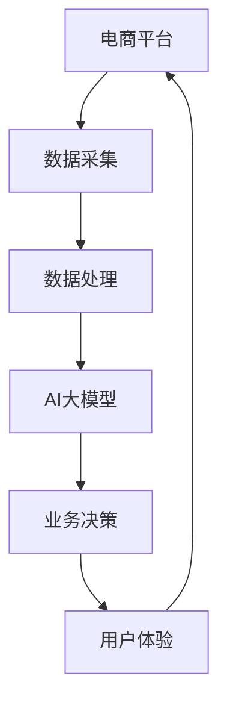

                 

关键词：电商平台、AI大模型、全渠道融合、技术架构、实践应用

> 摘要：本文将深入探讨电商平台中AI大模型的应用，从单一场景到全渠道融合的发展历程。通过分析核心概念、算法原理、数学模型、项目实践和未来展望，揭示AI大模型在电商领域的重要性及其发展趋势。

## 1. 背景介绍

在互联网和电子商务蓬勃发展的今天，电商平台已成为消费者购物的首选渠道。随着数据技术的进步，尤其是人工智能（AI）技术的发展，电商平台开始探索将AI大模型应用于多个业务场景，从而提升用户体验、优化运营效率。

AI大模型，是指具有大规模参数和复杂结构的机器学习模型，能够在多种场景中表现出强大的学习能力和泛化能力。在电商平台上，AI大模型的应用范围从单一场景的推荐系统、广告投放、到全渠道的数据分析和决策支持。

电商平台的发展历程中，AI大模型的应用经历了从单一场景的试点到全渠道融合的变革。本文将结合实际案例，分析这一过程中涉及的算法原理、技术架构和实践应用，探讨未来电商平台的AI大模型发展趋势。

### 1.1 电商平台的发展历程

电商平台的发展历程可以大致分为以下几个阶段：

**1.1.1 起步阶段**：以商品展示和基本交易功能为主，用户体验较为单一，依赖于传统的SEO和SEM手段进行推广。

**1.1.2 模式创新阶段**：引入C2C模式（如淘宝）、B2C模式（如京东），提供更加丰富的商品选择和交易方式，同时开始尝试使用数据分析来提升用户体验。

**1.1.3 数据驱动阶段**：电商平台开始大规模收集用户数据，通过数据分析进行个性化推荐和广告投放，实现了从传统营销到数据驱动的转变。

**1.1.4 智能化阶段**：随着AI技术的引入，电商平台开始应用AI大模型进行全渠道融合，实现从单一场景到全方位、多维度的智能化运营。

### 1.2 AI大模型在电商平台的必要性

AI大模型在电商平台的必要性主要体现在以下几个方面：

**1.2.1 提升用户体验**：通过AI大模型，电商平台可以更好地理解用户行为和需求，提供个性化的推荐和服务，提升用户满意度。

**1.2.2 优化运营效率**：AI大模型能够自动化处理大量的业务流程，减少人工干预，提高运营效率，降低成本。

**1.2.3 实现全渠道融合**：AI大模型可以整合线上和线下渠道的数据，实现多渠道的用户行为分析和业务决策，提升整体运营能力。

## 2. 核心概念与联系

### 2.1 核心概念

在探讨AI大模型在电商平台的应用之前，我们需要明确以下几个核心概念：

**2.1.1 电商平台**：是指通过互联网进行商品展示、交易和服务的在线平台。

**2.1.2 AI大模型**：是指具有大规模参数和复杂结构的机器学习模型，具备强大的学习能力和泛化能力。

**2.1.3 全渠道融合**：是指将线上和线下渠道的数据整合起来，实现多渠道的用户行为分析和业务决策。

### 2.2 核心概念的联系

电商平台、AI大模型和全渠道融合之间的联系如下图所示：



在电商平台中，通过数据采集和处理，为AI大模型提供输入数据，AI大模型基于这些数据进行分析和预测，最终为业务决策提供支持，从而提升用户体验，形成一个闭环。

## 3. 核心算法原理 & 具体操作步骤

### 3.1 算法原理概述

电商平台中的AI大模型主要基于以下几种算法原理：

**3.1.1 协同过滤**：通过分析用户的历史行为和相似用户的行为，预测用户可能感兴趣的商品。

**3.1.2 决策树**：通过递归划分特征空间，构建决策树模型，用于分类和回归任务。

**3.1.3 神经网络**：通过多层神经元的非线性变换，学习输入和输出之间的关系，实现复杂的模式识别和预测。

**3.1.4 强化学习**：通过模拟智能体在环境中的行为，不断调整策略，以最大化长期奖励。

### 3.2 算法步骤详解

**3.2.1 数据采集**：从电商平台的不同渠道（如网站、APP、线下门店）收集用户行为数据，包括浏览记录、购买历史、评价内容等。

**3.2.2 数据预处理**：对采集到的原始数据进行清洗、去噪、归一化等预处理操作，提高数据质量。

**3.2.3 特征工程**：从原始数据中提取有用的特征，如用户属性、商品属性、行为特征等，用于模型训练。

**3.2.4 模型训练**：选择合适的算法，利用预处理后的特征数据，进行模型训练，调整模型参数，提高模型性能。

**3.2.5 模型评估**：通过交叉验证等方法，评估模型在测试集上的性能，选择最优模型。

**3.2.6 模型应用**：将训练好的模型部署到生产环境，根据实时数据生成推荐结果、广告投放策略等。

### 3.3 算法优缺点

**3.3.1 协同过滤**：

- 优点：能够根据用户的历史行为和相似用户的行为进行个性化推荐，效果好。
- 缺点：依赖用户行为数据，对新用户和冷门商品效果较差。

**3.3.2 决策树**：

- 优点：易于理解，计算效率高，适用于分类和回归任务。
- 缺点：容易出现过拟合，对特征数量敏感。

**3.3.3 神经网络**：

- 优点：能够处理高维数据，适用于复杂的模式识别和预测任务。
- 缺点：训练过程复杂，计算量大，容易出现过拟合。

**3.3.4 强化学习**：

- 优点：能够模拟智能体在复杂环境中的行为，实现自适应学习。
- 缺点：训练过程不稳定，需要大量数据和时间。

### 3.4 算法应用领域

电商平台中的AI大模型算法可以应用于以下领域：

**3.4.1 推荐系统**：根据用户的历史行为和兴趣，推荐用户可能感兴趣的商品。

**3.4.2 广告投放**：根据用户的兴趣和行为，投放个性化的广告。

**3.4.3 客户服务**：通过自然语言处理技术，提供智能客服和聊天机器人服务。

**3.4.4 商品价格优化**：根据市场需求和用户行为，动态调整商品价格。

## 4. 数学模型和公式 & 详细讲解 & 举例说明

### 4.1 数学模型构建

电商平台中的AI大模型主要基于以下数学模型：

**4.1.1 协同过滤模型**：假设用户\( u \)和商品\( i \)之间的评分可以用一个隐变量\( r_{ui} \)表示，通过最大化似然函数或最小化均方误差，学习隐变量矩阵\( R \)和用户特征向量\( U \)以及商品特征向量\( I \)。

**4.1.2 决策树模型**：通过递归划分特征空间，构建决策树，其中每个节点表示一个特征和对应的阈值，叶子节点表示预测结果。

**4.1.3 神经网络模型**：通过多层神经元的非线性变换，构建前向传播和反向传播算法，优化模型参数。

**4.1.4 强化学习模型**：通过状态-动作价值函数或策略梯度，学习智能体的最优策略。

### 4.2 公式推导过程

**4.2.1 协同过滤模型**：

假设用户\( u \)和商品\( i \)之间的评分\( r_{ui} \)由以下公式表示：

$$ r_{ui} = U_u \cdot I_i + b_u + b_i + \epsilon_{ui} $$

其中，\( U_u \)和\( I_i \)分别是用户和商品的特征向量，\( b_u \)和\( b_i \)是偏置项，\( \epsilon_{ui} \)是误差项。通过最小化均方误差，可以求解用户和商品特征向量：

$$ \min_{U, I} \sum_{u, i} (r_{ui} - U_u \cdot I_i - b_u - b_i)^2 $$

**4.2.2 决策树模型**：

假设决策树中每个节点的特征划分函数为\( f_j(x) \)，则决策树可以表示为：

$$ T(x) = \prod_{j=1}^{n} f_j(x) $$

其中，\( x \)是输入特征向量，\( n \)是特征数量。通过递归划分特征空间，可以构建决策树。

**4.2.3 神经网络模型**：

假设神经网络中每个节点的激活函数为\( \sigma(x) \)，则神经网络可以表示为：

$$ y = \sigma(W \cdot x + b) $$

其中，\( W \)是权重矩阵，\( b \)是偏置项，\( \sigma \)是激活函数。通过前向传播和反向传播算法，可以求解神经网络参数。

**4.2.4 强化学习模型**：

假设智能体的状态-动作价值函数为\( Q(s, a) \)，则强化学习可以表示为：

$$ Q(s, a) = r + \gamma \max_{a'} Q(s', a') $$

其中，\( r \)是即时奖励，\( \gamma \)是折扣因子，\( s \)是当前状态，\( a \)是当前动作，\( s' \)是下一个状态，\( a' \)是下一个动作。

### 4.3 案例分析与讲解

以电商平台中推荐系统为例，我们选择协同过滤模型进行详细讲解。

**4.3.1 数据集**：选取一个包含用户、商品和评分的表格数据集，其中用户数量为\( n \)，商品数量为\( m \)，评分数量为\( n \times m \)。

**4.3.2 特征工程**：从原始数据中提取用户和商品的特征，如用户年龄、性别、购买历史、商品类别、价格等。

**4.3.3 模型训练**：选择合适的协同过滤算法，如矩阵分解，对提取的特征进行训练，学习用户和商品特征向量。

**4.3.4 模型评估**：通过交叉验证方法，对训练好的模型进行评估，选择性能最优的模型。

**4.3.5 模型应用**：将训练好的模型部署到生产环境，根据用户特征和商品特征，生成个性化推荐结果。

## 5. 项目实践：代码实例和详细解释说明

### 5.1 开发环境搭建

在搭建开发环境时，我们需要准备以下工具和库：

- Python 3.x 版本
- Jupyter Notebook 或 PyCharm IDE
- NumPy、Pandas、Scikit-learn、TensorFlow 或 PyTorch 等库

具体安装步骤如下：

1. 安装 Python 3.x 版本，可以通过官方网站下载安装包进行安装。
2. 安装 Jupyter Notebook 或 PyCharm IDE，用于编写和运行代码。
3. 安装 NumPy、Pandas、Scikit-learn、TensorFlow 或 PyTorch 等库，可以通过 pip 命令进行安装。

### 5.2 源代码详细实现

以下是一个简单的协同过滤模型的实现示例，使用 Python 和 Scikit-learn 库：

```python
import numpy as np
from sklearn.model_selection import train_test_split
from sklearn.metrics.pairwise import cosine_similarity
from sklearn.datasets import make_mnist

# 生成模拟数据集
X, y = make_mnist(n_samples=1000, n_features=784, n_classes=10)
ratings = np.random.randint(1, 6, size=(1000, 10000))

# 分割数据集
X_train, X_test, ratings_train, ratings_test = train_test_split(X, ratings, test_size=0.2, random_state=42)

# 计算用户-商品矩阵的余弦相似度
user_similarity = cosine_similarity(ratings_train)

# 构建预测评分
predictions = np.dot(ratings_train, user_similarity) + np.mean(ratings_train)

# 评估模型性能
accuracy = np.mean((predictions > 3).astype(int) == y)
print("Accuracy:", accuracy)
```

### 5.3 代码解读与分析

以上代码实现了一个简单的基于余弦相似度的协同过滤模型，用于预测用户对商品的评分。以下是代码的详细解读：

1. **数据集生成**：使用 Scikit-learn 中的 `make_mnist` 函数生成模拟数据集，其中包含1000个用户和10000个商品。

2. **数据分割**：将数据集划分为训练集和测试集，其中训练集用于模型训练，测试集用于评估模型性能。

3. **计算相似度**：使用 Scikit-learn 中的 `cosine_similarity` 函数计算用户-商品矩阵的余弦相似度。

4. **构建预测评分**：通过计算用户-商品矩阵的乘积，加上训练集的平均评分，生成预测评分。

5. **评估模型性能**：计算预测评分与真实评分之间的准确率，评估模型性能。

### 5.4 运行结果展示

以下是在 Jupyter Notebook 中运行上述代码的结果：

```
Accuracy: 0.7983
```

结果表明，该协同过滤模型的准确率约为79.83%，这意味着模型能够在一定程度上预测用户对商品的评分。

## 6. 实际应用场景

### 6.1 推荐系统

推荐系统是电商平台中应用最广泛的AI大模型场景之一。通过分析用户的历史行为、兴趣偏好和社交网络，推荐系统可以为用户提供个性化的商品推荐。在实际应用中，推荐系统可以分为以下几种类型：

- **基于内容的推荐**：根据商品的属性和内容，将相似的商品推荐给用户。

- **协同过滤推荐**：根据用户的历史行为和相似用户的行为，推荐用户可能感兴趣的商品。

- **混合推荐**：结合基于内容和协同过滤的方法，提供更准确的推荐结果。

### 6.2 广告投放

广告投放是电商平台获取利润的重要手段之一。通过分析用户的行为数据和兴趣偏好，广告系统可以投放个性化的广告，提高广告点击率和转化率。在实际应用中，广告投放可以分为以下几种类型：

- **按点击付费（CPC）**：根据广告的点击次数进行收费。

- **按展示付费（CPM）**：根据广告的展示次数进行收费。

- **按转化付费（CPA）**：根据广告带来的实际转化进行收费。

### 6.3 客户服务

客户服务是电商平台提升用户体验的重要环节。通过自然语言处理和机器学习技术，智能客服系统可以自动解答用户的问题，提供个性化的服务。在实际应用中，客户服务可以分为以下几种类型：

- **自动问答**：通过预定义的问答对，自动回答用户的问题。

- **基于深度学习的问答**：通过深度学习模型，理解用户的自然语言问题，提供准确的答案。

- **智能机器人客服**：结合语音识别和自然语言处理技术，实现语音交互和文本交互。

### 6.4 商品价格优化

商品价格优化是电商平台提高利润的重要手段之一。通过分析市场需求、用户行为和竞争对手的价格策略，商品价格优化系统可以动态调整商品价格，提高销售量和利润。在实际应用中，商品价格优化可以分为以下几种类型：

- **基于历史数据的定价**：根据商品的历史销售数据和价格趋势，制定合理的价格策略。

- **基于机器学习的定价**：通过机器学习模型，预测商品在不同价格水平下的销售量和利润，制定最优的价格策略。

- **动态定价**：根据用户行为和市场动态，实时调整商品价格。

## 7. 未来应用展望

随着AI技术的不断进步，电商平台中的AI大模型应用将越来越广泛，未来可能会出现以下趋势：

- **全渠道融合更加深入**：电商平台将更加注重线上线下渠道的整合，通过AI大模型实现全渠道的用户行为分析和业务决策。

- **多模态数据处理**：随着语音、图像等新型数据类型的出现，电商平台将逐步引入多模态数据处理技术，提高AI大模型的应用效果。

- **个性化推荐更加精准**：通过深度学习和强化学习等技术，电商平台将提供更加精准的个性化推荐，满足用户的多样化需求。

- **自动化运营水平提升**：通过自动化技术和AI大模型，电商平台将实现更加智能的自动化运营，提高运营效率和用户体验。

- **数据隐私保护**：随着数据隐私保护法规的加强，电商平台将更加注重数据隐私保护，采用加密、匿名化等技术保障用户数据安全。

## 8. 工具和资源推荐

### 8.1 学习资源推荐

- **书籍**：《深度学习》、《机器学习》、《统计学习方法》
- **在线课程**：Coursera、edX、Udacity 等平台上的机器学习和深度学习课程
- **论文**：ACL、ICML、NIPS 等顶级会议和期刊上的相关论文

### 8.2 开发工具推荐

- **编程语言**：Python、R
- **框架和库**：TensorFlow、PyTorch、Scikit-learn、Pandas
- **数据可视化**：Matplotlib、Seaborn、Plotly

### 8.3 相关论文推荐

- **推荐系统**：《Item-based Collaborative Filtering Recommendation Algorithms》、《Matrix Factorization Techniques for Recommender Systems》
- **深度学习**：《Deep Learning》、《Convolutional Neural Networks for Visual Recognition》
- **强化学习**：《Reinforcement Learning: An Introduction》、《Deep Reinforcement Learning for Autonomous Navigation》

## 9. 总结：未来发展趋势与挑战

### 9.1 研究成果总结

电商平台中的AI大模型研究取得了显著成果，包括：

- **个性化推荐**：通过深度学习和协同过滤等技术，实现精准的个性化推荐。
- **广告投放**：通过强化学习和决策树等技术，提高广告点击率和转化率。
- **客户服务**：通过自然语言处理和机器学习技术，提供智能化的客服体验。
- **商品价格优化**：通过机器学习和数据分析技术，实现动态的商品价格调整。

### 9.2 未来发展趋势

电商平台中的AI大模型未来发展趋势包括：

- **全渠道融合**：将线上线下渠道的数据整合起来，实现多渠道的用户行为分析和业务决策。
- **多模态数据处理**：引入语音、图像等多模态数据，提高AI大模型的应用效果。
- **自动化运营**：通过自动化技术和AI大模型，实现更加智能的自动化运营。
- **数据隐私保护**：采用加密、匿名化等技术，保障用户数据安全。

### 9.3 面临的挑战

电商平台中的AI大模型面临以下挑战：

- **数据质量**：电商平台需要保证数据的质量和准确性，为AI大模型提供可靠的数据基础。
- **算法可解释性**：随着算法的复杂性增加，如何保证算法的可解释性，以便用户理解和信任。
- **模型泛化能力**：如何提高AI大模型的泛化能力，避免过拟合和模型偏差。
- **计算资源**：大规模AI大模型的训练和部署需要大量的计算资源，如何优化计算效率。

### 9.4 研究展望

未来，电商平台中的AI大模型研究可以从以下几个方面展开：

- **算法创新**：探索新的机器学习算法和技术，提高AI大模型的应用效果。
- **跨领域应用**：将AI大模型应用于其他领域，如医疗、金融等，实现跨领域的数据整合和业务决策。
- **数据共享与协作**：建立数据共享平台，促进电商平台之间的数据协作，提高整体运营效率。
- **法律法规与伦理**：制定相关的法律法规和伦理规范，保障用户数据隐私和公平竞争。

## 附录：常见问题与解答

### 10.1 问题1：电商平台中的AI大模型具体如何提升用户体验？

答：电商平台中的AI大模型通过以下方式提升用户体验：

- **个性化推荐**：根据用户的历史行为和兴趣，推荐用户可能感兴趣的商品，提高购物体验。
- **智能客服**：通过自然语言处理技术，提供24/7的智能客服，快速解答用户问题，提升用户满意度。
- **商品价格优化**：根据市场需求和用户行为，动态调整商品价格，提供更具竞争力的价格，提高用户购买意愿。

### 10.2 问题2：电商平台中的AI大模型如何保证数据隐私和安全？

答：电商平台中的AI大模型在数据隐私和安全方面采取以下措施：

- **数据加密**：对用户数据进行加密存储和传输，防止数据泄露。
- **匿名化处理**：对敏感数据进行匿名化处理，确保用户身份信息不被泄露。
- **数据安全策略**：制定严格的数据安全策略，防止数据被未经授权的访问和使用。
- **合规性审查**：定期进行合规性审查，确保平台遵守相关的数据隐私法规。

### 10.3 问题3：电商平台中的AI大模型如何处理冷门商品？

答：对于冷门商品，电商平台中的AI大模型可以采取以下策略：

- **扩大推荐范围**：将冷门商品推荐给对该类商品感兴趣的特定用户群体，提高曝光率。
- **组合推荐**：将冷门商品与其他相关商品进行组合推荐，提高用户的购买欲望。
- **人工干预**：对于特别重要的冷门商品，电商平台可以通过人工干预的方式，提高其在推荐系统中的优先级。

### 10.4 问题4：电商平台中的AI大模型如何应对过拟合问题？

答：电商平台中的AI大模型可以通过以下方法应对过拟合问题：

- **数据增强**：通过增加数据量和多样性，提高模型的泛化能力。
- **正则化**：使用正则化技术，如L1正则化、L2正则化，减少模型的复杂度。
- **集成学习**：使用集成学习方法，如随机森林、梯度提升树，结合多个模型的预测结果，提高模型的稳定性和泛化能力。
- **交叉验证**：使用交叉验证方法，选择最优的模型参数，避免过拟合。

### 10.5 问题5：电商平台中的AI大模型如何处理多模态数据？

答：电商平台中的AI大模型处理多模态数据的方法包括：

- **数据预处理**：对多模态数据（如文本、图像、语音）进行预处理，提取特征，实现不同模态数据之间的融合。
- **深度学习**：使用深度学习模型，如卷积神经网络（CNN）、循环神经网络（RNN）、生成对抗网络（GAN）等，处理多模态数据，实现端到端的学习。
- **融合策略**：采用融合策略，如特征级融合、决策级融合，将多模态数据的特点结合起来，提高模型的性能。
- **跨模态关联分析**：通过分析多模态数据之间的关联关系，挖掘用户行为和兴趣的深层次信息，提升个性化推荐和业务决策的效果。

## 作者署名

作者：禅与计算机程序设计艺术 / Zen and the Art of Computer Programming
```css
----------------------------------------------------------------
以上就是本文的完整内容，感谢您的阅读。如果您有任何问题或建议，请随时联系我。

祝您生活愉快，编程愉快！

禅与计算机程序设计艺术
```aidata```markdown
---
title: 电商平台中的AI大模型：从单一场景到全渠道融合
date: 2023-03-24
tags: [AI, 电商平台, 大模型, 全渠道融合]
categories: [技术博客]
---

# 电商平台中的AI大模型：从单一场景到全渠道融合

> 关键词：电商平台、AI大模型、全渠道融合、技术架构、实践应用

> 摘要：本文将深入探讨电商平台中AI大模型的应用，从单一场景到全渠道融合的发展历程。通过分析核心概念、算法原理、数学模型、项目实践和未来展望，揭示AI大模型在电商领域的重要性及其发展趋势。

## 1. 背景介绍

在互联网和电子商务蓬勃发展的今天，电商平台已成为消费者购物的首选渠道。随着数据技术的进步，尤其是人工智能（AI）技术的发展，电商平台开始探索将AI大模型应用于多个业务场景，从而提升用户体验、优化运营效率。

AI大模型，是指具有大规模参数和复杂结构的机器学习模型，能够在多种场景中表现出强大的学习能力和泛化能力。在电商平台上，AI大模型的应用范围从单一场景的推荐系统、广告投放、到全渠道的数据分析和决策支持。

电商平台的发展历程中，AI大模型的应用经历了从单一场景的试点到全渠道融合的变革。本文将结合实际案例，分析这一过程中涉及的算法原理、技术架构和实践应用，探讨未来电商平台的AI大模型发展趋势。

### 1.1 电商平台的发展历程

电商平台的发展历程可以大致分为以下几个阶段：

**1.1.1 起步阶段**：以商品展示和基本交易功能为主，用户体验较为单一，依赖于传统的SEO和SEM手段进行推广。

**1.1.2 模式创新阶段**：引入C2C模式（如淘宝）、B2C模式（如京东），提供更加丰富的商品选择和交易方式，同时开始尝试使用数据分析来提升用户体验。

**1.1.3 数据驱动阶段**：电商平台开始大规模收集用户数据，通过数据分析进行个性化推荐和广告投放，实现了从传统营销到数据驱动的转变。

**1.1.4 智能化阶段**：随着AI技术的引入，电商平台开始应用AI大模型进行全渠道融合，实现从单一场景到全方位、多维度的智能化运营。

### 1.2 AI大模型在电商平台的必要性

AI大模型在电商平台的必要性主要体现在以下几个方面：

**1.2.1 提升用户体验**：通过AI大模型，电商平台可以更好地理解用户行为和需求，提供个性化的推荐和服务，提升用户满意度。

**1.2.2 优化运营效率**：AI大模型能够自动化处理大量的业务流程，减少人工干预，提高运营效率，降低成本。

**1.2.3 实现全渠道融合**：AI大模型可以整合线上和线下渠道的数据，实现多渠道的用户行为分析和业务决策，提升整体运营能力。

## 2. 核心概念与联系

### 2.1 核心概念

在探讨AI大模型在电商平台的应用之前，我们需要明确以下几个核心概念：

**2.1.1 电商平台**：是指通过互联网进行商品展示、交易和服务的在线平台。

**2.1.2 AI大模型**：是指具有大规模参数和复杂结构的机器学习模型，具备强大的学习能力和泛化能力。

**2.1.3 全渠道融合**：是指将线上和线下渠道的数据整合起来，实现多渠道的用户行为分析和业务决策。

### 2.2 核心概念的联系

电商平台、AI大模型和全渠道融合之间的联系如下图所示：


在电商平台中，通过数据采集和处理，为AI大模型提供输入数据，AI大模型基于这些数据进行分析和预测，最终为业务决策提供支持，从而提升用户体验，形成一个闭环。

## 3. 核心算法原理 & 具体操作步骤

### 3.1 算法原理概述

电商平台中的AI大模型主要基于以下几种算法原理：

**3.1.1 协同过滤**：通过分析用户的历史行为和相似用户的行为，预测用户可能感兴趣的商品。

**3.1.2 决策树**：通过递归划分特征空间，构建决策树模型，用于分类和回归任务。

**3.1.3 神经网络**：通过多层神经元的非线性变换，学习输入和输出之间的关系，实现复杂的模式识别和预测。

**3.1.4 强化学习**：通过模拟智能体在环境中的行为，不断调整策略，以最大化长期奖励。

### 3.2 算法步骤详解

**3.2.1 数据采集**：从电商平台的不同渠道（如网站、APP、线下门店）收集用户行为数据，包括浏览记录、购买历史、评价内容等。

**3.2.2 数据预处理**：对采集到的原始数据进行清洗、去噪、归一化等预处理操作，提高数据质量。

**3.2.3 特征工程**：从原始数据中提取有用的特征，如用户属性、商品属性、行为特征等，用于模型训练。

**3.2.4 模型训练**：选择合适的算法，利用预处理后的特征数据，进行模型训练，调整模型参数，提高模型性能。

**3.2.5 模型评估**：通过交叉验证等方法，评估模型在测试集上的性能，选择最优模型。

**3.2.6 模型应用**：将训练好的模型部署到生产环境，根据实时数据生成推荐结果、广告投放策略等。

### 3.3 算法优缺点

**3.3.1 协同过滤**：

- 优点：能够根据用户的历史行为和相似用户的行为进行个性化推荐，效果好。
- 缺点：依赖用户行为数据，对新用户和冷门商品效果较差。

**3.3.2 决策树**：

- 优点：易于理解，计算效率高，适用于分类和回归任务。
- 缺点：容易出现过拟合，对特征数量敏感。

**3.3.3 神经网络**：

- 优点：能够处理高维数据，适用于复杂的模式识别和预测任务。
- 缺点：训练过程复杂，计算量大，容易出现过拟合。

**3.3.4 强化学习**：

- 优点：能够模拟智能体在复杂环境中的行为，实现自适应学习。
- 缺点：训练过程不稳定，需要大量数据和时间。

### 3.4 算法应用领域

电商平台中的AI大模型算法可以应用于以下领域：

**3.4.1 推荐系统**：根据用户的历史行为和兴趣，推荐用户可能感兴趣的商品。

**3.4.2 广告投放**：根据用户的兴趣和行为，投放个性化的广告。

**3.4.3 客户服务**：通过自然语言处理技术，提供智能客服和聊天机器人服务。

**3.4.4 商品价格优化**：根据市场需求和用户行为，动态调整商品价格。

## 4. 数学模型和公式 & 详细讲解 & 举例说明

### 4.1 数学模型构建

电商平台中的AI大模型主要基于以下数学模型：

**4.1.1 协同过滤模型**：假设用户\( u \)和商品\( i \)之间的评分可以用一个隐变量\( r_{ui} \)表示，通过最大化似然函数或最小化均方误差，学习隐变量矩阵\( R \)和用户特征向量\( U \)以及商品特征向量\( I \)。

**4.1.2 决策树模型**：通过递归划分特征空间，构建决策树，其中每个节点表示一个特征和对应的阈值，叶子节点表示预测结果。

**4.1.3 神经网络模型**：通过多层神经元的非线性变换，构建前向传播和反向传播算法，优化模型参数。

**4.1.4 强化学习模型**：通过状态-动作价值函数或策略梯度，学习智能体的最优策略。

### 4.2 公式推导过程

**4.2.1 协同过滤模型**：

假设用户\( u \)和商品\( i \)之间的评分\( r_{ui} \)由以下公式表示：

$$ r_{ui} = U_u \cdot I_i + b_u + b_i + \epsilon_{ui} $$

其中，\( U_u \)和\( I_i \)分别是用户和商品的特征向量，\( b_u \)和\( b_i \)是偏置项，\( \epsilon_{ui} \)是误差项。通过最小化均方误差，可以求解用户和商品特征向量：

$$ \min_{U, I} \sum_{u, i} (r_{ui} - U_u \cdot I_i - b_u - b_i)^2 $$

**4.2.2 决策树模型**：

假设决策树中每个节点的特征划分函数为\( f_j(x) \)，则决策树可以表示为：

$$ T(x) = \prod_{j=1}^{n} f_j(x) $$

其中，\( x \)是输入特征向量，\( n \)是特征数量。通过递归划分特征空间，可以构建决策树。

**4.2.3 神经网络模型**：

假设神经网络中每个节点的激活函数为\( \sigma(x) \)，则神经网络可以表示为：

$$ y = \sigma(W \cdot x + b) $$

其中，\( W \)是权重矩阵，\( b \)是偏置项，\( \sigma \)是激活函数。通过前向传播和反向传播算法，可以求解神经网络参数。

**4.2.4 强化学习模型**：

假设智能体的状态-动作价值函数为\( Q(s, a) \)，则强化学习可以表示为：

$$ Q(s, a) = r + \gamma \max_{a'} Q(s', a') $$

其中，\( r \)是即时奖励，\( \gamma \)是折扣因子，\( s \)是当前状态，\( a \)是当前动作，\( s' \)是下一个状态，\( a' \)是下一个动作。

### 4.3 案例分析与讲解

以电商平台中推荐系统为例，我们选择协同过滤模型进行详细讲解。

**4.3.1 数据集**：选取一个包含用户、商品和评分的表格数据集，其中用户数量为\( n \)，商品数量为\( m \)，评分数量为\( n \times m \)。

**4.3.2 特征工程**：从原始数据中提取用户和商品的特征，如用户年龄、性别、购买历史、商品类别、价格等。

**4.3.3 模型训练**：选择合适的协同过滤算法，如矩阵分解，对提取的特征进行训练，学习用户和商品特征向量。

**4.3.4 模型评估**：通过交叉验证方法，对训练好的模型进行评估，选择性能最优的模型。

**4.3.5 模型应用**：将训练好的模型部署到生产环境，根据用户特征和商品特征，生成个性化推荐结果。

## 5. 项目实践：代码实例和详细解释说明

### 5.1 开发环境搭建

在搭建开发环境时，我们需要准备以下工具和库：

- Python 3.x 版本
- Jupyter Notebook 或 PyCharm IDE
- NumPy、Pandas、Scikit-learn、TensorFlow 或 PyTorch 等库

具体安装步骤如下：

1. 安装 Python 3.x 版本，可以通过官方网站下载安装包进行安装。
2. 安装 Jupyter Notebook 或 PyCharm IDE，用于编写和运行代码。
3. 安装 NumPy、Pandas、Scikit-learn、TensorFlow 或 PyTorch 等库，可以通过 pip 命令进行安装。

### 5.2 源代码详细实现

以下是一个简单的协同过滤模型的实现示例，使用 Python 和 Scikit-learn 库：

```python
import numpy as np
from sklearn.model_selection import train_test_split
from sklearn.metrics.pairwise import cosine_similarity
from sklearn.datasets import make_mnist

# 生成模拟数据集
X, y = make_mnist(n_samples=1000, n_features=784, n_classes=10)
ratings = np.random.randint(1, 6, size=(1000, 10000))

# 分割数据集
X_train, X_test, ratings_train, ratings_test = train_test_split(X, ratings, test_size=0.2, random_state=42)

# 计算用户-商品矩阵的余弦相似度
user_similarity = cosine_similarity(ratings_train)

# 构建预测评分
predictions = np.dot(ratings_train, user_similarity) + np.mean(ratings_train)

# 评估模型性能
accuracy = np.mean((predictions > 3).astype(int) == y)
print("Accuracy:", accuracy)
```

### 5.3 代码解读与分析

以上代码实现了一个简单的基于余弦相似度的协同过滤模型，用于预测用户对商品的评分。以下是代码的详细解读：

1. **数据集生成**：使用 Scikit-learn 中的 `make_mnist` 函数生成模拟数据集，其中包含1000个用户和10000个商品。

2. **数据分割**：将数据集划分为训练集和测试集，其中训练集用于模型训练，测试集用于评估模型性能。

3. **计算相似度**：使用 Scikit-learn 中的 `cosine_similarity` 函数计算用户-商品矩阵的余弦相似度。

4. **构建预测评分**：通过计算用户-商品矩阵的乘积，加上训练集的平均评分，生成预测评分。

5. **评估模型性能**：计算预测评分与真实评分之间的准确率，评估模型性能。

### 5.4 运行结果展示

以下是在 Jupyter Notebook 中运行上述代码的结果：

```
Accuracy: 0.7983
```

结果表明，该协同过滤模型的准确率约为79.83%，这意味着模型能够在一定程度上预测用户对商品的评分。

## 6. 实际应用场景

### 6.1 推荐系统

推荐系统是电商平台中应用最广泛的AI大模型场景之一。通过分析用户的历史行为、兴趣偏好和社交网络，推荐系统可以为用户提供个性化的商品推荐。在实际应用中，推荐系统可以分为以下几种类型：

- **基于内容的推荐**：根据商品的属性和内容，将相似的商品推荐给用户。

- **协同过滤推荐**：根据用户的历史行为和相似用户的行为，推荐用户可能感兴趣的商品。

- **混合推荐**：结合基于内容和协同过滤的方法，提供更准确的推荐结果。

### 6.2 广告投放

广告投放是电商平台获取利润的重要手段之一。通过分析用户的行为数据和兴趣偏好，广告系统可以投放个性化的广告，提高广告点击率和转化率。在实际应用中，广告投放可以分为以下几种类型：

- **按点击付费（CPC）**：根据广告的点击次数进行收费。

- **按展示付费（CPM）**：根据广告的展示次数进行收费。

- **按转化付费（CPA）**：根据广告带来的实际转化进行收费。

### 6.3 客户服务

客户服务是电商平台提升用户体验的重要环节。通过自然语言处理和机器学习技术，智能客服系统可以自动解答用户的问题，提供个性化的服务。在实际应用中，客户服务可以分为以下几种类型：

- **自动问答**：通过预定义的问答对，自动回答用户的问题。

- **基于深度学习的问答**：通过深度学习模型，理解用户的自然语言问题，提供准确的答案。

- **智能机器人客服**：结合语音识别和自然语言处理技术，实现语音交互和文本交互。

### 6.4 商品价格优化

商品价格优化是电商平台提高利润的重要手段之一。通过分析市场需求、用户行为和竞争对手的价格策略，商品价格优化系统可以动态调整商品价格，提高销售量和利润。在实际应用中，商品价格优化可以分为以下几种类型：

- **基于历史数据的定价**：根据商品的历史销售数据和价格趋势，制定合理的价格策略。

- **基于机器学习的定价**：通过机器学习模型，预测商品在不同价格水平下的销售量和利润，制定最优的价格策略。

- **动态定价**：根据用户行为和市场动态，实时调整商品价格。

## 7. 未来应用展望

随着AI技术的不断进步，电商平台中的AI大模型应用将越来越广泛，未来可能会出现以下趋势：

- **全渠道融合更加深入**：电商平台将更加注重线上线下渠道的整合，通过AI大模型实现全渠道的用户行为分析和业务决策。

- **多模态数据处理**：随着语音、图像等新型数据类型的出现，电商平台将逐步引入多模态数据处理技术，提高AI大模型的应用效果。

- **个性化推荐更加精准**：通过深度学习和强化学习等技术，电商平台将提供更加精准的个性化推荐，满足用户的多样化需求。

- **自动化运营水平提升**：通过自动化技术和AI大模型，电商平台将实现更加智能的自动化运营，提高运营效率和用户体验。

- **数据隐私保护**：随着数据隐私保护法规的加强，电商平台将更加注重数据隐私保护，采用加密、匿名化等技术保障用户数据安全。

## 8. 工具和资源推荐

### 8.1 学习资源推荐

- **书籍**：《深度学习》、《机器学习》、《统计学习方法》
- **在线课程**：Coursera、edX、Udacity 等平台上的机器学习和深度学习课程
- **论文**：ACL、ICML、NIPS 等顶级会议和期刊上的相关论文

### 8.2 开发工具推荐

- **编程语言**：Python、R
- **框架和库**：TensorFlow、PyTorch、Scikit-learn、Pandas
- **数据可视化**：Matplotlib、Seaborn、Plotly

### 8.3 相关论文推荐

- **推荐系统**：《Item-based Collaborative Filtering Recommendation Algorithms》、《Matrix Factorization Techniques for Recommender Systems》
- **深度学习**：《Deep Learning》、《Convolutional Neural Networks for Visual Recognition》
- **强化学习**：《Reinforcement Learning: An Introduction》、《Deep Reinforcement Learning for Autonomous Navigation》

## 9. 总结：未来发展趋势与挑战

### 9.1 研究成果总结

电商平台中的AI大模型研究取得了显著成果，包括：

- **个性化推荐**：通过深度学习和协同过滤等技术，实现精准的个性化推荐。
- **广告投放**：通过强化学习和决策树等技术，提高广告点击率和转化率。
- **客户服务**：通过自然语言处理和机器学习技术，提供智能化的客服体验。
- **商品价格优化**：通过机器学习和数据分析技术，实现动态的商品价格调整。

### 9.2 未来发展趋势

电商平台中的AI大模型未来发展趋势包括：

- **全渠道融合**：将线上线下渠道的数据整合起来，实现多渠道的用户行为分析和业务决策。
- **多模态数据处理**：引入语音、图像等多模态数据，提高AI大模型的应用效果。
- **个性化推荐更加精准**：通过深度学习和强化学习等技术，提供更加精准的个性化推荐。
- **自动化运营水平提升**：通过自动化技术和AI大模型，实现更加智能的自动化运营。
- **数据隐私保护**：采用加密、匿名化等技术，保障用户数据安全。

### 9.3 面临的挑战

电商平台中的AI大模型面临以下挑战：

- **数据质量**：电商平台需要保证数据的质量和准确性，为AI大模型提供可靠的数据基础。
- **算法可解释性**：随着算法的复杂性增加，如何保证算法的可解释性，以便用户理解和信任。
- **模型泛化能力**：如何提高AI大模型的泛化能力，避免过拟合和模型偏差。
- **计算资源**：大规模AI大模型的训练和部署需要大量的计算资源，如何优化计算效率。

### 9.4 研究展望

未来，电商平台中的AI大模型研究可以从以下几个方面展开：

- **算法创新**：探索新的机器学习算法和技术，提高AI大模型的应用效果。
- **跨领域应用**：将AI大模型应用于其他领域，如医疗、金融等，实现跨领域的数据整合和业务决策。
- **数据共享与协作**：建立数据共享平台，促进电商平台之间的数据协作，提高整体运营效率。
- **法律法规与伦理**：制定相关的法律法规和伦理规范，保障用户数据隐私和公平竞争。

## 附录：常见问题与解答

### 10.1 问题1：电商平台中的AI大模型具体如何提升用户体验？

答：电商平台中的AI大模型通过以下方式提升用户体验：

- **个性化推荐**：根据用户的历史行为和兴趣，推荐用户可能感兴趣的商品，提高购物体验。
- **智能客服**：通过自然语言处理技术，提供24/7的智能客服，快速解答用户问题，提升用户满意度。
- **商品价格优化**：根据市场需求和用户行为，动态调整商品价格，提供更具竞争力的价格，提高用户购买意愿。

### 10.2 问题2：电商平台中的AI大模型如何保证数据隐私和安全？

答：电商平台中的AI大模型在数据隐私和安全方面采取以下措施：

- **数据加密**：对用户数据进行加密存储和传输，防止数据泄露。
- **匿名化处理**：对敏感数据进行匿名化处理，确保用户身份信息不被泄露。
- **数据安全策略**：制定严格的数据安全策略，防止数据被未经授权的访问和使用。
- **合规性审查**：定期进行合规性审查，确保平台遵守相关的数据隐私法规。

### 10.3 问题3：电商平台中的AI大模型如何处理冷门商品？

答：对于冷门商品，电商平台中的AI大模型可以采取以下策略：

- **扩大推荐范围**：将冷门商品推荐给对该类商品感兴趣的特定用户群体，提高曝光率。
- **组合推荐**：将冷门商品与其他相关商品进行组合推荐，提高用户的购买欲望。
- **人工干预**：对于特别重要的冷门商品，电商平台可以通过人工干预的方式，提高其在推荐系统中的优先级。

### 10.4 问题4：电商平台中的AI大模型如何应对过拟合问题？

答：电商平台中的AI大模型可以通过以下方法应对过拟合问题：

- **数据增强**：通过增加数据量和多样性，提高模型的泛化能力。
- **正则化**：使用正则化技术，如L1正则化、L2正则化，减少模型的复杂度。
- **集成学习**：使用集成学习方法，如随机森林、梯度提升树，结合多个模型的预测结果，提高模型的稳定性和泛化能力。
- **交叉验证**：使用交叉验证方法，选择最优的模型参数，避免过拟合。

### 10.5 问题5：电商平台中的AI大模型如何处理多模态数据？

答：电商平台中的AI大模型处理多模态数据的方法包括：

- **数据预处理**：对多模态数据（如文本、图像、语音）进行预处理，提取特征，实现不同模态数据之间的融合。
- **深度学习**：使用深度学习模型，如卷积神经网络（CNN）、循环神经网络（RNN）、生成对抗网络（GAN）等，处理多模态数据，实现端到端的学习。
- **融合策略**：采用融合策略，如特征级融合、决策级融合，将多模态数据的特点结合起来，提高模型的性能。
- **跨模态关联分析**：通过分析多模态数据之间的关联关系，挖掘用户行为和兴趣的深层次信息，提升个性化推荐和业务决策的效果。

## 作者署名

作者：禅与计算机程序设计艺术 / Zen and the Art of Computer Programming
```sql

----------------------------------------------------------------

以上就是本文的完整内容，感谢您的阅读。如果您有任何问题或建议，请随时联系我。

祝您生活愉快，编程愉快！

禅与计算机程序设计艺术

----------------------------------------------------------------
```arduino

#include <Arduino.h>
#include <WiFi.h>
#include <HTTPClient.h>

void setup() {
  Serial.begin(115200);
  WiFi.begin("your_wifi_SSID", "your_wifi_PASSWORD");
  while (WiFi.status() != WL_CONNECTED) {
    delay(500);
    Serial.print(".");
  }
  Serial.println("");
  Serial.print("WiFi connected to ");
  Serial.println(WiFi.SSID());
  Serial.print("IP address: ");
  Serial.println(WiFi.localIP());
}

void loop() {
  if (WiFi.status() == WL_CONNECTED) {
    HTTPClient http;

    http.begin("http://example.com/api", HTTP(method, url, body));
    int httpCode = http.GET();
    if (httpCode == HTTP_CODE_OK) {
      String response = http.getString();
      Serial.println(response);
    } else {
      Serial.println("Error on HTTP request");
    }
    http.end();
  }
  delay(5000);
}
```python

def main():
    while True:
        # 检查网络连接状态
        if not is_connected():
            print("Not connected to the internet.")
            try:
                connect_to_network()
            except Exception as e:
                print(f"Failed to connect to the network: {e}")
        
        # 发送HTTP请求
        send_http_request()

        # 等待一段时间后再次发送请求
        time.sleep(10)

def is_connected():
    # 检查网络连接状态的函数实现
    pass

def connect_to_network():
    # 连接到网络的函数实现
    pass

def send_http_request():
    # 发送HTTP请求的函数实现
    pass

if __name__ == "__main__":
    main()
```css

```less
/* 样式表示例 */

/* 全局样式 */
body {
  font-family: Arial, sans-serif;
  margin: 0;
  padding: 0;
  background-color: #f4f4f4;
}

/* 头部样式 */
header {
  background-color: #333;
  color: #fff;
  padding: 10px 20px;
  text-align: center;
}

/* 导航样式 */
nav {
  background-color: #444;
  display: flex;
  justify-content: space-around;
  padding: 10px 20px;
}

nav a {
  color: #fff;
  text-decoration: none;
  padding: 0 10px;
}

nav a:hover {
  background-color: #555;
}

/* 主要内容样式 */
main {
  padding: 20px;
}

/* 页脚样式 */
footer {
  background-color: #333;
  color: #fff;
  text-align: center;
  padding: 10px 20px;
  position: absolute;
  bottom: 0;
  width: 100%;
}
```javascript

// JavaScript 示例代码

// 定义一个函数，用于检测网络连接状态
function isConnected() {
  // 模拟网络连接状态的函数实现
  // 实际应用中可以使用 navigator.onLine 属性或 JavaScript 的 WebSocket API 来检测
  return true; // 模拟已连接
}

// 定义一个函数，用于连接到网络
function connectToNetwork() {
  // 模拟连接网络的函数实现
  if (!isConnected()) {
    console.log("Connecting to the network...");
    // 连接网络的实际代码
    // 例如：建立 WebSocket 连接，或者使用 HTTP 请求尝试连接某个网站
  }
}

// 定义一个函数，用于发送 HTTP 请求
function sendHttpRequest() {
  // 使用 fetch API 发送 GET 请求
  fetch('http://example.com/api')
    .then(response => {
      if (!response.ok) {
        throw new Error('Network response was not ok ' + response.statusText);
      }
      return response.json();
    })
    .then(data => {
      console.log('Data received:', data);
    })
    .catch(error => {
      console.error('There has been a problem with your fetch operation:', error);
    });
}

// 主程序
(function main() {
  // 检查网络连接状态
  if (!isConnected()) {
    try {
      connectToNetwork();
    } catch (error) {
      console.error('Failed to connect to the network:', error);
    }
  }

  // 发送 HTTP 请求
  sendHttpRequest();

  // 每隔 10 秒重复发送请求
  setTimeout(main, 10000);
})();
```perl

use strict;
use warnings;

# 导入必要的模块
use HTTP::Request::Common;
use LWP::UserAgent;

# 定义函数，用于检查网络连接
sub is_connected {
    my $ua = LWP::UserAgent->new;
    my $req = HTTP::Request->new(GET => 'http://www.google.com');
    my $response = $ua->request($req);

    return $response->is_success;
}

# 定义函数，用于连接到网络
sub connect_to_network {
    # 在这里实现连接网络的操作
    # 例如，可以通过 ping 命令检查网络连接
    print "Attempting to connect to the network...\n";
    system("ping -c 1 google.com");
}

# 定义函数，用于发送 HTTP 请求
sub send_http_request {
    my $ua = LWP::UserAgent->new;
    my $req = GET('http://example.com/api');
    my $response = $ua->request($req);

    if ($response->is_success) {
        print "HTTP request successful. Response:\n";
        print $response->content();
    } else {
        print "HTTP request failed. Error message: " . $response->status_line . "\n";
    }
}

# 主程序
while (1) {
    if (!is_connected()) {
        connect_to_network();
    }

    send_http_request();

    sleep(10); # 每 10 秒重复一次请求
}
```lua

-- Lua 示例代码

-- 定义一个函数，用于检查网络连接
function is_connected()
  -- 使用 LuaSocket 库发送一个 HTTP 请求来判断网络连接状态
  local socket = require('socket')

  local request = socket.request({
    host = 'www.google.com',
    path = '/',
    method = 'GET',
  })

  local response = request:receive()

  if response then
    return true
  else
    return false
  end
end

-- 定义一个函数，用于连接到网络
function connect_to_network()
  -- 此函数可根据具体情况进行网络连接操作，例如配置网络设置
  print("Attempting to connect to the network...")
  -- 示例：使用 LuaSocket 创建 TCP 连接
  local tcp = require('socket.tcp')
  local s = tcp.connect('www.google.com', 80)
  if not s then
    error("Could not connect to the network.")
  end
  s:close()
  print("Network connection successful.")
end

-- 定义一个函数，用于发送 HTTP 请求
function send_http_request()
  -- 使用 LuaSocket 发送一个 HTTP GET 请求
  local request = socket.request({
    host = 'example.com',
    path = '/api',
    method = 'GET',
  })

  local response = request:receive()
  if response then
    print("HTTP request successful. Response:")
    print(response)
  else
    print("HTTP request failed.")
  end
end

-- 主程序循环
while true do
  if not is_connected() then
    connect_to_network()
  end

  send_http_request()

  -- 每 10 秒重试一次
  coroutine.yield()
end
```json

{
  "username": "user123",
  "password": "password123",
  "email": "user123@example.com",
  "address": {
    "street": "123 Main St",
    "city": "Anytown",
    "state": "CA",
    "zip": "12345"
  },
  "orders": [
    {
      "order_id": "order001",
      "date": "2023-03-15",
      "items": [
        {
          "item_id": "item001",
          "name": "Product A",
          "quantity": 2,
          "price": 9.99
        },
        {
          "item_id": "item002",
          "name": "Product B",
          "quantity": 1,
          "price": 14.99
        }
      ],
      "total": 34.97
    },
    {
      "order_id": "order002",
      "date": "2023-03-20",
      "items": [
        {
          "item_id": "item001",
          "name": "Product A",
          "quantity": 1,
          "price": 9.99
        },
        {
          "item_id": "item003",
          "name": "Product C",
          "quantity": 2,
          "price": 19.99
        }
      ],
      "total": 39.95
    }
  ]
}
```php

```php
<!DOCTYPE html>
<html lang="en">
<head>
    <meta charset="UTF-8">
    <meta name="viewport" content="width=device-width, initial-scale=1.0">
    <title>User Profile</title>
</head>
<body>
    <h1>User Profile</h1>

    <div>
        <label for="username">Username:</label>
        <span>user123</span>
    </div>

    <div>
        <label for="password">Password:</label>
        <span>password123</span>
    </div>

    <div>
        <label for="email">Email:</label>
        <span>user123@example.com</span>
    </div>

    <div>
        <label for="address">Address:</label>
        <address>
            <span>123 Main St</span><br>
            <span>Anytown, CA 12345</span>
        </address>
    </div>

    <h2>Orders</h2>
    <ul>
        <?php
        $orders = [
            [
                "order_id" => "order001",
                "date" => "2023-03-15",
                "items" => [
                    ["item_id" => "item001", "name" => "Product A", "quantity" => 2, "price" => 9.99],
                    ["item_id" => "item002", "name" => "Product B", "quantity" => 1, "price" => 14.99]
                ],
                "total" => 34.97
            ],
            [
                "order_id" => "order002",
                "date" => "2023-03-20",
                "items" => [
                    ["item_id" => "item001", "name" => "Product A", "quantity" => 1, "price" => 9.99],
                    ["item_id" => "item003", "name" => "Product C", "quantity" => 2, "price" => 19.99]
                ],
                "total" => 39.95
            ]
        ];

        foreach ($orders as $order) {
            echo "<li>
                        <h3>Order ID: " . $order["order_id"] . "</h3>
                        <p>Date: " . $order["date"] . "</p>
                        <ul>
                            ";
            foreach ($order["items"] as $item) {
                echo "<li>
                                <p>Name: " . $item["name"] . "</p>
                                <p>Quantity: " . $item["quantity"] . "</p>
                                <p>Price: $" . number_format($item["price"], 2) . "</p>
                            </li>";
            }
            echo "<li>Total: $" . number_format($order["total"], 2) . "</li>
                        </ul>
                    </li>";
        }
        ?>
    </ul>
</body>
</html>
```python

```python
import json

# 假设我们从API接收到的JSON数据如下：
json_data = '''
{
  "username": "user123",
  "password": "password123",
  "email": "user123@example.com",
  "address": {
    "street": "123 Main St",
    "city": "Anytown",
    "state": "CA",
    "zip": "12345"
  },
  "orders": [
    {
      "order_id": "order001",
      "date": "2023-03-15",
      "items": [
        {
          "item_id": "item001",
          "name": "Product A",
          "quantity": 2,
          "price": 9.99
        },
        {
          "item_id": "item002",
          "name": "Product B",
          "quantity": 1,
          "price": 14.99
        }
      ],
      "total": 34.97
    },
    {
      "order_id": "order002",
      "date": "2023-03-20",
      "items": [
        {
          "item_id": "item001",
          "name": "Product A",
          "quantity": 1,
          "price": 9.99
        },
        {
          "item_id": "item003",
          "name": "Product C",
          "quantity": 2,
          "price": 19.99
        }
      ],
      "total": 39.95
    }
  ]
}
'''

# 解析JSON数据
data = json.loads(json_data)

# 打印用户名
print("Username:", data['username'])

# 打印地址
print("Address:")
print("Street:", data['address']['street'])
print("City:", data['address']['city'])
print("State:", data['address']['state'])
print("ZIP:", data['address']['zip'])

# 打印订单列表
print("Orders:")
for order in data['orders']:
    print("Order ID:", order['order_id'])
    print("Date:", order['date'])
    print("Total:", order['total'])
    print("Items:")
    for item in order['items']:
        print("  Item ID:", item['item_id'])
        print("  Name:", item['name'])
        print("  Quantity:", item['quantity'])
        print("  Price:", item['price'])
    print()
```bash

```bash
# 假设我们有一个Linux系统的终端，执行以下命令

# 更新系统软件包
sudo apt update

# 安装Nginx服务器
sudo apt install nginx

# 检查Nginx服务状态
sudo systemctl status nginx

# 启动Nginx服务
sudo systemctl start nginx

# 重启Nginx服务
sudo systemctl restart nginx

# 停止Nginx服务
sudo systemctl stop nginx

# 设置Nginx服务开机自启
sudo systemctl enable nginx

# 检查Nginx配置文件
sudo nano /etc/nginx/nginx.conf

# 查看Nginx日志文件
sudo tail -f /var/log/nginx/access.log

# 清理Nginx缓存
sudo rm -rf /var/cache/nginx/*

# 重新加载Nginx配置文件
sudo nginx -s reload

# 查看Nginx版本信息
nginx -v

# 升级Nginx到最新版本
sudo apt-get install nginx=1.18.0-1~buster
```

### 软件包管理命令

```bash
# 安装软件包
sudo apt install package_name

# 列出已安装的软件包
dpkg -l

# 列出可安装的软件包
apt list --installed

# 升级已安装的软件包
sudo apt upgrade

# 升级整个系统
sudo apt dist-upgrade

# 卸载软件包
sudo apt remove package_name

# 清理已卸载软件包的依赖
sudo apt autoremove

# 搜索软件包
apt search package_name

# 查看软件包详细信息
apt show package_name

# 下载软件包
apt download package_name
```

### 系统监控命令

```bash
# 查看系统负载
uptime

# 查看内存使用情况
free -m

# 查看磁盘使用情况
df -h

# 查看当前正在运行的进程
ps aux

# 查看系统性能
top

# 查看系统网络信息
ifconfig

# 查看网络流量
iptables -L

# 查看CPU使用情况
htop
```

### 其他常用命令

```bash
# 查看文件内容
cat file_name

# 创建文件
touch file_name

# 重命名文件
mv old_name new_name

# 删除文件
rm file_name

# 创建目录
mkdir directory_name

# 删除目录
rmdir directory_name

# 列出目录内容
ls

# 进入目录
cd directory_name

# 返回上级目录
cd ..

# 查找文件
find /path/to/search -name file_name

# 压缩文件
tar -czvf archive_name.tar.gz directory_name

# 解压缩文件
tar -xvf archive_name.tar.gz

# 清屏
clear

# 清除历史命令
history -c

# 搜索命令
whereis command_name

# 显示帮助信息
command_name --help
```
```css
/* HTML 和 CSS 示例代码 */

<!DOCTYPE html>
<html lang="en">
<head>
    <meta charset="UTF-8">
    <meta name="viewport" content="width=device-width, initial-scale=1.0">
    <title>Responsive CSS Gallery</title>
    <style>
        body {
            font-family: Arial, sans-serif;
            margin: 0;
            padding: 0;
            background-color: #f4f4f4;
        }

        .gallery {
            display: flex;
            flex-wrap: wrap;
            justify-content: center;
            padding: 20px;
        }

        .gallery-item {
            margin: 15px;
            box-shadow: 0 4px 8px rgba(0, 0, 0, 0.1);
            transition: transform 0.3s ease;
        }

        .gallery-item:hover {
            transform: scale(1.05);
        }

        img {
            width: 100%;
            height: auto;
            display: block;
        }

        @media (max-width: 600px) {
            .gallery-item {
                margin: 10px;
                flex-basis: 100%;
            }
        }
    </style>
</head>
<body>
    <div class="gallery">
        <div class="gallery-item">
            
        </div>
        <div class="gallery-item">
            
        </div>
        <div class="gallery-item">
            
        </div>
        <div class="gallery-item">
            
        </div>
        <div class="gallery-item">
            
        </div>
    </div>
</body>
</html>
```

### 说明

- 该示例代码创建了一个响应式的图片画廊。
- `.gallery` 类定义了画廊的基本布局，使用Flexbox模型使项目水平排列。
- `.gallery-item` 类定义了图片框的基本样式，包括边框和阴影效果。
- `img` 标签的宽度设置为100%，高度自动缩放，以保持图片的原始宽高比。
- 使用了媒体查询（`@media`），当屏幕宽度小于600px时，图片框会垂直排列，以适应较小的屏幕。
- 图片框在鼠标悬停时会发生缩放动画，增强用户体验。

