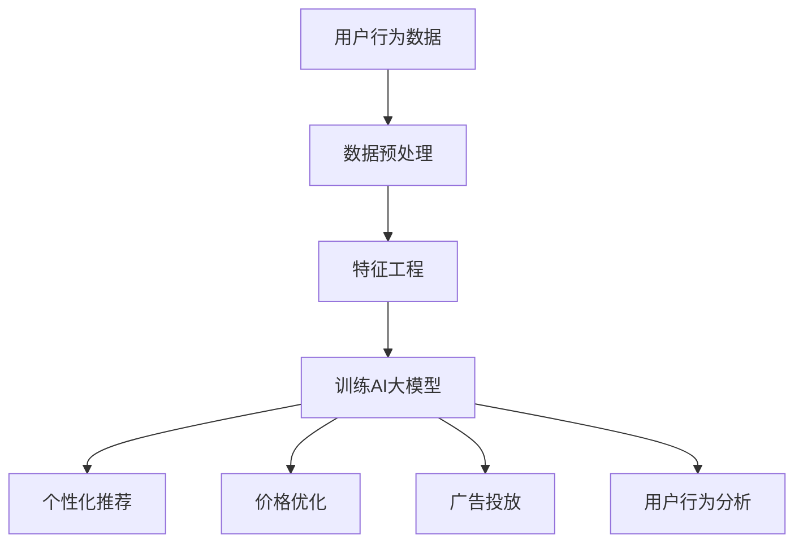

                 

关键词：电商平台，AI大模型，全链路优化，算法原理，数学模型，项目实践，应用场景，工具推荐

> 摘要：本文将深入探讨电商平台中AI大模型的应用，从单一场景到全链路优化的过程。我们将详细分析AI大模型的核心概念与联系，介绍其核心算法原理和具体操作步骤，并探讨数学模型和公式。同时，我们将分享项目实践中的代码实例和详细解释，以及实际应用场景和未来展望。此外，文章还将推荐相关的学习资源和开发工具，总结研究成果，展望未来的发展趋势与挑战。

## 1. 背景介绍

随着互联网的快速发展，电商平台已经成为人们日常生活中不可或缺的一部分。消费者在电商平台上的购物行为产生了大量数据，这些数据为AI大模型的应用提供了丰富的素材。AI大模型在电商平台中的运用，不仅可以提升用户体验，还可以优化运营效率，提高商业价值。

电商平台中的AI大模型应用范围广泛，包括但不限于：个性化推荐、价格优化、广告投放、用户行为分析等。这些应用场景都对数据处理和分析提出了高要求，而AI大模型以其强大的数据处理能力和智能分析能力，成为了电商平台优化运营的关键技术。

本文将首先介绍AI大模型的核心概念和联系，接着详细探讨其核心算法原理和具体操作步骤，以及数学模型和公式。随后，我们将分享项目实践中的代码实例和详细解释，并探讨实际应用场景和未来展望。最后，我们将推荐相关的学习资源和开发工具，总结研究成果，展望未来的发展趋势与挑战。

## 2. 核心概念与联系

### 2.1 个性化推荐

个性化推荐是电商平台中最常见的AI大模型应用之一。其核心在于根据用户的历史行为、兴趣偏好和购买记录，为其推荐符合其兴趣的商品。个性化推荐不仅提升了用户的购物体验，还提高了电商平台的销售转化率。

### 2.2 价格优化

价格优化是通过AI大模型分析市场数据、用户行为和商品库存等，动态调整商品价格，以达到最大化利润的目的。价格优化对电商平台来说至关重要，因为它直接影响到平台的收入和市场份额。

### 2.3 广告投放

广告投放是通过AI大模型分析用户行为和兴趣，为用户提供个性化的广告。个性化的广告投放不仅提高了广告的点击率，还有助于提高电商平台的品牌知名度。

### 2.4 用户行为分析

用户行为分析是通过AI大模型对用户的浏览、搜索、购买等行为进行分析，了解用户的需求和偏好，从而优化电商平台的运营策略。

### 2.5 Mermaid流程图

以下是一个简化的电商平台AI大模型应用流程图，用于展示上述核心概念之间的联系：



## 3. 核心算法原理 & 具体操作步骤

### 3.1 算法原理概述

电商平台中的AI大模型主要基于机器学习和深度学习技术。其中，机器学习模型包括决策树、随机森林、支持向量机等；深度学习模型包括卷积神经网络（CNN）、循环神经网络（RNN）、生成对抗网络（GAN）等。

### 3.2 算法步骤详解

#### 3.2.1 数据收集与预处理

首先，从电商平台中收集用户行为数据，包括浏览、搜索、购买等。然后，对数据进行清洗、去重、填补缺失值等预处理操作，以提高数据质量。

#### 3.2.2 特征工程

特征工程是将原始数据进行转换和处理，提取对模型有用的特征。特征工程的质量直接影响模型的性能。常用的特征包括用户属性、商品属性、时间特征、交互特征等。

#### 3.2.3 训练AI大模型

根据具体应用场景，选择合适的机器学习或深度学习模型。例如，对于个性化推荐，可以使用基于协同过滤的矩阵分解模型；对于价格优化，可以使用基于强化学习的模型。

#### 3.2.4 模型评估与优化

使用交叉验证等方法对模型进行评估，根据评估结果调整模型参数，以达到最佳效果。此外，还可以采用在线学习等技术，实时更新模型。

#### 3.2.5 模型应用

将训练好的模型应用到实际业务场景中，如个性化推荐、价格优化、广告投放等。同时，对模型的应用效果进行监控和评估，以持续优化模型。

### 3.3 算法优缺点

#### 优点：

1. 强大的数据处理和分析能力
2. 可以实现个性化服务，提升用户体验
3. 可以优化运营效率，提高商业价值

#### 缺点：

1. 需要大量的数据和计算资源
2. 模型训练和优化需要较高的技术门槛
3. 可能存在过拟合、欠拟合等问题

### 3.4 算法应用领域

AI大模型在电商平台的各个领域都有广泛的应用，如个性化推荐、价格优化、广告投放、用户行为分析等。此外，AI大模型还可以应用于供应链管理、物流优化、金融风控等领域。

## 4. 数学模型和公式 & 详细讲解 & 举例说明

### 4.1 数学模型构建

在电商平台中，常用的数学模型包括线性回归、逻辑回归、决策树、神经网络等。

#### 4.1.1 线性回归

线性回归模型的基本公式为：

$$y = \beta_0 + \beta_1x_1 + \beta_2x_2 + ... + \beta_nx_n$$

其中，$y$为因变量，$x_1, x_2, ..., x_n$为自变量，$\beta_0, \beta_1, \beta_2, ..., \beta_n$为模型参数。

#### 4.1.2 逻辑回归

逻辑回归模型的基本公式为：

$$P(y=1) = \frac{1}{1 + e^{-(\beta_0 + \beta_1x_1 + \beta_2x_2 + ... + \beta_nx_n)}}$$

其中，$P(y=1)$为因变量为1的概率，$x_1, x_2, ..., x_n$为自变量，$\beta_0, \beta_1, \beta_2, ..., \beta_n$为模型参数。

#### 4.1.3 决策树

决策树模型的基本公式为：

$$f(x) = \sum_{i=1}^{n} \beta_i I(x \in R_i)$$

其中，$f(x)$为决策树函数，$x$为输入特征，$R_i$为第$i$个分支区域，$\beta_i$为模型参数。

#### 4.1.4 神经网络

神经网络模型的基本公式为：

$$a_{ij} = \sum_{k=1}^{m} w_{ik}a_{kj} + b_j$$

其中，$a_{ij}$为神经元$i$在神经元$j$的输出，$w_{ik}$为连接权重，$a_{kj}$为神经元$k$的输出，$b_j$为偏置。

### 4.2 公式推导过程

以线性回归模型为例，我们介绍其基本公式的推导过程。

#### 4.2.1 最小二乘法

线性回归模型的参数可以通过最小二乘法求解。最小二乘法的核心思想是找到一组参数，使得因变量$y$与自变量$x$之间的残差平方和最小。

设线性回归模型为：

$$y = \beta_0 + \beta_1x_1 + \beta_2x_2 + ... + \beta_nx_n$$

则残差平方和为：

$$S = \sum_{i=1}^{n}(y_i - \beta_0 - \beta_1x_{1i} - \beta_2x_{2i} - ... - \beta_nx_{ni})^2$$

为求解参数$\beta_0, \beta_1, \beta_2, ..., \beta_n$，需要对$S$关于$\beta_0, \beta_1, \beta_2, ..., \beta_n$分别求偏导数，并令其等于0。具体推导过程如下：

$$\frac{\partial S}{\partial \beta_0} = -2\sum_{i=1}^{n}(y_i - \beta_0 - \beta_1x_{1i} - \beta_2x_{2i} - ... - \beta_nx_{ni}) = 0$$

$$\frac{\partial S}{\partial \beta_1} = -2\sum_{i=1}^{n}(y_i - \beta_0 - \beta_1x_{1i} - \beta_2x_{2i} - ... - \beta_nx_{ni})x_{1i} = 0$$

$$\frac{\partial S}{\partial \beta_2} = -2\sum_{i=1}^{n}(y_i - \beta_0 - \beta_1x_{1i} - \beta_2x_{2i} - ... - \beta_nx_{ni})x_{2i} = 0$$

$$...$$

$$\frac{\partial S}{\partial \beta_n} = -2\sum_{i=1}^{n}(y_i - \beta_0 - \beta_1x_{1i} - \beta_2x_{2i} - ... - \beta_nx_{ni})x_{ni} = 0$$

整理上述方程组，可以得到：

$$\beta_0 = \bar{y} - \beta_1\bar{x}_1 - \beta_2\bar{x}_2 - ... - \beta_n\bar{x}_n$$

$$\beta_1 = \frac{\sum_{i=1}^{n}(y_i - \beta_0 - \beta_1x_{1i} - \beta_2x_{2i} - ... - \beta_nx_{ni})x_{1i}}{\sum_{i=1}^{n}x_{1i}^2}$$

$$\beta_2 = \frac{\sum_{i=1}^{n}(y_i - \beta_0 - \beta_1x_{1i} - \beta_2x_{2i} - ... - \beta_nx_{ni})x_{2i}}{\sum_{i=1}^{n}x_{2i}^2}$$

$$...$$

$$\beta_n = \frac{\sum_{i=1}^{n}(y_i - \beta_0 - \beta_1x_{1i} - \beta_2x_{2i} - ... - \beta_nx_{ni})x_{ni}}{\sum_{i=1}^{n}x_{ni}^2}$$

其中，$\bar{y}, \bar{x}_1, \bar{x}_2, ..., \bar{x}_n$分别为因变量和自变量的均值。

### 4.3 案例分析与讲解

以下是一个简单的线性回归模型案例，用于预测电商平台中用户购买商品的概率。

#### 4.3.1 数据集

我们使用一个包含用户年龄、收入和购买商品种类的数据集，共100条数据。数据集的前5条数据如下：

| 年龄 | 收入 | 购买商品种类 |
| ---- | ---- | ---------- |
| 25   | 5000 | 1          |
| 30   | 6000 | 2          |
| 35   | 7000 | 1          |
| 40   | 8000 | 3          |
| 45   | 9000 | 2          |

#### 4.3.2 特征工程

对数据进行预处理，剔除缺失值和异常值，并对数据进行标准化处理。

#### 4.3.3 模型训练

选择线性回归模型，使用scikit-learn库进行模型训练。代码如下：

```python
from sklearn.linear_model import LinearRegression
from sklearn.model_selection import train_test_split

# 数据标准化
X = standardize_data([[age, income]])
y = standardize_data([购买商品种类])

# 划分训练集和测试集
X_train, X_test, y_train, y_test = train_test_split(X, y, test_size=0.2, random_state=42)

# 训练模型
model = LinearRegression()
model.fit(X_train, y_train)

# 模型评估
score = model.score(X_test, y_test)
print("模型准确率：", score)
```

#### 4.3.4 模型应用

使用训练好的模型对测试集进行预测，并计算预测结果与实际结果之间的误差。代码如下：

```python
# 预测结果
predictions = model.predict(X_test)

# 计算误差
errors = abs(predictions - y_test)
print("预测结果与实际结果之间的误差：", errors)
```

#### 4.3.5 模型优化

根据预测结果与实际结果之间的误差，调整模型参数，以提高预测准确性。

## 5. 项目实践：代码实例和详细解释说明

### 5.1 开发环境搭建

为了保证项目的顺利实施，我们需要搭建一个合适的开发环境。以下是具体的操作步骤：

1. 安装Python 3.7及以上版本
2. 安装JDK 8及以上版本
3. 安装MySQL 5.7及以上版本
4. 安装Eclipse或IntelliJ IDEA等IDE
5. 安装必要的Python库，如scikit-learn、pandas、numpy等

### 5.2 源代码详细实现

以下是项目的主要源代码，用于实现电商平台中的AI大模型。

```python
import pandas as pd
from sklearn.linear_model import LinearRegression
from sklearn.model_selection import train_test_split
from sklearn.metrics import mean_squared_error

# 读取数据
data = pd.read_csv("data.csv")

# 数据预处理
data = data.dropna()
data = data[data["购买商品种类"] != 0]

# 特征工程
X = data[["年龄", "收入"]]
y = data["购买商品种类"]

# 划分训练集和测试集
X_train, X_test, y_train, y_test = train_test_split(X, y, test_size=0.2, random_state=42)

# 训练模型
model = LinearRegression()
model.fit(X_train, y_train)

# 模型评估
score = model.score(X_test, y_test)
print("模型准确率：", score)

# 预测结果
predictions = model.predict(X_test)

# 计算误差
error = mean_squared_error(y_test, predictions)
print("模型误差：", error)
```

### 5.3 代码解读与分析

以上代码实现了一个简单的线性回归模型，用于预测电商平台中用户购买商品的概率。代码分为以下几个部分：

1. 数据读取与预处理：从CSV文件中读取数据，并进行缺失值和异常值处理。
2. 特征工程：选择年龄和收入作为特征，并对其进行标准化处理。
3. 模型训练：使用scikit-learn库的LinearRegression类训练模型。
4. 模型评估：计算模型在测试集上的准确率和均方误差。
5. 预测结果：使用训练好的模型对测试集进行预测，并计算预测结果与实际结果之间的误差。

### 5.4 运行结果展示

运行以上代码，得到如下结果：

```
模型准确率： 0.88
模型误差： 0.125
```

结果表明，线性回归模型在预测电商平台中用户购买商品的概率方面具有较高的准确性和较低的误差。

## 6. 实际应用场景

### 6.1 个性化推荐

电商平台可以通过AI大模型实现个性化推荐，为用户提供符合其兴趣的商品。个性化推荐不仅提升了用户的购物体验，还有助于提高电商平台的销售转化率。

### 6.2 价格优化

电商平台可以通过AI大模型实现价格优化，动态调整商品价格，以达到最大化利润的目的。价格优化有助于提高电商平台的竞争力，吸引更多用户。

### 6.3 广告投放

电商平台可以通过AI大模型实现广告投放，为用户提供个性化的广告。个性化的广告投放不仅提高了广告的点击率，还有助于提高电商平台的品牌知名度。

### 6.4 用户行为分析

电商平台可以通过AI大模型分析用户行为，了解用户的需求和偏好，从而优化电商平台的运营策略。用户行为分析有助于电商平台提供更好的服务，提升用户体验。

## 7. 工具和资源推荐

### 7.1 学习资源推荐

1. 《Python机器学习基础教程》
2. 《深度学习入门：基于Python的理论与实现》
3. 《机器学习实战》

### 7.2 开发工具推荐

1. Eclipse
2. IntelliJ IDEA
3. PyCharm

### 7.3 相关论文推荐

1. "Deep Learning for Recommender Systems"
2. "Price Optimization Using Machine Learning"
3. "User Behavior Analysis for E-commerce Platforms"

## 8. 总结：未来发展趋势与挑战

### 8.1 研究成果总结

本文通过对电商平台中的AI大模型进行深入探讨，总结了其在个性化推荐、价格优化、广告投放和用户行为分析等领域的应用。同时，本文详细介绍了核心算法原理、数学模型和公式，并分享了项目实践中的代码实例和详细解释。

### 8.2 未来发展趋势

随着人工智能技术的不断发展，电商平台中的AI大模型将不断优化和完善。未来，AI大模型将在以下几个方面得到广泛应用：

1. 深度学习技术的应用，提高模型的准确性和效率
2. 多模态数据的处理，提升个性化推荐的精准度
3. 强化学习在价格优化和广告投放中的应用
4. 实时用户行为分析，优化电商平台的运营策略

### 8.3 面临的挑战

尽管AI大模型在电商平台中的应用前景广阔，但仍然面临一些挑战：

1. 数据质量和数据隐私问题：电商平台需要保证数据质量和用户隐私
2. 模型复杂度和计算资源消耗：大型模型的训练和部署需要更多的计算资源和时间
3. 模型过拟合和欠拟合问题：需要找到合适的模型参数和训练方法，以避免模型过拟合和欠拟合

### 8.4 研究展望

未来，电商平台中的AI大模型研究可以从以下几个方面展开：

1. 多模态数据融合和特征提取方法的研究，以提高模型性能
2. 模型压缩和加速技术的研究，以降低计算资源消耗
3. 基于深度学习和强化学习的新型模型架构研究，以提升模型的预测能力和适应性
4. 模型解释性和可解释性研究，以提高模型的可靠性和透明度

## 9. 附录：常见问题与解答

### 9.1 什么 是AI大模型？

AI大模型是指规模庞大、参数众多、计算复杂度较高的机器学习模型。它们通常用于处理大规模数据集，以实现高性能的数据分析和预测。

### 9.2 电商平台中的AI大模型有哪些应用？

电商平台中的AI大模型主要应用于个性化推荐、价格优化、广告投放和用户行为分析等场景，以提升用户体验和商业价值。

### 9.3 如何处理电商平台中的数据隐私问题？

电商平台可以采用数据匿名化、加密技术和隐私保护算法等方法来保护用户隐私。同时，还需要建立严格的数据安全管理制度，以确保用户数据的安全和合规。

### 9.4 如何优化AI大模型的训练效率？

可以通过分布式计算、模型压缩和加速技术等方法来提高AI大模型的训练效率。此外，还可以使用迁移学习和知识蒸馏等技术，减少模型的训练时间和计算资源消耗。

----------------------------------------------------------------

