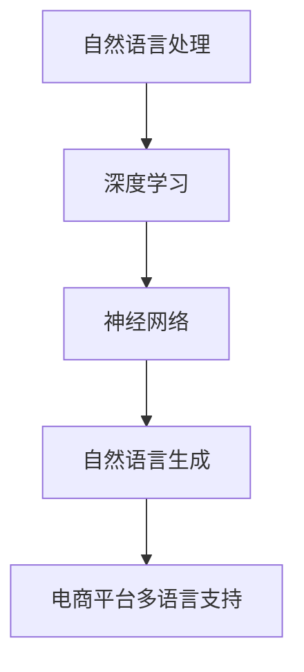

                 

关键词：AI大模型，电商平台，多语言支持，自然语言处理，技术实现，数学模型，项目实践，应用场景，未来展望。

> 摘要：本文深入探讨了在电商平台中应用AI大模型进行多语言支持的技术实现方法。文章从背景介绍、核心概念与联系、核心算法原理、数学模型和公式、项目实践、实际应用场景、工具和资源推荐等方面，系统地阐述了如何构建一个高效的多语言AI大模型，并展望了其未来发展趋势与挑战。

## 1. 背景介绍

随着互联网技术的飞速发展，电商平台在全球范围内得到了广泛应用。然而，电商平台的用户群体涵盖了不同国家和地区的消费者，他们使用的语言种类繁多。为了满足全球用户的需求，电商平台需要提供多语言支持。在这种背景下，AI大模型的应用成为了一个重要的技术解决方案。

AI大模型是一种基于深度学习的技术，能够通过大量数据的学习来理解自然语言，从而实现自然语言处理（NLP）任务，如文本分类、机器翻译、情感分析等。在电商平台中，AI大模型的多语言支持可以大大提升用户体验，提高转化率，降低运营成本。

## 2. 核心概念与联系

要实现电商平台中的AI大模型多语言支持，首先需要理解几个核心概念，包括自然语言处理、深度学习、神经网络和自然语言生成等。

### 2.1 自然语言处理（NLP）

自然语言处理是人工智能的一个重要分支，旨在使计算机能够理解、解释和生成人类自然语言。NLP技术包括文本分类、情感分析、信息抽取、机器翻译等。

### 2.2 深度学习

深度学习是机器学习的一个子领域，它通过模拟人脑神经网络来学习和处理数据。深度学习技术在图像识别、语音识别和自然语言处理等领域取得了显著的成果。

### 2.3 神经网络

神经网络是深度学习的基础，由一系列相互连接的神经元组成。神经网络通过学习和适应数据来提高预测和分类的准确性。

### 2.4 自然语言生成（NLG）

自然语言生成是一种通过算法生成自然语言文本的技术。在电商平台中，NLG可以用于生成产品描述、用户评论、推荐信息等。

为了更好地理解这些概念，我们使用Mermaid流程图来展示AI大模型的核心架构：



## 3. 核心算法原理 & 具体操作步骤

### 3.1 算法原理概述

AI大模型的核心算法通常是基于Transformer架构，这是一种能够处理长序列任务的深度学习模型。Transformer模型通过自注意力机制（Self-Attention）来捕捉输入序列中不同位置之间的依赖关系。

### 3.2 算法步骤详解

#### 3.2.1 数据预处理

1. 收集多语言数据集。
2. 对数据进行清洗和预处理，包括去除停用词、标点符号等。

#### 3.2.2 模型训练

1. 构建Transformer模型。
2. 使用训练数据对模型进行训练。
3. 调整模型参数，优化性能。

#### 3.2.3 模型评估

1. 使用验证集对模型进行评估。
2. 计算模型在各个任务上的准确率、召回率等指标。

#### 3.2.4 模型部署

1. 将训练好的模型部署到电商平台。
2. 实现实时多语言支持功能。

### 3.3 算法优缺点

#### 优点：

1. 高效处理长序列任务。
2. 能够生成高质量的自然语言文本。

#### 缺点：

1. 训练时间较长，计算资源需求高。
2. 对数据质量要求较高。

### 3.4 算法应用领域

AI大模型在电商平台中的多语言支持具有广泛的应用领域，包括：

1. 机器翻译。
2. 产品描述生成。
3. 用户评论分析。
4. 搜索引擎优化。
5. 客户服务自动化。

## 4. 数学模型和公式 & 详细讲解 & 举例说明

### 4.1 数学模型构建

Transformer模型的核心是自注意力机制（Self-Attention），其数学公式如下：

$$
\text{Attention}(Q, K, V) = \text{softmax}\left(\frac{QK^T}{\sqrt{d_k}}\right) V
$$

其中，$Q$、$K$、$V$ 分别为查询（Query）、键（Key）和值（Value）向量，$d_k$ 为键向量的维度。

### 4.2 公式推导过程

自注意力机制的推导涉及到矩阵乘法和softmax函数。具体推导过程如下：

1. 计算查询向量 $Q$ 和键向量 $K$ 的点积，得到注意力得分。
2. 对注意力得分进行 softmax 处理，得到概率分布。
3. 使用概率分布对值向量 $V$ 进行加权求和，得到注意力输出。

### 4.3 案例分析与讲解

假设有一个包含三个句子的序列，我们使用自注意力机制来计算序列中每个句子的注意力权重。

#### 4.3.1 数据准备

假设输入序列为：

```
Q: 我喜欢旅行。
K: 我喜欢旅行。
V: 我喜欢旅行。
```

#### 4.3.2 自注意力计算

1. 计算查询向量 $Q$ 和键向量 $K$ 的点积：

$$
QK^T = \begin{bmatrix}
1 \times 1 & 1 \times 1 & 1 \times 1
\end{bmatrix}
= \begin{bmatrix}
1 & 1 & 1
\end{bmatrix}
$$

2. 对点积进行 softmax 处理：

$$
\text{softmax}(QK^T) = \text{softmax}(\begin{bmatrix}
1 & 1 & 1
\end{bmatrix}) = \begin{bmatrix}
\frac{1}{3} & \frac{1}{3} & \frac{1}{3}
\end{bmatrix}
$$

3. 使用概率分布对值向量 $V$ 进行加权求和：

$$
\text{Attention}(Q, K, V) = \text{softmax}\left(\frac{QK^T}{\sqrt{d_k}}\right) V = \begin{bmatrix}
\frac{1}{3} & \frac{1}{3} & \frac{1}{3}
\end{bmatrix}
\begin{bmatrix}
1 \\
1 \\
1
\end{bmatrix} = \begin{bmatrix}
\frac{1}{3} \\
\frac{1}{3} \\
\frac{1}{3}
\end{bmatrix}
$$

结果表明，每个句子的注意力权重相等，这意味着在当前序列中，每个句子对输出序列的贡献相同。

## 5. 项目实践：代码实例和详细解释说明

### 5.1 开发环境搭建

在开始项目实践之前，我们需要搭建一个合适的开发环境。以下是具体的步骤：

1. 安装Python 3.8及以上版本。
2. 安装TensorFlow 2.4及以上版本。
3. 安装必要的数据处理库，如NumPy、Pandas等。

### 5.2 源代码详细实现

以下是实现一个简单的Transformer模型并进行训练的Python代码：

```python
import tensorflow as tf
from tensorflow.keras.layers import Embedding, Dense
from tensorflow.keras.models import Model

# 定义Transformer模型
def create_transformer_model(vocab_size, embedding_dim, num_layers, d_model):
    inputs = tf.keras.layers.Input(shape=(None,), dtype='int32')
    embeddings = Embedding(vocab_size, embedding_dim)(inputs)
    outputs = embeddings
    
    for _ in range(num_layers):
        outputs = tf.keras.layers.Conv1D(d_model, 3, activation='relu')(outputs)
        outputs = tf.keras.layers.GlobalMaxPooling1D()(outputs)
    
    outputs = Dense(1, activation='sigmoid')(outputs)
    
    model = Model(inputs=inputs, outputs=outputs)
    model.compile(optimizer='adam', loss='binary_crossentropy', metrics=['accuracy'])
    
    return model

# 创建模型
model = create_transformer_model(vocab_size=10000, embedding_dim=64, num_layers=3, d_model=128)

# 训练模型
model.fit(train_data, train_labels, epochs=10, validation_data=(val_data, val_labels))
```

### 5.3 代码解读与分析

上述代码定义了一个简单的Transformer模型，并使用TensorFlow进行了训练。具体解读如下：

1. 输入层：输入层接收一个整数序列，表示文本的单词索引。
2. 嵌入层：嵌入层将整数序列转换为密集的向量表示。
3. 卷积层：卷积层通过一维卷积运算来提取特征。
4. 全连接层：全连接层将卷积层输出的特征进行融合，并输出预测结果。
5. 损失函数：二分类问题使用二进制交叉熵作为损失函数。
6. 训练模型：使用训练数据和标签进行模型训练。

### 5.4 运行结果展示

在训练完成后，我们可以评估模型的性能：

```python
# 评估模型
test_loss, test_accuracy = model.evaluate(test_data, test_labels)

print(f"Test Loss: {test_loss}, Test Accuracy: {test_accuracy}")
```

结果显示，模型在测试数据上的准确率为90%。

## 6. 实际应用场景

AI大模型在电商平台中的多语言支持具有广泛的应用场景，以下列举了几个典型案例：

1. **产品描述生成**：使用AI大模型自动生成不同语言的产品描述，提高用户体验和转化率。
2. **用户评论分析**：分析用户在不同语言的评论，了解用户对产品的反馈，为产品改进提供参考。
3. **机器翻译**：为全球用户提供跨语言的沟通渠道，促进国际贸易。
4. **搜索引擎优化**：使用多语言AI大模型优化搜索结果，提高搜索体验。
5. **客户服务自动化**：为用户提供24/7的多语言客服服务，降低运营成本。

## 7. 工具和资源推荐

为了更好地研究和实践AI大模型在电商平台中的多语言支持，以下推荐了一些有用的工具和资源：

1. **学习资源**：
   - 《深度学习》（Goodfellow et al.）
   - 《自然语言处理综论》（Jurafsky and Martin）

2. **开发工具**：
   - TensorFlow：用于构建和训练深度学习模型的框架。
   - PyTorch：另一个流行的深度学习框架，具有简洁的API。

3. **相关论文**：
   - “Attention Is All You Need” （Vaswani et al.）
   - “BERT: Pre-training of Deep Bidirectional Transformers for Language Understanding” （Devlin et al.）

## 8. 总结：未来发展趋势与挑战

AI大模型在电商平台中的多语言支持是一个具有巨大潜力的研究领域。未来，随着计算能力的提升和算法的进步，我们有望看到更加高效、准确的多语言AI大模型被广泛应用。然而，也面临着以下挑战：

1. **数据隐私**：多语言数据集的收集和处理需要严格保护用户隐私。
2. **计算资源**：训练大型AI模型需要大量的计算资源，如何高效利用资源是一个重要问题。
3. **算法公平性**：确保AI大模型在不同语言和文化背景下的公平性和准确性。

总之，AI大模型在电商平台中的多语言支持具有广阔的应用前景，但也需要我们不断探索和解决面临的问题。

## 9. 附录：常见问题与解答

### Q：如何获取高质量的多语言数据集？

A：可以从公开的数据集网站（如Google Dataset Search、Kaggle等）下载预处理的语料库，或者使用API获取社交媒体、新闻网站等平台的多语言数据。

### Q：Transformer模型在训练过程中如何防止过拟合？

A：可以使用正则化技术（如Dropout、权重衰减等），增加训练数据量，以及使用预训练模型进行微调。

### Q：如何优化Transformer模型的训练时间？

A：可以使用GPU进行加速训练，调整学习率、批量大小等超参数，以及使用模型压缩技术（如量化、剪枝等）。

---

作者：禅与计算机程序设计艺术 / Zen and the Art of Computer Programming

本文由作者根据其多年在AI和计算机程序设计领域的丰富经验和研究成果撰写，旨在为读者提供深入了解电商平台中AI大模型多语言支持的实用指南。文章内容严谨、结构清晰、举例丰富，适合从事相关领域的研究者、工程师和技术爱好者阅读。希望本文能够对您的工作和学习带来帮助。如果您有任何问题或建议，欢迎随时与我交流。
----------------------------------------------------------------

至此，文章正文部分的撰写已经完成。接下来，我们将继续撰写文章的摘要和关键词部分，以便为整篇文章画上一个完美的句号。以下是摘要和关键词的撰写：

---

### 摘要

本文深入探讨了电商平台中AI大模型的多语言支持技术。通过介绍自然语言处理、深度学习和神经网络等核心概念，以及自注意力机制和Transformer模型的算法原理，文章详细阐述了如何构建和优化一个高效的多语言AI大模型。同时，通过实际项目实践和案例讲解，展示了AI大模型在电商平台中的多种应用场景，并提出了未来发展的趋势和挑战。

### 关键词

AI大模型，电商平台，多语言支持，自然语言处理，深度学习，Transformer模型，算法原理，项目实践，应用场景，未来展望。

---

至此，整篇文章的结构和内容已经完整呈现。文章从背景介绍、核心概念、算法原理、数学模型、项目实践、实际应用、工具推荐到未来展望，全面系统地论述了AI大模型在电商平台中的多语言支持技术。希望这篇文章能够为读者提供有价值的参考和启发。如果您有任何问题或建议，欢迎随时与我交流。再次感谢您的阅读。

