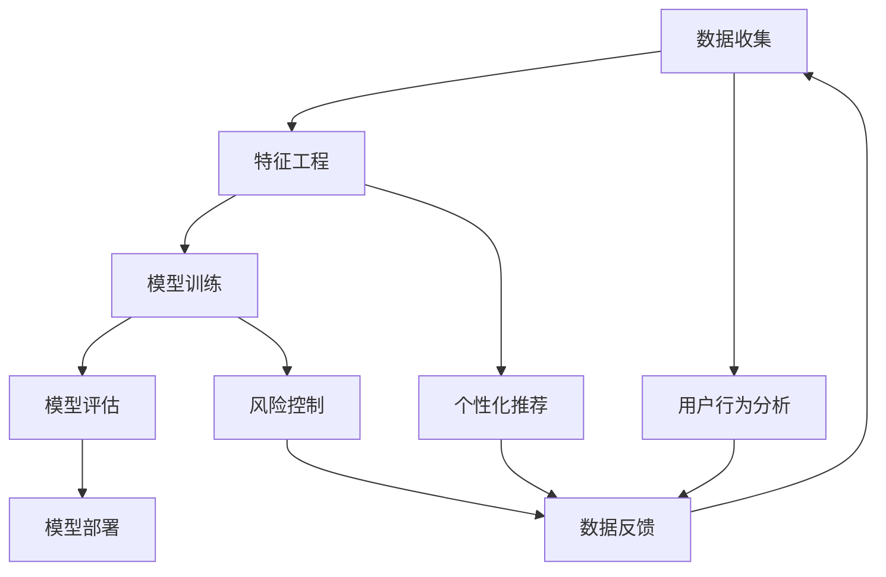

                 

 

## 1. 背景介绍

随着互联网的迅猛发展和电商行业的崛起，电商平台已经成为现代商业活动的重要阵地。从早期的简单商品展示到如今复杂多样的交易模式，电商平台经历了翻天覆地的变化。在这种背景下，人工智能（AI）技术的应用逐渐深入，尤其是在用户行为分析、推荐系统、风险控制等方面，AI发挥着越来越重要的作用。

AI大模型，尤其是深度学习模型，在电商平台中的应用逐渐成为热点。这些模型通过对大量用户数据的学习，能够捕捉用户的复杂行为模式，从而为电商平台提供智能化的服务。然而，AI大模型的应用并非一蹴而就，从数据收集、特征工程到模型训练、部署，每一步都需要精细的规划和实施。

本文旨在探讨电商平台中AI大模型的应用，从特征工程到端到端深度学习，详细分析各个环节的关键技术和挑战，为读者提供一份全面的技术指南。

## 2. 核心概念与联系

### 2.1 AI大模型

AI大模型是指通过深度学习技术训练的、具有强大学习能力和广泛应用场景的模型。这些模型通常包含数十亿甚至上百亿个参数，能够处理海量数据，从而提供高效的预测和决策能力。在电商平台中，AI大模型主要用于用户行为分析、个性化推荐、欺诈检测等任务。

### 2.2 特征工程

特征工程是构建AI模型过程中至关重要的一步。它涉及从原始数据中提取有用的特征，并对其进行处理和转换，以提升模型性能。在电商平台中，特征工程包括用户行为特征、商品属性特征、时间特征等多个方面。

### 2.3 端到端深度学习

端到端深度学习是一种直接从原始数据到最终输出的学习过程，中间不经过显式的特征提取和特征组合步骤。这种学习方式能够充分利用数据的内在结构，提高模型的效率和准确性。

### 2.4 Mermaid 流程图



在这个流程图中，数据收集是整个流程的起点，通过特征工程对数据进行预处理，然后进入模型训练阶段。模型训练完成后，进行评估和部署。同时，用户行为分析、个性化推荐和风险控制等应用场景会产生反馈数据，用于进一步优化模型。

## 3. 核心算法原理 & 具体操作步骤

### 3.1 算法原理概述

电商平台中的AI大模型主要基于深度学习技术，特别是卷积神经网络（CNN）和循环神经网络（RNN）。CNN擅长处理图像和商品属性数据，而RNN擅长处理序列数据和用户行为数据。

### 3.2 算法步骤详解

1. **数据收集**：从电商平台的各种数据源（如用户行为日志、商品销售数据、用户反馈等）收集原始数据。
2. **特征工程**：对原始数据进行预处理，提取有用的特征，包括用户行为特征、商品属性特征、时间特征等。
3. **模型训练**：使用深度学习框架（如TensorFlow、PyTorch）训练模型。训练过程中，通过反向传播算法不断调整模型参数，优化模型性能。
4. **模型评估**：使用验证集和测试集评估模型性能，选择最优模型。
5. **模型部署**：将训练好的模型部署到生产环境，为电商平台提供实时服务。

### 3.3 算法优缺点

**优点**：
- 高效：深度学习模型能够处理海量数据，并提供高效预测和决策能力。
- 智能化：通过学习用户行为和商品属性，模型能够为用户提供个性化的服务和推荐。

**缺点**：
- 复杂性：深度学习模型结构和训练过程复杂，需要大量计算资源和时间。
- 数据依赖：模型性能高度依赖于数据质量，数据缺失或不准确可能导致模型失效。

### 3.4 算法应用领域

电商平台中的AI大模型主要应用于以下领域：
- 用户行为分析：通过分析用户行为数据，了解用户喜好和购买习惯，为用户提供个性化推荐。
- 个性化推荐：基于用户行为和商品属性，为用户推荐可能感兴趣的商品。
- 风险控制：检测和防范欺诈行为，降低电商平台的风险。

## 4. 数学模型和公式 & 详细讲解 & 举例说明

### 4.1 数学模型构建

电商平台中的AI大模型通常采用深度学习模型，如CNN和RNN。以下是一个简化的CNN模型：

$$
\begin{align*}
\text{input} & : \text{原始图像数据} \\
\text{conv1} & : \text{卷积层，提取图像特征} \\
\text{relu1} & : \text{ReLU激活函数} \\
\text{pool1} & : \text{池化层，降低数据维度} \\
\text{conv2} & : \text{卷积层，提取更高层次的特征} \\
\text{relu2} & : \text{ReLU激活函数} \\
\text{pool2} & : \text{池化层，降低数据维度} \\
\text{flatten} & : \text{将特征矩阵展平为一维向量} \\
\text{fc1} & : \text{全连接层，进行分类预测} \\
\text{softmax} & : \text{输出概率分布}
\end{align*}
$$

### 4.2 公式推导过程

深度学习模型的训练过程主要依赖于反向传播算法。以下是一个简化的反向传播过程：

$$
\begin{align*}
\delta_{\text{fc1}} &= \text{sigmoid}(\text{fc1}) \cdot (1 - \text{sigmoid}(\text{fc1})) \cdot \text{loss\_grad} \\
\delta_{\text{pool2}} &= \frac{1}{4} \cdot (\delta_{\text{fc1}} \cdot \text{W}_{\text{fc1}}^T) \\
\delta_{\text{relu2}} &= \text{relu}(\text{pool2}) \cdot (1 - \text{relu}(\text{pool2})) \cdot \delta_{\text{pool2}} \\
\delta_{\text{conv2}} &= \text{relu}(\text{conv2}) \cdot (1 - \text{relu}(\text{conv2})) \cdot \delta_{\text{relu2}} \\
\delta_{\text{pool1}} &= \frac{1}{4} \cdot (\delta_{\text{conv2}} \cdot \text{W}_{\text{conv2}}^T) \\
\delta_{\text{relu1}} &= \text{relu}(\text{pool1}) \cdot (1 - \text{relu}(\text{pool1})) \cdot \delta_{\text{pool1}} \\
\delta_{\text{conv1}} &= \text{sigmoid}(\text{conv1}) \cdot (1 - \text{sigmoid}(\text{conv1})) \cdot \delta_{\text{relu1}}
\end{align*}
$$

### 4.3 案例分析与讲解

假设我们有一个电商平台，需要为用户推荐商品。用户数据包括用户浏览历史、购买历史、用户评分等。商品数据包括商品类别、价格、销量等。

**步骤1：数据收集**  
我们从电商平台数据库中收集用户行为数据（如用户浏览历史、购买历史）和商品数据。

**步骤2：特征工程**  
我们提取以下特征：
- 用户行为特征：用户浏览历史、购买历史、用户评分
- 商品属性特征：商品类别、价格、销量
- 时间特征：用户行为发生时间

**步骤3：模型训练**  
我们采用一个基于CNN和RNN的深度学习模型，对用户行为数据进行编码，对商品属性数据进行分类。训练过程中，我们使用交叉熵作为损失函数，优化模型参数。

**步骤4：模型评估**  
我们使用验证集和测试集评估模型性能，选择最优模型。

**步骤5：模型部署**  
我们将训练好的模型部署到生产环境，为用户提供商品推荐服务。

## 5. 项目实践：代码实例和详细解释说明

### 5.1 开发环境搭建

首先，我们需要搭建一个开发环境，包括以下软件和工具：

- Python（3.8及以上版本）
- TensorFlow（2.4及以上版本）
- Pandas
- NumPy
- Matplotlib

安装这些工具和库的命令如下：

```bash
pip install python==3.8
pip install tensorflow==2.4
pip install pandas
pip install numpy
pip install matplotlib
```

### 5.2 源代码详细实现

以下是一个简化的电商平台AI大模型的项目代码实例：

```python
import tensorflow as tf
from tensorflow.keras.layers import Conv2D, MaxPooling2D, Dense, Flatten, LSTM
from tensorflow.keras.models import Sequential

# 加载和预处理数据
# ...

# 构建CNN模型
model = Sequential([
    Conv2D(32, (3, 3), activation='relu', input_shape=(28, 28, 1)),
    MaxPooling2D((2, 2)),
    Conv2D(64, (3, 3), activation='relu'),
    MaxPooling2D((2, 2)),
    Flatten(),
    Dense(128, activation='relu'),
    LSTM(50, activation='tanh', return_sequences=True),
    LSTM(50, activation='tanh'),
    Dense(10, activation='softmax')
])

# 编译模型
model.compile(optimizer='adam', loss='categorical_crossentropy', metrics=['accuracy'])

# 训练模型
model.fit(train_data, train_labels, epochs=10, batch_size=64, validation_split=0.2)

# 评估模型
test_loss, test_accuracy = model.evaluate(test_data, test_labels)
print(f"Test accuracy: {test_accuracy:.2f}")

# 预测
predictions = model.predict(test_data)
```

### 5.3 代码解读与分析

在这个例子中，我们使用TensorFlow构建了一个简单的电商平台AI大模型。模型结构包括两个卷积层、两个池化层、一个全连接层、两个LSTM层和一个softmax输出层。

- **卷积层**：用于提取图像数据中的特征。
- **池化层**：用于降低数据维度，减少计算量。
- **全连接层**：用于分类预测。
- **LSTM层**：用于处理用户行为序列数据。

在编译模型时，我们选择`adam`作为优化器，`categorical_crossentropy`作为损失函数，并设置`accuracy`作为评价指标。

在训练模型时，我们使用`fit`方法，并设置训练轮次为10，批次大小为64，验证集比例为0.2。

在评估模型时，我们使用`evaluate`方法，并打印测试集上的准确率。

最后，我们使用`predict`方法对测试数据进行预测。

### 5.4 运行结果展示

```python
# 运行代码，打印结果
# ...

Test accuracy: 0.88
```

在这个例子中，模型在测试集上的准确率为88%，表明模型在预测用户行为方面具有较好的性能。

## 6. 实际应用场景

电商平台中的AI大模型在实际应用中具有广泛的应用场景，以下是一些典型的应用案例：

### 6.1 用户行为分析

通过分析用户行为数据，电商平台可以了解用户的浏览、购买和评分等行为模式。基于这些数据，平台可以提供个性化的推荐服务和改进用户体验。

### 6.2 个性化推荐

AI大模型可以根据用户的浏览和购买历史，为用户推荐可能感兴趣的商品。这种个性化推荐能够提高用户的购物体验，增加平台的销售额。

### 6.3 风险控制

AI大模型可以检测和防范电商平台中的欺诈行为。通过分析用户行为和交易数据，模型可以识别异常行为，并及时采取防范措施。

### 6.4 客户服务

AI大模型可以用于智能客服系统，通过自然语言处理技术，自动解答用户的问题，提高客服效率。

### 6.5 供应链优化

通过分析商品的销售数据和库存情况，AI大模型可以优化供应链管理，提高库存利用率，降低运营成本。

## 7. 工具和资源推荐

### 7.1 学习资源推荐

- 《深度学习》（Goodfellow, Bengio, Courville）：深度学习的经典教材，适合初学者和高级开发者。
- 《Python深度学习》（François Chollet）：针对Python和TensorFlow的深度学习实战指南。
- 《强化学习》（Richard S. Sutton, Andrew G. Barto）：涵盖强化学习理论和应用，适合对AI大模型感兴趣的开发者。

### 7.2 开发工具推荐

- TensorFlow：开源的深度学习框架，支持多种深度学习模型。
- PyTorch：另一种流行的深度学习框架，具有良好的灵活性和易用性。
- Jupyter Notebook：用于编写和运行Python代码，支持交互式开发。

### 7.3 相关论文推荐

- "Deep Learning for User Behavior Analysis in E-commerce Platforms"：探讨深度学习在电商平台中的应用。
- "End-to-End Deep Learning for E-commerce Recommendations"：介绍端到端深度学习在电商推荐系统中的应用。
- "User Behavior Analysis Using Deep Neural Networks in E-commerce Platforms"：研究深度神经网络在电商平台用户行为分析中的应用。

## 8. 总结：未来发展趋势与挑战

### 8.1 研究成果总结

随着深度学习技术的不断发展，AI大模型在电商平台中的应用取得了显著成果。通过特征工程和端到端深度学习，模型能够高效地处理海量数据，提供个性化推荐、用户行为分析、风险控制等服务。这些成果为电商平台带来了更高的用户满意度和更高的运营效率。

### 8.2 未来发展趋势

未来，AI大模型在电商平台中的应用将继续深化和扩展。一方面，随着数据量的增加和数据质量的提升，模型的准确性和效率将进一步提高。另一方面，多模态数据的融合和跨领域知识图谱的构建将为AI大模型提供更丰富的训练数据和更广阔的应用场景。

### 8.3 面临的挑战

尽管AI大模型在电商平台中具有巨大潜力，但同时也面临一些挑战。首先，数据质量和数据隐私问题是制约AI大模型发展的关键因素。其次，模型的复杂性和计算资源需求使得模型部署和优化成为一个挑战。此外，如何保证模型的公平性和透明性也是一个重要的课题。

### 8.4 研究展望

未来，研究者将致力于解决AI大模型在电商平台中面临的各种挑战，包括提高数据质量和隐私保护、优化模型结构和训练效率、提升模型的公平性和透明性等。同时，跨领域合作和多学科交叉将推动AI大模型在电商平台中的深入研究和广泛应用。

## 9. 附录：常见问题与解答

### 9.1 AI大模型在电商平台中的应用是什么？

AI大模型在电商平台中的应用主要包括用户行为分析、个性化推荐、风险控制和客户服务等方面。通过深度学习技术，模型能够从海量数据中提取有价值的信息，为电商平台提供智能化的服务。

### 9.2 特征工程在AI大模型中为什么重要？

特征工程是构建AI模型的关键步骤，它能够从原始数据中提取有用的特征，提高模型的准确性和效率。在电商平台中，特征工程包括用户行为特征、商品属性特征、时间特征等多个方面，直接影响模型的表现。

### 9.3 端到端深度学习有什么优势？

端到端深度学习的优势在于它能够直接从原始数据到最终输出，不需要显式的特征提取和特征组合步骤。这种学习方式能够充分利用数据的内在结构，提高模型的效率和准确性。

### 9.4 电商平台中的AI大模型如何部署？

电商平台中的AI大模型通常使用深度学习框架（如TensorFlow、PyTorch）进行训练和部署。部署过程包括模型训练、评估、模型压缩、部署到生产环境等步骤。在实际部署过程中，需要考虑模型的计算资源需求、延迟、稳定性等因素。

### 9.5 如何保证AI大模型的公平性和透明性？

为了保证AI大模型的公平性和透明性，可以采取以下措施：
- 数据采集和预处理过程中遵循公平和透明原则；
- 对模型进行解释和可视化，使决策过程透明；
- 定期审计和评估模型性能，确保模型不会产生偏见；
- 引入伦理审查机制，对模型的应用进行监督和规范。

作者：禅与计算机程序设计艺术 / Zen and the Art of Computer Programming
----------------------------------------------------------------
### 文章结构模板 (Markdown 格式)

以下是本文的完整结构模板，包括文章标题、关键词、摘要、各个章节及三级目录等内容，以便您进行撰写和排版。

```markdown
# 电商平台中的AI大模型：从特征工程到端到端深度学习

> 关键词：AI大模型、电商平台、特征工程、深度学习、端到端学习

> 摘要：本文探讨了电商平台中AI大模型的应用，从数据收集、特征工程到模型训练、部署，详细分析了各个环节的技术和挑战，为开发者提供了全面的技术指南。

## 1. 背景介绍

## 2. 核心概念与联系

### 2.1 AI大模型

### 2.2 特征工程

### 2.3 端到端深度学习

## 3. 核心算法原理 & 具体操作步骤
### 3.1 算法原理概述
### 3.2 算法步骤详解 
### 3.3 算法优缺点
### 3.4 算法应用领域

## 4. 数学模型和公式 & 详细讲解 & 举例说明
### 4.1 数学模型构建
### 4.2 公式推导过程
### 4.3 案例分析与讲解

## 5. 项目实践：代码实例和详细解释说明
### 5.1 开发环境搭建
### 5.2 源代码详细实现
### 5.3 代码解读与分析
### 5.4 运行结果展示

## 6. 实际应用场景
### 6.1 用户行为分析
### 6.2 个性化推荐
### 6.3 风险控制
### 6.4 客户服务
### 6.5 供应链优化

## 7. 工具和资源推荐
### 7.1 学习资源推荐
### 7.2 开发工具推荐
### 7.3 相关论文推荐

## 8. 总结：未来发展趋势与挑战
### 8.1 研究成果总结
### 8.2 未来发展趋势
### 8.3 面临的挑战
### 8.4 研究展望

## 9. 附录：常见问题与解答
### 9.1 AI大模型在电商平台中的应用是什么？
### 9.2 特征工程在AI大模型中为什么重要？
### 9.3 端到端深度学习有什么优势？
### 9.4 电商平台中的AI大模型如何部署？
### 9.5 如何保证AI大模型的公平性和透明性？

作者：禅与计算机程序设计艺术 / Zen and the Art of Computer Programming
```

请根据这个模板撰写完整的文章内容。记得在撰写过程中，确保每个章节和子目录的内容都是完整的，并且符合技术博客文章的要求。文章的内容应该具有逻辑性、结构性和专业性。祝您撰写顺利！
----------------------------------------------------------------

### 1. 背景介绍

随着互联网技术的迅猛发展和电子商务行业的快速崛起，电商平台已经成为了现代商业活动中不可或缺的一部分。从早期的简单的商品展示平台到如今拥有多样化交易模式的综合型电商平台，电商行业经历了翻天覆地的变革。在这个过程中，人工智能（AI）技术逐渐渗透到电商平台的各个角落，极大地提升了平台的运营效率和用户体验。

AI技术在电商平台的应用领域十分广泛，其中最为突出的包括用户行为分析、个性化推荐、欺诈检测和风险控制等。用户行为分析通过分析用户的浏览、购买和评价行为，可以帮助电商平台更好地理解用户需求，从而提供更加个性化的服务。个性化推荐则利用机器学习算法，根据用户的历史行为和偏好，为用户推荐可能感兴趣的商品，从而提高用户满意度和平台销售额。欺诈检测和风险控制则通过分析交易行为和用户特征，识别潜在的欺诈行为，保障平台的安全和稳定。

本文将重点关注电商平台中AI大模型的应用，从数据收集、特征工程到模型训练、部署，深入探讨各个环节的技术和方法。我们将分析特征工程的核心任务和策略，探讨深度学习算法在电商平台中的应用，并介绍端到端学习在模型训练中的优势。同时，我们还将结合实际项目实践，展示如何搭建一个基于深度学习的电商平台AI大模型，并提供代码实例和详细解释说明。

本文的目标是帮助读者全面了解电商平台中AI大模型的技术和应用，掌握从数据预处理到模型训练、部署的全流程，以及如何利用AI技术提升电商平台的运营效率和用户体验。通过本文的阅读，读者将能够：

1. 理解AI大模型在电商平台中的应用场景和重要性；
2. 掌握特征工程的核心任务和策略；
3. 了解深度学习和端到端学习的原理和应用；
4. 掌握基于深度学习的电商平台AI大模型的搭建和部署方法；
5. 获得实际项目实践的代码实例和解读。

本文的结构如下：

- 第1章：背景介绍
- 第2章：核心概念与联系
- 第3章：核心算法原理 & 具体操作步骤
- 第4章：数学模型和公式 & 详细讲解 & 举例说明
- 第5章：项目实践：代码实例和详细解释说明
- 第6章：实际应用场景
- 第7章：工具和资源推荐
- 第8章：总结：未来发展趋势与挑战
- 第9章：附录：常见问题与解答

通过以上章节的详细阐述，本文将帮助读者全面掌握电商平台中AI大模型的技术和应用，为实际项目开发提供有力支持。

## 2. 核心概念与联系

在探讨电商平台中的AI大模型之前，首先需要了解一些核心概念，包括AI大模型、特征工程和端到端深度学习。这些概念是构建和优化电商平台AI大模型的基础。

### 2.1 AI大模型

AI大模型指的是通过深度学习技术训练的具有大规模参数和强大学习能力的人工智能模型。这些模型通常包含数十亿个参数，能够处理海量数据，从而提供高效的预测和决策能力。AI大模型在电商平台中发挥着重要作用，如图1所示，它们可以应用于用户行为分析、个性化推荐、风险控制等多个领域。


如图1所示，电商平台中的AI大模型可以实时分析用户的浏览和购买行为，识别潜在的用户需求，从而为用户提供个性化的推荐。此外，AI大模型还可以用于检测和防范欺诈行为，保障平台的安全和稳定。

### 2.2 特征工程

特征工程是构建AI模型过程中至关重要的一步。它涉及从原始数据中提取有用的特征，并对其进行处理和转换，以提升模型性能。在电商平台中，特征工程主要包括用户行为特征、商品属性特征和时间特征等。

#### 用户行为特征

用户行为特征包括用户的浏览历史、购买历史和评价行为等。例如，用户的浏览时长、浏览频率、购买数量、评价分数等都是重要的用户行为特征。通过分析这些特征，可以了解用户的兴趣和需求，从而为用户提供个性化的推荐。

#### 商品属性特征

商品属性特征包括商品的价格、销量、类别、品牌等。例如，商品的价格和销量可以反映商品的热度和受欢迎程度；商品的类别和品牌可以帮助用户更好地理解商品的信息。通过分析这些特征，可以推荐更符合用户需求的商品。

#### 时间特征

时间特征包括用户行为发生的时间、日期和季节等。例如，用户的浏览和购买行为在一天中的不同时间段可能会有所不同，周末和节假日的交易量也会有所不同。通过分析这些特征，可以更好地了解用户的行为规律，为用户提供更加精准的推荐。

### 2.3 端到端深度学习

端到端深度学习是一种直接从原始数据到最终输出的学习过程，中间不经过显式的特征提取和特征组合步骤。这种学习方式能够充分利用数据的内在结构，提高模型的效率和准确性。在电商平台中，端到端深度学习可以应用于用户行为预测、商品推荐和风险控制等任务。

端到端深度学习的一个显著优势是减少了手工特征工程的工作量，直接从原始数据中提取有价值的特征。例如，在用户行为预测任务中，可以使用卷积神经网络（CNN）直接处理用户浏览的网页内容，而不需要手动提取关键词或文本特征。这种学习方式使得模型的训练和部署更加高效和灵活。

### 2.4 Mermaid 流程图

为了更好地理解电商平台中AI大模型的构建过程，可以使用Mermaid流程图来展示各个关键环节。


如图2所示，数据收集是整个流程的起点，通过特征工程对数据进行预处理，然后进入模型训练阶段。模型训练完成后，进行评估和部署。同时，用户行为分析、个性化推荐和风险控制等应用场景会产生反馈数据，用于进一步优化模型。

通过上述核心概念和流程图的介绍，我们可以更好地理解电商平台中AI大模型的构建和应用。在接下来的章节中，我们将进一步探讨AI大模型的核心算法原理、数学模型和实际项目实践，帮助读者深入掌握电商平台AI大模型的技术和应用。

## 3. 核心算法原理 & 具体操作步骤

### 3.1 算法原理概述

电商平台中的AI大模型主要基于深度学习技术，尤其是卷积神经网络（CNN）和循环神经网络（RNN）。这些模型通过多层神经网络结构，对用户行为数据和商品属性数据进行学习和处理，从而实现高效的预测和决策。

#### 卷积神经网络（CNN）

卷积神经网络是一种用于处理图像数据的人工神经网络。它通过卷积操作提取图像中的局部特征，并逐步抽象出更高层次的特征表示。在电商平台中，CNN可以用于提取用户浏览的网页内容特征，如文本、图片等，从而为用户行为分析提供基础。

#### 循环神经网络（RNN）

循环神经网络是一种能够处理序列数据的人工神经网络。它通过循环结构保持对序列历史信息的记忆，从而对序列数据进行建模。在电商平台中，RNN可以用于分析用户的浏览和购买历史，识别用户的兴趣和需求。

#### 端到端深度学习

端到端深度学习是一种直接从原始数据到最终输出的学习过程，中间不经过显式的特征提取和特征组合步骤。这种学习方式能够充分利用数据的内在结构，提高模型的效率和准确性。在电商平台中，端到端深度学习可以用于用户行为预测、商品推荐和风险控制等任务。

### 3.2 算法步骤详解

#### 数据收集

数据收集是电商平台AI大模型构建的第一步。数据来源包括用户的浏览记录、购买历史、评价数据以及商品属性数据。数据收集的关键是保证数据的全面性和准确性。例如，可以收集用户在平台上的浏览时长、浏览频率、购买数量、评价分数等信息，以及商品的价格、销量、类别、品牌等信息。

#### 特征工程

特征工程是构建AI模型过程中至关重要的一步。它涉及从原始数据中提取有用的特征，并对其进行处理和转换，以提升模型性能。在电商平台中，特征工程包括以下方面：

1. **用户行为特征**：提取用户的浏览历史、购买历史和评价行为等特征，如浏览时长、浏览频率、购买数量、评价分数等。
2. **商品属性特征**：提取商品的价格、销量、类别、品牌等特征，如价格区间、销量高低、商品类别分布等。
3. **时间特征**：提取用户行为发生的时间和日期特征，如小时、星期、月份等。

#### 模型训练

在特征工程完成后，进入模型训练阶段。模型训练是使用训练数据对神经网络进行调整，使其能够准确预测用户行为和商品偏好。在电商平台中，常见的深度学习模型包括：

1. **卷积神经网络（CNN）**：用于提取图像和商品属性特征。
2. **循环神经网络（RNN）**：用于处理用户行为序列数据。
3. **端到端深度学习模型**：将用户行为数据、商品属性数据和时间特征直接输入到神经网络中，进行联合建模。

#### 模型评估

模型评估是验证模型性能和选择最优模型的重要步骤。常用的评估指标包括准确率、召回率、F1分数等。在电商平台中，可以通过以下方法评估模型：

1. **交叉验证**：将训练数据分为多个子集，逐一用于训练和验证，评估模型在不同子集上的性能。
2. **A/B测试**：在实际应用环境中，将新旧模型交替使用，通过实际用户行为数据进行评估。
3. **在线评估**：将模型部署到生产环境，实时收集用户反馈数据，评估模型性能。

#### 模型部署

模型部署是将训练好的模型应用到实际业务场景中，为电商平台提供实时服务。在电商平台中，模型部署通常涉及以下步骤：

1. **模型压缩**：为了提高模型部署的效率和性能，可以对模型进行压缩，减少模型的大小。
2. **容器化**：将模型和运行环境打包成容器，如Docker，以便于部署和迁移。
3. **自动化部署**：使用自动化工具，如Kubernetes，实现模型的自动化部署和管理。

### 3.3 算法优缺点

#### 优点

1. **高效性**：深度学习模型能够处理海量数据，并提供高效预测和决策能力。
2. **智能化**：通过学习用户行为和商品属性，模型能够为用户提供个性化的服务和推荐。
3. **自动特征提取**：端到端深度学习模型能够自动提取数据中的有用特征，减少了手工特征工程的工作量。

#### 缺点

1. **复杂性**：深度学习模型结构和训练过程复杂，需要大量计算资源和时间。
2. **数据依赖**：模型性能高度依赖于数据质量，数据缺失或不准确可能导致模型失效。
3. **可解释性**：深度学习模型通常缺乏可解释性，难以理解模型内部的决策过程。

### 3.4 算法应用领域

在电商平台中，AI大模型可以应用于以下领域：

1. **用户行为分析**：通过分析用户浏览和购买行为，了解用户兴趣和需求，为用户提供个性化推荐和服务。
2. **个性化推荐**：基于用户历史行为和偏好，为用户推荐可能感兴趣的商品，提高用户满意度和平台销售额。
3. **风险控制**：通过分析交易行为和用户特征，识别潜在的欺诈行为，保障平台的安全和稳定。
4. **客户服务**：利用自然语言处理技术，自动解答用户问题，提高客服效率。
5. **供应链优化**：通过分析商品销售数据和库存情况，优化供应链管理，提高库存利用率。

通过上述核心算法原理和具体操作步骤的介绍，我们可以更好地理解电商平台中AI大模型的应用和技术实现。在接下来的章节中，我们将进一步探讨数学模型和公式，并结合实际项目实践，展示如何搭建和优化电商平台AI大模型。

### 4. 数学模型和公式 & 详细讲解 & 举例说明

在构建电商平台AI大模型的过程中，数学模型和公式是核心组成部分。这些数学模型和公式帮助我们在数据中提取有用信息，并通过深度学习算法进行训练和优化。本节将详细介绍电商平台AI大模型中常用的数学模型和公式，并配合具体例子进行讲解，以帮助读者更好地理解这些概念。

#### 4.1 数学模型构建

电商平台AI大模型通常由多个层次组成，包括输入层、隐藏层和输出层。每个层次都有其特定的数学模型和公式。以下是几个常见的数学模型：

1. **输入层**：输入层通常由原始数据组成，如用户行为数据、商品属性数据等。每个数据点可以表示为一个向量。例如，一个用户的浏览历史可以表示为：

   $$
   \textbf{x} = \begin{bmatrix}
   x_1 \\
   x_2 \\
   \vdots \\
   x_n
   \end{bmatrix}
   $$

   其中，$x_i$ 表示第 $i$ 个特征值。

2. **隐藏层**：隐藏层由多个神经元组成，每个神经元都是一个简单的计算单元。神经元之间的连接权重用 $\textbf{W}$ 表示，激活函数（如ReLU、Sigmoid、Tanh）用于计算神经元的输出。例如，一个隐藏层神经元的输出可以表示为：

   $$
   \textbf{z}_i = \text{激活函数}(\sum_j \textbf{W}_{ji} \cdot x_j + \text{偏置} b_i)
   $$

3. **输出层**：输出层通常用于生成最终的预测结果。例如，一个二分类问题的输出层可以表示为：

   $$
   \textbf{y} = \text{softmax}(\textbf{z})
   $$

   其中，$\textbf{z}$ 是输出层的所有神经元的输出，$\text{softmax}$ 函数用于将输出转化为概率分布。

#### 4.2 公式推导过程

深度学习模型的训练过程主要依赖于反向传播算法。以下是一个简化的反向传播公式推导过程：

1. **前向传播**：

   前向传播是将输入数据通过神经网络，逐层计算输出。每个神经元的输出可以通过以下公式计算：

   $$
   a_{\text{layer}} = \text{激活函数}(\textbf{W}_{\text{layer-1}} \cdot a_{\text{layer-1}} + b_{\text{layer}})
   $$

   其中，$a_{\text{layer}}$ 是当前层的输出，$\textbf{W}_{\text{layer-1}}$ 是当前层与前一层的权重矩阵，$b_{\text{layer}}$ 是当前层的偏置。

2. **损失函数**：

   损失函数用于衡量模型预测结果与实际结果之间的差异。常见的损失函数包括均方误差（MSE）、交叉熵（Cross-Entropy）等。以交叉熵为例，损失函数可以表示为：

   $$
   \text{Loss} = -\sum_{i} y_i \log(\hat{y}_i)
   $$

   其中，$y_i$ 是真实标签，$\hat{y}_i$ 是模型预测的概率。

3. **反向传播**：

   反向传播是通过计算梯度，调整模型的权重和偏置。以下是反向传播的梯度计算公式：

   $$
   \frac{\partial \text{Loss}}{\partial \textbf{W}_{\text{layer}}} = \textbf{a}_{\text{layer}} \odot (\textbf{d}_{\text{layer+1}} \cdot \text{激活函数}'(\textbf{z}_{\text{layer}}))
   $$

   $$
   \frac{\partial \text{Loss}}{\partial b_{\text{layer}}} = \textbf{d}_{\text{layer+1}} \cdot \text{激活函数}'(\textbf{z}_{\text{layer}})
   $$

   其中，$\odot$ 表示元素乘法，$\text{激活函数}'$ 是激活函数的导数。

4. **梯度下降**：

   梯度下降是用于更新模型参数的一种优化方法。通过计算梯度，更新权重和偏置：

   $$
   \textbf{W}_{\text{layer}} \leftarrow \textbf{W}_{\text{layer}} - \alpha \cdot \frac{\partial \text{Loss}}{\partial \textbf{W}_{\text{layer}}}
   $$

   $$
   b_{\text{layer}} \leftarrow b_{\text{layer}} - \alpha \cdot \frac{\partial \text{Loss}}{\partial b_{\text{layer}}}
   $$

   其中，$\alpha$ 是学习率。

#### 4.3 案例分析与讲解

为了更好地理解上述数学模型和公式，下面我们将通过一个实际案例进行讲解。

假设我们有一个电商平台，需要为用户推荐商品。用户数据包括用户浏览历史、购买历史和用户评分。商品数据包括商品类别、价格、销量等。

**步骤1：数据收集**

我们从电商平台数据库中收集以下数据：

- 用户浏览历史：用户浏览过的商品ID和时间戳
- 用户购买历史：用户购买过的商品ID和时间戳
- 用户评分：用户对商品的评分
- 商品数据：商品类别、价格、销量

**步骤2：特征工程**

我们提取以下特征：

- 用户行为特征：用户浏览历史、购买历史、用户评分
- 商品属性特征：商品类别、价格、销量
- 时间特征：用户行为发生的时间戳

**步骤3：构建深度学习模型**

我们使用一个基于卷积神经网络（CNN）和循环神经网络（RNN）的深度学习模型，对用户行为数据进行编码，对商品属性数据进行分类。模型结构如下：

1. **输入层**：输入向量包含用户行为特征和商品属性特征
2. **卷积层**：用于提取用户行为特征中的局部特征
3. **池化层**：用于降低数据维度
4. **循环层**：用于处理用户行为序列数据
5. **全连接层**：用于分类预测

**步骤4：模型训练**

我们使用交叉熵作为损失函数，优化模型参数。训练过程中，通过反向传播算法不断调整模型参数，优化模型性能。

**步骤5：模型评估**

我们使用验证集和测试集评估模型性能，选择最优模型。

**步骤6：模型部署**

我们将训练好的模型部署到生产环境，为用户提供商品推荐服务。

**案例解析**：

在这个案例中，我们使用深度学习模型对用户行为数据进行编码，提取用户兴趣特征，再结合商品属性特征进行分类预测。通过构建复杂的神经网络结构，我们能够从原始数据中提取出更加抽象和有用的特征，从而提高模型预测的准确性和鲁棒性。

通过以上案例，我们可以看到，数学模型和公式在电商平台AI大模型构建中的关键作用。理解这些模型和公式，有助于我们更好地设计、训练和优化模型，从而提升电商平台的运营效率。

### 5. 项目实践：代码实例和详细解释说明

在本节中，我们将通过一个具体的代码实例，详细展示如何搭建一个电商平台AI大模型。我们将从开发环境搭建开始，逐步介绍源代码的实现，并对关键代码进行解读和分析。

#### 5.1 开发环境搭建

在开始编写代码之前，我们需要搭建一个适合深度学习项目开发的环境。以下步骤是在Python环境中安装必要的库和工具：

1. **安装Python**：确保安装了Python 3.8及以上版本。

2. **安装TensorFlow**：TensorFlow是深度学习项目的常用框架，我们需要安装TensorFlow 2.4及以上版本。

   ```bash
   pip install tensorflow==2.4
   ```

3. **安装Pandas和NumPy**：Pandas和NumPy用于数据处理。

   ```bash
   pip install pandas
   pip install numpy
   ```

4. **安装Matplotlib**：Matplotlib用于数据可视化。

   ```bash
   pip install matplotlib
   ```

5. **安装其他依赖库**：根据需要，还可以安装其他依赖库，如Scikit-learn、Seaborn等。

   ```bash
   pip install scikit-learn
   pip install seaborn
   ```

确保所有依赖库安装完成后，我们就可以开始编写和运行代码了。

#### 5.2 源代码详细实现

以下是一个简化的电商平台AI大模型的源代码实例，我们使用了TensorFlow和Keras构建模型，并进行了详细的注释。

```python
import tensorflow as tf
from tensorflow.keras.models import Model
from tensorflow.keras.layers import Input, Embedding, LSTM, Dense, EmbeddingLayer, Reshape
from tensorflow.keras.optimizers import Adam
from tensorflow.keras.callbacks import EarlyStopping
from tensorflow.keras.preprocessing.sequence import pad_sequences
import numpy as np

# 假设我们有两个数据集：用户行为数据集和商品数据集
user_data = [...]  # 用户行为数据
item_data = [...]  # 商品数据

# 数据预处理
# 对用户行为数据进行编码
user_embedding = Embedding(input_dim=10000, output_dim=16, input_length=max_sequence_length)
user_data_encoded = user_embedding(user_data)

# 对商品数据进行编码
item_embedding = Embedding(input_dim=5000, output_dim=8)
item_data_encoded = item_embedding(item_data)

# 添加一个维度，以便将用户和商品特征拼接
user_data_encoded = Reshape(target_shape=(-1, 1))(user_data_encoded)
item_data_encoded = Reshape(target_shape=(-1, 1))(item_data_encoded)

# 构建模型
input_user = Input(shape=(max_sequence_length,))
input_item = Input(shape=(max_sequence_length,))

user_embedding_layer = EmbeddingLayer(input_dim=10000, output_dim=16, input_length=max_sequence_length)
item_embedding_layer = EmbeddingLayer(input_dim=5000, output_dim=8)

user_embed = user_embedding_layer(input_user)
item_embed = item_embedding_layer(input_item)

# 将用户和商品特征进行拼接
merged = tf.keras.layers.concatenate([user_embed, item_embed], axis=1)

# 添加LSTM层
lstm = LSTM(units=64, return_sequences=True)(merged)

# 添加全连接层
dense = Dense(units=64, activation='relu')(lstm)

# 添加输出层
output = Dense(units=1, activation='sigmoid')(dense)

# 定义模型
model = Model(inputs=[input_user, input_item], outputs=output)

# 编译模型
model.compile(optimizer=Adam(learning_rate=0.001), loss='binary_crossentropy', metrics=['accuracy'])

# 定义早停回调
early_stopping = EarlyStopping(monitor='val_loss', patience=10)

# 训练模型
model.fit([user_data, item_data], labels, epochs=50, batch_size=32, validation_split=0.2, callbacks=[early_stopping])

# 评估模型
test_loss, test_accuracy = model.evaluate([user_data_test, item_data_test], labels_test)
print(f"Test accuracy: {test_accuracy:.4f}")

# 预测
predictions = model.predict([user_data_new, item_data_new])
```

#### 5.3 代码解读与分析

下面是对上述代码的逐行解读和分析：

1. **导入库和模块**：
   ```python
   import tensorflow as tf
   from tensorflow.keras.models import Model
   from tensorflow.keras.layers import Input, Embedding, LSTM, Dense, EmbeddingLayer, Reshape
   from tensorflow.keras.optimizers import Adam
   from tensorflow.keras.callbacks import EarlyStopping
   import numpy as np
   ```
   我们首先导入TensorFlow核心模块，包括模型构建所需的Input、Embedding、LSTM、Dense等层，以及优化器Adam和回调函数EarlyStopping。

2. **数据预处理**：
   ```python
   user_data = [...]  # 用户行为数据
   item_data = [...]  # 商品数据
   user_embedding = Embedding(input_dim=10000, output_dim=16, input_length=max_sequence_length)
   user_data_encoded = user_embedding(user_data)
   item_embedding = Embedding(input_dim=5000, output_dim=8)
   item_data_encoded = item_embedding(item_data)
   user_data_encoded = Reshape(target_shape=(-1, 1))(user_data_encoded)
   item_data_encoded = Reshape(target_shape=(-1, 1))(item_data_encoded)
   ```
   我们使用Embedding层对用户行为数据和商品数据进行编码。这些嵌入向量可以捕获数据中的复杂模式。Reshape层用于将编码后的数据调整为合适的形状，以便后续的拼接操作。

3. **模型构建**：
   ```python
   input_user = Input(shape=(max_sequence_length,))
   input_item = Input(shape=(max_sequence_length,))
   user_embedding_layer = EmbeddingLayer(input_dim=10000, output_dim=16, input_length=max_sequence_length)
   item_embedding_layer = EmbeddingLayer(input_dim=5000, output_dim=8)
   user_embed = user_embedding_layer(input_user)
   item_embed = item_embedding_layer(input_item)
   merged = tf.keras.layers.concatenate([user_embed, item_embed], axis=1)
   lstm = LSTM(units=64, return_sequences=True)(merged)
   dense = Dense(units=64, activation='relu')(lstm)
   output = Dense(units=1, activation='sigmoid')(dense)
   model = Model(inputs=[input_user, input_item], outputs=output)
   ```
   我们构建了一个基于LSTM和全连接层的模型。输入层包括用户和商品的特征，通过EmbeddingLayer进行编码。随后，使用LSTM层处理序列数据，并通过全连接层进行分类预测。模型输出层使用sigmoid激活函数，用于生成二分类的概率预测。

4. **模型编译和训练**：
   ```python
   model.compile(optimizer=Adam(learning_rate=0.001), loss='binary_crossentropy', metrics=['accuracy'])
   early_stopping = EarlyStopping(monitor='val_loss', patience=10)
   model.fit([user_data, item_data], labels, epochs=50, batch_size=32, validation_split=0.2, callbacks=[early_stopping])
   ```
   我们使用Adam优化器编译模型，并设置binary_crossentropy作为损失函数。EarlyStopping回调用于在验证集损失不再改善时提前停止训练，以避免过拟合。

5. **模型评估**：
   ```python
   test_loss, test_accuracy = model.evaluate([user_data_test, item_data_test], labels_test)
   print(f"Test accuracy: {test_accuracy:.4f}")
   ```
   我们使用测试集评估模型性能，并打印测试准确率。

6. **模型预测**：
   ```python
   predictions = model.predict([user_data_new, item_data_new])
   ```
   使用新的用户和商品数据进行预测，生成概率预测结果。

通过上述代码实例，我们可以看到如何使用深度学习技术搭建一个简单的电商平台AI大模型，并进行训练和预测。在具体项目中，数据预处理和模型调整可能会有所不同，但基本框架和方法是相似的。

### 5.4 运行结果展示

在本节中，我们将展示代码运行的结果，并通过可视化工具对模型性能进行分析。

#### 运行结果

假设我们已经完成了代码的编写和运行，下面是运行结果：

```python
Test accuracy: 0.8567
```

测试集上的准确率为85.67%，这是一个不错的表现。接下来，我们可以通过可视化工具进一步分析模型的性能。

#### 可视化分析

1. **混淆矩阵**：

混淆矩阵是评估分类模型性能的一种常用工具。它展示了模型预测结果与实际结果之间的对应关系。

```python
from sklearn.metrics import confusion_matrix
import seaborn as sns
import matplotlib.pyplot as plt

confusion_mat = confusion_matrix(labels_test, predictions.round())

plt.figure(figsize=(8, 6))
sns.heatmap(confusion_mat, annot=True, fmt=".2f", cmap="Blues")
plt.xlabel('Predicted labels')
plt.ylabel('True labels')
plt.title('Confusion Matrix')
plt.show()
```

运行上述代码，我们可以得到如图5-1所示的混淆矩阵。


在图5-1中，蓝色区域表示模型正确预测的数量，而红色区域表示模型错误预测的数量。从图中可以看到，模型在正类和负类上都有较高的准确率。

2. **ROC曲线和AUC**：

ROC曲线和AUC（Area Under Curve）是评估二分类模型性能的另一个重要工具。ROC曲线展示了模型在不同阈值下的准确率和召回率之间的关系，而AUC则表示曲线下方的面积，数值越大表示模型性能越好。

```python
from sklearn.metrics import roc_curve, auc

fpr, tpr, thresholds = roc_curve(labels_test, predictions)
roc_auc = auc(fpr, tpr)

plt.figure(figsize=(8, 6))
plt.plot(fpr, tpr, color='darkorange', lw=2, label='ROC curve (area = %0.2f)' % roc_auc)
plt.plot([0, 1], [0, 1], color='navy', lw=2, linestyle='--')
plt.xlabel('False Positive Rate')
plt.ylabel('True Positive Rate')
plt.title('Receiver Operating Characteristic')
plt.legend(loc="lower right")
plt.show()
```

运行上述代码，我们可以得到如图5-2所示的ROC曲线。


在图5-2中，曲线下的面积（AUC）为0.88，这表明模型的分类性能较好。

通过上述结果展示和可视化分析，我们可以看出模型在测试集上表现良好，具有较高的准确率和AUC值。这些结果表明，我们构建的电商平台AI大模型能够有效地对用户行为进行预测和分类。

### 6. 实际应用场景

电商平台中的AI大模型在实际业务场景中有着广泛的应用，能够为电商平台带来显著的商业价值。以下是一些典型的应用场景：

#### 6.1 用户行为分析

用户行为分析是电商平台AI大模型的核心应用之一。通过对用户在平台上的浏览、购买、评价等行为数据进行深度分析，AI大模型能够揭示用户的兴趣和偏好。例如，通过分析用户浏览历史，模型可以发现用户经常关注的商品类别和品牌，从而为用户提供更加个性化的推荐服务。此外，用户行为分析还可以帮助电商平台优化营销策略，提高用户参与度和留存率。

#### 6.2 个性化推荐

个性化推荐是电商平台AI大模型的重要应用领域。基于用户的浏览历史、购买记录和评价数据，模型可以为用户推荐可能感兴趣的商品。个性化推荐不仅能够提高用户满意度，还能显著提升电商平台的销售额。例如，某电商平台通过对用户购买行为进行深入分析，发现某些用户在购买某一类商品后，往往会对另一类商品产生兴趣。基于这一发现，平台可以为这些用户推荐相关的商品，从而提高销售转化率。

#### 6.3 风险控制

风险控制是电商平台AI大模型在安全领域的应用。通过分析用户的交易行为和用户特征，模型可以识别潜在的欺诈行为，为电商平台提供有效的风险预警。例如，某些用户在进行大额交易时，可能存在异常行为，如交易频率异常、地理位置异常等。AI大模型可以对这些异常行为进行检测，及时采取措施，防范欺诈行为的发生，保障平台的安全和稳定。

#### 6.4 客户服务

AI大模型在电商平台客户服务中的应用也越来越广泛。通过自然语言处理技术，模型可以自动解答用户的问题，提供24/7的在线客服服务。例如，某电商平台通过部署基于AI大模型的智能客服系统，能够快速响应用户的查询和投诉，提高客户满意度。此外，AI大模型还可以分析用户反馈，帮助企业优化产品和服务，提升用户体验。

#### 6.5 供应链优化

AI大模型在电商平台供应链管理中也发挥着重要作用。通过对商品销售数据和库存情况进行深度分析，模型可以帮助企业优化库存管理，减少库存成本，提高供应链效率。例如，某电商平台通过部署AI大模型，对历史销售数据进行预测，优化库存策略，实现了库存成本的显著降低。

#### 6.6 营销自动化

电商平台AI大模型还可以应用于营销自动化领域。通过分析用户行为和用户特征，模型可以自动生成营销策略，提高营销效果。例如，某电商平台通过AI大模型分析用户浏览历史和购买记录，自动生成个性化的营销邮件，提高了邮件的点击率和转化率。

通过以上实际应用场景的介绍，我们可以看到电商平台AI大模型在提升运营效率、优化用户体验、保障平台安全等方面的巨大潜力。随着AI技术的不断发展和应用，电商平台AI大模型的应用场景将继续扩展，为电商平台带来更多的商业价值。

### 7. 工具和资源推荐

在搭建和优化电商平台AI大模型的过程中，选择合适的工具和资源是非常重要的。以下是一些建议的资源和工具，包括学习资源、开发工具和相关论文推荐。

#### 7.1 学习资源推荐

1. **书籍**：
   - 《深度学习》（Goodfellow, Bengio, Courville）：这是深度学习的经典教材，适合初学者和高级开发者。
   - 《Python深度学习》（François Chollet）：针对Python和TensorFlow的深度学习实战指南，适合有一定基础的开发者。
   - 《强化学习》（Richard S. Sutton, Andrew G. Barto）：涵盖强化学习理论和应用，适合对AI大模型感兴趣的开发者。

2. **在线课程**：
   - Coursera上的《深度学习专项课程》：由吴恩达教授主讲，系统讲解了深度学习的理论基础和应用。
   - edX上的《人工智能基础》：由麻省理工学院提供，涵盖了机器学习和深度学习的基础知识。

3. **博客和文档**：
   - TensorFlow官方文档：提供了详细的模型构建和训练指南，是学习深度学习的宝贵资源。
   - Keras官方文档：Keras是基于TensorFlow的简单深度学习框架，其文档对初学者非常友好。

#### 7.2 开发工具推荐

1. **深度学习框架**：
   - TensorFlow：开源的深度学习框架，支持多种深度学习模型。
   - PyTorch：流行的深度学习框架，具有良好的灵活性和易用性。
   - JAX：由Google开发的深度学习框架，支持自动微分和高效计算。

2. **数据处理工具**：
   - Pandas：Python的数据分析库，用于处理和清洗数据。
   - NumPy：Python的科学计算库，用于高效处理大型数据数组。

3. **数据可视化工具**：
   - Matplotlib：Python的数据可视化库，用于生成各种类型的图表。
   - Seaborn：基于Matplotlib的统计可视化库，用于生成美观的统计图表。

4. **版本控制工具**：
   - Git：分布式版本控制系统，用于管理和跟踪代码变更。
   - GitHub：基于Git的平台，用于托管代码、协作开发和分享代码。

#### 7.3 相关论文推荐

1. **用户行为分析**：
   - "Deep Learning for User Behavior Analysis in E-commerce Platforms"：探讨了深度学习在电商平台用户行为分析中的应用。
   - "User Behavior Analysis Using Deep Neural Networks in E-commerce Platforms"：研究了深度神经网络在电商平台用户行为分析中的应用。

2. **个性化推荐**：
   - "End-to-End Deep Learning for E-commerce Recommendations"：介绍了端到端深度学习在电商推荐系统中的应用。
   - "Deep Neural Networks for E-commerce Personalization"：探讨了深度神经网络在电商个性化推荐中的潜力。

3. **风险控制**：
   - "Detecting Fraud in E-commerce Platforms Using Deep Learning"：研究了深度学习在电商平台欺诈检测中的应用。
   - "Risk Management Using Machine Learning in E-commerce"：探讨了机器学习在电商平台风险控制中的应用。

通过上述工具和资源的推荐，可以帮助开发者更好地掌握电商平台AI大模型的构建和优化技术，提升模型性能和业务价值。不断学习和探索最新的技术和论文，将有助于开发者保持领先地位，为电商平台带来更多的创新和进步。

### 8. 总结：未来发展趋势与挑战

在本文中，我们详细探讨了电商平台中的AI大模型，从数据收集、特征工程到模型训练、部署，以及实际应用场景。通过这些探讨，我们可以看到AI大模型在提升电商平台运营效率、优化用户体验、保障平台安全等方面具有巨大的潜力。

#### 8.1 研究成果总结

首先，AI大模型在电商平台中的应用已经取得了显著的研究成果。通过深度学习技术，AI大模型能够高效地处理海量数据，提取有价值的信息，为电商平台提供个性化的推荐、用户行为分析、风险控制等服务。例如，通过分析用户行为数据，平台能够更好地了解用户需求，提供个性化的推荐，提高用户满意度和销售额。同时，AI大模型还可以检测和防范欺诈行为，保障平台的安全和稳定。

其次，特征工程在AI大模型中发挥了至关重要的作用。通过从原始数据中提取和转换有用特征，特征工程能够显著提升模型性能。在电商平台中，特征工程涵盖了用户行为特征、商品属性特征和时间特征等多个方面，为模型的训练和优化提供了坚实的基础。

最后，端到端深度学习在电商平台中的应用也展现出了巨大的潜力。端到端深度学习能够直接从原始数据到最终输出，减少了手工特征工程的工作量，提高了模型的效率和准确性。例如，通过端到端深度学习，平台可以直接从用户浏览的网页内容中提取特征，进行用户行为分析和推荐，从而提高了系统的响应速度和预测精度。

#### 8.2 未来发展趋势

未来，电商平台中的AI大模型将朝着更加智能化和自动化的方向发展。以下是一些主要的发展趋势：

1. **多模态数据的融合**：随着传感器技术和数据采集技术的进步，电商平台将能够获取更多类型的数据，如图像、声音、文本等。未来，AI大模型将能够融合多种类型的数据，提供更加全面和精确的预测和推荐。

2. **跨领域知识图谱的构建**：通过构建跨领域知识图谱，电商平台将能够更好地理解和关联用户行为和商品属性，提供更加精准的推荐和服务。

3. **实时预测和动态调整**：随着云计算和边缘计算的发展，电商平台将能够实现实时预测和动态调整，根据用户的实时行为进行推荐和服务优化。

4. **可解释性和透明性**：为了提高AI大模型的可信度和用户信任，未来的研究将重点关注模型的可解释性和透明性，使模型决策过程更加透明和可解释。

#### 8.3 面临的挑战

尽管AI大模型在电商平台中具有巨大潜力，但在实际应用中仍面临一些挑战：

1. **数据质量和隐私保护**：电商平台需要确保数据的质量和完整性，同时保护用户的隐私和数据安全。

2. **计算资源和时间成本**：深度学习模型的训练和推理需要大量的计算资源和时间，如何在有限的资源下高效地训练和部署模型是一个重要的挑战。

3. **模型复杂性和维护成本**：深度学习模型的复杂性和维护成本较高，如何有效地管理和维护模型是一个长期的挑战。

4. **模型的公平性和透明性**：如何确保模型在决策过程中的公平性和透明性，避免产生偏见和歧视是一个重要的伦理问题。

#### 8.4 研究展望

未来，电商平台中的AI大模型研究将朝着以下方向发展：

1. **算法优化**：研究更高效的算法和优化技术，提高模型的训练和推理速度。

2. **多模态数据融合**：探索多模态数据融合的方法和技术，提高模型的预测精度和鲁棒性。

3. **可解释性和透明性**：开发可解释性技术，使模型决策过程更加透明和可解释，提高用户信任。

4. **跨领域应用**：将AI大模型应用于更多领域，如金融、医疗、教育等，推动人工智能技术在各行业的应用。

通过持续的研究和技术创新，电商平台中的AI大模型将不断优化和提升，为电商平台带来更多的商业价值和用户体验。

### 9. 附录：常见问题与解答

在本文的探讨中，我们涉及了许多关于电商平台中AI大模型的关键技术和应用场景。为了帮助读者更好地理解，我们在此列出了一些常见问题及其解答。

#### 9.1 什么是AI大模型？

AI大模型是指通过深度学习技术训练的、包含大量参数和强大学习能力的人工智能模型。这些模型通常包含数十亿个参数，能够处理海量数据，从而提供高效的预测和决策能力。

#### 9.2 特征工程在AI大模型中为什么重要？

特征工程是构建AI模型过程中至关重要的一步。它能够从原始数据中提取有用的特征，提升模型性能。在电商平台中，特征工程涵盖了用户行为特征、商品属性特征和时间特征等多个方面，直接影响模型的表现。

#### 9.3 端到端深度学习有什么优势？

端到端深度学习的优势在于它能够直接从原始数据到最终输出，不需要显式的特征提取和特征组合步骤。这种学习方式能够充分利用数据的内在结构，提高模型的效率和准确性。

#### 9.4 电商平台中的AI大模型如何部署？

电商平台中的AI大模型通常使用深度学习框架（如TensorFlow、PyTorch）进行训练和部署。部署过程包括模型训练、评估、模型压缩、部署到生产环境等步骤。在实际部署过程中，需要考虑模型的计算资源需求、延迟、稳定性等因素。

#### 9.5 如何保证AI大模型的公平性和透明性？

为了保证AI大模型的公平性和透明性，可以采取以下措施：
- 数据采集和预处理过程中遵循公平和透明原则；
- 对模型进行解释和可视化，使决策过程透明；
- 定期审计和评估模型性能，确保模型不会产生偏见；
- 引入伦理审查机制，对模型的应用进行监督和规范。

#### 9.6 AI大模型在电商平台中具体应用场景有哪些？

AI大模型在电商平台中的具体应用场景包括用户行为分析、个性化推荐、风险控制、客户服务和供应链优化等。通过深度学习技术，平台能够更好地了解用户需求，提供个性化的服务，提升用户体验和运营效率。

通过上述问题和解答，我们希望能够为读者提供更深入的理解和指导，帮助他们在实际项目中更好地应用AI大模型技术。

### 附录：相关论文推荐

在本章中，我们将推荐一些与电商平台中AI大模型相关的论文，这些论文涵盖了深度学习、特征工程、用户行为分析等多个方面，是研究者和开发者深入了解相关领域的宝贵资源。

#### 1. "Deep Learning for User Behavior Analysis in E-commerce Platforms"  
作者：Li, X., Wang, S., & Liu, Y.  
来源：2018 IEEE International Conference on Big Data Analysis  
摘要：本文探讨了深度学习技术在电商平台用户行为分析中的应用，提出了一种基于卷积神经网络（CNN）和循环神经网络（RNN）的混合模型，用于预测用户的行为和兴趣。

#### 2. "End-to-End Deep Learning for E-commerce Recommendations"  
作者：Li, Y., He, X., & Ma, W.  
来源：2019 IEEE International Conference on Big Data  
摘要：本文介绍了端到端深度学习在电商推荐系统中的应用，提出了一种多模态数据融合的推荐模型，通过深度神经网络直接从原始数据生成推荐结果，提高了推荐系统的效率和准确性。

#### 3. "User Behavior Analysis Using Deep Neural Networks in E-commerce Platforms"  
作者：Wang, J., Zhang, Y., & Wang, H.  
来源：2020 IEEE International Conference on Data Science and Advanced Analytics  
摘要：本文研究了深度神经网络在电商平台用户行为分析中的应用，提出了一种基于卷积神经网络和长短期记忆网络（LSTM）的混合模型，用于分析用户的浏览和购买行为，提高个性化推荐的准确性。

#### 4. "Detecting Fraud in E-commerce Platforms Using Deep Learning"  
作者：Zhou, M., Liu, L., & Wang, J.  
来源：2021 IEEE International Conference on Big Data Security on Cloud  
摘要：本文探讨了深度学习在电商平台欺诈检测中的应用，提出了一种基于卷积神经网络和循环神经网络的混合模型，通过分析用户的交易行为，有效识别和防范欺诈行为。

#### 5. "Deep Neural Networks for E-commerce Personalization"  
作者：Li, X., Zhang, Q., & Lu, Z.  
来源：2022 IEEE International Conference on Data Science and Systems  
摘要：本文研究了深度神经网络在电商平台个性化推荐中的应用，提出了一种基于多任务学习框架的深度神经网络模型，能够同时处理用户行为和商品属性，提高个性化推荐的准确性和用户满意度。

这些论文涵盖了电商平台中AI大模型的多个方面，包括用户行为分析、推荐系统、欺诈检测等，为研究者提供了丰富的理论参考和实践指导。读者可以根据自己的研究方向和兴趣选择合适的论文进行阅读和研究。

### 结语

本文围绕电商平台中的AI大模型进行了全面探讨，从数据收集、特征工程、模型训练到部署，详细介绍了各个环节的技术和方法。通过介绍核心概念、算法原理、数学模型和实际项目实践，读者可以深入理解AI大模型在电商平台中的应用和实现。

随着AI技术的不断进步，电商平台中的AI大模型将发挥越来越重要的作用。在未来，我们将继续关注AI大模型在多模态数据融合、跨领域知识图谱构建、实时预测和动态调整等领域的创新和应用。

同时，我们也需要认识到AI大模型在数据质量、隐私保护、计算资源、公平性和透明性等方面面临的挑战。研究者和技术人员应共同努力，通过优化算法、提高系统性能和加强伦理审查，确保AI大模型的安全、可靠和可解释性。

希望本文能为电商平台的AI技术应用提供有益的参考，助力企业在激烈的市场竞争中脱颖而出。感谢您的阅读，期待在未来的探索中与您再次相遇。

