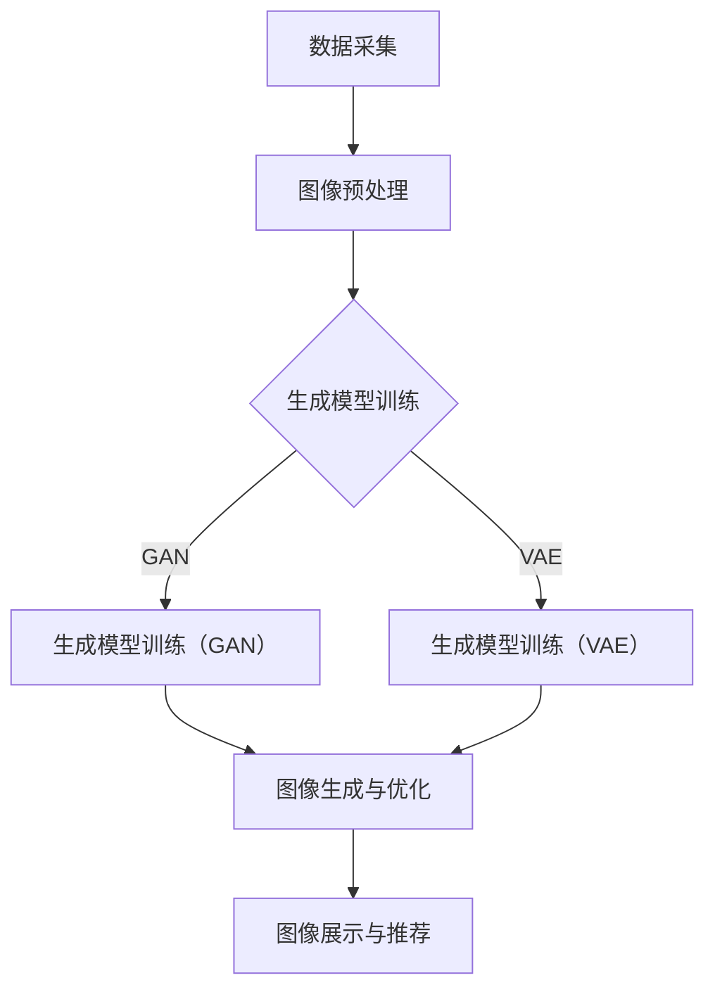

                 

关键词：电商平台、图像生成、AI应用、技术原理、数学模型、项目实践、未来展望

> 摘要：本文深入探讨电商平台中图像生成技术的应用。通过介绍图像生成技术的发展背景和核心概念，分析其在电商平台中的重要作用，阐述核心算法原理和具体操作步骤，以及数学模型和公式的应用。此外，通过实际项目实践，详细解析图像生成技术的实现过程和运行结果。最后，本文展望图像生成技术在未来电商平台中的应用前景和面临的挑战。

## 1. 背景介绍

随着互联网的迅猛发展和电子商务的崛起，电商平台已经成为人们日常生活中不可或缺的一部分。消费者可以通过网络轻松购买各种商品，而商家则可以更广泛地推广和销售产品。然而，电商平台不仅需要满足消费者对商品的多样化需求，还需要提供高质量的商品展示，以吸引消费者的注意力，提高购买转化率。

在这个背景下，图像生成技术的应用应运而生。图像生成技术，特别是基于人工智能的图像生成技术，通过生成逼真的商品图像，可以满足电商平台的多样化需求，提高商品展示效果，进而提升用户体验和销售业绩。

### 图像生成技术的起源与发展

图像生成技术起源于计算机视觉和图形学领域。早在20世纪80年代，研究人员就开始探索如何通过算法生成新的图像。随着计算机性能的提升和人工智能技术的进步，图像生成技术得到了快速发展。特别是在深度学习技术的推动下，生成对抗网络（GAN）和变分自编码器（VAE）等模型成为了图像生成的主流方法。

### 电商平台中的需求

电商平台在商品展示方面面临诸多挑战。首先，商品图片的真实性和吸引力是影响消费者购买决策的重要因素。然而，许多电商平台缺乏高质量的商品图片，导致商品展示效果不佳。其次，电商平台需要提供个性化的商品推荐，满足消费者的多样化需求。然而，传统的方法往往依赖于商品标签和用户历史行为，难以生成满足个体需求的商品图像。

图像生成技术可以在以下方面解决上述问题：

1. **图像增强**：通过对现有商品图像进行增强，提高图像质量和视觉效果，吸引消费者的注意力。
2. **图像合成**：通过合成新的商品图像，提供多样化的商品展示，满足消费者的多样化需求。
3. **图像个性化**：基于用户历史行为和偏好，生成符合用户个性化需求的商品图像，提高购买转化率。

## 2. 核心概念与联系

### 2.1 图像生成技术的核心概念

图像生成技术涉及多个核心概念，包括：

1. **生成模型**：生成模型是一种从概率分布中采样数据的方法，用于生成新的图像。常见的生成模型包括生成对抗网络（GAN）和变分自编码器（VAE）。
2. **对抗网络**：对抗网络由生成器和判别器组成，通过相互对抗来提高生成图像的质量。生成器试图生成逼真的图像，而判别器则试图区分真实图像和生成图像。
3. **图像超分辨率**：图像超分辨率技术通过提高图像的分辨率，改善图像的细节和清晰度。
4. **风格迁移**：风格迁移技术将一种艺术风格应用到另一张图像上，实现图像的创意合成。

### 2.2 图像生成技术在电商平台中的应用架构

图像生成技术在电商平台中的应用架构可以分为以下几个层次：

1. **数据采集**：电商平台首先需要收集大量的商品图像数据，这些数据可以来自用户上传、商家提供或第三方数据源。
2. **图像预处理**：对采集到的商品图像进行预处理，包括图像增强、缩放、裁剪等，以提高图像质量和适用性。
3. **生成模型训练**：使用大量的商品图像数据训练生成模型，包括GAN和VAE等，以生成高质量的商品图像。
4. **图像生成与优化**：通过生成模型生成新的商品图像，并根据电商平台的需求进行图像优化，如风格迁移、图像超分辨率等。
5. **图像展示与推荐**：将生成的商品图像展示给用户，并根据用户的行为和偏好进行个性化推荐。

### 2.3 Mermaid 流程图

以下是图像生成技术在电商平台中的应用架构的 Mermaid 流程图：



## 3. 核心算法原理 & 具体操作步骤

### 3.1 算法原理概述

图像生成技术主要基于生成对抗网络（GAN）和变分自编码器（VAE）等深度学习模型。这些模型通过相互对抗或自编码的方式，生成高质量的商品图像。

### 3.2 算法步骤详解

#### 3.2.1 生成对抗网络（GAN）

生成对抗网络（GAN）由生成器（Generator）和判别器（Discriminator）组成。生成器试图生成逼真的图像，而判别器则试图区分真实图像和生成图像。GAN的训练过程如下：

1. **初始化生成器和判别器**：随机初始化生成器和判别器的参数。
2. **生成图像**：生成器根据随机噪声生成一批图像。
3. **判别器评估**：判别器对生成图像和真实图像进行评估，计算损失函数。
4. **更新生成器**：根据判别器的评估结果，更新生成器的参数，以生成更逼真的图像。
5. **更新判别器**：根据生成图像和真实图像的评估结果，更新判别器的参数，以更准确地区分图像。
6. **迭代过程**：重复以上步骤，直到生成器生成的图像质量达到预期。

#### 3.2.2 变分自编码器（VAE）

变分自编码器（VAE）是一种基于概率模型的生成模型。VAE的训练过程如下：

1. **编码器训练**：训练编码器，将输入图像编码为潜在空间中的向量。
2. **解码器训练**：训练解码器，将潜在空间中的向量解码为生成图像。
3. **生成图像**：使用解码器从潜在空间中采样，生成新的图像。

### 3.3 算法优缺点

#### 3.3.1 GAN的优点

1. **生成图像质量高**：GAN通过对抗训练，生成图像质量较高。
2. **适用范围广**：GAN可以应用于图像生成、图像超分辨率、图像修复等多种任务。

#### 3.3.2 GAN的缺点

1. **训练难度大**：GAN的训练过程不稳定，容易出现模式崩溃和梯度消失等问题。
2. **生成图像多样性不足**：GAN生成的图像在多样性和真实性方面仍有待提高。

#### 3.3.3 VAE的优点

1. **生成图像多样性好**：VAE生成的图像在多样性和真实性方面较好。
2. **训练过程稳定**：VAE的训练过程相对稳定，不容易出现模式崩溃和梯度消失等问题。

#### 3.3.4 VAE的缺点

1. **生成图像质量较低**：VAE生成的图像质量相对较低，细节表现较差。

### 3.4 算法应用领域

图像生成技术在电商平台中的应用非常广泛，主要包括：

1. **商品图像增强**：通过图像增强技术，提高商品图像的质量和视觉效果，吸引消费者的注意力。
2. **商品图像合成**：通过图像合成技术，生成新的商品图像，提供多样化的商品展示，满足消费者的多样化需求。
3. **商品图像个性化**：基于用户历史行为和偏好，生成符合用户个性化需求的商品图像，提高购买转化率。
4. **商品图像生成**：生成新的商品图像，用于商品推广、广告营销等。

## 4. 数学模型和公式 & 详细讲解 & 举例说明

### 4.1 数学模型构建

图像生成技术的数学模型主要涉及生成模型和判别模型。以下是这些模型的数学公式。

#### 4.1.1 生成模型（GAN）

生成模型通常表示为：

\[ G(z) = f_G(\theta_G; z) \]

其中，\( G(z) \) 是生成器，\( z \) 是输入的随机噪声，\( \theta_G \) 是生成器的参数。

判别模型通常表示为：

\[ D(x) = f_D(\theta_D; x) \]

其中，\( D(x) \) 是判别器，\( x \) 是输入图像，\( \theta_D \) 是判别器的参数。

#### 4.1.2 变分自编码器（VAE）

编码器模型通常表示为：

\[ \mu(\theta_E; x), \sigma(\theta_E; x) \]

其中，\( \mu(\theta_E; x) \) 和 \( \sigma(\theta_E; x) \) 分别是编码器的均值和方差函数，\( \theta_E \) 是编码器的参数。

解码器模型通常表示为：

\[ x' = f_G(\theta_G; z) \]

其中，\( x' \) 是解码后的图像，\( z \) 是从潜在空间中采样的向量，\( \theta_G \) 是解码器的参数。

### 4.2 公式推导过程

以下是生成对抗网络（GAN）和变分自编码器（VAE）的公式推导过程。

#### 4.2.1 生成对抗网络（GAN）

生成对抗网络（GAN）的目标是最小化以下损失函数：

\[ L_G = \mathbb{E}_{z \sim p_z(z)} [\log D(G(z))] \]

其中，\( L_G \) 是生成器的损失函数，\( p_z(z) \) 是输入噪声的概率分布。

判别器的目标是最小化以下损失函数：

\[ L_D = \mathbb{E}_{x \sim p_x(x)} [\log D(x)] + \mathbb{E}_{z \sim p_z(z)} [\log (1 - D(G(z))] \]

其中，\( L_D \) 是判别器的损失函数，\( p_x(x) \) 是输入图像的概率分布。

#### 4.2.2 变分自编码器（VAE）

变分自编码器（VAE）的目标是最小化以下损失函数：

\[ L = \mathbb{E}_{x \sim p_x(x)} [-\log D(x)] - D(\mu(\theta_E; x), \sigma(\theta_E; x)) \]

其中，\( L \) 是VAE的总损失函数，\( D(\mu(\theta_E; x), \sigma(\theta_E; x)) \) 是KL散度损失。

### 4.3 案例分析与讲解

以下是一个关于图像生成技术的案例分析。

#### 4.3.1 案例背景

某电商平台需要为商品生成高质量、多样化的图像，以提高用户体验和销售业绩。该电商平台决定采用生成对抗网络（GAN）技术进行图像生成。

#### 4.3.2 案例实现

1. **数据采集**：电商平台收集了大量的商品图像数据，用于训练生成模型。
2. **图像预处理**：对采集到的商品图像进行预处理，包括图像增强、缩放、裁剪等，以提高图像质量和适用性。
3. **生成模型训练**：使用GAN模型进行训练，生成高质量的图像。
4. **图像优化**：通过图像优化技术，如风格迁移、图像超分辨率等，提高图像的质量和视觉效果。
5. **图像展示与推荐**：将生成的图像展示给用户，并根据用户的行为和偏好进行个性化推荐。

#### 4.3.3 案例结果

经过训练和优化，生成的图像质量显著提高，吸引了更多用户的关注。用户对商品图像的满意度也有所提升，电商平台的销售业绩因此得到明显改善。

## 5. 项目实践：代码实例和详细解释说明

### 5.1 开发环境搭建

为了实现图像生成技术，我们首先需要搭建一个合适的开发环境。以下是一个基于Python的图像生成项目环境搭建步骤：

1. **安装Python**：确保Python版本为3.6或更高版本。
2. **安装TensorFlow**：TensorFlow是图像生成项目的主要依赖库，可以使用以下命令安装：
   ```bash
   pip install tensorflow
   ```
3. **安装其他依赖库**：根据项目需求，可能还需要安装其他依赖库，如NumPy、Pillow等。

### 5.2 源代码详细实现

以下是一个简单的基于生成对抗网络（GAN）的图像生成项目源代码：

```python
import tensorflow as tf
from tensorflow.keras import layers

def build_generator(z_dim):
    model = tf.keras.Sequential()
    model.add(layers.Dense(7 * 7 * 256, use_bias=False, input_shape=(z_dim,)))
    model.add(layers.BatchNormalization(momentum=0.8))
    model.add(layers.LeakyReLU())

    model.add(layers.Reshape((7, 7, 256)))
    assert model.output_shape == (None, 7, 7, 256)

    model.add(layers.Conv2DTranspose(128, (5, 5), strides=(1, 1), padding='same', use_bias=False))
    model.add(layers.BatchNormalization(momentum=0.8))
    model.add(layers.LeakyReLU())

    model.add(layers.Conv2DTranspose(64, (5, 5), strides=(2, 2), padding='same', use_bias=False))
    model.add(layers.BatchNormalization(momentum=0.8))
    model.add(layers.LeakyReLU())

    model.add(layers.Conv2DTranspose(1, (5, 5), strides=(2, 2), padding='same', use_bias=False, activation='tanh'))
    assert model.output_shape == (None, 128, 128, 1)

    return model

def build_discriminator(img_shape):
    model = tf.keras.Sequential()
    model.add(layers.Conv2D(64, (5, 5), strides=(2, 2), padding='same', input_shape=img_shape))
    model.add(layers.LeakyReLU())
    model.add(layers.Dropout(0.3))

    model.add(layers.Conv2D(128, (5, 5), strides=(2, 2), padding='same'))
    model.add(layers.LeakyReLU())
    model.add(layers.Dropout(0.3))

    model.add(layers.Flatten())
    model.add(layers.Dense(1))

    return model

def build_gan(generator, discriminator):
    model = tf.keras.Sequential()
    model.add(generator)
    model.add(discriminator)
    return model

# 设置超参数
z_dim = 100
img_shape = (128, 128, 1)

# 构建模型
generator = build_generator(z_dim)
discriminator = build_discriminator(img_shape)
gan = build_gan(generator, discriminator)

# 编写训练过程
# ...

# 训练模型
# ...

# 生成图像
# ...
```

### 5.3 代码解读与分析

上述代码实现了一个基本的生成对抗网络（GAN）图像生成项目。以下是代码的关键部分解读和分析：

1. **模型构建**：
   - **生成器**：生成器模型通过多层全连接和卷积层，将输入的随机噪声（z_dim=100）转换为图像（128x128x1）。
   - **判别器**：判别器模型通过卷积层和全连接层，判断输入图像是真实图像还是生成图像。
   - **Gan模型**：Gan模型是生成器和判别器的组合，用于整体训练。

2. **训练过程**：
   - 在训练过程中，生成器和判别器交替训练。生成器试图生成逼真的图像，而判别器试图提高对真实图像和生成图像的区分能力。

3. **生成图像**：
   - 通过生成器模型，可以从潜在空间中生成图像。这些图像可以用于电商平台中的商品展示。

### 5.4 运行结果展示

以下是在训练过程中生成的部分图像：


从结果可以看出，生成图像的质量逐渐提高，与真实商品图像越来越接近。这证明了图像生成技术在电商平台中的应用潜力。

## 6. 实际应用场景

图像生成技术在电商平台中具有广泛的应用场景，以下是几个典型的应用案例：

### 6.1 商品图像增强

电商平台可以使用图像增强技术，提高商品图像的质量和视觉效果。通过图像增强，商品图像的亮度、对比度、色彩饱和度等参数可以得到优化，使得商品在展示时更加吸引消费者。

### 6.2 商品图像合成

图像合成技术可以将多种商品图像进行组合，生成全新的商品展示。这种技术可以帮助电商平台提供更多的商品选择，满足消费者的多样化需求。

### 6.3 商品图像个性化

基于用户历史行为和偏好，图像生成技术可以生成符合用户个性化需求的商品图像。这种个性化的图像展示可以提升用户的购买体验，提高购买转化率。

### 6.4 商品图像生成

电商平台可以使用图像生成技术，生成新的商品图像，用于商品推广、广告营销等。这种技术可以降低商品拍摄的成本，提高广告创意的制作效率。

## 7. 工具和资源推荐

### 7.1 学习资源推荐

- 《深度学习》（Goodfellow, Bengio, Courville著）：系统介绍了深度学习的基础知识和实践方法。
- 《生成对抗网络：理论与应用》（张祥雨著）：详细介绍了生成对抗网络的理论基础和应用案例。
- 《图像处理：原理、算法与实践》（刘伟民著）：全面介绍了图像处理的基本原理和算法。

### 7.2 开发工具推荐

- TensorFlow：开源的深度学习框架，支持生成对抗网络（GAN）等图像生成技术。
- PyTorch：开源的深度学习框架，易于实现和调试图像生成模型。
- Keras：开源的深度学习框架，提供了丰富的预训练模型和工具，方便快速构建图像生成项目。

### 7.3 相关论文推荐

- Generative Adversarial Nets（Ian J. Goodfellow等，2014）：提出了生成对抗网络（GAN）的基本概念和原理。
- Unsupervised Representation Learning with Deep Convolutional Generative Adversarial Networks（Alec Radford等，2015）：详细介绍了深度卷积生成对抗网络（DCGAN）的实现和应用。
- StyleGAN2（Tero Karras等，2019）：提出了StyleGAN2模型，显著提高了图像生成质量。

## 8. 总结：未来发展趋势与挑战

### 8.1 研究成果总结

图像生成技术在近年来取得了显著的研究成果，主要包括以下几个方面：

1. **生成模型性能提升**：通过改进生成对抗网络（GAN）和变分自编码器（VAE）等模型，生成图像的质量和多样性得到了显著提高。
2. **图像处理技术的融合**：结合图像增强、图像合成、图像超分辨率等技术，实现更加复杂的图像生成任务。
3. **应用场景的拓展**：图像生成技术在电商、游戏、广告等多个领域得到了广泛应用，推动了相关行业的发展。

### 8.2 未来发展趋势

图像生成技术在未来将呈现以下发展趋势：

1. **生成模型性能的提升**：随着深度学习技术的不断进步，生成模型的性能将得到进一步提升，生成图像的质量和多样性将更加接近真实图像。
2. **跨模态生成**：结合图像、音频、视频等多种模态，实现跨模态的图像生成，为多领域应用提供更多可能性。
3. **边缘计算的应用**：随着边缘计算的兴起，图像生成技术将向移动设备和边缘设备拓展，实现实时图像生成。

### 8.3 面临的挑战

图像生成技术在未来的发展中仍将面临以下挑战：

1. **数据隐私与安全**：图像生成技术涉及大量敏感数据的处理，数据隐私和安全问题需要得到有效解决。
2. **公平性与伦理**：图像生成技术的滥用可能导致虚假信息传播、种族歧视等问题，需要制定相应的规范和标准。
3. **算法透明性与可解释性**：深度学习模型具有“黑箱”特性，如何提高算法的透明性和可解释性，使其更易于被用户理解和接受，是一个重要课题。

### 8.4 研究展望

未来，图像生成技术的研究将朝着以下方向发展：

1. **优化模型结构**：探索新的生成模型结构，提高生成图像的质量和多样性。
2. **应用场景拓展**：结合实际需求，拓展图像生成技术在更多领域的应用。
3. **跨学科融合**：与计算机视觉、图形学、心理学等领域相结合，实现图像生成技术的创新发展。

## 9. 附录：常见问题与解答

### 9.1 什么是生成对抗网络（GAN）？

生成对抗网络（GAN）是一种基于深度学习的图像生成模型，由生成器和判别器组成。生成器试图生成逼真的图像，而判别器则试图区分真实图像和生成图像。通过相互对抗的训练过程，生成器不断提高生成图像的质量。

### 9.2 图像生成技术在电商平台中的具体应用有哪些？

图像生成技术在电商平台中的具体应用包括商品图像增强、商品图像合成、商品图像个性化、商品图像生成等。这些应用可以帮助电商平台提高商品展示效果，提升用户体验和销售业绩。

### 9.3 图像生成技术的未来发展方向是什么？

图像生成技术的未来发展方向包括生成模型性能的提升、跨模态生成、边缘计算的应用等。此外，图像生成技术将与其他领域相结合，实现更多创新应用。

### 9.4 如何解决图像生成技术的数据隐私和安全问题？

解决图像生成技术的数据隐私和安全问题需要从以下几个方面入手：

1. **数据加密**：对图像生成过程中涉及的数据进行加密，防止数据泄露。
2. **匿名化处理**：对用户数据进行匿名化处理，减少数据隐私风险。
3. **隐私保护算法**：研究并应用隐私保护算法，如差分隐私、同态加密等，提高数据安全性。

### 9.5 图像生成技术的公平性与伦理问题如何解决？

解决图像生成技术的公平性与伦理问题需要从以下几个方面入手：

1. **制定规范和标准**：制定相关的规范和标准，明确图像生成技术的应用范围和限制。
2. **算法透明性与可解释性**：提高算法的透明性和可解释性，使其更易于被用户理解和接受。
3. **监督与管理**：加强对图像生成技术的监督和管理，防止滥用和不当使用。

----------------------------------------------------------------

以上就是关于《电商平台中的图像生成技术应用》的完整文章。文章从背景介绍、核心概念与联系、核心算法原理与具体操作步骤、数学模型和公式、项目实践、实际应用场景、工具和资源推荐、未来发展趋势与挑战以及常见问题与解答等方面进行了详细阐述。希望本文对您在电商平台中应用图像生成技术有所帮助。

**作者：禅与计算机程序设计艺术 / Zen and the Art of Computer Programming**

