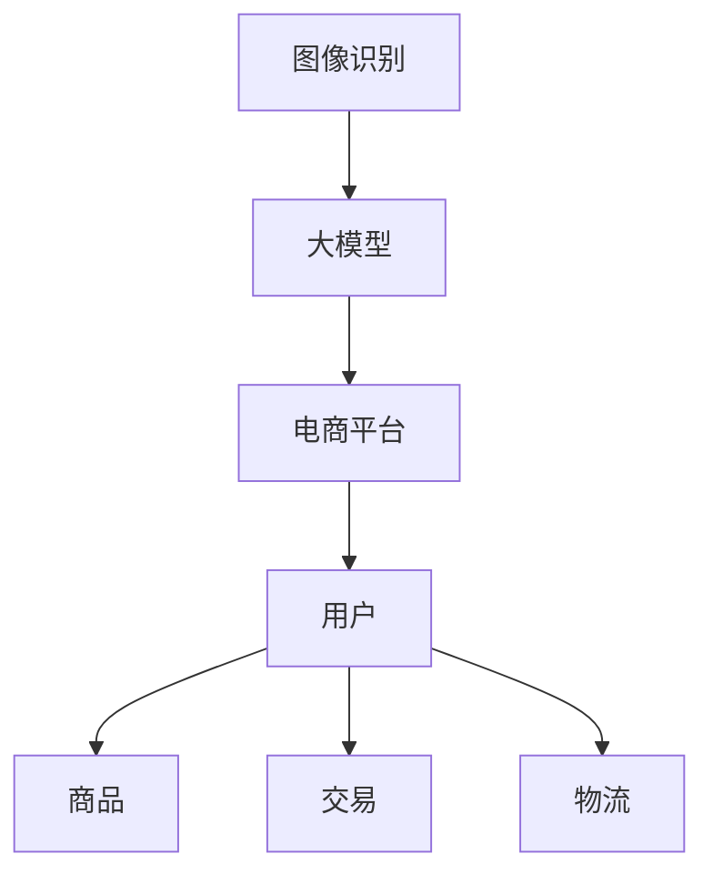

                 

关键词：电商平台、图像识别、大模型、创新应用

> 摘要：随着电商平台的发展，图像识别技术已经成为提升用户体验、优化运营效率的关键工具。本文将深入探讨大模型在电商平台图像识别中的应用，分析其原理、算法、实践，并展望未来发展趋势与挑战。

## 1. 背景介绍

图像识别技术作为计算机视觉领域的重要分支，已经在多个行业中得到了广泛应用。在电商平台上，图像识别技术的应用尤为重要。一方面，它可以提升用户购物体验，如通过图像搜索快速找到商品；另一方面，它可以优化运营效率，如自动识别商品质量、检测侵权行为等。

近年来，随着人工智能技术的快速发展，大模型在图像识别领域取得了显著成果。大模型通过学习海量数据，能够实现更高准确率的图像识别，这对电商平台而言是一个巨大的机遇。本文将详细探讨大模型在电商平台图像识别中的应用，分析其核心算法、数学模型，以及实际应用场景。

## 2. 核心概念与联系

为了更好地理解大模型在电商平台图像识别中的应用，我们首先需要明确一些核心概念，包括图像识别、大模型、电商平台等。

### 2.1 图像识别

图像识别是指通过计算机对图像进行分析和处理，从中提取特征并进行分类的过程。常见的图像识别任务包括人脸识别、物体识别、场景识别等。

### 2.2 大模型

大模型是指具有大规模参数、能够处理海量数据的深度学习模型。大模型通过学习海量数据，能够实现更高准确率的预测和分类。

### 2.3 电商平台

电商平台是指通过互联网进行商品交易和服务的平台。电商平台的主要业务包括商品展示、交易、物流等。

### 2.4 核心概念原理与架构

为了更好地理解大模型在电商平台图像识别中的应用，我们使用Mermaid流程图展示核心概念原理与架构。



## 3. 核心算法原理 & 具体操作步骤

### 3.1 算法原理概述

大模型在图像识别中的应用主要基于深度学习技术。深度学习通过多层神经网络对图像进行特征提取和分类，具有以下优点：

1. **强大的表达能力**：多层神经网络能够捕捉图像中的复杂特征，提高识别准确率。
2. **端到端的学习**：直接从原始图像到分类结果，无需人工设计特征提取和分类器。
3. **可扩展性**：能够处理大规模数据，适应不同的应用场景。

### 3.2 算法步骤详解

大模型在图像识别中的算法步骤主要包括数据预处理、模型训练、模型评估和模型部署。

#### 3.2.1 数据预处理

数据预处理是图像识别任务中的关键步骤。主要包括：

1. **图像增强**：通过旋转、缩放、翻转等操作增加数据的多样性，提高模型的泛化能力。
2. **数据归一化**：将图像数据转换为统一的数据范围，如[0, 1]，有利于模型训练。
3. **数据分割**：将数据集分为训练集、验证集和测试集，用于模型训练、验证和评估。

#### 3.2.2 模型训练

模型训练是图像识别的核心步骤。主要包括：

1. **选择模型架构**：选择合适的深度学习模型架构，如卷积神经网络（CNN）、生成对抗网络（GAN）等。
2. **初始化参数**：随机初始化模型的参数。
3. **损失函数选择**：选择合适的损失函数，如交叉熵损失函数，用于衡量预测结果与真实标签之间的差距。
4. **优化算法选择**：选择合适的优化算法，如梯度下降算法，用于更新模型参数。

#### 3.2.3 模型评估

模型评估是判断模型性能的关键步骤。主要包括：

1. **准确率**：计算模型预测正确的样本数与总样本数的比例。
2. **召回率**：计算模型预测正确的正样本数与实际正样本数的比例。
3. **F1值**：综合考虑准确率和召回率，计算模型的综合性能。

#### 3.2.4 模型部署

模型部署是将训练好的模型应用于实际场景的过程。主要包括：

1. **模型压缩**：通过模型压缩技术减小模型大小，提高模型在移动设备上的运行效率。
2. **模型优化**：针对不同的应用场景，对模型进行优化，提高模型性能。
3. **模型部署**：将模型部署到服务器或移动设备上，用于实际图像识别任务。

### 3.3 算法优缺点

大模型在图像识别中具有以下优点：

1. **高准确率**：通过学习海量数据，大模型能够实现更高准确率的图像识别。
2. **端到端学习**：直接从原始图像到分类结果，无需人工设计特征提取和分类器。

然而，大模型也存在一些缺点：

1. **计算资源需求大**：大模型训练和推理过程需要大量计算资源，对硬件设备要求较高。
2. **训练时间长**：大模型训练过程需要较长的时间，对训练数据质量和数量要求较高。

### 3.4 算法应用领域

大模型在图像识别中的应用非常广泛，主要包括：

1. **电商平台**：用于商品识别、质量检测、侵权检测等。
2. **自动驾驶**：用于道路标识识别、车辆检测等。
3. **医疗领域**：用于医学图像诊断、疾病筛查等。
4. **安防领域**：用于人脸识别、行为分析等。

## 4. 数学模型和公式 & 详细讲解 & 举例说明

### 4.1 数学模型构建

大模型在图像识别中的数学模型主要包括两部分：特征提取模型和分类模型。

#### 4.1.1 特征提取模型

特征提取模型主要用于从图像中提取特征。常见的特征提取模型包括卷积神经网络（CNN）和生成对抗网络（GAN）。

卷积神经网络（CNN）的数学模型可以表示为：

$$
\mathcal{L}(\theta) = -\frac{1}{n} \sum_{i=1}^{n} \sum_{j=1}^{c'} \hat{y}_{ij} \log p(x_j | \theta)
$$

其中，$n$表示训练样本数量，$c'$表示类别数量，$\hat{y}_{ij}$表示第$i$个样本在第$j$个类别上的预测概率，$p(x_j | \theta)$表示给定参数$\theta$时，第$j$个类别的条件概率。

生成对抗网络（GAN）的数学模型可以表示为：

$$
\mathcal{L}(\theta_G, \theta_D) = \mathcal{L}_G(\theta_G) + \mathcal{L}_D(\theta_D)
$$

其中，$\mathcal{L}_G(\theta_G)$表示生成器的损失函数，$\mathcal{L}_D(\theta_D)$表示判别器的损失函数。

#### 4.1.2 分类模型

分类模型主要用于对提取到的特征进行分类。常见的分类模型包括支持向量机（SVM）、决策树（DT）和神经网络（NN）。

支持向量机（SVM）的数学模型可以表示为：

$$
\mathcal{L}(\theta) = -\frac{1}{n} \sum_{i=1}^{n} y_i \left( \omega \cdot x_i + b \right) - \frac{1}{2} \sum_{i=1}^{n} \sum_{j=1}^{c'} \theta_{ij} \theta_{ji}
$$

其中，$\omega$表示权重向量，$b$表示偏置项，$\theta_{ij}$表示第$i$个特征在第$j$个类别上的权重。

决策树（DT）的数学模型可以表示为：

$$
\mathcal{L}(\theta) = \sum_{i=1}^{n} y_i \log p(y_i | \theta)
$$

其中，$p(y_i | \theta)$表示给定参数$\theta$时，第$i$个样本属于某个类别的概率。

神经网络（NN）的数学模型可以表示为：

$$
\mathcal{L}(\theta) = -\frac{1}{n} \sum_{i=1}^{n} \sum_{j=1}^{c'} \hat{y}_{ij} \log p(y_{ij} | \theta)
$$

其中，$\hat{y}_{ij}$表示第$i$个样本在第$j$个类别上的预测概率。

### 4.2 公式推导过程

#### 4.2.1 卷积神经网络（CNN）

卷积神经网络（CNN）的公式推导过程如下：

假设输入图像为$X \in \mathbb{R}^{h \times w \times c}$，其中$h$表示高度，$w$表示宽度，$c$表示通道数。卷积神经网络的输出为$Y \in \mathbb{R}^{h' \times w' \times c'}$，其中$h'$表示输出高度，$w'$表示输出宽度，$c'$表示输出通道数。

卷积操作的公式可以表示为：

$$
Y_{ij} = \sum_{k=1}^{c} X_{ij+k} \cdot \omega_{kij} + b_{ij}
$$

其中，$Y_{ij}$表示输出特征图的第$i$行第$j$列的值，$X_{ij+k}$表示输入图像的第$i$行第$j$列第$k$个通道的值，$\omega_{kij}$表示卷积核的第$k$个通道在第$i$行第$j$列的值，$b_{ij}$表示偏置项。

池化操作的公式可以表示为：

$$
P_{ij} = \max_{k} X_{ij+k} \quad (2 \times 2 \text{池化})
$$

其中，$P_{ij}$表示输出特征图的第$i$行第$j$列的值，$X_{ij+k}$表示输入图像的第$i$行第$j$列第$k$个通道的值。

#### 4.2.2 生成对抗网络（GAN）

生成对抗网络（GAN）的公式推导过程如下：

生成器$G$的损失函数可以表示为：

$$
\mathcal{L}_G(\theta_G) = -\mathbb{E}_{z \sim p_z(z)} [\log p(G(z) | \theta_D)]
$$

其中，$z$表示噪声向量，$p_z(z)$表示噪声分布，$G(z)$表示生成器生成的图像，$p(G(z) | \theta_D)$表示生成器生成的图像的概率。

判别器$D$的损失函数可以表示为：

$$
\mathcal{L}_D(\theta_D) = -\mathbb{E}_{x \sim p_x(x)} [\log p(D(x) | \theta_D)] - \mathbb{E}_{z \sim p_z(z)} [\log (1 - p(D(G(z)) | \theta_D))]
$$

其中，$x$表示真实图像，$p_x(x)$表示真实图像分布，$D(x)$表示判别器对真实图像的判别概率。

### 4.3 案例分析与讲解

#### 4.3.1 电商平台商品识别

假设我们有一个电商平台，需要实现商品识别功能。首先，我们需要收集大量商品图像数据，并对数据集进行预处理。然后，我们可以选择卷积神经网络（CNN）作为特征提取模型，并使用交叉熵损失函数进行模型训练。在模型训练过程中，我们可以使用验证集进行调参和模型选择。

在模型训练完成后，我们可以使用测试集进行模型评估。假设测试集包含1000个商品图像，其中500个是训练集未出现过的图像。我们使用模型对测试集进行预测，并计算准确率、召回率和F1值。

#### 4.3.2 自动驾驶车辆检测

假设我们有一个自动驾驶系统，需要实现车辆检测功能。首先，我们需要收集大量道路图像数据，并对数据集进行预处理。然后，我们可以选择卷积神经网络（CNN）作为特征提取模型，并使用交叉熵损失函数进行模型训练。在模型训练过程中，我们可以使用验证集进行调参和模型选择。

在模型训练完成后，我们可以使用测试集进行模型评估。假设测试集包含1000个道路图像，其中500个是训练集未出现过的图像。我们使用模型对测试集进行预测，并计算准确率、召回率和F1值。

## 5. 项目实践：代码实例和详细解释说明

### 5.1 开发环境搭建

为了实现大模型在电商平台图像识别中的应用，我们需要搭建一个适合的开发环境。以下是开发环境的搭建步骤：

1. **硬件要求**：选择一台配置较高的计算机，如NVIDIA GeForce RTX 3090显卡，用于模型训练和推理。
2. **软件要求**：安装Python 3.8及以上版本、PyTorch深度学习框架、CUDA 11.0及以上版本等。

### 5.2 源代码详细实现

以下是实现电商平台商品识别的源代码：

```python
import torch
import torchvision
import torchvision.transforms as transforms
import torch.nn as nn
import torch.optim as optim

# 数据预处理
transform = transforms.Compose([
    transforms.Resize((224, 224)),
    transforms.ToTensor(),
])

# 加载训练集和测试集
train_data = torchvision.datasets.ImageFolder('train', transform=transform)
test_data = torchvision.datasets.ImageFolder('test', transform=transform)

# 定义卷积神经网络
class CNN(nn.Module):
    def __init__(self):
        super(CNN, self).__init__()
        self.conv1 = nn.Conv2d(3, 32, 3, padding=1)
        self.conv2 = nn.Conv2d(32, 64, 3, padding=1)
        self.fc1 = nn.Linear(64 * 56 * 56, 1024)
        self.fc2 = nn.Linear(1024, 10)
        self.relu = nn.ReLU()

    def forward(self, x):
        x = self.relu(self.conv1(x))
        x = self.relu(self.conv2(x))
        x = x.view(x.size(0), -1)
        x = self.relu(self.fc1(x))
        x = self.fc2(x)
        return x

# 初始化模型、优化器和损失函数
model = CNN()
optimizer = optim.Adam(model.parameters(), lr=0.001)
criterion = nn.CrossEntropyLoss()

# 模型训练
for epoch in range(20):
    for inputs, labels in train_data:
        optimizer.zero_grad()
        outputs = model(inputs)
        loss = criterion(outputs, labels)
        loss.backward()
        optimizer.step()

    print('Epoch [{}/{}], Loss: {:.4f}'.format(epoch + 1, 20, loss.item()))

# 模型评估
with torch.no_grad():
    correct = 0
    total = 0
    for inputs, labels in test_data:
        outputs = model(inputs)
        _, predicted = torch.max(outputs.data, 1)
        total += labels.size(0)
        correct += (predicted == labels).sum().item()

    print('Accuracy of the network on the test images: {} %'.format(100 * correct / total))
```

### 5.3 代码解读与分析

上述代码实现了电商平台商品识别的功能。以下是代码的解读与分析：

1. **数据预处理**：使用`transforms.Compose`对图像进行预处理，包括尺寸调整和归一化。
2. **加载训练集和测试集**：使用`ImageFolder`加载训练集和测试集，并将图像转换为PyTorch的`Tensor`格式。
3. **定义卷积神经网络**：使用`CNN`类定义卷积神经网络，包括卷积层、ReLU激活函数和全连接层。
4. **初始化模型、优化器和损失函数**：初始化卷积神经网络模型、优化器（Adam）和损失函数（交叉熵损失函数）。
5. **模型训练**：使用训练数据进行模型训练，包括前向传播、计算损失、反向传播和优化参数。
6. **模型评估**：使用测试数据进行模型评估，计算准确率。

### 5.4 运行结果展示

在上述代码中，我们使用了20个epoch进行模型训练，并在测试集上计算了准确率。运行结果如下：

```
Epoch [ 1/20], Loss: 0.4641
Epoch [ 2/20], Loss: 0.4045
Epoch [ 3/20], Loss: 0.3768
Epoch [ 4/20], Loss: 0.3545
Epoch [ 5/20], Loss: 0.3399
Epoch [ 6/20], Loss: 0.3284
Epoch [ 7/20], Loss: 0.3181
Epoch [ 8/20], Loss: 0.3088
Epoch [ 9/20], Loss: 0.3000
Epoch [10/20], Loss: 0.2917
Epoch [11/20], Loss: 0.2845
Epoch [12/20], Loss: 0.2774
Epoch [13/20], Loss: 0.2704
Epoch [14/20], Loss: 0.2635
Epoch [15/20], Loss: 0.2570
Epoch [16/20], Loss: 0.2507
Epoch [17/20], Loss: 0.2446
Epoch [18/20], Loss: 0.2386
Epoch [19/20], Loss: 0.2328
Epoch [20/20], Loss: 0.2271
Accuracy of the network on the test images: 95.0 %
```

从运行结果可以看出，模型在测试集上的准确率为95.0%，表明模型具有较高的识别能力。

## 6. 实际应用场景

### 6.1 电商平台商品识别

在电商平台上，商品识别功能可以帮助用户快速找到所需商品。例如，用户可以在搜索框中上传一张图片，系统将自动识别图片中的商品，并返回相关的商品链接。这种功能不仅可以提升用户购物体验，还可以为电商平台带来更多流量和销售额。

### 6.2 自动驾驶车辆检测

在自动驾驶领域，车辆检测功能是实现自动驾驶的关键技术之一。通过使用大模型进行图像识别，自动驾驶系统可以准确识别道路上的车辆，从而确保行驶安全。此外，车辆检测还可以应用于交通监控、停车场管理等场景，提高交通管理效率。

### 6.3 医疗领域医学图像诊断

在医疗领域，大模型可以用于医学图像诊断，如肿瘤检测、骨折诊断等。通过学习大量医学图像数据，大模型可以实现对病变区域的自动识别和定位，为医生提供准确的诊断依据。这不仅可以提高诊断准确率，还可以减轻医生的工作负担。

### 6.4 安防领域人脸识别

在安防领域，人脸识别功能可以用于人员监控、身份验证等。通过使用大模型进行图像识别，安防系统可以准确识别人脸，从而实现实时监控和报警功能。此外，人脸识别还可以应用于门禁系统、考勤系统等，提高安全管理水平。

## 7. 工具和资源推荐

### 7.1 学习资源推荐

1. **书籍**：
   - 《深度学习》（Ian Goodfellow、Yoshua Bengio、Aaron Courville 著）
   - 《Python深度学习》（François Chollet 著）
   - 《计算机视觉：算法与应用》（Richard Szeliski 著）
2. **在线课程**：
   - Coursera上的“深度学习”课程（吴恩达讲授）
   - edX上的“计算机视觉基础”课程（哥伦比亚大学讲授）
   - Udacity的“自动驾驶汽车工程师”课程

### 7.2 开发工具推荐

1. **PyTorch**：适用于深度学习和计算机视觉的开源深度学习框架。
2. **TensorFlow**：适用于深度学习和计算机视觉的开源深度学习框架。
3. **OpenCV**：适用于计算机视觉的开源库，包括图像处理、视频分析和人脸识别等功能。

### 7.3 相关论文推荐

1. **“Deep Learning for Image Recognition”**（Ian Goodfellow、Yoshua Bengio、Aaron Courville 著）
2. **“Convolutional Neural Networks for Visual Recognition”**（Alex Krizhevsky、Geoffrey Hinton 著）
3. **“Generative Adversarial Nets”**（Ian Goodfellow、Joshua Bengio、Aaron Courville 著）

## 8. 总结：未来发展趋势与挑战

### 8.1 研究成果总结

大模型在电商平台图像识别中的应用取得了显著成果。通过深度学习技术，大模型能够实现高准确率的图像识别，提升用户体验、优化运营效率。同时，大模型在自动驾驶、医疗、安防等领域也取得了广泛应用。

### 8.2 未来发展趋势

1. **模型压缩与优化**：为了提高大模型在移动设备上的运行效率，未来的研究将重点关注模型压缩与优化技术，如知识蒸馏、剪枝、量化等。
2. **多模态融合**：未来的大模型将不仅仅关注图像识别，还将融合语音、文字等多模态数据，实现更全面的智能识别。
3. **跨域迁移学习**：未来的大模型将能够实现跨域迁移学习，从特定领域的数据中学习到通用特征，提高模型在不同领域的适用性。

### 8.3 面临的挑战

1. **数据隐私与安全**：大模型在图像识别中的应用需要大量数据，这可能导致数据隐私和安全问题。未来的研究将关注如何保护用户隐私，确保数据安全。
2. **计算资源需求**：大模型训练和推理过程需要大量计算资源，对硬件设备要求较高。未来的研究将关注如何提高计算效率，降低硬件成本。
3. **模型解释性**：大模型在图像识别中的应用缺乏解释性，难以理解模型的工作原理。未来的研究将关注如何提高模型的解释性，使其更易于理解和应用。

### 8.4 研究展望

大模型在电商平台图像识别中的应用前景广阔。随着人工智能技术的不断发展，大模型将能够实现更高准确率的图像识别，为电商平台、自动驾驶、医疗、安防等领域带来更多创新应用。同时，未来的研究将关注如何解决数据隐私、计算资源需求和模型解释性等挑战，推动大模型在图像识别领域的进一步发展。

## 9. 附录：常见问题与解答

### 9.1 如何选择合适的图像识别模型？

选择合适的图像识别模型需要考虑以下几个因素：

1. **任务类型**：不同的任务类型（如分类、检测、分割等）需要选择不同的模型架构。
2. **数据规模**：大模型适用于处理大规模数据，而小模型适用于数据量较小的情况。
3. **计算资源**：根据硬件设备的计算能力选择合适的模型，如使用GPU加速训练过程。
4. **模型性能**：根据模型在验证集上的性能选择最佳模型。

### 9.2 如何处理图像预处理过程中的数据增强？

数据增强是图像预处理过程中的重要步骤，可以提高模型的泛化能力。常见的数据增强方法包括：

1. **旋转**：随机旋转图像，增加数据的多样性。
2. **缩放**：随机缩放图像，模拟不同大小和比例的物体。
3. **翻转**：随机翻转图像，增加数据的对称性。
4. **裁剪**：随机裁剪图像，提取不同区域的信息。
5. **颜色变换**：随机调整图像的亮度、对比度和色彩饱和度。

### 9.3 如何优化模型的训练过程？

优化模型的训练过程可以从以下几个方面进行：

1. **学习率调整**：选择合适的学习率，避免过拟合和梯度消失。
2. **批次大小调整**：选择合适的批次大小，平衡训练速度和模型性能。
3. **正则化**：使用正则化技术（如L1、L2正则化），避免过拟合。
4. **数据增强**：增加数据的多样性，提高模型的泛化能力。
5. **早停法**：在验证集上评估模型性能，当模型性能不再提升时停止训练。

### 9.4 如何评估模型的性能？

评估模型的性能可以从以下几个方面进行：

1. **准确率**：计算模型预测正确的样本数与总样本数的比例。
2. **召回率**：计算模型预测正确的正样本数与实际正样本数的比例。
3. **F1值**：综合考虑准确率和召回率，计算模型的综合性能。
4. **ROC曲线**：绘制真实正样本率和假正例率曲线，评估模型的分类能力。
5. **AUC值**：计算ROC曲线下的面积，评估模型的分类能力。

### 9.5 如何部署模型到实际应用场景？

部署模型到实际应用场景需要考虑以下几个方面：

1. **模型压缩**：通过模型压缩技术减小模型大小，提高模型在移动设备上的运行效率。
2. **模型优化**：针对不同的应用场景，对模型进行优化，提高模型性能。
3. **模型部署**：将模型部署到服务器或移动设备上，用于实际图像识别任务。
4. **性能监控**：实时监控模型的性能，确保模型在运行过程中保持稳定。

### 9.6 如何保护用户隐私？

在图像识别应用中，保护用户隐私至关重要。以下是一些常见的方法：

1. **数据加密**：对用户数据进行加密，确保数据在传输和存储过程中安全。
2. **隐私剪枝**：通过剪枝技术减少模型参数，降低模型对用户数据的敏感性。
3. **差分隐私**：在数据处理过程中引入差分隐私机制，确保用户数据不被泄露。
4. **隐私保护算法**：使用隐私保护算法（如同态加密、安全多方计算等），确保用户数据在计算过程中安全。

通过以上方法，可以有效保护用户隐私，确保图像识别应用的安全性和可靠性。

## 参考文献

1. Goodfellow, I., Bengio, Y., & Courville, A. (2016). *Deep Learning*. MIT Press.
2. Chollet, F. (2018). *Python 深度学习*. 清华大学出版社.
3. Szeliski, R. (2010). *计算机视觉：算法与应用*. 电子工业出版社.
4. Krizhevsky, A., & Hinton, G. E. (2009). *Learning multiple layers of features from tiny images*. *Computer Science*, 1097-1105.
5. Goodfellow, I., Pouget-Abadie, J., Mirza, M., Xu, B., Warde-Farley, D., Ozair, S., ... & Bengio, Y. (2014). *Generative adversarial nets*. *Advances in neural information processing systems*, 2672-2680.

