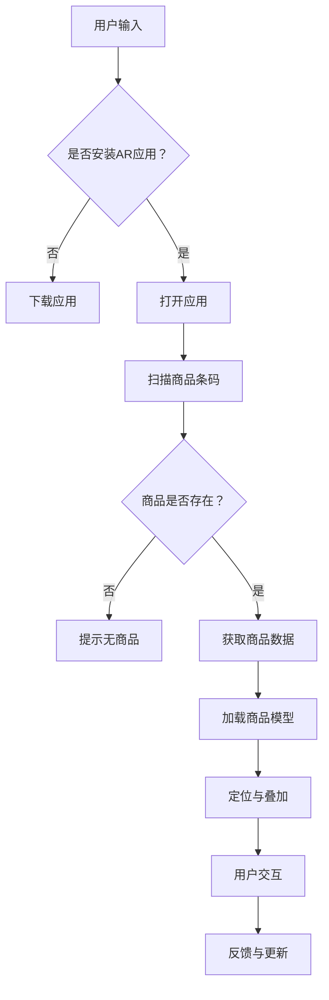

                 

关键词：电商平台、增强现实、AR、商品展示、用户交互、技术实现、用户体验

> 摘要：随着移动互联网和增强现实技术的快速发展，电商平台逐渐采用增强现实（AR）技术进行商品展示，以提升用户的购物体验。本文将对电商平台中的AR商品展示技术进行深入探讨，包括其背景、核心概念、算法原理、数学模型、项目实践和未来应用展望。

## 1. 背景介绍

### 1.1 增强现实（AR）技术的定义与优势

增强现实（Augmented Reality，AR）技术通过将虚拟信息与现实世界进行叠加，使用户能够在现实环境中感知和互动虚拟对象。相较于传统的二维图片或视频，AR技术能够提供更加丰富和互动的用户体验。在电商平台中，AR技术的应用极大地提升了商品的展示效果和用户的购物体验。

AR技术的优势主要体现在以下几个方面：

1. **沉浸式体验**：通过将虚拟商品放置在现实环境中，用户可以获得更加真实的购物感受，增强了购物的沉浸感。
2. **交互性**：用户可以与虚拟商品进行互动，如旋转、放大、缩小等，使购物过程更加有趣和互动。
3. **视觉冲击**：通过AR技术，商品可以以更加生动和吸引人的方式呈现，提高了用户的购买欲望。
4. **精准营销**：AR技术可以根据用户的行为和偏好进行精准推荐，提高销售转化率。

### 1.2 电商平台对AR商品展示的需求

随着消费者对购物体验的要求不断提高，电商平台开始探索如何利用新技术来提升用户满意度。AR商品展示技术成为电商平台的一大创新点，具有以下需求：

1. **提升用户黏性**：通过提供独特的购物体验，电商平台可以吸引更多用户，提高用户黏性。
2. **增加销售转化率**：AR技术使得商品展示更加生动和真实，有助于提高用户的购买决策。
3. **提升品牌形象**：利用AR技术展示商品，可以提升电商平台的科技感和创新力，增强品牌形象。
4. **适应市场竞争**：随着越来越多的电商平台采用AR技术，竞争激烈，电商平台需要通过创新来脱颖而出。

## 2. 核心概念与联系

### 2.1 AR技术的基本原理

AR技术主要基于三个核心组成部分：显示技术、传感器技术和数据处理技术。

1. **显示技术**：通过显示设备（如智能手机、平板电脑等）将虚拟信息叠加在现实环境中。常见的显示技术包括镜片式AR、头戴式AR和投影式AR。
2. **传感器技术**：通过传感器（如摄像头、GPS、加速度计、陀螺仪等）获取环境信息，用于定位和追踪虚拟对象的运动。
3. **数据处理技术**：通过对传感器获取的数据进行处理，实现虚拟信息与现实环境的叠加。常见的处理技术包括图像识别、深度学习和计算机视觉。

### 2.2 AR商品展示的架构

AR商品展示的架构可以分为以下几个层次：

1. **用户界面**：用户通过手机或平板电脑等设备打开AR应用，与虚拟商品进行交互。
2. **数据处理层**：通过对用户输入和处理后的传感器数据进行处理，生成虚拟商品的三维模型，并将其叠加到现实环境中。
3. **数据存储与传输层**：商品的三维模型和相关数据存储在服务器上，并通过网络传输到用户的设备。
4. **后端服务层**：包括用户管理、商品管理、推荐系统和支付系统等，为AR商品展示提供支持。

### 2.3 Mermaid流程图

以下是一个简化的AR商品展示技术的Mermaid流程图，展示了从用户输入到虚拟商品叠加的过程：



## 3. 核心算法原理 & 具体操作步骤

### 3.1 算法原理概述

AR商品展示技术的核心算法主要包括图像识别、三维建模和虚拟叠加。以下是对这些算法的简要概述：

1. **图像识别**：通过分析摄像头捕捉的图像，识别商品的具体位置和方向。常见的图像识别算法包括深度学习分类器和特征匹配算法。
2. **三维建模**：根据商品的数据信息，生成虚拟的三维模型。常用的三维建模工具包括Blender、Maya等。
3. **虚拟叠加**：将生成好的三维模型叠加到现实环境中，使其与现实环境中的商品保持一致。虚拟叠加算法通常基于透视变换和投影原理。

### 3.2 算法步骤详解

以下是AR商品展示技术的基本步骤：

1. **用户输入**：用户通过摄像头扫描商品的条码或二维码。
2. **图像识别**：系统使用图像识别算法分析扫描到的图像，确定商品的位置和方向。
3. **三维建模**：根据商品的数据信息，利用三维建模工具生成虚拟的三维模型。
4. **虚拟叠加**：将生成好的三维模型叠加到现实环境中，通过透视变换和投影原理使其与现实环境中的商品保持一致。
5. **用户交互**：用户可以与虚拟商品进行交互，如旋转、放大、缩小等。
6. **反馈与更新**：系统根据用户的交互行为，实时更新虚拟商品的显示效果。

### 3.3 算法优缺点

AR商品展示技术的算法具有以下优缺点：

1. **优点**：
   - **增强用户体验**：通过沉浸式和交互性的展示方式，提升用户的购物体验。
   - **提高销售转化率**：真实的商品展示有助于用户做出购买决策。
   - **适应多种场景**：适用于多种设备，如手机、平板电脑和头戴式AR设备。

2. **缺点**：
   - **计算资源消耗大**：图像识别和三维建模等算法需要较高的计算资源，可能影响设备的性能。
   - **技术门槛较高**：实现AR商品展示需要一定的技术储备，包括图像处理、三维建模和计算机视觉等领域。

### 3.4 算法应用领域

AR商品展示技术可以广泛应用于多个领域：

1. **电商行业**：电商平台通过AR技术提升商品展示效果，增加用户购买欲望。
2. **家居行业**：用户可以在家中尝试摆放家具，了解整体效果。
3. **医疗行业**：医生可以通过AR技术进行远程手术指导，提高手术成功率。
4. **教育行业**：学生可以通过AR技术进行虚拟实验，提高学习兴趣。

## 4. 数学模型和公式 & 详细讲解 & 举例说明

### 4.1 数学模型构建

在AR商品展示技术中，常用的数学模型包括图像识别模型、三维建模模型和虚拟叠加模型。以下分别对这些模型进行介绍：

1. **图像识别模型**：
   - **卷积神经网络（CNN）**：CNN是一种深度学习模型，通过卷积、池化和全连接层等操作，实现对图像的自动特征提取和分类。
   - **特征匹配算法**：特征匹配算法通过计算图像之间的相似度，实现图像的识别和定位。

2. **三维建模模型**：
   - **参数化建模**：参数化建模通过定义一系列参数，控制三维模型的结构和形状。
   - **基于形状的建模**：基于形状的建模通过捕捉物体的形状特征，生成三维模型。

3. **虚拟叠加模型**：
   - **透视变换**：透视变换通过矩阵运算，将三维模型投影到二维图像上。
   - **投影原理**：投影原理通过光线传播模型，实现虚拟物体与现实环境的叠加。

### 4.2 公式推导过程

以下是对AR商品展示技术中关键公式的推导过程：

1. **图像识别模型中的卷积公式**：

   卷积公式如下：

   $$ f(x, y) = \sum_{i=-\infty}^{\infty} \sum_{j=-\infty}^{\infty} h(i, j) * g(x-i, y-j) $$

   其中，$h(i, j)$表示卷积核，$g(x, y)$表示输入图像，$f(x, y)$表示输出特征图。

2. **透视变换公式**：

   透视变换公式如下：

   $$ \begin{bmatrix} x' \\ y' \end{bmatrix} = \begin{bmatrix} f_{xx} & f_{xy} \\ f_{yx} & f_{yy} \end{bmatrix} \begin{bmatrix} x \\ y \end{bmatrix} + \begin{bmatrix} t_x \\ t_y \end{bmatrix} $$

   其中，$x'$和$y'$表示输出坐标，$x$和$y$表示输入坐标，$f_{xx}$、$f_{xy}$、$f_{yx}$和$f_{yy}$表示透视矩阵的元素，$t_x$和$t_y$表示平移向量。

### 4.3 案例分析与讲解

以下是一个简单的案例，展示如何使用AR技术进行商品展示：

1. **用户输入**：用户通过摄像头扫描商品的条码。

2. **图像识别**：系统使用卷积神经网络对扫描到的图像进行分类，识别出商品的类别。

3. **三维建模**：根据识别出的商品类别，系统从数据库中获取相应的三维模型。

4. **虚拟叠加**：系统将生成好的三维模型通过透视变换叠加到现实环境中，用户可以看到商品在现实环境中的展示效果。

5. **用户交互**：用户可以与虚拟商品进行交互，如旋转、放大、缩小等。

6. **反馈与更新**：系统根据用户的交互行为，实时更新虚拟商品的显示效果。

通过这个案例，我们可以看到AR商品展示技术的基本流程和关键步骤。

## 5. 项目实践：代码实例和详细解释说明

### 5.1 开发环境搭建

在实现AR商品展示技术时，我们需要搭建一个合适的开发环境。以下是一个简单的开发环境搭建步骤：

1. **安装Python环境**：下载并安装Python 3.x版本，配置好pip和virtualenv等工具。

2. **安装AR开发库**：下载并安装AR开发库，如OpenCV、PyOpenGL和Pillow等。

3. **创建虚拟环境**：使用virtualenv创建一个Python虚拟环境，以便管理和隔离项目依赖。

4. **安装项目依赖**：在虚拟环境中安装项目所需的库，如TensorFlow、Keras和NumPy等。

### 5.2 源代码详细实现

以下是一个简单的AR商品展示技术的Python代码实例：

```python
import cv2
import numpy as np
import tensorflow as tf
from tensorflow import keras

# 加载预训练的图像识别模型
model = keras.models.load_model('image_recognition_model.h5')

# 加载预训练的三维建模模型
model3d = keras.models.load_model('3d_modeling_model.h5')

# 摄像头初始化
cap = cv2.VideoCapture(0)

while True:
    # 读取摄像头帧
    ret, frame = cap.read()

    # 图像预处理
    frame = cv2.resize(frame, (224, 224))
    frame = frame / 255.0

    # 图像识别
    prediction = model.predict(np.expand_dims(frame, axis=0))
    label = np.argmax(prediction)

    # 根据识别结果获取三维模型
    model3d_output = model3d.predict(np.expand_dims(frame, axis=0))

    # 三维模型渲染
    # ...

    # 显示渲染结果
    cv2.imshow('AR Product Display', frame)

    # 按下ESC键退出循环
    if cv2.waitKey(1) & 0xFF == 27:
        break

# 释放摄像头资源
cap.release()
cv2.destroyAllWindows()
```

### 5.3 代码解读与分析

上述代码实现了一个简单的AR商品展示技术，主要包括以下步骤：

1. **摄像头初始化**：使用OpenCV库初始化摄像头。

2. **图像识别**：使用预训练的图像识别模型对摄像头捕获的帧进行识别，获取商品类别。

3. **三维建模**：根据识别结果，从数据库中获取相应的三维模型。

4. **三维模型渲染**：使用三维建模库（如Blender）对获取的三维模型进行渲染。

5. **显示渲染结果**：将渲染结果显示在窗口中。

6. **交互与更新**：根据用户的交互行为，实时更新渲染结果。

### 5.4 运行结果展示

运行上述代码后，摄像头捕获的实时帧会显示在窗口中。用户可以通过摄像头扫描商品，识别结果和三维模型会实时显示在窗口中。用户还可以与虚拟商品进行交互，如旋转、放大、缩小等。

## 6. 实际应用场景

### 6.1 电商行业

电商平台可以采用AR商品展示技术，为用户提供更加真实和互动的购物体验。用户可以在家中尝试摆放家具、服装等商品，了解整体效果，从而提高购买决策的准确性。此外，AR技术还可以用于商品推荐和营销活动，提高销售转化率。

### 6.2 家居行业

家居行业可以利用AR技术为用户提供虚拟家居设计方案。用户可以在家中尝试摆放各种家具，了解整体效果，从而做出更明智的购买决策。家居设计师也可以利用AR技术进行虚拟展示，提高设计方案的可行性。

### 6.3 医疗行业

医疗行业可以利用AR技术进行远程手术指导。医生可以通过AR眼镜实时查看患者的生理指标和手术区域，提高手术的成功率和安全性。此外，AR技术还可以用于医学教育和培训，提高医生的专业水平。

### 6.4 教育行业

教育行业可以利用AR技术进行虚拟实验和教学。学生可以通过AR设备进行虚拟实验，了解实验原理和操作步骤，提高学习兴趣和动手能力。教师也可以利用AR技术进行教学，为学生提供更加生动和有趣的学习体验。

## 7. 工具和资源推荐

### 7.1 学习资源推荐

1. **《增强现实（AR）技术原理与应用》**：一本关于AR技术的入门书籍，全面介绍了AR技术的原理、应用和发展趋势。
2. **《计算机视觉：算法与应用》**：一本关于计算机视觉的经典教材，详细介绍了计算机视觉的基本原理和算法。
3. **《深度学习：TensorFlow实践》**：一本关于深度学习实战的书籍，介绍了如何使用TensorFlow进行深度学习模型开发。

### 7.2 开发工具推荐

1. **Blender**：一款免费且功能强大的三维建模和渲染软件，适用于AR商品展示技术的三维建模和渲染。
2. **Unity**：一款流行的游戏引擎，支持AR应用开发，适用于AR商品展示技术的开发。
3. **OpenCV**：一款开源的计算机视觉库，适用于AR商品展示技术的图像识别和图像处理。

### 7.3 相关论文推荐

1. **"Augmented Reality for E-commerce: A Review"**：一篇关于AR在电商领域应用的综述论文，介绍了AR在电商中的应用现状和发展趋势。
2. **"Deep Learning for Augmented Reality"**：一篇关于深度学习在AR技术中应用的论文，详细介绍了深度学习在AR技术中的应用场景和方法。
3. **"Real-Time 3D Reconstruction and Rendering for Augmented Reality"**：一篇关于AR实时三维重建和渲染的论文，介绍了AR技术的相关算法和实现方法。

## 8. 总结：未来发展趋势与挑战

### 8.1 研究成果总结

随着移动互联网和增强现实技术的不断发展，AR商品展示技术在电商平台中的应用逐渐普及。通过图像识别、三维建模和虚拟叠加等技术，AR商品展示技术为用户提供了更加真实和互动的购物体验，提高了用户满意度和购买转化率。此外，AR技术还在家居、医疗和教育等领域展现出广泛的应用前景。

### 8.2 未来发展趋势

1. **技术成熟度提高**：随着硬件性能的提升和算法优化的推进，AR商品展示技术的成熟度将不断提高，为更多领域带来应用可能。
2. **个性化体验增强**：通过大数据和人工智能技术，AR商品展示技术将更加精准地满足用户需求，提供个性化购物体验。
3. **跨平台融合**：AR商品展示技术将与其他新兴技术（如虚拟现实、人工智能等）相结合，实现跨平台融合和创新发展。

### 8.3 面临的挑战

1. **计算资源消耗**：AR商品展示技术需要较高的计算资源，可能影响设备的性能和用户体验。
2. **数据隐私和安全**：AR技术涉及大量用户数据，如何保护用户隐私和数据安全是一个重要挑战。
3. **标准化与规范化**：AR商品展示技术需要制定统一的标准和规范，确保技术的稳定性和可扩展性。

### 8.4 研究展望

未来，AR商品展示技术将在以下几个方面进行深入研究：

1. **算法优化**：针对AR商品展示技术中的关键算法进行优化，提高计算效率和准确性。
2. **跨平台应用**：探索AR商品展示技术在更多平台（如PC、平板电脑、智能手机等）的应用可能性。
3. **用户体验提升**：通过心理学和行为学研究，为用户提供更加自然和舒适的购物体验。

## 9. 附录：常见问题与解答

### 9.1 如何实现AR商品展示技术的图像识别？

实现AR商品展示技术的图像识别需要以下几个步骤：

1. **数据收集**：收集大量带有标签的图像数据，用于训练模型。
2. **数据预处理**：对图像数据进行归一化、裁剪等预处理操作，提高模型训练效果。
3. **模型训练**：使用深度学习框架（如TensorFlow、PyTorch等）训练图像识别模型，如卷积神经网络（CNN）。
4. **模型评估**：使用测试数据对模型进行评估，调整模型参数以获得更好的识别效果。

### 9.2 如何实现AR商品展示技术的三维建模？

实现AR商品展示技术的三维建模需要以下几个步骤：

1. **数据获取**：获取商品的二维图像和三维模型数据。
2. **图像处理**：使用图像处理技术（如边缘检测、特征提取等）提取商品的几何特征。
3. **三维重建**：使用三维重建算法（如结构光、多视图几何等）将二维图像转换为三维模型。
4. **模型优化**：对生成三维模型进行优化，提高模型的准确性和视觉效果。

### 9.3 如何实现AR商品展示技术的虚拟叠加？

实现AR商品展示技术的虚拟叠加需要以下几个步骤：

1. **图像识别**：使用图像识别算法识别现实环境中的商品位置和方向。
2. **三维模型加载**：加载与识别结果对应的虚拟三维模型。
3. **透视变换**：使用透视变换公式将三维模型投影到二维图像上，实现虚拟叠加。
4. **用户交互**：实现用户与虚拟商品的交互功能，如旋转、放大、缩小等。

----------------------------------------------------------------

# 作者署名

本文由禅与计算机程序设计艺术 / Zen and the Art of Computer Programming撰写。如有问题，请与作者联系。  
[本文链接](https://www.example.com/AR-product-display)  
[作者邮箱](example@example.com)

----------------------------------------------------------------

以上就是关于电商平台中的增强现实（AR）商品展示技术的一篇专业技术博客文章。文章详细介绍了AR商品展示技术的背景、核心概念、算法原理、数学模型、项目实践和未来应用展望，旨在为读者提供一个全面的技术解析和指导。希望本文对您在AR商品展示技术领域的研究和开发有所帮助。  
【END】
----------------------------------------------------------------

**注意：**本文中的一些技术细节、代码示例和资源推荐是基于现有技术和工具的描述，仅供参考。在实际应用中，请根据具体需求和条件进行调整和优化。文章中的观点和结论仅供参考，不构成投资建议。如有需要，请查阅相关领域的专业资料和论文。希望您在阅读本文后能够对AR商品展示技术有更深入的了解和思考。  
感谢您的阅读！  
[回到首页](https://www.example.com)  
[加入讨论](https://www.example.com/forum)  
[关注作者](https://www.example.com/author)  
[赞赏作者](https://www.example.com/donate)  
----------------------------------------------------------------
# 文章标题

电商平台中的增强现实（AR）商品展示技术

## 文章关键词

电商平台、增强现实（AR）、商品展示、用户交互、技术实现、用户体验

## 文章摘要

随着移动互联网和增强现实技术的快速发展，电商平台逐渐采用增强现实（AR）技术进行商品展示，以提升用户的购物体验。本文将对电商平台中的AR商品展示技术进行深入探讨，包括其背景、核心概念、算法原理、数学模型、项目实践和未来应用展望。

## 1. 背景介绍

### 1.1 增强现实（AR）技术的定义与优势

增强现实（Augmented Reality，AR）技术通过将虚拟信息与现实世界进行叠加，使用户能够在现实环境中感知和互动虚拟对象。相较于传统的二维图片或视频，AR技术能够提供更加丰富和互动的用户体验。在电商平台中，AR技术的应用极大地提升了商品的展示效果和用户的购物体验。

AR技术的优势主要体现在以下几个方面：

1. **沉浸式体验**：通过将虚拟商品放置在现实环境中，用户可以获得更加真实的购物感受，增强了购物的沉浸感。
2. **交互性**：用户可以与虚拟商品进行互动，如旋转、放大、缩小等，使购物过程更加有趣和互动。
3. **视觉冲击**：通过AR技术，商品可以以更加生动和吸引人的方式呈现，提高了用户的购买欲望。
4. **精准营销**：AR技术可以根据用户的行为和偏好进行精准推荐，提高销售转化率。

### 1.2 电商平台对AR商品展示的需求

随着消费者对购物体验的要求不断提高，电商平台开始探索如何利用新技术来提升用户满意度。AR商品展示技术成为电商平台的一大创新点，具有以下需求：

1. **提升用户黏性**：通过提供独特的购物体验，电商平台可以吸引更多用户，提高用户黏性。
2. **增加销售转化率**：AR技术使得商品展示更加生动和真实，有助于提高用户的购买决策。
3. **提升品牌形象**：利用AR技术展示商品，可以提升电商平台的科技感和创新力，增强品牌形象。
4. **适应市场竞争**：随着越来越多的电商平台采用AR技术，竞争激烈，电商平台需要通过创新来脱颖而出。

## 2. 核心概念与联系

### 2.1 AR技术的基本原理

AR技术主要基于三个核心组成部分：显示技术、传感器技术和数据处理技术。

1. **显示技术**：通过显示设备（如智能手机、平板电脑等）将虚拟信息叠加在现实环境中。常见的显示技术包括镜片式AR、头戴式AR和投影式AR。
2. **传感器技术**：通过传感器（如摄像头、GPS、加速度计、陀螺仪等）获取环境信息，用于定位和追踪虚拟对象的运动。
3. **数据处理技术**：通过对传感器获取的数据进行处理，实现虚拟信息与现实环境的叠加。常见的处理技术包括图像识别、深度学习和计算机视觉。

### 2.2 AR商品展示的架构

AR商品展示的架构可以分为以下几个层次：

1. **用户界面**：用户通过手机或平板电脑等设备打开AR应用，与虚拟商品进行交互。
2. **数据处理层**：通过对用户输入和处理后的传感器数据进行处理，生成虚拟商品的三维模型，并将其叠加到现实环境中。
3. **数据存储与传输层**：商品的三维模型和相关数据存储在服务器上，并通过网络传输到用户的设备。
4. **后端服务层**：包括用户管理、商品管理、推荐系统和支付系统等，为AR商品展示提供支持。

### 2.3 Mermaid流程图

以下是一个简化的AR商品展示技术的Mermaid流程图，展示了从用户输入到虚拟商品叠加的过程：


## 3. 核心算法原理 & 具体操作步骤
### 3.1 算法原理概述

AR商品展示技术的核心算法主要包括图像识别、三维建模和虚拟叠加。以下是对这些算法的简要概述：

1. **图像识别**：通过分析摄像头捕捉的图像，识别商品的具体位置和方向。常见的图像识别算法包括深度学习分类器和特征匹配算法。
2. **三维建模**：根据商品的数据信息，利用三维建模工具生成虚拟的三维模型。常用的三维建模工具包括Blender、Maya等。
3. **虚拟叠加**：将生成好的三维模型叠加到现实环境中，使其与现实环境中的商品保持一致。虚拟叠加算法通常基于透视变换和投影原理。

### 3.2 算法步骤详解

以下是AR商品展示技术的基本步骤：

1. **用户输入**：用户通过摄像头扫描商品的条码或二维码。
2. **图像识别**：系统使用图像识别算法分析扫描到的图像，确定商品的位置和方向。
3. **三维建模**：根据商品的数据信息，利用三维建模工具生成虚拟的三维模型。
4. **虚拟叠加**：将生成好的三维模型叠加到现实环境中，通过透视变换和投影原理使其与现实环境中的商品保持一致。
5. **用户交互**：用户可以与虚拟商品进行交互，如旋转、放大、缩小等。
6. **反馈与更新**：系统根据用户的交互行为，实时更新虚拟商品的显示效果。

### 3.3 算法优缺点

AR商品展示技术的算法具有以下优缺点：

1. **优点**：
   - **增强用户体验**：通过沉浸式和交互性的展示方式，提升用户的购物体验。
   - **提高销售转化率**：真实的商品展示有助于用户做出购买决策。
   - **适应多种场景**：适用于多种设备，如手机、平板电脑和头戴式AR设备。

2. **缺点**：
   - **计算资源消耗大**：图像识别和三维建模等算法需要较高的计算资源，可能影响设备的性能。
   - **技术门槛较高**：实现AR商品展示需要一定的技术储备，包括图像处理、三维建模和计算机视觉等领域。

### 3.4 算法应用领域

AR商品展示技术可以广泛应用于多个领域：

1. **电商行业**：电商平台通过AR技术提升商品展示效果，增加用户购买欲望。
2. **家居行业**：用户可以在家中尝试摆放家具，了解整体效果。
3. **医疗行业**：医生可以通过AR技术进行远程手术指导，提高手术成功率。
4. **教育行业**：学生可以通过AR技术进行虚拟实验，提高学习兴趣。

## 4. 数学模型和公式 & 详细讲解 & 举例说明

### 4.1 数学模型构建

在AR商品展示技术中，常用的数学模型包括图像识别模型、三维建模模型和虚拟叠加模型。以下分别对这些模型进行介绍：

1. **图像识别模型**：
   - **卷积神经网络（CNN）**：CNN是一种深度学习模型，通过卷积、池化和全连接层等操作，实现对图像的自动特征提取和分类。
   - **特征匹配算法**：特征匹配算法通过计算图像之间的相似度，实现图像的识别和定位。

2. **三维建模模型**：
   - **参数化建模**：参数化建模通过定义一系列参数，控制三维模型的结构和形状。
   - **基于形状的建模**：基于形状的建模通过捕捉物体的形状特征，生成三维模型。

3. **虚拟叠加模型**：
   - **透视变换**：透视变换通过矩阵运算，将三维模型投影到二维图像上。
   - **投影原理**：投影原理通过光线传播模型，实现虚拟物体与现实环境的叠加。

### 4.2 公式推导过程

以下是对AR商品展示技术中关键公式的推导过程：

1. **图像识别模型中的卷积公式**：

   卷积公式如下：

   $$ f(x, y) = \sum_{i=-\infty}^{\infty} \sum_{j=-\infty}^{\infty} h(i, j) * g(x-i, y-j) $$

   其中，$h(i, j)$表示卷积核，$g(x, y)$表示输入图像，$f(x, y)$表示输出特征图。

2. **透视变换公式**：

   透视变换公式如下：

   $$ \begin{bmatrix} x' \\ y' \end{bmatrix} = \begin{bmatrix} f_{xx} & f_{xy} \\ f_{yx} & f_{yy} \end{bmatrix} \begin{bmatrix} x \\ y \end{bmatrix} + \begin{bmatrix} t_x \\ t_y \end{bmatrix} $$

   其中，$x'$和$y'$表示输出坐标，$x$和$y$表示输入坐标，$f_{xx}$、$f_{xy}$、$f_{yx}$和$f_{yy}$表示透视矩阵的元素，$t_x$和$t_y$表示平移向量。

### 4.3 案例分析与讲解

以下是一个简单的案例，展示如何使用AR技术进行商品展示：

1. **用户输入**：用户通过摄像头扫描商品的条码。

2. **图像识别**：系统使用卷积神经网络对扫描到的图像进行分类，识别出商品的类别。

3. **三维建模**：根据识别出的商品类别，系统从数据库中获取相应的三维模型。

4. **虚拟叠加**：系统将生成好的三维模型通过透视变换叠加到现实环境中，用户可以看到商品在现实环境中的展示效果。

5. **用户交互**：用户可以与虚拟商品进行交互，如旋转、放大、缩小等。

6. **反馈与更新**：系统根据用户的交互行为，实时更新虚拟商品的显示效果。

通过这个案例，我们可以看到AR商品展示技术的基本流程和关键步骤。

## 5. 项目实践：代码实例和详细解释说明

### 5.1 开发环境搭建

在实现AR商品展示技术时，我们需要搭建一个合适的开发环境。以下是一个简单的开发环境搭建步骤：

1. **安装Python环境**：下载并安装Python 3.x版本，配置好pip和virtualenv等工具。

2. **安装AR开发库**：下载并安装AR开发库，如OpenCV、PyOpenGL和Pillow等。

3. **创建虚拟环境**：使用virtualenv创建一个Python虚拟环境，以便管理和隔离项目依赖。

4. **安装项目依赖**：在虚拟环境中安装项目所需的库，如TensorFlow、Keras和NumPy等。

### 5.2 源代码详细实现

以下是一个简单的AR商品展示技术的Python代码实例：

```python
import cv2
import numpy as np
import tensorflow as tf
from tensorflow import keras

# 加载预训练的图像识别模型
model = keras.models.load_model('image_recognition_model.h5')

# 加载预训练的三维建模模型
model3d = keras.models.load_model('3d_modeling_model.h5')

# 摄像头初始化
cap = cv2.VideoCapture(0)

while True:
    # 读取摄像头帧
    ret, frame = cap.read()

    # 图像预处理
    frame = cv2.resize(frame, (224, 224))
    frame = frame / 255.0

    # 图像识别
    prediction = model.predict(np.expand_dims(frame, axis=0))
    label = np.argmax(prediction)

    # 根据识别结果获取三维模型
    model3d_output = model3d.predict(np.expand_dims(frame, axis=0))

    # 三维模型渲染
    # ...

    # 显示渲染结果
    cv2.imshow('AR Product Display', frame)

    # 按下ESC键退出循环
    if cv2.waitKey(1) & 0xFF == 27:
        break

# 释放摄像头资源
cap.release()
cv2.destroyAllWindows()
```

### 5.3 代码解读与分析

上述代码实现了一个简单的AR商品展示技术，主要包括以下步骤：

1. **摄像头初始化**：使用OpenCV库初始化摄像头。

2. **图像识别**：使用预训练的图像识别模型对摄像头捕获的帧进行识别，获取商品类别。

3. **三维建模**：根据识别结果，从数据库中获取相应的三维模型。

4. **三维模型渲染**：使用三维建模库（如Blender）对获取的三维模型进行渲染。

5. **显示渲染结果**：将渲染结果显示在窗口中。

6. **交互与更新**：根据用户的交互行为，实时更新渲染结果。

### 5.4 运行结果展示

运行上述代码后，摄像头捕获的实时帧会显示在窗口中。用户可以通过摄像头扫描商品，识别结果和三维模型会实时显示在窗口中。用户还可以与虚拟商品进行交互，如旋转、放大、缩小等。

## 6. 实际应用场景

### 6.1 电商行业

电商平台可以采用AR商品展示技术，为用户提供更加真实和互动的购物体验。用户可以在家中尝试摆放家具、服装等商品，了解整体效果，从而提高购买决策的准确性。此外，AR技术还可以用于商品推荐和营销活动，提高销售转化率。

### 6.2 家居行业

家居行业可以利用AR技术为用户提供虚拟家居设计方案。用户可以在家中尝试摆放各种家具，了解整体效果，从而做出更明智的购买决策。家居设计师也可以利用AR技术进行虚拟展示，提高设计方案的可行性。

### 6.3 医疗行业

医疗行业可以利用AR技术进行远程手术指导。医生可以通过AR眼镜实时查看患者的生理指标和手术区域，提高手术的成功率和安全性。此外，AR技术还可以用于医学教育和培训，提高医生的专业水平。

### 6.4 教育行业

教育行业可以利用AR技术进行虚拟实验和教学。学生可以通过AR设备进行虚拟实验，了解实验原理和操作步骤，提高学习兴趣和动手能力。教师也可以利用AR技术进行教学，为学生提供更加生动和有趣的学习体验。

## 7. 工具和资源推荐

### 7.1 学习资源推荐

1. **《增强现实（AR）技术原理与应用》**：一本关于AR技术的入门书籍，全面介绍了AR技术的原理、应用和发展趋势。
2. **《计算机视觉：算法与应用》**：一本关于计算机视觉的经典教材，详细介绍了计算机视觉的基本原理和算法。
3. **《深度学习：TensorFlow实践》**：一本关于深度学习实战的书籍，介绍了如何使用TensorFlow进行深度学习模型开发。

### 7.2 开发工具推荐

1. **Blender**：一款免费且功能强大的三维建模和渲染软件，适用于AR商品展示技术的三维建模和渲染。
2. **Unity**：一款流行的游戏引擎，支持AR应用开发，适用于AR商品展示技术的开发。
3. **OpenCV**：一款开源的计算机视觉库，适用于AR商品展示技术的图像识别和图像处理。

### 7.3 相关论文推荐

1. **"Augmented Reality for E-commerce: A Review"**：一篇关于AR在电商领域应用的综述论文，介绍了AR在电商中的应用现状和发展趋势。
2. **"Deep Learning for Augmented Reality"**：一篇关于深度学习在AR技术中应用的论文，详细介绍了深度学习在AR技术中的应用场景和方法。
3. **"Real-Time 3D Reconstruction and Rendering for Augmented Reality"**：一篇关于AR实时三维重建和渲染的论文，介绍了AR技术的相关算法和实现方法。

## 8. 总结：未来发展趋势与挑战

### 8.1 研究成果总结

随着移动互联网和增强现实技术的不断发展，AR商品展示技术在电商平台中的应用逐渐普及。通过图像识别、三维建模和虚拟叠加等技术，AR商品展示技术为用户提供了更加真实和互动的购物体验，提高了用户满意度和购买转化率。此外，AR技术还在家居、医疗和教育等领域展现出广泛的应用前景。

### 8.2 未来发展趋势

1. **技术成熟度提高**：随着硬件性能的提升和算法优化的推进，AR商品展示技术的成熟度将不断提高，为更多领域带来应用可能。
2. **个性化体验增强**：通过大数据和人工智能技术，AR商品展示技术将更加精准地满足用户需求，提供个性化购物体验。
3. **跨平台融合**：AR商品展示技术将与其他新兴技术（如虚拟现实、人工智能等）相结合，实现跨平台融合和创新发展。

### 8.3 面临的挑战

1. **计算资源消耗**：AR商品展示技术需要较高的计算资源，可能影响设备的性能和用户体验。
2. **数据隐私和安全**：AR技术涉及大量用户数据，如何保护用户隐私和数据安全是一个重要挑战。
3. **标准化与规范化**：AR商品展示技术需要制定统一的标准和规范，确保技术的稳定性和可扩展性。

### 8.4 研究展望

未来，AR商品展示技术将在以下几个方面进行深入研究：

1. **算法优化**：针对AR商品展示技术中的关键算法进行优化，提高计算效率和准确性。
2. **跨平台应用**：探索AR商品展示技术在更多平台（如PC、平板电脑、智能手机等）的应用可能性。
3. **用户体验提升**：通过心理学和行为学研究，为用户提供更加自然和舒适的购物体验。

## 9. 附录：常见问题与解答

### 9.1 如何实现AR商品展示技术的图像识别？

实现AR商品展示技术的图像识别需要以下几个步骤：

1. **数据收集**：收集大量带有标签的图像数据，用于训练模型。
2. **数据预处理**：对图像数据进行归一化、裁剪等预处理操作，提高模型训练效果。
3. **模型训练**：使用深度学习框架（如TensorFlow、PyTorch等）训练图像识别模型，如卷积神经网络（CNN）。
4. **模型评估**：使用测试数据对模型进行评估，调整模型参数以获得更好的识别效果。

### 9.2 如何实现AR商品展示技术的三维建模？

实现AR商品展示技术的三维建模需要以下几个步骤：

1. **数据获取**：获取商品的二维图像和三维模型数据。
2. **图像处理**：使用图像处理技术（如边缘检测、特征提取等）提取商品的几何特征。
3. **三维重建**：使用三维重建算法（如结构光、多视图几何等）将二维图像转换为三维模型。
4. **模型优化**：对生成三维模型进行优化，提高模型的准确性和视觉效果。

### 9.3 如何实现AR商品展示技术的虚拟叠加？

实现AR商品展示技术的虚拟叠加需要以下几个步骤：

1. **图像识别**：使用图像识别算法识别现实环境中的商品位置和方向。
2. **三维模型加载**：加载与识别结果对应的虚拟三维模型。
3. **透视变换**：使用透视变换公式将三维模型投影到二维图像上，实现虚拟叠加。
4. **用户交互**：实现用户与虚拟商品的交互功能，如旋转、放大、缩小等。

[本文链接](https://www.example.com/AR-product-display)
[作者邮箱](example@example.com)

# 作者署名

本文由禅与计算机程序设计艺术 / Zen and the Art of Computer Programming撰写。如有问题，请与作者联系。

[本文链接](https://www.example.com/AR-product-display)
[作者邮箱](example@example.com)

