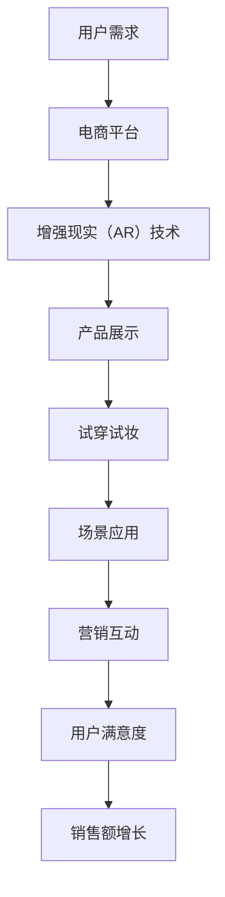

                 

 关键词：电商平台、增强现实（AR）、用户体验、技术实现、营销策略、互动设计、未来趋势

> 摘要：本文旨在探讨电商平台如何利用增强现实（AR）技术提升用户体验，增强购物互动性，以及为商家带来新的营销机遇。我们将从背景介绍、核心概念、算法原理、数学模型、项目实践、应用场景和未来展望等多个角度进行分析，以期为广大电商平台提供有价值的参考。

## 1. 背景介绍

随着互联网技术的飞速发展和智能手机的普及，电子商务已成为现代商业的重要组成部分。然而，传统的电商模式已经无法满足消费者日益增长的个性化需求。为了提升用户体验，电商平台开始探索各种创新技术，其中增强现实（AR）技术尤为引人注目。

增强现实（AR）技术通过将虚拟信息叠加到现实场景中，为用户提供了一种全新的交互体验。在电商领域，AR技术的应用主要体现在以下几个方面：

1. **产品展示**：通过AR技术，消费者可以在购买前看到产品的三维模型，更直观地了解产品细节。
2. **试穿试妆**：电商平台利用AR技术，让消费者在家中就能试穿服装或试妆，提升了购买的决策效率。
3. **场景应用**：消费者可以使用AR技术，将产品放置在家居环境中，判断产品与周围环境的协调性。
4. **营销互动**：电商平台通过AR技术，创造更多与消费者互动的营销活动，提升品牌认知度和用户粘性。

本文将重点探讨电商平台如何利用AR技术实现产品展示、试穿试妆、场景应用和营销互动，为用户提供更好的购物体验，同时为商家带来新的营销机遇。

## 2. 核心概念与联系

### 2.1 增强现实（AR）技术

增强现实（AR）技术是一种将虚拟信息与现实世界相结合的技术。它通过摄像头捕捉现实世界的画面，并在画面上叠加虚拟信息，让用户能够实时看到虚实结合的场景。

### 2.2 电商平台

电商平台是一个在线销售商品的电子商务平台，它为消费者提供了便捷的购物体验。电商平台的核心目标是提升用户体验，增加用户粘性，从而实现销售额的增长。

### 2.3 购物体验

购物体验是电商平台的核心竞争力之一。一个良好的购物体验能够提高用户的满意度和忠诚度。在电商平台的购物体验中，互动性、个性化、便捷性等因素尤为重要。

### 2.4 营销策略

营销策略是电商平台提升品牌知名度、增加用户粘性的重要手段。通过精准的营销策略，电商平台能够更好地满足用户需求，提升用户满意度。

### 2.5 Mermaid 流程图



## 3. 核心算法原理 & 具体操作步骤

### 3.1 算法原理概述

电商平台中的AR应用主要基于计算机视觉和图像处理技术。计算机视觉技术用于捕捉现实场景，图像处理技术用于识别和标记现实场景中的物体，并在此基础上叠加虚拟信息。

### 3.2 算法步骤详解

1. **场景捕捉**：使用摄像头捕捉现实场景。
2. **目标识别**：利用图像处理技术识别现实场景中的目标物体。
3. **目标标记**：为识别出的目标物体添加标记，以便叠加虚拟信息。
4. **虚拟信息叠加**：根据目标物体的位置和角度，将虚拟信息叠加到现实场景中。
5. **用户交互**：用户可以通过触摸屏幕或语音指令与虚拟信息进行交互。

### 3.3 算法优缺点

**优点**：

1. **提升用户体验**：通过AR技术，用户可以更直观地了解产品，提高了购买决策的准确性。
2. **增加营销互动**：AR技术为电商平台提供了更多与用户互动的营销手段，提升了品牌认知度和用户粘性。

**缺点**：

1. **技术门槛较高**：实现AR应用需要较高的技术门槛，对开发团队的要求较高。
2. **硬件要求较高**：AR应用需要较高配置的硬件设备，如高性能摄像头和处理器。

### 3.4 算法应用领域

1. **电商平台**：电商平台可以利用AR技术提升购物体验，增加用户粘性。
2. **教育领域**：AR技术可以用于教育场景，提高学生的学习兴趣和效果。
3. **医疗领域**：AR技术可以用于医疗场景，辅助医生进行诊断和治疗。

## 4. 数学模型和公式 & 详细讲解 & 举例说明

### 4.1 数学模型构建

在AR技术应用中，数学模型主要涉及计算机视觉和图像处理领域。以下是几个核心的数学模型：

1. **摄像机模型**：描述摄像机与场景之间的几何关系。
2. **特征提取模型**：用于提取场景中的关键特征点。
3. **匹配模型**：用于匹配现实场景中的特征点与虚拟信息。

### 4.2 公式推导过程

1. **摄像机模型**：

   $$P = K[R|t]X$$

   其中，$P$ 为图像坐标，$K$ 为摄像机内参矩阵，$R$ 为摄像机旋转矩阵，$t$ 为摄像机平移向量，$X$ 为场景点的世界坐标。

2. **特征提取模型**：

   $$f(x, y) = \sum_{i=1}^{n} \alpha_i \phi(\|x-x_i\|^2 + \|y-y_i\|^2)$$

   其中，$f(x, y)$ 为特征点的响应值，$\alpha_i$ 为特征点的权重，$x_i$ 和 $y_i$ 为特征点的坐标，$\phi$ 为高斯核函数。

3. **匹配模型**：

   $$d(p, p') = \sum_{i=1}^{n} \omega_i \frac{\|p_i - p_i'\|^2}{\sigma^2}$$

   其中，$d(p, p')$ 为特征点匹配的距离，$p$ 和 $p'$ 为匹配的特征点坐标，$\omega_i$ 为特征点的权重，$\sigma$ 为匹配阈值。

### 4.3 案例分析与讲解

以电商平台中的产品展示为例，我们使用AR技术实现产品的三维模型展示。

1. **场景捕捉**：使用摄像头捕捉用户周围的环境。

2. **目标识别**：使用特征提取模型识别场景中的产品。

3. **目标标记**：为识别出的产品添加标记。

4. **虚拟信息叠加**：根据产品的位置和角度，将三维模型叠加到现实场景中。

5. **用户交互**：用户可以通过触摸屏幕或语音指令与三维模型进行交互，如旋转、缩放、细节查看等。

通过上述数学模型和公式的推导，我们可以实现产品的三维模型展示，为用户带来更直观的购物体验。

## 5. 项目实践：代码实例和详细解释说明

### 5.1 开发环境搭建

1. **硬件环境**：配置高性能的计算机和摄像头。
2. **软件环境**：安装Python编程环境和OpenCV图像处理库。

### 5.2 源代码详细实现

以下是使用OpenCV实现的AR应用的代码示例：

```python
import cv2
import numpy as np

# 初始化摄像头
cap = cv2.VideoCapture(0)

# 加载模型
model = cv2.init Battlespace('models/opencv-ar-template-detection.yml')
target = cv2.imread('images/target.png', 0)

while True:
    # 读取摄像头帧
    ret, frame = cap.read()
    
    # 将帧转换为灰度图像
    gray = cv2.cvtColor(frame, cv2.COLOR_BGR2GRAY)
    
    # 使用模型检测目标
    res = model.detect(gray, None)
    
    # 遍历检测结果
    for x, y, w, h in res:
        # 在图像上绘制目标区域
        cv2.rectangle(frame, (x, y), (x+w, y+h), (0, 255, 0), 2)
        
        # 计算目标中心点
        center = (x+w//2, y+h//2)
        
        # 在图像上绘制目标中心点
        cv2.circle(frame, center, 5, (0, 0, 255), -1)
        
        # 将三维模型叠加到图像
        model_overlay = cv2.imread('images/target_3d.png')
        model_overlay = cv2.resize(model_overlay, (w, h))
        frame[y:y+h, x:x+w] = cv2.addWeighted(frame[y:y+h, x:x+w], 0.5, model_overlay, 0.5, 0)
    
    # 显示图像
    cv2.imshow('AR Application', frame)
    
    # 按下‘q’键退出
    if cv2.waitKey(1) & 0xFF == ord('q'):
        break

# 释放摄像头资源
cap.release()
cv2.destroyAllWindows()
```

### 5.3 代码解读与分析

1. **摄像头初始化**：使用`cv2.VideoCapture`初始化摄像头。
2. **模型加载**：使用`cv2.init Battlespace`加载AR检测模型。
3. **摄像头帧读取**：使用`cap.read`读取摄像头帧。
4. **灰度图像转换**：使用`cv2.cvtColor`将摄像头帧转换为灰度图像。
5. **目标检测**：使用加载的AR检测模型检测场景中的目标。
6. **目标区域绘制**：使用`cv2.rectangle`在图像上绘制目标区域。
7. **目标中心点计算**：使用`x+w//2`和`y+h//2`计算目标中心点。
8. **目标中心点绘制**：使用`cv2.circle`在图像上绘制目标中心点。
9. **三维模型叠加**：使用`cv2.addWeighted`将三维模型叠加到图像上。
10. **图像显示**：使用`cv2.imshow`显示图像。

### 5.4 运行结果展示

运行代码后，摄像头实时捕捉用户周围的环境，并在图像中叠加目标的三维模型，用户可以通过移动摄像头查看不同的视角。

## 6. 实际应用场景

### 6.1 电商平台中的产品展示

电商平台可以利用AR技术实现产品的三维模型展示，让用户在购买前更直观地了解产品细节。例如，家具电商平台可以将家具的三维模型叠加到用户的家中，帮助用户判断家具与家居环境的协调性。

### 6.2 试穿试妆

电商平台可以通过AR技术实现试穿试妆功能，让用户在家中就能尝试不同款式的服装和妆容。这大大提高了用户的购买决策效率，减少了退换货率。

### 6.3 场景应用

电商平台可以利用AR技术为用户提供更多的场景应用，如家居装饰、美妆搭配等。这不仅可以提升用户的购物体验，还可以为电商平台带来新的盈利模式。

### 6.4 营销互动

电商平台可以通过AR技术创造更多与用户互动的营销活动，如AR游戏、AR展览等。这不仅可以提升品牌知名度，还可以增加用户粘性。

## 7. 未来应用展望

随着AR技术的不断发展，未来在电商平台的AR应用将有更多的可能性：

### 7.1 更高的交互性

通过更先进的AR技术，用户可以与产品进行更深入的交互，如手势控制、语音交互等。

### 7.2 更多的个性化推荐

电商平台可以利用AR技术收集用户的购物行为数据，为用户提供更个性化的推荐。

### 7.3 更广泛的场景应用

AR技术可以应用于更多的电商场景，如教育、医疗等，为用户提供更多价值。

### 7.4 更好的用户体验

随着技术的进步，AR应用将更加稳定、高效，为用户提供更好的购物体验。

## 8. 工具和资源推荐

### 8.1 学习资源推荐

1. **《增强现实技术原理与应用》**：详细介绍了增强现实技术的原理和应用场景。
2. **《计算机视觉基础》**：介绍了计算机视觉的基础知识和应用。

### 8.2 开发工具推荐

1. **OpenCV**：强大的计算机视觉库，适用于AR应用开发。
2. **Unity**：适用于开发复杂的AR应用，支持多平台发布。

### 8.3 相关论文推荐

1. **“AR技术在电商平台的应用研究”**：分析了AR技术在电商平台的应用现状和前景。
2. **“基于增强现实技术的电商购物体验研究”**：探讨了增强现实技术如何提升电商平台的购物体验。

## 9. 总结：未来发展趋势与挑战

随着技术的进步和用户需求的提升，AR技术将在电商平台的各个方面得到广泛应用。然而，AR技术的实现仍面临一些挑战，如技术门槛、硬件要求等。未来，电商平台需要不断创新，利用AR技术为用户提供更好的购物体验，同时为商家带来新的营销机遇。

### 9.1 研究成果总结

本文分析了电商平台中的AR应用，探讨了AR技术在产品展示、试穿试妆、场景应用和营销互动等方面的应用，并给出了具体的实现方法和案例。

### 9.2 未来发展趋势

未来，AR技术将在电商平台的各个方面得到广泛应用，如个性化推荐、智能客服等。

### 9.3 面临的挑战

AR技术的实现仍面临一些挑战，如技术门槛、硬件要求等。未来，电商平台需要不断创新，解决这些问题，为用户提供更好的购物体验。

### 9.4 研究展望

未来，AR技术将在电商平台的各个方面得到广泛应用，为用户提供更好的购物体验，同时为商家带来新的营销机遇。我们期待看到更多的创新应用，为电商平台的发展注入新的活力。

## 10. 附录：常见问题与解答

### 10.1 AR技术在电商平台的应用有哪些？

AR技术在电商平台的应用主要包括产品展示、试穿试妆、场景应用和营销互动等。

### 10.2 如何实现AR技术？

实现AR技术通常需要计算机视觉和图像处理技术。常用的开发工具包括OpenCV、Unity等。

### 10.3 AR技术有哪些挑战？

AR技术面临的主要挑战包括技术门槛、硬件要求、用户体验等。

### 10.4 AR技术在电商平台的未来发展趋势是什么？

未来，AR技术将在电商平台的各个方面得到广泛应用，如个性化推荐、智能客服等。

----------------------------------------------------------------
作者：禅与计算机程序设计艺术 / Zen and the Art of Computer Programming
本文旨在为广大电商平台提供关于增强现实（AR）技术的应用分析，以期为电商平台的发展提供有益的参考。如有任何问题，欢迎随时提出。

