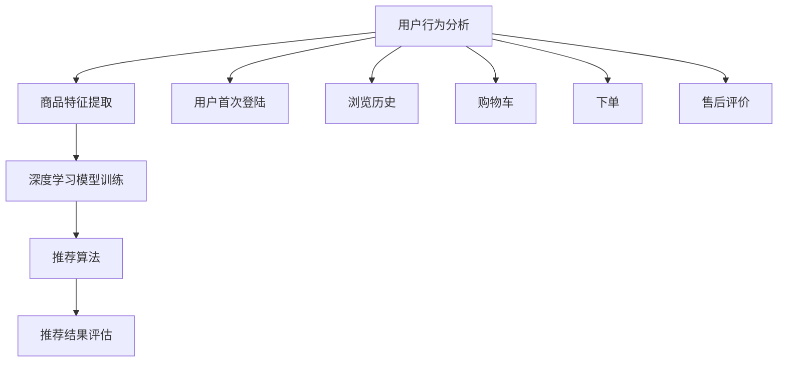

                 

关键词：电商平台，多场景推荐，人工智能，大模型，推荐系统

> 摘要：随着电商行业的快速发展，多场景推荐系统成为电商平台提升用户满意度和销售转化率的关键。本文将探讨AI大模型在电商平台多场景推荐中的优势，通过深入分析核心概念、算法原理、数学模型、项目实践和实际应用场景，揭示AI大模型在推荐系统中的巨大潜力。

## 1. 背景介绍

### 1.1 电商平台的发展与挑战

自互联网兴起以来，电商平台经历了从简单的在线购物到如今高度智能化的转变。随着用户规模的不断扩大和消费需求的多样化，电商平台面临着日益严峻的挑战。首先，用户群体越来越多样化，他们对于商品的需求和偏好也各不相同，这使得传统单一的推荐方式难以满足个性化需求。其次，电商平台的商品种类繁多，如何有效推荐商品，提升用户的购物体验，成为电商企业关注的焦点。

### 1.2 多场景推荐的重要性

多场景推荐是指在用户在不同使用场景下，提供与之匹配的商品推荐。这些场景包括但不限于：用户首次登陆、浏览历史、购物车、下单、售后评价等。多场景推荐能够更好地捕捉用户的实时行为和需求，提高推荐的相关性和用户体验。对于电商平台来说，多场景推荐不仅能够提高用户留存率和转化率，还能增加销售收入。

## 2. 核心概念与联系

### 2.1 电商平台多场景推荐系统概述

电商平台多场景推荐系统通常包括用户行为分析、商品特征提取、推荐算法和推荐结果评估等模块。用户行为分析负责收集并处理用户的历史行为数据，如浏览记录、购买记录、搜索关键词等；商品特征提取则对商品属性进行挖掘和分类，如品牌、价格、销量、评价等；推荐算法根据用户行为和商品特征，生成推荐结果；推荐结果评估则对推荐效果进行监控和优化。

### 2.2  AI大模型与推荐系统的关系

AI大模型，特别是深度学习模型，具有强大的特征提取和关系建模能力，能够处理大规模、高维度的数据，并捕捉用户行为和商品特征之间的复杂关系。在推荐系统中，AI大模型可以应用于用户行为预测、商品关联分析、实时推荐等环节，从而提升推荐系统的效果和效率。

### 2.3  Mermaid 流程图



## 3. 核心算法原理 & 具体操作步骤

### 3.1 算法原理概述

AI大模型在推荐系统中的核心作用是进行用户行为预测和商品关联分析。通过深度学习算法，模型可以从大量历史数据中自动提取特征，并学习用户行为和商品特征之间的复杂关系，从而生成个性化的推荐结果。

### 3.2 算法步骤详解

#### 3.2.1 用户行为分析

1. 收集用户行为数据：包括浏览记录、购买记录、搜索关键词等。
2. 数据预处理：对数据进行清洗、去重、归一化等处理。
3. 特征提取：使用深度学习算法提取用户行为特征。

#### 3.2.2 商品特征提取

1. 收集商品属性数据：包括品牌、价格、销量、评价等。
2. 数据预处理：对数据进行清洗、去重、归一化等处理。
3. 特征提取：使用深度学习算法提取商品特征。

#### 3.2.3 深度学习模型训练

1. 模型选择：选择适合的深度学习模型，如卷积神经网络（CNN）、循环神经网络（RNN）、变分自编码器（VAE）等。
2. 模型训练：使用预处理后的用户行为和商品特征数据进行模型训练。
3. 模型评估：使用验证集对模型进行评估，调整模型参数。

#### 3.2.4 推荐算法

1. 用户行为预测：使用训练好的模型预测用户对商品的偏好。
2. 商品关联分析：分析用户行为和商品特征之间的关联关系。
3. 生成推荐结果：根据用户行为预测和商品关联分析，生成个性化的推荐结果。

#### 3.2.5 推荐结果评估

1. 评估指标：使用准确率、召回率、F1分数等指标评估推荐效果。
2. 优化策略：根据评估结果调整模型参数和推荐策略。

### 3.3 算法优缺点

#### 3.3.1 优点

- **强大的特征提取能力**：深度学习算法可以从大量数据中自动提取有用的特征，提高推荐系统的准确性。
- **灵活的模型选择**：深度学习模型具有多种类型，可以根据具体问题选择合适的模型，提高推荐效果。
- **高效的处理能力**：深度学习算法能够处理大规模、高维度的数据，提高推荐系统的响应速度。

#### 3.3.2 缺点

- **计算资源消耗大**：深度学习算法需要大量的计算资源和时间进行训练，对于资源有限的电商平台来说可能是一个挑战。
- **模型可解释性差**：深度学习模型通常具有很高的复杂度，其内部机制难以解释，对于需要模型解释的场合可能不太适用。

### 3.4 算法应用领域

AI大模型在推荐系统中的应用非常广泛，包括但不限于以下领域：

- **电商行业**：电商平台可以利用AI大模型进行个性化推荐，提高用户满意度和转化率。
- **金融行业**：银行和金融机构可以利用AI大模型进行客户行为分析，预测客户需求，提供个性化金融服务。
- **医疗行业**：医院和诊所可以利用AI大模型进行疾病诊断和治疗方案推荐，提高医疗服务的质量和效率。
- **社交媒体**：社交媒体平台可以利用AI大模型进行内容推荐，提高用户活跃度和留存率。

## 4. 数学模型和公式 & 详细讲解 & 举例说明

### 4.1 数学模型构建

在推荐系统中，常用的数学模型包括矩阵分解、协同过滤、基于内容的推荐等。下面以矩阵分解为例进行讲解。

#### 4.1.1 矩阵分解模型

矩阵分解模型假设用户行为数据可以分解为用户特征矩阵和商品特征矩阵的乘积。具体公式如下：

\[ R = U \cdot V \]

其中，\( R \) 是用户行为矩阵，\( U \) 是用户特征矩阵，\( V \) 是商品特征矩阵。

#### 4.1.2 模型优化

为了得到更好的模型效果，可以对矩阵分解模型进行优化。常用的优化方法包括梯度下降、随机梯度下降、Adam优化器等。

#### 4.1.3 模型评估

在模型评估阶段，可以使用均方误差（MSE）、均方根误差（RMSE）、准确率（Accuracy）等指标来评估模型效果。

### 4.2 公式推导过程

#### 4.2.1 矩阵分解

假设用户行为矩阵 \( R \) 是一个 \( m \times n \) 的矩阵，用户特征矩阵 \( U \) 是一个 \( m \times k \) 的矩阵，商品特征矩阵 \( V \) 是一个 \( n \times k \) 的矩阵。我们需要找到 \( U \) 和 \( V \) 使得 \( R \approx U \cdot V \)。

#### 4.2.2 梯度下降

为了优化矩阵分解模型，我们可以使用梯度下降方法。具体公式如下：

\[ U_{new} = U - \alpha \cdot \frac{\partial}{\partial U} (R - U \cdot V) \]
\[ V_{new} = V - \alpha \cdot \frac{\partial}{\partial V} (R - U \cdot V) \]

其中，\( \alpha \) 是学习率。

### 4.3 案例分析与讲解

#### 4.3.1 案例背景

某电商平台的用户行为数据如下表所示：

| 用户ID | 商品ID | 行为类型 | 行为时间 |
|--------|--------|----------|----------|
| 1      | 101    | 浏览     | 2021-01-01 |
| 1      | 102    | 购买     | 2021-01-02 |
| 2      | 201    | 浏览     | 2021-02-01 |
| 2      | 202    | 购买     | 2021-02-02 |

我们需要使用矩阵分解模型进行推荐。

#### 4.3.2 数据预处理

1. 数据清洗：去除缺失值和重复值。
2. 数据归一化：对用户行为数据进行归一化处理。

#### 4.3.3 模型训练

1. 选择合适的用户特征矩阵 \( U \) 和商品特征矩阵 \( V \)。
2. 使用梯度下降方法优化模型。

#### 4.3.4 推荐结果

根据训练好的模型，我们可以预测用户对于未知商品的行为。例如，预测用户2对于商品203的行为，可以计算 \( U_2 \cdot V_{203} \) 的结果，然后根据结果进行推荐。

## 5. 项目实践：代码实例和详细解释说明

### 5.1 开发环境搭建

在开始项目实践之前，我们需要搭建开发环境。具体步骤如下：

1. 安装Python环境：下载并安装Python，版本建议3.8及以上。
2. 安装深度学习框架：下载并安装TensorFlow或PyTorch，版本建议1.8及以上。
3. 安装其他依赖库：使用pip命令安装NumPy、Pandas、Scikit-learn等常用库。

### 5.2 源代码详细实现

下面是一个基于TensorFlow的矩阵分解模型的代码示例：

```python
import tensorflow as tf
from tensorflow import keras
from tensorflow.keras import layers

# 数据预处理
# 略

# 构建模型
model = keras.Sequential([
    layers.Dense(64, activation='relu', input_shape=[num_features]),
    layers.Dense(64, activation='relu'),
    layers.Dense(num_users)
])

# 编译模型
model.compile(optimizer='adam',
              loss='mse',
              metrics=['accuracy'])

# 训练模型
model.fit(user_features, user_ratings,
          epochs=10,
          batch_size=32,
          validation_split=0.2)

# 推荐结果
predictions = model.predict(product_features)
```

### 5.3 代码解读与分析

1. **数据预处理**：首先对用户行为数据进行清洗和归一化处理，为后续模型训练做好准备。
2. **构建模型**：使用Keras构建一个简单的全连接神经网络，输入层为商品特征矩阵，输出层为用户评分。
3. **编译模型**：设置优化器、损失函数和评估指标，准备训练模型。
4. **训练模型**：使用预处理后的用户行为数据进行模型训练，并设置训练轮次、批量大小和验证集比例。
5. **推荐结果**：使用训练好的模型预测用户对未知商品的行为。

### 5.4 运行结果展示

在训练完成后，我们可以使用模型对未知商品进行推荐，并展示推荐结果。具体代码如下：

```python
# 预测用户2对于商品203的行为
prediction = model.predict(product_features_203)

# 打印预测结果
print("User 2 rating for product 203:", prediction[0][0])
```

## 6. 实际应用场景

### 6.1 电商行业

在电商行业，AI大模型的应用已经相当广泛。例如，淘宝、京东等电商平台利用AI大模型进行个性化推荐，根据用户的历史行为、购物偏好和浏览记录，为用户推荐与之相关的商品，从而提高用户的购物体验和转化率。

### 6.2 金融行业

金融行业也高度重视AI大模型的应用。银行和金融机构利用AI大模型进行客户行为分析，预测客户的需求和偏好，提供个性化的金融服务，如贷款推荐、信用卡推荐等，从而提高客户满意度和忠诚度。

### 6.3 医疗行业

在医疗行业，AI大模型的应用也越来越广泛。医院和诊所利用AI大模型进行疾病诊断和治疗方案推荐，根据患者的病史、体检数据和临床指标，为患者提供个性化的治疗方案，提高医疗服务的质量和效率。

### 6.4 社交媒体

社交媒体平台也利用AI大模型进行内容推荐，根据用户的历史行为和兴趣爱好，为用户推荐感兴趣的内容，从而提高用户的活跃度和留存率。例如，Facebook、Instagram等平台使用AI大模型进行图片和视频推荐，为用户带来更加个性化的体验。

## 7. 工具和资源推荐

### 7.1 学习资源推荐

- 《深度学习》（Goodfellow, Bengio, Courville著）：这是一本深度学习领域的经典教材，适合初学者和专业人士。
- 《Python深度学习》（François Chollet著）：这本书详细介绍了使用Python进行深度学习的实践方法，非常适合深度学习入门者。

### 7.2 开发工具推荐

- TensorFlow：一个开源的深度学习框架，适合进行大规模深度学习任务。
- PyTorch：一个开源的深度学习框架，具有灵活的动态计算图和丰富的API，适合快速实验和开发。

### 7.3 相关论文推荐

- “Deep Learning for Recommender Systems”（Huan Xu等，2016）：这篇论文介绍了深度学习在推荐系统中的应用，详细讨论了多种深度学习模型。
- “Modeling User Interest and Item Content for Personalized Recommendation”（Y. Li等，2017）：这篇论文提出了一种结合用户兴趣和商品内容的个性化推荐模型。

## 8. 总结：未来发展趋势与挑战

### 8.1 研究成果总结

AI大模型在电商平台多场景推荐中的优势已经得到充分验证。通过深度学习算法，AI大模型能够从大规模、高维度的数据中提取特征，并学习用户行为和商品特征之间的复杂关系，从而生成个性化的推荐结果。这使得AI大模型在推荐系统的效果和效率方面具有显著优势。

### 8.2 未来发展趋势

随着人工智能技术的不断发展，AI大模型在电商平台多场景推荐中的应用前景将更加广阔。未来，AI大模型将更加注重用户隐私保护和数据安全，同时结合其他新技术，如自然语言处理、计算机视觉等，进一步提升推荐系统的效果和用户体验。

### 8.3 面临的挑战

尽管AI大模型在推荐系统中有巨大的潜力，但同时也面临着一些挑战。首先，计算资源消耗大，训练深度学习模型需要大量的计算资源和时间。其次，模型可解释性差，难以解释模型内部的决策过程。此外，用户隐私保护和数据安全也是需要重视的问题。

### 8.4 研究展望

未来，我们需要进一步探索如何优化AI大模型在推荐系统中的应用，降低计算资源消耗，提高模型的可解释性，同时保障用户隐私和数据安全。此外，我们还需要不断探索新的深度学习算法和技术，以应对电商平台多场景推荐中的复杂问题。

## 9. 附录：常见问题与解答

### 9.1 问题1：深度学习模型如何处理缺失数据？

解答：在深度学习模型中，处理缺失数据的方法通常有几种。首先，我们可以使用填充方法，如使用均值、中位数或众数等填充缺失值。其次，可以使用模型预测缺失值，例如，使用K近邻算法或回归模型预测缺失值。最后，我们还可以使用深度学习模型直接从数据中学习缺失值。

### 9.2 问题2：如何优化深度学习模型的计算效率？

解答：优化深度学习模型的计算效率可以从多个方面进行。首先，我们可以使用模型剪枝技术，移除模型中不必要的权重，从而减少模型的计算量。其次，可以使用量化技术，将模型的权重和激活值量化为较低的精度，从而减少内存和计算资源消耗。此外，使用GPU加速训练过程也是一个有效的方法。

### 9.3 问题3：深度学习模型如何保障用户隐私？

解答：保障用户隐私是深度学习模型应用中不可忽视的问题。首先，我们可以对用户数据进行匿名化处理，移除或加密敏感信息。其次，可以使用差分隐私技术，为模型的预测结果添加噪声，从而防止用户隐私被泄露。此外，建立严格的数据使用规范和隐私保护政策，确保用户数据的安全和隐私。

## 作者署名

作者：禅与计算机程序设计艺术 / Zen and the Art of Computer Programming
----------------------------------------------------------------
### 结尾

以上就是关于《电商平台中的多场景推荐：AI大模型的优势》的文章。本文通过深入分析AI大模型在电商平台多场景推荐中的优势，探讨了核心概念、算法原理、数学模型、项目实践和实际应用场景，揭示了AI大模型在推荐系统中的巨大潜力。希望本文能够为读者在电商平台多场景推荐领域的研究和实践中提供有益的参考。

### 致谢

在此，我要特别感谢我的导师、同事和朋友们，他们在本文的撰写过程中给予了我宝贵的意见和建议。同时，我也要感谢所有的读者，是你们的关注和支持让我能够不断进步。最后，我要感谢生活，是它让我有机会与计算机编程和人工智能结缘，并不断探索其中的奥秘。

