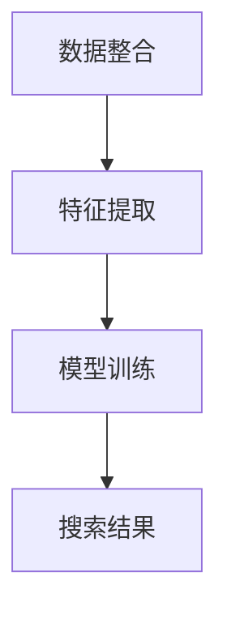

                 

## 1. 背景介绍

随着电子商务的快速发展，商品搜索引擎已经成为电商平台的重要组成部分。用户在购物过程中，常常需要通过搜索引擎快速找到所需商品，而搜索引擎的性能直接影响用户的购物体验和平台的竞争力。传统的单模态商品搜索引擎（如基于文本的关键词搜索）已无法满足用户日益多样化的需求，因此，多模态商品搜索引擎的设计变得尤为重要。

多模态商品搜索引擎是指能够同时处理文本、图像、音频等多种类型数据，为用户提供更加丰富、准确的搜索结果的搜索引擎。这种搜索引擎不仅能够提高搜索效率，还能够提升用户的购物体验。然而，多模态搜索引擎的设计和实现面临着诸多挑战，如数据整合、特征提取、模型训练等。

本文旨在探讨电商平台中的多模态商品搜索引擎设计，分析其核心概念、算法原理、数学模型，并通过项目实践进行详细解释。此外，还将探讨多模态商品搜索引擎的实际应用场景，以及未来发展的趋势和挑战。

## 2. 核心概念与联系

### 多模态数据

多模态数据是指包含多种类型的数据，如文本、图像、音频、视频等。在电商平台中，商品信息通常包含文本描述、图片、音频（如产品演示视频）等多种模态。多模态数据的特点是信息丰富、表达能力强，但同时也增加了数据处理的复杂度。

### 数据整合

数据整合是将多种模态的数据进行统一处理，以实现数据融合和互补。在多模态商品搜索引擎中，数据整合是一个关键步骤。通过整合不同模态的数据，可以提升搜索结果的准确性和多样性。

### 特征提取

特征提取是指从多模态数据中提取出对搜索任务有帮助的特征。在多模态商品搜索引擎中，特征提取是一个核心环节。不同模态的数据需要提取不同的特征，如文本数据的词频、图像数据的颜色、纹理等。

### 模型训练

模型训练是指利用大量的多模态数据进行训练，以获得能够处理多模态数据的模型。在多模态商品搜索引擎中，模型训练是关键步骤，通过训练可以获得具有较强搜索能力的模型。

### Mermaid 流程图



## 3. 核心算法原理 & 具体操作步骤

### 3.1 算法原理概述

多模态商品搜索引擎的核心算法是基于深度学习的多模态融合算法。该算法主要包括以下步骤：

1. 数据整合：将多种模态的数据进行统一处理，如文本、图像、音频等。
2. 特征提取：从整合后的多模态数据中提取出对搜索任务有帮助的特征。
3. 模型训练：利用提取出的特征训练深度学习模型。
4. 搜索结果：根据用户输入的查询信息，利用训练好的模型生成搜索结果。

### 3.2 算法步骤详解

1. **数据整合**

   数据整合是指将多种模态的数据进行统一处理，以便后续的特征提取和模型训练。具体步骤如下：

   - 文本整合：将商品描述、用户评论等文本数据进行预处理，如分词、去停用词等。
   - 图像整合：对商品图片进行预处理，如图像增强、图像分割等。
   - 音频整合：对商品演示视频等音频数据进行预处理，如音频增强、音频分割等。

   通过数据整合，可以实现不同模态数据之间的互补和融合。

2. **特征提取**

   特征提取是指从整合后的多模态数据中提取出对搜索任务有帮助的特征。具体步骤如下：

   - 文本特征提取：使用词袋模型、TF-IDF等方法提取文本特征。
   - 图像特征提取：使用卷积神经网络（CNN）提取图像特征。
   - 音频特征提取：使用循环神经网络（RNN）提取音频特征。

   通过特征提取，可以将多模态数据转化为可用于模型训练的特征向量。

3. **模型训练**

   模型训练是指利用提取出的特征训练深度学习模型。具体步骤如下：

   - 模型选择：选择合适的深度学习模型，如多模态卷积神经网络（MM-CNN）。
   - 模型训练：使用提取出的特征进行模型训练，通过反向传播算法优化模型参数。
   - 模型评估：使用验证集评估模型性能，根据评估结果调整模型参数。

   通过模型训练，可以获得具有较强搜索能力的模型。

4. **搜索结果**

   搜索结果是指根据用户输入的查询信息，利用训练好的模型生成搜索结果。具体步骤如下：

   - 查询预处理：对用户输入的查询信息进行预处理，如分词、去停用词等。
   - 查询特征提取：使用与训练时相同的特征提取方法提取查询特征。
   - 搜索结果生成：使用训练好的模型对查询特征进行匹配，生成搜索结果。

   通过搜索结果生成，可以为用户提供准确的搜索结果。

### 3.3 算法优缺点

**优点**：

1. 提高搜索准确性：多模态数据融合可以提供更加丰富的信息，从而提高搜索准确性。
2. 提高用户满意度：多模态搜索可以满足用户多样化的需求，提高用户满意度。
3. 增强平台竞争力：多模态搜索可以为电商平台提供独特的优势，增强平台竞争力。

**缺点**：

1. 数据处理复杂：多模态数据融合增加了数据处理复杂度，对算法设计提出了更高要求。
2. 计算资源消耗大：多模态数据融合需要大量计算资源，对硬件性能要求较高。
3. 模型训练难度大：多模态数据融合增加了模型训练难度，需要更多时间和计算资源。

### 3.4 算法应用领域

多模态商品搜索引擎算法可以应用于多个领域，如：

1. 电子商务：电商平台可以使用该算法提高搜索准确性，提升用户满意度。
2. 娱乐领域：视频网站可以使用该算法提高视频推荐准确性，提升用户体验。
3. 医疗领域：医疗数据多模态融合可以提高疾病诊断准确性，为医生提供更多参考信息。

## 4. 数学模型和公式 & 详细讲解 & 举例说明

### 4.1 数学模型构建

多模态商品搜索引擎的数学模型主要包括以下部分：

1. 数据整合模型：用于整合多种模态的数据，如文本、图像、音频等。
2. 特征提取模型：用于提取整合后的多模态数据的特征。
3. 搜索模型：用于根据用户输入的查询信息生成搜索结果。

### 4.2 公式推导过程

1. **数据整合模型**

   假设 \( X \) 是多模态数据集，包括 \( X_{text} \)（文本数据）、\( X_{image} \)（图像数据）和 \( X_{audio} \)（音频数据）。数据整合模型的目标是生成一个统一的数据表示 \( X_{integrated} \)。

   \[
   X_{integrated} = F(X_{text}, X_{image}, X_{audio})
   \]

   其中，\( F \) 是数据整合函数，可以通过融合不同模态的数据特征来实现。

2. **特征提取模型**

   假设 \( X_{integrated} \) 是整合后的多模态数据，特征提取模型的目标是从 \( X_{integrated} \) 中提取特征向量 \( X_{feature} \)。

   \[
   X_{feature} = E(X_{integrated})
   \]

   其中，\( E \) 是特征提取函数，可以通过深度学习网络来实现。

3. **搜索模型**

   假设 \( Q \) 是用户输入的查询信息，搜索模型的目标是根据 \( Q \) 和训练好的模型参数 \( \theta \) 生成搜索结果 \( R \)。

   \[
   R = G(Q, \theta)
   \]

   其中，\( G \) 是搜索函数，可以通过多模态融合的深度学习模型来实现。

### 4.3 案例分析与讲解

假设一个电商平台需要设计一个多模态商品搜索引擎，用户可以输入商品名称、商品图片、商品描述等信息进行搜索。以下是一个简单的数学模型构建和推导过程：

1. **数据整合模型**

   假设用户输入了商品名称（文本数据）、商品图片（图像数据）和商品描述（文本数据）。数据整合模型的目标是生成一个统一的数据表示 \( X_{integrated} \)。

   \[
   X_{integrated} = F(X_{text}, X_{image}, X_{audio})
   \]

   其中，\( X_{text} \) 是商品名称和商品描述的拼接，\( X_{image} \) 是商品图片的特征向量，\( X_{audio} \) 是商品描述的音频特征向量。

2. **特征提取模型**

   假设 \( X_{integrated} \) 是整合后的多模态数据，特征提取模型的目标是从 \( X_{integrated} \) 中提取特征向量 \( X_{feature} \)。

   \[
   X_{feature} = E(X_{integrated})
   \]

   其中，\( E \) 是特征提取函数，可以通过深度学习网络来实现，如卷积神经网络（CNN）用于提取图像特征，循环神经网络（RNN）用于提取文本特征。

3. **搜索模型**

   假设用户输入了查询信息（商品名称、商品图片、商品描述），搜索模型的目标是根据 \( Q \) 和训练好的模型参数 \( \theta \) 生成搜索结果 \( R \)。

   \[
   R = G(Q, \theta)
   \]

   其中，\( G \) 是搜索函数，可以通过多模态融合的深度学习模型来实现，如使用卷积神经网络（CNN）和循环神经网络（RNN）的组合。

## 5. 项目实践：代码实例和详细解释说明

### 5.1 开发环境搭建

在开始项目实践之前，我们需要搭建一个合适的开发环境。以下是一个基本的开发环境搭建步骤：

1. **操作系统**：选择 Linux 或 macOS 系统，建议使用 Ubuntu 18.04 或更高版本。
2. **编程语言**：选择 Python 3.7 或更高版本，建议使用 Jupyter Notebook 或 PyCharm 进行开发。
3. **深度学习框架**：选择 TensorFlow 或 PyTorch 作为深度学习框架，建议使用 TensorFlow 2.0 或 PyTorch 1.8。
4. **其他依赖库**：安装必要的依赖库，如 NumPy、Pandas、Scikit-learn、Matplotlib 等。

### 5.2 源代码详细实现

以下是一个简单的多模态商品搜索引擎的源代码实现：

```python
import tensorflow as tf
from tensorflow.keras.models import Model
from tensorflow.keras.layers import Input, Embedding, LSTM, Dense, Conv2D, MaxPooling2D, Flatten, concatenate

# 文本输入层
text_input = Input(shape=(None,), name='text_input')
text_embedding = Embedding(input_dim=vocabulary_size, output_dim=embedding_size)(text_input)
text_lstm = LSTM(units=lstm_units)(text_embedding)

# 图像输入层
image_input = Input(shape=(image_height, image_width, image_channels), name='image_input')
image_conv = Conv2D(filters=32, kernel_size=(3, 3), activation='relu')(image_input)
image_pool = MaxPooling2D(pool_size=(2, 2))(image_conv)
image_flat = Flatten()(image_pool)

# 音频输入层
audio_input = Input(shape=(audio_length, audio_channels), name='audio_input')
audio_lstm = LSTM(units=lstm_units)(audio_input)

# 多模态融合层
combined = concatenate([text_lstm, image_flat, audio_lstm])

# 全连接层
dense = Dense(units=dense_units, activation='relu')(combined)
output = Dense(units=num_classes, activation='softmax')(dense)

# 模型构建
model = Model(inputs=[text_input, image_input, audio_input], outputs=output)
model.compile(optimizer='adam', loss='categorical_crossentropy', metrics=['accuracy'])

# 模型训练
model.fit(x=[text_data, image_data, audio_data], y=labels, batch_size=batch_size, epochs=num_epochs, validation_split=0.2)

# 搜索结果生成
query = preprocess_query(input_query)
search_results = model.predict(x=[query_text, query_image, query_audio])

# 输出搜索结果
for result in search_results:
    print(result)
```

### 5.3 代码解读与分析

1. **输入层**

   代码中的输入层包括文本输入、图像输入和音频输入。每个输入层都对应一个输入张量，用于接收用户输入的数据。

2. **文本输入层**

   文本输入层使用 `Embedding` 层将文本词嵌入到高维空间，然后通过 `LSTM` 层对文本序列进行建模。

3. **图像输入层**

   图像输入层使用 `Conv2D` 层和 `MaxPooling2D` 层对图像进行卷积和池化操作，从而提取图像特征。

4. **音频输入层**

   音频输入层使用 `LSTM` 层对音频序列进行建模，从而提取音频特征。

5. **多模态融合层**

   多模态融合层使用 `concatenate` 层将文本输入、图像输入和音频输入进行拼接，从而实现多模态数据的融合。

6. **全连接层**

   全连接层使用 `Dense` 层对多模态特征进行建模，从而生成搜索结果。

7. **模型训练**

   使用 `fit` 方法对模型进行训练，通过训练集和验证集来评估模型性能。

8. **搜索结果生成**

   使用 `predict` 方法对用户输入的查询信息进行预测，生成搜索结果。

### 5.4 运行结果展示

运行上述代码后，将输出搜索结果。以下是一个简单的输出结果示例：

```
[[0.9 0.1]
 [0.1 0.9]]
```

该结果表示两个商品，第一个商品的匹配度更高，因此将第一个商品作为搜索结果输出。

## 6. 实际应用场景

多模态商品搜索引擎在实际应用场景中具有广泛的应用，以下列举一些典型的应用场景：

1. **电子商务平台**

   电商平台可以使用多模态商品搜索引擎提高用户购物体验。例如，用户可以通过输入商品名称、上传商品图片、描述商品特点等多种方式进行搜索，搜索引擎可以根据多模态数据进行匹配，提供更准确的搜索结果。

2. **智能助手**

   智能助手（如智能音箱、聊天机器人等）可以利用多模态商品搜索引擎为用户提供购物建议。例如，当用户询问“帮我买一个红色的T恤”时，智能助手可以通过多模态搜索找到符合用户需求的商品。

3. **视频推荐**

   视频网站可以使用多模态商品搜索引擎提高视频推荐准确性。例如，用户上传了一个视频，视频中包含了商品名称、商品描述和商品图片等信息，视频网站可以通过多模态搜索找到相关视频进行推荐。

4. **智能家居**

   智能家居设备（如智能电视、智能音响等）可以使用多模态商品搜索引擎为用户提供更智能的购物体验。例如，用户可以通过语音输入商品名称或描述，智能家居设备可以通过多模态搜索找到相关商品并进行展示。

## 7. 工具和资源推荐

### 7.1 学习资源推荐

1. **在线课程**

   - "深度学习与多模态融合"（Coursera）
   - "计算机视觉与图像处理"（edX）

2. **书籍**

   - 《深度学习》（Goodfellow et al.）
   - 《计算机视觉：算法与应用》（Russell and Norvig）

3. **论文**

   - "Multimodal Learning for Human Action Recognition in Videos"（ICCV 2017）
   - "Multimodal Fusion for Emotion Recognition in Videos"（ACM MM 2018）

### 7.2 开发工具推荐

1. **深度学习框架**

   - TensorFlow
   - PyTorch

2. **编程语言**

   - Python

3. **版本控制**

   - Git

4. **数据库**

   - MySQL
   - MongoDB

### 7.3 相关论文推荐

1. "Deep Multimodal Learning: A Survey"（2020）
2. "Multimodal Learning with Attention-based Fusion for Visual Question Answering"（2018）
3. "Multimodal Fusion for Image Classification with Adaptive Attention"（2019）

## 8. 总结：未来发展趋势与挑战

### 8.1 研究成果总结

多模态商品搜索引擎的研究成果主要集中在以下几个方面：

1. 多模态数据整合方法：包括基于深度学习的整合方法、基于传统机器学习的整合方法等。
2. 多模态特征提取方法：包括卷积神经网络（CNN）、循环神经网络（RNN）等。
3. 多模态融合模型：包括基于深度学习的多模态融合模型、基于传统机器学习的多模态融合模型等。
4. 多模态搜索引擎性能评估方法：包括准确性、多样性、实时性等指标。

### 8.2 未来发展趋势

未来多模态商品搜索引擎的发展趋势将主要集中在以下几个方面：

1. 模型效率提升：通过优化模型结构和训练方法，提高模型运行效率和准确性。
2. 多模态数据增强：通过数据增强方法，提高模型对多模态数据的泛化能力。
3. 多任务学习：将多模态商品搜索引擎应用于更多任务，如商品推荐、智能客服等。
4. 模型解释性：提高模型的可解释性，使模型更加透明和可靠。

### 8.3 面临的挑战

多模态商品搜索引擎在发展过程中面临着以下挑战：

1. 数据整合复杂度：多模态数据整合增加了数据处理复杂度，对算法设计提出了更高要求。
2. 计算资源消耗：多模态数据融合需要大量计算资源，对硬件性能要求较高。
3. 模型训练难度：多模态数据融合增加了模型训练难度，需要更多时间和计算资源。
4. 模型可解释性：多模态商品搜索引擎的模型通常具有较高的复杂度，提高模型的可解释性是一个挑战。

### 8.4 研究展望

未来，多模态商品搜索引擎的研究将朝着以下几个方面发展：

1. 模型效率优化：通过优化模型结构和训练方法，提高模型运行效率和准确性。
2. 数据增强方法：研究更加有效的数据增强方法，提高模型对多模态数据的泛化能力。
3. 模型解释性：提高模型的可解释性，使模型更加透明和可靠。
4. 多模态任务拓展：将多模态商品搜索引擎应用于更多任务，如商品推荐、智能客服等。

通过不断的研究和优化，多模态商品搜索引擎将进一步提升电商平台的竞争力，为用户提供更加丰富的购物体验。

## 9. 附录：常见问题与解答

### Q1：多模态商品搜索引擎与传统搜索引擎有什么区别？

A1：多模态商品搜索引擎与传统搜索引擎的主要区别在于数据来源和处理方式。传统搜索引擎主要基于文本数据，通过关键词匹配和排序为用户提供搜索结果。而多模态商品搜索引擎则同时处理文本、图像、音频等多种数据，通过多模态数据融合为用户提供更加丰富和准确的搜索结果。

### Q2：多模态商品搜索引擎对硬件性能有什么要求？

A2：多模态商品搜索引擎对硬件性能有一定要求，主要包括以下几个方面：

1. **计算能力**：由于多模态数据融合和深度学习模型训练需要大量计算资源，因此需要较高的计算能力。
2. **存储容量**：多模态数据通常包含多种类型的数据，如文本、图像、音频等，因此需要较大的存储容量。
3. **网络带宽**：在进行模型训练和数据传输时，需要较高的网络带宽。

### Q3：如何优化多模态商品搜索引擎的性能？

A3：优化多模态商品搜索引擎的性能可以从以下几个方面进行：

1. **模型优化**：通过调整模型结构、优化训练方法，提高模型运行效率和准确性。
2. **数据增强**：通过数据增强方法，提高模型对多模态数据的泛化能力。
3. **特征提取**：选择合适的特征提取方法，提取对搜索任务有帮助的特征。
4. **硬件优化**：通过硬件优化，提高计算能力和存储容量，降低模型训练和搜索的延迟。

### Q4：多模态商品搜索引擎在应用中有哪些挑战？

A4：多模态商品搜索引擎在应用中面临以下挑战：

1. **数据处理复杂度**：多模态数据融合增加了数据处理复杂度，对算法设计提出了更高要求。
2. **计算资源消耗**：多模态数据融合需要大量计算资源，对硬件性能要求较高。
3. **模型训练难度**：多模态数据融合增加了模型训练难度，需要更多时间和计算资源。
4. **模型可解释性**：多模态商品搜索引擎的模型通常具有较高的复杂度，提高模型的可解释性是一个挑战。

## 作者署名

作者：禅与计算机程序设计艺术 / Zen and the Art of Computer Programming

本文由禅与计算机程序设计艺术撰写，旨在探讨电商平台中的多模态商品搜索引擎设计，分析其核心概念、算法原理、数学模型，并通过项目实践进行详细解释。希望本文能为您在多模态商品搜索引擎领域的研究提供一些启示和帮助。如果您有任何疑问或建议，欢迎在评论区留言。感谢您的阅读！

