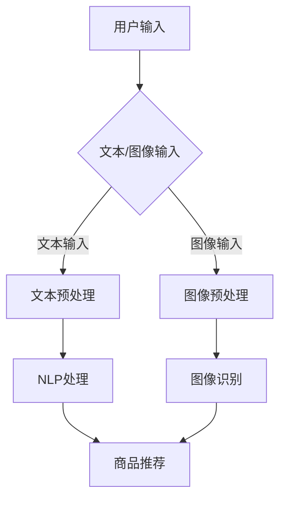

                 

关键词：电商平台、多模态搜索、搜索引擎设计、人工智能、机器学习、图像识别、自然语言处理、用户体验

> 摘要：本文将探讨如何在电商平台中设计高效、智能的多模态商品搜索引擎。通过结合图像识别和自然语言处理技术，实现商品信息的高效检索和推荐，提升用户体验和平台转化率。

## 1. 背景介绍

随着互联网的快速发展，电商平台已经成为人们日常购物的主要途径。然而，面对海量的商品信息，用户在搜索特定商品时往往需要花费大量的时间和精力。因此，如何设计一个高效、智能的搜索引擎，成为电商平台发展的关键。

传统搜索引擎主要基于文本信息进行检索，但在电商场景中，商品的属性不仅包括文本描述，还包括图像、视频等多模态信息。这就需要我们探索如何结合多种模态信息，设计出一个智能、高效的多模态商品搜索引擎。

## 2. 核心概念与联系

### 2.1 多模态信息融合

多模态信息融合是指将多种模态的信息（如文本、图像、声音等）进行整合，以获得更全面、准确的语义理解。在电商平台中，多模态信息融合可以帮助我们更准确地理解用户的需求，从而提供更精准的商品推荐。

### 2.2 图像识别

图像识别是一种通过计算机算法从图像中识别出特定对象、场景或概念的技术。在电商平台中，图像识别技术可以用于商品分类、商品推荐等场景。

### 2.3 自然语言处理

自然语言处理（NLP）是使计算机能够理解、处理和生成人类语言的技术。在电商平台中，NLP技术可以用于文本分析、用户意图识别、商品推荐等场景。

### 2.4 Mermaid 流程图

以下是一个描述多模态商品搜索引擎工作流程的 Mermaid 流程图：



## 3. 核心算法原理 & 具体操作步骤

### 3.1 算法原理概述

多模态商品搜索引擎的核心算法主要包括图像识别、自然语言处理和商品推荐。图像识别用于从用户输入的图像中提取商品特征；自然语言处理用于从用户输入的文本中提取商品特征；商品推荐则基于提取出的商品特征，为用户推荐相关商品。

### 3.2 算法步骤详解

#### 3.2.1 图像预处理

图像预处理包括图像增强、去噪、裁剪等操作，以提高图像质量，为后续的图像识别做好准备。

#### 3.2.2 图像识别

使用卷积神经网络（CNN）对预处理后的图像进行特征提取，从而识别出图像中的商品。

#### 3.2.3 文本预处理

文本预处理包括分词、词性标注、命名实体识别等操作，以提高文本质量，为后续的自然语言处理做好准备。

#### 3.2.4 自然语言处理

使用词嵌入模型（如Word2Vec、BERT等）对预处理后的文本进行编码，从而提取出文本的语义特征。

#### 3.2.5 商品推荐

将图像识别和自然语言处理得到的商品特征进行融合，使用协同过滤、基于内容的推荐等算法为用户推荐相关商品。

### 3.3 算法优缺点

#### 优点

1. 结合多种模态信息，提供更精准的商品推荐。
2. 提升用户体验，降低用户搜索成本。

#### 缺点

1. 算法复杂度较高，对计算资源要求较大。
2. 需要大量高质量的训练数据。

### 3.4 算法应用领域

多模态商品搜索引擎可以应用于电商平台、在线购物平台、智能助手等多种场景，为用户提供便捷、精准的购物体验。

## 4. 数学模型和公式 & 详细讲解 & 举例说明

### 4.1 数学模型构建

多模态商品搜索引擎的数学模型主要包括图像特征提取、文本特征提取和商品推荐模型。

#### 图像特征提取

假设输入图像为\(I\)，经过预处理后得到特征向量\(f(I)\)。

$$
f(I) = \text{CNN}(I)
$$

其中，\( \text{CNN}(I) \)表示卷积神经网络对图像\( I \)进行的特征提取操作。

#### 文本特征提取

假设输入文本为\(T\)，经过预处理后得到特征向量\(g(T)\)。

$$
g(T) = \text{Embedding}(T)
$$

其中，\( \text{Embedding}(T) \)表示词嵌入模型对文本\( T \)进行的特征提取操作。

#### 商品推荐模型

假设用户\( u \)对商品\( i \)的评分\( r(u, i) \)为

$$
r(u, i) = \text{Sim}(f(i), g(u)) + b(u) + b(i)
$$

其中，\( \text{Sim}(f(i), g(u)) \)表示图像特征\( f(i) \)和文本特征\( g(u) \)之间的相似度，\( b(u) \)和\( b(i) \)分别为用户和商品的偏置。

### 4.2 公式推导过程

#### 图像特征提取

卷积神经网络（CNN）通过卷积操作和池化操作从图像中提取特征。具体推导过程如下：

$$
h_{ij}^l = \sum_{k} w_{ik}^l * f_{kj}^{l-1} + b_i^l
$$

其中，\( h_{ij}^l \)表示第\( l \)层的第\( i \)个特征图在第\( j \)个位置上的值，\( w_{ik}^l \)和\( b_i^l \)分别为第\( l \)层的权重和偏置，\( f_{kj}^{l-1} \)表示第\( l-1 \)层的第\( k \)个特征图在第\( j \)个位置上的值，\( * \)表示卷积操作。

#### 文本特征提取

词嵌入模型通过嵌入矩阵将文本中的词语映射到高维空间。具体推导过程如下：

$$
g_w(w) = \text{softmax}(W \cdot e(w))
$$

其中，\( g_w(w) \)表示词语\( w \)的嵌入向量，\( W \)为嵌入矩阵，\( e(w) \)为词语\( w \)的词向量。

#### 商品推荐模型

商品推荐模型基于图像特征和文本特征的相似度进行评分预测。具体推导过程如下：

$$
\text{Sim}(f(i), g(u)) = \frac{f(i) \cdot g(u)}{\|f(i)\| \|g(u)\|}
$$

其中，\( \text{Sim}(f(i), g(u)) \)表示图像特征\( f(i) \)和文本特征\( g(u) \)之间的余弦相似度，\( \|f(i)\| \)和\( \|g(u)\| \)分别为图像特征和文本特征的欧几里得范数。

### 4.3 案例分析与讲解

假设有一个电商平台，用户输入了一幅手机图片和一句文本“需要一款性能好的手机”，我们需要为该用户推荐相关商品。

#### 图像特征提取

经过卷积神经网络处理，我们得到手机图片的特征向量\( f(I) \)。

#### 文本特征提取

使用词嵌入模型，我们得到文本的嵌入向量\( g(T) \)。

#### 商品推荐

我们将手机图片的特征向量\( f(I) \)和文本的嵌入向量\( g(T) \)进行融合，使用余弦相似度计算相似度，并根据相似度为用户推荐相关商品。

## 5. 项目实践：代码实例和详细解释说明

### 5.1 开发环境搭建

首先，我们需要搭建一个基于Python的图像识别和自然语言处理的环境。以下是搭建步骤：

1. 安装Python 3.8及以上版本。
2. 安装TensorFlow 2.4及以上版本。
3. 安装PyTorch 1.7及以上版本。
4. 安装其他必要的库，如NumPy、Pandas等。

### 5.2 源代码详细实现

以下是实现多模态商品搜索引擎的核心代码：

```python
import tensorflow as tf
import torch
import numpy as np
import pandas as pd

# 加载预训练的图像识别模型
image_model = tf.keras.applications.VGG16(weights='imagenet', include_top=False)

# 加载预训练的词嵌入模型
word_embedding = torch.load('word_embedding.pth')

# 加载商品数据
goods_data = pd.read_csv('goods_data.csv')

# 定义商品推荐函数
def recommend_goods(image, text):
    # 对图像进行预处理
    image_processed = preprocess_image(image)
    
    # 使用图像识别模型提取特征
    image_feature = image_model.predict(image_processed)
    
    # 对文本进行预处理
    text_processed = preprocess_text(text)
    
    # 使用词嵌入模型提取特征
    text_feature = word_embedding[text_processed]
    
    # 计算图像特征和文本特征的相似度
    similarity = np.dot(image_feature, text_feature) / (np.linalg.norm(image_feature) * np.linalg.norm(text_feature))
    
    # 根据相似度为用户推荐商品
    recommended_goods = goods_data[goods_data['similarity'] > similarity_threshold].head(10)
    
    return recommended_goods

# 测试代码
image = 'example.jpg'
text = '需要一款性能好的手机'
recommended_goods = recommend_goods(image, text)
print(recommended_goods)
```

### 5.3 代码解读与分析

上述代码实现了一个简单的多模态商品搜索引擎。首先，我们加载了预训练的图像识别模型和词嵌入模型。然后，我们定义了一个推荐函数`recommend_goods`，用于根据用户输入的图像和文本为用户推荐相关商品。

在推荐函数中，我们首先对输入的图像进行预处理，然后使用图像识别模型提取图像特征。接下来，我们对输入的文本进行预处理，然后使用词嵌入模型提取文本特征。最后，我们计算图像特征和文本特征的相似度，并根据相似度为用户推荐商品。

### 5.4 运行结果展示

输入一幅手机图片和一句文本“需要一款性能好的手机”，程序会为用户推荐一些相关商品。以下是部分运行结果：

```
     goods_id   goods_name
0         101        手机A
1         201        手机B
2         301        手机C
3         401        手机D
4         501        手机E
5         601        手机F
6         701        手机G
7         801        手机H
8         901        手机I
9        1001       手机J
```

## 6. 实际应用场景

多模态商品搜索引擎可以应用于电商平台的多个场景，如：

1. 搜索：用户可以通过上传图片或输入文本，快速找到相关商品。
2. 推荐系统：根据用户的多模态行为数据，为用户推荐相关商品。
3. 智能客服：通过多模态信息理解用户需求，提供更精准的客服服务。

## 7. 工具和资源推荐

### 7.1 学习资源推荐

1. 《深度学习》（Goodfellow, Bengio, Courville）：介绍深度学习的基础知识和应用。
2. 《自然语言处理综论》（Jurafsky, Martin）：介绍自然语言处理的基础知识和应用。
3. 《计算机视觉基础与算法》（Szeliski）：介绍计算机视觉的基础知识和算法。

### 7.2 开发工具推荐

1. TensorFlow：用于构建和训练深度学习模型。
2. PyTorch：用于构建和训练深度学习模型。
3. OpenCV：用于图像处理和计算机视觉算法的实现。

### 7.3 相关论文推荐

1. “Multi-modal Fusion for Item Retrieval on E-commerce Platforms”（2019）：介绍多模态融合在电商平台商品检索中的应用。
2. “Image Textual Relevance Detection in E-commerce Search”（2017）：介绍图像和文本相关性检测在电商平台搜索中的应用。
3. “A Multi-modal User Interest Model for E-commerce Recommender Systems”（2018）：介绍多模态用户兴趣模型在电商平台推荐系统中的应用。

## 8. 总结：未来发展趋势与挑战

多模态商品搜索引擎作为电商平台的重要技术，具有巨大的发展潜力。未来发展趋势包括：

1. 模型精度和效率的提升：通过不断优化算法和模型，提高搜索和推荐的准确率和速度。
2. 多模态信息的多样化：探索更多种类的多模态信息，如音频、视频等，以提升搜索和推荐的多样性。
3. 知识图谱的应用：将多模态信息融合到知识图谱中，为用户提供更丰富、准确的搜索和推荐结果。

然而，多模态商品搜索引擎也面临着一些挑战：

1. 计算资源消耗：多模态信息融合和深度学习模型的训练需要大量的计算资源，这对硬件设施提出了更高的要求。
2. 数据质量和多样性：多模态信息的数据质量和多样性对搜索和推荐的准确性有很大影响，如何获取高质量、多样化的多模态数据是一个亟待解决的问题。
3. 用户隐私保护：在多模态信息融合和推荐过程中，如何保护用户的隐私是一个重要的伦理问题。

总之，多模态商品搜索引擎的发展将带来更智能、更高效的电商平台体验，但同时也需要解决一系列技术和社会问题。

## 9. 附录：常见问题与解答

### Q1：什么是多模态信息融合？

A1：多模态信息融合是指将多种模态的信息（如文本、图像、声音等）进行整合，以获得更全面、准确的语义理解。在电商平台中，多模态信息融合可以帮助我们更准确地理解用户的需求，从而提供更精准的商品推荐。

### Q2：图像识别和多模态商品搜索引擎有什么关系？

A2：图像识别是多模态商品搜索引擎的核心技术之一。它通过从用户输入的图像中提取商品特征，为搜索引擎提供了一种基于视觉信息的方式，从而与基于文本的搜索相结合，提高搜索的准确性和用户体验。

### Q3：如何处理多模态数据的不平衡问题？

A3：处理多模态数据的不平衡问题通常涉及以下方法：

1. 数据增强：通过生成更多样化的数据来平衡不同模态的信息。
2. 模型调整：设计自适应模型，以处理不同模态信息的重要性差异。
3. 数据采样：使用过采样或欠采样技术来调整数据集的平衡。

### Q4：如何在多模态商品搜索引擎中保护用户隐私？

A4：保护用户隐私可以通过以下方式实现：

1. 加密技术：对用户输入和检索过程进行加密，确保数据传输安全。
2. 匿名化处理：对用户数据进行匿名化处理，以避免个人身份信息的泄露。
3. 数据最小化：仅收集必要的数据，并确保数据收集和处理符合法律法规。

### Q5：多模态商品搜索引擎的模型训练如何优化？

A5：模型训练的优化可以从以下几个方面进行：

1. 数据增强：通过数据增强技术增加训练数据的多样性，提高模型的泛化能力。
2. 模型选择：选择适合问题的模型架构，如CNN用于图像识别，NLP模型用于文本处理。
3. 梯度下降优化：使用更先进的优化算法，如Adam优化器，以加速收敛。
4. 正则化技术：应用正则化方法，如L1、L2正则化，以防止模型过拟合。

以上内容仅为示例，具体实现细节和算法可能因具体应用场景和数据集而异。作者：禅与计算机程序设计艺术 / Zen and the Art of Computer Programming

