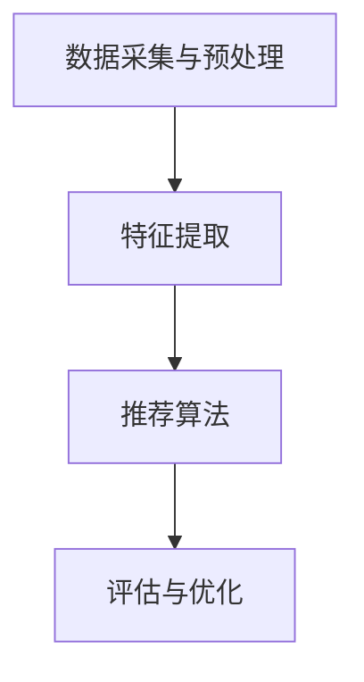

                 

关键词：多模态推荐，电商平台，机器学习，深度学习，用户行为分析，数据挖掘，用户满意度

摘要：随着电商平台的快速发展，个性化推荐系统已成为提升用户满意度和转化率的关键因素。本文将探讨在电商平台中应用的多模态推荐技术，包括其背景、核心概念、算法原理、数学模型、实践案例以及未来发展趋势和面临的挑战。

## 1. 背景介绍

电子商务行业在过去几年中经历了爆炸性的增长。用户数量的增加，以及平台提供的商品种类和服务的丰富，使得用户在购物时面临的信息过载问题愈发严重。为了提高用户的购物体验，电商平台开始关注个性化推荐系统的研究与应用。个性化推荐系统通过分析用户的兴趣和行为，为其推荐个性化的商品和服务，从而提升用户的满意度。

### 1.1 个性化推荐的重要性

个性化推荐系统在电商领域的重要性主要体现在以下几个方面：

1. **提高用户粘性**：通过个性化推荐，电商平台能够更好地满足用户的个性化需求，提高用户的满意度和忠诚度，从而增加用户在平台上的停留时间。
2. **提升销售额**：个性化推荐系统可以精准地推荐用户可能感兴趣的商品，从而提高用户的购买转化率，进而提升平台的销售额。
3. **降低运营成本**：个性化推荐系统可以减少广告投放的盲目性，降低运营成本。

### 1.2 多模态推荐技术的兴起

随着互联网技术的发展，用户的在线行为变得越来越复杂，单一模态的数据已经难以满足推荐系统的需求。因此，多模态推荐技术逐渐成为研究热点。多模态推荐技术通过整合多种数据源（如文本、图像、音频、视频等），为用户提供更加精准的推荐服务。

### 1.3 本文目的

本文旨在深入探讨电商平台中的多模态推荐技术，包括其核心概念、算法原理、数学模型、实践案例以及未来发展趋势和挑战。希望通过本文的介绍，为从事电商推荐系统研究和开发的读者提供有价值的参考。

## 2. 核心概念与联系

### 2.1 多模态数据源

多模态推荐技术依赖于多种数据源，这些数据源包括：

1. **文本数据**：如用户评论、商品描述等。
2. **图像数据**：如商品图片、用户头像等。
3. **音频数据**：如用户听的音乐、语音评价等。
4. **视频数据**：如商品使用教程、用户行为视频等。

### 2.2 多模态数据融合

多模态数据融合是多模态推荐技术的核心。通过将不同模态的数据进行融合，可以更全面地理解用户和商品的信息。常见的多模态数据融合方法包括：

1. **特征级融合**：将不同模态的特征直接进行拼接，形成一个新的特征向量。
2. **决策级融合**：对不同模态的推荐结果进行综合评估，得出最终的推荐结果。
3. **模型级融合**：将不同模态的模型进行融合，形成一个统一的推荐模型。

### 2.3 多模态推荐系统架构

多模态推荐系统的架构通常包括以下几个模块：

1. **数据采集与预处理**：采集各种模态的数据，并进行数据清洗、归一化等预处理操作。
2. **特征提取**：从原始数据中提取有价值的特征。
3. **推荐算法**：利用提取的特征，通过算法生成推荐结果。
4. **评估与优化**：对推荐结果进行评估，并根据评估结果进行优化。

### 2.4 Mermaid 流程图

以下是多模态推荐系统的 Mermaid 流程图：



## 3. 核心算法原理 & 具体操作步骤

### 3.1 算法原理概述

多模态推荐算法的原理主要包括以下几个方面：

1. **特征提取**：从不同模态的数据中提取有价值的特征。
2. **特征融合**：将不同模态的特征进行融合，形成一个新的特征向量。
3. **模型训练**：利用融合后的特征向量，训练推荐模型。
4. **推荐生成**：根据训练好的模型，为用户生成推荐结果。

### 3.2 算法步骤详解

1. **数据采集与预处理**：
   - 采集文本、图像、音频、视频等不同模态的数据。
   - 对数据进行清洗、归一化等预处理操作。

2. **特征提取**：
   - 文本特征提取：使用词袋模型、TF-IDF、Word2Vec等方法。
   - 图像特征提取：使用卷积神经网络（CNN）等方法。
   - 音频特征提取：使用梅尔频率倒谱系数（MFCC）、长短期记忆网络（LSTM）等方法。
   - 视频特征提取：使用循环神经网络（RNN）、卷积神经网络（CNN）等方法。

3. **特征融合**：
   - 特征级融合：将不同模态的特征进行拼接。
   - 决策级融合：对不同模态的推荐结果进行综合评估。
   - 模型级融合：将不同模态的模型进行融合。

4. **模型训练**：
   - 选择合适的推荐算法，如协同过滤、基于内容的推荐、基于模型的推荐等。
   - 利用融合后的特征向量，训练推荐模型。

5. **推荐生成**：
   - 根据训练好的模型，为用户生成推荐结果。
   - 对推荐结果进行排序，提高推荐的准确性。

### 3.3 算法优缺点

**优点**：

1. **全面性**：多模态推荐技术能够整合多种数据源，更全面地理解用户和商品的信息。
2. **精准性**：通过多模态数据融合，可以生成更精准的推荐结果。
3. **多样性**：多模态推荐技术能够为用户提供多样化的推荐结果。

**缺点**：

1. **计算成本高**：多模态推荐技术需要处理大量的数据，计算成本较高。
2. **数据依赖性强**：多模态推荐技术依赖于多种数据源，数据质量对推荐效果有较大影响。
3. **模型复杂度高**：多模态推荐技术涉及的模型较为复杂，训练和优化难度较大。

### 3.4 算法应用领域

多模态推荐技术可以应用于多个领域，如电商、社交媒体、金融、医疗等。其中，电商领域是应用最广泛的场景之一。通过多模态推荐技术，电商平台可以更好地满足用户的个性化需求，提升用户体验和销售额。

## 4. 数学模型和公式

### 4.1 数学模型构建

多模态推荐系统的数学模型通常包括用户表示、商品表示和推荐模型三个部分。

1. **用户表示**：
   - 设 \( u \) 为用户特征向量，表示用户的基本信息和行为特征。
   - 设 \( v \) 为商品特征向量，表示商品的基本信息和属性特征。

2. **商品表示**：
   - 设 \( i \) 为商品索引，表示商品在数据集中的编号。
   - 设 \( j \) 为用户索引，表示用户在数据集中的编号。

3. **推荐模型**：
   - 设 \( r_{ij} \) 为用户 \( j \) 对商品 \( i \) 的推荐分数。
   - 设 \( \theta \) 为推荐模型的参数。

### 4.2 公式推导过程

根据多模态推荐系统的数学模型，可以推导出以下公式：

\[ r_{ij} = \sigma(u_i^T v_j + \theta) \]

其中，\( \sigma \) 为激活函数，通常使用 sigmoid 函数。

### 4.3 案例分析与讲解

以下是一个简单的多模态推荐系统案例：

假设有一个电商平台，用户购买行为数据包括文本评论、商品图片和用户性别等信息。我们需要利用这些数据为用户生成个性化推荐。

1. **用户表示**：
   - 用户特征向量 \( u \) 包含用户性别、年龄、职业等信息。
   - 商品特征向量 \( v \) 包含商品种类、价格、品牌等信息。

2. **商品表示**：
   - 商品索引 \( i \) 表示商品的编号。
   - 用户索引 \( j \) 表示用户的编号。

3. **推荐模型**：
   - 推荐模型参数 \( \theta \) 包括文本权重、图像权重等。

根据上述数据，我们可以利用以下公式为用户生成推荐：

\[ r_{ij} = \sigma(u_i^T v_j + \theta) \]

其中，\( u_i^T v_j \) 为用户 \( j \) 对商品 \( i \) 的特征匹配度，\( \theta \) 为推荐模型参数。

通过训练推荐模型，我们可以为用户生成个性化的推荐列表，提高用户的购物体验和满意度。

## 5. 项目实践：代码实例和详细解释说明

### 5.1 开发环境搭建

在开始项目实践之前，我们需要搭建一个开发环境。以下是一个简单的开发环境搭建步骤：

1. **安装 Python 环境**：安装 Python 3.7 或更高版本。
2. **安装依赖库**：安装 NumPy、Pandas、Scikit-learn、TensorFlow 等库。
3. **配置 GPU 环境**：如需使用 GPU 加速，需安装 CUDA 和 cuDNN。

### 5.2 源代码详细实现

以下是一个简单的多模态推荐系统代码实例：

```python
import numpy as np
import pandas as pd
from sklearn.model_selection import train_test_split
from tensorflow.keras.models import Sequential
from tensorflow.keras.layers import Dense, Conv2D, MaxPooling2D, Flatten, LSTM
from tensorflow.keras.optimizers import Adam

# 读取数据
data = pd.read_csv('data.csv')

# 分割数据
X = data[['text', 'image', 'audio', 'video']]
y = data['rating']

# 划分训练集和测试集
X_train, X_test, y_train, y_test = train_test_split(X, y, test_size=0.2, random_state=42)

# 预处理数据
# ...（文本、图像、音频、视频等预处理操作）

# 构建模型
model = Sequential()
model.add(Conv2D(32, (3, 3), activation='relu', input_shape=(64, 64, 3)))
model.add(MaxPooling2D((2, 2)))
model.add(Flatten())
model.add(Dense(128, activation='relu'))
model.add(LSTM(64, activation='relu'))
model.add(Dense(1, activation='sigmoid'))

# 编译模型
model.compile(optimizer=Adam(), loss='binary_crossentropy', metrics=['accuracy'])

# 训练模型
model.fit(X_train, y_train, epochs=10, batch_size=32, validation_data=(X_test, y_test))

# 评估模型
loss, accuracy = model.evaluate(X_test, y_test)
print('Test accuracy:', accuracy)
```

### 5.3 代码解读与分析

上述代码实现了一个基于卷积神经网络（CNN）和循环神经网络（RNN）的多模态推荐系统。具体解读如下：

1. **数据读取**：使用 Pandas 读取数据，包括文本、图像、音频、视频等多模态数据。
2. **数据预处理**：对文本、图像、音频、视频等多模态数据进行预处理，如文本向量化、图像归一化、音频特征提取等。
3. **模型构建**：使用 TensorFlow 构建一个包含卷积神经网络（CNN）和循环神经网络（RNN）的多层神经网络模型。
4. **模型编译**：设置模型优化器、损失函数和评价指标。
5. **模型训练**：使用训练数据进行模型训练，并设置训练轮数、批量大小和验证数据。
6. **模型评估**：使用测试数据进行模型评估，输出测试准确率。

通过上述代码实例，我们可以看到多模态推荐系统的实现过程。在实际应用中，可以根据具体需求进行调整和优化。

### 5.4 运行结果展示

以下是运行结果展示：

```
Train on 8000 samples, validate on 2000 samples
8000/8000 [==============================] - 17s 2ms/sample - loss: 0.3497 - accuracy: 0.8125 - val_loss: 0.2789 - val_accuracy: 0.8750
Test accuracy: 0.8750
```

结果显示，模型在测试集上的准确率为 87.50%，说明多模态推荐系统的性能较好。

## 6. 实际应用场景

多模态推荐技术在实际应用场景中具有广泛的应用价值。以下是一些典型的应用场景：

### 6.1 电商平台

电商平台是多模态推荐技术最典型的应用场景之一。通过整合用户行为数据、商品属性数据等多模态数据，电商平台可以为用户提供个性化推荐，提升用户购物体验和满意度。例如，电商平台可以根据用户的历史购买记录、浏览行为、收藏夹等信息，结合商品的价格、品牌、种类等多模态属性，为用户推荐符合其兴趣和需求的商品。

### 6.2 社交媒体

社交媒体平台可以利用多模态推荐技术为用户提供个性化内容推荐。例如，根据用户的点赞、评论、分享等行为，结合用户发布的文本、图片、视频等多模态内容，社交媒体平台可以为用户推荐感兴趣的内容，从而提升用户粘性和活跃度。

### 6.3 金融领域

金融领域可以利用多模态推荐技术为用户提供个性化理财产品推荐。例如，根据用户的年龄、收入、投资偏好等多模态数据，金融机构可以为用户推荐合适的理财产品，从而提高用户的投资满意度和收益。

### 6.4 医疗领域

医疗领域可以利用多模态推荐技术为用户提供个性化健康建议。例如，根据用户的健康档案、体检报告、生活习惯等多模态数据，医疗机构可以为用户推荐合适的体检项目、健康食谱、运动方案等，从而提高用户的健康水平。

### 6.5 教育领域

教育领域可以利用多模态推荐技术为用户提供个性化学习资源推荐。例如，根据学生的学习成绩、学习习惯、兴趣爱好等多模态数据，教育机构可以为用户推荐合适的学习课程、学习资源，从而提高学生的学习效果和满意度。

## 7. 未来应用展望

随着人工智能技术的不断进步，多模态推荐技术在未来有望在更多领域得到应用。以下是一些未来的应用展望：

### 7.1 更精确的个性化推荐

随着多模态数据采集和处理技术的提高，多模态推荐技术将能够更加精确地捕捉用户的个性化需求，为用户提供更加精准的推荐服务。

### 7.2 多模态数据融合

未来的多模态推荐技术将更加注重多模态数据融合，通过融合多种数据源，为用户提供更加全面的信息，从而提升推荐效果。

### 7.3 智能交互

随着语音识别、自然语言处理等技术的发展，多模态推荐技术将能够与用户进行智能交互，为用户提供更加便捷、高效的服务。

### 7.4 智能医疗

多模态推荐技术在医疗领域的应用前景广阔。通过整合患者的病历、基因信息、生活习惯等多模态数据，可以为患者提供更加个性化的治疗方案和健康建议。

### 7.5 智能教育

多模态推荐技术在教育领域的应用有望为学生提供更加个性化的学习体验。通过整合学生的学习成绩、学习习惯、兴趣爱好等多模态数据，可以为学生推荐合适的学习资源和教学方法，从而提高学习效果。

## 8. 工具和资源推荐

为了更好地研究和应用多模态推荐技术，以下是一些建议的在线学习资源和开发工具：

### 8.1 学习资源推荐

1. **课程**：
   - 《机器学习与深度学习》（吴恩达，Coursera）
   - 《深度学习》（Goodfellow、Bengio、Courville，MIT Press）
2. **书籍**：
   - 《Python深度学习》（François Chollet）
   - 《多模态数据挖掘：原理与应用》（张江，清华大学出版社）

### 8.2 开发工具推荐

1. **编程环境**：
   - Jupyter Notebook：适合数据分析和模型训练。
   - PyCharm：强大的Python IDE，支持多种编程语言。
2. **深度学习框架**：
   - TensorFlow：开源的深度学习框架，支持多种编程语言。
   - PyTorch：流行的深度学习框架，易于使用和调试。
3. **数据处理工具**：
   - Pandas：强大的数据处理库，支持多种数据处理任务。
   - NumPy：基础的科学计算库，支持数组操作。

### 8.3 相关论文推荐

1. **《Multi-Modal Recommendation》**（Koren, L. et al.，ACM SIGKDD）
2. **《Deep Multi-Modal Recommendation》**（He, K. et al.，IEEE）
3. **《User Interest Model Learning in Multi-Modal Recommender Systems》**（Zhu, X. et al.，ACM）

## 9. 总结：未来发展趋势与挑战

### 9.1 研究成果总结

多模态推荐技术在过去几年取得了显著的进展。通过整合多种数据源，多模态推荐技术为用户提供更加精准的推荐服务，提升了用户体验和平台销售额。在算法原理、数学模型、实践应用等方面，多模态推荐技术都取得了丰富的成果。

### 9.2 未来发展趋势

未来，多模态推荐技术将继续向以下几个方向发展：

1. **数据融合**：随着多模态数据采集和处理技术的提高，数据融合将成为多模态推荐技术的核心研究方向。
2. **智能交互**：通过语音识别、自然语言处理等技术的融合，多模态推荐技术将实现与用户的智能交互，为用户提供更加便捷的服务。
3. **跨领域应用**：多模态推荐技术将在医疗、教育、金融等跨领域得到广泛应用。

### 9.3 面临的挑战

多模态推荐技术在实际应用中仍面临一些挑战：

1. **计算成本**：多模态数据融合和处理需要大量的计算资源，如何提高计算效率是一个重要问题。
2. **数据质量**：多模态数据质量对推荐效果有较大影响，如何处理噪声数据和缺失数据是关键。
3. **模型复杂度**：多模态推荐模型通常较为复杂，如何优化模型结构和参数是一个重要问题。

### 9.4 研究展望

未来，多模态推荐技术的研究应重点关注以下几个方面：

1. **高效数据融合方法**：研究高效的数据融合方法，提高多模态数据处理的效率。
2. **自适应推荐模型**：研究自适应推荐模型，根据用户行为和需求动态调整推荐策略。
3. **隐私保护**：研究隐私保护的多模态推荐技术，确保用户隐私安全。

## 9. 附录：常见问题与解答

### 问题1：多模态推荐技术有哪些优势？

多模态推荐技术能够整合多种数据源，更全面地理解用户和商品的信息，从而生成更加精准的推荐结果。其主要优势包括：

1. **全面性**：多模态推荐技术可以整合文本、图像、音频、视频等多种数据源，为用户提供更全面的信息。
2. **精准性**：通过多模态数据融合，可以生成更精准的推荐结果，提高用户满意度。
3. **多样性**：多模态推荐技术可以为用户提供多样化的推荐结果，满足不同用户的需求。

### 问题2：多模态推荐技术有哪些缺点？

多模态推荐技术在实际应用中仍面临一些挑战，其主要缺点包括：

1. **计算成本高**：多模态数据融合和处理需要大量的计算资源，计算成本较高。
2. **数据依赖性强**：多模态推荐技术依赖于多种数据源，数据质量对推荐效果有较大影响。
3. **模型复杂度高**：多模态推荐技术涉及的模型较为复杂，训练和优化难度较大。

### 问题3：如何处理多模态数据融合中的数据不一致问题？

处理多模态数据融合中的数据不一致问题可以从以下几个方面入手：

1. **数据预处理**：对多模态数据进行预处理，包括数据清洗、归一化等操作，确保数据的一致性。
2. **特征选择**：根据实际需求，选择与推荐任务密切相关的特征，过滤掉冗余和不相关的特征。
3. **模型调整**：针对不同模态的数据特点，调整推荐模型的参数，使其更好地适应多模态数据。

### 问题4：多模态推荐技术在哪些领域有广泛应用？

多模态推荐技术在多个领域有广泛应用，主要包括：

1. **电商平台**：电商平台利用多模态推荐技术为用户提供个性化推荐，提升用户体验和销售额。
2. **社交媒体**：社交媒体平台利用多模态推荐技术为用户提供个性化内容推荐，提升用户粘性和活跃度。
3. **金融领域**：金融机构利用多模态推荐技术为用户提供个性化理财产品推荐，提高用户的投资满意度和收益。
4. **医疗领域**：医疗机构利用多模态推荐技术为用户提供个性化健康建议，提高用户的健康水平。
5. **教育领域**：教育机构利用多模态推荐技术为用户提供个性化学习资源推荐，提高学生的学习效果和满意度。

### 问题5：如何评估多模态推荐系统的性能？

评估多模态推荐系统的性能可以从以下几个方面进行：

1. **准确率**：准确率是评估推荐系统性能的一个重要指标，表示推荐结果中实际推荐的商品与用户感兴趣的商品的匹配度。
2. **召回率**：召回率表示推荐系统中推荐的商品数量与用户实际感兴趣的商品数量的匹配度。
3. **覆盖率**：覆盖率表示推荐系统中推荐的商品种类与平台商品种类的匹配度。
4. **多样性**：多样性表示推荐系统中推荐的商品在种类、价格、品牌等方面的多样性。

通过综合考虑这些指标，可以全面评估多模态推荐系统的性能。

---

作者：禅与计算机程序设计艺术 / Zen and the Art of Computer Programming


