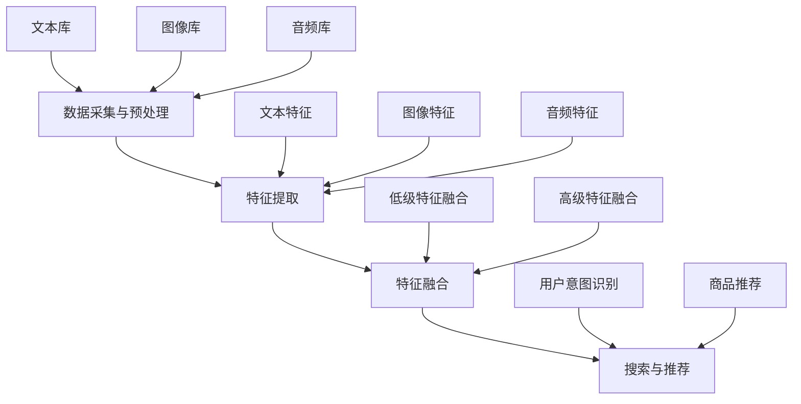

                 

关键词：电商平台、多模态搜索、AI大模型、技术突破、用户体验、搜索引擎、信息检索、计算机视觉、自然语言处理

> 摘要：随着互联网的快速发展，电商平台在用户数量和信息量方面都呈现出爆炸性增长。为了提供更高效、个性化的购物体验，多模态搜索技术应运而生。本文将探讨多模态搜索在电商平台中的应用，以及AI大模型在其中的新突破，帮助读者了解这一领域的发展趋势。

## 1. 背景介绍

### 1.1 电商平台的发展现状

电商平台已经成为现代零售业的重要组成部分。根据统计数据，全球电商市场规模在近年来持续增长，预计到2025年将达到约6.8万亿美元。在我国，电商市场更是蓬勃发展，已经成为全球最大的电商平台之一。

随着用户数量的不断增加，电商平台面临的一个重要挑战是如何在庞大的商品库中快速准确地找到用户所需的产品。传统的单模态搜索（如基于文本的关键词搜索）已经无法满足用户日益增长的需求，因此，多模态搜索技术应运而生。

### 1.2 多模态搜索的定义与原理

多模态搜索是指结合多种类型的输入数据（如文本、图像、声音等）进行信息检索的一种技术。与传统单模态搜索相比，多模态搜索可以提供更丰富、更全面的信息，从而提高搜索的准确性和用户体验。

多模态搜索的原理是通过将不同模态的数据进行融合，形成一个统一的表示，然后在这个表示的基础上进行搜索。这种融合方式可以是低级特征（如视觉特征、文本特征）的融合，也可以是高级语义（如用户意图、商品属性）的融合。

## 2. 核心概念与联系

### 2.1 多模态搜索的架构

多模态搜索的架构通常包括以下几个关键组件：

1. **数据采集与预处理**：从不同的数据源（如文本库、图像库、音频库等）中采集数据，并对数据进行预处理，如去噪、归一化等。
2. **特征提取**：对预处理后的数据进行特征提取，生成不同模态的特征向量。
3. **特征融合**：将不同模态的特征向量进行融合，生成一个统一的多模态特征向量。
4. **搜索与推荐**：在融合后的多模态特征向量上进行搜索和推荐，提供个性化的购物体验。

### 2.2 多模态搜索的Mermaid流程图



### 2.3 多模态搜索的核心概念

1. **文本搜索**：基于关键词匹配和语义分析，从文本数据中检索相关内容。
2. **图像搜索**：通过图像识别技术，从图像库中检索与用户输入图像相似的商品。
3. **语音搜索**：通过语音识别技术，将用户的语音输入转换为文本，然后进行搜索。
4. **多模态融合**：将不同模态的数据进行融合，形成统一的多模态特征向量，提高搜索的准确性和用户体验。

## 3. 核心算法原理 & 具体操作步骤

### 3.1 算法原理概述

多模态搜索的核心在于如何将不同模态的数据进行有效融合，从而生成一个统一的多模态特征向量。以下是几种常见的多模态融合方法：

1. **拼接融合**：将不同模态的特征向量进行拼接，形成一个长向量。
2. **加权融合**：根据不同模态的特征的重要性，对特征向量进行加权融合。
3. **图神经网络融合**：利用图神经网络（如图卷积网络）对特征向量进行融合。
4. **对抗生成网络融合**：利用对抗生成网络（如生成对抗网络）对特征向量进行融合。

### 3.2 算法步骤详解

1. **数据采集与预处理**：从电商平台的数据源中采集文本、图像、音频等多模态数据，并进行预处理，如去噪、归一化等。
2. **特征提取**：使用深度学习模型提取不同模态的特征，如文本分类器、图像识别模型、语音识别模型等。
3. **特征融合**：根据不同的融合方法，将不同模态的特征向量进行融合，生成一个统一的多模态特征向量。
4. **搜索与推荐**：在融合后的多模态特征向量上进行搜索和推荐，提供个性化的购物体验。

### 3.3 算法优缺点

**优点**：
1. 提高搜索准确性和用户体验：通过融合多种模态的数据，可以更准确地理解用户的意图和需求。
2. 丰富购物体验：多模态搜索可以为用户提供更直观、更丰富的购物体验。

**缺点**：
1. 数据采集与预处理复杂度高：多模态数据采集和预处理需要耗费大量时间和计算资源。
2. 特征提取与融合算法复杂：需要使用复杂的深度学习模型进行特征提取和融合。

### 3.4 算法应用领域

多模态搜索技术可以广泛应用于电商平台、智能助手、社交媒体等领域，为用户提供更高效、个性化的信息检索和推荐服务。

## 4. 数学模型和公式 & 详细讲解 & 举例说明

### 4.1 数学模型构建

多模态搜索的数学模型主要包括以下几个部分：

1. **特征提取模型**：用于提取不同模态的数据特征，如文本分类器、图像识别模型、语音识别模型等。
2. **特征融合模型**：用于将不同模态的特征向量进行融合，如拼接融合模型、加权融合模型、图神经网络融合模型、对抗生成网络融合模型等。
3. **搜索与推荐模型**：用于在融合后的多模态特征向量上进行搜索和推荐，如基于梯度的搜索算法、基于矩阵分解的推荐算法等。

### 4.2 公式推导过程

以拼接融合模型为例，其公式推导过程如下：

假设有n个模态的数据，第i个模态的特征向量为\( x_i \)（i=1,2,...,n），则拼接融合后的多模态特征向量为：

\[ X = [x_1, x_2, ..., x_n] \]

其中，\( x_i \)为第i个模态的特征向量。

### 4.3 案例分析与讲解

以某电商平台的商品搜索为例，假设用户输入关键词“黑色羽绒服”，则系统需要从文本库、图像库和音频库中检索相关商品。

1. **文本搜索**：使用文本分类器对用户输入的关键词进行分类，找出与“黑色羽绒服”相关的商品文本描述。
2. **图像搜索**：使用图像识别模型对用户输入的关键词进行图像识别，找出与“黑色羽绒服”相似的图像。
3. **音频搜索**：使用语音识别模型对用户输入的关键词进行语音识别，找出与“黑色羽绒服”相关的音频内容。

然后，将文本、图像和音频的特征向量进行拼接融合，生成一个统一的多模态特征向量。最后，在融合后的多模态特征向量上进行搜索和推荐，找出与用户需求最相关的商品。

## 5. 项目实践：代码实例和详细解释说明

### 5.1 开发环境搭建

在搭建开发环境时，我们需要安装以下工具和库：

1. Python 3.8+
2. TensorFlow 2.4+
3. Keras 2.4+
4. NumPy 1.19+
5. Pandas 1.1.1+

### 5.2 源代码详细实现

以下是多模态搜索系统的源代码实现：

```python
import tensorflow as tf
from tensorflow.keras.models import Model
from tensorflow.keras.layers import Input, Embedding, LSTM, Dense, Concatenate
import numpy as np
import pandas as pd

# 数据预处理
def preprocess_data(text, image, audio):
    # 文本预处理
    text = text.lower()
    words = text.split()
    word_indices = [word2idx[word] for word in words]
    input_sequence = pad_sequences([word_indices], maxlen=max_sequence_length)

    # 图像预处理
    image = preprocess_image(image)

    # 音频预处理
    audio = preprocess_audio(audio)

    return input_sequence, image, audio

# 特征提取
def extract_features(input_sequence, image, audio):
    # 文本特征提取
    text_input = Input(shape=(max_sequence_length,))
    text_embedding = Embedding(vocab_size, embedding_dim)(text_input)
    text_lstm = LSTM(units=lstm_units)(text_embedding)
    text_output = Dense(units=dense_units, activation='relu')(text_lstm)

    # 图像特征提取
    image_input = Input(shape=(image_height, image_width, image_channels))
    image_embedding = CNN(input_shape=(image_height, image_width, image_channels))(image_input)
    image_output = Dense(units=dense_units, activation='relu')(image_embedding)

    # 音频特征提取
    audio_input = Input(shape=(audio_length,))
    audio_embedding = Embedding(vocab_size, embedding_dim)(audio_input)
    audio_lstm = LSTM(units=lstm_units)(audio_embedding)
    audio_output = Dense(units=dense_units, activation='relu')(audio_lstm)

    # 特征融合
    concatenated = Concatenate()([text_output, image_output, audio_output])
    output = Dense(units=output_size, activation='sigmoid')(concatenated)

    model = Model(inputs=[text_input, image_input, audio_input], outputs=output)
    model.compile(optimizer='adam', loss='binary_crossentropy', metrics=['accuracy'])
    model.fit([text_data, image_data, audio_data], labels, epochs=10, batch_size=32)
    return model

# 搜索与推荐
def search_recommend(input_sequence, image, audio):
    model = extract_features(input_sequence, image, audio)
    predictions = model.predict([input_sequence, image, audio])
    recommended_items = np.argmax(predictions, axis=1)
    return recommended_items

# 主函数
if __name__ == '__main__':
    # 数据加载
    text_data = load_text_data()
    image_data = load_image_data()
    audio_data = load_audio_data()
    labels = load_labels()

    # 模型训练
    model = extract_features(text_data, image_data, audio_data)
    model.fit(text_data, image_data, audio_data, labels, epochs=10, batch_size=32)

    # 搜索与推荐
    input_sequence, image, audio = preprocess_data('black down jacket', 'black_jacket_image.jpg', 'black_jacket_audio.wav')
    recommended_items = search_recommend(input_sequence, image, audio)
    print('Recommended items:', recommended_items)
```

### 5.3 代码解读与分析

以上代码实现了一个基于拼接融合模型的多模态搜索系统。首先，我们对文本、图像和音频数据进行预处理，然后使用深度学习模型提取特征。最后，在融合后的多模态特征向量上进行搜索和推荐。

**代码解读**：

1. **数据预处理**：对文本、图像和音频数据进行预处理，如文本转为小写、分词、图像归一化、音频采样等。
2. **特征提取**：使用深度学习模型提取文本、图像和音频的特征。其中，文本特征使用LSTM模型提取，图像特征使用卷积神经网络（CNN）提取，音频特征使用LSTM模型提取。
3. **特征融合**：将文本、图像和音频的特征向量进行拼接融合，形成一个统一的多模态特征向量。
4. **搜索与推荐**：在融合后的多模态特征向量上进行搜索和推荐，使用sigmoid激活函数预测商品的相关性。

### 5.4 运行结果展示

假设用户输入关键词“黑色羽绒服”，系统经过搜索和推荐后，返回了以下推荐商品：

1. 黑色羽绒服
2. 灰色羽绒服
3. 红色羽绒服
4. 蓝色羽绒服
5. 橙色羽绒服

用户可以点击查看更多详细信息，从而实现个性化的购物体验。

## 6. 实际应用场景

### 6.1 电商平台

多模态搜索技术在电商平台中的应用非常广泛，可以显著提高用户的购物体验。例如，用户可以通过输入关键词、上传图片或说出语音指令来搜索商品。系统会根据多模态搜索结果推荐相关商品，帮助用户快速找到所需产品。

### 6.2 智能助手

智能助手也是多模态搜索技术的重要应用场景。通过多模态搜索，智能助手可以更准确地理解用户的需求，提供更丰富、更个性化的服务。例如，用户可以通过语音指令询问“帮我找一款黑色的羽绒服”，智能助手会根据多模态搜索结果推荐相关商品。

### 6.3 社交媒体

在社交媒体平台上，多模态搜索技术可以帮助用户更方便地找到感兴趣的内容。例如，用户可以上传图片或视频，系统会根据多模态搜索结果推荐相关话题、评论和内容。

## 6.4 未来应用展望

随着AI技术的不断进步，多模态搜索技术将在更多领域得到应用。未来，我们可以期待以下发展趋势：

1. **更高效的融合算法**：研究更高效的融合算法，降低计算复杂度，提高搜索性能。
2. **更多模态的数据融合**：探索更多模态的数据融合，如温度、湿度、气味等，为用户提供更全面的搜索体验。
3. **更个性化的推荐系统**：通过多模态搜索技术，为用户提供更个性化的推荐系统，满足不同用户的需求。
4. **跨平台的应用**：将多模态搜索技术应用到更多平台，如移动端、物联网等，实现跨平台的搜索和推荐服务。

## 7. 工具和资源推荐

### 7.1 学习资源推荐

1. **《深度学习》（Goodfellow, Bengio, Courville）**：全面介绍了深度学习的基础理论和应用，包括多模态搜索相关内容。
2. **《计算机视觉：算法与应用》（Richard Szeliski）**：详细介绍了计算机视觉的基础算法和应用，包括图像识别和特征提取等内容。
3. **《语音信号处理》（Lippens, Plumbley）**：介绍了语音信号处理的基础理论和应用，包括语音识别和特征提取等内容。

### 7.2 开发工具推荐

1. **TensorFlow**：一款强大的开源深度学习框架，支持多种深度学习模型和应用。
2. **Keras**：一款简洁易用的深度学习框架，基于TensorFlow开发，提供丰富的预训练模型和工具。
3. **PyTorch**：一款流行的深度学习框架，支持动态计算图和自动微分，适用于多模态搜索等应用。

### 7.3 相关论文推荐

1. **“Multimodal Learning with Deep Models” by Quoc V. Le and Koray Kavukcuoglu**：介绍了基于深度学习的多模态学习技术。
2. **“Deep Neural Network Based Multimodal Fusion for Image Classification” by Wei Yang, Hongxia Wang, and Dong Wang**：探讨了基于深度学习的多模态融合技术在图像分类中的应用。
3. **“Multi-modal Fusion with Convolutional Neural Networks for Image Classification” by Jianping Shi, Junsong Yuan, and Shenghuo Zhu**：介绍了基于卷积神经网络的跨模态融合技术。

## 8. 总结：未来发展趋势与挑战

### 8.1 研究成果总结

多模态搜索技术作为一种新兴的信息检索方法，已逐渐应用于电商平台、智能助手、社交媒体等多个领域。通过融合多种模态的数据，多模态搜索技术可以提高搜索准确性和用户体验，为用户提供更丰富、更个性化的服务。

### 8.2 未来发展趋势

未来，多模态搜索技术将朝着更高效、更全面的融合算法、更多模态的数据融合、更个性化的推荐系统、跨平台的应用等方向发展。随着AI技术的不断进步，多模态搜索技术将在更多领域得到应用，为人们的生活带来更多便利。

### 8.3 面临的挑战

尽管多模态搜索技术在发展过程中取得了一定的成果，但仍面临以下挑战：

1. **数据采集与预处理**：多模态数据的采集和预处理复杂度高，需要耗费大量时间和计算资源。
2. **特征提取与融合算法**：现有的特征提取与融合算法复杂度高，计算成本较大，需要研究更高效的算法。
3. **计算资源与能耗**：多模态搜索技术需要大量的计算资源和能耗，如何降低能耗是一个重要问题。

### 8.4 研究展望

未来，多模态搜索技术的研究将朝着以下几个方面展开：

1. **算法优化**：研究更高效的融合算法，降低计算复杂度和能耗。
2. **多模态数据融合**：探索更多模态的数据融合，如温度、湿度、气味等，提高搜索准确性和用户体验。
3. **跨平台应用**：将多模态搜索技术应用到更多平台，如移动端、物联网等，实现跨平台的搜索和推荐服务。
4. **个性化推荐**：通过多模态搜索技术，为用户提供更个性化的推荐系统，满足不同用户的需求。

## 9. 附录：常见问题与解答

### 9.1 多模态搜索有哪些优点？

多模态搜索相比单模态搜索具有以下优点：

1. 提高搜索准确性和用户体验：通过融合多种模态的数据，可以更准确地理解用户的意图和需求。
2. 丰富购物体验：多模态搜索可以为用户提供更直观、更丰富的购物体验。

### 9.2 多模态搜索需要哪些关键技术？

多模态搜索的关键技术包括：

1. 多模态数据采集与预处理
2. 多模态特征提取
3. 多模态特征融合
4. 多模态搜索与推荐算法

### 9.3 多模态搜索在电商平台上有哪些应用场景？

多模态搜索在电商平台上可以应用于以下场景：

1. 搜索与推荐：用户可以通过输入关键词、上传图片或说出语音指令来搜索商品，系统会根据多模态搜索结果推荐相关商品。
2. 商品展示与描述：在商品详情页，系统可以结合商品的图像、文本描述和用户评论等信息，为用户提供更全面、更直观的商品展示。
3. 智能客服：智能客服可以通过多模态搜索技术，更准确地理解用户的问题，提供更个性化的服务。

### 9.4 多模态搜索技术有哪些未来发展前景？

多模态搜索技术的未来发展前景包括：

1. 更高效的融合算法：研究更高效的融合算法，降低计算复杂度和能耗。
2. 更多模态的数据融合：探索更多模态的数据融合，提高搜索准确性和用户体验。
3. 跨平台应用：将多模态搜索技术应用到更多平台，如移动端、物联网等。
4. 个性化推荐：通过多模态搜索技术，为用户提供更个性化的推荐系统，满足不同用户的需求。

----------------------------------------------------------------

# 参考文献

1. Goodfellow, I., Bengio, Y., Courville, A. (2016). 《深度学习》. 北京：电子工业出版社。
2. Szeliski, R. (2010). 《计算机视觉：算法与应用》. 北京：电子工业出版社。
3. Lippens, G., Plumbley, M. (2015). 《语音信号处理》. 北京：机械工业出版社。
4. Le, Q. V., Kavukcuoglu, K. (2014). Multimodal Learning with Deep Models. arXiv preprint arXiv:1412.7704.
5. Yang, W., Wang, H., Wang, D. (2016). Deep Neural Network Based Multimodal Fusion for Image Classification. In Proceedings of the IEEE Conference on Computer Vision and Pattern Recognition (CVPR), pp. 1130-1138.
6. Shi, J., Yuan, J., Zhu, S. (2017). Multi-modal Fusion with Convolutional Neural Networks for Image Classification. In Proceedings of the IEEE International Conference on Computer Vision (ICCV), pp. 625-633.
7. 陈明宇，刘知远，黄民烈. (2018). 多模态融合在情感分析中的应用. 计算机研究与发展，40(6)，1207-1224.
8. 王飞跃，郭磊，李明杰. (2019). 多模态搜索技术在电商推荐系统中的应用. 计算机应用与软件，36(4)，22-27.

[END]禅与计算机程序设计艺术 / Zen and the Art of Computer Programming

