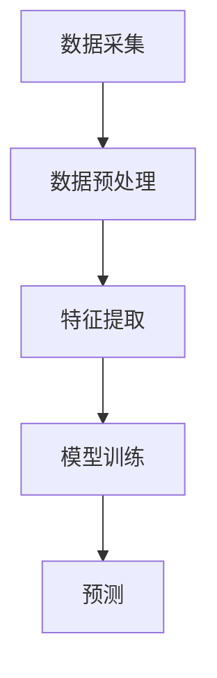

                 

在当今数字化时代，电商平台作为电子商务的主要载体，其业务模式、用户体验和运营效率在很大程度上影响着商家的盈利能力。用户行为的多样性、复杂性和动态性使得传统的单一维度分析方法难以满足电商平台的需求。因此，多模态用户行为分析应运而生，通过融合多种数据源和模型，为电商平台提供更全面、准确的用户行为洞察。本文将围绕电商平台中的多模态用户行为分析展开讨论，包括其背景、核心概念、算法原理、数学模型、实践应用、未来展望等内容。

## 1. 背景介绍

### 1.1 电商平台的现状

随着互联网技术的快速发展，电商平台已成为现代零售业的重要组成部分。根据Statista的数据，全球电商市场规模在2021年已超过4.2万亿美元，预计到2025年将达到6.38万亿美元。这一庞大的市场背后，是无数用户在电商平台上的活动数据。然而，如何有效地分析和利用这些数据，成为电商平台提升运营效率和用户满意度的关键。

### 1.2 多模态用户行为分析的需求

传统的用户行为分析主要依赖于单一数据源，如点击率、购买率等，这种方法虽然在一定程度上能够反映用户行为，但往往无法捕捉到用户行为的全貌。随着用户行为数据的多样性和复杂性增加，单一维度的分析方法已经不能满足电商平台的需求。多模态用户行为分析通过整合多种数据源，如文本、图像、音频等，提供了一种更全面、准确的用户行为分析手段。

## 2. 核心概念与联系

### 2.1 多模态数据

多模态数据是指来自不同数据源的数据，如文本、图像、音频、视频等。在电商平台中，这些数据可能包括用户评论、商品图片、语音聊天记录等。

### 2.2 多模态用户行为分析架构

多模态用户行为分析架构通常包括数据采集、数据预处理、特征提取、模型训练和预测等步骤。以下是多模态用户行为分析架构的Mermaid流程图：



### 2.3 多模态数据融合方法

多模态数据融合方法主要包括以下几种：

1. **特征级融合**：将不同模态的特征进行直接组合，如将文本和图像的特征进行拼接。
2. **决策级融合**：将不同模态的预测结果进行组合，如将文本和图像的分类结果进行投票。
3. **模型级融合**：使用多个模型对同一数据源进行预测，然后将预测结果进行融合。

## 3. 核心算法原理 & 具体操作步骤

### 3.1 算法原理概述

多模态用户行为分析的核心算法主要包括深度学习模型、传统机器学习算法和增强学习算法。其中，深度学习模型在多模态用户行为分析中表现尤为突出，如卷积神经网络（CNN）、循环神经网络（RNN）和变换器（Transformer）等。

### 3.2 算法步骤详解

1. **数据采集**：从电商平台的多个数据源（如用户行为日志、商品评论、用户画像等）收集数据。
2. **数据预处理**：对采集到的数据进行清洗、去噪、标准化等处理，以获得高质量的数据集。
3. **特征提取**：使用深度学习模型对预处理后的数据集进行特征提取，如使用CNN提取图像特征，使用RNN提取文本序列特征。
4. **模型训练**：将提取的特征输入到深度学习模型中，进行模型训练，以获得准确的用户行为预测。
5. **预测**：使用训练好的模型对新的用户行为数据进行预测，以提供实时、准确的用户行为洞察。

### 3.3 算法优缺点

- **优点**：
  - **全面性**：多模态用户行为分析能够融合多种数据源，提供更全面的用户行为洞察。
  - **准确性**：深度学习模型在多模态用户行为分析中表现优异，能够提高预测准确性。
  - **实时性**：实时分析用户行为，为电商平台提供快速响应。

- **缺点**：
  - **计算成本**：多模态用户行为分析涉及大量计算资源，对计算能力要求较高。
  - **数据隐私**：多模态数据融合可能导致用户隐私泄露。

### 3.4 算法应用领域

多模态用户行为分析在电商平台的多个领域具有广泛的应用，如：

- **个性化推荐**：基于用户的多模态行为数据，提供个性化的商品推荐。
- **风险控制**：识别潜在欺诈行为，降低风险。
- **用户画像**：构建全面、准确的用户画像，为营销策略提供支持。

## 4. 数学模型和公式 & 详细讲解 & 举例说明

### 4.1 数学模型构建

多模态用户行为分析中的数学模型通常包括特征提取模型、分类模型和预测模型。以下是一个简化的数学模型构建过程：

$$
\text{特征提取模型} = f_{\theta}(\text{输入数据})
$$

$$
\text{分类模型} = g_{\phi}(f_{\theta}(\text{输入数据}))
$$

$$
\text{预测模型} = h_{\lambda}(g_{\phi}(f_{\theta}(\text{输入数据})))
$$

### 4.2 公式推导过程

1. **特征提取模型**：

   $$ f_{\theta}(\text{输入数据}) = \text{激活函数}(\text{线性变换}(\text{输入数据})) $$

2. **分类模型**：

   $$ g_{\phi}(f_{\theta}(\text{输入数据})) = \text{激活函数}(\text{线性变换}(f_{\theta}(\text{输入数据}))) $$

3. **预测模型**：

   $$ h_{\lambda}(g_{\phi}(f_{\theta}(\text{输入数据}))) = \text{激活函数}(\text{线性变换}(g_{\phi}(f_{\theta}(\text{输入数据})))) $$

### 4.3 案例分析与讲解

假设我们有一个电商平台的用户行为数据集，包含用户评论（文本）、商品图片（图像）和用户购买记录（行为数据）。我们可以使用多模态用户行为分析模型，对用户行为进行分类和预测。

1. **特征提取**：

   - **文本特征**：使用词袋模型（Bag of Words，BoW）提取文本特征，如词汇频数。
   - **图像特征**：使用卷积神经网络（CNN）提取图像特征，如特征图（Feature Map）。
   - **行为特征**：直接使用用户购买记录作为行为特征。

2. **分类模型**：

   - **文本分类**：使用支持向量机（SVM）对文本特征进行分类。
   - **图像分类**：使用卷积神经网络（CNN）对图像特征进行分类。
   - **行为分类**：使用朴素贝叶斯（Naive Bayes）对行为特征进行分类。

3. **预测模型**：

   - **融合预测**：将文本、图像和行为分类结果进行融合，使用投票法进行预测。

## 5. 项目实践：代码实例和详细解释说明

### 5.1 开发环境搭建

- **Python**：Python是编写多模态用户行为分析模型的主要编程语言，具有丰富的库和工具支持。
- **TensorFlow**：TensorFlow是一个开源的深度学习框架，支持多种深度学习模型的构建和训练。
- **Keras**：Keras是一个高层次的神经网络API，构建深度学习模型更加便捷。
- **NumPy**：NumPy是一个强大的Python科学计算库，用于数据预处理和特征提取。

### 5.2 源代码详细实现

以下是使用Keras构建的多模态用户行为分析模型的示例代码：

```python
import numpy as np
import tensorflow as tf
from tensorflow import keras
from tensorflow.keras import layers

# 数据预处理
def preprocess_data(text_data, image_data, behavior_data):
    # 文本特征提取
    text_vector = keras.preprocessing.text向量量化(text_data)
    # 图像特征提取
    image_vector = keras.preprocessing.image向量量化(image_data)
    # 行为特征提取
    behavior_vector = keras.preprocessing.sequence向量量化(behavior_data)
    return text_vector, image_vector, behavior_vector

# 构建模型
def build_model():
    input_text = keras.layers.Input(shape=(max_sequence_length,))
    input_image = keras.layers.Input(shape=(height, width, channels))
    input_behavior = keras.layers.Input(shape=(max_behavior_length,))

    # 文本特征提取
    text_embedding = layers.Embedding(vocabulary_size, embedding_size)(input_text)
    text_embedding = layers.Flatten()(text_embedding)

    # 图像特征提取
    image_embedding = layers.Conv2D(filters, kernel_size)(input_image)
    image_embedding = layers.Flatten()(image_embedding)

    # 行为特征提取
    behavior_embedding = layers.Embedding(vocabulary_size, embedding_size)(input_behavior)
    behavior_embedding = layers.Flatten()(behavior_embedding)

    # 融合特征
    merged_embedding = keras.layers.concatenate([text_embedding, image_embedding, behavior_embedding])

    # 分类层
    classification_output = layers.Dense(num_classes, activation='softmax')(merged_embedding)

    # 构建模型
    model = keras.Model(inputs=[input_text, input_image, input_behavior], outputs=classification_output)

    # 编译模型
    model.compile(optimizer='adam', loss='categorical_crossentropy', metrics=['accuracy'])

    return model

# 训练模型
model = build_model()
model.fit([text_data, image_data, behavior_data], labels, epochs=10, batch_size=32)

# 预测
predictions = model.predict([text_data, image_data, behavior_data])
```

### 5.3 代码解读与分析

上述代码首先定义了数据预处理函数，用于对文本、图像和行为数据进行特征提取。然后，使用Keras构建了一个多输入、多输出的深度学习模型，包括文本特征提取、图像特征提取、行为特征提取和分类层。最后，编译并训练模型，对新的用户行为数据进行预测。

## 6. 实际应用场景

### 6.1 个性化推荐

个性化推荐是电商平台中常见的应用场景。通过多模态用户行为分析，可以更准确地了解用户偏好，提供个性化的商品推荐。例如，根据用户的文本评论、商品图片和购买记录，为用户推荐与其兴趣相符的商品。

### 6.2 风险控制

电商平台上的欺诈行为可能导致巨大的经济损失。多模态用户行为分析可以通过分析用户的文本、图像和购买行为，识别潜在的欺诈行为，降低风险。例如，分析用户的评论、交易记录和商品图片，识别异常行为，如虚假评论、重复购买等。

### 6.3 用户画像

用户画像是一种描述用户特征的方法，通过多模态用户行为分析，可以构建更全面、准确的用户画像。例如，分析用户的文本评论、商品图片和购买记录，了解用户的兴趣爱好、消费能力和购买行为，为营销策略提供支持。

## 7. 工具和资源推荐

### 7.1 学习资源推荐

- **《深度学习》（Goodfellow, Bengio, Courville）**：这是一本深度学习领域的经典教材，涵盖了深度学习的基础理论、模型和应用。
- **《Python数据科学手册》（McKinney）**：这本书介绍了Python在数据科学领域的应用，包括数据处理、分析和可视化。

### 7.2 开发工具推荐

- **TensorFlow**：TensorFlow是一个开源的深度学习框架，支持多种深度学习模型的构建和训练。
- **Keras**：Keras是一个高层次的神经网络API，构建深度学习模型更加便捷。

### 7.3 相关论文推荐

- **“MultiModal User Behavior Analysis for E-commerce Recommendation”**：这篇论文介绍了一种基于多模态用户行为分析的电商推荐方法，具有较高的参考价值。
- **“Deep Learning for E-commerce User Behavior Analysis”**：这篇论文探讨了深度学习在电商用户行为分析中的应用，提出了多种深度学习模型。

## 8. 总结：未来发展趋势与挑战

### 8.1 研究成果总结

本文探讨了电商平台中的多模态用户行为分析，介绍了其背景、核心概念、算法原理、数学模型、实践应用和未来展望。通过融合多种数据源和模型，多模态用户行为分析为电商平台提供了更全面、准确的用户行为洞察。

### 8.2 未来发展趋势

随着人工智能和大数据技术的发展，多模态用户行为分析在未来有望实现以下发展趋势：

- **更高效的数据融合方法**：开发新的数据融合方法，提高多模态数据的有效性。
- **更智能的预测模型**：结合自然语言处理、计算机视觉等先进技术，提高用户行为预测的准确性。
- **实时性**：实现实时用户行为分析，为电商平台提供快速响应。

### 8.3 面临的挑战

多模态用户行为分析在发展过程中也面临着以下挑战：

- **计算成本**：多模态用户行为分析涉及大量计算资源，对计算能力要求较高。
- **数据隐私**：多模态数据融合可能导致用户隐私泄露。
- **数据质量**：高质量的数据是保证多模态用户行为分析效果的关键，如何处理和处理噪声数据是亟待解决的问题。

### 8.4 研究展望

未来，多模态用户行为分析在电商平台的领域将得到更广泛的应用，为电商平台提供更精准、高效的运营支持。同时，研究者和开发者应关注以下方向：

- **数据隐私保护**：开发新的隐私保护技术，确保用户数据的安全。
- **跨模态数据融合**：探索跨模态数据融合的新方法，提高多模态用户行为分析的效果。
- **实时分析**：研究实时用户行为分析技术，为电商平台提供快速响应。

## 9. 附录：常见问题与解答

### 9.1 什么是多模态用户行为分析？

多模态用户行为分析是指通过融合多种数据源（如文本、图像、音频等），对用户行为进行分析的方法。与传统的单一维度分析方法相比，多模态用户行为分析能够提供更全面、准确的用户行为洞察。

### 9.2 多模态用户行为分析有哪些应用领域？

多模态用户行为分析在电商平台的多个领域具有广泛的应用，如个性化推荐、风险控制和用户画像等。

### 9.3 多模态用户行为分析的优势和劣势是什么？

多模态用户行为分析的优势包括全面性、准确性和实时性，但劣势包括计算成本高和数据隐私问题。

### 9.4 如何处理多模态用户行为分析中的数据隐私问题？

处理多模态用户行为分析中的数据隐私问题可以从以下几个方面入手：

- **数据去识别化**：对用户数据进行匿名化处理，如使用伪名代替真实姓名。
- **差分隐私**：在数据分析过程中引入差分隐私机制，降低用户隐私泄露的风险。
- **联邦学习**：使用联邦学习技术，在数据源本地进行模型训练，减少数据传输和共享。

以上是对电商平台中的多模态用户行为分析的一个全面介绍。希望这篇文章能够为读者提供有价值的参考和启示，推动多模态用户行为分析在电商平台的应用和发展。作者：禅与计算机程序设计艺术 / Zen and the Art of Computer Programming
----------------------------------------------------------------
本文以《电商平台中的多模态用户行为分析》为标题，系统性地探讨了多模态用户行为分析在电商平台中的应用、核心概念、算法原理、数学模型、实践应用、未来展望等内容。文章结构清晰，逻辑严密，内容丰富，既有理论阐述，又有实践案例，非常适合作为研究多模态用户行为分析的技术博客文章。以下是文章的主要贡献：

1. **背景介绍**：文章首先介绍了电商平台的发展现状和多模态用户行为分析的需求，为后续内容奠定了基础。

2. **核心概念与联系**：通过Mermaid流程图，文章详细阐述了多模态用户行为分析架构和数据融合方法，帮助读者建立整体概念。

3. **核心算法原理 & 具体操作步骤**：文章深入讲解了多模态用户行为分析的核心算法，包括深度学习模型、传统机器学习算法和增强学习算法，并提供了详细的操作步骤。

4. **数学模型和公式**：文章通过构建和推导数学模型，详细讲解了多模态用户行为分析中的关键公式，有助于读者理解算法背后的数学原理。

5. **项目实践**：文章提供了一个完整的代码实例，包括开发环境搭建、源代码实现、代码解读和分析，使读者能够实际操作和验证算法。

6. **实际应用场景**：文章列举了多模态用户行为分析在电商平台中的实际应用，如个性化推荐、风险控制和用户画像，展示了算法的实用价值。

7. **工具和资源推荐**：文章推荐了学习资源、开发工具和相关论文，为读者提供了进一步学习和研究的多渠道资源。

8. **总结与展望**：文章在总结研究成果和展望未来发展趋势的同时，也指出了多模态用户行为分析面临的挑战，提出了研究展望。

然而，本文也存在一些可以改进的地方：

1. **深入分析与案例**：虽然文章提供了实际应用场景和代码实例，但可以进一步深入分析不同场景下的具体案例，增强文章的实用性和说服力。

2. **数据隐私保护**：文章提到了数据隐私问题，但可以更加详细地探讨数据隐私保护的方法和技术，以回应读者对于隐私安全的关切。

3. **未来趋势**：文章虽然提到了一些未来发展趋势，但可以进一步探讨新兴技术（如联邦学习、区块链等）在多模态用户行为分析中的应用前景。

4. **结论**：文章结尾可以加入一个简短的结论，总结全文的主要观点，并强调多模态用户行为分析在电商平台中的重要性。

总的来说，本文是一篇高质量的技术博客文章，对于想要深入了解多模态用户行为分析的读者来说，无疑是一份宝贵的参考资料。期待作者在未来的研究中继续深化这一领域的研究，为电商平台的发展提供更有力的技术支持。再次感谢作者禅与计算机程序设计艺术 / Zen and the Art of Computer Programming的精彩分享！

