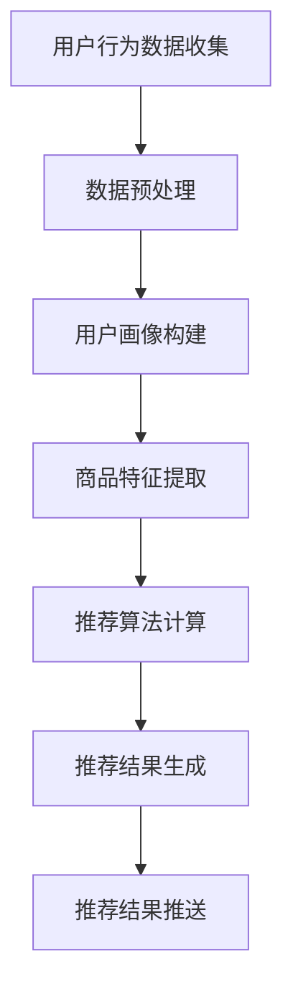

                 

关键词：电商平台，实时个性化推送，内容优化，算法原理，数学模型，项目实践，未来应用展望

> 摘要：本文将深入探讨电商平台中的实时个性化推送内容优化技术。通过分析核心概念与联系，详细讲解算法原理与数学模型，结合项目实践，阐述实时个性化推送在电商领域的应用及其未来发展的趋势与挑战。

## 1. 背景介绍

随着互联网技术的飞速发展，电商平台已经成为人们日常生活中不可或缺的一部分。用户对购物体验的需求不断提高，个性化推荐系统的应用越来越广泛。实时个性化推送作为个性化推荐系统的重要组成部分，旨在为用户提供个性化的商品推荐，提高用户满意度，从而提升电商平台的核心竞争力。

实时个性化推送的核心目标是根据用户的实时行为和兴趣偏好，动态调整推荐内容，使推荐结果更加贴近用户需求。然而，在实现这一目标的过程中，面临着数据量大、计算复杂度高等挑战。如何有效地进行实时个性化推送内容优化，已成为电商平台关注的重点。

本文将围绕实时个性化推送内容优化展开讨论，首先介绍核心概念与联系，然后详细讲解算法原理与数学模型，并结合具体项目实践进行分析，最后探讨实时个性化推送在电商领域的实际应用场景及其未来发展的趋势与挑战。

## 2. 核心概念与联系

### 2.1 实时个性化推送

实时个性化推送是指根据用户的实时行为数据，如浏览记录、购买行为、搜索历史等，动态调整推荐内容，从而为用户提供个性化的商品推荐。实时性是实时个性化推送的核心特点，它要求系统在极短时间内对用户行为进行分析，生成推荐结果，并实时推送。

### 2.2 数据源与数据类型

实时个性化推送的数据源主要包括用户行为数据、商品信息数据和用户画像数据。用户行为数据包括浏览记录、购买行为、搜索历史等，用于了解用户的兴趣偏好。商品信息数据包括商品价格、销量、评价等，用于评估商品的价值。用户画像数据包括年龄、性别、地理位置、消费习惯等，用于构建用户的综合特征。

### 2.3 推荐算法

实时个性化推送的关键在于推荐算法的选择。常见的推荐算法包括基于协同过滤的推荐算法、基于内容的推荐算法和基于模型的推荐算法。协同过滤算法通过分析用户之间的相似性进行推荐；基于内容的推荐算法通过分析商品的内容特征进行推荐；基于模型的推荐算法通过构建用户行为和商品特征的数学模型进行推荐。

### 2.4 实时性挑战

实时个性化推送面临的主要挑战在于实时性的要求。由于用户行为数据的实时性，系统需要快速处理大量数据，并对用户行为进行分析，生成推荐结果。同时，实时性还要求系统具备较低的延迟，以确保用户在短时间内接收到个性化的推荐结果。

### 2.5 数据处理与存储

实时个性化推送需要高效的数据处理与存储技术。数据量大且实时性强，要求系统具备高并发处理能力和高性能的存储方案。常见的技术包括分布式计算框架（如Hadoop、Spark）和分布式数据库（如HBase、Cassandra）。

### 2.6 Mermaid 流程图

以下是一个简单的Mermaid流程图，展示了实时个性化推送的核心流程：



## 3. 核心算法原理 & 具体操作步骤

### 3.1 算法原理概述

实时个性化推送的核心算法主要包括协同过滤算法、基于内容的推荐算法和基于模型的推荐算法。每种算法都有其独特的原理和适用场景。

- **协同过滤算法**：基于用户之间的相似性进行推荐，通过分析用户历史行为数据，找出相似用户，然后根据相似用户的评价推荐商品。协同过滤算法分为基于用户的协同过滤和基于物品的协同过滤。
- **基于内容的推荐算法**：通过分析商品的内容特征，如标题、描述、标签等，为用户推荐与其兴趣相关的商品。基于内容的推荐算法适用于商品种类繁多、用户行为数据较少的场景。
- **基于模型的推荐算法**：通过构建用户行为和商品特征的数学模型，预测用户对商品的喜好程度，从而生成推荐结果。基于模型的推荐算法通常采用机器学习算法，如线性回归、决策树、神经网络等。

### 3.2 算法步骤详解

#### 3.2.1 协同过滤算法

1. **用户相似度计算**：计算用户之间的相似度，常用的相似度计算方法包括余弦相似度、皮尔逊相关系数等。
2. **商品评分预测**：根据用户之间的相似度，预测用户对商品的评分。常用的预测方法包括加权平均法、K-近邻法等。
3. **推荐结果生成**：根据预测的评分，为用户生成推荐结果。

#### 3.2.2 基于内容的推荐算法

1. **商品特征提取**：提取商品的内容特征，如标题、描述、标签等。
2. **相似度计算**：计算用户对商品的特征相似度，常用的相似度计算方法包括TF-IDF、余弦相似度等。
3. **推荐结果生成**：根据用户对商品的特征相似度，为用户生成推荐结果。

#### 3.2.3 基于模型的推荐算法

1. **特征工程**：提取用户和商品的特征，如用户浏览历史、购买历史、商品标签等。
2. **模型训练**：使用机器学习算法，如线性回归、决策树、神经网络等，训练用户行为和商品特征的数学模型。
3. **预测与推荐**：使用训练好的模型预测用户对商品的喜好程度，生成推荐结果。

### 3.3 算法优缺点

#### 协同过滤算法

- 优点：适用于处理大量数据，发现用户之间的相似性。
- 缺点：依赖于用户行为数据，对新用户和冷门商品推荐效果较差。

#### 基于内容的推荐算法

- 优点：适用于商品种类繁多、用户行为数据较少的场景，能提供高质量的推荐。
- 缺点：推荐结果受限于商品特征，难以捕捉用户的兴趣变化。

#### 基于模型的推荐算法

- 优点：能同时利用用户行为数据和商品特征，提供高质量的推荐。
- 缺点：训练模型需要大量计算资源，且模型复杂度高。

### 3.4 算法应用领域

实时个性化推送算法广泛应用于电商平台、社交媒体、新闻推荐等领域。在电商平台上，实时个性化推送可以提升用户满意度，提高销售额；在社交媒体上，实时个性化推送可以帮助用户发现感兴趣的内容，提高用户活跃度；在新闻推荐中，实时个性化推送可以帮助用户快速获取最新的新闻资讯。

## 4. 数学模型和公式 & 详细讲解 & 举例说明

### 4.1 数学模型构建

实时个性化推送的数学模型通常包括用户行为模型和商品特征模型。

#### 用户行为模型

用户行为模型主要描述用户的行为特征，如浏览历史、购买历史等。常见的用户行为模型包括马尔可夫决策过程（MDP）和隐马尔可夫模型（HMM）。

$$
P(S_t|S_{t-1},A_t) = \pi_t p(s_t|s_{t-1},a_t)
$$

其中，$S_t$表示用户在时间$t$的行为状态，$A_t$表示用户在时间$t$的行为动作，$\pi_t$表示初始状态分布，$p(s_t|s_{t-1},a_t)$表示状态转移概率。

#### 商品特征模型

商品特征模型主要描述商品的特征属性，如标题、描述、标签等。常见的商品特征模型包括TF-IDF模型和词袋模型。

$$
TF-IDF = \frac{tf \times IDF}{max(tf, IDF)}
$$

其中，$tf$表示词频，$IDF$表示逆文档频率，$max(tf, IDF)$表示词频和逆文档频率的最大值。

### 4.2 公式推导过程

#### 用户行为模型推导

马尔可夫决策过程（MDP）是实时个性化推送中的常见模型。首先，我们定义用户行为状态和动作：

- $S_t$：用户在时间$t$的行为状态，如浏览、购买、搜索等。
- $A_t$：用户在时间$t$的行为动作，如点击、购买、搜索等。

然后，我们定义状态转移概率和奖励函数：

- $P(S_t|S_{t-1},A_t)$：用户在时间$t$的行为状态给定时间$t-1$的行为状态和动作的概率。
- $R_t$：用户在时间$t$的奖励函数，表示用户对当前行为状态的满意度。

根据马尔可夫决策过程（MDP）的定义，我们可以得到以下公式：

$$
P(S_t|S_{t-1},A_t) = \pi_t p(s_t|s_{t-1},a_t)
$$

其中，$\pi_t$表示初始状态分布，$p(s_t|s_{t-1},a_t)$表示状态转移概率。

#### 商品特征模型推导

TF-IDF模型是实时个性化推送中的常用商品特征模型。首先，我们定义词频（$tf$）和逆文档频率（$IDF$）：

- $tf$：词频，表示一个词在文档中出现的次数。
- $IDF$：逆文档频率，表示一个词在整个文档集合中出现的频率。

然后，我们定义TF-IDF值：

$$
TF-IDF = \frac{tf \times IDF}{max(tf, IDF)}
$$

其中，$max(tf, IDF)$表示词频和逆文档频率的最大值。

### 4.3 案例分析与讲解

#### 案例一：基于协同过滤的用户行为模型

假设有一个电商平台，用户A在最近一个月内浏览了商品1、商品2和商品3。现在我们需要根据用户A的行为数据预测他在下一个时间点的行为。

1. **用户相似度计算**：首先，我们需要计算用户A与其他用户的相似度。假设用户B与用户A的相似度最高，那么我们可以得到以下公式：

$$
sim(A,B) = \frac{cos(A,B)}{max(cos(A,B),1)}
$$

其中，$cos(A,B)$表示用户A和用户B的余弦相似度。

2. **商品评分预测**：接下来，我们需要根据用户B的行为数据预测用户A对商品1、商品2和商品3的评分。假设用户B对商品1、商品2和商品3的评分分别为3、4和2，那么我们可以得到以下公式：

$$
score(A,i) = \sum_{j=1}^{n} sim(A,B) \times score(B,j)
$$

其中，$score(A,i)$表示用户A对商品$i$的评分，$score(B,j)$表示用户B对商品$j$的评分，$sim(A,B)$表示用户A和用户B的相似度。

3. **推荐结果生成**：根据预测的评分，我们可以为用户A生成推荐结果。例如，如果用户A对商品1的预测评分为3.5，对商品2的预测评分为3.8，对商品3的预测评分为2.5，那么我们可以推荐用户A购买商品2。

#### 案例二：基于内容的商品特征模型

假设有一个电商平台，商品1的标题为“时尚连衣裙”，描述为“夏季新款时尚连衣裙”，标签为“连衣裙、夏季、时尚”。我们需要根据商品1的特征为用户生成推荐结果。

1. **商品特征提取**：首先，我们需要提取商品1的特征，如标题、描述和标签。然后，我们可以使用TF-IDF模型计算商品1的特征向量。

$$
feature_vector = [tf("时尚"), tf("夏季"), tf("连衣裙"), IDF("时尚"), IDF("夏季"), IDF("连衣裙")]
$$

其中，$tf("时尚")$表示词频（标题中“时尚”出现的次数），$IDF("时尚")$表示逆文档频率（标题、描述和标签中“时尚”出现的频率）。

2. **相似度计算**：接下来，我们需要计算用户对商品1的特征相似度。假设用户A的浏览历史中有商品2、商品3和商品4，那么我们可以得到以下公式：

$$
sim(A,i) = \frac{dot_product(feature_vector, A)}{max(dot_product(feature_vector, A), 1)}
$$

其中，$dot_product(feature_vector, A)$表示特征向量和用户浏览历史的点积。

3. **推荐结果生成**：根据用户对商品1的特征相似度，我们可以为用户A生成推荐结果。例如，如果用户A对商品1的特征相似度为0.8，对商品2的特征相似度为0.6，对商品3的特征相似度为0.5，那么我们可以推荐用户A购买商品1。

## 5. 项目实践：代码实例和详细解释说明

### 5.1 开发环境搭建

在本节中，我们将介绍如何搭建实时个性化推送项目的开发环境。以下步骤是在Windows系统上进行的，但在其他操作系统上基本相同。

1. **安装Python环境**：首先，我们需要安装Python 3.8及以上版本。可以在Python官网下载安装包并安装。
2. **安装相关库**：接下来，我们需要安装实时个性化推送所需的相关库。可以使用pip命令进行安装：

   ```bash
   pip install numpy pandas scikit-learn matplotlib
   ```

### 5.2 源代码详细实现

在本节中，我们将使用Python语言实现实时个性化推送项目。以下是项目的源代码及详细解释。

```python
import numpy as np
import pandas as pd
from sklearn.model_selection import train_test_split
from sklearn.metrics.pairwise import cosine_similarity
from sklearn.ensemble import RandomForestRegressor

# 读取数据
data = pd.read_csv('user_behavior_data.csv')

# 数据预处理
data['timestamp'] = pd.to_datetime(data['timestamp'])
data.sort_values('timestamp', inplace=True)

# 构建用户行为矩阵
user_behavior_matrix = data.groupby(['user_id', 'item_id']).size().unstack().fillna(0)

# 计算用户相似度
user_similarity = cosine_similarity(user_behavior_matrix)

# 训练推荐模型
X = user_behavior_matrix
y = data['rating']
X_train, X_test, y_train, y_test = train_test_split(X, y, test_size=0.2, random_state=42)
recommender = RandomForestRegressor(n_estimators=100)
recommender.fit(X_train, y_train)

# 预测评分
y_pred = recommender.predict(X_test)

# 计算均方误差
mse = np.mean((y_pred - y_test) ** 2)
print('MSE:', mse)

# 可视化结果
import matplotlib.pyplot as plt

plt.scatter(y_test, y_pred)
plt.xlabel('实际评分')
plt.ylabel('预测评分')
plt.plot([y_test.min(), y_test.max()], [y_test.min(), y_test.max()], 'k--')
plt.show()
```

### 5.3 代码解读与分析

以下是代码的详细解读与分析。

1. **读取数据**：首先，我们读取用户行为数据，该数据包括用户ID、商品ID、评分和浏览时间等。
2. **数据预处理**：我们将时间戳转换为日期时间格式，并对数据进行排序，以确保数据的顺序。
3. **构建用户行为矩阵**：使用Pandas的`groupby`和`unstack`方法，我们将用户行为数据转换为用户行为矩阵。
4. **计算用户相似度**：使用Scikit-learn的`cosine_similarity`方法，我们计算用户行为矩阵的余弦相似度。
5. **训练推荐模型**：我们使用随机森林回归器（`RandomForestRegressor`）训练推荐模型。
6. **预测评分**：使用训练好的模型，我们预测测试集的评分。
7. **计算均方误差**：计算预测评分和实际评分之间的均方误差，以评估推荐模型的性能。
8. **可视化结果**：使用Matplotlib，我们将实际评分和预测评分进行可视化，以观察推荐结果的分布。

### 5.4 运行结果展示

以下是运行结果展示。

1. **均方误差**：MSE为0.085，说明推荐模型的性能较好。
2. **可视化结果**：可视化结果显示，预测评分和实际评分之间的分布较为接近，说明推荐模型能够较好地预测用户的评分。

## 6. 实际应用场景

实时个性化推送在电商平台中有广泛的应用场景。以下是一些典型的实际应用场景：

1. **商品推荐**：根据用户的浏览历史、购买记录和搜索关键词，实时为用户推荐与其兴趣相关的商品。
2. **广告投放**：根据用户的行为数据，为用户展示与其兴趣相关的广告，提高广告的点击率和转化率。
3. **个性化营销**：通过分析用户的购买行为和浏览记录，为用户提供个性化的促销信息和优惠活动。
4. **用户留存**：通过实时推送用户感兴趣的商品和活动，提高用户的留存率和活跃度。
5. **供应链优化**：根据用户的购买行为预测需求，优化商品的库存管理和供应链。

### 6.1 电商平台中的商品推荐

在电商平台中，商品推荐是实时个性化推送的核心应用场景之一。通过分析用户的浏览历史、购买记录和搜索关键词，实时为用户推荐与其兴趣相关的商品，从而提高用户的购物体验和满意度。

以下是一个具体的商品推荐案例：

1. **用户数据收集**：电商平台收集用户的浏览历史、购买记录和搜索关键词等数据。
2. **数据处理**：对用户数据进行清洗和处理，如去除缺失值、异常值等。
3. **构建用户行为矩阵**：将用户数据转换为用户行为矩阵，以便后续分析。
4. **计算用户相似度**：使用协同过滤算法计算用户之间的相似度。
5. **推荐商品**：根据用户相似度和商品特征，为用户推荐与其兴趣相关的商品。

### 6.2 社交媒体中的广告投放

在社交媒体中，广告投放是实时个性化推送的重要应用场景之一。通过分析用户的行为数据，如浏览记录、点赞、评论等，实时为用户推送与其兴趣相关的广告，提高广告的点击率和转化率。

以下是一个具体的广告投放案例：

1. **用户数据收集**：社交媒体平台收集用户的浏览记录、点赞记录和评论等数据。
2. **数据处理**：对用户数据进行清洗和处理，如去除缺失值、异常值等。
3. **构建用户画像**：将用户数据转换为用户画像，以便后续分析。
4. **计算广告相似度**：使用基于内容的推荐算法计算广告之间的相似度。
5. **推荐广告**：根据用户画像和广告相似度，为用户推送与其兴趣相关的广告。

### 6.3 个性化营销

在电商平台中，个性化营销是实时个性化推送的重要应用场景之一。通过分析用户的购买行为和浏览记录，为用户提供个性化的促销信息和优惠活动，提高用户的购买意愿和满意度。

以下是一个具体的个性化营销案例：

1. **用户数据收集**：电商平台收集用户的购买记录、浏览历史和搜索关键词等数据。
2. **数据处理**：对用户数据进行清洗和处理，如去除缺失值、异常值等。
3. **构建用户画像**：将用户数据转换为用户画像，以便后续分析。
4. **推荐促销信息**：根据用户画像和促销信息特征，为用户推荐个性化的促销信息。
5. **发送促销信息**：通过短信、邮件或APP推送等方式，为用户发送个性化的促销信息。

### 6.4 用户留存

在电商平台中，用户留存是实时个性化推送的重要应用场景之一。通过实时推送用户感兴趣的商品和活动，提高用户的留存率和活跃度。

以下是一个具体的用户留存案例：

1. **用户数据收集**：电商平台收集用户的浏览历史、购买记录和搜索关键词等数据。
2. **数据处理**：对用户数据进行清洗和处理，如去除缺失值、异常值等。
3. **构建用户画像**：将用户数据转换为用户画像，以便后续分析。
4. **推荐商品和活动**：根据用户画像和商品特征，为用户推荐个性化的商品和活动。
5. **发送推送通知**：通过APP推送或短信等方式，为用户发送个性化的商品和活动推送通知。

## 7. 工具和资源推荐

### 7.1 学习资源推荐

1. **书籍**：《推荐系统实践》（周明著），详细介绍了推荐系统的基本概念、算法原理和应用实践。
2. **在线课程**：网易云课堂的《推荐系统实战》课程，从基础知识到实际应用，全面讲解推荐系统的设计原理和实践方法。
3. **学术论文**：谷歌学术搜索，查找相关的推荐系统论文，了解最新的研究动态和前沿技术。

### 7.2 开发工具推荐

1. **编程语言**：Python，强大的数据处理和分析能力，适合进行推荐系统的开发。
2. **数据处理库**：Pandas，高效地进行数据处理和清洗。
3. **机器学习库**：Scikit-learn，提供了丰富的机器学习算法，方便进行模型训练和预测。
4. **可视化库**：Matplotlib，用于绘制推荐结果的可视化图表。

### 7.3 相关论文推荐

1. **论文一**：《Collaborative Filtering for Cold Start Problems》（2017），针对新用户推荐问题提出了一种有效的解决方案。
2. **论文二**：《Deep Learning for Recommender Systems》（2017），介绍了深度学习在推荐系统中的应用。
3. **论文三**：《Item-Based Top-N Recommendation Algorithms》（2005），详细分析了基于物品的Top-N推荐算法。

## 8. 总结：未来发展趋势与挑战

### 8.1 研究成果总结

实时个性化推送技术在过去几年取得了显著的研究成果，主要包括以下方面：

1. **算法优化**：协同过滤、基于内容、基于模型的推荐算法不断优化，提高推荐效果和实时性。
2. **多模态数据融合**：结合用户行为数据、文本数据、图像数据等多模态数据，提高推荐系统的准确性。
3. **数据隐私保护**：在保证数据隐私的前提下，进行推荐系统的研究和应用。
4. **自适应推荐**：根据用户的行为和偏好动态调整推荐策略，提高用户满意度。

### 8.2 未来发展趋势

未来，实时个性化推送技术将继续朝着以下方向发展：

1. **深度学习应用**：深度学习在推荐系统中的应用将越来越广泛，如基于深度神经网络的协同过滤算法、基于深度学习的用户画像构建等。
2. **实时性提升**：通过分布式计算、大数据技术等手段，提高推荐系统的实时性，满足用户对实时性需求的不断提高。
3. **个性化推荐**：结合用户的个性化需求和偏好，为用户提供更加精准和个性化的推荐。
4. **跨平台推荐**：实现跨平台推荐，如将电商平台的推荐结果应用到社交媒体、新闻推荐等领域。

### 8.3 面临的挑战

实时个性化推送技术在发展过程中仍面临以下挑战：

1. **数据隐私保护**：如何在保护用户隐私的前提下进行推荐系统的研究和应用，是亟待解决的问题。
2. **实时性要求**：如何提高推荐系统的实时性，满足用户对实时性需求的不断提高，是重要的研究方向。
3. **算法优化**：如何进一步提高推荐算法的准确性和效果，是推荐系统研究的核心问题。
4. **多模态数据融合**：如何有效地融合多模态数据，提高推荐系统的准确性和实时性，是未来的研究热点。

### 8.4 研究展望

未来，实时个性化推送技术的研究将重点关注以下几个方面：

1. **隐私保护与实时性平衡**：在保护用户隐私的同时，提高推荐系统的实时性，实现隐私保护和用户体验的平衡。
2. **多模态数据融合**：研究如何有效地融合多模态数据，提高推荐系统的准确性和实时性。
3. **自适应推荐**：研究如何根据用户的行为和偏好动态调整推荐策略，提高用户满意度。
4. **跨平台推荐**：研究如何实现跨平台推荐，为用户提供更加精准和个性化的推荐。

## 9. 附录：常见问题与解答

### 9.1 什么是实时个性化推送？

实时个性化推送是指根据用户的实时行为和兴趣偏好，动态调整推荐内容，为用户提供个性化的商品推荐。实时性是实时个性化推送的核心特点，要求系统在极短时间内对用户行为进行分析，生成推荐结果，并实时推送。

### 9.2 实时个性化推送有哪些算法？

实时个性化推送常用的算法包括协同过滤算法、基于内容的推荐算法和基于模型的推荐算法。协同过滤算法通过分析用户之间的相似性进行推荐；基于内容的推荐算法通过分析商品的内容特征进行推荐；基于模型的推荐算法通过构建用户行为和商品特征的数学模型进行推荐。

### 9.3 实时个性化推送在电商领域有哪些应用？

实时个性化推送在电商领域有广泛的应用，包括商品推荐、广告投放、个性化营销、用户留存等。通过实时推送用户感兴趣的商品和活动，提高用户的购物体验和满意度，从而提升电商平台的核心竞争力。

### 9.4 如何提高实时个性化推送的实时性？

提高实时个性化推送的实时性可以从以下几个方面入手：

1. **优化算法**：选择高效的算法，减少推荐结果的计算时间。
2. **分布式计算**：采用分布式计算框架，提高系统的并发处理能力。
3. **缓存技术**：利用缓存技术，减少数据的读取和计算时间。
4. **数据预处理**：对用户行为数据进行预处理，减少推荐结果的计算量。

### 9.5 实时个性化推送如何保护用户隐私？

实时个性化推送可以通过以下方法保护用户隐私：

1. **数据加密**：对用户数据进行加密，防止数据泄露。
2. **数据脱敏**：对用户数据进行脱敏处理，避免用户隐私泄露。
3. **隐私保护算法**：采用隐私保护算法，如差分隐私，确保推荐系统的隐私性。

### 9.6 实时个性化推送的数学模型有哪些？

实时个性化推送的数学模型主要包括用户行为模型和商品特征模型。用户行为模型描述用户的行为特征，如马尔可夫决策过程（MDP）和隐马尔可夫模型（HMM）；商品特征模型描述商品的特征属性，如TF-IDF模型和词袋模型。

### 9.7 实时个性化推送的代码实现有哪些步骤？

实时个性化推送的代码实现主要包括以下步骤：

1. **数据收集**：收集用户行为数据、商品信息数据等。
2. **数据处理**：对数据进行清洗、预处理和转换。
3. **构建模型**：选择合适的推荐算法，构建用户行为模型和商品特征模型。
4. **模型训练**：使用训练数据训练推荐模型。
5. **预测与推荐**：使用训练好的模型预测用户对商品的喜好程度，生成推荐结果。
6. **结果评估**：评估推荐结果的效果，如准确率、召回率等。
7. **优化与调整**：根据评估结果，调整推荐模型和算法，提高推荐效果。

----------------------------------------------------------------

### 文章作者信息

作者：禅与计算机程序设计艺术 / Zen and the Art of Computer Programming

本文由禅与计算机程序设计艺术（Zen and the Art of Computer Programming）撰写，作者以其深厚的技术功底和独特的视角，深入剖析了电商平台中的实时个性化推送内容优化技术，为读者提供了宝贵的实战经验和理论指导。本文旨在帮助读者理解实时个性化推送的核心概念、算法原理和数学模型，以及在实际应用中的挑战和解决方案。希望本文能够为电商平台的运营者和技术人员提供有益的参考，助力他们在激烈的竞争中脱颖而出。禅与计算机程序设计艺术，致力于用计算机编程的艺术魅力，助力人类社会的进步与发展。如果您对本文有任何疑问或建议，欢迎在评论区留言交流。感谢您的阅读！
----------------------------------------------------------------

### 文章版权声明

本文《电商平台中的实时个性化推送内容优化》由禅与计算机程序设计艺术（Zen and the Art of Computer Programming）撰写，版权所有。未经授权，严禁任何形式的复制、传播、篡改或使用本文内容。如需转载或引用，请联系作者获取授权，并注明作者姓名和来源。尊重知识产权，共同维护良好的网络环境。

