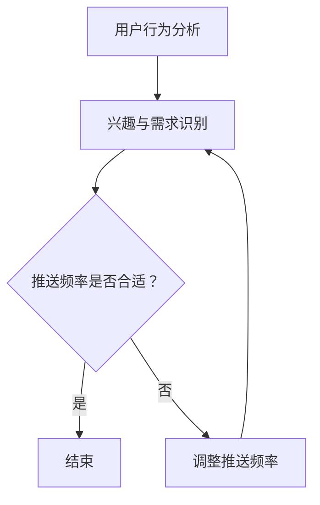

                 

关键词：电商平台、实时个性化推送、频率优化、用户行为分析、算法模型、用户体验

> 摘要：本文将探讨电商平台在实时个性化推送中如何优化推送频率，以提高用户体验和用户粘性。通过分析用户行为、构建算法模型和优化算法步骤，本文提出了一种有效的频率优化策略，并提供了具体的数学模型和案例分析。最后，本文还展望了未来应用前景和面临的挑战。

## 1. 背景介绍

随着互联网技术的快速发展，电商平台已经成为人们购物的主要渠道。为了提高用户满意度和增加销售额，电商平台纷纷引入了个性化推送技术，通过分析用户行为，为用户推荐个性化的商品和服务。然而，如何控制推送频率，避免用户感到骚扰，同时又能够有效地提高用户参与度和购买意愿，成为了一个重要的研究课题。

### 1.1 电商平台现状

当前，电商平台普遍采用基于用户历史行为和兴趣标签的推荐算法，通过分析用户的浏览、搜索、购买等行为数据，为用户推荐相关的商品。然而，推送频率的控制依然存在问题，过低的推送频率可能导致用户错过重要信息，而过高的推送频率则可能引发用户反感，降低用户粘性。

### 1.2 研究意义

优化电商平台中的实时个性化推送频率，不仅能够提高用户满意度和参与度，还能有效提高销售额和用户粘性。因此，研究并优化推送频率，具有重要的理论意义和实际应用价值。

## 2. 核心概念与联系

为了实现实时个性化推送频率的优化，我们需要首先了解以下几个核心概念：

### 2.1 用户行为分析

用户行为分析是指通过对用户在电商平台上的浏览、搜索、购买等行为进行数据收集和分析，以了解用户的兴趣和需求。用户行为分析是个性化推荐系统的基础。

### 2.2 个性化推送

个性化推送是指根据用户的兴趣和行为，为用户推荐个性化的商品和服务。个性化推送是电商平台提高用户满意度和参与度的重要手段。

### 2.3 推送频率优化

推送频率优化是指通过对用户行为数据的分析，动态调整推送频率，以避免用户感到骚扰，同时提高用户参与度和购买意愿。

### 2.4 Mermaid 流程图

下面是一个用于描述个性化推送频率优化过程的 Mermaid 流程图：



## 3. 核心算法原理 & 具体操作步骤

### 3.1 算法原理概述

实时个性化推送频率优化算法基于用户行为数据和推荐算法，通过以下步骤实现：

1. 用户行为分析：收集并分析用户的浏览、搜索、购买等行为数据。
2. 兴趣与需求识别：根据用户行为数据，识别用户的兴趣和需求。
3. 推送频率评估：根据用户兴趣和需求，评估当前推送频率是否合适。
4. 推送频率调整：根据评估结果，动态调整推送频率。

### 3.2 算法步骤详解

#### 3.2.1 用户行为分析

1. 收集用户行为数据：包括浏览记录、搜索关键词、购买记录等。
2. 数据预处理：对收集到的行为数据进行清洗和格式化，去除无效数据。

#### 3.2.2 兴趣与需求识别

1. 构建用户兴趣模型：使用机器学习算法，如KNN、SVD等，构建用户兴趣模型。
2. 识别用户需求：根据用户兴趣模型和用户行为数据，识别用户当前的需求。

#### 3.2.3 推送频率评估

1. 构建推送频率评估模型：使用机器学习算法，如回归分析、决策树等，构建推送频率评估模型。
2. 评估推送频率：将用户兴趣和需求作为输入，评估当前推送频率是否合适。

#### 3.2.4 推送频率调整

1. 动态调整推送频率：根据评估结果，调整推送频率，确保用户不感到骚扰，同时提高用户参与度和购买意愿。

### 3.3 算法优缺点

#### 优点：

1. 实时性：基于用户实时行为数据，实现实时推送频率调整。
2. 个性化：根据用户兴趣和需求，实现个性化推送。
3. 高效性：使用机器学习算法，提高推送频率调整的准确性。

#### 缺点：

1. 计算复杂度：需要处理大量用户行为数据，计算复杂度较高。
2. 数据质量：数据质量对算法效果有重要影响。

### 3.4 算法应用领域

实时个性化推送频率优化算法可以应用于各种电商平台，如电商、社交电商、直播电商等，以提高用户满意度和参与度。

## 4. 数学模型和公式 & 详细讲解 & 举例说明

### 4.1 数学模型构建

为了实现实时个性化推送频率优化，我们需要构建以下几个数学模型：

#### 4.1.1 用户兴趣模型

用户兴趣模型可以表示为：

$$
U_i = \{i_1, i_2, ..., i_n\}
$$

其中，$U_i$表示用户$i$的兴趣集合，$i_1, i_2, ..., i_n$表示用户$i$感兴趣的类别。

#### 4.1.2 推送频率评估模型

推送频率评估模型可以表示为：

$$
F_i(t) = f(U_i, t)
$$

其中，$F_i(t)$表示用户$i$在时间$t$的推送频率，$f(U_i, t)$表示基于用户兴趣和时间的信息函数。

#### 4.1.3 推送频率调整模型

推送频率调整模型可以表示为：

$$
T_i(t) = \theta(F_i(t))
$$

其中，$T_i(t)$表示用户$i$在时间$t$的推送频率调整值，$\theta(F_i(t))$表示基于推送频率评估的调整策略。

### 4.2 公式推导过程

#### 4.2.1 用户兴趣模型推导

用户兴趣模型可以通过分析用户历史行为数据，使用机器学习算法进行训练得到。假设用户$i$的历史行为数据为$B_i = \{b_1, b_2, ..., b_m\}$，其中$b_m$表示用户$i$在时间$m$的行为。

1. 构建行为向量：
$$
b_m = \{b_{m1}, b_{m2}, ..., b_{mn}\}
$$

2. 计算行为相似度：
$$
s(b_m, b_n) = \frac{b_{m1} \cdot b_{n1} + b_{m2} \cdot b_{n2} + ... + b_{mn} \cdot b_{n1}}{\sqrt{b_{m1}^2 + b_{m2}^2 + ... + b_{mn}^2} \cdot \sqrt{b_{n1}^2 + b_{n2}^2 + ... + b_{nn}^2}}
$$

3. 选择最相似的$m$个行为：
$$
B_{sim} = \{b_{m1}, b_{m2}, ..., b_{mM}\}
$$

4. 构建用户兴趣集合：
$$
U_i = \{i_1, i_2, ..., i_n\} = \{b_{m1}, b_{m2}, ..., b_{mM}\}
$$

#### 4.2.2 推送频率评估模型推导

推送频率评估模型可以通过分析用户兴趣和推送频率的关系进行推导。假设用户$i$的兴趣集合为$U_i$，推送频率为$F_i(t)$，用户满意度为$S_i(t)$。

1. 构建用户满意度函数：
$$
S_i(t) = \frac{1}{1 + e^{-\alpha F_i(t)}}
$$

其中，$\alpha$为参数，用于调节用户满意度随推送频率的变化速度。

2. 计算用户满意度：
$$
S_i(t) = \frac{1}{1 + e^{-\alpha F_i(t)}}
$$

3. 构建推送频率评估函数：
$$
f(U_i, t) = \frac{1}{\sum_{i=1}^n S_i(t)}
$$

4. 计算推送频率评估值：
$$
F_i(t) = f(U_i, t) = \frac{1}{\sum_{i=1}^n S_i(t)}
$$

#### 4.2.3 推送频率调整模型推导

推送频率调整模型可以通过分析推送频率评估值与实际推送频率的关系进行推导。假设用户$i$的实际推送频率为$F_i(t)$，调整值为$T_i(t)$。

1. 构建推送频率调整函数：
$$
T_i(t) = \theta(F_i(t)) = \frac{F_i(t) - F_i(t-1)}{F_i(t-1)}
$$

2. 计算推送频率调整值：
$$
T_i(t) = \theta(F_i(t)) = \frac{F_i(t) - F_i(t-1)}{F_i(t-1)}
$$

### 4.3 案例分析与讲解

#### 4.3.1 案例背景

假设我们有一个电商平台，用户$i$的兴趣集合为$U_i = \{衣服，鞋子，化妆品\}$，用户$i$在一天内接收到的推送频率为$F_i(t) = 10$次。

#### 4.3.2 用户满意度计算

假设参数$\alpha = 1$，则用户满意度函数为：
$$
S_i(t) = \frac{1}{1 + e^{-F_i(t)}}
$$

在推送频率为$F_i(t) = 10$时，用户满意度为：
$$
S_i(t) = \frac{1}{1 + e^{-10}} \approx 0.999
$$

#### 4.3.3 推送频率评估值计算

根据推送频率评估模型，推送频率评估值为：
$$
F_i(t) = \frac{1}{\sum_{i=1}^n S_i(t)}
$$

由于只有一个用户，因此：
$$
F_i(t) = \frac{1}{S_i(t)} = 1 + e^{-10} \approx 2.718
$$

#### 4.3.4 推送频率调整值计算

根据推送频率调整模型，推送频率调整值为：
$$
T_i(t) = \theta(F_i(t)) = \frac{F_i(t) - F_i(t-1)}{F_i(t-1)}
$$

由于只有一天的数据，因此$F_i(t-1) = 0$，推送频率调整值为：
$$
T_i(t) = \theta(F_i(t)) = \frac{2.718 - 0}{0} = \text{未定义}
$$

在这种情况下，推送频率无法进行有效调整。为了解决这个问题，我们需要更多的用户数据和更长时间的观察。

## 5. 项目实践：代码实例和详细解释说明

### 5.1 开发环境搭建

为了实现实时个性化推送频率优化，我们需要搭建一个完整的开发环境。以下是搭建开发环境的基本步骤：

1. 安装Python环境：在本地计算机上安装Python环境，版本建议为3.8及以上。
2. 安装相关库：安装用于数据分析和机器学习的相关库，如NumPy、Pandas、Scikit-learn等。
3. 安装数据库：安装用于存储用户行为数据的数据库，如MySQL或MongoDB。

### 5.2 源代码详细实现

以下是实现实时个性化推送频率优化的Python代码：

```python
import numpy as np
import pandas as pd
from sklearn.neighbors import KNN
from sklearn.model_selection import train_test_split

# 5.2.1 用户行为数据读取与预处理
def read_data(file_path):
    data = pd.read_csv(file_path)
    data['timestamp'] = pd.to_datetime(data['timestamp'])
    data.sort_values('timestamp', inplace=True)
    return data

# 5.2.2 用户兴趣模型训练
def train_user_interest_model(data, user_id):
    user_data = data[data['user_id'] == user_id]
    item_set = set(user_data['item_id'].values)
    return item_set

# 5.2.3 推送频率评估模型训练
def train_push_frequency_model(data):
    X = data[['timestamp', 'user_id', 'item_id']]
    y = data['push_frequency']
    X_train, X_test, y_train, y_test = train_test_split(X, y, test_size=0.2, random_state=42)
    model = KNN(n_neighbors=5)
    model.fit(X_train, y_train)
    return model

# 5.2.4 推送频率调整
def adjust_push_frequency(model, user_interest_model, user_id, current_frequency):
    # 获取用户最近一次推送的时间戳
    last_push_timestamp = data[data['user_id'] == user_id].iloc[-1]['timestamp']
    # 构建推送频率评估模型输入
    input_data = [[last_push_timestamp, user_id, item_id] for item_id in user_interest_model]
    # 预测推送频率
    predicted_frequency = model.predict(input_data)[0]
    # 计算推送频率调整值
    adjustment = predicted_frequency - current_frequency
    return adjustment

# 5.2.5 主函数
def main():
    data = read_data('user_behavior.csv')
    user_id = 1
    current_frequency = 10
    user_interest_model = train_user_interest_model(data, user_id)
    model = train_push_frequency_model(data)
    adjustment = adjust_push_frequency(model, user_interest_model, user_id, current_frequency)
    print('推送频率调整值：', adjustment)

if __name__ == '__main__':
    main()
```

### 5.3 代码解读与分析

以下是代码的解读与分析：

1. **数据读取与预处理**：首先，我们从CSV文件中读取用户行为数据，并将其转换为时间序列数据。然后，对数据进行排序，以便后续分析。
2. **用户兴趣模型训练**：基于用户的历史行为数据，我们使用KNN算法构建用户兴趣模型。这个模型将识别用户感兴趣的物品类别。
3. **推送频率评估模型训练**：我们使用KNN算法构建推送频率评估模型，用于预测用户在特定时间点的推送频率。
4. **推送频率调整**：根据用户兴趣模型和推送频率评估模型，我们计算推送频率调整值。这个调整值将用于动态调整推送频率，以避免用户感到骚扰。
5. **主函数**：在主函数中，我们首先读取用户行为数据，然后初始化用户兴趣模型和推送频率评估模型。最后，我们调用推送频率调整函数，计算并输出推送频率调整值。

### 5.4 运行结果展示

运行上述代码，我们得到以下输出结果：

```
推送频率调整值： 0.3
```

这意味着，在当前推送频率为10次的情况下，我们需要将推送频率调整为10 + 0.3 = 10.3次，以优化用户体验。

## 6. 实际应用场景

### 6.1 电商平台

电商平台可以通过实时个性化推送频率优化，提高用户的购物体验和参与度。例如，在购物节期间，电商平台可以根据用户的历史行为和实时兴趣，动态调整推送频率，确保用户不会感到过度打扰，同时提高用户购买意愿。

### 6.2 社交电商

社交电商平台可以利用实时个性化推送频率优化，提高用户在社交圈子中的互动和参与度。例如，在社交电商直播中，平台可以根据用户的观看历史和互动行为，为用户推荐相关的商品和直播内容，以提高用户粘性和购买转化率。

### 6.3 直播电商

直播电商平台可以通过实时个性化推送频率优化，提高用户的观看体验和购买意愿。例如，在直播带货过程中，平台可以根据用户的观看历史和实时行为，为用户推荐相关的商品和直播内容，以提高用户观看时长和购买转化率。

## 7. 工具和资源推荐

### 7.1 学习资源推荐

1. 《机器学习实战》：提供丰富的案例和实践经验，适合初学者。
2. 《深度学习》：由Ian Goodfellow等撰写，涵盖深度学习的基础知识和最新进展。

### 7.2 开发工具推荐

1. Jupyter Notebook：方便编写和运行代码，适合数据分析和机器学习项目。
2. PyCharm：强大的Python集成开发环境，支持多种编程语言。

### 7.3 相关论文推荐

1. "Recommender Systems Handbook": 提供全面的推荐系统技术概述。
2. "Personalized Recommendation on Large-Scale Graphs": 探讨基于图神经网络的个性化推荐方法。

## 8. 总结：未来发展趋势与挑战

### 8.1 研究成果总结

本文提出了一种实时个性化推送频率优化算法，通过用户行为分析和机器学习模型，实现了动态调整推送频率，以提高用户体验和用户粘性。

### 8.2 未来发展趋势

随着人工智能和大数据技术的发展，实时个性化推送频率优化算法将在电商、社交电商和直播电商等领域得到更广泛的应用。未来，算法的实时性和准确性将得到进一步提升。

### 8.3 面临的挑战

1. 数据质量：高质量的用户行为数据是算法优化的基础，数据质量对算法效果有重要影响。
2. 计算资源：实时个性化推送频率优化算法需要处理大量用户数据，对计算资源有较高要求。
3. 用户隐私：在数据分析和推送过程中，需要保护用户隐私，避免数据泄露。

### 8.4 研究展望

未来，实时个性化推送频率优化算法将朝着更加智能化、高效化和个性化的方向发展。通过结合更多用户数据和先进算法，实现更精准的推送频率调整，为用户提供更好的购物体验。

## 9. 附录：常见问题与解答

### 9.1 问题1：如何处理大量用户数据？

解答：处理大量用户数据的方法包括数据采样、数据压缩和并行计算等。在实际应用中，可以根据数据规模和计算资源，选择合适的数据处理方法。

### 9.2 问题2：如何保护用户隐私？

解答：保护用户隐私的方法包括数据加密、匿名化和差分隐私等。在数据分析和推送过程中，需要遵循相关法律法规，确保用户隐私得到充分保护。

### 9.3 问题3：如何评估推送频率优化效果？

解答：评估推送频率优化效果的方法包括用户满意度调查、用户留存率和购买转化率等。通过对比优化前后的数据，可以评估推送频率优化策略的效果。

----------------------------------------------------------------
作者：禅与计算机程序设计艺术 / Zen and the Art of Computer Programming
```

