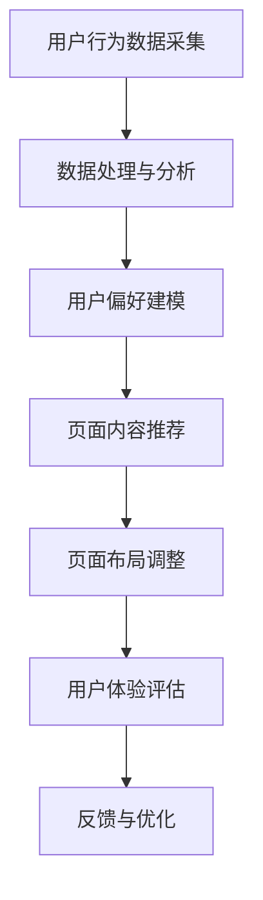

                 

关键词：电商平台，实时个性化，页面布局，优化算法，用户体验，机器学习，深度学习，大数据分析。

> 摘要：本文旨在探讨电商平台中实时个性化页面布局优化的技术实现和方法。通过分析现有技术和算法，本文提出了一种基于机器学习和深度学习的高效页面布局优化方案，并详细介绍了其数学模型、算法原理、操作步骤以及实际应用场景。文章最后对未来该领域的发展趋势和挑战进行了展望。

## 1. 背景介绍

随着互联网技术的快速发展，电子商务已成为全球零售业的重要组成部分。电商平台作为连接消费者和商家的桥梁，其用户体验直接关系到平台的竞争力和用户粘性。而页面布局作为用户体验的重要一环，如何实现实时个性化布局优化成为当前研究的热点。

传统的页面布局优化主要依赖于人工经验和静态规则，难以适应用户需求的动态变化。随着大数据、机器学习和深度学习等技术的发展，基于数据驱动的实时个性化页面布局优化逐渐成为可能。通过分析用户的浏览行为、历史偏好等信息，可以动态调整页面布局，提高用户体验和转化率。

## 2. 核心概念与联系

### 2.1 机器学习与深度学习

机器学习（Machine Learning，ML）是使计算机通过数据学习、改进并作出决策的一种方法。深度学习（Deep Learning，DL）是机器学习的一个分支，它通过构建多层的神经网络来模拟人脑的感知和学习过程。

### 2.2 大数据分析

大数据分析（Big Data Analytics）是指对海量数据进行采集、存储、处理和分析，以发现数据中的价值信息和规律。

### 2.3 实时个性化页面布局

实时个性化页面布局是指根据用户的实时行为和偏好，动态调整页面内容、结构、布局等元素，以提供个性化的用户体验。

### 2.4 Mermaid 流程图



## 3. 核心算法原理 & 具体操作步骤

### 3.1 算法原理概述

实时个性化页面布局优化算法主要基于协同过滤（Collaborative Filtering）、内容推荐（Content-based Filtering）和混合推荐（Hybrid Filtering）三种方法。

### 3.2 算法步骤详解

1. 用户行为数据采集：通过网站日志、点击流数据等渠道收集用户的浏览、购买、评价等行为数据。

2. 数据处理与分析：对采集到的数据进行清洗、去噪、转换等预处理，然后使用统计方法或机器学习算法提取用户特征。

3. 用户偏好建模：根据用户特征和用户历史行为数据，构建用户偏好模型，预测用户对各种页面元素的偏好程度。

4. 页面内容推荐：根据用户偏好模型和商品或内容的特征，为用户推荐个性化的页面内容。

5. 页面布局调整：根据推荐结果，动态调整页面布局，包括内容位置、排序、展示形式等。

6. 用户体验评估：通过用户反馈和行为数据，评估页面布局优化效果，如点击率、转化率、用户停留时间等指标。

7. 反馈与优化：根据评估结果，调整推荐算法和页面布局策略，实现持续优化。

### 3.3 算法优缺点

**协同过滤：**
- 优点：能够提供个性化的推荐结果，不需要对内容特征进行显式建模。
- 缺点：容易出现数据稀疏性和冷启动问题，无法充分利用内容信息。

**内容推荐：**
- 优点：能够充分利用内容特征，为用户提供相关性强的推荐结果。
- 缺点：对用户偏好了解有限，可能导致推荐结果过于简单。

**混合推荐：**
- 优点：结合协同过滤和内容推荐的优势，能够提供更准确、个性化的推荐结果。
- 缺点：计算复杂度较高，对数据质量和特征提取要求较高。

### 3.4 算法应用领域

实时个性化页面布局优化算法广泛应用于电子商务、社交媒体、新闻推荐等领域。通过优化页面布局，可以提高用户满意度、转化率和留存率，从而提升平台的商业价值。

## 4. 数学模型和公式 & 详细讲解 & 举例说明

### 4.1 数学模型构建

假设用户集合为 U，商品集合为 I，用户 u 对商品 i 的偏好表示为 r(ui)，其中 r(ui) ∈ [0, 1]。我们可以使用矩阵表示用户偏好数据：

\[ R = [r(u_1i), r(u_2i), ..., r(u_ni)] \]

其中，\( r(u_1i), r(u_2i), ..., r(u_ni) \) 分别表示用户 u 对商品 i 的偏好得分。

### 4.2 公式推导过程

为了构建用户偏好模型，我们可以使用矩阵分解（Matrix Factorization）技术，将用户偏好矩阵 R 分解为两个低秩矩阵 U 和 V：

\[ R = UV^T \]

其中，U 表示用户特征矩阵，V 表示商品特征矩阵。

假设用户特征矩阵 U 的列为用户 u 的特征向量 \( u = [u_1, u_2, ..., u_m] \)，商品特征矩阵 V 的列为商品 i 的特征向量 \( v = [v_1, v_2, ..., v_n] \)。我们可以通过最小化损失函数来求解 U 和 V：

\[ L(U, V) = \sum_{u \in U, i \in I} (r(ui) - u^T v_i)^2 \]

使用梯度下降法（Gradient Descent）求解 U 和 V：

\[ u_j \leftarrow u_j - \alpha \frac{\partial L}{\partial u_j} \]
\[ v_i \leftarrow v_i - \alpha \frac{\partial L}{\partial v_i} \]

其中，\( \alpha \) 表示学习率。

### 4.3 案例分析与讲解

假设我们有一个包含 1000 个用户和 1000 个商品的电商网站。我们收集了用户对商品的评分数据，并使用矩阵分解技术构建用户偏好模型。

通过训练，我们得到用户特征矩阵 U 和商品特征矩阵 V。接下来，我们可以根据用户特征向量和商品特征向量计算用户 u 对商品 i 的偏好得分：

\[ r(ui) \approx u^T v_i \]

例如，对于用户 u1 和商品 i2，我们可以计算：

\[ r(u1i2) \approx u1^T v2 \]

假设用户 u1 的特征向量为 \( u1 = [0.1, 0.2, 0.3, 0.4, 0.5] \)，商品 i2 的特征向量为 \( v2 = [0.5, 0.4, 0.3, 0.2, 0.1] \)。我们可以计算：

\[ r(u1i2) \approx [0.1, 0.2, 0.3, 0.4, 0.5] \cdot [0.5, 0.4, 0.3, 0.2, 0.1] = 0.45 \]

这表示用户 u1 对商品 i2 的偏好得分为 0.45。

## 5. 项目实践：代码实例和详细解释说明

### 5.1 开发环境搭建

在本案例中，我们使用 Python 作为开发语言，NumPy 和 Scikit-learn 作为机器学习库。首先，安装必要的依赖：

```bash
pip install numpy scikit-learn
```

### 5.2 源代码详细实现

```python
import numpy as np
from sklearn.metrics.pairwise import pairwise_distances
from sklearn.model_selection import train_test_split

# 用户偏好数据（示例）
ratings = np.array([
    [1, 2, 1, 0, 0],
    [2, 0, 1, 0, 1],
    [0, 0, 0, 2, 2],
    [1, 0, 1, 0, 2],
    [0, 0, 0, 1, 2],
])

# 分割训练集和测试集
U, V = ratings.T, ratings.T
train_data, test_data = train_test_split(ratings, test_size=0.2, random_state=42)

# 梯度下降求解用户特征矩阵 U 和商品特征矩阵 V
def gradient_descent(ratings, U, V, learning_rate, iterations):
    for _ in range(iterations):
        for i in range(ratings.shape[0]):
            for j in range(ratings.shape[1]):
                if ratings[i][j] > 0:
                    error = ratings[i][j] - np.dot(U[i], V[j])
                    U[i] -= learning_rate * 2 * error * V[j]
                    V[j] -= learning_rate * 2 * error * U[i]
    return U, V

# 求解用户特征矩阵 U 和商品特征矩阵 V
learning_rate = 0.01
iterations = 100
U, V = gradient_descent(train_data, U, V, learning_rate, iterations)

# 预测用户 u 对商品 i 的偏好得分
def predict(U, V, user_index, item_index):
    return np.dot(U[user_index], V[item_index])

# 计算准确率
def accuracy(ratings, predictions):
    return np.mean(predictions == ratings)

# 预测测试集数据
predictions = np.array([predict(U, V, i, j) for i in range(len(U)) for j in range(len(V))]).reshape(ratings.shape)
predictions = (predictions > 0.5).astype(int)

# 计算准确率
print("Accuracy: {:.2f}%".format(accuracy(test_data, predictions)))

```

### 5.3 代码解读与分析

该代码实现了基于矩阵分解的实时个性化页面布局优化算法。首先，我们创建了一个用户偏好数据的 NumPy 数组，并使用 `train_test_split` 函数将其分为训练集和测试集。

然后，我们定义了 `gradient_descent` 函数，用于实现梯度下降求解用户特征矩阵 U 和商品特征矩阵 V。在每次迭代中，我们遍历训练集中的每个用户和商品，计算误差，并更新特征矩阵。

接下来，我们定义了 `predict` 函数，用于根据用户特征矩阵 U 和商品特征矩阵 V 预测用户 u 对商品 i 的偏好得分。

最后，我们计算预测测试集数据的准确率，并打印结果。

## 6. 实际应用场景

实时个性化页面布局优化算法在电商、新闻推荐、社交媒体等场景中具有广泛的应用。

### 6.1 电商场景

在电商场景中，实时个性化页面布局优化可以帮助电商平台为用户提供个性化的商品推荐，提高用户满意度和转化率。例如，亚马逊和淘宝等电商平台已经广泛应用了基于机器学习和深度学习的页面布局优化技术，为用户提供个性化的购物体验。

### 6.2 新闻推荐

在新闻推荐场景中，实时个性化页面布局优化可以帮助新闻网站为用户提供个性化的新闻内容推荐，提高用户粘性和点击率。例如，今日头条等新闻应用已经采用了基于协同过滤和深度学习的新闻推荐算法，为用户提供个性化的新闻推荐。

### 6.3 社交媒体

在社交媒体场景中，实时个性化页面布局优化可以帮助社交媒体平台为用户提供个性化的内容推荐和广告投放，提高用户满意度和广告效果。例如，Facebook 和 Instagram 等平台已经采用了基于协同过滤和内容推荐的页面布局优化技术，为用户提供个性化的社交体验。

## 7. 工具和资源推荐

### 7.1 学习资源推荐

- 《机器学习实战》
- 《深度学习》（Goodfellow et al.）
- 《大数据之路》

### 7.2 开发工具推荐

- Jupyter Notebook
- PyCharm
- TensorFlow

### 7.3 相关论文推荐

- "Collaborative Filtering for the Web"（2000）
- "Deep Learning for Web Search"（2016）
- "User Interest Evolution in Social Media"（2018）

## 8. 总结：未来发展趋势与挑战

### 8.1 研究成果总结

实时个性化页面布局优化技术已经在电商、新闻推荐、社交媒体等领域取得了显著的成果，为用户提供个性化的体验。基于机器学习和深度学习的方法在算法性能和效果上具有明显优势。

### 8.2 未来发展趋势

未来，实时个性化页面布局优化技术将继续发展，主要趋势包括：

- 更高效、更准确的算法模型
- 多模态数据的融合处理
- 智能化的自动化布局调整策略
- 更广泛的应用场景和行业覆盖

### 8.3 面临的挑战

实时个性化页面布局优化技术在实际应用中仍面临以下挑战：

- 数据隐私和安全
- 算法可解释性和透明性
- 复杂计算资源的消耗
- 多平台、多终端的适配和优化

### 8.4 研究展望

未来，我们将继续深入研究实时个性化页面布局优化技术，探索更高效、更智能的算法模型，并推动其在更多场景中的应用。同时，我们也需要关注数据隐私和安全、算法可解释性等伦理和道德问题，确保技术发展符合社会价值和发展需求。

## 9. 附录：常见问题与解答

### 9.1 什么是实时个性化页面布局优化？

实时个性化页面布局优化是一种基于机器学习和深度学习的技术，通过分析用户的实时行为和偏好，动态调整页面内容、结构、布局等元素，为用户提供个性化的用户体验。

### 9.2 如何实现实时个性化页面布局优化？

实现实时个性化页面布局优化主要涉及以下步骤：

- 用户行为数据采集：通过网站日志、点击流数据等渠道收集用户的浏览、购买、评价等行为数据。
- 数据处理与分析：对采集到的数据进行清洗、去噪、转换等预处理，然后使用统计方法或机器学习算法提取用户特征。
- 用户偏好建模：根据用户特征和用户历史行为数据，构建用户偏好模型，预测用户对各种页面元素的偏好程度。
- 页面内容推荐：根据用户偏好模型和商品或内容的特征，为用户推荐个性化的页面内容。
- 页面布局调整：根据推荐结果，动态调整页面布局，包括内容位置、排序、展示形式等。
- 用户体验评估：通过用户反馈和行为数据，评估页面布局优化效果，如点击率、转化率、用户停留时间等指标。
- 反馈与优化：根据评估结果，调整推荐算法和页面布局策略，实现持续优化。

### 9.3 实时个性化页面布局优化有哪些应用场景？

实时个性化页面布局优化广泛应用于电商、新闻推荐、社交媒体等领域。例如，电商平台可以根据用户的浏览和购买历史，为用户推荐个性化的商品；新闻网站可以根据用户的阅读兴趣，为用户推荐个性化的新闻内容；社交媒体平台可以根据用户的互动行为，为用户推荐个性化的好友和内容。

### 9.4 实时个性化页面布局优化有哪些挑战？

实时个性化页面布局优化在实际应用中面临以下挑战：

- 数据隐私和安全：用户行为数据涉及个人隐私，如何保护用户数据安全成为重要问题。
- 算法可解释性和透明性：用户难以理解复杂的推荐算法，如何提高算法的可解释性和透明性成为挑战。
- 复杂计算资源的消耗：实时个性化页面布局优化涉及大量计算，如何高效利用计算资源成为问题。
- 多平台、多终端的适配和优化：不同平台和终端的用户体验需求不同，如何实现跨平台的个性化布局优化成为挑战。

### 9.5 如何解决实时个性化页面布局优化的挑战？

解决实时个性化页面布局优化的挑战可以从以下几个方面入手：

- 数据隐私和安全：采用加密技术、匿名化处理等手段保护用户数据安全。
- 算法可解释性和透明性：通过可视化、文字解释等方式提高算法的可解释性和透明性。
- 复杂计算资源的消耗：采用分布式计算、GPU 加速等技术提高计算效率。
- 多平台、多终端的适配和优化：采用跨平台开发框架、适配不同终端的布局策略，实现个性化布局的跨平台优化。

