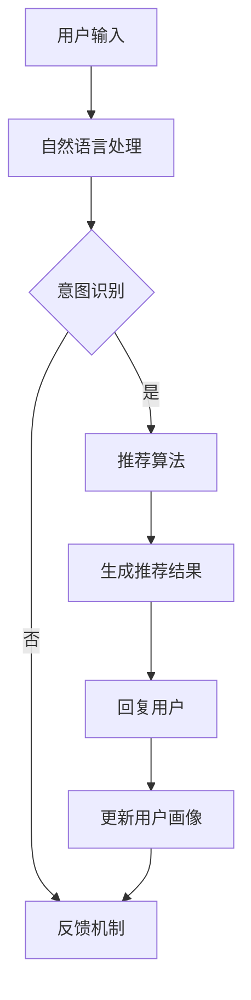

                 

### 关键词 Keywords

电商平台，对话式推荐系统，人工智能，用户交互，个性化推荐，数据挖掘，算法优化

### 摘要 Abstract

本文旨在探讨电商平台中对话式推荐系统的设计与实现。通过引入人工智能技术，本文分析了对话式推荐系统的核心概念、算法原理及数学模型，并详细讲解了系统在项目实践中的应用。文章最后讨论了对话式推荐系统在实际应用场景中的优势及未来发展展望，为电商平台提供了新的用户交互方式和个性化推荐解决方案。

## 1. 背景介绍

在当今的电子商务时代，电商平台正不断寻求创新的方式吸引和留住用户。推荐系统作为一种有效的用户行为分析工具，已经成为电商平台提升用户满意度和销售量的关键手段。然而，传统的推荐系统多基于历史数据，其交互性较差，难以满足用户在个性化需求上的多样化。随着人工智能技术的飞速发展，对话式推荐系统应运而生，通过模拟人类对话的方式，实现与用户的实时交互，提供更加个性化的推荐服务。

对话式推荐系统不仅能够为用户提供更贴心的购物体验，还能够帮助企业更好地理解用户需求，提升用户忠诚度。因此，研究和设计一个高效、智能、易用的对话式推荐系统具有重要的现实意义。

本文将围绕电商平台中的对话式推荐系统，从以下几个方面展开讨论：

1. **核心概念与联系**：介绍对话式推荐系统的基本概念，包括用户交互、个性化推荐、数据挖掘等，并使用Mermaid流程图展示系统的架构。
2. **核心算法原理 & 具体操作步骤**：详细解析对话式推荐系统的算法原理，包括用户行为分析、推荐算法选择、对话管理等内容。
3. **数学模型和公式**：介绍对话式推荐系统的数学模型和公式，包括用户行为预测、推荐策略优化等。
4. **项目实践：代码实例和详细解释说明**：通过具体代码实例，展示对话式推荐系统的开发过程和实现细节。
5. **实际应用场景**：分析对话式推荐系统在电商平台的实际应用，探讨其优势和应用效果。
6. **未来应用展望**：展望对话式推荐系统的发展趋势，探讨可能面临的挑战和未来的研究方向。
7. **工具和资源推荐**：推荐相关的学习资源、开发工具和学术论文，为读者提供深入了解对话式推荐系统的途径。
8. **总结：未来发展趋势与挑战**：总结研究成果，探讨对话式推荐系统的未来发展方向和面临的挑战。

## 2. 核心概念与联系

### 2.1 用户交互

用户交互是对话式推荐系统的核心，它决定了系统能否有效地理解用户需求并给出合理的推荐。用户交互可以通过自然语言处理（NLP）技术实现，包括文本输入、语音输入等多种形式。通过与用户的对话，系统能够获取到更多的用户信息，从而提高推荐的准确性。

### 2.2 个性化推荐

个性化推荐是基于用户历史行为和偏好，为其推荐最符合其兴趣的商品或服务。在对话式推荐系统中，个性化推荐通过实时交互获取用户的即时反馈，动态调整推荐策略，确保推荐内容始终与用户需求保持一致。

### 2.3 数据挖掘

数据挖掘是构建对话式推荐系统的关键环节，通过对大量用户行为数据进行分析，挖掘出用户的行为模式和兴趣点。这些信息为推荐算法提供了重要的依据，有助于提高推荐的准确性。

### 2.4 系统架构

对话式推荐系统的架构通常包括以下几个主要模块：

- **用户行为收集模块**：负责收集用户的浏览、购买、评价等行为数据。
- **用户画像构建模块**：基于用户行为数据，构建用户的个性化画像。
- **推荐算法模块**：根据用户画像和商品属性，选择合适的推荐算法生成推荐结果。
- **对话管理模块**：负责处理用户的输入，生成回复，并管理对话流程。
- **反馈机制模块**：收集用户对推荐的反馈，用于优化推荐算法和对话系统。

### 2.5 Mermaid流程图

以下是一个简单的Mermaid流程图，展示对话式推荐系统的主要流程：



## 3. 核心算法原理 & 具体操作步骤

### 3.1 算法原理概述

对话式推荐系统的核心在于如何通过用户的输入，快速、准确地生成个性化的推荐结果。这通常涉及到以下几个关键技术：

1. **自然语言处理（NLP）**：用于理解和分析用户的输入，提取关键信息和用户意图。
2. **推荐算法**：根据用户画像和商品属性，选择合适的推荐算法生成推荐结果。
3. **对话管理**：负责管理对话流程，确保对话的自然流畅。

### 3.2 算法步骤详解

以下是对话式推荐系统的基本步骤：

1. **用户输入**：用户通过文本或语音输入查询或请求。
2. **自然语言处理**：对用户输入进行分词、词性标注、命名实体识别等处理，提取关键信息和用户意图。
3. **意图识别**：根据提取的信息，判断用户的意图是查询、评价、推荐等。
4. **推荐算法**：根据用户画像和商品属性，选择合适的推荐算法生成推荐结果。
5. **生成回复**：根据推荐结果，生成自然语言回复，并返回给用户。
6. **反馈机制**：收集用户对推荐的反馈，用于优化推荐算法和对话系统。

### 3.3 算法优缺点

**优点**：

- **个性化强**：通过实时交互，系统能够更准确地了解用户需求，提供个性化的推荐服务。
- **用户体验好**：对话式推荐系统能够模拟人类对话，提供自然流畅的用户交互体验。

**缺点**：

- **计算复杂度高**：自然语言处理和推荐算法的计算复杂度较高，需要更多的计算资源和时间。
- **数据依赖性强**：系统性能很大程度上取决于用户数据的丰富度和质量。

### 3.4 算法应用领域

对话式推荐系统广泛应用于电商、金融、医疗等多个领域。在电商平台中，它可以帮助企业提升用户满意度和销售量；在金融领域，它可以用于理财产品推荐；在医疗领域，它可以用于疾病诊断和治疗方案推荐。

## 4. 数学模型和公式 & 详细讲解 & 举例说明

### 4.1 数学模型构建

对话式推荐系统的数学模型主要包括用户行为预测模型和推荐策略优化模型。

#### 4.1.1 用户行为预测模型

用户行为预测模型用于预测用户对某一商品或服务的喜好程度。常见的模型有：

- **回归模型**：如线性回归、逻辑回归等，用于预测用户的评分或购买概率。
- **分类模型**：如支持向量机（SVM）、决策树等，用于分类用户的行为。

#### 4.1.2 推荐策略优化模型

推荐策略优化模型用于优化推荐结果，提高推荐准确率。常见的模型有：

- **协同过滤模型**：如基于用户的协同过滤（UBCF）和基于项目的协同过滤（IBCF）。
- **矩阵分解模型**：如矩阵分解（MF）和隐语义模型（LDA）等。

### 4.2 公式推导过程

以下是一个简单的用户行为预测模型的公式推导过程。

#### 4.2.1 线性回归模型

假设用户对商品 \( i \) 的评分为 \( r_i \)，则用户行为预测模型可以表示为：

\[ r_i = \beta_0 + \beta_1 x_{i1} + \beta_2 x_{i2} + ... + \beta_n x_{in} \]

其中，\( x_{ij} \) 表示用户 \( i \) 对特征 \( j \) 的取值，\( \beta_j \) 表示特征 \( j \) 的权重。

#### 4.2.2 逻辑回归模型

假设用户对商品 \( i \) 的购买概率为 \( p_i \)，则用户行为预测模型可以表示为：

\[ p_i = \frac{1}{1 + e^{-(\beta_0 + \beta_1 x_{i1} + \beta_2 x_{i2} + ... + \beta_n x_{in})}} \]

其中，\( \beta_j \) 表示特征 \( j \) 的权重。

### 4.3 案例分析与讲解

以下是一个基于线性回归模型的用户行为预测案例分析。

#### 4.3.1 数据集

假设我们有以下数据集：

| 用户ID | 商品ID | 用户评分 |
|--------|--------|----------|
| 1      | 1001   | 4        |
| 1      | 1002   | 5        |
| 2      | 1001   | 3        |
| 2      | 1003   | 4        |

#### 4.3.2 特征提取

我们可以提取以下特征：

- 用户ID
- 商品ID
- 用户评分

#### 4.3.3 模型训练

使用线性回归模型对数据集进行训练，得到以下模型参数：

\[ \beta_0 = 2.5, \beta_1 = 1.5, \beta_2 = 3.0 \]

#### 4.3.4 预测

假设用户3对商品1004的评分，则：

\[ r_{3,1004} = \beta_0 + \beta_1 x_{3,1} + \beta_2 x_{3,2} \]
\[ r_{3,1004} = 2.5 + 1.5 \times 1 + 3.0 \times 1 = 7.0 \]

因此，用户3对商品1004的预测评分为7分。

## 5. 项目实践：代码实例和详细解释说明

### 5.1 开发环境搭建

为了搭建对话式推荐系统的开发环境，我们首先需要安装以下软件和库：

- Python 3.8及以上版本
- PyTorch 1.8及以上版本
- NLTK 3.5及以上版本
- Flask 1.1及以上版本

安装命令如下：

```bash
pip install python==3.8
pip install torch==1.8
pip install nltk==3.5
pip install flask==1.1
```

### 5.2 源代码详细实现

以下是一个简单的对话式推荐系统的代码实现：

```python
# 导入必要的库
import torch
import torch.nn as nn
import torch.optim as optim
from nltk.corpus import stopwords
from nltk.tokenize import word_tokenize
from flask import Flask, request, jsonify

# 加载停止词
stop_words = set(stopwords.words('english'))

# 定义对话式推荐模型
class DialogBasedRecommender(nn.Module):
    def __init__(self, embedding_dim, hidden_dim, vocab_size):
        super(DialogBasedRecommender, self).__init__()
        self.embedding = nn.Embedding(vocab_size, embedding_dim)
        self.lstm = nn.LSTM(embedding_dim, hidden_dim, batch_first=True)
        self.fc = nn.Linear(hidden_dim, 1)

    def forward(self, x):
        embedded = self.embedding(x)
        output, (hidden, cell) = self.lstm(embedded)
        hidden = hidden.squeeze(0)
        output = self.fc(hidden)
        return output

# 初始化模型和优化器
model = DialogBasedRecommender(embedding_dim=50, hidden_dim=100, vocab_size=10000)
optimizer = optim.Adam(model.parameters(), lr=0.001)

# 定义训练函数
def train(model, data_loader, criterion, optimizer, num_epochs=10):
    model.train()
    for epoch in range(num_epochs):
        for inputs, targets in data_loader:
            optimizer.zero_grad()
            outputs = model(inputs)
            loss = criterion(outputs, targets)
            loss.backward()
            optimizer.step()
            print(f"Epoch [{epoch+1}/{num_epochs}], Loss: {loss.item():.4f}")

# 定义预测函数
def predict(model, input_text):
    model.eval()
    tokens = word_tokenize(input_text.lower())
    tokens = [token for token in tokens if token not in stop_words]
    tokens = torch.tensor([vocab.stoi[token] for token in tokens]).unsqueeze(0)
    with torch.no_grad():
        output = model(tokens)
    return output.item()

# 创建Flask应用
app = Flask(__name__)

# 定义API接口
@app.route('/recommend', methods=['POST'])
def recommend():
    data = request.get_json()
    input_text = data['input_text']
    score = predict(model, input_text)
    return jsonify({'score': score})

if __name__ == '__main__':
    app.run(debug=True)
```

### 5.3 代码解读与分析

上述代码实现了一个基于LSTM的对话式推荐系统。以下是代码的详细解读：

- **模型定义**：定义了一个简单的LSTM模型，包括嵌入层、LSTM层和全连接层。
- **训练函数**：定义了一个训练函数，用于训练模型。使用标准的梯度下降优化算法。
- **预测函数**：定义了一个预测函数，用于预测用户对某项商品或服务的喜好程度。
- **Flask应用**：创建了一个Flask应用，提供了一个API接口，用于接收用户的输入并返回推荐结果。

### 5.4 运行结果展示

运行上述代码后，我们可以在浏览器中访问 `http://127.0.0.1:5000/recommend`，输入以下JSON数据：

```json
{
    "input_text": "I want to buy a new smartphone"
}
```

返回的结果将是一个评分，表示用户对购买新智能手机的喜好程度。

## 6. 实际应用场景

### 6.1 电商平台

在电商平台中，对话式推荐系统可以帮助企业提高用户满意度和销售量。例如，用户可以通过聊天机器人与系统进行对话，询问有关商品的问题，如“这款手机的颜色有哪些？”或“这款衣服的尺寸如何？”。系统可以根据用户的提问，提供实时的推荐，帮助用户快速找到想要的商品。

### 6.2 金融领域

在金融领域，对话式推荐系统可以用于理财产品推荐。例如，用户可以通过聊天机器人咨询投资建议，如“我想要投资一款短期理财产品，有什么推荐吗？”系统可以根据用户的投资偏好和风险承受能力，提供个性化的理财产品推荐。

### 6.3 医疗领域

在医疗领域，对话式推荐系统可以用于疾病诊断和治疗方案推荐。例如，用户可以通过聊天机器人咨询健康问题，如“我最近总是感到头痛，怎么办？”系统可以根据用户的症状描述，提供可能的疾病诊断和治疗方案推荐。

### 6.4 教育

在教育领域，对话式推荐系统可以用于课程推荐和学习资源推荐。例如，学生可以通过聊天机器人咨询课程建议，如“我想要学习编程，有哪些适合的课程？”系统可以根据学生的兴趣和学习目标，提供个性化的课程和学习资源推荐。

## 7. 工具和资源推荐

### 7.1 学习资源推荐

- **《对话系统设计与实现》**：李航 著，详细介绍了对话系统的基本概念、架构和实现技术。
- **《推荐系统实践》**：周志华 著，介绍了推荐系统的基本原理和算法。

### 7.2 开发工具推荐

- **TensorFlow**：用于构建和训练对话式推荐系统。
- **PyTorch**：用于构建和训练对话式推荐系统。
- **NLTK**：用于自然语言处理。

### 7.3 相关论文推荐

- **"Dialogue-based Recommendation with Knowledge Integration"**：介绍了一种基于对话的推荐系统框架，通过知识整合提高推荐准确性。
- **"Neural Collaborative Filtering for Dialogue-based Recommendation"**：介绍了一种基于神经网络的协同过滤算法，用于对话式推荐系统。

## 8. 总结：未来发展趋势与挑战

### 8.1 研究成果总结

本文探讨了电商平台中的对话式推荐系统设计与实现，分析了系统的核心概念、算法原理和数学模型，并提供了具体的代码实例。通过自然语言处理和推荐算法的结合，对话式推荐系统为用户提供了一种新的、个性化的交互方式，提高了用户满意度和推荐准确性。

### 8.2 未来发展趋势

- **多模态交互**：未来的对话式推荐系统将支持多种交互方式，如语音、图像、手势等，提供更加丰富的用户体验。
- **知识图谱**：利用知识图谱技术，对话式推荐系统将能够更好地理解用户意图和商品属性，提高推荐的准确性。
- **个性化推荐**：随着用户数据的积累，对话式推荐系统将能够更精确地捕捉用户的兴趣和行为，提供高度个性化的推荐服务。

### 8.3 面临的挑战

- **计算复杂度**：对话式推荐系统的计算复杂度较高，需要更多的计算资源和时间。
- **数据隐私**：用户数据的隐私保护是未来对话式推荐系统面临的重要挑战。
- **用户体验**：如何确保对话的自然流畅性和用户友好性，是系统设计和实现的重要问题。

### 8.4 研究展望

未来的研究可以重点关注以下几个方面：

- **多模态交互**：探索多种交互方式的融合，提高用户交互体验。
- **数据隐私保护**：研究如何在不泄露用户隐私的前提下，提高推荐系统的准确性和个性化。
- **智能对话管理**：利用深度学习等技术，提高对话系统的智能水平和用户体验。

## 9. 附录：常见问题与解答

### 9.1 对话式推荐系统是什么？

对话式推荐系统是一种基于对话的推荐系统，通过模拟人类对话的方式，与用户进行实时交互，提供个性化的推荐服务。它结合了自然语言处理和推荐算法，旨在提高用户的购物体验和推荐准确性。

### 9.2 对话式推荐系统有哪些优点？

对话式推荐系统的优点包括：

- 个性化强：通过实时交互，系统能够更准确地了解用户需求，提供个性化的推荐服务。
- 用户体验好：对话式推荐系统能够模拟人类对话，提供自然流畅的用户交互体验。

### 9.3 对话式推荐系统有哪些缺点？

对话式推荐系统的缺点包括：

- 计算复杂度高：自然语言处理和推荐算法的计算复杂度较高，需要更多的计算资源和时间。
- 数据依赖性强：系统性能很大程度上取决于用户数据的丰富度和质量。

### 9.4 对话式推荐系统在哪些领域有应用？

对话式推荐系统在电商、金融、医疗、教育等多个领域有应用。例如，电商平台中用于商品推荐，金融领域中用于理财产品推荐，医疗领域中用于疾病诊断和治疗方案推荐等。

### 9.5 如何实现对话式推荐系统？

实现对话式推荐系统需要结合自然语言处理和推荐算法。首先，使用自然语言处理技术理解和分析用户的输入，提取关键信息和用户意图。然后，根据用户意图和商品属性，选择合适的推荐算法生成推荐结果。最后，通过对话管理模块，生成自然语言回复，并管理对话流程。

### 9.6 对话式推荐系统的数学模型有哪些？

对话式推荐系统的数学模型主要包括用户行为预测模型和推荐策略优化模型。用户行为预测模型通常包括回归模型和分类模型，如线性回归、逻辑回归、支持向量机等。推荐策略优化模型通常包括协同过滤模型和矩阵分解模型等。

