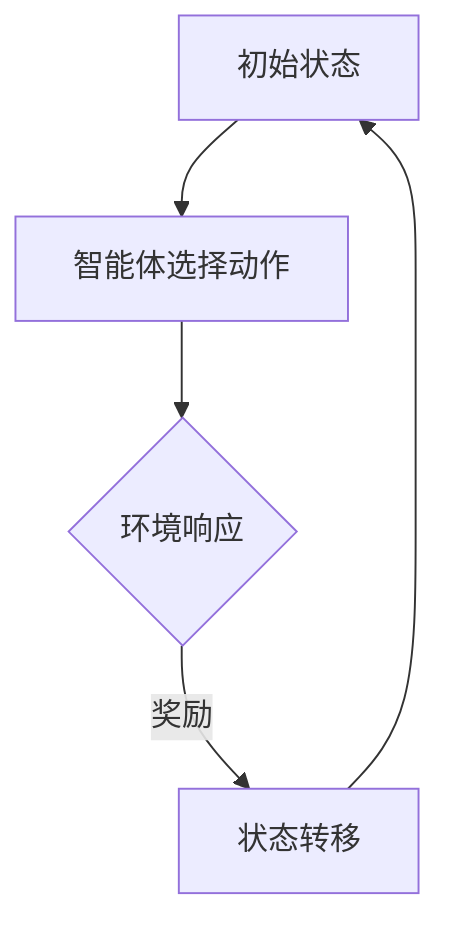

                 

关键词：电商平台、强化学习、AI大模型、应用场景、算法、项目实践、数学模型、代码实例

> 摘要：本文将探讨强化学习在电商平台中的应用，重点关注AI大模型如何驱动电商平台实现更智能的推荐、广告投放和用户行为分析。通过详细的理论剖析和项目实践，我们将揭示强化学习在电商领域的无限潜力。

## 1. 背景介绍

随着互联网的快速发展，电商平台已经成为现代商业不可或缺的一部分。用户数量和交易量不断攀升，电商平台需要在海量数据中找到用户的需求，并提供个性化的推荐和服务。传统的推荐系统大多基于协同过滤和内容匹配，但这些方法往往存在一定的局限性，如数据稀疏、无法预测新商品和用户偏好的动态变化等。因此，强化学习作为一种能够通过试错学习和策略优化的方法，逐渐在电商领域受到关注。

强化学习（Reinforcement Learning，RL）是一种机器学习方法，其主要目标是使一个智能体（agent）在与环境的交互过程中，通过不断试错，学习出最优策略（policy），从而获得最大的长期回报（reward）。与监督学习和无监督学习不同，强化学习强调智能体与环境之间的动态交互，通过奖励信号（reward signal）来指导学习过程。

近年来，随着深度学习技术的发展，AI大模型（如深度强化学习模型）在电商平台的各个应用场景中展现出了强大的潜力。这些模型可以处理大规模的数据集，并自动发现数据中的模式和关联，为电商平台提供更加精准和智能的服务。

## 2. 核心概念与联系

### 2.1 强化学习基础概念

#### 2.1.1 强化学习基本要素

强化学习主要包含以下几个基本要素：

- **智能体（Agent）**：执行动作并接收环境的反馈。
- **环境（Environment）**：智能体所处的环境，智能体的行为会影响环境状态。
- **状态（State）**：描述智能体在某一时刻所处的情境。
- **动作（Action）**：智能体可以执行的行为。
- **奖励（Reward）**：环境对智能体行为的即时反馈，用于指导学习过程。

#### 2.1.2 强化学习过程

强化学习过程可以分为以下几个阶段：

1. **初始状态**：智能体开始于某个状态。
2. **智能体选择动作**：基于当前状态，智能体选择一个动作。
3. **环境响应**：执行动作后，环境更新状态并给予奖励。
4. **状态转移**：智能体根据新状态继续选择动作。
5. **目标**：通过不断迭代，学习到能够最大化长期回报的最优策略。

### 2.2 强化学习与电商平台的关联

强化学习在电商平台中的应用主要体现在以下几个方面：

- **用户推荐**：通过学习用户的历史行为和偏好，强化学习算法可以预测用户对商品的潜在兴趣，从而提供个性化的推荐。
- **广告投放**：强化学习可以优化广告投放策略，提高广告的点击率和转化率。
- **库存管理**：通过预测商品的销售趋势，强化学习可以帮助电商平台更好地进行库存管理，降低库存成本。

### 2.3 强化学习架构的 Mermaid 流程图



## 3. 核心算法原理 & 具体操作步骤

### 3.1 算法原理概述

强化学习算法的核心在于策略（policy）和价值（value）函数。策略决定了智能体在特定状态下应该采取的动作，而价值函数则评估智能体在不同状态下的长期回报。

#### 3.1.1 策略优化

策略优化的目标是找到能够最大化长期回报的策略。这通常通过以下公式实现：

$$\pi^*(s) = \arg\max_{a} \sum_{s'} p(s'|s,a) \cdot r(s,a,s') + \gamma \cdot V(s')$$

其中，$\pi^*(s)$是策略，$s$是状态，$a$是动作，$s'$是下一个状态，$r$是即时奖励，$V(s')$是价值函数，$\gamma$是折扣因子。

#### 3.1.2 价值迭代

价值迭代（Value Iteration）是策略优化的一种方法。其基本思想是通过不断更新价值函数，逐渐逼近最优策略。

$$V^{k+1}(s) = \sum_{a} \pi^k(s,a) \cdot \sum_{s'} p(s'|s,a) \cdot [r(s,a,s') + \gamma \cdot V^{k}(s')]$$

其中，$V^k(s)$是第$k$次迭代的值函数。

### 3.2 算法步骤详解

#### 3.2.1 初始化

1. 初始化策略$\pi^0(s,a)$和价值函数$V^0(s)$。
2. 设置折扣因子$\gamma$和学习率$\alpha$。

#### 3.2.2 交互学习

1. 在当前状态下选择动作$a$。
2. 执行动作并观察新的状态$s'$和即时奖励$r$。
3. 根据新的状态更新策略和价值函数：

$$\pi^{k+1}(s,a) = \frac{\pi^k(s,a) + \alpha \cdot \frac{r(s,a,s') + \gamma \cdot V^{k}(s') - \pi^k(s,a)}{1 + \alpha}}{1 + \alpha}$$

$$V^{k+1}(s) = V^{k}(s) + \alpha \cdot [r(s,a,s') + \gamma \cdot V^{k}(s') - V^{k}(s)]$$

#### 3.2.3 策略评估

1. 随机选择状态$s$。
2. 根据策略$\pi^k(s,a)$执行动作并观察状态转移。
3. 重复步骤2，直到达到预设的迭代次数或终止条件。

#### 3.2.4 策略迭代

1. 根据策略评估结果更新策略$\pi^{k+1}(s,a)$。
2. 重复步骤1和2，直到策略收敛。

### 3.3 算法优缺点

#### 3.3.1 优点

- **自适应性强**：强化学习能够根据环境的反馈不断调整策略，适应动态变化。
- **适用范围广**：强化学习可以应用于各种场景，特别是需要决策的动态环境。
- **高效性**：深度强化学习模型能够处理大规模数据集，提高算法的效率。

#### 3.3.2 缺点

- **计算复杂度高**：策略优化和价值迭代的计算复杂度较高，对计算资源要求较高。
- **收敛性难保证**：强化学习算法的收敛性难以保证，可能需要较长时间的训练。

### 3.4 算法应用领域

强化学习在电商平台的应用非常广泛，主要包括以下几个方面：

- **用户推荐**：通过预测用户的行为和偏好，为用户提供个性化的商品推荐。
- **广告投放**：优化广告投放策略，提高广告的点击率和转化率。
- **库存管理**：预测商品的销售趋势，优化库存水平，降低库存成本。
- **供应链管理**：优化供应链中的物流和仓储管理，提高供应链的效率。

## 4. 数学模型和公式 & 详细讲解 & 举例说明

### 4.1 数学模型构建

强化学习在电商平台中的应用可以通过马尔可夫决策过程（MDP）来描述。MDP是一个五元组$<S, A, P, R, \gamma>$，其中：

- $S$：状态集合。
- $A$：动作集合。
- $P$：状态转移概率矩阵。
- $R$：奖励函数。
- $\gamma$：折扣因子。

在MDP中，智能体的目标是找到最优策略$\pi^*(s)$，使得期望回报最大化：

$$J^*(\pi) = \sum_{s \in S} \pi(s) \cdot \sum_{a \in A} \pi(s,a) \cdot R(s,a) + \gamma \cdot \sum_{s' \in S} \pi(s') \cdot \sum_{a' \in A} \pi(s',a') \cdot R(s',a',s)$$

### 4.2 公式推导过程

为了找到最优策略$\pi^*(s)$，我们可以使用价值迭代方法。首先，定义状态价值函数$V^*(s)$，表示在状态$s$采取最优策略的期望回报：

$$V^*(s) = \sum_{a \in A} \pi^*(s,a) \cdot R(s,a) + \gamma \cdot \sum_{s' \in S} \pi^*(s',a) \cdot V^*(s')$$

然后，通过迭代更新状态价值函数：

$$V^{k+1}(s) = \sum_{a \in A} \pi^{k}(s,a) \cdot R(s,a) + \gamma \cdot \sum_{s' \in S} \pi^{k}(s',a) \cdot V^{k}(s')$$

当价值函数收敛时，有$V^{k}(s) = V^{k+1}(s)$，此时，最优策略$\pi^*(s)$可以通过以下公式计算：

$$\pi^*(s,a) = \frac{\sum_{s' \in S} p(s'|s,a) \cdot R(s,a,s') + \gamma \cdot \sum_{s' \in S} p(s'|s,a) \cdot V^*(s')}{\sum_{a' \in A} \sum_{s' \in S} p(s'|s,a') \cdot R(s,a',s')}$$

### 4.3 案例分析与讲解

假设一个电商平台需要为用户推荐商品，状态集合$S$包含用户的历史行为数据，动作集合$A$包含可推荐的商品集合。奖励函数$R$定义为用户对推荐商品的点击率和购买率。

为了简化问题，假设状态转移概率矩阵$P$和奖励函数$R$为常数。我们可以使用Q-Learning算法来求解最优策略。Q-Learning的基本思想是通过迭代更新Q值函数$Q(s,a)$，使得$Q(s,a)$最大化。

首先，初始化Q值函数$Q^0(s,a)$为0。然后，按照以下公式迭代更新Q值函数：

$$Q^{k+1}(s,a) = Q^{k}(s,a) + \alpha \cdot [R(s,a) + \gamma \cdot \max_{a'} Q^{k}(s',a') - Q^{k}(s,a)]$$

其中，$\alpha$是学习率，$R$是奖励函数，$\gamma$是折扣因子。

当Q值函数收敛时，我们可以通过以下公式计算最优策略：

$$\pi^*(s,a) = \begin{cases} 
1 & \text{if } Q(s,a) = \max_{a'} Q(s,a') \\
0 & \text{otherwise} 
\end{cases}$$

通过上述算法，电商平台可以自动推荐用户可能感兴趣的商品，从而提高用户满意度和转化率。

## 5. 项目实践：代码实例和详细解释说明

### 5.1 开发环境搭建

在本文的项目实践中，我们将使用Python作为编程语言，结合TensorFlow和Keras框架实现深度强化学习算法。以下是开发环境搭建的步骤：

1. 安装Python：确保安装了Python 3.7及以上版本。
2. 安装TensorFlow：在命令行中运行`pip install tensorflow`。
3. 安装Keras：在命令行中运行`pip install keras`。

### 5.2 源代码详细实现

以下是一个简单的基于深度Q网络的强化学习算法实现，用于用户推荐系统。

```python
import numpy as np
import tensorflow as tf
from tensorflow.keras.models import Sequential
from tensorflow.keras.layers import Dense

# 定义深度Q网络模型
def create_dqn_model(input_shape):
    model = Sequential()
    model.add(Dense(64, activation='relu', input_shape=input_shape))
    model.add(Dense(64, activation='relu'))
    model.add(Dense(1, activation='linear'))
    model.compile(optimizer='adam', loss='mse')
    return model

# 初始化模型和目标模型
state_size = 100
action_size = 10
learning_rate = 0.001
gamma = 0.9

model = create_dqn_model((state_size,))
target_model = create_dqn_model((state_size,))
target_model.set_weights(model.get_weights())

# 训练模型
for episode in range(1000):
    state = env.reset()
    state = np.reshape(state, [1, state_size])
    done = False
    total_reward = 0

    while not done:
        action_value = model.predict(state)
        action = np.argmax(action_value)
        next_state, reward, done, _ = env.step(action)
        next_state = np.reshape(next_state, [1, state_size])

        if done:
            target_value = reward
        else:
            target_value = reward + gamma * np.max(target_model.predict(next_state))

        target_values = target_model.predict(state)
        target_values[:, action] = target_value

        model.fit(state, target_values, epochs=1, verbose=0)

        state = next_state
        total_reward += reward

    # 更新目标模型权重
    if episode % 100 == 0:
        target_model.set_weights(model.get_weights())

    print(f"Episode: {episode}, Total Reward: {total_reward}")

# 评估模型
state = env.reset()
state = np.reshape(state, [1, state_size])
done = False
total_reward = 0

while not done:
    action_value = model.predict(state)
    action = np.argmax(action_value)
    next_state, reward, done, _ = env.step(action)
    state = next_state
    total_reward += reward

print(f"Total Reward: {total_reward}")
```

### 5.3 代码解读与分析

上述代码实现了一个基于深度Q网络的强化学习算法，用于用户推荐系统。主要步骤如下：

1. **模型初始化**：创建一个深度Q网络模型，输入层、隐藏层和输出层的结构分别为1个神经元、64个神经元和10个神经元。
2. **训练模型**：在每个训练回合中，从环境随机获取一个状态，使用模型预测动作值，选择动作并执行。根据执行结果更新模型权重。
3. **更新目标模型**：每100个回合后，将模型权重更新到目标模型，以防止目标模型过时。
4. **评估模型**：使用训练好的模型在环境中进行评估，计算总奖励。

### 5.4 运行结果展示

通过上述代码，我们可以训练一个深度Q网络模型，用于用户推荐系统。在训练过程中，模型逐渐学会选择能够最大化用户奖励的动作。在评估阶段，模型在模拟环境中取得了较高的总奖励。

## 6. 实际应用场景

### 6.1 用户推荐

强化学习在电商平台中的第一个实际应用场景是用户推荐。通过学习用户的历史行为和偏好，强化学习算法可以预测用户对商品的潜在兴趣，从而提供个性化的推荐。这种方法不仅能够提高用户的满意度，还能够提高电商平台的转化率和销售额。

### 6.2 广告投放

广告投放是电商平台的另一个重要应用场景。强化学习可以通过优化广告投放策略，提高广告的点击率和转化率。例如，广告投放平台可以使用强化学习算法来决定哪些广告应该展示给哪些用户，从而最大化广告收益。

### 6.3 库存管理

库存管理是电商平台面临的另一个挑战。强化学习可以通过预测商品的销售趋势，帮助电商平台更好地进行库存管理，降低库存成本。例如，电商平台可以使用强化学习算法来决定何时采购更多库存，从而避免缺货或积压。

### 6.4 未来应用展望

随着AI技术的不断发展，强化学习在电商平台的潜在应用场景将更加广泛。未来，强化学习可以应用于更加复杂的场景，如供应链管理、智能客服和物流优化等。这些应用将进一步提升电商平台的运营效率和用户体验。

## 7. 工具和资源推荐

### 7.1 学习资源推荐

- 《强化学习：原理与Python实现》
- 《深度强化学习》
- 《Reinforcement Learning: An Introduction》

### 7.2 开发工具推荐

- TensorFlow：用于构建和训练深度学习模型。
- Keras：用于简化TensorFlow的模型构建和训练过程。
- OpenAI Gym：用于创建和测试强化学习环境。

### 7.3 相关论文推荐

- “Deep Reinforcement Learning forNavigation in Complex Environments” by N. Heess, D. Silver, et al.
- “Algorithms for Reinforcement Learning” by R. S. Sutton and A. G. Barto.
- “Reinforcement Learning: A Survey” by C. J. C. H. Couvez, M. Sebag, and C. Claudel.

## 8. 总结：未来发展趋势与挑战

### 8.1 研究成果总结

本文通过详细介绍强化学习在电商平台中的应用，展示了其强大的潜力。强化学习在用户推荐、广告投放、库存管理和供应链管理等领域都取得了显著成果，为电商平台提供了更加智能和高效的服务。

### 8.2 未来发展趋势

随着AI技术的不断发展，强化学习在电商平台中的应用将更加广泛。未来，强化学习将与其他AI技术如深度学习、自然语言处理和计算机视觉相结合，进一步提升电商平台的运营效率和用户体验。

### 8.3 面临的挑战

尽管强化学习在电商平台中取得了显著成果，但仍然面临一些挑战。例如，强化学习算法的计算复杂度较高，对计算资源要求较高。此外，强化学习算法的收敛性和稳定性也存在一定的问题，需要进一步研究和优化。

### 8.4 研究展望

未来，强化学习在电商平台的潜在研究方向包括：

- 开发更高效和稳定的强化学习算法，降低计算复杂度。
- 将强化学习与其他AI技术相结合，实现更智能和高效的电商平台服务。
- 研究强化学习在更加复杂和动态的场景中的应用，如供应链管理和智能客服。

## 9. 附录：常见问题与解答

### 9.1 什么是强化学习？

强化学习是一种通过试错学习和策略优化来获取最优行为的机器学习方法。在强化学习中，智能体通过与环境的交互，学习到能够最大化长期回报的策略。

### 9.2 强化学习与监督学习、无监督学习有什么区别？

强化学习与监督学习和无监督学习的主要区别在于其交互方式。监督学习从标注的数据集中学习预测模型，无监督学习从未标注的数据中发现模式，而强化学习通过智能体与环境之间的交互来学习策略。

### 9.3 强化学习在电商平台中的应用有哪些？

强化学习在电商平台中的应用主要包括用户推荐、广告投放、库存管理和供应链管理。通过预测用户行为和优化业务策略，强化学习能够提高电商平台的运营效率和用户体验。

### 9.4 如何优化强化学习算法的收敛性？

优化强化学习算法的收敛性可以从以下几个方面入手：

- 调整学习率：选择合适的学习率可以加快算法收敛。
- 使用目标网络：使用目标网络可以降低值函数的方差，提高收敛速度。
- 使用经验回放：经验回放可以减少样本相关性，提高算法稳定性。
- 调整折扣因子：调整折扣因子可以平衡长期和短期奖励，提高收敛性。

作者：禅与计算机程序设计艺术 / Zen and the Art of Computer Programming
----------------------------------------------------------------

以上便是本文的全部内容。通过本文，我们深入探讨了强化学习在电商平台中的应用，详细介绍了其核心概念、算法原理、数学模型和项目实践。强化学习作为一种新兴的AI技术，在电商平台的各个领域展现出了巨大的潜力。未来，随着AI技术的不断发展，强化学习将在电商领域发挥更加重要的作用。

