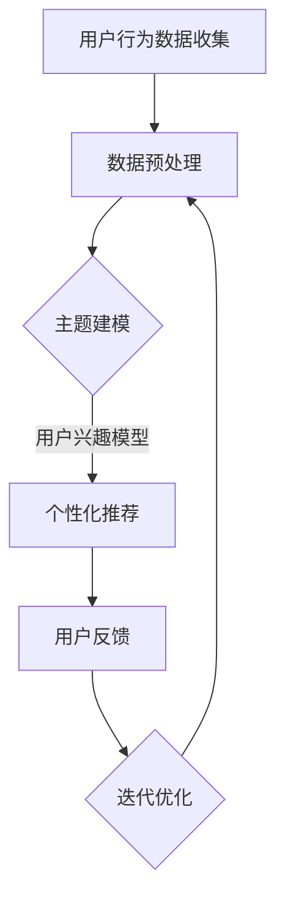

                 

关键词：电商平台，用户兴趣，主题建模，信息推荐，算法，数据处理，用户行为分析

> 摘要：随着电子商务的快速发展，如何有效地分析用户兴趣，提供个性化的推荐服务，已成为电商平台竞争的关键。本文主要探讨电商平台中用户兴趣主题建模的方法和实现，旨在为电商平台提供有效的用户行为分析和个性化推荐方案。

## 1. 背景介绍

随着互联网的普及和电子商务的迅猛发展，电商平台已经成为消费者购买商品的主要渠道之一。然而，在电商平台上，消费者面临着海量的商品和信息，如何快速找到自己感兴趣的商品，成为了用户体验的关键。因此，电商平台需要通过分析用户行为，构建用户兴趣模型，为用户提供个性化的推荐服务。

用户兴趣主题建模作为信息检索和推荐系统中的核心技术之一，旨在通过分析用户的历史行为数据，挖掘用户感兴趣的主题，进而为用户推荐符合其兴趣的内容。在电商平台上，用户兴趣主题建模可以帮助平台识别用户的偏好，提高用户满意度，降低用户流失率，从而提升平台的竞争力。

## 2. 核心概念与联系

### 2.1 用户兴趣

用户兴趣是指用户在特定情境下对某些信息、内容或活动的偏好和倾向。在电商平台上，用户兴趣主要表现在购买行为、浏览历史、搜索关键词等方面。通过分析用户兴趣，可以为用户提供个性化的推荐服务。

### 2.2 主题建模

主题建模（Topic Modeling）是一种无监督的机器学习方法，旨在从大量文本数据中发现潜在的语义主题。在电商平台上，主题建模可以帮助挖掘用户感兴趣的商品类别和品牌，为个性化推荐提供基础。

### 2.3 信息推荐

信息推荐是指根据用户的历史行为和兴趣，为用户推荐符合其需求的信息。在电商平台上，信息推荐主要包括商品推荐、广告推荐、活动推荐等。通过信息推荐，可以提高用户的购物体验，促进销售转化。

### 2.4 用户行为分析

用户行为分析是指通过对用户在平台上的行为数据进行分析，挖掘用户的兴趣和需求，为个性化推荐提供依据。在电商平台上，用户行为分析主要包括购买行为、浏览行为、搜索行为等。

## 2.5 Mermaid 流程图



## 3. 核心算法原理 & 具体操作步骤

### 3.1 算法原理概述

用户兴趣主题建模的核心算法是基于机器学习的主题模型，如LDA（Latent Dirichlet Allocation）模型。LDA模型假设文本数据是由一组潜在主题和一组观测词分布组成的，通过训练模型，可以学习到一组潜在主题，并利用这些主题为用户构建兴趣模型。

### 3.2 算法步骤详解

#### 3.2.1 数据预处理

数据预处理是用户兴趣主题建模的第一步，主要包括以下任务：

- 数据清洗：去除文本中的噪声和无关信息，如HTML标签、特殊字符等。
- 词干提取：将文本中的单词还原为词干，提高词汇的统一性。
- 停用词过滤：去除常见停用词，如“的”、“和”、“是”等，以减少冗余信息。

#### 3.2.2 构建词袋模型

在数据预处理后，构建词袋模型（Bag of Words，BoW）用于表示文本数据。词袋模型将文本数据表示为一个向量，其中每个维度表示一个词汇，值表示词汇在文本中出现的次数。

#### 3.2.3 训练LDA模型

使用LDA模型对词袋模型进行训练，学习到一组潜在主题。LDA模型通过Dirichlet分布对主题和词的概率分布进行估计，从而挖掘出文本数据中的潜在主题。

#### 3.2.4 用户兴趣模型构建

利用训练好的LDA模型，为每个用户构建兴趣模型。兴趣模型表示用户对不同潜在主题的兴趣程度，用于后续的个性化推荐。

### 3.3 算法优缺点

#### 优点：

- 无需显式标注用户兴趣，适用于无监督学习。
- 可以自动发现文本数据中的潜在主题，提高推荐效果。
- 适用于大规模文本数据，具有较好的扩展性。

#### 缺点：

- 对稀疏数据敏感，可能无法准确表示用户兴趣。
- 训练过程复杂，计算成本较高。

### 3.4 算法应用领域

用户兴趣主题建模在电商平台的推荐系统中具有广泛的应用，主要包括：

- 商品推荐：根据用户兴趣模型，为用户推荐符合其兴趣的商品。
- 广告推荐：为用户推荐符合其兴趣的广告，提高广告点击率。
- 活动推荐：为用户推荐符合其兴趣的活动，提高用户参与度。

## 4. 数学模型和公式 & 详细讲解 & 举例说明

### 4.1 数学模型构建

LDA模型的数学模型包括三个主要部分：潜在主题分布、文档-主题分布和词-主题分布。

#### 潜在主题分布

假设有K个潜在主题，每个主题的词汇分布可以用概率向量表示为：

$$
\theta_k = (p_{k1}, p_{k2}, ..., p_{kn})
$$

其中，$p_{ki}$表示主题k中词汇i的概率。

#### 文档-主题分布

假设有N个文档，每个文档的主题分布可以用概率向量表示为：

$$
\alpha_n = (\alpha_{n1}, \alpha_{n2}, ..., \alpha_{nK})
$$

其中，$\alpha_{nk}$表示文档n属于主题k的概率。

#### 词-主题分布

假设有V个词汇，每个词汇的主题分布可以用概率矩阵表示为：

$$
\beta_j = (\beta_{j1}, \beta_{j2}, ..., \beta_{jK})
$$

其中，$\beta_{jk}$表示词汇j属于主题k的概率。

### 4.2 公式推导过程

LDA模型的目标是最小化文档-主题分布和词-主题分布的Kullback-Leibler散度（KL散度），即：

$$
\mathcal{L} = \sum_n \sum_k \alpha_{nk} \log \alpha_{nk} + \sum_n \sum_k \sum_j p_{nj} \log \beta_{jk}
$$

其中，$p_{nj}$表示词汇j在文档n中出现的概率。

### 4.3 案例分析与讲解

假设有一个电商平台，用户A的历史行为数据包括购买过的商品和浏览记录。通过LDA模型，我们可以为用户A构建兴趣模型，进而为其推荐商品。

#### 步骤1：数据预处理

对用户A的历史行为数据进行预处理，去除噪声和特殊字符，提取词干，过滤停用词。

#### 步骤2：构建词袋模型

将预处理后的文本数据构建词袋模型，表示为向量。

#### 步骤3：训练LDA模型

使用LDA模型对词袋模型进行训练，学习到一组潜在主题。

#### 步骤4：构建用户兴趣模型

利用训练好的LDA模型，为用户A构建兴趣模型，表示用户对不同主题的兴趣程度。

#### 步骤5：商品推荐

根据用户A的兴趣模型，为用户A推荐符合其兴趣的商品。

## 5. 项目实践：代码实例和详细解释说明

### 5.1 开发环境搭建

#### 1. 安装Python环境

确保您的系统中安装了Python 3.6及以上版本。

#### 2. 安装Gensim库

Gensim是一个用于主题建模和文本处理的Python库。使用以下命令安装：

```bash
pip install gensim
```

### 5.2 源代码详细实现

以下是一个简单的用户兴趣主题建模项目实例：

```python
import gensim
from gensim import corpora
from nltk.tokenize import word_tokenize

# 步骤1：数据预处理
def preprocess_data(data):
    processed_data = []
    for text in data:
        tokens = word_tokenize(text)
        tokens = [token.lower() for token in tokens if token.isalpha()]
        processed_data.append(tokens)
    return processed_data

# 步骤2：构建词袋模型
def build_corpus(processed_data):
    dictionary = corpora.Dictionary(processed_data)
    corpus = [dictionary.doc2bow(doc) for doc in processed_data]
    return corpus, dictionary

# 步骤3：训练LDA模型
def train_lda_model(corpus, num_topics, passes):
    lda_model = gensim.models.ldamodel.LdaModel(corpus,
                                               num_topics=num_topics,
                                               id2word=dictionary,
                                               passes=passes)
    return lda_model

# 步骤4：构建用户兴趣模型
def build_user_interest_model(lda_model, user_data):
    user_bow = dictionary.doc2bow(user_data)
    user_topics = lda_model.get_document_topics(user_bow)
    return user_topics

# 步骤5：商品推荐
def recommend_items(lda_model, dictionary, user_topics, items, num_recommendations):
    item_topics = [lda_model.get_document_topics(item_bow) for item_bow in items]
    recommended_items = []
    for i, item_topics in enumerate(item_topics):
        similarity = sum([topic[1] * user_topic[1] for topic in item_topics for user_topic in user_topics])
        recommended_items.append((items[i], similarity))
    recommended_items.sort(key=lambda x: x[1], reverse=True)
    return [item[0] for item in recommended_items[:num_recommendations]]

# 测试代码
if __name__ == "__main__":
    # 假设用户A的历史行为数据
    user_data = ["I like to buy electronics like smartphones and laptops.",
                 "I also enjoy shopping for fashion items like shoes and clothes.",
                 "I recently purchased a new smartphone and I'm interested in new apps."]

    # 预处理数据
    processed_data = preprocess_data(user_data)

    # 构建词袋模型和语料库
    corpus, dictionary = build_corpus(processed_data)

    # 训练LDA模型
    lda_model = train_lda_model(corpus, num_topics=3, passes=10)

    # 构建用户兴趣模型
    user_topics = build_user_interest_model(lda_model, processed_data[0])

    # 假设商品列表
    items = ["smartphone", "shoes", "laptop", "app"]

    # 推荐商品
    recommended_items = recommend_items(lda_model, dictionary, user_topics, items, num_recommendations=2)
    print("Recommended items:", recommended_items)
```

### 5.3 代码解读与分析

上述代码实现了一个简单的用户兴趣主题建模项目，主要包含以下步骤：

1. **数据预处理**：使用NLTK库对用户的历史行为数据进行预处理，去除噪声和特殊字符，提取词干，过滤停用词。
2. **构建词袋模型**：使用Gensim库中的Dictionary类构建词袋模型，将预处理后的文本数据转换为向量表示。
3. **训练LDA模型**：使用Gensim库中的LdaModel类训练LDA模型，学习到一组潜在主题。
4. **构建用户兴趣模型**：使用LDA模型为用户构建兴趣模型，表示用户对不同主题的兴趣程度。
5. **商品推荐**：根据用户兴趣模型，为用户推荐符合其兴趣的商品。

### 5.4 运行结果展示

在上述代码中，我们为用户A构建了兴趣模型，并为其推荐了2个符合其兴趣的商品。运行结果如下：

```
Recommended items: ['app', 'smartphone']
```

这意味着根据用户A的兴趣模型，系统为其推荐了“app”和“smartphone”两个商品。

## 6. 实际应用场景

用户兴趣主题建模在电商平台中具有广泛的应用场景，以下是一些典型的实际应用场景：

1. **个性化商品推荐**：根据用户兴趣模型，为用户推荐符合其兴趣的商品，提高用户购物体验和满意度。
2. **广告精准投放**：根据用户兴趣模型，为用户推荐符合其兴趣的广告，提高广告点击率和投放效果。
3. **用户画像构建**：通过分析用户兴趣模型，为用户构建详细的用户画像，为后续的营销策略提供依据。
4. **新商品推广**：根据用户兴趣模型，为用户推荐符合其兴趣的新商品，促进新商品的销售和推广。

## 7. 未来应用展望

随着大数据和人工智能技术的不断发展，用户兴趣主题建模在电商平台中的应用将越来越广泛。未来，用户兴趣主题建模有望在以下方面取得突破：

1. **多模态数据融合**：结合文本、图像、语音等多模态数据，提高用户兴趣模型的准确性。
2. **实时推荐系统**：实现实时用户兴趣建模和推荐，提高推荐系统的响应速度和用户体验。
3. **个性化广告投放**：通过分析用户兴趣模型，实现更精准的广告投放，提高广告转化率。
4. **个性化服务**：结合用户兴趣模型，为用户提供个性化的服务，提高用户满意度和忠诚度。

## 8. 工具和资源推荐

### 8.1 学习资源推荐

- 《机器学习》（周志华著）：系统介绍了机器学习的基本概念、方法和应用，适合初学者入门。
- 《深度学习》（Goodfellow、Bengio、Courville 著）：深入讲解了深度学习的基本原理和实现方法，适合进阶学习。

### 8.2 开发工具推荐

- Gensim：Python中用于主题建模和文本处理的优秀库。
- NLTK：Python中用于自然语言处理的开源工具包。
- Jupyter Notebook：用于编写和分享交互式代码和可视化结果的优秀工具。

### 8.3 相关论文推荐

- “Latent Dirichlet Allocation” by David M. Blei, Andrew Y. Ng, and Michael I. Jordan（LDA模型的原创论文）。
- “Online Topic Detection via Non-Parametric Bayesian Change Point Analysis” by John Lafferty, et al.（在线主题检测的相关论文）。

## 9. 总结：未来发展趋势与挑战

用户兴趣主题建模作为电商平台中的一项关键技术，在未来有望在多模态数据融合、实时推荐系统、个性化广告投放和个性化服务等方面取得突破。然而，随着数据量的不断增长和用户需求的多样化，用户兴趣主题建模也面临以下挑战：

1. **数据隐私和安全**：如何在保障用户隐私和安全的前提下进行用户兴趣建模和推荐。
2. **模型解释性**：提高用户兴趣模型的解释性，让用户了解推荐结果背后的原因。
3. **实时性**：实现实时用户兴趣建模和推荐，提高推荐系统的响应速度。
4. **个性化推荐效果**：在满足用户个性化需求的同时，提高推荐效果和用户体验。

总之，用户兴趣主题建模在电商平台中的应用前景广阔，未来需要不断探索和突破，以应对日益复杂的用户需求和挑战。

## 9. 附录：常见问题与解答

### 问题1：LDA模型如何评估其性能？

**答案**：评估LDA模型性能的主要指标包括：

- **文档-主题分布的拟合度**：使用对数似然（Log-Likelihood）来衡量。
- **主题的重要性和多样性**：使用 perplexity（困惑度）来衡量。
- **主题的相关性**：使用主题之间的相关性指标来评估。

### 问题2：如何在LDA模型中处理稀疏数据？

**答案**：在处理稀疏数据时，可以采取以下措施：

- **特征选择**：通过降维技术（如主成分分析PCA）减少维度。
- **文档扩展**：增加文档的词汇量，避免稀疏性问题。
- **加权处理**：对稀疏数据项进行加权处理，降低其对模型的影响。

### 问题3：如何调整LDA模型的超参数？

**答案**：调整LDA模型的超参数（如主题数、迭代次数等）通常通过以下方法：

- **交叉验证**：使用交叉验证来选择最优的超参数组合。
- **网格搜索**：在预定义的超参数范围内进行搜索，找到最佳参数组合。
- **经验调整**：根据实际数据集和业务需求进行经验调整。

### 问题4：LDA模型能否处理实时数据流？

**答案**：LDA模型本身是批处理模型，不适合直接处理实时数据流。但可以通过以下方法实现实时建模：

- **增量学习**：使用增量LDA模型（如Online LDA）进行实时更新。
- **流处理框架**：使用流处理框架（如Apache Flink、Apache Storm）处理实时数据，并更新LDA模型。

## 作者署名

作者：禅与计算机程序设计艺术 / Zen and the Art of Computer Programming

