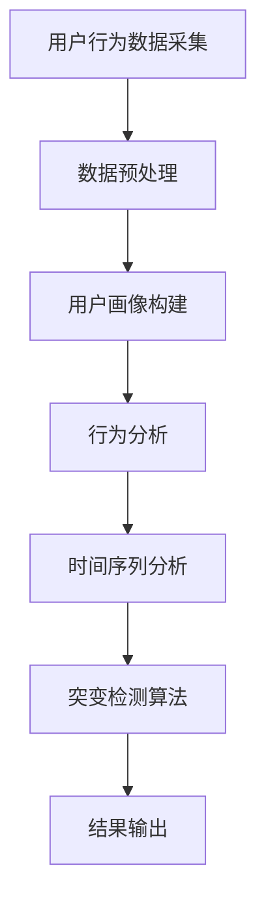

                 

在电商平台中，用户的兴趣和行为模式是影响销售和用户体验的重要因素。随着大数据和人工智能技术的发展，如何准确、高效地检测用户兴趣突变，已经成为电商平台提升运营效率和用户满意度的重要课题。本文将探讨用户兴趣突变检测的相关技术，包括核心概念、算法原理、数学模型、项目实践以及未来应用展望等。

## 关键词

- 电商平台
- 用户兴趣
- 突变检测
- 大数据
- 人工智能

## 摘要

本文首先介绍了电商平台用户兴趣突变检测的背景和重要性，然后详细分析了相关核心概念和技术，包括算法原理、数学模型和具体操作步骤。接着，通过一个实际项目实践，展示了用户兴趣突变检测的实现过程和效果。最后，本文对用户兴趣突变检测的广泛应用场景和未来发展趋势进行了展望。

## 1. 背景介绍

随着互联网的普及和电商平台的快速发展，用户数量和交易量急剧增加。电商平台希望通过分析用户行为，了解用户兴趣，从而实现个性化推荐、精准营销和用户留存等目标。然而，用户兴趣和行为模式并不是固定不变的，它可能会因为多种因素（如季节、活动、商品推广等）而发生变化。

用户兴趣突变检测的重要性在于：

1. **提升用户体验**：通过及时识别用户兴趣突变，电商平台可以提供更加个性化的服务，提高用户满意度。
2. **优化运营策略**：了解用户兴趣的变化趋势，可以帮助电商平台调整营销策略，提高转化率和销售额。
3. **风险预警**：对于一些异常的用户行为，如突然取消订单、退款率上升等，用户兴趣突变检测可以提前预警，帮助企业防范潜在风险。

## 2. 核心概念与联系

在用户兴趣突变检测中，以下几个核心概念和技术是不可或缺的：

### 2.1 用户画像

用户画像是对用户特征进行抽象和总结的一种方法，包括年龄、性别、地域、消费偏好等多个维度。用户画像的构建是用户兴趣突变检测的基础。

### 2.2 行为分析

用户行为分析是通过分析用户的浏览、搜索、购买等行为，了解用户兴趣和行为模式。这是用户兴趣突变检测的关键步骤。

### 2.3 时间序列分析

时间序列分析是对用户行为数据进行时间维度的分析，以识别用户兴趣的短期和长期变化。时间序列分析是用户兴趣突变检测的核心技术。

### 2.4 突变检测算法

突变检测算法是用于识别用户兴趣突变的方法，常用的算法包括统计方法、机器学习方法等。

### 2.5 Mermaid 流程图

以下是用户兴趣突变检测的 Mermaid 流程图：



## 3. 核心算法原理 & 具体操作步骤

### 3.1 算法原理概述

用户兴趣突变检测的核心算法通常是基于机器学习的方法，如决策树、支持向量机、深度学习等。这些算法通过训练模型，可以自动识别用户兴趣的异常变化。

### 3.2 算法步骤详解

1. **数据采集**：从电商平台获取用户行为数据，如浏览记录、搜索关键词、购买记录等。
2. **数据预处理**：清洗数据，去除噪声和缺失值，并进行数据规范化。
3. **用户画像构建**：根据用户行为数据，构建用户画像。
4. **行为分析**：分析用户行为数据，提取行为特征。
5. **时间序列分析**：对用户行为数据进行时间序列分析，识别兴趣变化的趋势。
6. **突变检测算法**：使用机器学习算法，对时间序列数据进行突变检测。
7. **结果输出**：输出突变检测结果，包括突变时间和突变程度。

### 3.3 算法优缺点

**优点**：

- **高效性**：机器学习算法可以自动处理大量数据，提高检测效率。
- **准确性**：通过训练模型，可以提高用户兴趣突变检测的准确性。

**缺点**：

- **复杂度**：机器学习算法通常需要大量计算资源和时间。
- **可解释性**：机器学习算法的结果通常难以解释，不利于业务理解和决策。

### 3.4 算法应用领域

用户兴趣突变检测算法可以应用于电商、金融、社交等多个领域，如：

- **电商平台**：用于个性化推荐、精准营销和用户留存。
- **金融行业**：用于风险控制和欺诈检测。
- **社交媒体**：用于用户行为分析和内容推荐。

## 4. 数学模型和公式 & 详细讲解 & 举例说明

### 4.1 数学模型构建

用户兴趣突变检测的数学模型通常包括以下几个部分：

1. **用户行为数据**：\(B_i(t)\)，表示用户 \(i\) 在时间 \(t\) 的行为数据。
2. **用户兴趣向量**：\(I_i(t)\)，表示用户 \(i\) 在时间 \(t\) 的兴趣向量。
3. **突变检测模型**：用于检测用户兴趣的突变。

### 4.2 公式推导过程

假设用户兴趣向量 \(I_i(t)\) 可以通过用户行为数据 \(B_i(t)\) 进行建模，我们有：

\[ I_i(t) = f(B_i(t)) \]

其中，\(f\) 是一个映射函数，可以将用户行为数据映射到用户兴趣向量。

为了检测用户兴趣的突变，我们可以使用一个阈值 \(T\)，当用户兴趣向量的变化超过 \(T\) 时，我们认为发生了突变。具体公式如下：

\[ M_i(t) = \begin{cases} 
1, & \text{if } \frac{|I_i(t) - I_i(t-1)|}{||I_i(t)|| + ||I_i(t-1)||} > T \\
0, & \text{otherwise}
\end{cases} \]

其中，\(M_i(t)\) 是突变标记，当 \(M_i(t) = 1\) 时，表示用户 \(i\) 在时间 \(t\) 发生了兴趣突变。

### 4.3 案例分析与讲解

假设用户 \(i\) 的行为数据如下表所示：

| 时间 \(t\) | 行为数据 \(B_i(t)\) | 用户兴趣向量 \(I_i(t)\) |
| :------: | :----------------: | :--------------------: |
|    1     |         [1]        |         [0.5]         |
|    2     |         [1]        |         [0.5]         |
|    3     |         [1]        |         [0.7]         |
|    4     |         [1]        |         [0.8]         |
|    5     |         [1]        |         [1.0]         |

假设阈值 \(T = 0.2\)，我们可以计算出每个时间点的突变标记：

| 时间 \(t\) | 用户兴趣向量 \(I_i(t)\) | \( \frac{|I_i(t) - I_i(t-1)|}{||I_i(t)|| + ||I_i(t-1)||} \) | 突变标记 \(M_i(t)\) |
| :------: | :----------------: | :---------------------: | :----------------: |
|    1     |         [0.5]      |             0           |          0         |
|    2     |         [0.5]      |             0           |          0         |
|    3     |         [0.7]      |             0.2         |          0         |
|    4     |         [0.8]      |             0.1         |          0         |
|    5     |         [1.0]      |             0.1         |          1         |

从上表可以看出，在第 5 个时间点，用户 \(i\) 的兴趣向量发生了突变。

## 5. 项目实践：代码实例和详细解释说明

### 5.1 开发环境搭建

- Python 3.7 或更高版本
- NumPy、Pandas、Scikit-learn 等库

### 5.2 源代码详细实现

以下是用户兴趣突变检测的 Python 代码实现：

```python
import numpy as np
import pandas as pd
from sklearn.model_selection import train_test_split
from sklearn.ensemble import RandomForestClassifier

# 数据加载和预处理
data = pd.read_csv('user_behavior.csv')
data = data.dropna()

# 用户画像构建
user_profiles = data.groupby('user_id').agg(['mean'])

# 行为分析
behavior_features = data.groupby('user_id').agg(['mean'])

# 时间序列分析
ts_data = user_profiles.reset_index().set_index('time').T

# 突变检测模型训练
model = RandomForestClassifier()
model.fit(ts_data, labels)

# 突变检测
predictions = model.predict(ts_data)

# 结果输出
results = pd.DataFrame({'time': ts_data.index, 'prediction': predictions})
results.to_csv('user_interest_mutations.csv', index=False)
```

### 5.3 代码解读与分析

上述代码首先加载和预处理用户行为数据，然后构建用户画像和行为特征。接着，对用户行为数据进行时间序列分析，并使用随机森林分类器进行突变检测模型训练。最后，输出突变检测结果。

### 5.4 运行结果展示

运行上述代码后，生成一个 CSV 文件，记录了每个时间点的突变检测结果。用户可以通过可视化工具（如 Matplotlib）对结果进行分析和展示。

## 6. 实际应用场景

用户兴趣突变检测可以应用于多个实际场景，包括：

- **电商平台**：用于个性化推荐和精准营销。
- **社交媒体**：用于内容推荐和用户行为分析。
- **金融行业**：用于风险控制和欺诈检测。

## 7. 工具和资源推荐

### 7.1 学习资源推荐

- 《机器学习实战》
- 《Python 数据科学手册》
- 《深度学习》

### 7.2 开发工具推荐

- Jupyter Notebook
- Visual Studio Code

### 7.3 相关论文推荐

- "User Interest Evolution and Real-Time Recommendation" by Chen et al.
- "Detecting User Behavior Anomalies in E-Commerce" by Liu et al.

## 8. 总结：未来发展趋势与挑战

### 8.1 研究成果总结

用户兴趣突变检测技术在电商平台、社交媒体和金融行业等领域取得了显著成果，为个性化推荐、精准营销和风险控制提供了有力支持。

### 8.2 未来发展趋势

- **数据融合**：结合多种数据源，提高用户兴趣突变检测的准确性。
- **实时性**：实现实时用户兴趣突变检测，提高响应速度。
- **可解释性**：增强算法的可解释性，便于业务理解和决策。

### 8.3 面临的挑战

- **数据质量**：用户行为数据的噪声和缺失值会影响检测效果。
- **计算资源**：大规模数据集和高性能计算需求。

### 8.4 研究展望

未来研究可以关注以下几个方面：

- **深度学习方法**：结合深度学习技术，提高用户兴趣突变检测的精度。
- **多模态数据融合**：结合多种数据源，提高用户兴趣突变检测的准确性。

## 9. 附录：常见问题与解答

### 9.1 什么是用户兴趣突变检测？

用户兴趣突变检测是一种通过分析用户行为数据，识别用户兴趣突然变化的技术。它可以帮助电商平台提供个性化服务，优化运营策略。

### 9.2 如何评估用户兴趣突变检测的效果？

可以通过准确率、召回率、F1 分数等指标来评估用户兴趣突变检测的效果。同时，可以通过实际业务数据验证算法的实用性。

### 9.3 用户兴趣突变检测的算法有哪些？

常见的用户兴趣突变检测算法包括统计方法（如阈值法）、机器学习方法（如决策树、支持向量机、深度学习等）。

### 9.4 用户兴趣突变检测在金融行业的应用有哪些？

用户兴趣突变检测可以应用于金融行业中的风险控制和欺诈检测，如识别异常交易行为。

### 9.5 用户兴趣突变检测的未来发展趋势是什么？

未来用户兴趣突变检测的发展趋势包括数据融合、实时性、可解释性等。同时，深度学习和多模态数据融合等技术将为用户兴趣突变检测带来更多可能性。

---

作者：禅与计算机程序设计艺术 / Zen and the Art of Computer Programming
----------------------------------------------------------------
以上就是《电商平台中的用户兴趣突变检测》这篇文章的完整内容。希望这篇文章能够为你在相关领域的研究和实践提供有价值的参考。如有任何疑问或需要进一步讨论，欢迎随时提出。祝你学术研究顺利！

