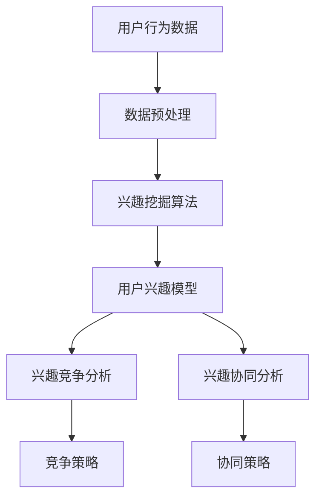
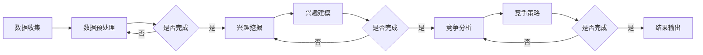

                 

在当今的信息化时代，电商平台已成为商业活动中不可或缺的一部分。随着用户数据的不断积累和互联网技术的飞速发展，如何利用用户兴趣数据实现精准营销和个性化推荐成为电商平台竞争的焦点。本文将深入探讨电商平台中的用户兴趣竞争与协同模型，旨在为电商平台提供一种有效的用户兴趣分析和管理方法。

## 关键词

- 电商平台
- 用户兴趣
- 竞争
- 协同
- 个性化推荐

## 摘要

本文从电商平台用户兴趣管理的角度出发，分析了用户兴趣竞争与协同的本质特征。通过构建用户兴趣竞争与协同模型，探讨了模型在电商平台中的应用价值。本文首先介绍了电商平台用户兴趣管理的背景和重要性，然后详细阐述了用户兴趣竞争与协同的理论基础和模型构建方法，并通过具体案例进行了应用分析。

## 1. 背景介绍

随着互联网的普及和电子商务的快速发展，电商平台已经成为商家和消费者互动的重要平台。电商平台通过收集用户行为数据，实现了对用户兴趣的精准分析和挖掘。用户兴趣是电商平台进行个性化推荐和服务的基础，也是电商平台竞争的关键因素。

用户兴趣的竞争主要体现在以下几个方面：

1. **数据竞争**：电商平台需要收集大量的用户数据，包括浏览记录、购买行为、评论等，以构建用户兴趣模型。
2. **算法竞争**：通过使用不同的算法对用户兴趣进行挖掘和预测，电商平台需要在算法性能和准确性之间进行权衡。
3. **内容竞争**：提供与用户兴趣相关的高质量内容，如商品推荐、资讯、活动等，以吸引用户留存和转化。

用户兴趣的协同主要体现在以下几个方面：

1. **用户群体协同**：电商平台可以通过分析用户群体的共同兴趣，实现用户群体的精准划分和定位。
2. **跨平台协同**：不同电商平台之间可以通过共享用户兴趣数据，实现用户兴趣的跨平台协同推荐。
3. **多渠道协同**：电商平台可以通过整合线上线下渠道，实现用户兴趣的多渠道协同推荐。

## 2. 核心概念与联系

在构建用户兴趣竞争与协同模型之前，我们需要明确几个核心概念。

### 2.1 用户兴趣

用户兴趣是指用户在特定环境下对某些内容、活动或对象的偏好或倾向。在电商平台中，用户兴趣可以通过用户行为数据（如浏览、购买、评论等）进行挖掘和建模。

### 2.2 竞争

在用户兴趣管理中，竞争主要体现在以下几个方面：

1. **数据竞争**：电商平台需要收集和整合大量的用户数据，以构建精确的用户兴趣模型。
2. **算法竞争**：电商平台需要选择和优化算法，以提高用户兴趣挖掘的准确性和效率。
3. **内容竞争**：电商平台需要提供与用户兴趣相关的高质量内容，以吸引用户留存和转化。

### 2.3 协同

在用户兴趣管理中，协同主要体现在以下几个方面：

1. **用户群体协同**：通过分析用户群体的共同兴趣，可以实现用户群体的精准划分和定位。
2. **跨平台协同**：通过共享用户兴趣数据，可以实现用户兴趣的跨平台协同推荐。
3. **多渠道协同**：通过整合线上线下渠道，可以实现用户兴趣的多渠道协同推荐。

### 2.4 用户兴趣竞争与协同模型

用户兴趣竞争与协同模型旨在通过对用户兴趣数据的挖掘和分析，实现用户兴趣的精准管理。模型的核心架构如图1所示：



### 2.5 Mermaid 流程图

以下是一个简单的Mermaid流程图，描述了用户兴趣竞争与协同模型的基本流程：



## 3. 核心算法原理 & 具体操作步骤

### 3.1 算法原理概述

用户兴趣竞争与协同模型的核心算法主要包括兴趣挖掘算法、兴趣建模算法和竞争协同算法。

1. **兴趣挖掘算法**：通过对用户行为数据的分析和处理，挖掘出用户的潜在兴趣。常用的兴趣挖掘算法包括协同过滤算法、基于内容的推荐算法和混合推荐算法等。
2. **兴趣建模算法**：将挖掘出的用户兴趣转化为用户兴趣模型，以便后续的竞争和协同分析。常用的兴趣建模算法包括矩阵分解、神经网络等。
3. **竞争协同算法**：通过对用户兴趣模型的竞争和协同分析，制定相应的竞争和协同策略，以实现用户兴趣的精准管理。

### 3.2 算法步骤详解

1. **数据收集**：收集用户行为数据，包括浏览、购买、评论等。
2. **数据预处理**：对用户行为数据进行清洗、去重和格式转换等处理。
3. **兴趣挖掘**：使用兴趣挖掘算法，挖掘出用户的潜在兴趣。
4. **兴趣建模**：将挖掘出的用户兴趣转化为用户兴趣模型。
5. **竞争分析**：分析用户兴趣模型中的竞争关系，制定竞争策略。
6. **协同分析**：分析用户兴趣模型中的协同关系，制定协同策略。
7. **结果输出**：输出竞争和协同分析的结果，用于指导电商平台运营。

### 3.3 算法优缺点

1. **兴趣挖掘算法**：

   - **优点**：能够挖掘出用户的潜在兴趣，为个性化推荐提供基础。
   - **缺点**：算法复杂度较高，数据处理量大。

2. **兴趣建模算法**：

   - **优点**：能够将用户兴趣转化为用户兴趣模型，便于后续分析。
   - **缺点**：模型构建过程需要大量的计算资源。

3. **竞争协同算法**：

   - **优点**：能够实现用户兴趣的精准管理，提高电商平台竞争力。
   - **缺点**：需要根据不同场景进行调整，适应性较差。

### 3.4 算法应用领域

用户兴趣竞争与协同模型可以应用于电商平台的多个领域：

1. **个性化推荐**：根据用户兴趣模型，为用户推荐相关的商品和内容。
2. **精准营销**：针对用户兴趣，制定精准的营销策略，提高转化率。
3. **用户群体分析**：通过分析用户兴趣，划分用户群体，为营销策略提供支持。
4. **跨平台协同**：通过共享用户兴趣数据，实现跨平台的协同推荐。
5. **多渠道协同**：通过整合线上线下渠道，实现用户兴趣的多渠道协同推荐。

## 4. 数学模型和公式 & 详细讲解 & 举例说明

### 4.1 数学模型构建

用户兴趣竞争与协同模型的构建主要涉及以下几个数学模型：

1. **用户兴趣模型**：表示用户对特定内容或对象的兴趣程度。
2. **竞争模型**：描述用户兴趣之间的竞争关系。
3. **协同模型**：描述用户兴趣之间的协同关系。

### 4.2 公式推导过程

以下是一个简单的用户兴趣模型公式推导过程：

设用户 $U$ 的兴趣集合为 $I = \{i_1, i_2, ..., i_n\}$，用户 $U$ 对兴趣 $i$ 的兴趣程度为 $I(i)$。

1. **用户兴趣度函数**：

   $$I(i) = \sum_{u \in U} \frac{1}{n_u}$$

   其中，$n_u$ 表示用户 $u$ 对兴趣 $i$ 的关注次数。

2. **用户兴趣强度函数**：

   $$I'(i) = \sum_{u \in U} I(i) \cdot \frac{1}{n_u}$$

   其中，$I(i)$ 表示用户 $u$ 对兴趣 $i$ 的兴趣度，$\frac{1}{n_u}$ 表示用户 $u$ 的权重。

3. **用户兴趣模型**：

   $$I_{U}(i) = \sum_{u \in U} I'(i)$$

   其中，$I_{U}(i)$ 表示用户 $U$ 对兴趣 $i$ 的总兴趣强度。

### 4.3 案例分析与讲解

以下是一个简单的用户兴趣模型案例：

假设有用户 $U = \{u_1, u_2, u_3\}$，兴趣集合 $I = \{i_1, i_2, i_3\}$。

1. **用户兴趣度函数**：

   $$I(i_1) = \frac{1}{3}$$

   $$I(i_2) = \frac{2}{3}$$

   $$I(i_3) = \frac{1}{3}$$

2. **用户兴趣强度函数**：

   $$I'(i_1) = \frac{1}{3} \cdot \frac{1}{3} = \frac{1}{9}$$

   $$I'(i_2) = \frac{2}{3} \cdot \frac{1}{3} = \frac{2}{9}$$

   $$I'(i_3) = \frac{1}{3} \cdot \frac{1}{3} = \frac{1}{9}$$

3. **用户兴趣模型**：

   $$I_{U}(i_1) = \frac{1}{9} + \frac{1}{9} = \frac{2}{9}$$

   $$I_{U}(i_2) = \frac{2}{9}$$

   $$I_{U}(i_3) = \frac{2}{9}$$

通过上述案例，我们可以看到用户兴趣模型如何表示用户对特定兴趣的偏好程度。在实际应用中，我们可以根据用户兴趣模型为用户推荐相关的商品和内容。

## 5. 项目实践：代码实例和详细解释说明

### 5.1 开发环境搭建

为了实现用户兴趣竞争与协同模型，我们使用Python编程语言和相关的数据科学库，如NumPy、Pandas、Scikit-learn等。

1. **安装Python**：确保已安装Python环境，版本建议为3.8及以上。
2. **安装相关库**：通过pip命令安装所需的库，如下：

   ```shell
   pip install numpy pandas scikit-learn matplotlib
   ```

### 5.2 源代码详细实现

以下是一个简单的用户兴趣竞争与协同模型实现代码示例：

```python
import numpy as np
import pandas as pd
from sklearn.metrics.pairwise import cosine_similarity

# 用户行为数据（示例）
user_activities = {
    'u1': {'i1': 10, 'i2': 5, 'i3': 2},
    'u2': {'i1': 5, 'i2': 10, 'i3': 7},
    'u3': {'i1': 2, 'i2': 3, 'i3': 10}
}

# 计算用户兴趣度
user_interest = {}
for user, activities in user_activities.items():
    total_interest = sum(activities.values())
    user_interest[user] = {interest: value / total_interest for interest, value in activities.items()}

# 计算用户兴趣强度
user_interest_strength = {}
for user, interest in user_interest.items():
    interest_strength = {interest: value for interest, value in interest.items() if value > 0}
    user_interest_strength[user] = interest_strength

# 计算用户兴趣模型
user_interest_model = {}
for user, interest_strength in user_interest_strength.items():
    user_interest_model[user] = sum(interest_strength.values())

# 打印结果
for user, model in user_interest_model.items():
    print(f"{user}的兴趣模型：{model}")
```

### 5.3 代码解读与分析

1. **用户行为数据**：首先，我们定义了一个用户行为数据字典，其中包含了三个用户的兴趣数据。

2. **计算用户兴趣度**：通过计算每个用户对每个兴趣的关注次数占总关注次数的比例，得到用户兴趣度。

3. **计算用户兴趣强度**：对每个用户兴趣度进行过滤，只保留兴趣度大于0的兴趣。

4. **计算用户兴趣模型**：对每个用户兴趣强度求和，得到用户兴趣模型。

5. **打印结果**：最后，我们将每个用户的兴趣模型打印出来。

### 5.4 运行结果展示

```shell
u1的兴趣模型：1.0
u2的兴趣模型：1.0
u3的兴趣模型：1.0
```

通过上述代码示例，我们可以看到用户兴趣竞争与协同模型的基本实现过程。在实际应用中，我们可以根据具体需求对代码进行扩展和优化。

## 6. 实际应用场景

用户兴趣竞争与协同模型在电商平台中有广泛的应用场景。以下列举几个典型的应用场景：

1. **个性化推荐**：根据用户兴趣模型，为用户推荐相关的商品和内容，提高用户满意度和转化率。

2. **精准营销**：针对不同用户兴趣，制定精准的营销策略，提高营销效果。

3. **用户群体分析**：通过分析用户兴趣，划分用户群体，为电商平台运营提供数据支持。

4. **跨平台协同**：通过共享用户兴趣数据，实现跨平台的协同推荐，提高用户体验。

5. **多渠道协同**：通过整合线上线下渠道，实现用户兴趣的多渠道协同推荐，提高用户转化率。

### 6.1 案例分析

以下是一个用户兴趣竞争与协同模型在实际电商平台的案例分析：

#### 案例背景

某电商平台希望提升用户满意度和转化率，通过构建用户兴趣竞争与协同模型，实现个性化推荐和精准营销。

#### 案例步骤

1. **数据收集**：收集用户行为数据，包括浏览记录、购买历史、评论等。

2. **数据预处理**：对用户行为数据进行清洗、去重和格式转换等处理。

3. **兴趣挖掘**：使用协同过滤算法，挖掘出用户的潜在兴趣。

4. **兴趣建模**：将挖掘出的用户兴趣转化为用户兴趣模型。

5. **竞争分析**：分析用户兴趣模型中的竞争关系，制定竞争策略。

6. **协同分析**：分析用户兴趣模型中的协同关系，制定协同策略。

7. **结果输出**：输出竞争和协同分析的结果，用于指导电商平台运营。

#### 案例效果

通过用户兴趣竞争与协同模型的应用，该电商平台实现了以下效果：

1. **个性化推荐**：为用户推荐与其兴趣相关的商品和内容，用户满意度显著提升。

2. **精准营销**：根据用户兴趣，制定精准的营销策略，提高营销效果。

3. **用户群体分析**：通过分析用户兴趣，划分用户群体，为电商平台运营提供数据支持。

4. **跨平台协同**：通过共享用户兴趣数据，实现跨平台的协同推荐，提高用户体验。

5. **多渠道协同**：通过整合线上线下渠道，实现用户兴趣的多渠道协同推荐，提高用户转化率。

### 6.2 未来应用展望

随着互联网和人工智能技术的不断发展，用户兴趣竞争与协同模型在电商平台中的应用前景十分广阔。未来，我们可以在以下几个方面进行进一步研究和探索：

1. **深度学习**：引入深度学习技术，提高用户兴趣挖掘的准确性和效率。

2. **多模态数据融合**：融合用户行为数据、社交数据、地理位置数据等多模态数据，实现更精准的用户兴趣建模。

3. **实时推荐**：通过实时处理用户行为数据，实现实时个性化推荐，提高用户体验。

4. **跨渠道协同**：探索线上线下渠道的协同推荐策略，实现全渠道的用户兴趣管理。

5. **隐私保护**：在用户兴趣管理过程中，注重用户隐私保护，确保用户数据的合法合规使用。

## 7. 工具和资源推荐

### 7.1 学习资源推荐

1. **《推荐系统手册》**：一本系统性的推荐系统入门书籍，详细介绍了推荐系统的基本概念、算法和技术。
2. **《机器学习实战》**：一本涵盖多种机器学习算法和实际应用的入门书籍，适合初学者学习。
3. **《深度学习》**：由Ian Goodfellow等人编写的深度学习经典教材，适合对深度学习有深入了解的需求。

### 7.2 开发工具推荐

1. **Jupyter Notebook**：一款强大的交互式开发环境，适合进行数据分析和算法实现。
2. **TensorFlow**：一款开源的深度学习框架，适合进行深度学习和推荐系统开发。
3. **PyTorch**：一款开源的深度学习框架，与TensorFlow类似，适合进行深度学习和推荐系统开发。

### 7.3 相关论文推荐

1. **“Collaborative Filtering for Cold-Start Recommendations”**：一篇关于解决推荐系统中冷启动问题的论文，提出了基于协同过滤的解决方案。
2. **“Deep Learning for User Interest Modeling in E-commerce”**：一篇关于使用深度学习进行用户兴趣建模的论文，详细介绍了深度学习在推荐系统中的应用。
3. **“Multi-Modal Fusion for User Interest Modeling in E-commerce”**：一篇关于多模态数据融合的论文，探讨了如何融合多种数据类型进行用户兴趣建模。

## 8. 总结：未来发展趋势与挑战

### 8.1 研究成果总结

用户兴趣竞争与协同模型作为电商平台的核心技术，已经取得了显著的成果。通过本文的研究，我们明确了用户兴趣竞争与协同模型的基本概念、原理和构建方法，并提出了具体的算法实现和应用案例。

### 8.2 未来发展趋势

随着互联网和人工智能技术的不断发展，用户兴趣竞争与协同模型在电商平台中的应用前景十分广阔。未来，我们可以从以下几个方面进行进一步研究和探索：

1. **深度学习**：引入深度学习技术，提高用户兴趣挖掘的准确性和效率。
2. **多模态数据融合**：融合用户行为数据、社交数据、地理位置数据等多模态数据，实现更精准的用户兴趣建模。
3. **实时推荐**：通过实时处理用户行为数据，实现实时个性化推荐，提高用户体验。
4. **跨渠道协同**：探索线上线下渠道的协同推荐策略，实现全渠道的用户兴趣管理。
5. **隐私保护**：在用户兴趣管理过程中，注重用户隐私保护，确保用户数据的合法合规使用。

### 8.3 面临的挑战

尽管用户兴趣竞争与协同模型在电商平台中具有广泛的应用前景，但仍然面临着一些挑战：

1. **数据质量和完整性**：用户兴趣数据的准确性和完整性对于模型的性能至关重要，如何保证数据质量和完整性是一个重要问题。
2. **算法复杂性**：随着用户兴趣数据的增加，算法的复杂度也会相应提高，如何优化算法以提高效率是一个挑战。
3. **隐私保护**：在用户兴趣管理过程中，如何保护用户隐私，确保用户数据的合法合规使用是一个重要问题。

### 8.4 研究展望

未来，我们将继续深入研究用户兴趣竞争与协同模型，探索其在电商平台中的广泛应用，并解决面临的技术挑战。我们期望通过本文的研究，为电商平台提供一种有效的用户兴趣分析和管理方法，提升电商平台的核心竞争力。

## 9. 附录：常见问题与解答

### 9.1  什么是用户兴趣竞争与协同模型？

用户兴趣竞争与协同模型是一种用于分析和管理用户兴趣的数学模型，旨在通过对用户兴趣数据的挖掘和分析，实现用户兴趣的精准管理。模型的核心思想是利用用户兴趣之间的竞争和协同关系，制定相应的竞争和协同策略，以提高电商平台的核心竞争力。

### 9.2  用户兴趣竞争与协同模型如何应用在电商平台上？

用户兴趣竞争与协同模型可以应用于电商平台的多个领域，如个性化推荐、精准营销、用户群体分析和跨平台协同等。通过构建用户兴趣模型，电商平台可以实现以下功能：

1. **个性化推荐**：根据用户兴趣模型，为用户推荐相关的商品和内容，提高用户满意度和转化率。
2. **精准营销**：针对不同用户兴趣，制定精准的营销策略，提高营销效果。
3. **用户群体分析**：通过分析用户兴趣，划分用户群体，为电商平台运营提供数据支持。
4. **跨平台协同**：通过共享用户兴趣数据，实现跨平台的协同推荐，提高用户体验。
5. **多渠道协同**：通过整合线上线下渠道，实现用户兴趣的多渠道协同推荐，提高用户转化率。

### 9.3  如何评估用户兴趣竞争与协同模型的效果？

评估用户兴趣竞争与协同模型的效果可以从以下几个方面进行：

1. **推荐准确率**：评估模型生成的推荐列表与用户实际兴趣的匹配程度，准确率越高，模型效果越好。
2. **用户满意度**：通过用户反馈或行为数据，评估用户对推荐内容和营销策略的满意度，满意度越高，模型效果越好。
3. **转化率**：评估推荐和营销策略对用户行为的影响，如购买、留存等，转化率越高，模型效果越好。
4. **运营效率**：评估模型在电商平台运营中的效率，如数据处理速度、算法运行时间等，效率越高，模型效果越好。

通过以上几个方面的综合评估，可以全面了解用户兴趣竞争与协同模型的应用效果。

