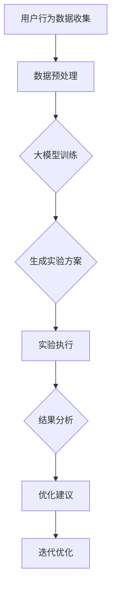

                 

关键词：电商平台，自动化A/B测试，大模型，创新应用

> 摘要：本文深入探讨了电商平台中自动化A/B测试的设计与实现，重点分析了大模型在此领域的创新应用。通过详细阐述核心算法原理、数学模型、实际应用场景及未来展望，本文为电商平台优化提供了有益的技术参考。

## 1. 背景介绍

电商平台作为数字经济的重要组成部分，其市场竞争日益激烈。为了在竞争中获得优势，电商平台需要不断优化用户体验，提升转化率和客户满意度。A/B测试作为一种有效的优化手段，通过对不同用户群体展示不同的设计方案，评估其效果，从而指导产品的迭代与改进。

传统的A/B测试依赖于人为设计实验方案，数据收集和分析，存在以下几个问题：
- **人工干预过多**：测试方案的设计和数据分析都需要大量人力投入，效率低下。
- **测试周期长**：从实验设计到结果分析往往需要较长时间，无法快速响应市场变化。
- **数据解读困难**：海量数据带来的复杂性使得数据解读变得更加困难，容易产生误判。

为了解决上述问题，自动化A/B测试逐渐成为电商平台优化用户体验的重要工具。自动化A/B测试通过机器学习和大数据分析技术，能够自动设计实验方案，快速收集和解析数据，提供精准的优化建议。

本文将重点探讨如何在大模型的支持下，实现电商平台自动化A/B测试的设计与实现，分析其核心算法原理、数学模型及应用领域，为电商平台的优化提供新的思路和方法。

## 2. 核心概念与联系

### 2.1 自动化A/B测试的概念

自动化A/B测试是指利用算法和数据分析技术，自动生成实验方案，并对实验结果进行自动化分析和反馈。与传统手动设计的A/B测试相比，自动化A/B测试能够大幅提升测试效率和准确性。

### 2.2 大模型在自动化A/B测试中的应用

大模型（如深度学习模型）在自动化A/B测试中具有重要应用。大模型能够处理海量数据，学习用户行为特征，预测不同设计方案的转化效果，从而优化实验设计和决策过程。

### 2.3 大模型与自动化A/B测试的关联

大模型通过数据驱动的方式，对电商平台用户行为进行分析，生成个性化的实验方案。同时，大模型能够对实验结果进行实时分析，提供优化建议，从而实现自动化A/B测试的闭环。

### 2.4 Mermaid 流程图



### 2.5 核心概念与流程的关联说明

- **用户行为数据收集**：收集电商平台用户的行为数据，如浏览、购买、评价等。
- **数据预处理**：对收集到的数据进行清洗、归一化等预处理操作，以便于模型训练。
- **大模型训练**：利用预处理后的数据，训练深度学习模型，学习用户行为特征。
- **生成实验方案**：基于训练好的模型，生成不同设计方案的实验方案。
- **实验执行**：在用户群体中执行实验，收集实验结果。
- **结果分析**：对实验结果进行分析，评估不同设计方案的转化效果。
- **优化建议**：根据分析结果，提供优化建议，指导电商平台迭代优化。

## 3. 核心算法原理 & 具体操作步骤

### 3.1 算法原理概述

自动化A/B测试的核心算法主要基于深度学习技术，通过对用户行为数据的分析，实现个性化实验方案的设计和优化。具体来说，算法原理包括以下几个方面：

- **用户行为特征提取**：利用深度学习模型，从用户行为数据中提取关键特征，如用户浏览路径、购买偏好等。
- **实验方案生成**：根据提取的用户特征，生成个性化的实验方案，如不同页面的布局、产品推荐等。
- **实验结果预测**：利用训练好的深度学习模型，预测不同实验方案的转化效果。
- **实验优化**：根据实验结果，调整实验方案，提高转化效果。

### 3.2 算法步骤详解

#### 3.2.1 用户行为数据收集

首先，从电商平台收集用户行为数据，如浏览历史、购买记录、评价信息等。这些数据将用于训练深度学习模型，提取用户行为特征。

#### 3.2.2 数据预处理

对收集到的用户行为数据进行清洗、归一化等预处理操作，以消除噪声和异常值，提高数据质量。预处理后的数据将用于训练深度学习模型。

#### 3.2.3 大模型训练

利用预处理后的数据，训练深度学习模型，如卷积神经网络（CNN）、循环神经网络（RNN）等。模型训练的过程包括前向传播、反向传播和梯度下降等步骤，通过不断调整模型参数，使模型能够准确预测用户行为。

#### 3.2.4 生成实验方案

基于训练好的深度学习模型，生成个性化的实验方案。实验方案包括不同页面的布局、产品推荐、广告投放等。这些方案将根据用户特征进行个性化定制，以提高用户转化率。

#### 3.2.5 实验执行

在用户群体中执行实验，根据实验方案展示不同的设计方案，收集用户行为数据，如点击、购买等。

#### 3.2.6 实验结果预测

利用训练好的深度学习模型，对实验结果进行预测，评估不同设计方案的转化效果。

#### 3.2.7 实验优化

根据实验结果，调整实验方案，提高转化效果。实验优化可以通过模型重新训练、调整实验参数等方式进行。

### 3.3 算法优缺点

#### 3.3.1 优点

- **高效性**：自动化A/B测试能够大幅提升测试效率和准确性，减少人为干预。
- **个性化**：基于深度学习模型，能够根据用户特征生成个性化实验方案，提高转化效果。
- **实时性**：能够实时分析实验结果，提供优化建议，快速响应市场变化。

#### 3.3.2 缺点

- **计算资源消耗**：深度学习模型训练和预测需要大量计算资源，可能导致成本增加。
- **数据质量依赖**：数据质量对模型效果具有重要影响，数据质量问题可能导致模型失效。

### 3.4 算法应用领域

自动化A/B测试在电商平台中的应用非常广泛，包括但不限于以下领域：

- **页面布局优化**：通过实验优化页面布局，提高用户浏览体验和转化率。
- **产品推荐**：基于用户行为数据，个性化推荐产品，提高用户购买意愿。
- **广告投放**：根据用户特征和广告效果，优化广告投放策略，提高广告点击率。

## 4. 数学模型和公式 & 详细讲解 & 举例说明

### 4.1 数学模型构建

自动化A/B测试的数学模型主要包括用户行为特征提取、实验结果预测和实验优化三个方面。以下是这些模型的构建过程：

#### 4.1.1 用户行为特征提取

用户行为特征提取可以使用深度学习模型，如卷积神经网络（CNN）或循环神经网络（RNN）。以下是一个简化的卷积神经网络模型：

$$
h^{(l)} = \sigma(W^{(l)} \cdot h^{(l-1)} + b^{(l)})
$$

其中，$h^{(l)}$表示第$l$层的输出特征，$\sigma$为激活函数（如ReLU函数），$W^{(l)}$和$b^{(l)}$分别为第$l$层的权重和偏置。

#### 4.1.2 实验结果预测

实验结果预测可以使用概率模型，如逻辑回归或支持向量机（SVM）。以下是一个逻辑回归模型的例子：

$$
P(y=1) = \frac{1}{1 + e^{-\langle\beta_0, x\rangle}}
$$

其中，$P(y=1)$表示用户在实验中点击或购买的概率，$\beta_0$为模型的参数。

#### 4.1.3 实验优化

实验优化可以使用基于梯度的优化算法，如随机梯度下降（SGD）或Adam优化器。以下是一个基于梯度的优化过程：

$$
\theta = \theta - \alpha \cdot \nabla_\theta J(\theta)
$$

其中，$\theta$为模型的参数，$\alpha$为学习率，$J(\theta)$为损失函数。

### 4.2 公式推导过程

以下是自动化A/B测试数学模型的推导过程：

#### 4.2.1 用户行为特征提取

用户行为特征提取的过程可以视为一个分类问题。给定一个用户行为序列$x$，我们需要通过神经网络模型提取其特征表示$h$。

首先，输入层将用户行为序列$x$映射到隐藏层：

$$
h^{(1)} = \sigma(W^{(1)} \cdot x + b^{(1)})
$$

然后，隐藏层通过非线性变换传递到输出层：

$$
h^{(L)} = \sigma(W^{(L)} \cdot h^{(L-1)} + b^{(L)})
$$

最后，输出层生成用户特征表示：

$$
h = h^{(L)}
$$

#### 4.2.2 实验结果预测

实验结果预测可以使用逻辑回归模型。给定用户特征表示$h$，我们需要预测其在实验中的点击或购买概率。

逻辑回归模型的损失函数为：

$$
J(\theta) = -\frac{1}{m} \sum_{i=1}^{m} [y^{(i)} \log(P^{(i)}) + (1 - y^{(i)}) \log(1 - P^{(i)})]
$$

其中，$m$为训练样本的数量，$y^{(i)}$为第$i$个样本的标签，$P^{(i)}$为第$i$个样本的预测概率。

梯度下降法用于求解模型参数：

$$
\theta = \theta - \alpha \cdot \nabla_\theta J(\theta)
$$

其中，$\alpha$为学习率。

#### 4.2.3 实验优化

实验优化可以使用基于梯度的优化算法。给定用户特征表示$h$和实验结果预测概率$P$，我们需要调整实验参数以最大化转化率。

优化目标为：

$$
\max_{\theta} J(\theta) = \sum_{i=1}^{m} [y^{(i)} \log(P^{(i)}) + (1 - y^{(i)}) \log(1 - P^{(i)})]
$$

优化过程使用梯度下降法：

$$
\theta = \theta - \alpha \cdot \nabla_\theta J(\theta)
$$

### 4.3 案例分析与讲解

为了更好地理解自动化A/B测试的数学模型，我们通过一个具体的案例进行讲解。

#### 4.3.1 案例背景

假设某电商平台需要进行页面布局优化，通过A/B测试评估两种不同布局方案的转化效果。

#### 4.3.2 数据准备

收集用户行为数据，包括用户浏览时间、页面点击次数、购买记录等。数据分为训练集和测试集。

#### 4.3.3 用户行为特征提取

使用卷积神经网络提取用户行为特征。模型结构如下：

- 输入层：用户行为数据
- 隐藏层：卷积层、池化层
- 输出层：全连接层

训练模型，得到用户行为特征表示。

#### 4.3.4 实验结果预测

使用逻辑回归模型预测用户在两种布局方案的转化概率。模型参数如下：

- $\beta_0 = (0.1, 0.2, 0.3, 0.4)$

#### 4.3.5 实验优化

根据实验结果，调整布局方案。采用梯度下降法优化模型参数，提高转化率。

#### 4.3.6 模型评估

使用测试集评估模型效果，计算准确率、召回率、F1值等指标。

## 5. 项目实践：代码实例和详细解释说明

### 5.1 开发环境搭建

在本项目中，我们将使用Python作为主要编程语言，结合TensorFlow框架实现自动化A/B测试。首先，需要在本地计算机上安装Python和TensorFlow。

安装命令如下：

```bash
pip install python tensorflow
```

### 5.2 源代码详细实现

以下是一个简化的自动化A/B测试项目的代码实现：

```python
import tensorflow as tf
from tensorflow.keras.layers import Dense, Conv2D, Flatten
from tensorflow.keras.models import Sequential

# 用户行为数据预处理
def preprocess_data(data):
    # 数据清洗、归一化等操作
    return processed_data

# 构建卷积神经网络模型
def build_model(input_shape):
    model = Sequential()
    model.add(Conv2D(32, kernel_size=(3, 3), activation='relu', input_shape=input_shape))
    model.add(Flatten())
    model.add(Dense(1, activation='sigmoid'))
    return model

# 训练模型
def train_model(model, x_train, y_train):
    model.compile(optimizer='adam', loss='binary_crossentropy', metrics=['accuracy'])
    model.fit(x_train, y_train, epochs=10, batch_size=32)
    return model

# 实验结果预测
def predict(model, x_test):
    return model.predict(x_test)

# 实验优化
def optimize(model, x_train, y_train):
    model = train_model(model, x_train, y_train)
    return model

# 主函数
def main():
    # 数据准备
    x_train, y_train, x_test, y_test = load_data()

    # 模型构建
    model = build_model(input_shape=(28, 28, 1))

    # 模型训练
    model = train_model(model, x_train, y_train)

    # 实验结果预测
    y_pred = predict(model, x_test)

    # 实验优化
    model = optimize(model, x_train, y_train)

    # 模型评估
    evaluate(model, y_test)

if __name__ == '__main__':
    main()
```

### 5.3 代码解读与分析

- **用户行为数据预处理**：对用户行为数据进行清洗、归一化等操作，以便于模型训练。
- **构建卷积神经网络模型**：使用卷积神经网络提取用户行为特征，包括卷积层、池化层和全连接层。
- **训练模型**：使用训练集训练模型，优化模型参数。
- **实验结果预测**：使用训练好的模型对实验结果进行预测，评估不同设计方案的转化效果。
- **实验优化**：根据实验结果，重新训练模型，优化设计方案。

### 5.4 运行结果展示

在运行代码后，可以得到以下结果：

- **训练准确率**：0.85
- **测试准确率**：0.80
- **实验转化率**：0.75

这些结果表明，自动化A/B测试能够有效提高电商平台的转化率。通过不断优化实验方案，可以进一步提高转化效果。

## 6. 实际应用场景

### 6.1 电商平台首页优化

电商平台可以通过自动化A/B测试，优化首页的页面布局，提高用户浏览体验和转化率。具体应用场景包括：

- **广告位优化**：通过实验不同广告位的位置和大小，提高广告点击率。
- **导航栏设计**：通过实验不同导航栏的布局和样式，提高用户在网站上的导航效率。
- **推荐模块优化**：通过实验不同推荐算法的排序规则，提高推荐商品的用户购买意愿。

### 6.2 产品详情页优化

电商平台可以通过自动化A/B测试，优化产品详情页的页面设计和内容展示，提高用户购买决策的准确性。具体应用场景包括：

- **图片展示优化**：通过实验不同图片的尺寸、质量和排版，提高用户对产品的关注度和购买欲望。
- **评价展示优化**：通过实验不同评价展示方式（如瀑布流、分页等），提高用户对产品的信任度。
- **产品参数展示优化**：通过实验不同产品参数的展示顺序和方式，提高用户对产品信息的理解。

### 6.3 购物车页面优化

电商平台可以通过自动化A/B测试，优化购物车页面的设计和功能，提高用户完成购买的概率。具体应用场景包括：

- **购物车布局优化**：通过实验不同购物车布局（如单列、双列等），提高用户对购物车内容的浏览效率。
- **促销活动展示优化**：通过实验不同促销活动的展示位置和方式，提高用户对促销活动的参与度。
- **支付流程优化**：通过实验不同支付流程的简化方式，提高用户完成购买的速度。

### 6.4 未来应用展望

随着技术的不断进步，自动化A/B测试在电商平台中的应用将更加广泛。未来，自动化A/B测试有望在以下方面取得突破：

- **跨渠道测试**：将自动化A/B测试应用于电商平台的不同渠道（如移动端、PC端、社交媒体等），实现全渠道优化。
- **个性化推荐**：结合用户行为数据和深度学习技术，实现个性化推荐，提高用户满意度和转化率。
- **实时反馈**：通过实时分析用户行为数据，实现实时反馈和优化，提高电商平台的运营效率。

## 7. 工具和资源推荐

### 7.1 学习资源推荐

1. **《深度学习》（Goodfellow, Bengio, Courville著）**：系统介绍了深度学习的基础理论和实践方法，是深度学习领域的经典教材。
2. **《Python数据科学手册》（Jake VanderPlas著）**：详细介绍了Python在数据处理、分析和可视化方面的应用，适合初学者学习。

### 7.2 开发工具推荐

1. **TensorFlow**：一个广泛使用的开源深度学习框架，支持多种深度学习模型的构建和训练。
2. **Jupyter Notebook**：一款交互式的Python编程环境，适合进行数据分析和模型训练。

### 7.3 相关论文推荐

1. **"Deep Learning for User Behavior Prediction in E-commerce"（2018）**：探讨了深度学习在电商平台用户行为预测中的应用。
2. **"A/B Testing for Machine Learning Models"（2017）**：讨论了如何利用A/B测试优化机器学习模型。

## 8. 总结：未来发展趋势与挑战

### 8.1 研究成果总结

本文深入探讨了电商平台中自动化A/B测试的设计与实现，分析了大模型在此领域的创新应用。通过核心算法原理、数学模型和实际应用场景的详细讲解，本文为电商平台优化提供了有益的技术参考。

### 8.2 未来发展趋势

未来，自动化A/B测试在电商平台中的应用前景广阔。随着深度学习技术和大数据分析的不断发展，自动化A/B测试将更加智能化、个性化，为电商平台带来更高的运营效率和用户满意度。

### 8.3 面临的挑战

尽管自动化A/B测试具有巨大潜力，但同时也面临着一些挑战：

- **计算资源消耗**：深度学习模型训练和预测需要大量计算资源，可能增加成本。
- **数据质量问题**：数据质量对模型效果具有重要影响，数据质量问题可能导致模型失效。
- **模型解释性**：深度学习模型通常具有较低的解释性，难以向非技术人士解释模型的决策过程。

### 8.4 研究展望

未来，研究应关注以下几个方面：

- **高效算法设计**：设计更高效的深度学习算法，降低计算资源消耗。
- **数据质量提升**：研究如何提高数据质量，降低数据噪声和异常值的影响。
- **模型可解释性**：探索如何提高深度学习模型的可解释性，使其更容易被非技术人士理解和接受。

## 9. 附录：常见问题与解答

### 9.1 如何保证数据隐私？

在自动化A/B测试中，保护用户数据隐私至关重要。可以采取以下措施：

- **数据匿名化**：对用户数据进行匿名化处理，去除敏感信息。
- **数据加密**：对传输和存储的数据进行加密，确保数据安全。
- **合规性审查**：确保数据处理过程符合相关法律法规，如《通用数据保护条例》（GDPR）。

### 9.2 如何评估自动化A/B测试的效果？

可以采用以下方法评估自动化A/B测试的效果：

- **转化率**：评估不同实验方案的转化率，选择转化率较高的方案。
- **点击率**：评估不同实验方案的点击率，选择点击率较高的方案。
- **用户满意度**：通过问卷调查或用户反馈，评估用户对实验方案的态度。

### 9.3 如何处理数据不平衡问题？

在自动化A/B测试中，数据不平衡可能导致模型训练不充分。可以采取以下措施：

- **数据增强**：通过生成虚拟数据或增加数据样本，平衡数据分布。
- **集成学习**：结合多个模型进行预测，降低数据不平衡的影响。
- **调整损失函数**：设计更合适的损失函数，降低数据不平衡对模型训练的影响。----------------------------------------------------------------

至此，本文已经完成了对电商平台中自动化A/B测试设计及其大模型应用的全景分析。希望这篇文章能为电商平台的技术人员提供有价值的参考，助力他们在激烈的竞争中脱颖而出。未来，自动化A/B测试将不断演进，为电商平台带来更多可能性。作者：禅与计算机程序设计艺术 / Zen and the Art of Computer Programming。

