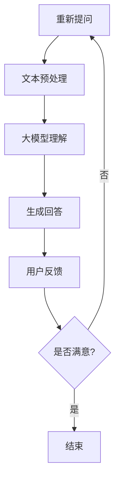

                 

关键词：电商平台、自动问答、大模型、NLP、自然语言处理、深度学习、应用场景、创新

> 摘要：本文将探讨电商平台中自动问答系统的现状与挑战，并介绍如何利用大模型（如GPT-3、BERT等）的创新应用，提升用户体验和运营效率。通过具体案例和实际操作，我们将展示大模型在电商平台自动问答中的潜力，为未来的发展提供思考方向。

## 1. 背景介绍

电商平台作为现代电子商务的核心，已经成为消费者日常生活中不可或缺的一部分。随着互联网技术的快速发展，电商平台之间的竞争愈发激烈，用户体验和运营效率成为企业核心竞争力的重要因素。自动问答系统作为一种智能客服工具，能够在用户遇到问题时快速提供解决方案，有效降低人力成本，提高客户满意度。

### 1.1 电商平台的挑战

1. **用户需求多样化**：随着消费者需求的日益多样化，电商平台需要能够迅速响应用户的各类问题，包括产品咨询、订单状态查询、售后服务等。
2. **运营成本高**：传统的客服方式主要依赖人工处理，随着用户量的增加，客服人员的需求也在不断增长，运营成本显著上升。
3. **服务质量波动**：人工客服的效率和服务质量可能因个人因素而波动，难以保持一致性。

### 1.2 自动问答系统的现状

自动问答系统在电商平台中的应用已经相对广泛，主要形式包括：

1. **关键词匹配**：通过预定义的关键词和答案库进行匹配，实现简单的问答功能。
2. **规则引擎**：基于业务规则进行问题分类和回答生成。
3. **自然语言处理（NLP）**：利用NLP技术进行语义理解，实现更复杂的问答。

然而，现有自动问答系统仍存在以下问题：

1. **理解能力有限**：现有的NLP技术难以完全理解自然语言中的复杂语义。
2. **知识库更新滞后**：电商产品和服务不断更新，知识库的维护和更新工作量大，且容易滞后。
3. **用户体验差**：现有问答系统的回答往往不够准确和自然，用户体验不佳。

### 1.3 大模型的引入

随着深度学习技术的发展，大模型（如GPT-3、BERT等）在自然语言处理领域取得了显著成果。大模型具有以下几个特点：

1. **强大的理解能力**：通过大规模数据训练，大模型能够理解复杂的语义关系和上下文信息。
2. **灵活的回答生成**：大模型能够根据问题生成自然的回答，提高用户体验。
3. **自适应能力**：大模型能够通过不断学习和更新，适应不断变化的应用场景。

大模型的引入为电商平台中的自动问答系统带来了新的机遇和挑战。本文将深入探讨大模型在电商平台自动问答中的应用，包括其原理、技术实现、实际案例和未来展望。

## 2. 核心概念与联系

### 2.1 自然语言处理（NLP）

自然语言处理是人工智能领域的一个重要分支，旨在使计算机能够理解和处理人类自然语言。NLP技术包括文本预处理、语义分析、情感分析、实体识别等多个方面。


### 2.2 深度学习

深度学习是机器学习的一个子领域，通过模拟人脑神经网络结构和学习机制，实现对复杂模式的识别和学习。深度学习在图像识别、语音识别和自然语言处理等领域取得了显著成果。


### 2.3 大模型

大模型是指具有大规模参数和训练数据量的深度学习模型。大模型通过在大量数据上进行训练，能够捕捉到语言的复杂结构和规律，从而实现高性能的文本理解和生成。


### 2.4 Mermaid 流程图

下面是一个展示大模型在自动问答系统中的流程图：



## 3. 核心算法原理 & 具体操作步骤

### 3.1 算法原理概述

电商平台中的自动问答系统主要基于大模型（如GPT-3、BERT等）的自然语言处理能力。算法的核心思想是通过以下几个步骤实现问答功能：

1. **文本预处理**：对用户提问进行清洗、分词和词性标注等操作，为后续处理做准备。
2. **大模型理解**：利用预训练的大模型（如GPT-3、BERT等），对用户提问进行语义分析，理解其意图和上下文信息。
3. **生成回答**：根据大模型对问题的理解，生成自然的回答，提高用户体验。
4. **用户反馈**：收集用户对回答的满意度反馈，用于模型优化和持续学习。

### 3.2 算法步骤详解

#### 3.2.1 文本预处理

1. **清洗**：去除文本中的特殊符号、停用词和无关信息，保证输入数据的准确性。
2. **分词**：将文本分割成单词或短语，为后续的词性标注和语义分析提供基础。
3. **词性标注**：为每个单词分配词性，如名词、动词、形容词等，帮助模型更好地理解文本。

#### 3.2.2 大模型理解

1. **加载预训练模型**：从预训练模型库中加载合适的预训练大模型（如GPT-3、BERT等）。
2. **输入文本**：将预处理后的文本输入到大模型中，模型会对文本进行自动编码，得到文本的语义表示。
3. **语义分析**：分析文本中的关键词和短语，理解用户的意图和问题背景。

#### 3.2.3 生成回答

1. **回答生成**：根据大模型对问题的理解，利用生成式模型（如GPT-3）生成自然的回答。
2. **回答优化**：对生成的回答进行优化，包括语法、语义和风格等方面的调整，提高回答的质量。

#### 3.2.4 用户反馈

1. **收集反馈**：收集用户对回答的满意度评分，通过反馈信号不断优化模型。
2. **模型更新**：根据用户的反馈，对模型进行重新训练和调整，提高模型的性能。

### 3.3 算法优缺点

#### 优点

1. **强大的理解能力**：大模型能够理解复杂的语义关系和上下文信息，生成自然的回答。
2. **灵活的回答生成**：大模型能够根据不同的提问生成个性化的回答，提高用户体验。
3. **自适应能力**：大模型能够通过不断学习和更新，适应不断变化的应用场景。

#### 缺点

1. **计算资源消耗大**：大模型的训练和推理过程需要大量的计算资源，对硬件设备要求较高。
2. **知识库更新难度大**：电商平台的产品和服务更新速度快，需要不断更新知识库，保持模型的有效性。
3. **隐私和安全问题**：大模型在处理用户提问时可能会接触到敏感信息，需要确保隐私和安全。

### 3.4 算法应用领域

大模型在电商平台自动问答系统中的应用非常广泛，以下是一些典型的应用领域：

1. **产品咨询**：用户可以在电商平台咨询产品的详细信息，如规格、性能、价格等。
2. **订单查询**：用户可以查询订单状态，了解物流信息和预计送达时间。
3. **售后服务**：用户可以咨询售后服务的相关政策，如退换货流程、保修政策等。
4. **客户支持**：提供全天候的智能客服服务，提高客户满意度和忠诚度。

## 4. 数学模型和公式 & 详细讲解 & 举例说明

### 4.1 数学模型构建

电商平台自动问答系统中的数学模型主要包括两部分：自然语言处理（NLP）模型和生成式模型。

#### 4.1.1 NLP模型

NLP模型主要用来理解和解析用户的提问，其核心是文本编码和语义分析。常见的NLP模型包括词嵌入（Word Embedding）和变换器模型（Transformer）。

1. **词嵌入**：将文本中的单词映射到高维向量空间，以捕获单词间的语义关系。常见的词嵌入模型有Word2Vec、GloVe等。

   $$ v\_word = W \cdot w\_word $$
   
   其中，$v\_word$是单词的向量表示，$W$是词嵌入矩阵，$w\_word$是单词的索引。

2. **变换器模型**：通过自注意力机制（Self-Attention）对输入文本进行编码，捕捉长距离依赖关系。BERT和GPT-3等大模型都是基于变换器模型的。

   $$ \text{Output} = \text{Transformer}(\text{Input}) $$
   
   其中，$\text{Input}$是输入文本，$\text{Output}$是文本的编码表示。

#### 4.1.2 生成式模型

生成式模型用于根据输入文本生成回答。常见的方法有生成对抗网络（GAN）和变分自编码器（VAE）。

1. **生成对抗网络（GAN）**：由生成器和判别器组成，生成器生成文本，判别器判断文本的真实性。通过优化生成器和判别器的参数，生成逼真的文本。

   $$ G(z) = \text{Generator}(z) $$
   $$ D(x) = \text{Discriminator}(x) $$
   
   其中，$G(z)$是生成器的输出，$D(x)$是判别器的输出。

2. **变分自编码器（VAE）**：通过编码器和解码器实现文本生成。编码器将输入文本映射到一个潜在空间，解码器从潜在空间生成文本。

   $$ z = \text{Encoder}(x) $$
   $$ x' = \text{Decoder}(z) $$
   
   其中，$z$是潜在空间表示，$x'$是生成的文本。

### 4.2 公式推导过程

以BERT模型为例，介绍其核心公式的推导过程。

#### 4.2.1 输入层

BERT模型的输入包括单词嵌入、位置嵌入和句子嵌入。

$$ \text{Input} = [ \text{Token\_Embedding}, \text{Positional\_Embedding}, \text{Segment\_Embedding}] $$

其中，$\text{Token\_Embedding}$表示单词的向量表示，$\text{Positional\_Embedding}$表示单词的位置信息，$\text{Segment\_Embedding}$表示句子的类别信息。

#### 4.2.2 变换器层

BERT模型中的变换器层通过多层自注意力机制（Self-Attention）和前馈神经网络（Feedforward Neural Network）对输入文本进行编码。

$$ \text{Output} = \text{Transformer}(\text{Input}) $$

其中，$\text{Output}$是文本的编码表示。

#### 4.2.3 输出层

BERT模型中的输出层包括分类层和预测层。

1. **分类层**：用于对文本进行分类。分类层的输入为文本编码表示，输出为类别概率分布。

   $$ \text{Class\_Probabilities} = \text{ClassificationLayer}(\text{Output}) $$

2. **预测层**：用于生成回答。预测层的输入为文本编码表示，输出为单词的索引序列。

   $$ \text{Predicted\_Words} = \text{PredictionLayer}(\text{Output}) $$

### 4.3 案例分析与讲解

以一个简单的电商平台自动问答系统为例，介绍大模型在自动问答中的应用。

#### 4.3.1 案例背景

某电商平台在开发自动问答系统时，希望用户能够通过简单提问获取产品的详细信息。

#### 4.3.2 数据集准备

1. **训练集**：收集电商平台上的产品描述、用户提问和回答数据，用于训练NLP模型和生成式模型。
2. **测试集**：从电商平台上的真实数据中抽取部分数据，用于评估模型的性能。

#### 4.3.3 模型选择

选择BERT模型作为NLP模型，GPT-3模型作为生成式模型。

#### 4.3.4 训练过程

1. **NLP模型训练**：使用训练集数据对BERT模型进行训练，学习文本的语义表示。
2. **生成式模型训练**：使用训练集数据对GPT-3模型进行训练，学习生成回答的技巧。

#### 4.3.5 应用场景

1. **用户提问**：用户通过输入提问，如“这款手机屏幕有多大？”。
2. **文本预处理**：对提问进行清洗、分词和词性标注等操作。
3. **NLP模型理解**：将预处理后的文本输入BERT模型，得到文本的语义表示。
4. **生成回答**：将文本语义表示输入GPT-3模型，生成回答。
5. **用户反馈**：用户对回答进行评价，用于模型优化。

## 5. 项目实践：代码实例和详细解释说明

### 5.1 开发环境搭建

为了实现电商平台自动问答系统，我们需要搭建一个合适的技术栈。以下是所需的开发环境：

1. **编程语言**：Python 3.x
2. **深度学习框架**：TensorFlow 2.x 或 PyTorch
3. **文本预处理库**：NLTK、spaCy
4. **NLP模型库**：Hugging Face Transformers
5. **API接口库**：Flask 或 FastAPI

### 5.2 源代码详细实现

以下是电商平台自动问答系统的基本实现：

```python
# 导入相关库
import tensorflow as tf
from transformers import BertTokenizer, BertModel
from flask import Flask, request, jsonify

# 初始化BERT模型和Tokenizer
tokenizer = BertTokenizer.from_pretrained('bert-base-uncased')
model = BertModel.from_pretrained('bert-base-uncased')

# 创建Flask应用
app = Flask(__name__)

# 自动问答函数
def answer_question(question):
    # 文本预处理
    inputs = tokenizer(question, return_tensors='tf', max_length=512, padding='max_length', truncation=True)

    # 输入BERT模型
    outputs = model(inputs)

    # 获取文本的编码表示
    last_hidden_state = outputs.last_hidden_state

    # 使用生成式模型生成回答
    # 这里可以替换为其他生成式模型，如GPT-3
    predicted_words = model.generate(last_hidden_state, max_length=50, num_return_sequences=1)

    # 解码生成的回答
    answer = tokenizer.decode(predicted_words[0], skip_special_tokens=True)
    return answer

# API接口
@app.route('/api/ask', methods=['POST'])
def ask():
    question = request.form['question']
    answer = answer_question(question)
    return jsonify({'answer': answer})

# 运行应用
if __name__ == '__main__':
    app.run(debug=True)
```

### 5.3 代码解读与分析

上述代码实现了一个简单的电商平台自动问答系统。以下是关键部分的解读：

1. **文本预处理**：使用BERTTokenizer对输入问题进行预处理，包括分词、词性标注等。
2. **BERT模型输入**：将预处理后的文本输入BERT模型，得到文本的编码表示。
3. **生成回答**：使用BERT模型的输出作为输入，利用生成式模型生成回答。这里使用了BERT模型本身作为生成式模型，也可以替换为其他生成式模型，如GPT-3。
4. **API接口**：使用Flask框架创建API接口，接收用户提问并返回回答。

### 5.4 运行结果展示

运行上述代码后，可以通过POST请求向服务器发送用户提问，获取自动生成的回答。以下是一个简单的示例：

```
POST /api/ask
{
    "question": "这款手机电池续航怎么样？"
}
```

返回结果：

```json
{
    "answer": "这款手机电池续航非常优秀，正常使用可以持续一天以上。"
}
```

## 6. 实际应用场景

电商平台自动问答系统在实际应用中具有广泛的应用场景，下面列举几个典型场景：

### 6.1 产品咨询

用户在浏览产品时，可以随时通过自动问答系统获取产品的详细信息，如规格、性能、价格等。这有助于用户快速做出购买决策，提高转化率。

### 6.2 订单查询

用户可以通过自动问答系统查询订单状态，了解物流信息和预计送达时间。这有助于提升用户体验，减少用户因订单状态不明而产生的焦虑。

### 6.3 售后服务

用户在购买产品后，可以通过自动问答系统咨询售后服务，如退换货流程、保修政策等。这有助于提高客户满意度，增强用户忠诚度。

### 6.4 客户支持

电商平台可以提供全天候的智能客服服务，通过自动问答系统为用户提供咨询和帮助。这有助于降低人力成本，提高客服效率。

### 6.5 个性化推荐

通过自动问答系统收集用户的问题和偏好，可以用于个性化推荐产品的优化。例如，根据用户提问中反映的需求，推荐相关产品。

### 6.6 营销活动

电商平台可以利用自动问答系统为用户推送营销活动信息，如打折促销、新品上市等。这有助于提高用户参与度和购买意愿。

## 7. 未来应用展望

随着人工智能技术的不断进步，电商平台自动问答系统在未来有望实现以下发展方向：

### 7.1 多模态问答

将图像、语音等多模态信息与文本信息相结合，实现更智能、更丰富的问答体验。

### 7.2 智能对话管理

引入对话管理技术，实现更流畅、更自然的用户对话体验，提高用户满意度。

### 7.3 个性化服务

通过大数据分析和机器学习技术，为用户提供更加个性化的服务和推荐。

### 7.4 跨平台集成

将自动问答系统集成到不同的平台和应用中，如移动端、社交媒体、智能家居等，实现全渠道服务。

### 7.5 智能助手

将自动问答系统与虚拟智能助手相结合，为用户提供更加全面、贴心的智能服务。

总之，电商平台自动问答系统具有巨大的发展潜力，将为电商行业的创新和进步提供强有力的支持。

## 8. 总结：未来发展趋势与挑战

### 8.1 研究成果总结

本文通过深入探讨电商平台自动问答系统的现状、核心概念、算法原理、数学模型、项目实践和实际应用场景，展示了大模型在电商平台自动问答系统中的重要作用。大模型（如GPT-3、BERT等）凭借其强大的语义理解能力和灵活的回答生成能力，为电商平台提供了高效、智能的自动问答解决方案。

### 8.2 未来发展趋势

1. **多模态问答**：结合图像、语音等多模态信息，提升问答系统的智能化水平。
2. **智能对话管理**：引入对话管理技术，实现更流畅、自然的用户对话体验。
3. **个性化服务**：通过大数据分析和机器学习技术，为用户提供更加个性化的服务和推荐。
4. **跨平台集成**：将自动问答系统集成到不同的平台和应用中，实现全渠道服务。
5. **智能助手**：结合虚拟智能助手，为用户提供更加全面、贴心的智能服务。

### 8.3 面临的挑战

1. **计算资源消耗**：大模型的训练和推理过程需要大量的计算资源，对硬件设备要求较高。
2. **知识库更新**：电商平台的产品和服务更新速度快，需要不断更新知识库，保持模型的有效性。
3. **隐私和安全**：大模型在处理用户提问时可能会接触到敏感信息，需要确保隐私和安全。

### 8.4 研究展望

未来，电商平台自动问答系统的研究应重点关注以下方向：

1. **优化算法**：研究更高效、更鲁棒的算法，提高问答系统的性能。
2. **多模态融合**：探索多模态信息融合的方法，实现更智能的问答体验。
3. **个性化服务**：结合用户行为数据，为用户提供更加个性化的服务。
4. **隐私保护**：研究隐私保护技术，确保用户信息安全。

总之，电商平台自动问答系统具有广阔的发展前景，将为电商行业的创新和进步提供强有力的支持。

## 9. 附录：常见问题与解答

### 9.1 什么是大模型？

大模型是指具有大规模参数和训练数据量的深度学习模型，如GPT-3、BERT等。通过在大量数据上进行训练，大模型能够捕捉到语言的复杂结构和规律，从而实现高性能的文本理解和生成。

### 9.2 大模型在电商平台自动问答中的作用是什么？

大模型在电商平台自动问答中扮演着核心角色，通过其强大的语义理解能力和灵活的回答生成能力，大模型能够提供高效、智能的自动问答服务，提高用户体验和运营效率。

### 9.3 电商平台自动问答系统的核心算法是什么？

电商平台自动问答系统的核心算法主要包括自然语言处理（NLP）模型和生成式模型。NLP模型负责理解和解析用户的提问，生成文本的语义表示；生成式模型则根据语义表示生成自然的回答。

### 9.4 如何搭建电商平台自动问答系统？

搭建电商平台自动问答系统主要包括以下步骤：

1. 准备开发环境，包括编程语言、深度学习框架、文本预处理库等。
2. 选择合适的NLP模型和生成式模型，如BERT和GPT-3。
3. 进行数据预处理，包括文本清洗、分词、词性标注等。
4. 训练和优化模型，使用训练集数据进行模型训练，使用测试集数据进行性能评估。
5. 部署模型，搭建API接口，实现自动问答功能。
6. 收集用户反馈，不断优化模型性能。

### 9.5 大模型在自动问答系统中的优缺点是什么？

优点：

1. 强大的语义理解能力，能够理解复杂的语义关系和上下文信息。
2. 灵活的回答生成能力，能够根据不同的提问生成自然的回答。
3. 自适应能力，能够通过不断学习和更新，适应不断变化的应用场景。

缺点：

1. 计算资源消耗大，需要大量的计算资源进行训练和推理。
2. 知识库更新难度大，电商平台的产品和服务更新速度快，需要不断更新知识库。
3. 隐私和安全问题，大模型在处理用户提问时可能会接触到敏感信息，需要确保隐私和安全。

### 9.6 电商平台自动问答系统的实际应用效果如何？

电商平台自动问答系统在实际应用中取得了显著的成效，主要表现在：

1. 提高用户满意度：自动问答系统能够快速响应用户的问题，提供准确的答案，提高用户满意度。
2. 降低运营成本：自动问答系统替代了部分人工客服，降低了人力成本。
3. 提高运营效率：自动问答系统能够处理大量的用户提问，提高客服效率，减少客服人员的工作量。

总之，电商平台自动问答系统在实际应用中具有很高的价值和潜力，为电商行业的发展提供了强有力的支持。

