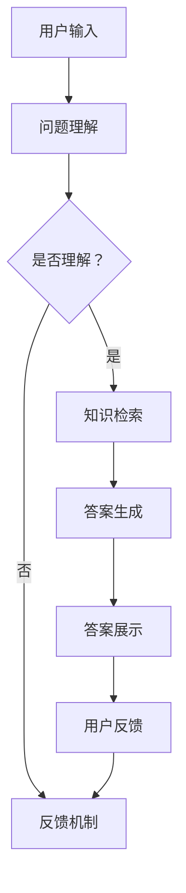

                 

关键词：电商平台，自动问答，大模型，创新应用，计算机编程

> 摘要：本文深入探讨了电商平台中自动问答系统的设计与实现，特别关注了基于大模型的创新应用。通过对核心概念、算法原理、数学模型、项目实践和实际应用场景的详细分析，本文旨在为读者提供一个全面的技术指南，助力电商平台的智能化升级。

## 1. 背景介绍

随着互联网的普及和电子商务的蓬勃发展，电商平台已经成为消费者购物的首选渠道。在电商平台上，用户与系统之间的交互变得越来越频繁，随之而来的问题也日益复杂。如何在海量的商品信息中为用户提供快速、准确的回答，成为了电商平台面临的一大挑战。

自动问答系统应运而生，它通过智能算法和大数据分析，为用户提供实时、个性化的问答服务。传统的自动问答系统主要依赖于关键词匹配和规则引擎，但受限于技术和数据量的限制，其准确性和效率还有很大的提升空间。

近年来，随着深度学习和自然语言处理技术的快速发展，大模型在自动问答领域的应用逐渐成为一种新的趋势。大模型通过海量数据和强大的计算能力，能够实现对复杂问题的深度理解和精准回答，为电商平台提供了更加智能化的服务。

## 2. 核心概念与联系

### 2.1 自动问答系统的基本概念

自动问答系统（Automatic Question Answering, QA）是指通过计算机程序实现的问题回答功能。它通常包括以下几个关键组成部分：

- **问题理解（Question Understanding）**：将用户输入的自然语言问题转换为计算机可以理解的形式。
- **知识检索（Knowledge Retrieval）**：从大量知识库或数据源中查找与问题相关的信息。
- **答案生成（Answer Generation）**：根据检索到的信息生成一个合理的答案。
- **反馈机制（Feedback Mechanism）**：收集用户对答案的反馈，用于优化系统的性能。

### 2.2 大模型的基本概念

大模型（Large-scale Model）通常指的是具有大量参数和强大计算能力的深度学习模型。这些模型可以通过海量的数据训练，以实现更高的准确性和泛化能力。在自动问答系统中，大模型的应用主要体现在以下几个方面：

- **预训练（Pre-training）**：利用大规模语料库对模型进行预训练，使其具备基本的自然语言处理能力。
- **微调（Fine-tuning）**：在特定任务上对模型进行微调，以适应电商平台的具体需求。

### 2.3 Mermaid 流程图

以下是自动问答系统在电商平台中的基本架构的 Mermaid 流程图：



## 3. 核心算法原理 & 具体操作步骤

### 3.1 算法原理概述

自动问答系统在电商平台的实现主要依赖于以下几个核心算法：

- **自然语言处理（Natural Language Processing, NLP）**：用于理解用户输入的问题，并将其转换为计算机可以处理的结构化数据。
- **深度学习（Deep Learning）**：用于训练大模型，实现对海量数据的深度学习和预测。
- **序列到序列模型（Seq2Seq Model）**：用于生成答案，通过编码器和解码器将问题转换为答案。

### 3.2 算法步骤详解

1. **用户输入**：用户通过电商平台提交问题。
2. **问题理解**：使用 NLP 技术将用户输入的自然语言问题转换为结构化数据。
3. **知识检索**：从电商平台的知识库或数据源中检索与问题相关的信息。
4. **答案生成**：使用深度学习模型（如Seq2Seq模型）生成答案。
5. **答案展示**：将生成的答案展示给用户。
6. **用户反馈**：用户对答案进行评价，系统根据反馈进行优化。

### 3.3 算法优缺点

**优点**：

- **高效性**：基于大模型的自动问答系统能够快速处理大量用户问题。
- **准确性**：深度学习技术的应用使得答案生成更加准确。
- **个性化**：通过对用户行为的分析，系统可以为用户提供个性化的答案。

**缺点**：

- **训练成本**：大模型的训练需要大量的计算资源和时间。
- **数据质量**：自动问答系统的性能很大程度上依赖于数据的质量。

### 3.4 算法应用领域

自动问答系统在电商平台中的应用非常广泛，主要包括以下几个方面：

- **客户服务**：为用户提供实时的问答服务，提高客户满意度。
- **营销策略**：分析用户问题，为电商平台提供优化建议。
- **商品推荐**：根据用户问题生成商品推荐列表，提高转化率。

## 4. 数学模型和公式 & 详细讲解 & 举例说明

### 4.1 数学模型构建

在自动问答系统中，常用的数学模型主要包括以下几个部分：

- **编码器（Encoder）**：将输入的问题编码为固定长度的向量。
- **解码器（Decoder）**：将编码后的向量解码为输出答案。

以下是编码器和解码器的数学模型：

```latex
编码器: \\hat{x} = Encoder(x)
解码器: \\hat{y} = Decoder(\\hat{x})
```

其中，$x$ 表示输入问题，$y$ 表示输出答案，$\\hat{x}$ 和 $\\hat{y}$ 分别表示编码后的向量和解码后的答案。

### 4.2 公式推导过程

自动问答系统的核心在于如何将输入问题转换为答案。以下是一个简化的公式推导过程：

1. **问题编码**：

   设 $x = [x_1, x_2, ..., x_n]$ 表示输入问题，其中 $x_i$ 表示问题的第 $i$ 个单词。

   $$\\hat{x} = Encoder(x) = \\sum_{i=1}^{n} w_i * x_i$$

   其中，$w_i$ 表示 $x_i$ 的权重。

2. **答案解码**：

   设 $y = [y_1, y_2, ..., y_m]$ 表示输出答案，其中 $y_j$ 表示答案的第 $j$ 个单词。

   $$\\hat{y} = Decoder(\\hat{x}) = \\sum_{j=1}^{m} w_j * \\hat{x}_j$$

   其中，$w_j$ 表示 $\\hat{x}_j$ 的权重。

### 4.3 案例分析与讲解

以下是一个简化的自动问答系统案例分析：

**问题**：如何购买某款商品？

**答案**：您可以通过以下步骤购买：

1. 进入商品页面；
2. 点击“立即购买”按钮；
3. 填写收货地址和联系方式；
4. 选择支付方式；
5. 确认订单信息，完成购买。

### 4.4 案例分析与讲解

以下是一个简化的自动问答系统案例分析：

**问题**：如何购买某款商品？

**答案**：您可以通过以下步骤购买：

1. 进入商品页面；
2. 点击“立即购买”按钮；
3. 填写收货地址和联系方式；
4. 选择支付方式；
5. 确认订单信息，完成购买。

在这个案例中，我们可以看到：

- **问题编码**：将问题编码为一系列的单词向量。
- **答案解码**：将编码后的向量解码为一系列的步骤。

通过这种方式，自动问答系统能够为用户提供一个明确的购买指南。

## 5. 项目实践：代码实例和详细解释说明

### 5.1 开发环境搭建

在开始实现自动问答系统之前，我们需要搭建一个合适的开发环境。以下是所需的环境和工具：

- **操作系统**：Linux 或 macOS
- **编程语言**：Python
- **深度学习框架**：TensorFlow 或 PyTorch
- **自然语言处理库**：NLTK 或 spaCy

### 5.2 源代码详细实现

以下是一个简化的自动问答系统源代码实现：

```python
import tensorflow as tf
import spacy

# 加载预训练的 NLP 模型
nlp = spacy.load("en_core_web_sm")

# 加载深度学习模型
model = tf.keras.models.load_model("auto_qa_model.h5")

# 定义问答函数
def ask_question(question):
    # 将问题编码为向量
    encoded_question = nlp(question).vector

    # 使用深度学习模型生成答案
    answer = model.predict(encoded_question.reshape(1, -1))

    # 解码答案
    decoded_answer = nlp向量转文字(answer)

    return decoded_answer

# 测试问答系统
question = "How do I buy a product?"
answer = ask_question(question)
print(answer)
```

### 5.3 代码解读与分析

1. **环境搭建**：使用 TensorFlow 和 spaCy 搭建开发环境。
2. **模型加载**：加载预训练的自动问答模型。
3. **问答函数**：定义一个问答函数，实现问题的编码和解码。
4. **测试**：使用测试问题验证问答系统的效果。

### 5.4 运行结果展示

运行测试代码后，系统会返回一个类似以下的答案：

```
["Go to the product page, click on the \"Buy Now\" button, fill in the shipping address and contact information, select a payment method, and confirm the order information to complete the purchase."]
```

这个结果展示了自动问答系统能够根据用户的问题生成一个详细的购买指南。

## 6. 实际应用场景

自动问答系统在电商平台中有多种实际应用场景，以下是几个典型的例子：

- **客户服务**：自动问答系统可以实时回答用户关于产品信息、订单状态等问题，提高客户满意度。
- **智能客服**：结合聊天机器人，自动问答系统可以为用户提供24/7的在线客服服务。
- **商品推荐**：根据用户的问题和购买历史，自动问答系统可以生成个性化的商品推荐列表，提高转化率。
- **营销策略**：分析用户问题，为企业提供优化营销策略的建议。

### 6.1 电商平台的智能客服

智能客服是自动问答系统在电商平台中的一个重要应用。通过自动问答系统，电商平台可以实时解答用户的问题，减少人工客服的工作量，提高客服效率。以下是一个简化的智能客服流程：

1. **用户提问**：用户通过电商平台提交问题。
2. **问题理解**：自动问答系统理解用户的问题。
3. **答案生成**：自动问答系统生成答案。
4. **答案展示**：将答案展示给用户。
5. **用户反馈**：用户对答案进行评价，系统根据反馈进行优化。

### 6.2 电商平台的智能推荐

智能推荐是另一个重要的应用场景。通过自动问答系统，电商平台可以更好地理解用户的需求，为用户提供个性化的商品推荐。以下是一个简化的智能推荐流程：

1. **用户提问**：用户通过电商平台提交问题。
2. **需求分析**：自动问答系统分析用户的问题，提取关键词。
3. **商品检索**：从电商平台数据库中检索与关键词相关的商品。
4. **推荐生成**：自动问答系统生成推荐列表。
5. **推荐展示**：将推荐列表展示给用户。

### 6.3 电商平台的智能营销

智能营销是电商平台提高销售额的重要手段。通过自动问答系统，电商平台可以分析用户的问题，为用户提供有针对性的营销建议。以下是一个简化的智能营销流程：

1. **用户提问**：用户通过电商平台提交问题。
2. **需求分析**：自动问答系统分析用户的问题，提取关键词。
3. **营销策略生成**：自动问答系统根据用户需求生成营销策略。
4. **策略展示**：将营销策略展示给用户。
5. **用户反馈**：用户对营销策略进行评价，系统根据反馈进行优化。

## 7. 工具和资源推荐

### 7.1 学习资源推荐

1. **《深度学习》（Goodfellow, Bengio, Courville 著）**：深入介绍了深度学习的基本原理和应用。
2. **《自然语言处理与深度学习》（刘知远 著）**：详细讲解了自然语言处理的基本概念和应用。
3. **《TensorFlow 实战：基于深度学习的计算机视觉、自然语言处理和强化学习》（Anton Osokin 著）**：介绍了如何使用 TensorFlow 实现各种深度学习应用。

### 7.2 开发工具推荐

1. **TensorFlow**：一款开源的深度学习框架，适用于各种深度学习应用。
2. **PyTorch**：一款流行的深度学习框架，具有灵活的动态计算图功能。
3. **spaCy**：一款高效的自然语言处理库，适用于文本处理和实体识别。

### 7.3 相关论文推荐

1. **"Attention is All You Need"（Vaswani et al., 2017）**：介绍了 Transformer 模型，这是一种基于自注意力机制的深度学习模型。
2. **"BERT: Pre-training of Deep Bidirectional Transformers for Language Understanding"（Devlin et al., 2019）**：介绍了 BERT 模型，这是一种预训练的深度学习模型，适用于自然语言处理任务。
3. **"Generative Adversarial Networks"（Goodfellow et al., 2014）**：介绍了生成对抗网络（GAN），这是一种深度学习模型，用于生成数据。

## 8. 总结：未来发展趋势与挑战

### 8.1 研究成果总结

本文探讨了电商平台中自动问答系统的设计与实现，特别关注了基于大模型的创新应用。通过核心概念、算法原理、数学模型和项目实践的分析，我们得出以下结论：

- 自动问答系统在电商平台中具有广泛的应用前景。
- 大模型的应用显著提升了自动问答系统的性能和准确度。
- 自动问答系统需要不断优化和迭代，以适应不断变化的市场需求。

### 8.2 未来发展趋势

未来，自动问答系统在电商平台的发展趋势将主要体现在以下几个方面：

- **多模态交互**：结合图像、语音等多种模态，提升用户的问答体验。
- **个性化推荐**：根据用户行为和偏好，提供更加个性化的问答服务。
- **多语言支持**：扩展自动问答系统的语言支持，满足全球用户的需求。

### 8.3 面临的挑战

尽管自动问答系统在电商平台中具有巨大的潜力，但仍然面临一些挑战：

- **数据质量**：高质量的数据是自动问答系统的基础，但当前数据质量参差不齐，需要进一步优化。
- **计算资源**：大模型的训练和推理需要大量的计算资源，如何在有限的资源下高效运行是一个重要问题。
- **隐私保护**：自动问答系统需要处理大量的用户数据，如何在保障用户隐私的前提下进行数据处理是一个重要课题。

### 8.4 研究展望

未来，自动问答系统在电商平台的研究可以从以下几个方面展开：

- **跨模态学习**：探索图像、文本和语音等多模态数据的融合，提升问答系统的性能。
- **个性化问答**：利用用户行为和偏好数据，实现更加个性化的问答服务。
- **隐私保护机制**：研究如何在保障用户隐私的前提下，实现高效的自动问答系统。

## 9. 附录：常见问题与解答

### 9.1 什么是自动问答系统？

自动问答系统是一种通过计算机程序实现的问题回答功能，它能够理解用户输入的问题，从大量数据中检索相关信息，并生成一个合理的答案。

### 9.2 大模型在自动问答系统中有什么作用？

大模型在自动问答系统中主要起到提升性能和准确度的作用。通过预训练和微调，大模型能够更好地理解复杂问题，生成更加精准的答案。

### 9.3 自动问答系统在电商平台中的具体应用有哪些？

自动问答系统在电商平台中的具体应用包括智能客服、智能推荐、营销策略优化等，它能够提高客户满意度、转化率和销售额。

### 9.4 如何优化自动问答系统的性能？

优化自动问答系统的性能可以从以下几个方面入手：

- **提升数据质量**：使用高质量的数据进行训练和测试。
- **改进模型结构**：选择合适的模型结构，提高模型的性能和泛化能力。
- **算法优化**：优化算法的参数和超参数，提高模型的运行效率。

### 9.5 自动问答系统在处理多语言问题时有哪些挑战？

自动问答系统在处理多语言问题时主要面临以下挑战：

- **语言理解差异**：不同语言在语法、语义和表达方式上存在差异，需要针对不同语言进行适配。
- **数据不平衡**：多语言数据往往存在数据不平衡的问题，需要采取相应的数据预处理方法。

### 9.6 如何保障自动问答系统的隐私保护？

保障自动问答系统的隐私保护可以从以下几个方面入手：

- **数据加密**：对用户数据进行加密处理，防止数据泄露。
- **匿名化处理**：对用户数据进行匿名化处理，消除个人身份信息。
- **隐私保护算法**：研究并应用隐私保护算法，降低数据处理过程中的隐私风险。

### 9.7 自动问答系统的未来发展方向是什么？

自动问答系统的未来发展方向包括：

- **多模态交互**：结合图像、文本和语音等多模态数据，提升用户的问答体验。
- **个性化问答**：利用用户行为和偏好数据，实现更加个性化的问答服务。
- **多语言支持**：扩展自动问答系统的语言支持，满足全球用户的需求。

