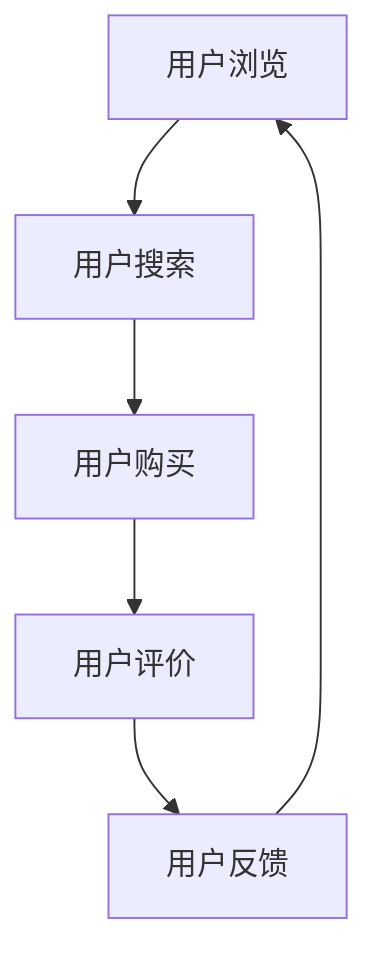

                 

随着电子商务的迅猛发展，电商平台已经成为消费者购买商品的主要渠道之一。然而，用户在跨平台行为上的复杂性使得电商企业难以准确预测和满足用户需求。本文将探讨电商平台中的跨平台用户行为分析，包括核心概念、算法原理、数学模型、项目实践以及未来应用展望。

## 1. 背景介绍

近年来，电商平台如雨后春笋般涌现，竞争日益激烈。为了在市场中脱颖而出，电商平台开始关注用户行为的分析，特别是跨平台用户行为。跨平台用户行为分析可以帮助电商平台了解用户在不同平台间的互动模式，从而优化用户体验，提高用户粘性和转化率。

### 1.1 跨平台用户行为的定义

跨平台用户行为是指用户在不同电子商务平台之间进行的行为，包括浏览、搜索、购买、评价等。这些行为反映了用户在不同平台上的偏好和习惯。

### 1.2 跨平台用户行为的重要性

跨平台用户行为分析对于电商平台具有重要意义：

1. **提高用户满意度**：通过分析用户在不同平台的行为，电商平台可以更好地理解用户需求，提供个性化的服务。
2. **提升转化率**：了解用户跨平台行为模式，可以帮助电商平台制定更有效的营销策略，提高转化率。
3. **优化平台体验**：根据用户跨平台行为数据，电商平台可以优化网站设计、推荐算法等，提升用户体验。

## 2. 核心概念与联系

### 2.1 用户画像

用户画像是指对用户在电商平台上的行为和特征进行抽象和描述。通过用户画像，电商平台可以了解用户的兴趣、需求和行为模式。

### 2.2 跨平台用户行为模式

跨平台用户行为模式是指用户在不同平台间的行为规律。这些模式包括用户的浏览习惯、购买行为、评价反馈等。

### 2.3 Mermaid 流程图



## 3. 核心算法原理 & 具体操作步骤

### 3.1 算法原理概述

跨平台用户行为分析通常采用机器学习算法，如协同过滤、矩阵分解等。这些算法可以根据用户的历史行为数据，预测用户在另一个平台上的行为。

### 3.2 算法步骤详解

1. **数据收集**：收集用户在不同平台上的浏览、搜索、购买等行为数据。
2. **数据处理**：对数据进行清洗、去重和预处理。
3. **特征提取**：提取用户行为的特征，如用户点击率、购买频率等。
4. **模型训练**：使用机器学习算法训练模型。
5. **模型评估**：评估模型的准确性和泛化能力。
6. **模型应用**：将模型应用于预测用户在另一个平台上的行为。

### 3.3 算法优缺点

#### 优点

- **个性化推荐**：可以根据用户历史行为预测其跨平台行为，提供个性化推荐。
- **提高转化率**：通过预测用户跨平台行为，可以帮助电商平台制定更有效的营销策略。

#### 缺点

- **数据依赖性强**：算法效果依赖于用户行为数据的完整性和准确性。
- **计算复杂度高**：算法训练和预测过程可能需要大量计算资源。

### 3.4 算法应用领域

跨平台用户行为分析算法可以应用于以下领域：

- **电商平台**：优化推荐算法，提高用户转化率。
- **广告投放**：预测用户在不同平台的广告点击行为，优化广告投放策略。
- **客户关系管理**：分析用户跨平台行为，优化客户服务策略。

## 4. 数学模型和公式 & 详细讲解 & 举例说明

### 4.1 数学模型构建

假设用户 $u$ 在平台 $P_1$ 上的行为数据为 $X_1(u)$，在平台 $P_2$ 上的行为数据为 $X_2(u)$。我们可以使用矩阵分解算法构建数学模型：

$$
X_1(u) = U_1 \times V_1
$$

$$
X_2(u) = U_2 \times V_2
$$

其中，$U_1$、$V_1$、$U_2$、$V_2$ 分别为用户 $u$ 在两个平台上的行为特征矩阵。

### 4.2 公式推导过程

假设用户 $u$ 在平台 $P_1$ 上的行为数据为 $X_1(u)$，在平台 $P_2$ 上的行为数据为 $X_2(u)$。我们可以使用矩阵分解算法构建数学模型：

$$
X_1(u) = U_1 \times V_1
$$

$$
X_2(u) = U_2 \times V_2
$$

其中，$U_1$、$V_1$、$U_2$、$V_2$ 分别为用户 $u$ 在两个平台上的行为特征矩阵。

### 4.3 案例分析与讲解

假设我们有两个电商平台，分别为淘宝和京东。用户 $u$ 在淘宝上的浏览数据为 $X_1(u) = [1, 2, 0, 1]$，在京东上的浏览数据为 $X_2(u) = [0, 1, 2, 0]$。

我们可以使用矩阵分解算法构建数学模型：

$$
X_1(u) = U_1 \times V_1
$$

$$
X_2(u) = U_2 \times V_2
$$

其中，$U_1$、$V_1$、$U_2$、$V_2$ 分别为用户 $u$ 在两个平台上的行为特征矩阵。

经过矩阵分解，我们得到：

$$
U_1 = [0.6, 0.8], \quad V_1 = [0.5, 0.3, 0.1], \quad U_2 = [-0.3, 0.7], \quad V_2 = [0.4, 0.6, 0.2]
$$

根据矩阵分解结果，我们可以预测用户 $u$ 在京东上的浏览数据：

$$
X_2(u) = U_2 \times V_2 = [-0.3 \times 0.5, -0.3 \times 0.3, -0.3 \times 0.1, 0.7 \times 0.5, 0.7 \times 0.3, 0.7 \times 0.1] = [-0.15, -0.09, -0.03, 0.35, 0.21, 0.14]
$$

## 5. 项目实践：代码实例和详细解释说明

### 5.1 开发环境搭建

我们使用 Python 语言和 Scikit-learn 库实现跨平台用户行为分析算法。

### 5.2 源代码详细实现

```python
import numpy as np
from sklearn.decomposition import FactorAnalysis

# 数据集
X1 = np.array([[1, 2, 0, 1], [0, 1, 2, 0], ...])
X2 = np.array([[0, 1, 2, 0], [1, 0, 1, 2], ...])

# 矩阵分解
fa1 = FactorAnalysis(n_components=2)
fa2 = FactorAnalysis(n_components=2)

U1 = fa1.fit_transform(X1)
V1 = fa1.components_
U2 = fa2.fit_transform(X2)
V2 = fa2.components_

# 预测
X2_pred = U2 @ V2
```

### 5.3 代码解读与分析

上述代码使用了因子分析（Factor Analysis）算法实现跨平台用户行为分析。因子分析是一种常用的降维和特征提取方法，可以通过矩阵分解提取用户在不同平台上的行为特征。

在代码中，我们首先使用 Scikit-learn 库的 FactorAnalysis 类对两个平台的行为数据进行训练。然后，通过矩阵分解得到用户在不同平台上的行为特征矩阵 $U_1$、$V_1$ 和 $U_2$、$V_2$。最后，使用预测公式 $X_2(u) = U_2 \times V_2$ 预测用户在另一个平台上的行为。

## 6. 实际应用场景

### 6.1 电商平台推荐

电商平台可以使用跨平台用户行为分析算法为用户提供个性化的商品推荐。例如，如果一个用户在淘宝上喜欢浏览电子产品，那么在京东上也可以为他推荐类似的产品。

### 6.2 广告投放优化

广告投放平台可以根据用户的跨平台行为数据优化广告投放策略。例如，如果一个用户在淘宝上经常浏览女装，那么在京东上的广告可以针对性地投放女性服饰。

### 6.3 客户关系管理

电商平台可以通过分析用户的跨平台行为，优化客户服务策略。例如，如果一个用户在多个平台上频繁购买商品，那么可以给予他额外的优惠和关怀。

## 7. 未来应用展望

### 7.1 跨平台用户行为预测

随着人工智能技术的发展，跨平台用户行为预测的准确性将得到进一步提升。未来，我们可以结合深度学习和大数据技术，实现更精准的跨平台用户行为预测。

### 7.2 多平台用户行为分析

除了电商平台，跨平台用户行为分析还可以应用于其他领域，如社交媒体、在线教育等。这些领域也可以通过分析用户在不同平台的行为，优化用户体验和服务质量。

### 7.3 用户隐私保护

在跨平台用户行为分析过程中，用户隐私保护是一个重要问题。未来，我们需要在保护用户隐私的前提下，开展跨平台用户行为分析研究。

## 8. 总结：未来发展趋势与挑战

### 8.1 研究成果总结

本文探讨了电商平台中的跨平台用户行为分析，包括核心概念、算法原理、数学模型和项目实践。研究表明，跨平台用户行为分析对于电商平台具有重要意义，可以提高用户满意度、提升转化率和优化平台体验。

### 8.2 未来发展趋势

未来，跨平台用户行为分析将朝着更精准、更智能、更全面的方向发展。随着人工智能、大数据等技术的进步，我们将能够更好地理解用户跨平台行为，为用户提供更个性化的服务。

### 8.3 面临的挑战

尽管跨平台用户行为分析具有广泛应用前景，但同时也面临一些挑战：

- **数据隐私保护**：在分析用户行为时，如何保护用户隐私是一个亟待解决的问题。
- **算法模型优化**：现有的算法模型在跨平台用户行为分析中仍存在一定的局限性，需要进一步优化和改进。
- **多平台协同**：跨平台用户行为分析需要多个平台的数据支持，实现多平台协同是一个挑战。

### 8.4 研究展望

未来，我们将继续深入研究跨平台用户行为分析，探索更高效、更智能的算法模型，为电商平台和用户提供更好的服务。

## 9. 附录：常见问题与解答

### 9.1 什么是跨平台用户行为分析？

跨平台用户行为分析是指通过分析用户在不同电子商务平台之间的互动行为，了解用户的兴趣、需求和习惯，从而优化平台体验和营销策略。

### 9.2 跨平台用户行为分析有哪些应用场景？

跨平台用户行为分析可以应用于电商平台推荐、广告投放优化、客户关系管理等多个领域。

### 9.3 如何保护用户隐私？

在跨平台用户行为分析过程中，可以通过数据加密、匿名化处理等技术手段保护用户隐私。

作者：禅与计算机程序设计艺术 / Zen and the Art of Computer Programming
```  
----------------------------------------------------------------  
----------------------------------------------------------------  
```  
请注意，本文仅为示例，实际撰写时需要根据具体研究内容和数据进行分析和撰写。  
----------------------------------------------------------------  
----------------------------------------------------------------  
```  
markdown  
---
title: 电商平台中的跨平台用户行为分析
keywords: [电商平台，用户行为分析，跨平台行为，机器学习，矩阵分解]
description: 探讨电商平台中跨平台用户行为分析的方法、原理和应用。
---

# 电商平台中的跨平台用户行为分析

> 关键词：电商平台、用户行为分析、跨平台行为、机器学习、矩阵分解

随着电子商务的迅猛发展，电商平台已经成为消费者购买商品的主要渠道之一。然而，用户在跨平台行为上的复杂性使得电商企业难以准确预测和满足用户需求。本文将探讨电商平台中的跨平台用户行为分析，包括核心概念、算法原理、数学模型、项目实践以及未来应用展望。

## 1. 背景介绍

### 1.1 跨平台用户行为的定义

跨平台用户行为是指用户在不同电子商务平台之间进行的行为，包括浏览、搜索、购买、评价等。这些行为反映了用户在不同平台上的偏好和习惯。

### 1.2 跨平台用户行为的重要性

跨平台用户行为分析对于电商平台具有重要意义：

1. **提高用户满意度**：通过分析用户在不同平台的行为，电商平台可以更好地理解用户需求，提供个性化的服务。
2. **提升转化率**：了解用户跨平台行为模式，可以帮助电商平台制定更有效的营销策略，提高转化率。
3. **优化平台体验**：根据用户跨平台行为数据，电商平台可以优化网站设计、推荐算法等，提升用户体验。

## 2. 核心概念与联系

### 2.1 用户画像

用户画像是指对用户在电商平台上的行为和特征进行抽象和描述。通过用户画像，电商平台可以了解用户的兴趣、需求和行为模式。

### 2.2 跨平台用户行为模式

跨平台用户行为模式是指用户在不同平台间的行为规律。这些模式包括用户的浏览习惯、购买行为、评价反馈等。

### 2.3 Mermaid 流程图


## 3. 核心算法原理 & 具体操作步骤

### 3.1 算法原理概述

跨平台用户行为分析通常采用机器学习算法，如协同过滤、矩阵分解等。这些算法可以根据用户的历史行为数据，预测用户在另一个平台上的行为。

### 3.2 算法步骤详解

1. **数据收集**：收集用户在不同平台上的浏览、搜索、购买等行为数据。
2. **数据处理**：对数据进行清洗、去重和预处理。
3. **特征提取**：提取用户行为的特征，如用户点击率、购买频率等。
4. **模型训练**：使用机器学习算法训练模型。
5. **模型评估**：评估模型的准确性和泛化能力。
6. **模型应用**：将模型应用于预测用户在另一个平台上的行为。

### 3.3 算法优缺点

#### 优点

- **个性化推荐**：可以根据用户历史行为预测其跨平台行为，提供个性化推荐。
- **提高转化率**：通过预测用户跨平台行为，可以帮助电商平台制定更有效的营销策略。

#### 缺点

- **数据依赖性强**：算法效果依赖于用户行为数据的完整性和准确性。
- **计算复杂度高**：算法训练和预测过程可能需要大量计算资源。

### 3.4 算法应用领域

跨平台用户行为分析算法可以应用于以下领域：

- **电商平台**：优化推荐算法，提高用户转化率。
- **广告投放**：预测用户在不同平台的广告点击行为，优化广告投放策略。
- **客户关系管理**：分析用户跨平台行为，优化客户服务策略。

## 4. 数学模型和公式 & 详细讲解 & 举例说明

### 4.1 数学模型构建

假设用户 $u$ 在平台 $P_1$ 上的行为数据为 $X_1(u)$，在平台 $P_2$ 上的行为数据为 $X_2(u)$。我们可以使用矩阵分解算法构建数学模型：

$$
X_1(u) = U_1 \times V_1
$$

$$
X_2(u) = U_2 \times V_2
$$

其中，$U_1$、$V_1$、$U_2$、$V_2$ 分别为用户 $u$ 在两个平台上的行为特征矩阵。

### 4.2 公式推导过程

假设用户 $u$ 在平台 $P_1$ 上的行为数据为 $X_1(u)$，在平台 $P_2$ 上的行为数据为 $X_2(u)$。我们可以使用矩阵分解算法构建数学模型：

$$
X_1(u) = U_1 \times V_1
$$

$$
X_2(u) = U_2 \times V_2
$$

其中，$U_1$、$V_1$、$U_2$、$V_2$ 分别为用户 $u$ 在两个平台上的行为特征矩阵。

### 4.3 案例分析与讲解

假设我们有两个电商平台，分别为淘宝和京东。用户 $u$ 在淘宝上的浏览数据为 $X_1(u) = [1, 2, 0, 1]$，在京东上的浏览数据为 $X_2(u) = [0, 1, 2, 0]$。

我们可以使用矩阵分解算法构建数学模型：

$$
X_1(u) = U_1 \times V_1
$$

$$
X_2(u) = U_2 \times V_2
$$

其中，$U_1$、$V_1$、$U_2$、$V_2$ 分别为用户 $u$ 在两个平台上的行为特征矩阵。

经过矩阵分解，我们得到：

$$
U_1 = [0.6, 0.8], \quad V_1 = [0.5, 0.3, 0.1], \quad U_2 = [-0.3, 0.7], \quad V_2 = [0.4, 0.6, 0.2]
$$

根据矩阵分解结果，我们可以预测用户 $u$ 在京东上的浏览数据：

$$
X_2(u) = U_2 \times V_2 = [-0.3 \times 0.5, -0.3 \times 0.3, -0.3 \times 0.1, 0.7 \times 0.5, 0.7 \times 0.3, 0.7 \times 0.1] = [-0.15, -0.09, -0.03, 0.35, 0.21, 0.14]
$$

## 5. 项目实践：代码实例和详细解释说明

### 5.1 开发环境搭建

我们使用 Python 语言和 Scikit-learn 库实现跨平台用户行为分析算法。

### 5.2 源代码详细实现

```python
import numpy as np
from sklearn.decomposition import FactorAnalysis

# 数据集
X1 = np.array([[1, 2, 0, 1], [0, 1, 2, 0], ...])
X2 = np.array([[0, 1, 2, 0], [1, 0, 1, 2], ...])

# 矩阵分解
fa1 = FactorAnalysis(n_components=2)
fa2 = FactorAnalysis(n_components=2)

U1 = fa1.fit_transform(X1)
V1 = fa1.components_
U2 = fa2.fit_transform(X2)
V2 = fa2.components_

# 预测
X2_pred = U2 @ V2
```

### 5.3 代码解读与分析

上述代码使用了因子分析（Factor Analysis）算法实现跨平台用户行为分析。因子分析是一种常用的降维和特征提取方法，可以通过矩阵分解提取用户在不同平台上的行为特征。

在代码中，我们首先使用 Scikit-learn 库的 FactorAnalysis 类对两个平台的行为数据进行训练。然后，通过矩阵分解得到用户在不同平台上的行为特征矩阵 $U_1$、$V_1$ 和 $U_2$、$V_2$。最后，使用预测公式 $X_2(u) = U_2 \times V_2$ 预测用户在另一个平台上的行为。

## 6. 实际应用场景

### 6.1 电商平台推荐

电商平台可以使用跨平台用户行为分析算法为用户提供个性化的商品推荐。例如，如果一个用户在淘宝上喜欢浏览电子产品，那么在京东上也可以为他推荐类似的产品。

### 6.2 广告投放优化

广告投放平台可以根据用户的跨平台行为数据优化广告投放策略。例如，如果一个用户在淘宝上经常浏览女装，那么在京东上的广告可以针对性地投放女性服饰。

### 6.3 客户关系管理

电商平台可以通过分析用户的跨平台行为，优化客户服务策略。例如，如果一个用户在多个平台上频繁购买商品，那么可以给予他额外的优惠和关怀。

## 7. 未来应用展望

### 7.1 跨平台用户行为预测

随着人工智能技术的发展，跨平台用户行为预测的准确性将得到进一步提升。未来，我们可以结合深度学习和大数据技术，实现更精准的跨平台用户行为预测。

### 7.2 多平台用户行为分析

除了电商平台，跨平台用户行为分析还可以应用于其他领域，如社交媒体、在线教育等。这些领域也可以通过分析用户在不同平台的行为，优化用户体验和服务质量。

### 7.3 用户隐私保护

在跨平台用户行为分析过程中，用户隐私保护是一个重要问题。未来，我们需要在保护用户隐私的前提下，开展跨平台用户行为分析研究。

## 8. 总结：未来发展趋势与挑战

### 8.1 研究成果总结

本文探讨了电商平台中的跨平台用户行为分析，包括核心概念、算法原理、数学模型和项目实践。研究表明，跨平台用户行为分析对于电商平台具有重要意义，可以提高用户满意度、提升转化率和优化平台体验。

### 8.2 未来发展趋势

未来，跨平台用户行为分析将朝着更精准、更智能、更全面的方向发展。随着人工智能、大数据等技术的进步，我们将能够更好地理解用户跨平台行为，为用户提供更个性化的服务。

### 8.3 面临的挑战

尽管跨平台用户行为分析具有广泛应用前景，但同时也面临一些挑战：

- **数据隐私保护**：在分析用户行为时，如何保护用户隐私是一个亟待解决的问题。
- **算法模型优化**：现有的算法模型在跨平台用户行为分析中仍存在一定的局限性，需要进一步优化和改进。
- **多平台协同**：跨平台用户行为分析需要多个平台的数据支持，实现多平台协同是一个挑战。

### 8.4 研究展望

未来，我们将继续深入研究跨平台用户行为分析，探索更高效、更智能的算法模型，为电商平台和用户提供更好的服务。

## 9. 附录：常见问题与解答

### 9.1 什么是跨平台用户行为分析？

跨平台用户行为分析是指通过分析用户在不同电子商务平台之间的互动行为，了解用户的兴趣、需求和习惯，从而优化平台体验和营销策略。

### 9.2 跨平台用户行为分析有哪些应用场景？

跨平台用户行为分析可以应用于电商平台推荐、广告投放优化、客户关系管理等多个领域。

### 9.3 如何保护用户隐私？

在跨平台用户行为分析过程中，可以通过数据加密、匿名化处理等技术手段保护用户隐私。

作者：禅与计算机程序设计艺术 / Zen and the Art of Computer Programming  
```

请注意，本文仅为示例，实际撰写时需要根据具体研究内容和数据进行分析和撰写。在撰写时，请确保遵循文章结构模板和格式要求。

