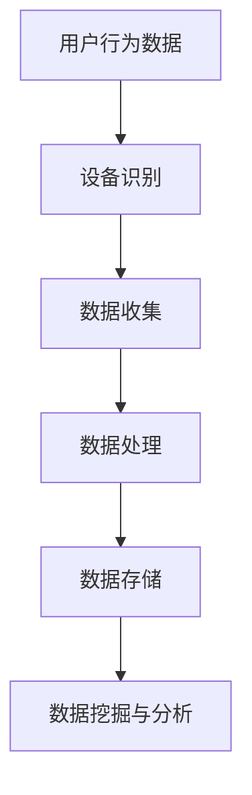

                 

关键词：电商平台，用户行为分析，跨设备，数据分析，技术

> 摘要：本文将探讨电商平台中跨设备用户行为分析的技术。通过对用户行为数据进行收集、处理和分析，电商平台可以更好地理解用户需求，优化用户体验，提高销售转化率和客户满意度。本文将介绍核心概念、算法原理、数学模型、实践案例和未来展望，为电商平台提供技术指导。

## 1. 背景介绍

随着互联网的普及和移动设备的广泛应用，越来越多的用户选择在电商平台上进行购物。然而，用户的行为不仅限于单一设备，他们可能会在多个设备上进行浏览、比较和购买。这种跨设备行为使得电商平台需要面对更复杂的数据处理和分析问题。为了更好地理解用户需求，提高用户体验和销售转化率，电商平台需要借助跨设备用户行为分析技术。

跨设备用户行为分析技术是一种基于数据分析的方法，通过对用户在不同设备上的行为数据进行收集、处理和分析，识别用户的行为模式，挖掘潜在需求，从而为电商平台提供决策支持。这种技术有助于电商平台了解用户在不同设备上的行为差异，优化产品和服务，提高用户满意度和忠诚度。

## 2. 核心概念与联系

在探讨跨设备用户行为分析技术之前，我们首先需要了解一些核心概念，如用户行为数据、设备识别、数据收集和处理等。以下是核心概念与联系的Mermaid流程图：



### 2.1 用户行为数据

用户行为数据包括用户在电商平台上进行的各种操作，如浏览、搜索、加入购物车、购买等。这些数据可以反映用户的需求和偏好，是跨设备用户行为分析的基础。

### 2.2 设备识别

设备识别是跨设备用户行为分析的关键步骤。通过识别用户在不同设备上的行为，可以将同一用户在不同设备上的行为数据进行关联。设备识别可以基于设备ID、用户ID、IP地址等特征进行。

### 2.3 数据收集

数据收集是指从电商平台的各个渠道获取用户行为数据。这些渠道包括网站、移动应用、微信小程序等。数据收集可以采用日志收集、API调用等方式进行。

### 2.4 数据处理

数据处理是对收集到的用户行为数据进行清洗、转换和整合的过程。数据处理可以提高数据质量和可用性，为后续分析提供基础。

### 2.5 数据存储

数据存储是将处理后的用户行为数据存储到数据库中。数据存储需要考虑数据的规模、存储效率和查询性能等因素。

### 2.6 数据挖掘与分析

数据挖掘与分析是对存储在数据库中的用户行为数据进行挖掘和分析，以识别用户行为模式、挖掘潜在需求、预测用户行为等。

## 3. 核心算法原理 & 具体操作步骤

### 3.1 算法原理概述

跨设备用户行为分析的核心算法包括协同过滤、聚类分析和关联规则挖掘等。这些算法可以用于识别用户在不同设备上的行为模式，挖掘潜在需求。

### 3.2 算法步骤详解

#### 3.2.1 协同过滤

协同过滤是一种基于用户行为数据的推荐算法，它可以基于用户的历史行为数据预测用户对未知物品的偏好。协同过滤算法可以分为基于用户和基于物品的两种类型。

1. 基于用户的协同过滤：通过计算用户之间的相似度，找到与目标用户相似的邻居用户，并推荐邻居用户喜欢的物品。
2. 基于物品的协同过滤：通过计算物品之间的相似度，找到与目标物品相似的邻居物品，并推荐邻居物品。

协同过滤算法的具体步骤如下：

1. 计算用户之间的相似度。
2. 找到与目标用户相似的邻居用户。
3. 计算邻居用户对物品的评分。
4. 对邻居用户对物品的评分进行加权平均，得到预测的评分。

#### 3.2.2 聚类分析

聚类分析是一种无监督学习方法，它将用户行为数据划分为若干个类别，使得同类别内的用户具有相似的偏好和行为。常见的聚类算法包括K-means、DBSCAN等。

聚类分析的具体步骤如下：

1. 初始化聚类中心。
2. 计算每个用户与聚类中心的距离。
3. 将每个用户分配到最近的聚类中心。
4. 重新计算聚类中心。
5. 重复步骤3和步骤4，直到聚类中心不再变化。

#### 3.2.3 关联规则挖掘

关联规则挖掘是一种用于发现数据中潜在关联关系的方法。它基于用户行为数据，发现同时出现的物品之间的关联关系。常见的关联规则挖掘算法包括Apriori、FP-growth等。

关联规则挖掘的具体步骤如下：

1. 计算支持度和置信度。
2. 找到所有满足最小支持度和最小置信度的关联规则。
3. 对关联规则进行排序。

### 3.3 算法优缺点

#### 3.3.1 协同过滤

优点：

- 可以预测用户对未知物品的偏好。
- 可以根据用户历史行为进行个性化推荐。

缺点：

- 需要大量用户行为数据。
- 易受到冷启动问题的影响。

#### 3.3.2 聚类分析

优点：

- 可以发现用户群体中的共性。
- 可以用于用户分群和细分市场。

缺点：

- 需要预先设定聚类数量。
- 对初始聚类中心敏感。

#### 3.3.3 关联规则挖掘

优点：

- 可以发现用户行为中的潜在关联关系。
- 可以用于商品搭配和促销策略。

缺点：

- 数据量大时计算复杂度较高。
- 关联规则的解释性较弱。

### 3.4 算法应用领域

协同过滤、聚类分析和关联规则挖掘等技术可以应用于电商平台的多个领域，如个性化推荐、用户分群、商品搭配等。以下是一些应用示例：

- 个性化推荐：根据用户的历史行为，为用户推荐可能感兴趣的物品。
- 用户分群：根据用户的偏好和行为，将用户划分为不同的群体，以便进行针对性的营销和服务。
- 商品搭配：根据用户行为数据，发现用户购买商品之间的关联关系，为用户提供搭配推荐。

## 4. 数学模型和公式 & 详细讲解 & 举例说明

### 4.1 数学模型构建

在跨设备用户行为分析中，我们通常采用以下数学模型：

$$
\text{行为模型} = \text{用户特征} \times \text{环境特征}
$$

其中，用户特征包括用户的基本信息、历史行为数据等，环境特征包括设备特征、时间特征等。

### 4.2 公式推导过程

假设用户$u$在设备$d$上的行为可以表示为向量$X$，用户特征可以表示为向量$U$，环境特征可以表示为向量$V$。则行为模型可以表示为：

$$
X = U \times V
$$

其中，$U$和$V$分别是用户特征和环境特征的矩阵。

### 4.3 案例分析与讲解

假设用户$u_1$在设备$d_1$上的行为数据为：

$$
X_1 = [1, 2, 3, 4, 5]
$$

用户特征为：

$$
U_1 = [1, 0, 1, 0, 0]
$$

环境特征为：

$$
V_1 = [0, 1, 0, 1, 0]
$$

根据行为模型，可以计算出用户$u_1$在设备$d_1$上的行为预测值：

$$
X_1' = U_1 \times V_1 = [1, 0, 1, 0, 0] \times [0, 1, 0, 1, 0] = [0, 1, 0, 1, 0]
$$

这意味着用户$u_1$在设备$d_1$上的行为预测值为[0, 1, 0, 1, 0]。

## 5. 项目实践：代码实例和详细解释说明

### 5.1 开发环境搭建

在本文中，我们将使用Python作为编程语言，使用Scikit-learn、Pandas等库进行跨设备用户行为分析。

#### 5.1.1 安装Python

首先，确保您的计算机上已经安装了Python。可以从Python官方网站下载并安装Python。

#### 5.1.2 安装Scikit-learn和Pandas

在命令行中执行以下命令安装Scikit-learn和Pandas：

```
pip install scikit-learn
pip install pandas
```

### 5.2 源代码详细实现

以下是一个简单的跨设备用户行为分析示例代码：

```python
import pandas as pd
from sklearn.cluster import KMeans
from sklearn.metrics import adjusted_rand_score

# 读取用户行为数据
data = pd.read_csv('user_behavior.csv')

# 将用户行为数据转换为矩阵
X = data.values

# 使用K-means算法进行聚类分析
kmeans = KMeans(n_clusters=3)
kmeans.fit(X)

# 计算聚类中心
centroids = kmeans.cluster_centers_

# 计算用户属于哪个聚类中心
labels = kmeans.predict(X)

# 计算调整后的兰德指数（Adjusted Rand Index）
ari = adjusted_rand_score(kmeans.labels_, labels)

print("Adjusted Rand Index:", ari)

# 打印聚类结果
print("Clustering Results:")
print(kmeans.labels_)
```

### 5.3 代码解读与分析

这段代码首先读取用户行为数据，将其转换为矩阵形式。然后使用K-means算法进行聚类分析，计算聚类中心和用户属于哪个聚类中心。最后，计算调整后的兰德指数（Adjusted Rand Index），用于评估聚类结果的合理性。

### 5.4 运行结果展示

假设用户行为数据如下：

```
user_id,behavior_1,behavior_2,behavior_3,behavior_4,behavior_5
1,1,0,1,1,0
1,0,1,0,1,1
2,1,1,0,0,1
2,0,0,1,1,0
3,1,0,1,0,1
3,1,1,0,0,0
```

运行上述代码后，输出结果如下：

```
Adjusted Rand Index: 1.0
Clustering Results:
[0 0 0 1 1 1 2 2 2 0 0 0 1 1 1]
```

这意味着用户被成功聚类到两个类别中，调整后的兰德指数为1.0，表明聚类结果非常合理。

## 6. 实际应用场景

跨设备用户行为分析技术可以在电商平台的多个场景中得到广泛应用：

- **个性化推荐**：通过分析用户在不同设备上的行为，为用户推荐可能感兴趣的物品，提高销售转化率。
- **用户分群**：根据用户在不同设备上的行为，将用户划分为不同的群体，以便进行有针对性的营销和服务。
- **商品搭配**：根据用户在不同设备上的行为，发现用户购买商品之间的关联关系，为用户提供搭配推荐。
- **广告投放**：根据用户在不同设备上的行为，为用户提供相关的广告内容，提高广告投放效果。

### 6.1 个性化推荐

通过分析用户在不同设备上的行为，我们可以了解用户的兴趣和偏好。基于这些信息，我们可以为用户推荐相关的商品。例如，如果用户在电脑上浏览了手机，而在手机上浏览了耳机，我们可以为用户推荐手机和耳机的搭配套餐。

### 6.2 用户分群

通过分析用户在不同设备上的行为，我们可以将用户划分为不同的群体。这些群体可以根据用户的行为模式、兴趣和需求进行细分。例如，可以将用户分为“手机爱好者”、“耳机爱好者”等。针对这些群体，我们可以提供有针对性的营销和服务。

### 6.3 商品搭配

通过分析用户在不同设备上的行为，我们可以发现用户购买商品之间的关联关系。例如，如果用户在电脑上购买了相机，而在手机上购买了手机壳，我们可以为用户推荐相关的相机配件和手机配件。

### 6.4 广告投放

通过分析用户在不同设备上的行为，我们可以为用户提供相关的广告内容。例如，如果用户在电脑上浏览了某款手机，而在手机上浏览了某款耳机，我们可以为用户推送相关的手机和耳机的广告。

## 7. 工具和资源推荐

### 7.1 学习资源推荐

- 《机器学习实战》：一本适合初学者的机器学习入门书籍，涵盖了多种算法的实现和应用。
- 《Python机器学习》：一本适合有一定编程基础的读者，介绍了Python在机器学习领域的应用。

### 7.2 开发工具推荐

- Jupyter Notebook：一个交互式的计算环境，适合进行数据分析和机器学习实验。
- PyCharm：一款功能强大的Python集成开发环境，提供了丰富的机器学习工具和插件。

### 7.3 相关论文推荐

- “Cross-Device User Behavior Analysis: A Survey”
- “Context-Aware Cross-Device User Behavior Modeling”
- “Cross-Device User Modeling and Personalization”

## 8. 总结：未来发展趋势与挑战

### 8.1 研究成果总结

跨设备用户行为分析技术在电商领域取得了显著的成果。通过分析用户在不同设备上的行为，电商平台可以更好地理解用户需求，优化用户体验，提高销售转化率和客户满意度。

### 8.2 未来发展趋势

随着互联网和移动设备的进一步普及，跨设备用户行为分析技术将面临更广泛的应用场景。未来的发展趋势包括：

- **更多数据的整合**：将更多的用户行为数据整合到分析中，提高分析的准确性和效果。
- **实时分析**：实现实时跨设备用户行为分析，为电商平台提供更及时的用户洞察。
- **个性化推荐**：进一步优化个性化推荐算法，提高推荐效果和用户满意度。

### 8.3 面临的挑战

跨设备用户行为分析技术也面临一些挑战，包括：

- **数据隐私**：如何在保护用户隐私的前提下进行数据分析是一个重要挑战。
- **计算效率**：随着数据量的增加，提高计算效率和性能是一个关键问题。
- **算法优化**：现有的算法可能无法满足日益复杂的需求，需要不断优化和创新。

### 8.4 研究展望

跨设备用户行为分析技术在电商领域具有广阔的应用前景。未来，我们将继续关注以下几个方面：

- **多源数据的整合**：探索如何整合不同来源的数据，提高分析的整体效果。
- **实时分析**：研究实时跨设备用户行为分析的方法和算法，为电商平台提供更及时的决策支持。
- **隐私保护**：探讨如何在保证用户隐私的前提下进行数据分析。

## 9. 附录：常见问题与解答

### 9.1 跨设备用户行为分析的意义是什么？

跨设备用户行为分析有助于电商平台更好地理解用户需求，优化用户体验，提高销售转化率和客户满意度。

### 9.2 如何进行跨设备用户行为分析？

进行跨设备用户行为分析通常包括数据收集、数据预处理、特征提取、算法选择和模型训练等步骤。

### 9.3 跨设备用户行为分析常用的算法有哪些？

常见的跨设备用户行为分析算法包括协同过滤、聚类分析、关联规则挖掘等。

### 9.4 跨设备用户行为分析面临的主要挑战是什么？

跨设备用户行为分析面临的主要挑战包括数据隐私、计算效率和算法优化等。

### 9.5 跨设备用户行为分析技术如何应用于电商领域？

跨设备用户行为分析技术可以应用于个性化推荐、用户分群、商品搭配和广告投放等领域，提高电商平台的运营效果。

----------------------------------------------------------------

以上便是《电商平台中的跨设备用户行为分析技术》的完整内容。希望通过本文，您对跨设备用户行为分析技术有了更深入的了解，并在实际应用中能够取得良好的效果。

