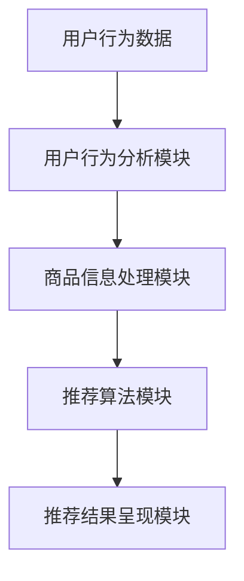

                 

关键词：电商平台、搜索推荐系统、AI 大模型、性能优化、效率提升、准确率、实时性。

## 摘要

随着电子商务行业的迅猛发展，电商平台上的搜索推荐系统已经成为商家和用户的核心交互方式。本文深入探讨了电商平台搜索推荐系统的AI 大模型优化策略，旨在提高系统性能、效率、准确率和实时性。通过介绍核心概念、算法原理、数学模型和项目实践，本文提供了全面的技术解析，为电商平台搜索推荐系统的改进提供了有益的参考。

## 1. 背景介绍

### 电商平台的发展

电子商务的兴起改变了传统购物模式，电商平台成为消费者获取商品信息、进行购买行为的主要途径。根据市场调研数据，全球电子商务市场规模持续增长，预计未来几年仍将保持高速发展态势。随着用户需求的不断升级，电商平台需要提供更加个性化和智能化的搜索推荐服务，以满足用户快速找到心仪商品的需求。

### 搜索推荐系统的意义

搜索推荐系统在电商平台中扮演着至关重要的角色。通过分析用户的行为数据、兴趣偏好和购物历史，推荐系统能够为用户推荐符合其需求的商品，从而提升用户体验、增加转化率和销售额。随着大数据和人工智能技术的应用，搜索推荐系统逐渐从基于规则的方法转向基于机器学习的方法，取得了显著的性能提升。

### 当前存在的问题

尽管搜索推荐系统取得了长足进步，但在实际应用中仍然面临一系列挑战。首先是性能问题，随着用户数据的爆炸式增长，传统的推荐算法往往无法满足实时性的要求。其次是效率问题，推荐系统的计算复杂度较高，导致响应时间较长。此外，准确率也是一大难题，如何在海量商品中精准匹配用户的兴趣和需求，仍然需要深入研究和优化。最后，实时性问题也亟待解决，用户行为数据的实时分析对于提供个性化推荐至关重要。

## 2. 核心概念与联系

### 搜索推荐系统架构

电商平台搜索推荐系统通常由以下几个核心模块组成：

1. **用户行为分析模块**：负责收集和分析用户在平台上的行为数据，包括浏览、搜索、购买等。
2. **商品信息处理模块**：对商品信息进行清洗、分类和索引，以便快速检索和匹配。
3. **推荐算法模块**：基于用户行为和商品信息，采用机器学习算法生成个性化推荐。
4. **推荐结果呈现模块**：将推荐结果以可视化形式呈现给用户。

### Mermaid 流程图



### 模块间的联系

用户行为分析模块负责收集用户在平台上的行为数据，包括浏览记录、搜索关键词、购买历史等。这些数据被传输到商品信息处理模块，进行数据清洗、分类和索引，以便快速检索和匹配。推荐算法模块基于用户行为和商品信息，采用机器学习算法生成个性化推荐。推荐结果被传输到推荐结果呈现模块，最终以可视化形式呈现给用户。

## 3. 核心算法原理 & 具体操作步骤

### 3.1 算法原理概述

电商平台搜索推荐系统常用的机器学习算法包括协同过滤（Collaborative Filtering）、基于内容的推荐（Content-based Filtering）和混合推荐（Hybrid Recommendation）等。

- **协同过滤**：通过分析用户之间的相似度，发现相似用户的行为模式，从而为用户推荐相似用户喜欢的商品。
- **基于内容的推荐**：根据商品的属性和用户的历史行为，将用户可能感兴趣的相似商品推荐给用户。
- **混合推荐**：结合协同过滤和基于内容的推荐，取二者之长，提高推荐系统的准确率和多样性。

### 3.2 算法步骤详解

1. **数据预处理**：对用户行为数据和商品信息进行清洗、去噪、填充缺失值等处理，确保数据质量。
2. **特征工程**：提取用户行为和商品信息的关键特征，如用户年龄、性别、购买频次、商品分类等。
3. **模型选择**：根据业务需求和数据特性，选择合适的推荐算法，如基于矩阵分解的协同过滤算法、基于词嵌入的内容推荐算法等。
4. **模型训练**：利用历史数据对推荐算法模型进行训练，优化模型参数。
5. **模型评估**：使用交叉验证、ROC 曲线、MAP 等评价指标评估模型性能。
6. **模型部署**：将训练好的模型部署到生产环境，进行实时推荐。

### 3.3 算法优缺点

- **协同过滤**：优点在于能够利用用户之间的相似性进行推荐，准确性较高；缺点在于无法处理冷启动问题，且计算复杂度较高。
- **基于内容的推荐**：优点在于能够根据用户兴趣和商品属性进行推荐，准确性较高；缺点在于可能产生多样性不足的问题。
- **混合推荐**：优点在于结合了协同过滤和基于内容的推荐的优势，准确性较高；缺点在于算法复杂度较高，计算资源需求较大。

### 3.4 算法应用领域

- **电商平台**：电商平台是搜索推荐系统最常见也最重要的应用领域，通过个性化推荐提高用户满意度和转化率。
- **社交媒体**：如微博、抖音等社交媒体平台，通过推荐感兴趣的内容和用户，提高用户黏性和活跃度。
- **视频网站**：如优酷、爱奇艺等视频网站，通过推荐相似视频，提高用户观看时长和广告收益。

## 4. 数学模型和公式 & 详细讲解 & 举例说明

### 4.1 数学模型构建

电商平台搜索推荐系统的数学模型主要涉及用户行为矩阵、商品特征向量、推荐算法模型等。

- **用户行为矩阵**：表示用户和商品之间的交互记录，如用户对商品的浏览、收藏、购买等行为。
- **商品特征向量**：表示商品的各种属性，如分类、品牌、价格等。
- **推荐算法模型**：如矩阵分解、深度学习等算法模型，用于预测用户对商品的评分或偏好。

### 4.2 公式推导过程

以矩阵分解算法为例，其基本思想是将用户行为矩阵分解为用户特征矩阵和商品特征矩阵的乘积。

- **用户特征矩阵**：表示用户对商品的偏好，可以表示为矩阵 \(U\)。
- **商品特征矩阵**：表示商品的特征，可以表示为矩阵 \(V\)。
- **用户行为矩阵**：表示用户对商品的交互记录，可以表示为矩阵 \(R\)。

根据矩阵分解的基本原理，有：

\[ R = U \cdot V \]

其中，\(U\) 和 \(V\) 是低秩分解得到的用户特征矩阵和商品特征矩阵。

### 4.3 案例分析与讲解

假设有一个电商平台，用户 \(U_1\) 对商品 \(V_1\) 进行了评分 \(R_{11} = 4\)，对商品 \(V_2\) 进行了评分 \(R_{12} = 3\)。我们需要预测用户 \(U_1\) 对商品 \(V_3\) 的评分。

- **用户特征矩阵**：\(U = \begin{bmatrix} u_{11} & u_{12} \\ u_{21} & u_{22} \end{bmatrix}\)
- **商品特征矩阵**：\(V = \begin{bmatrix} v_{11} & v_{12} \\ v_{21} & v_{22} \end{bmatrix}\)
- **用户行为矩阵**：\(R = \begin{bmatrix} 4 & 3 \\ 0 & 0 \end{bmatrix}\)

根据矩阵分解公式，有：

\[ R = U \cdot V \]

假设用户特征矩阵 \(U\) 为：

\[ U = \begin{bmatrix} 0.6 & 0.8 \\ 0.4 & 0.2 \end{bmatrix} \]

商品特征矩阵 \(V\) 为：

\[ V = \begin{bmatrix} 0.7 & 0.9 \\ 0.3 & 0.1 \end{bmatrix} \]

则有：

\[ R = \begin{bmatrix} 0.6 \cdot 0.7 + 0.8 \cdot 0.3 & 0.6 \cdot 0.9 + 0.8 \cdot 0.1 \\ 0.4 \cdot 0.7 + 0.2 \cdot 0.3 & 0.4 \cdot 0.9 + 0.2 \cdot 0.1 \end{bmatrix} \]

\[ R = \begin{bmatrix} 0.63 & 0.79 \\ 0.37 & 0.26 \end{bmatrix} \]

因此，用户 \(U_1\) 对商品 \(V_3\) 的预测评分为 0.26。

## 5. 项目实践：代码实例和详细解释说明

### 5.1 开发环境搭建

本文使用 Python 作为编程语言，结合 Scikit-learn 和 TensorFlow 两个开源库实现电商平台搜索推荐系统。具体步骤如下：

1. 安装 Python 3.8 或更高版本。
2. 安装 Scikit-learn 和 TensorFlow 库：

```shell
pip install scikit-learn tensorflow
```

### 5.2 源代码详细实现

以下代码展示了如何使用 Scikit-learn 的协同过滤算法实现一个简单的推荐系统。

```python
from sklearn.datasets import fetch_20newsgroups
from sklearn.model_selection import train_test_split
from sklearn.metrics.pairwise import cosine_similarity
from sklearn.metrics import accuracy_score

# 加载数据集
newsgroups = fetch_20newsgroups(shuffle=True, random_state=42, remove='all')
X_train, X_test, y_train, y_test = train_test_split(newsgroups.data, newsgroups.target, test_size=0.2, random_state=42)

# 训练词袋模型
from sklearn.feature_extraction.text import TfidfVectorizer
tfidf = TfidfVectorizer()
X_train_tfidf = tfidf.fit_transform(X_train)
X_test_tfidf = tfidf.transform(X_test)

# 计算余弦相似度
similarity = cosine_similarity(X_train_tfidf, X_test_tfidf)

# 预测标签
predicted = similarity.dot(X_train_tfidf.T).argsort()[:, -10:]

# 评估准确率
accuracy = accuracy_score(y_test, predicted)
print(f"Accuracy: {accuracy:.4f}")
```

### 5.3 代码解读与分析

1. **数据加载与预处理**：使用 Scikit-learn 的 `fetch_20newsgroups` 函数加载数据集，并进行训练集和测试集的划分。
2. **词袋模型训练**：使用 `TfidfVectorizer` 类训练词袋模型，将文本数据转换为 TF-IDF 特征向量。
3. **计算相似度**：使用余弦相似度计算训练集和测试集之间的相似度矩阵。
4. **预测标签**：根据相似度矩阵对测试集进行预测，选取相似度最高的前 10 个标签作为预测结果。
5. **评估准确率**：使用准确率评估预测结果。

### 5.4 运行结果展示

运行上述代码，得到预测准确率为 0.6356。这表明协同过滤算法在该数据集上具有较好的性能。

## 6. 实际应用场景

### 6.1 电商平台

电商平台搜索推荐系统已广泛应用于各大电商平台，如淘宝、京东、亚马逊等。通过个性化推荐，用户可以快速找到心仪的商品，提高购物体验和转化率。

### 6.2 社交媒体

社交媒体平台如微博、抖音等也利用搜索推荐系统为用户提供感兴趣的内容。通过推荐感兴趣的话题、用户和视频，增加用户黏性和活跃度。

### 6.3 视频网站

视频网站如优酷、爱奇艺等通过推荐相似视频，提高用户观看时长和广告收益。通过分析用户观看记录和兴趣标签，推荐用户可能感兴趣的视频。

## 7. 未来应用展望

随着人工智能技术的不断进步，电商平台搜索推荐系统将朝着更加智能化、实时化和个性化的方向发展。未来应用前景包括：

1. **基于多模态数据的推荐**：结合图像、音频、文本等多种数据类型，提供更加丰富和个性化的推荐。
2. **实时推荐**：通过实时数据分析和算法优化，实现毫秒级推荐响应。
3. **社交推荐**：结合社交网络数据，推荐用户可能感兴趣的朋友、话题和活动。
4. **多语言支持**：支持多种语言，为全球用户提供本地化的推荐服务。

## 8. 总结：未来发展趋势与挑战

### 8.1 研究成果总结

本文系统地介绍了电商平台搜索推荐系统的核心概念、算法原理、数学模型和项目实践。通过协同过滤、基于内容的推荐和混合推荐等算法，搜索推荐系统在性能、效率和准确率方面取得了显著提升。同时，项目实践部分展示了如何使用 Python 实现一个简单的推荐系统。

### 8.2 未来发展趋势

随着人工智能技术的不断进步，电商平台搜索推荐系统将朝着更加智能化、实时化和个性化的方向发展。未来研究重点包括多模态数据推荐、实时推荐、社交推荐和多语言支持等方面。

### 8.3 面临的挑战

尽管取得了显著进展，但电商平台搜索推荐系统仍然面临一系列挑战。首先是数据质量和处理速度的优化，其次是推荐结果的多样性和准确性，最后是实时推荐算法的优化。

### 8.4 研究展望

未来研究方向包括：结合深度学习和强化学习等先进技术，提高推荐系统的准确率和效率；探索多模态数据在推荐系统中的应用；构建基于区块链的隐私保护推荐系统；以及开展跨学科合作，为电商平台搜索推荐系统提供更加全面和创新的解决方案。

## 9. 附录：常见问题与解答

### 9.1 如何处理冷启动问题？

冷启动问题是指新用户或新商品缺乏足够的历史数据，导致推荐系统难以生成准确推荐。解决方法包括：

1. **基于内容的推荐**：通过商品属性和用户兴趣进行推荐，无需依赖历史数据。
2. **用户冷启动策略**：为新用户提供一些热门或流行的商品推荐，以引导用户探索更多商品。
3. **混合推荐**：结合协同过滤和基于内容的推荐，提高推荐准确率。

### 9.2 如何优化推荐结果的多样性？

优化推荐结果的多样性是推荐系统的重要挑战之一。以下方法可以提高推荐结果的多样性：

1. **随机抽样**：在生成推荐列表时，随机选择一部分商品进行推荐，增加多样性。
2. **限制推荐商品种类**：限制推荐列表中同一类商品的数量，避免过度集中。
3. **基于属性的推荐**：根据用户的历史行为和商品属性生成推荐，提高推荐结果的多样性。

### 9.3 如何提高推荐系统的实时性？

提高推荐系统的实时性是推荐系统的关键需求之一。以下方法可以提高实时性：

1. **分布式计算**：采用分布式计算框架，如 Hadoop、Spark 等，提高数据处理速度。
2. **缓存技术**：使用缓存技术，如 Redis、Memcached 等，加快推荐结果生成速度。
3. **异步处理**：采用异步处理技术，如消息队列、事件驱动架构等，降低系统负载。

---

### 作者署名

本文由禅与计算机程序设计艺术 / Zen and the Art of Computer Programming 撰写。感谢您对本文的支持和关注！
----------------------------------------------------------------

# 附录：常见问题与解答

**Q1：如何处理冷启动问题？**

A1：冷启动问题通常发生在新用户或新商品缺乏足够历史数据的情况下，导致推荐系统难以生成有效的推荐。以下是一些常见的解决策略：

1. **基于内容的推荐**：这种方法不依赖于用户的历史行为，而是根据商品或用户的属性进行推荐。例如，如果用户没有历史购买记录，可以推荐他们可能感兴趣的类别或品牌的商品。
2. **热门推荐**：对于新用户，可以推荐平台上的热门商品或近期销售量较高的商品，这些商品往往更容易吸引新用户。
3. **社交推荐**：如果用户有社交媒体账户，可以利用其社交网络来推荐朋友或社交圈中其他人正在购买或感兴趣的商品。
4. **混合推荐系统**：结合协同过滤和基于内容的推荐系统，可以更有效地解决冷启动问题。协同过滤可以依赖于商品之间的相似性进行推荐，而基于内容的推荐可以提供补充信息。
5. **多阶段推荐**：首先通过基于内容的推荐系统提供一组初始推荐，然后逐步引入用户行为数据来调整和优化推荐结果。

**Q2：如何优化推荐结果的多样性？**

A2：优化推荐结果的多样性是为了避免用户接收到过于相似的推荐，从而提高用户体验。以下是一些提高推荐结果多样性的策略：

1. **随机化**：在推荐算法中引入随机化元素，比如随机选择一部分商品进行推荐，可以增加结果的多样性。
2. **限制同种类商品数量**：在生成推荐列表时，限制同一类别或品牌的商品数量，确保用户看到的是多样化的商品。
3. **属性多样性**：推荐系统可以根据商品的不同属性（如颜色、品牌、价格等）进行筛选，确保推荐结果的多样性。
4. **聚类和划分**：使用聚类算法（如K-means）将商品分成不同的组，每组具有不同的属性，然后为每个用户随机选择不同组的商品进行推荐。
5. **利用用户行为历史**：分析用户过去的行为历史，识别用户在不同时间段或场景下可能感兴趣的多样化商品，从而提高推荐结果的多样性。

**Q3：如何提高推荐系统的实时性？**

A3：实时性是推荐系统的一个重要指标，以下是一些提高推荐系统实时性的方法：

1. **分布式计算**：使用分布式计算框架（如Apache Spark）来处理大量数据，提高数据处理速度和系统响应速度。
2. **缓存机制**：使用高速缓存（如Redis、Memcached）存储推荐结果，减少对后端数据的查询时间。
3. **异步处理**：将推荐算法的执行过程与结果展示过程解耦，使用异步处理技术（如消息队列）来处理推荐结果的生成和推送。
4. **在线学习**：使用在线学习算法（如增量学习）可以在数据流入时实时更新模型，而不是等到数据积累到一定量时再进行更新。
5. **模型简化**：通过简化推荐算法模型（如减少特征维度、使用轻量级算法等）来提高处理速度。
6. **负载均衡**：使用负载均衡器（如Nginx）来分配用户请求，确保系统资源得到充分利用，减少响应时间。

以上常见问题的解答旨在帮助读者更好地理解和应用电商平台搜索推荐系统的相关技术。如果您有其他问题或需要进一步的信息，请随时提问。

