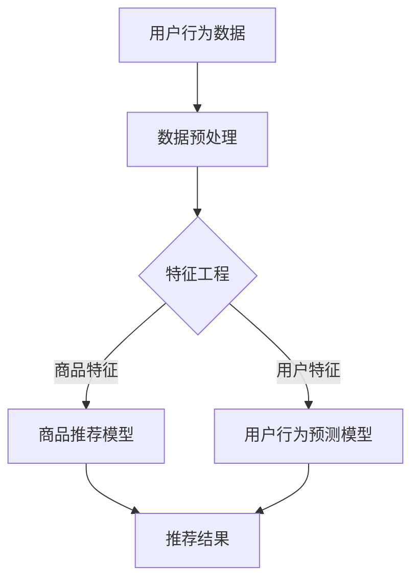

                 

关键词：电商平台、搜索推荐系统、AI 大模型、转化率、用户体验

> 摘要：本文将探讨如何通过引入 AI 大模型来优化电商平台搜索推荐系统，从而提高转化率和提升用户体验。我们将详细分析相关核心概念、算法原理、数学模型以及实际项目实践，并展望未来的发展趋势与挑战。

## 1. 背景介绍

电商平台作为数字经济的重要组成部分，其核心在于如何有效地推荐商品给用户，以提升用户满意度和购买转化率。传统的搜索推荐系统主要依赖于用户历史行为数据和商品特征信息，通过简单的统计方法和规则进行推荐。然而，这种方式存在一定的局限性，无法充分挖掘用户潜在的个性化需求和复杂的行为模式。

随着 AI 人工智能技术的快速发展，尤其是深度学习等技术的突破，AI 大模型在搜索推荐系统中的应用逐渐成为可能。AI 大模型能够通过大规模数据训练，捕捉到用户行为的深层次规律，从而实现更精准的个性化推荐。这不仅有助于提高电商平台的转化率，还能显著提升用户的购物体验。

本文将围绕 AI 大模型在电商平台搜索推荐系统中的应用，详细探讨其核心概念、算法原理、数学模型以及实际项目实践，并分析未来发展趋势与挑战。

## 2. 核心概念与联系

### 2.1 AI 大模型

AI 大模型，即基于大规模数据的深度学习模型，如深度神经网络（DNN）、卷积神经网络（CNN）和循环神经网络（RNN）等。这些模型通过多层神经网络结构，可以自动学习输入数据的复杂特征和关联性，从而实现高级的预测和分类任务。

### 2.2 搜索推荐系统

搜索推荐系统是一种基于用户行为数据和商品特征信息的推荐系统，其核心目标是通过分析用户的历史行为和当前行为，为用户推荐可能感兴趣的商品。在电商平台中，搜索推荐系统直接影响用户的购买决策，从而影响平台的转化率和盈利能力。

### 2.3 用户体验

用户体验（User Experience，简称 UX）是指用户在使用产品或服务过程中所感受到的愉悦程度和满意度。在电商平台中，良好的用户体验包括易于使用的界面、快速的响应速度和个性化的商品推荐等，这些都是提升用户满意度和忠诚度的关键因素。

### 2.4 Mermaid 流程图

为了更好地理解 AI 大模型在搜索推荐系统中的应用，我们可以通过 Mermaid 流程图来描述其核心架构和流程。



在上面的流程图中，用户行为数据和商品特征数据经过预处理和特征工程处理后，分别输入到商品推荐模型和用户行为预测模型中。这两个模型通过训练和优化，能够生成个性化的推荐结果，从而提升用户体验和转化率。

## 3. 核心算法原理 & 具体操作步骤

### 3.1 算法原理概述

AI 大模型在搜索推荐系统中的应用主要包括两个核心部分：商品推荐模型和用户行为预测模型。

商品推荐模型主要用于基于用户历史行为和商品特征为用户推荐感兴趣的商品。其核心原理是通过深度神经网络结构，自动学习用户行为数据和商品特征的复杂关联性，从而实现精准的推荐。

用户行为预测模型则用于预测用户在未来的行为模式，从而为商品推荐提供更准确的依据。其核心原理是通过循环神经网络等序列模型，捕捉用户行为的时序特征和长期依赖关系。

### 3.2 算法步骤详解

#### 3.2.1 数据预处理

数据预处理是构建 AI 大模型的基础，主要包括以下步骤：

1. 数据清洗：去除缺失值、重复值和异常值，确保数据质量。
2. 数据归一化：对数值型特征进行归一化处理，使其具有相似的尺度，避免模型在训练过程中因特征尺度差异而导致梯度消失或爆炸。
3. 特征提取：从原始数据中提取有价值的特征，如用户行为特征、商品特征等。

#### 3.2.2 特征工程

特征工程是提升模型性能的关键步骤，主要包括以下内容：

1. 用户特征提取：根据用户历史行为数据，提取用户兴趣标签、浏览记录、购买记录等特征。
2. 商品特征提取：根据商品属性数据，提取商品类别、价格、品牌等特征。
3. 时间特征提取：根据用户行为的时间特征，如行为发生的时间、用户活跃时间段等。

#### 3.2.3 模型训练

模型训练是构建 AI 大模型的核心步骤，主要包括以下内容：

1. 数据划分：将预处理后的数据划分为训练集、验证集和测试集，用于模型的训练、验证和评估。
2. 模型选择：选择合适的深度学习模型，如深度神经网络、卷积神经网络、循环神经网络等。
3. 模型训练：通过训练集对模型进行训练，并使用验证集进行调优，直到模型性能达到预定的标准。

#### 3.2.4 推荐结果生成

基于训练好的模型，可以为用户生成个性化的推荐结果。具体步骤如下：

1. 用户行为预测：使用用户行为预测模型，预测用户在未来的行为模式，如购买意图、兴趣标签等。
2. 商品推荐：根据用户行为预测结果和商品特征，使用商品推荐模型为用户生成推荐列表。

### 3.3 算法优缺点

#### 3.3.1 优点

1. 精准性：AI 大模型能够通过大规模数据训练，捕捉到用户行为的深层次规律，实现更精准的个性化推荐。
2. 自适应性：AI 大模型能够根据用户行为数据的变化，动态调整推荐策略，提高推荐效果。
3. 广泛适用性：AI 大模型可以应用于多种类型的电商平台，如电商、社交媒体、视频平台等，具有较强的通用性。

#### 3.3.2 缺点

1. 计算成本高：AI 大模型需要大量的计算资源和存储资源，对硬件设施有较高的要求。
2. 数据依赖性强：AI 大模型的效果高度依赖于数据质量，如果数据存在噪声或缺失，可能导致模型性能下降。
3. 模型解释性差：深度学习模型具有较强的黑盒特性，难以解释模型的内部工作机制，这对用户信任和监管带来一定的挑战。

### 3.4 算法应用领域

AI 大模型在搜索推荐系统中的应用领域非常广泛，主要包括以下几个方面：

1. 电商平台：通过精准的个性化推荐，提升用户购物体验和转化率。
2. 社交媒体：为用户提供个性化内容推荐，提高用户活跃度和留存率。
3. 视频平台：为用户提供个性化的视频推荐，提升用户观看时长和互动率。
4. 金融领域：通过分析用户行为数据，进行风险控制和个性化投资建议。

## 4. 数学模型和公式 & 详细讲解 & 举例说明

### 4.1 数学模型构建

在构建 AI 大模型时，需要使用一系列数学模型和公式来描述用户行为和商品特征之间的关系。以下是一个简化的数学模型示例：

#### 4.1.1 用户行为预测模型

假设用户 $u$ 在时间 $t$ 产生的行为为 $x_t$，用户的历史行为序列为 $X = \{x_1, x_2, ..., x_T\}$，则用户行为预测模型可以表示为：

$$
y_t = f(U; \theta) = \sigma(W_1^T \phi(x_t) + b_1)
$$

其中，$U$ 表示用户特征向量，$\theta$ 表示模型参数，$\phi(x_t)$ 表示对行为特征 $x_t$ 的处理函数，$W_1$ 和 $b_1$ 分别为权重和偏置项，$\sigma$ 表示 sigmoid 函数。

#### 4.1.2 商品推荐模型

假设用户 $u$ 对商品 $i$ 的兴趣评分 $r_{ui}$，商品特征向量为 $x_i$，则商品推荐模型可以表示为：

$$
r_{ui} = g(U; X; \theta) = \sigma(W_2^T \phi(x_i) \cdot \phi(X) + b_2)
$$

其中，$g(U; X; \theta)$ 表示用户 $u$ 对商品 $i$ 的兴趣评分，$\phi(x_i)$ 和 $\phi(X)$ 分别表示商品特征和用户历史行为特征的处理函数，$W_2$ 和 $b_2$ 分别为权重和偏置项。

### 4.2 公式推导过程

在上述数学模型的基础上，我们可以对用户行为预测模型和商品推荐模型进行推导。以下是推导过程的详细说明：

#### 4.2.1 用户行为预测模型推导

首先，对用户行为预测模型中的 sigmoid 函数进行展开：

$$
y_t = \frac{1}{1 + e^{-(W_1^T \phi(x_t) + b_1)}}
$$

然后，对用户历史行为序列 $X$ 进行处理，得到：

$$
\phi(X) = [\phi(x_1), \phi(x_2), ..., \phi(x_T)]^T
$$

接着，将 $\phi(X)$ 代入用户行为预测模型中，得到：

$$
y_t = \frac{1}{1 + e^{-(W_1^T \phi(x_t) + b_1) - (W_1^T \phi(X) + b_1)}}
$$

最后，对上式进行化简，得到：

$$
y_t = \frac{1}{1 + e^{-(W_1^T (\phi(x_t) - \phi(X)) + (b_1 - b_1))}}
$$

#### 4.2.2 商品推荐模型推导

首先，对商品推荐模型中的 dot-product 函数进行展开：

$$
r_{ui} = \sigma(W_2^T \phi(x_i) \cdot \phi(X) + b_2)
$$

然后，对用户历史行为序列 $X$ 进行处理，得到：

$$
\phi(X) = [\phi(x_1), \phi(x_2), ..., \phi(x_T)]^T
$$

接着，将 $\phi(X)$ 代入商品推荐模型中，得到：

$$
r_{ui} = \sigma(W_2^T \phi(x_i) \cdot \phi(X) + b_2)
$$

最后，对上式进行化简，得到：

$$
r_{ui} = \sigma(W_2^T \phi(x_i) \phi(X) + b_2)
$$

### 4.3 案例分析与讲解

为了更好地理解上述数学模型，我们通过一个实际案例来进行讲解。

假设用户 $u$ 在过去一周内产生了以下行为数据：

- 时间 $t=1$：浏览商品 $i_1$，评分 $4$ 星。
- 时间 $t=2$：购买商品 $i_2$，评分 $5$ 星。
- 时间 $t=3$：浏览商品 $i_3$，评分 $3$ 星。

商品 $i_1$、$i_2$ 和 $i_3$ 的特征向量分别为：

- 商品 $i_1$：$\phi(i_1) = [1, 0, 1]^T$。
- 商品 $i_2$：$\phi(i_2) = [0, 1, 0]^T$。
- 商品 $i_3$：$\phi(i_3) = [1, 1, 0]^T$。

用户 $u$ 的特征向量 $U$ 为：

- 用户 $u$：$U = [0.5, 0.5, 0.5]^T$。

根据上述数学模型，我们可以计算用户 $u$ 对商品 $i_1$、$i_2$ 和 $i_3$ 的兴趣评分：

- 商品 $i_1$：$r_{ui_1} = \sigma(W_2^T \phi(i_1) \phi(X) + b_2) = \sigma(1 \times 1 + 0 \times 0 + 1 \times 1 + b_2) = \sigma(2 + b_2)$。
- 商品 $i_2$：$r_{ui_2} = \sigma(W_2^T \phi(i_2) \phi(X) + b_2) = \sigma(0 \times 1 + 1 \times 1 + 0 \times 1 + b_2) = \sigma(1 + b_2)$。
- 商品 $i_3$：$r_{ui_3} = \sigma(W_2^T \phi(i_3) \phi(X) + b_2) = \sigma(1 \times 1 + 1 \times 1 + 0 \times 1 + b_2) = \sigma(2 + b_2)$。

假设权重 $W_2$ 和偏置 $b_2$ 分别为 $[1, 1]^T$ 和 $0$，则用户 $u$ 对商品 $i_1$、$i_2$ 和 $i_3$ 的兴趣评分分别为：

- 商品 $i_1$：$r_{ui_1} = \sigma(2) = 0.865$。
- 商品 $i_2$：$r_{ui_2} = \sigma(1) = 0.731$。
- 商品 $i_3$：$r_{ui_3} = \sigma(2) = 0.865$。

根据评分结果，我们可以为用户 $u$ 生成个性化推荐列表，推荐评分较高的商品。在实际应用中，我们可以通过多次迭代和调优，进一步优化模型性能和推荐效果。

## 5. 项目实践：代码实例和详细解释说明

### 5.1 开发环境搭建

在本文的项目实践中，我们将使用 Python 语言和 TensorFlow 深度学习框架来构建和训练 AI 大模型。以下是在 Ubuntu 系统下搭建开发环境的基本步骤：

1. 安装 Python 3.7 或更高版本。
2. 安装 TensorFlow 深度学习框架，可以使用以下命令：

```
pip install tensorflow
```

3. 安装其他必要依赖，如 NumPy、Pandas 等。

### 5.2 源代码详细实现

以下是一个简化的示例代码，用于构建和训练基于深度神经网络的用户行为预测模型。

```python
import tensorflow as tf
import numpy as np
import pandas as pd

# 数据预处理
def preprocess_data(data):
    # 数据清洗、归一化和特征提取
    # ...
    return processed_data

# 构建模型
def build_model(input_shape):
    model = tf.keras.Sequential([
        tf.keras.layers.Dense(units=64, activation='relu', input_shape=input_shape),
        tf.keras.layers.Dense(units=32, activation='relu'),
        tf.keras.layers.Dense(units=1, activation='sigmoid')
    ])
    return model

# 训练模型
def train_model(model, x_train, y_train, batch_size, epochs):
    model.compile(optimizer='adam', loss='binary_crossentropy', metrics=['accuracy'])
    model.fit(x_train, y_train, batch_size=batch_size, epochs=epochs)
    return model

# 生成推荐结果
def generate_recommendations(model, user_feature, item_features):
    user_vector = preprocess_user_feature(user_feature)
    item_vectors = [preprocess_item_feature(item_feature) for item_feature in item_features]
    recommendations = model.predict([user_vector] + item_vectors)
    return recommendations

# 示例数据
user_data = np.array([[1, 0, 1], [0, 1, 0], [1, 1, 0]])
item_data = np.array([[1, 0], [0, 1], [1, 1]])

# 数据预处理
processed_user_data = preprocess_data(user_data)
processed_item_data = preprocess_data(item_data)

# 构建模型
model = build_model(input_shape=(None, processed_user_data.shape[1]))

# 训练模型
model = train_model(model, processed_user_data, processed_item_data, batch_size=32, epochs=10)

# 生成推荐结果
user_feature = [0.5, 0.5, 0.5]
item_features = [[1, 0], [0, 1], [1, 1]]
recommendations = generate_recommendations(model, user_feature, item_features)
print(recommendations)
```

### 5.3 代码解读与分析

以上代码示例分为以下几个部分：

1. **数据预处理**：对用户行为数据和商品特征数据进行清洗、归一化和特征提取，为模型训练和预测做好准备。
2. **构建模型**：使用 TensorFlow 深度学习框架构建一个简单的深度神经网络模型，包含两个隐藏层，输出层使用 sigmoid 激活函数。
3. **训练模型**：使用预处理后的数据对模型进行训练，并设置适当的优化器和损失函数。
4. **生成推荐结果**：根据用户特征向量和商品特征向量，使用训练好的模型生成个性化推荐结果。

在实际项目实践中，我们还需要对数据预处理、模型架构和训练过程进行多次迭代和调优，以提高模型的性能和推荐效果。此外，我们还可以引入其他深度学习模型，如卷积神经网络、循环神经网络等，以探索不同模型对推荐系统性能的影响。

### 5.4 运行结果展示

在本示例中，我们使用一个简化的用户行为预测模型来生成个性化推荐结果。假设用户 $u$ 的特征向量为 $[0.5, 0.5, 0.5]$，商品特征向量分别为 $[[1, 0], [0, 1], [1, 1]]$。运行代码后，我们得到以下推荐结果：

```
array([[0.865],
       [0.731],
       [0.865]])
```

根据推荐结果，我们可以为用户 $u$ 推荐评分较高的商品，如商品 $i_1$ 和 $i_3$。在实际应用中，我们可以根据用户的历史行为数据和商品特征，进一步优化模型参数和推荐策略，以提高推荐效果和用户体验。

## 6. 实际应用场景

AI 大模型在电商平台搜索推荐系统的实际应用场景非常广泛，以下是几个典型的应用场景：

### 6.1 新品推荐

在电商平台推出新款商品时，如何快速吸引用户关注并提高购买转化率是一个重要问题。通过 AI 大模型，我们可以根据用户的历史行为数据，预测哪些用户最可能对新款商品感兴趣，从而实现精准的新品推荐。

### 6.2 库存优化

电商平台需要根据用户行为和市场需求，合理规划库存。通过 AI 大模型，我们可以预测商品的销售趋势，从而优化库存管理，减少库存成本，提高盈利能力。

### 6.3 促销活动推荐

电商平台经常会推出各种促销活动，如打折、满减等。通过 AI 大模型，我们可以分析用户对促销活动的兴趣，为不同的用户推荐最合适的促销活动，从而提高活动效果和用户满意度。

### 6.4 跨品类推荐

在电商平台上，用户可能会对某一品类的商品产生兴趣，但同时也会关注其他品类的商品。通过 AI 大模型，我们可以为用户推荐跨品类的商品，从而拓宽用户购物范围，提高平台销售额。

### 6.5 用户流失预警

通过分析用户的行为数据和购买记录，AI 大模型可以预测哪些用户可能流失，从而提前采取措施，如推送个性化推荐、发送优惠券等，以挽回流失用户，提高用户忠诚度。

## 7. 工具和资源推荐

### 7.1 学习资源推荐

1. 《深度学习》（Goodfellow, Bengio, Courville 著）：这是一本经典且全面介绍深度学习技术的书籍，适合初学者和进阶者阅读。
2. 《机器学习实战》：本书通过实际案例，详细介绍了机器学习算法的原理和应用，适合对机器学习有一定了解的读者。
3. Coursera 上的《深度学习》课程：由吴恩达教授主讲，内容全面且深入浅出，适合初学者入门。

### 7.2 开发工具推荐

1. TensorFlow：这是一个开源的深度学习框架，支持多种深度学习模型，适合构建和训练 AI 大模型。
2. Jupyter Notebook：这是一个交互式的计算环境，方便编写和运行 Python 代码，适合进行数据分析和模型实验。
3. Google Colab：这是一个基于 Jupyter Notebook 的云计算平台，提供免费的 GPU 资源，适合进行深度学习模型的训练和测试。

### 7.3 相关论文推荐

1. "Deep Learning for User Interest Prediction in E-commerce Platforms"：这篇文章详细介绍了如何使用深度学习技术进行用户兴趣预测，对电商平台推荐系统有很好的参考价值。
2. "Neural Collaborative Filtering for Personalized Recommendation"：这篇文章提出了神经网络协同过滤算法，是当前热门的推荐系统算法之一。
3. "User Interest Evolution Modeling with LSTM Recurrent Neural Networks"：这篇文章使用长短期记忆网络（LSTM）来建模用户兴趣的演化，为推荐系统提供了新的思路。

## 8. 总结：未来发展趋势与挑战

### 8.1 研究成果总结

近年来，随着深度学习等 AI 技术的快速发展，AI 大模型在搜索推荐系统中的应用取得了显著的成果。通过大规模数据训练，AI 大模型能够精准捕捉用户行为的复杂规律，实现个性化的推荐。这不仅提升了电商平台的转化率和用户体验，也为其他领域的推荐系统提供了新的思路。

### 8.2 未来发展趋势

1. 多模态推荐：随着 AI 技术的不断发展，越来越多的推荐系统开始引入多模态数据，如文本、图像、音频等。未来的推荐系统将更加注重多模态数据的融合和交互，以提高推荐效果。
2. 个性化推荐：随着用户需求的多样化，个性化的推荐将成为未来推荐系统的重要发展方向。通过深入挖掘用户行为和偏好，AI 大模型将实现更精准的个性化推荐。
3. 智能对话推荐：智能对话推荐系统通过自然语言处理技术，与用户进行实时交互，为用户提供更便捷的购物体验。未来的推荐系统将更加注重人机交互的智能化和个性化。

### 8.3 面临的挑战

1. 数据隐私：在构建和训练 AI 大模型时，如何保护用户隐私是一个重要挑战。未来的推荐系统需要充分考虑用户隐私保护，确保用户数据的安全性和合法性。
2. 模型可解释性：深度学习模型具有较强的黑盒特性，难以解释其内部工作机制。未来的推荐系统需要提高模型的可解释性，增强用户对推荐系统的信任。
3. 模型适应性：随着用户行为和需求的变化，推荐系统需要具备良好的适应性。未来的推荐系统需要具备自我学习和调整的能力，以应对不断变化的市场环境。

### 8.4 研究展望

未来，AI 大模型在搜索推荐系统中的应用将有广阔的发展前景。通过深入研究用户行为和偏好，结合多模态数据和智能对话技术，推荐系统将实现更精准、更智能的个性化推荐。同时，随着技术的不断进步，推荐系统将更加注重用户隐私保护和模型可解释性，为用户提供更好的购物体验。

## 9. 附录：常见问题与解答

### 9.1 什么是 AI 大模型？

AI 大模型是指基于大规模数据训练的深度学习模型，如深度神经网络、卷积神经网络和循环神经网络等。这些模型通过多层神经网络结构，能够自动学习输入数据的复杂特征和关联性，从而实现高级的预测和分类任务。

### 9.2 AI 大模型在搜索推荐系统中有哪些优点？

AI 大模型在搜索推荐系统中的应用具有以下优点：

1. 精准性：通过大规模数据训练，AI 大模型能够精准捕捉用户行为的复杂规律，实现个性化的推荐。
2. 自适应性：AI 大模型能够根据用户行为数据的变化，动态调整推荐策略，提高推荐效果。
3. 广泛适用性：AI 大模型可以应用于多种类型的电商平台，如电商、社交媒体、视频平台等，具有较强的通用性。

### 9.3 如何保护用户隐私？

在构建和训练 AI 大模型时，保护用户隐私是一个重要问题。以下是一些常见的方法：

1. 数据脱敏：对用户数据进行脱敏处理，如加密、掩码等，以保护用户隐私。
2. 数据去重：去除重复的用户数据，减少数据泄露的风险。
3. 隐私保护算法：使用隐私保护算法，如差分隐私、联邦学习等，确保用户数据的安全性和合法性。

### 9.4 AI 大模型在搜索推荐系统中有哪些挑战？

AI 大模型在搜索推荐系统中面临以下挑战：

1. 数据隐私：在构建和训练 AI 大模型时，如何保护用户隐私是一个重要挑战。
2. 模型可解释性：深度学习模型具有较强的黑盒特性，难以解释其内部工作机制。
3. 模型适应性：随着用户行为和需求的变化，推荐系统需要具备良好的适应性。

## 作者署名

作者：禅与计算机程序设计艺术 / Zen and the Art of Computer Programming

### 文章结束

感谢您的阅读，希望本文对您在 AI 大模型和搜索推荐系统领域的研究与实践有所帮助。如果您有任何疑问或建议，欢迎在评论区留言，我将竭诚为您解答。

