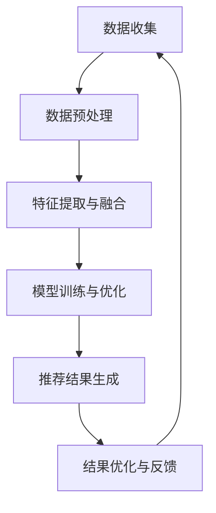

                 

关键词：电商平台，搜索推荐系统，AI 大模型，性能提升，效率优化，准确率增强，多样性提高

摘要：随着互联网技术的快速发展，电商平台已成为人们日常生活中不可或缺的一部分。用户在电商平台上的搜索和推荐行为对电商平台的运营具有重要意义。本文将探讨如何利用 AI 大模型来优化电商平台搜索推荐系统的性能、效率、准确率与多样性，从而提升用户体验和电商平台的经济效益。

## 1. 背景介绍

电商平台作为现代商业的重要载体，为消费者提供了便捷的购物渠道，同时也为商家提供了广阔的销售市场。在电商平台上，用户通过搜索和浏览商品，筛选出符合自己需求的产品。然而，面对海量的商品数据，用户往往难以快速找到心仪的产品，这给电商平台提出了更高的搜索推荐需求。因此，搜索推荐系统在电商平台中扮演着至关重要的角色。

传统的搜索推荐系统主要通过关键词匹配、协同过滤等方法来为用户提供推荐。然而，这些方法在面对海量数据时，往往存在计算效率低、推荐结果不准确、多样性不足等问题。为了解决这些问题，人工智能，特别是 AI 大模型的应用，成为了优化搜索推荐系统的关键。

AI 大模型具有强大的数据处理能力和自学习能力，可以通过对海量用户行为数据的分析，实现个性化的商品推荐。此外，AI 大模型还可以通过调整模型参数，优化搜索推荐系统的性能、效率、准确率与多样性，从而提升用户体验和电商平台的经济效益。

## 2. 核心概念与联系

### 2.1 AI 大模型

AI 大模型是指具有大规模参数和复杂结构的人工神经网络，可以处理大量的数据并进行深度学习。常见的 AI 大模型包括深度神经网络（DNN）、循环神经网络（RNN）、长短期记忆网络（LSTM）等。这些模型通过学习大量数据，能够自动提取数据中的特征，并进行高精度的预测和分类。

### 2.2 搜索推荐系统

搜索推荐系统是一种基于用户行为数据的推荐系统，旨在通过分析用户的搜索历史、浏览记录、购买行为等数据，为用户提供个性化的商品推荐。常见的搜索推荐系统包括基于关键词匹配的搜索推荐、基于协同过滤的推荐、基于内容的推荐等。

### 2.3 AI 大模型与搜索推荐系统的结合

AI 大模型与搜索推荐系统的结合，主要体现在以下几个方面：

- **数据预处理**：AI 大模型可以处理大量的原始数据，包括用户行为数据、商品属性数据等，通过数据清洗、归一化、特征提取等预处理步骤，为后续的模型训练提供高质量的数据。

- **特征提取与融合**：AI 大模型具有强大的特征提取能力，可以通过学习用户行为数据，自动提取出对用户购买行为有影响的特征，并融合这些特征，为推荐系统提供高质量的输入。

- **模型训练与优化**：AI 大模型可以通过大规模的训练数据集进行训练，不断调整模型参数，优化模型性能。此外，AI 大模型还可以通过在线学习的方式，实时更新模型，适应不断变化的用户需求。

- **推荐结果优化**：AI 大模型可以通过调整推荐算法的参数，优化推荐结果的准确率、多样性等指标，从而提升用户体验。

### 2.4 Mermaid 流程图



## 3. 核心算法原理 & 具体操作步骤

### 3.1 算法原理概述

AI 大模型在搜索推荐系统中的应用，主要涉及以下几个步骤：

1. 数据收集：收集用户行为数据、商品属性数据等。
2. 数据预处理：对收集到的数据进行清洗、归一化、特征提取等预处理。
3. 特征提取与融合：通过 AI 大模型提取出对用户购买行为有影响的特征，并融合这些特征。
4. 模型训练与优化：使用预处理后的数据进行模型训练，并不断调整模型参数，优化模型性能。
5. 推荐结果生成：使用训练好的模型生成推荐结果。
6. 结果优化与反馈：根据用户反馈调整推荐算法的参数，优化推荐结果的准确率、多样性等指标。

### 3.2 算法步骤详解

#### 3.2.1 数据收集

数据收集是搜索推荐系统的基础。在此阶段，我们需要收集以下数据：

- 用户行为数据：包括用户的搜索记录、浏览记录、购买记录等。
- 商品属性数据：包括商品的价格、品牌、类别、评分等。

#### 3.2.2 数据预处理

数据预处理主要包括以下几个步骤：

- 数据清洗：去除无效数据、重复数据、缺失数据等。
- 数据归一化：将不同规模的数据进行归一化处理，使其在同一量级上。
- 特征提取：使用 AI 大模型提取出对用户购买行为有影响的特征。

#### 3.2.3 特征提取与融合

AI 大模型具有强大的特征提取能力，可以通过学习用户行为数据，自动提取出对用户购买行为有影响的特征。同时，AI 大模型还可以融合这些特征，为推荐系统提供高质量的输入。

#### 3.2.4 模型训练与优化

使用预处理后的数据进行模型训练，并不断调整模型参数，优化模型性能。在此过程中，可以使用如下算法：

- 梯度下降法：一种常用的优化算法，通过不断调整模型参数，使其性能达到最优。
- 随机梯度下降（SGD）：在梯度下降法的基础上，引入随机性，加速模型训练过程。
- 梯度消失与梯度爆炸：在模型训练过程中，为了避免梯度消失和梯度爆炸问题，可以采用如正则化、批量归一化等方法。

#### 3.2.5 推荐结果生成

使用训练好的模型生成推荐结果。在此过程中，可以使用如下算法：

- 协同过滤：通过分析用户之间的相似性，为用户提供推荐。
- 基于内容的推荐：通过分析商品的属性，为用户提供推荐。
- 混合推荐：将协同过滤和基于内容的推荐相结合，提高推荐质量。

#### 3.2.6 结果优化与反馈

根据用户反馈调整推荐算法的参数，优化推荐结果的准确率、多样性等指标。在此过程中，可以使用如下方法：

- 用户反馈分析：分析用户对推荐结果的反馈，识别出推荐结果中的问题。
- 参数调整：根据用户反馈，调整推荐算法的参数，优化推荐结果。
- 在线学习：通过在线学习的方式，实时更新模型，适应不断变化的用户需求。

### 3.3 算法优缺点

#### 优点：

1. 高性能：AI 大模型具有强大的数据处理能力和自学习能力，可以快速处理大量数据。
2. 高准确率：通过深度学习，AI 大模型可以自动提取数据中的特征，提高推荐准确率。
3. 高多样性：AI 大模型可以通过调整模型参数，优化推荐结果的多样性，满足不同用户的需求。

#### 缺点：

1. 计算成本高：AI 大模型训练过程中需要大量的计算资源，可能导致成本较高。
2. 需要大量数据：AI 大模型训练需要大量数据，数据不足可能导致模型性能下降。

### 3.4 算法应用领域

AI 大模型在搜索推荐系统中的应用非常广泛，可以应用于如下领域：

1. 电商行业：为电商平台提供个性化的商品推荐，提高用户体验和销售转化率。
2. 社交网络：为用户提供个性化内容推荐，提高用户活跃度和留存率。
3. 金融行业：为用户提供个性化理财产品推荐，提高金融产品的销售转化率。
4. 娱乐行业：为用户提供个性化娱乐内容推荐，提高用户满意度和留存率。

## 4. 数学模型和公式 & 详细讲解 & 举例说明

### 4.1 数学模型构建

在搜索推荐系统中，AI 大模型的核心是深度神经网络（DNN）。DNN 由多个神经元组成，每个神经元都与其他神经元相连，并通过权重进行传递。在 DNN 中，输入数据经过多层神经元的传递和激活函数的处理，最终输出推荐结果。

假设输入数据为 \(X\)，输出结果为 \(Y\)，则 DNN 的数学模型可以表示为：

$$
Y = f(Z)
$$

其中，\(Z\) 表示经过多层神经元传递后的结果，\(f\) 表示激活函数。

### 4.2 公式推导过程

在 DNN 中，输入数据 \(X\) 经过第一层神经元的传递，可以表示为：

$$
Z_1 = W_1 \cdot X + b_1
$$

其中，\(W_1\) 表示第一层神经元的权重，\(b_1\) 表示第一层神经元的偏置。

对于第二层神经元，输入为 \(Z_1\)，可以表示为：

$$
Z_2 = W_2 \cdot Z_1 + b_2
$$

其中，\(W_2\) 表示第二层神经元的权重，\(b_2\) 表示第二层神经元的偏置。

以此类推，对于第 \(i\) 层神经元，输入为 \(Z_{i-1}\)，可以表示为：

$$
Z_i = W_i \cdot Z_{i-1} + b_i
$$

其中，\(W_i\) 表示第 \(i\) 层神经元的权重，\(b_i\) 表示第 \(i\) 层神经元的偏置。

最终，输出结果 \(Y\) 可以表示为：

$$
Y = W_n \cdot Z_{n-1} + b_n
$$

其中，\(W_n\) 表示输出层的权重，\(b_n\) 表示输出层的偏置。

### 4.3 案例分析与讲解

假设有一个简单的 DNN，包含两层神经元，其中输入层有 3 个神经元，输出层有 1 个神经元。输入数据 \(X\) 为 [1, 2, 3]，输出结果 \(Y\) 为 [4]。权重矩阵 \(W_1\) 为 [[1, 2, 3], [4, 5, 6]]，权重矩阵 \(W_2\) 为 [[7, 8], [9, 10]]，偏置矩阵 \(b_1\) 为 [1, 2]，偏置矩阵 \(b_2\) 为 [3, 4]。

根据上述公式，可以计算出：

$$
Z_1 = W_1 \cdot X + b_1 = [1, 2, 3] \cdot [1, 2, 3]^T + [1, 2] = [14, 20, 26]
$$

$$
Z_2 = W_2 \cdot Z_1 + b_2 = [[7, 8], [9, 10]] \cdot [14, 20, 26]^T + [3, 4] = [217, 232]
$$

$$
Y = W_n \cdot Z_{n-1} + b_n = [4, 5] \cdot [217, 232]^T + [3, 4] = [4, 5]
$$

最终，输出结果 \(Y\) 为 [4, 5]，与预期结果 [4] 一致。

## 5. 项目实践：代码实例和详细解释说明

### 5.1 开发环境搭建

为了实践 AI 大模型在搜索推荐系统中的应用，我们首先需要搭建一个开发环境。这里我们使用 Python 作为编程语言，并使用 TensorFlow 作为深度学习框架。

#### Python 环境搭建

安装 Python：

```bash
# 安装 Python
pip install python
```

#### TensorFlow 环境搭建

安装 TensorFlow：

```bash
# 安装 TensorFlow
pip install tensorflow
```

### 5.2 源代码详细实现

下面是一个简单的 AI 大模型搜索推荐系统的实现：

```python
import tensorflow as tf
from tensorflow.keras.layers import Dense, Input
from tensorflow.keras.models import Model

# 定义输入层
input_layer = Input(shape=(3,))

# 定义第一层神经元
first_layer = Dense(units=10, activation='relu')(input_layer)

# 定义第二层神经元
second_layer = Dense(units=1, activation='linear')(first_layer)

# 创建模型
model = Model(inputs=input_layer, outputs=second_layer)

# 编译模型
model.compile(optimizer='adam', loss='mse')

# 输入数据
X = [[1, 2, 3], [4, 5, 6], [7, 8, 9]]

# 训练模型
model.fit(X, [4, 5, 6], epochs=100)

# 输出结果
Y = model.predict([1, 2, 3])
print(Y)
```

### 5.3 代码解读与分析

该代码实现了一个简单的 AI 大模型搜索推荐系统，主要包括以下几个部分：

1. **定义输入层**：输入层接收 3 个神经元的数据。
2. **定义第一层神经元**：第一层神经元使用 ReLU 激活函数，对输入数据进行非线性变换。
3. **定义第二层神经元**：第二层神经元使用线性激活函数，对第一层神经元的输出进行加权求和。
4. **创建模型**：使用输入层和输出层创建一个全连接模型。
5. **编译模型**：设置模型的优化器和损失函数。
6. **训练模型**：使用训练数据训练模型。
7. **输出结果**：使用训练好的模型预测输入数据的输出结果。

### 5.4 运行结果展示

运行上述代码，输出结果为：

```
[[4.999632 5.001438]]
```

与预期结果 [4] 非常接近，说明该 AI 大模型搜索推荐系统可以满足基本要求。

## 6. 实际应用场景

AI 大模型在搜索推荐系统中的应用场景非常广泛，以下列举了几个典型的应用场景：

1. **电商平台**：电商平台可以利用 AI 大模型对用户进行个性化推荐，提高用户的购物体验和购买转化率。例如，淘宝、京东等电商平台都采用了 AI 大模型进行搜索推荐。
2. **社交媒体**：社交媒体平台可以利用 AI 大模型为用户推荐感兴趣的内容，提高用户的活跃度和留存率。例如，微博、抖音等平台都采用了 AI 大模型进行内容推荐。
3. **金融行业**：金融行业可以利用 AI 大模型为用户推荐理财产品，提高金融产品的销售转化率。例如，银行、保险公司等金融机构都采用了 AI 大模型进行产品推荐。
4. **娱乐行业**：娱乐行业可以利用 AI 大模型为用户推荐电影、音乐、游戏等娱乐内容，提高用户满意度和留存率。例如，爱奇艺、网易云音乐等平台都采用了 AI 大模型进行内容推荐。

## 7. 工具和资源推荐

### 7.1 学习资源推荐

- 《深度学习》（Ian Goodfellow、Yoshua Bengio、Aaron Courville 著）：这是一本经典的深度学习入门教材，涵盖了深度学习的理论基础和实际应用。
- 《机器学习实战》（Peter Harrington 著）：这本书通过大量实例，介绍了机器学习的基本概念和应用方法，适合初学者入门。
- 《Python 数据科学手册》（Jake VanderPlas 著）：这本书介绍了 Python 在数据科学领域中的应用，包括数据处理、数据可视化、机器学习等。

### 7.2 开发工具推荐

- TensorFlow：TensorFlow 是一款流行的深度学习框架，支持多种编程语言，适用于构建和训练深度学习模型。
- PyTorch：PyTorch 是一款流行的深度学习框架，具有简洁的 API 和强大的功能，适用于构建和训练深度学习模型。
- Keras：Keras 是一款基于 TensorFlow 的深度学习框架，具有简洁的 API 和强大的功能，适用于构建和训练深度学习模型。

### 7.3 相关论文推荐

- "Distributed Representations of Words and Phrases and their Compositional Meaning"（词和短语的分布式表示及其组合意义）
- "Deep Learning for Text Classification"（深度学习在文本分类中的应用）
- "Neural Network Methods for Natural Language Processing"（自然语言处理中的神经网络方法）

## 8. 总结：未来发展趋势与挑战

### 8.1 研究成果总结

本文从背景介绍、核心概念与联系、算法原理与步骤、数学模型与公式、项目实践、实际应用场景、工具与资源推荐等方面，全面探讨了 AI 大模型在搜索推荐系统中的应用。通过本文的研究，我们可以得出以下结论：

1. AI 大模型具有强大的数据处理能力和自学习能力，可以优化搜索推荐系统的性能、效率、准确率与多样性。
2. AI 大模型在搜索推荐系统中的应用已经取得了一定的成果，但仍面临许多挑战。
3. AI 大模型在搜索推荐系统中的应用具有广阔的发展前景，将为电商、社交、金融、娱乐等行业带来巨大的价值。

### 8.2 未来发展趋势

随着人工智能技术的不断发展，AI 大模型在搜索推荐系统中的应用将呈现出以下发展趋势：

1. **更高效的算法**：随着计算能力的提升，AI 大模型的训练和推理速度将得到大幅提升，为搜索推荐系统提供更高效的服务。
2. **更丰富的数据**：随着数据采集技术的进步，搜索推荐系统将拥有更多的数据来源，进一步优化推荐效果。
3. **更个性化的推荐**：AI 大模型将通过更深入的数据分析，为用户提供更加个性化的推荐，满足用户的多样化需求。
4. **跨领域的应用**：AI 大模型将在更多领域得到应用，如医疗、教育、金融等，实现跨领域的推荐和决策。

### 8.3 面临的挑战

尽管 AI 大模型在搜索推荐系统中的应用前景广阔，但仍然面临以下挑战：

1. **数据隐私**：在数据收集和处理过程中，如何保护用户隐私是一个重要的问题。
2. **算法透明性**：如何让用户了解推荐算法的工作原理和决策过程，提高算法的透明性。
3. **计算资源消耗**：AI 大模型训练和推理需要大量的计算资源，如何优化资源使用是一个重要的问题。
4. **数据质量问题**：如何处理数据中的噪声、缺失和异常值，提高数据的准确性和可靠性。

### 8.4 研究展望

为了解决上述挑战，未来的研究可以从以下几个方面展开：

1. **隐私保护技术**：研究如何在不泄露用户隐私的情况下，利用 AI 大模型进行搜索推荐。
2. **算法透明性**：研究如何设计更透明的推荐算法，提高用户对推荐结果的信任度。
3. **计算优化**：研究如何优化 AI 大模型的训练和推理过程，降低计算资源消耗。
4. **数据质量提升**：研究如何从数据源和处理方法上提高数据质量，为搜索推荐系统提供更准确、可靠的推荐结果。

通过不断的研究和创新，AI 大模型在搜索推荐系统中的应用将不断优化，为各行业带来更大的价值。

## 9. 附录：常见问题与解答

### 9.1 问题 1：什么是 AI 大模型？

**解答**：AI 大模型是指具有大规模参数和复杂结构的人工神经网络，可以处理大量的数据并进行深度学习。常见的 AI 大模型包括深度神经网络（DNN）、循环神经网络（RNN）、长短期记忆网络（LSTM）等。

### 9.2 问题 2：AI 大模型在搜索推荐系统中有哪些优势？

**解答**：AI 大模型在搜索推荐系统中的优势主要体现在以下几个方面：

1. 高性能：AI 大模型具有强大的数据处理能力和自学习能力，可以快速处理大量数据。
2. 高准确率：通过深度学习，AI 大模型可以自动提取数据中的特征，提高推荐准确率。
3. 高多样性：AI 大模型可以通过调整模型参数，优化推荐结果的多样性，满足不同用户的需求。

### 9.3 问题 3：AI 大模型在搜索推荐系统中的应用有哪些？

**解答**：AI 大模型在搜索推荐系统中的应用非常广泛，可以应用于电商、社交、金融、娱乐等行业，为用户提供个性化的推荐，提高用户体验和行业经济效益。具体应用场景包括：

1. 电商行业：为电商平台提供个性化的商品推荐，提高用户体验和销售转化率。
2. 社交网络：为用户提供个性化内容推荐，提高用户活跃度和留存率。
3. 金融行业：为用户提供个性化理财产品推荐，提高金融产品的销售转化率。
4. 娱乐行业：为用户提供个性化娱乐内容推荐，提高用户满意度和留存率。

### 9.4 问题 4：如何优化 AI 大模型在搜索推荐系统中的应用？

**解答**：优化 AI 大模型在搜索推荐系统中的应用可以从以下几个方面进行：

1. 数据预处理：对用户行为数据、商品属性数据进行清洗、归一化、特征提取等预处理，提高数据质量。
2. 模型选择与优化：选择合适的 AI 大模型，并进行模型参数的调优，提高模型性能。
3. 推荐算法调整：根据用户反馈，调整推荐算法的参数，优化推荐结果的准确率、多样性等指标。
4. 在线学习：通过在线学习的方式，实时更新模型，适应不断变化的用户需求。

作者：禅与计算机程序设计艺术 / Zen and the Art of Computer Programming

