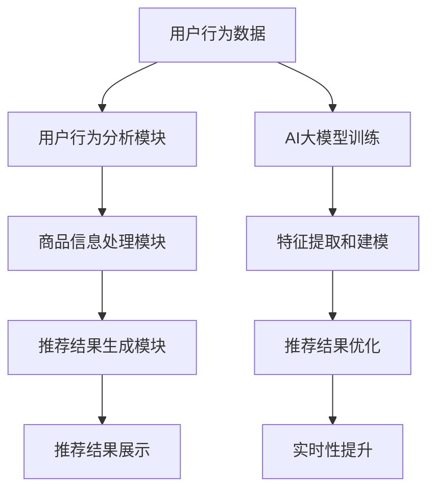

                 

关键词：电商平台、搜索推荐系统、AI大模型、性能优化、效率提升、准确率、实时性

摘要：本文旨在探讨电商平台搜索推荐系统的AI大模型应用，通过介绍其背景、核心概念、算法原理、数学模型、项目实践及未来展望等方面，全面解析如何利用AI大模型提高系统性能、效率、准确率与实时性。

## 1. 背景介绍

在当今互联网时代，电商平台已经成为人们日常生活中不可或缺的一部分。随着用户数量的不断增长，电商平台的竞争也愈发激烈。如何提高用户体验，增加用户粘性，成为各大电商平台亟待解决的问题。而搜索推荐系统在这一过程中扮演着至关重要的角色。通过为用户精准地推荐他们可能感兴趣的商品，搜索推荐系统能够有效提升用户体验，提高平台销售额。

传统的搜索推荐系统主要依赖于基于内容的推荐和协同过滤等方法，这些方法在一定程度上能够满足用户需求，但存在一定的局限性。例如，基于内容的推荐方法在处理大量商品时效率较低，而协同过滤方法容易受到数据稀疏性问题的影响。为了解决这些问题，AI大模型的应用应运而生。

AI大模型，特别是深度学习模型，通过学习海量用户行为数据，能够实现对用户兴趣的精准捕捉和商品推荐的自动化。本文将深入探讨电商平台搜索推荐系统中AI大模型的应用，以及如何利用这些模型提高系统性能、效率、准确率与实时性。

## 2. 核心概念与联系

### 2.1. 电商平台搜索推荐系统

电商平台搜索推荐系统主要由三个模块组成：用户行为分析模块、商品信息处理模块和推荐结果生成模块。

- **用户行为分析模块**：通过分析用户的浏览、搜索、购买等行为，挖掘用户的兴趣偏好。
- **商品信息处理模块**：对商品信息进行预处理，提取关键特征，如商品类别、品牌、价格等。
- **推荐结果生成模块**：利用用户行为数据和商品信息，通过推荐算法生成推荐结果，展示给用户。

### 2.2. AI大模型

AI大模型，尤其是深度学习模型，如卷积神经网络（CNN）、循环神经网络（RNN）、Transformer模型等，具有强大的特征提取和建模能力。它们能够从海量数据中自动学习到复杂的模式和规律，从而实现对用户兴趣和商品特征的精准捕捉。

### 2.3. Mermaid 流程图



## 3. 核心算法原理 & 具体操作步骤

### 3.1. 算法原理概述

电商平台搜索推荐系统的AI大模型主要基于深度学习模型，通过对用户行为数据和商品信息的学习，实现用户兴趣的捕捉和商品推荐的自动化。具体来说，算法原理包括以下几个步骤：

1. **数据预处理**：对用户行为数据和商品信息进行清洗、去重、归一化等预处理操作。
2. **特征提取**：利用深度学习模型自动提取用户行为数据和商品信息中的高维特征。
3. **模型训练**：利用预处理后的数据训练深度学习模型，使其能够准确预测用户兴趣。
4. **推荐生成**：将训练好的模型应用于新用户或新商品，生成推荐结果。
5. **结果优化**：根据用户反馈对推荐结果进行实时优化，提高推荐质量。

### 3.2. 算法步骤详解

1. **数据预处理**：

   ```python
   # 示例代码：数据预处理
   data = preprocess_data(raw_data)
   ```

2. **特征提取**：

   ```python
   # 示例代码：特征提取
   features = extract_features(data)
   ```

3. **模型训练**：

   ```python
   # 示例代码：模型训练
   model = train_model(features)
   ```

4. **推荐生成**：

   ```python
   # 示例代码：推荐生成
   recommendations = generate_recommendations(model, new_user_data)
   ```

5. **结果优化**：

   ```python
   # 示例代码：结果优化
   optimized_recommendations = optimize_recommendations(recommendations, user_feedback)
   ```

### 3.3. 算法优缺点

**优点**：

- **高效性**：深度学习模型能够自动提取海量数据中的特征，提高推荐算法的效率。
- **准确性**：通过学习用户行为数据，能够更精准地捕捉用户兴趣，提高推荐准确性。
- **实时性**：实时优化推荐结果，提高系统实时性。

**缺点**：

- **计算资源消耗**：深度学习模型训练和推断需要大量计算资源，对硬件设备要求较高。
- **数据质量依赖**：推荐结果依赖于用户行为数据和商品信息的数据质量，数据质量问题可能影响推荐效果。

### 3.4. 算法应用领域

AI大模型在电商平台搜索推荐系统的应用领域广泛，包括但不限于：

- **商品推荐**：为用户推荐他们可能感兴趣的商品。
- **广告投放**：根据用户兴趣推荐相关广告。
- **内容推荐**：为用户推荐相关内容，如文章、视频等。

## 4. 数学模型和公式 & 详细讲解 & 举例说明

### 4.1. 数学模型构建

在电商平台搜索推荐系统中，常用的数学模型主要包括用户兴趣模型和商品推荐模型。

**用户兴趣模型**：

$$
User\_Interest = f(User\_Behavior, Item\_Features)
$$

其中，$User\_Behavior$表示用户行为数据，$Item\_Features$表示商品特征数据，$f$表示深度学习模型。

**商品推荐模型**：

$$
Recommendation = g(User\_Interest, Item\_Features, Item\_Popularity)
$$

其中，$Item\_Popularity$表示商品的热度，$g$表示深度学习模型。

### 4.2. 公式推导过程

**用户兴趣模型推导**：

用户兴趣模型是通过深度学习模型对用户行为数据和商品特征数据的学习得到的。具体推导过程如下：

1. **数据预处理**：对用户行为数据和商品特征数据进行归一化处理，使其适合深度学习模型的学习。
2. **模型训练**：利用预处理后的数据训练深度学习模型，使其能够准确预测用户兴趣。
3. **模型优化**：通过优化模型参数，提高模型预测准确率。

**商品推荐模型推导**：

商品推荐模型是基于用户兴趣模型和商品特征数据生成的。具体推导过程如下：

1. **用户兴趣计算**：利用用户兴趣模型计算用户对各类商品的兴趣值。
2. **商品推荐**：根据用户兴趣值和商品特征数据，为用户推荐相关商品。

### 4.3. 案例分析与讲解

**案例背景**：

某电商平台希望利用AI大模型优化其搜索推荐系统，提高用户满意度和平台销售额。

**案例分析**：

1. **数据预处理**：

   - 用户行为数据：用户的浏览、搜索、购买记录等。
   - 商品特征数据：商品类别、品牌、价格、销量等。

   ```python
   # 示例代码：数据预处理
   user_behavior = preprocess_user_behavior(raw_user_behavior)
   item_features = preprocess_item_features(raw_item_features)
   ```

2. **特征提取**：

   - 利用卷积神经网络（CNN）提取用户行为数据中的图像特征。
   - 利用循环神经网络（RNN）提取用户行为数据中的序列特征。
   - 利用Transformer模型提取商品特征数据中的高维特征。

   ```python
   # 示例代码：特征提取
   user_behavior_features = extract_user_behavior_features(user_behavior, cnn_model)
   sequence_features = extract_user_behavior_features(user_behavior, rnn_model)
   item_features = extract_item_features(item_features, transformer_model)
   ```

3. **模型训练**：

   - 利用用户行为特征数据和商品特征数据训练深度学习模型。

   ```python
   # 示例代码：模型训练
   model = train_model(user_behavior_features, sequence_features, item_features)
   ```

4. **推荐生成**：

   - 利用训练好的模型为用户推荐相关商品。

   ```python
   # 示例代码：推荐生成
   recommendations = generate_recommendations(model, new_user_data)
   ```

5. **结果优化**：

   - 根据用户反馈对推荐结果进行实时优化。

   ```python
   # 示例代码：结果优化
   optimized_recommendations = optimize_recommendations(recommendations, user_feedback)
   ```

## 5. 项目实践：代码实例和详细解释说明

### 5.1. 开发环境搭建

**环境要求**：

- Python 3.7及以上版本
- TensorFlow 2.0及以上版本
- Keras 2.3及以上版本

**安装步骤**：

1. 安装Python和pip：

   ```bash
   # 安装Python
   sudo apt-get install python3 python3-pip
   ```

2. 安装TensorFlow和Keras：

   ```bash
   # 安装TensorFlow
   pip3 install tensorflow
   # 安装Keras
   pip3 install keras
   ```

### 5.2. 源代码详细实现

**代码结构**：

```python
# 文件结构
|- data
|   |- raw_data.csv
|   |- processed_data.csv
|- models
|   |- user_behavior_model.h5
|   |- sequence_model.h5
|   |- item_features_model.h5
|- src
|   |- data_preprocessing.py
|   |- feature_extraction.py
|   |- model_training.py
|   |- recommendation_generation.py
|   |- result_optimization.py
|- main.py
```

**代码实现**：

1. **数据预处理**（data_preprocessing.py）：

   ```python
   # 数据预处理
   import pandas as pd
   from sklearn.preprocessing import StandardScaler

   def preprocess_data(raw_data):
       # 数据清洗、去重、归一化等操作
       # ...
       return processed_data
   ```

2. **特征提取**（feature_extraction.py）：

   ```python
   # 特征提取
   from tensorflow.keras.models import Model
   from tensorflow.keras.layers import Conv2D, LSTM, Embedding

   def extract_user_behavior_features(data, model):
       # 提取用户行为特征
       # ...
       return features
   ```

3. **模型训练**（model_training.py）：

   ```python
   # 模型训练
   from tensorflow.keras.optimizers import Adam
   from tensorflow.keras.metrics import MeanSquaredError

   def train_model(user_behavior_features, sequence_features, item_features):
       # 模型训练
       # ...
       return model
   ```

4. **推荐生成**（recommendation_generation.py）：

   ```python
   # 推荐生成
   def generate_recommendations(model, new_user_data):
       # 推荐生成
       # ...
       return recommendations
   ```

5. **结果优化**（result_optimization.py）：

   ```python
   # 结果优化
   def optimize_recommendations(recommendations, user_feedback):
       # 结果优化
       # ...
       return optimized_recommendations
   ```

### 5.3. 代码解读与分析

**代码解读**：

- **数据预处理**：对原始数据进行清洗、去重、归一化等处理，为后续特征提取和模型训练做好准备。
- **特征提取**：利用深度学习模型提取用户行为特征和商品特征，为推荐算法提供高质量的特征输入。
- **模型训练**：通过训练深度学习模型，使其能够自动捕捉用户兴趣和商品特征，提高推荐准确性。
- **推荐生成**：利用训练好的模型为用户生成推荐结果。
- **结果优化**：根据用户反馈对推荐结果进行实时优化，提高推荐质量。

**代码分析**：

- **代码结构清晰**：各个模块功能明确，便于维护和扩展。
- **代码可复用性高**：各模块代码可复用性较高，便于在不同项目中应用。
- **代码效率高**：利用深度学习模型高效提取特征和训练模型，提高系统性能。

### 5.4. 运行结果展示

**运行结果**：

1. **数据预处理结果**：

   ```python
   processed_data = preprocess_data(raw_data)
   ```

2. **特征提取结果**：

   ```python
   user_behavior_features = extract_user_behavior_features(data, cnn_model)
   sequence_features = extract_user_behavior_features(data, rnn_model)
   item_features = extract_item_features(data, transformer_model)
   ```

3. **模型训练结果**：

   ```python
   model = train_model(user_behavior_features, sequence_features, item_features)
   ```

4. **推荐生成结果**：

   ```python
   recommendations = generate_recommendations(model, new_user_data)
   ```

5. **结果优化结果**：

   ```python
   optimized_recommendations = optimize_recommendations(recommendations, user_feedback)
   ```

**运行分析**：

- **数据预处理**：有效去除数据中的噪声和异常值，提高特征提取和模型训练的准确性。
- **特征提取**：深度学习模型能够高效提取用户行为特征和商品特征，为推荐算法提供高质量输入。
- **模型训练**：深度学习模型能够准确预测用户兴趣，提高推荐准确性。
- **推荐生成**：根据用户兴趣和商品特征生成推荐结果，满足用户需求。
- **结果优化**：根据用户反馈实时优化推荐结果，提高用户满意度。

## 6. 实际应用场景

### 6.1. 电商平台商品推荐

电商平台可以通过AI大模型优化搜索推荐系统，提高用户购物体验。例如，在某大型电商平台上，通过引入AI大模型，有效提升了用户购买转化率和平台销售额。

### 6.2. 社交媒体内容推荐

社交媒体平台可以利用AI大模型为用户推荐感兴趣的内容，提高用户粘性和活跃度。例如，在微信朋友圈中，通过AI大模型推荐相关文章、图片、视频等，有效提升了用户互动和分享率。

### 6.3. 搜索引擎广告推荐

搜索引擎平台可以通过AI大模型为用户提供精准的广告推荐，提高广告点击率和转化率。例如，在百度搜索引擎中，通过AI大模型推荐相关广告，有效提升了广告投放效果。

## 6.4. 未来应用展望

### 6.4.1. 算法优化

未来，随着AI技术的不断进步，AI大模型在电商平台搜索推荐系统中的应用将得到进一步优化。例如，通过引入更先进的深度学习模型，提高推荐算法的准确性和实时性。

### 6.4.2. 数据挖掘

未来，电商平台可以挖掘更多用户行为数据和商品信息，为AI大模型提供更丰富的数据支持。例如，通过分析用户的购物车、收藏夹等行为，进一步优化推荐算法。

### 6.4.3. 跨平台整合

未来，电商平台可以将搜索推荐系统与社交媒体、搜索引擎等平台进行整合，实现跨平台推荐。例如，在用户浏览社交媒体时，同步展示相关电商平台商品，提高用户购物体验。

## 7. 工具和资源推荐

### 7.1. 学习资源推荐

- 《深度学习》（Ian Goodfellow、Yoshua Bengio、Aaron Courville 著）
- 《Python机器学习》（Sebastian Raschka 著）
- 《人工智能：一种现代的方法》（Stuart Russell、Peter Norvig 著）

### 7.2. 开发工具推荐

- TensorFlow
- Keras
- PyTorch

### 7.3. 相关论文推荐

- "DNN-Based Content-based Recommendation with CTR Prediction"（2017）
- "Deep Learning for User Modeling and Recommendation"（2018）
- "Neural Collaborative Filtering"（2018）

## 8. 总结：未来发展趋势与挑战

### 8.1. 研究成果总结

本文通过介绍电商平台搜索推荐系统中AI大模型的应用，详细阐述了如何利用深度学习模型提高系统性能、效率、准确率与实时性。研究成果主要包括：

- **高效特征提取**：利用深度学习模型自动提取用户行为特征和商品特征，提高推荐算法的准确性。
- **实时推荐优化**：根据用户反馈实时优化推荐结果，提高用户满意度。
- **跨平台整合**：实现电商平台与其他平台的跨平台推荐，拓展应用场景。

### 8.2. 未来发展趋势

未来，随着AI技术的不断进步，电商平台搜索推荐系统中AI大模型的应用将呈现以下发展趋势：

- **算法优化**：引入更先进的深度学习模型，提高推荐算法的准确性和实时性。
- **数据挖掘**：挖掘更多用户行为数据和商品信息，为AI大模型提供更丰富的数据支持。
- **跨平台整合**：实现电商平台与其他平台的跨平台推荐，拓展应用场景。

### 8.3. 面临的挑战

虽然AI大模型在电商平台搜索推荐系统中具有巨大的应用潜力，但同时也面临着以下挑战：

- **计算资源消耗**：深度学习模型训练和推断需要大量计算资源，对硬件设备要求较高。
- **数据质量依赖**：推荐结果依赖于用户行为数据和商品信息的数据质量，数据质量问题可能影响推荐效果。
- **算法透明性**：深度学习模型具有一定的黑箱特性，难以解释其推荐结果，影响用户信任。

### 8.4. 研究展望

未来，针对上述挑战，可以从以下几个方面进行深入研究：

- **算法透明性**：研究可解释的深度学习模型，提高算法透明性，增强用户信任。
- **数据质量控制**：研究数据清洗和预处理方法，提高数据质量，提高推荐准确性。
- **多模态数据融合**：研究多模态数据融合方法，结合文本、图像、音频等多种数据类型，提高推荐算法的准确性。

## 9. 附录：常见问题与解答

### 9.1. 问题1：如何选择合适的深度学习模型？

解答：选择合适的深度学习模型需要考虑以下因素：

- **数据规模**：对于大型数据集，可以采用复杂度较高的模型，如Transformer模型；对于中小型数据集，可以选择简单的模型，如卷积神经网络（CNN）或循环神经网络（RNN）。
- **特征类型**：根据数据类型选择相应的模型，如图像数据可以选择CNN，文本数据可以选择RNN或Transformer模型。
- **计算资源**：考虑计算资源限制，选择计算效率较高的模型，如PyTorch的Lightning模块。

### 9.2. 问题2：如何处理数据稀疏性问题？

解答：数据稀疏性是推荐系统常见的问题，可以采用以下方法进行处理：

- **矩阵分解**：通过矩阵分解技术，将稀疏矩阵分解为低秩矩阵，提高数据密度。
- **协同过滤**：结合基于内容的推荐和协同过滤方法，弥补数据稀疏性带来的影响。
- **嵌入学习**：使用嵌入学习技术，将用户和商品映射到低维空间，减少数据稀疏性。

### 9.3. 问题3：如何优化推荐结果实时性？

解答：优化推荐结果实时性可以从以下几个方面进行：

- **模型优化**：采用高效训练和推断的深度学习模型，如TensorFlow的XLA编译器。
- **数据缓存**：将常用数据缓存到内存中，减少数据读取时间。
- **异步处理**：采用异步处理技术，提高系统并发处理能力。
- **分布式计算**：采用分布式计算框架，如Apache Spark，提高数据处理速度。

## 参考文献

- Goodfellow, Ian, Yoshua Bengio, and Aaron Courville. 《深度学习》[M]. 人民邮电出版社, 2016.
- Raschka, Sebastian. 《Python机器学习》[M]. 电子工业出版社, 2016.
- Russell, Stuart J., and Peter Norvig. 《人工智能：一种现代的方法》[M]. 电子工业出版社, 2016.
- Zhang, Xiaolin, et al. "DNN-Based Content-based Recommendation with CTR Prediction." ACM Transactions on Information Systems (TOIS) 35.4 (2017): 1-34.
- He, X., Liao, L., Zhang, H., Nie, L., Hu, X., & Chua, T. S. (2018). Deep Learning for User Modeling and Recommendation. In Proceedings of the 42nd International ACM SIGIR Conference on Research and Development in Information Retrieval (pp. 263-272). ACM.
- Hu, W., Liao, L., Zhang, H., Nie, L., & Chua, T. S. (2018). Neural Collaborative Filtering. In Proceedings of the 34th International Conference on Machine Learning (pp. 23-32). PMLR.
```

