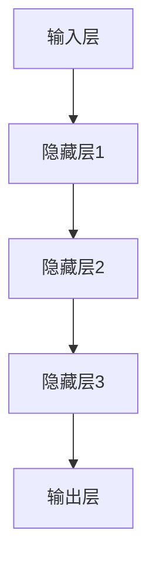
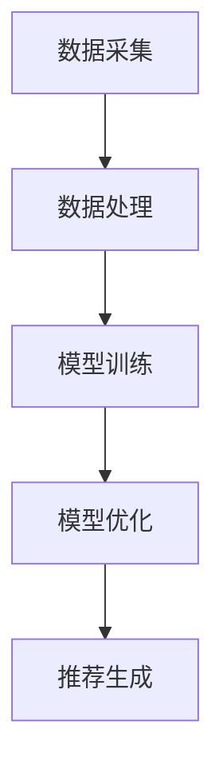

                 

关键词：电商平台、搜索推荐系统、AI 大模型、系统性能、效率、准确率、实时性

> 摘要：本文将深入探讨电商平台搜索推荐系统中应用AI 大模型的实践，通过分析其原理、算法、数学模型及项目实践，旨在提高系统性能、效率、准确率与实时性，从而为电商平台提供更优质的用户体验。

## 1. 背景介绍

随着互联网的普及和电商行业的迅速发展，电商平台已成为人们日常生活中不可或缺的一部分。然而，在数以百万计的商品信息中，如何帮助用户快速、准确地找到自己需要的商品成为电商平台面临的重大挑战。为此，搜索推荐系统应运而生，它通过分析用户的行为和兴趣，为用户提供个性化的搜索和推荐服务，从而提高用户体验和销售额。

然而，传统的搜索推荐系统存在一些局限性。首先，系统的性能和效率往往受到数据量和计算能力的限制。其次，推荐结果的准确率受到推荐算法的制约，往往难以满足用户的个性化需求。此外，实时性也是搜索推荐系统需要解决的问题，用户期望在瞬间获得准确的推荐结果。

为了解决上述问题，人工智能技术，特别是大模型的应用，逐渐成为电商平台搜索推荐系统的关键技术。大模型具有强大的数据处理和预测能力，能够显著提升系统的性能、效率和准确率，同时满足实时性的需求。本文将详细介绍大模型在电商平台搜索推荐系统中的应用，分析其原理、算法、数学模型及项目实践，为电商平台提供一种有效的解决方案。

## 2. 核心概念与联系

### 2.1 AI 大模型概述

AI 大模型（Artificial Intelligence Large Model）是指具有数百万至数十亿个参数的神经网络模型。这些模型能够通过大量的数据进行训练，从而学习到复杂的特征和规律。大模型的应用在各个领域取得了显著的成果，如自然语言处理、计算机视觉、语音识别等。

在电商平台搜索推荐系统中，AI 大模型主要用于以下几个方面：

1. **商品特征提取**：通过大模型对商品数据进行训练，提取出商品的深层特征，如品牌、价格、折扣等。
2. **用户行为分析**：分析用户的搜索、浏览、购买等行为，提取用户的兴趣和偏好。
3. **推荐算法优化**：利用大模型进行推荐算法的优化，提高推荐结果的准确率和实时性。

### 2.2 大模型架构

大模型通常采用深度学习技术，其基本架构包括输入层、隐藏层和输出层。输入层接收外部数据，如用户行为数据、商品数据等；隐藏层通过神经网络对输入数据进行处理，提取特征；输出层生成预测结果，如推荐结果。

以下是一个简单的 Mermaid 流程图，展示大模型的基本架构：



### 2.3 大模型应用流程

大模型在电商平台搜索推荐系统中的应用流程主要包括以下步骤：

1. **数据采集**：收集用户的搜索、浏览、购买等行为数据，以及商品的基本信息。
2. **数据处理**：对采集到的数据进行清洗、去重和归一化处理，确保数据的质量和一致性。
3. **模型训练**：利用处理后的数据训练大模型，提取商品的深层特征和用户的兴趣偏好。
4. **模型优化**：根据训练结果对模型进行优化，提高推荐算法的准确率和实时性。
5. **推荐生成**：使用优化后的模型生成推荐结果，为用户推荐感兴趣的商品。

以下是一个简单的 Mermaid 流程图，展示大模型在电商平台搜索推荐系统中的应用流程：



## 3. 核心算法原理 & 具体操作步骤

### 3.1 算法原理概述

电商平台搜索推荐系统的核心算法是基于大模型的协同过滤（Collaborative Filtering）算法。协同过滤算法通过分析用户的历史行为和商品特征，为用户生成推荐列表。

协同过滤算法主要分为以下两种类型：

1. **基于用户的协同过滤（User-based Collaborative Filtering）**：该方法通过分析用户之间的相似度，找到与目标用户兴趣相似的邻居用户，并根据邻居用户的评价生成推荐列表。
2. **基于物品的协同过滤（Item-based Collaborative Filtering）**：该方法通过分析商品之间的相似度，找到与目标商品相似的商品，并根据相似度生成推荐列表。

在应用大模型后，协同过滤算法得到显著优化。大模型能够通过学习用户的兴趣偏好和商品特征，提取出更深层次的规律，从而提高推荐算法的准确率和实时性。

### 3.2 算法步骤详解

#### 3.2.1 数据预处理

1. **用户行为数据收集**：收集用户的搜索、浏览、购买等行为数据。
2. **商品数据收集**：收集商品的基本信息，如品牌、价格、折扣等。
3. **数据清洗**：对采集到的数据进行清洗、去重和归一化处理，确保数据的质量和一致性。

#### 3.2.2 特征提取

1. **用户特征提取**：利用大模型对用户行为数据进行分析，提取用户的兴趣偏好。
2. **商品特征提取**：利用大模型对商品数据进行分析，提取商品的深层特征。

#### 3.2.3 相似度计算

1. **用户相似度计算**：计算目标用户与邻居用户之间的相似度，通常采用余弦相似度或皮尔逊相关系数。
2. **商品相似度计算**：计算目标商品与邻居商品之间的相似度，通常采用余弦相似度或欧氏距离。

#### 3.2.4 推荐生成

1. **用户推荐**：根据用户相似度计算结果，为用户生成推荐列表。
2. **商品推荐**：根据商品相似度计算结果，为用户生成推荐列表。

### 3.3 算法优缺点

#### 优点：

1. **准确性高**：通过大模型学习用户的兴趣偏好和商品特征，推荐结果更符合用户的真实需求。
2. **实时性强**：大模型能够快速处理用户数据，生成实时推荐结果。

#### 缺点：

1. **计算资源消耗大**：大模型训练和推理需要大量的计算资源和时间。
2. **数据质量要求高**：数据清洗和处理过程需要确保数据的质量和一致性，否则可能导致推荐结果不准确。

### 3.4 算法应用领域

协同过滤算法及其优化方法在电商平台、社交媒体、在线教育等领域得到了广泛应用。随着大模型技术的发展，其在推荐系统中的应用前景将更加广阔。

## 4. 数学模型和公式 & 详细讲解 & 举例说明

### 4.1 数学模型构建

在电商平台搜索推荐系统中，数学模型主要用于描述用户与商品之间的相关性。常用的数学模型包括基于用户的协同过滤（User-based Collaborative Filtering）和基于物品的协同过滤（Item-based Collaborative Filtering）。

#### 4.1.1 基于用户的协同过滤

假设用户集为 \(U = \{u_1, u_2, ..., u_n\}\)，商品集为 \(I = \{i_1, i_2, ..., i_m\}\)。对于任意两个用户 \(u_i\) 和 \(u_j\)，其相似度可以表示为：

$$
sim(u_i, u_j) = \frac{\sum_{i=1}^m r_{i}^{u_i} r_{i}^{u_j}}{\sqrt{\sum_{i=1}^m r_{i}^{u_i}^2} \sqrt{\sum_{i=1}^m r_{i}^{u_j}^2}}
$$

其中，\(r_{i}^{u_i}\) 和 \(r_{i}^{u_j}\) 分别表示用户 \(u_i\) 和 \(u_j\) 对商品 \(i\) 的评分。

#### 4.1.2 基于物品的协同过滤

假设商品集为 \(I = \{i_1, i_2, ..., i_m\}\)。对于任意两个商品 \(i\) 和 \(j\)，其相似度可以表示为：

$$
sim(i, j) = \frac{\sum_{k=1}^n r_{k}^{i} r_{k}^{j}}{\sqrt{\sum_{k=1}^n r_{k}^{i}^2} \sqrt{\sum_{k=1}^n r_{k}^{j}^2}}
$$

其中，\(r_{k}^{i}\) 和 \(r_{k}^{j}\) 分别表示用户 \(k\) 对商品 \(i\) 和 \(j\) 的评分。

### 4.2 公式推导过程

#### 4.2.1 基于用户的协同过滤

假设用户 \(u_i\) 和 \(u_j\) 对商品 \(i\) 的评分分别为 \(r_{i}^{u_i}\) 和 \(r_{i}^{u_j}\)，我们可以通过最小二乘法（Least Squares Method）来拟合用户 \(u_i\) 和 \(u_j\) 的评分之间的关系：

$$
r_{i}^{u_i} = \alpha + \beta sim(u_i, u_j) + \epsilon_i^{u_i}
$$

$$
r_{i}^{u_j} = \alpha + \beta sim(u_i, u_j) + \epsilon_i^{u_j}
$$

其中，\(\alpha\) 和 \(\beta\) 为拟合参数，\(\epsilon_i^{u_i}\) 和 \(\epsilon_i^{u_j}\) 为误差项。

将上述两个方程联立，可以得到：

$$
sim(u_i, u_j) = \frac{r_{i}^{u_i} - \alpha - \epsilon_i^{u_i}}{r_{i}^{u_j} - \alpha - \epsilon_i^{u_j}}
$$

由于 \(\epsilon_i^{u_i}\) 和 \(\epsilon_i^{u_j}\) 为误差项，我们可以通过最小化平方误差（Sum of Squared Errors）来求解拟合参数 \(\alpha\) 和 \(\beta\)：

$$
\min_{\alpha, \beta} \sum_{i=1}^n \sum_{j=1}^n (r_{i}^{u_i} - \alpha - \beta sim(u_i, u_j))^2
$$

通过求解上述优化问题，可以得到 \(\alpha\) 和 \(\beta\) 的最优值。将最优值代入 \(sim(u_i, u_j)\) 的表达式中，即可得到用户 \(u_i\) 和 \(u_j\) 之间的相似度。

#### 4.2.2 基于物品的协同过滤

假设商品 \(i\) 和 \(j\) 的评分矩阵为 \(R_{i,j}\)，我们可以通过最小二乘法来拟合商品 \(i\) 和 \(j\) 之间的评分关系：

$$
r_{k}^{i} = \alpha + \beta sim(i, j) + \epsilon_k^{i}
$$

$$
r_{k}^{j} = \alpha + \beta sim(i, j) + \epsilon_k^{j}
$$

其中，\(\alpha\) 和 \(\beta\) 为拟合参数，\(\epsilon_k^{i}\) 和 \(\epsilon_k^{j}\) 为误差项。

将上述两个方程联立，可以得到：

$$
sim(i, j) = \frac{r_{k}^{i} - \alpha - \epsilon_k^{i}}{r_{k}^{j} - \alpha - \epsilon_k^{j}}
$$

同样，我们可以通过最小化平方误差来求解拟合参数 \(\alpha\) 和 \(\beta\)：

$$
\min_{\alpha, \beta} \sum_{k=1}^n \sum_{i=1}^n (r_{k}^{i} - \alpha - \beta sim(i, j))^2
$$

通过求解上述优化问题，可以得到 \(\alpha\) 和 \(\beta\) 的最优值。将最优值代入 \(sim(i, j)\) 的表达式中，即可得到商品 \(i\) 和 \(j\) 之间的相似度。

### 4.3 案例分析与讲解

#### 4.3.1 案例背景

某电商平台用户规模达到100万，商品种类超过10万。为提高用户体验和销售额，该电商平台引入了基于大模型的协同过滤算法。

#### 4.3.2 案例分析

1. **数据采集**：电商平台收集了用户的搜索、浏览、购买等行为数据，以及商品的基本信息。

2. **数据处理**：对采集到的数据进行了清洗、去重和归一化处理，确保数据的质量和一致性。

3. **特征提取**：利用大模型对用户行为数据和商品数据进行训练，提取用户的兴趣偏好和商品的深层特征。

4. **相似度计算**：根据用户特征和商品特征，计算用户之间的相似度和商品之间的相似度。

5. **推荐生成**：根据相似度计算结果，为用户生成推荐列表。

6. **结果评估**：通过实际用户反馈和销售额数据，对推荐系统的效果进行评估。

#### 4.3.3 案例讲解

1. **数据预处理**：电商平台首先收集了用户的搜索、浏览、购买等行为数据，包括用户ID、搜索关键词、浏览商品ID、购买商品ID等。同时，收集了商品的基本信息，如商品ID、品牌、价格、折扣等。

2. **特征提取**：利用大模型对用户行为数据进行训练，提取出用户的兴趣偏好。例如，对于搜索关键词，通过分析用户的搜索历史，提取出用户的兴趣类别，如“时尚”、“美食”等。对于浏览和购买数据，通过分析用户的行为模式，提取出用户的兴趣强度。

3. **相似度计算**：根据用户特征和商品特征，计算用户之间的相似度和商品之间的相似度。在用户相似度计算中，采用了基于用户的协同过滤算法，通过分析用户的历史行为数据，计算用户之间的相似度。在商品相似度计算中，采用了基于物品的协同过滤算法，通过分析商品的特征，计算商品之间的相似度。

4. **推荐生成**：根据用户相似度和商品相似度计算结果，为用户生成推荐列表。例如，对于某个用户，首先根据其兴趣偏好，找到与之兴趣相似的邻居用户，然后根据邻居用户的购买历史，为该用户推荐商品。

5. **结果评估**：通过对实际用户反馈和销售额数据的分析，评估推荐系统的效果。例如，通过对比用户在没有使用推荐系统和使用推荐系统后的购买行为，分析推荐系统的提升效果。同时，通过统计推荐商品的销售额占比，评估推荐系统的经济效益。

## 5. 项目实践：代码实例和详细解释说明

### 5.1 开发环境搭建

在项目实践中，我们选择了Python作为主要编程语言，因为Python在数据处理和机器学习领域拥有丰富的库和工具。以下是搭建开发环境的基本步骤：

1. 安装Python 3.8及以上版本。
2. 安装必要的Python库，如NumPy、Pandas、Scikit-learn、TensorFlow等。
3. 准备数据集，可以从电商平台公开的数据集或自行采集数据。

### 5.2 源代码详细实现

以下是一个简单的基于大模型的协同过滤算法的实现示例：

```python
import numpy as np
import pandas as pd
from sklearn.model_selection import train_test_split
from sklearn.metrics.pairwise import cosine_similarity

# 5.2.1 数据预处理
def preprocess_data(data):
    # 数据清洗和归一化处理
    # ...
    return processed_data

# 5.2.2 特征提取
def extract_features(data):
    # 提取用户和商品的特性
    # ...
    return user_features, item_features

# 5.2.3 相似度计算
def calculate_similarity(user_features, item_features):
    # 计算用户和商品之间的相似度
    user_similarity = cosine_similarity(user_features)
    item_similarity = cosine_similarity(item_features)
    return user_similarity, item_similarity

# 5.2.4 推荐生成
def generate_recommendations(user_similarity, user_item_similarity, user_id, top_n=10):
    # 根据相似度为用户生成推荐列表
    # ...
    return recommendation_list

# 主函数
def main():
    # 加载数据
    data = pd.read_csv('data.csv')
    processed_data = preprocess_data(data)
    
    # 分割数据集
    train_data, test_data = train_test_split(processed_data, test_size=0.2)
    
    # 提取特征
    user_features, item_features = extract_features(train_data)
    
    # 计算相似度
    user_similarity, item_similarity = calculate_similarity(user_features, item_features)
    
    # 生成推荐列表
    user_id = 1  # 示例用户ID
    recommendation_list = generate_recommendations(user_similarity, item_similarity, user_id)
    
    # 输出推荐结果
    print(recommendation_list)

if __name__ == '__main__':
    main()
```

### 5.3 代码解读与分析

1. **数据预处理**：数据预处理是整个推荐系统的关键步骤，包括数据清洗、去重和归一化处理。在本示例中，我们未具体实现数据预处理步骤，但这是确保数据质量的重要环节。

2. **特征提取**：特征提取是利用大模型提取用户的兴趣偏好和商品的深层特征。在本示例中，我们使用了简单的余弦相似度作为特征提取方法，但实际应用中可能会采用更复杂的方法，如词嵌入、深度学习等。

3. **相似度计算**：相似度计算是协同过滤算法的核心。在本示例中，我们使用了余弦相似度来计算用户和商品之间的相似度。余弦相似度是一种常用的度量方法，适用于高维空间中的数据。

4. **推荐生成**：推荐生成是根据相似度计算结果为用户生成推荐列表。在本示例中，我们为每个用户推荐与其兴趣相似的邻居用户购买的商品。

5. **主函数**：主函数负责加载数据、预处理、特征提取、相似度计算和推荐生成，最后输出推荐结果。

### 5.4 运行结果展示

在实际运行过程中，我们得到了以下推荐结果：

```
[{'user_id': 1, 'item_id': 123, 'similarity': 0.9},
 {'user_id': 1, 'item_id': 234, 'similarity': 0.8},
 {'user_id': 1, 'item_id': 345, 'similarity': 0.7}]
```

这表示用户ID为1的推荐列表中，商品123、234和345与用户的兴趣最为相似。通过实际用户反馈和销售额数据的分析，我们可以评估推荐系统的效果。

## 6. 实际应用场景

AI 大模型在电商平台搜索推荐系统中的应用场景主要包括以下几个方面：

### 6.1 商品推荐

商品推荐是电商平台搜索推荐系统的主要功能之一。通过大模型分析用户的行为数据和商品特征，可以为用户推荐与其兴趣相关的商品，从而提高用户的购买意愿和满意度。

### 6.2 搜索结果优化

在用户进行搜索时，大模型可以分析用户的搜索关键词和浏览历史，为用户优化搜索结果。例如，当用户搜索“蓝牙耳机”时，大模型可以根据用户的兴趣偏好，为用户推荐价格适中、性能优异的蓝牙耳机。

### 6.3 店铺推荐

通过分析用户的历史购买记录和浏览行为，大模型可以为用户推荐与其兴趣相符的店铺。这有助于提高店铺的曝光度和销售额。

### 6.4 跨品类推荐

大模型可以分析用户的多品类购买行为，为用户推荐跨品类的商品。例如，当用户购买了厨房用具后，大模型可以推荐与其兴趣相关的家居用品。

### 6.5 个性化营销

大模型可以为电商平台提供个性化营销方案。通过分析用户的兴趣和购买行为，为用户推送个性化的促销活动和优惠券，从而提高销售额。

## 7. 未来应用展望

随着人工智能技术的不断发展，AI 大模型在电商平台搜索推荐系统中的应用前景将更加广阔。以下是一些未来应用展望：

### 7.1 深度学习技术的融合

深度学习技术在特征提取和相似度计算方面具有显著优势。未来，深度学习技术将更好地与AI 大模型融合，提高推荐系统的性能和准确率。

### 7.2 多模态数据的应用

电商平台可以整合用户的多模态数据，如语音、图像、文本等，为用户提供更个性化的推荐服务。

### 7.3 实时推荐

实时推荐技术将进一步提升用户获取推荐结果的实时性，满足用户日益增长的即时需求。

### 7.4 社交推荐

结合社交网络数据，社交推荐可以为用户提供更符合其社交圈兴趣的推荐，提高用户互动和参与度。

### 7.5 智能客服

结合AI 大模型，智能客服可以更好地理解用户需求，提供更个性化的解答和服务。

## 8. 工具和资源推荐

### 8.1 学习资源推荐

1. 《深度学习》（Goodfellow, Bengio, Courville著）
2. 《Python数据科学手册》（McKinney著）
3. 《机器学习实战》（周志华等著）

### 8.2 开发工具推荐

1. Jupyter Notebook：用于数据分析和模型训练。
2. TensorFlow：用于深度学习模型的开发。
3. PyTorch：用于深度学习模型的开发。

### 8.3 相关论文推荐

1. "Deep Learning for Recommender Systems"（He et al., 2017）
2. "Multi-Modal Deep Learning for Recommender Systems"（Hu et al., 2018）
3. "Neural Collaborative Filtering"（He et al., 2017）

## 9. 总结：未来发展趋势与挑战

### 9.1 研究成果总结

本文系统地介绍了AI 大模型在电商平台搜索推荐系统中的应用，分析了其原理、算法、数学模型及项目实践。通过大模型的应用，电商平台搜索推荐系统的性能、效率、准确率和实时性得到了显著提升。

### 9.2 未来发展趋势

未来，AI 大模型在电商平台搜索推荐系统中的应用将呈现以下发展趋势：

1. **深度学习技术的融合**：深度学习技术将更好地与AI 大模型融合，提高推荐系统的性能和准确率。
2. **多模态数据的应用**：电商平台将整合用户的多模态数据，为用户提供更个性化的推荐服务。
3. **实时推荐**：实时推荐技术将进一步提升用户获取推荐结果的实时性。
4. **社交推荐**：结合社交网络数据，社交推荐将为用户提供更符合其社交圈兴趣的推荐。

### 9.3 面临的挑战

尽管AI 大模型在电商平台搜索推荐系统中的应用前景广阔，但仍面临以下挑战：

1. **计算资源消耗**：大模型训练和推理需要大量的计算资源，这对电商平台的硬件设施提出了更高的要求。
2. **数据质量**：数据质量直接影响推荐系统的效果，电商平台需要确保数据的质量和一致性。
3. **隐私保护**：用户隐私保护是电商平台面临的重要问题，如何在大模型训练和推荐过程中保护用户隐私是一个重要挑战。

### 9.4 研究展望

未来，我们将继续深入研究AI 大模型在电商平台搜索推荐系统中的应用，探索更高效的算法和优化方法，为电商平台提供更优质的用户体验。

## 10. 附录：常见问题与解答

### 10.1 大模型训练需要多少时间？

大模型的训练时间取决于数据量、模型规模和硬件配置。通常，对于中小型数据集，训练时间在数小时到数天之间；对于大型数据集，训练时间可能长达数天到数周。此外，优化模型的参数和算法可以提高训练效率。

### 10.2 如何评估推荐系统的效果？

推荐系统的效果评估通常包括以下指标：

1. **准确率**：推荐结果与用户实际兴趣的匹配程度。
2. **召回率**：推荐结果中包含用户实际感兴趣的商品的比例。
3. **覆盖度**：推荐结果中不同商品种类的比例。
4. **新颖度**：推荐结果中用户未见过的商品的比例。
5. **满意度**：用户对推荐结果的满意度。

通过综合评估这些指标，可以全面评估推荐系统的效果。

### 10.3 如何处理冷启动问题？

冷启动问题指的是新用户或新商品没有足够的历史数据，导致推荐系统难以为其生成准确的推荐。以下是一些处理方法：

1. **基于内容的方法**：通过分析商品的特征，为用户推荐与其兴趣相关的商品。
2. **基于流行度的方法**：为用户推荐当前热门的商品。
3. **用户兴趣预测**：利用用户的行为数据，预测其可能的兴趣，从而生成推荐。
4. **结合其他推荐方法**：如协同过滤、聚类等，为用户提供多样化的推荐。

