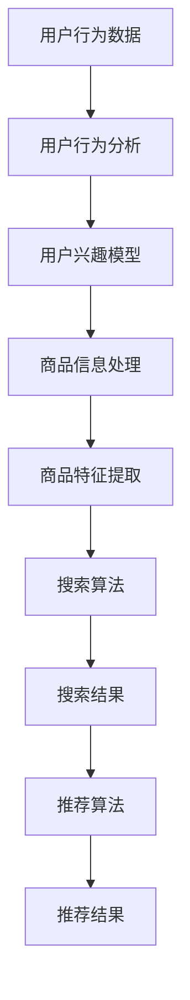

                 

关键词：电商平台、搜索推荐系统、AI 大模型、性能优化、效率提升、准确率、实时性

> 摘要：本文详细探讨了电商平台搜索推荐系统中 AI 大模型的应用。通过介绍大模型的基本概念和核心算法原理，本文深入分析了如何利用大模型提升系统的性能、效率、准确率和实时性。同时，文章还通过实际项目实践展示了大模型在电商搜索推荐系统中的具体应用，为电商平台的技术升级提供了有力参考。

## 1. 背景介绍

随着互联网的飞速发展，电商平台已经成为人们日常生活中不可或缺的一部分。在电商平台的运营中，搜索推荐系统起着至关重要的作用。它不仅决定了用户能否快速找到所需商品，还直接影响着电商平台的用户留存率和转化率。然而，传统的搜索推荐系统在性能、效率、准确率和实时性方面面临着诸多挑战。

近年来，人工智能（AI）技术的快速发展，尤其是深度学习领域的突破，为解决这些问题提供了新的思路。大模型（Large Model）作为一种先进的 AI 技术，通过海量的数据训练和复杂的网络结构，实现了对搜索推荐系统的性能优化。本文将详细介绍大模型在电商平台搜索推荐系统中的应用，探讨如何通过大模型提升系统的各项性能指标。

## 2. 核心概念与联系

### 2.1 大模型基本概念

大模型是指具有数百万甚至数十亿参数的神经网络模型。与传统的小型模型相比，大模型能够捕捉到数据中的更多特征，从而提高模型的预测准确率和泛化能力。大模型通常通过深度学习技术进行训练，涉及到的技术包括多层感知器（MLP）、卷积神经网络（CNN）、循环神经网络（RNN）和变换器（Transformer）等。

### 2.2 搜索推荐系统架构

电商平台搜索推荐系统通常由用户行为分析、商品信息处理、搜索算法和推荐算法等部分组成。用户行为分析负责收集用户在平台上的各种行为数据，如浏览记录、购买记录、评价等；商品信息处理负责将商品的各种属性信息进行标准化处理；搜索算法负责处理用户的搜索请求，生成搜索结果；推荐算法则根据用户行为和商品信息，为用户推荐相关商品。

### 2.3 大模型与搜索推荐系统的联系

大模型在搜索推荐系统中的应用主要体现在两个方面：

1. **用户行为分析**：通过大模型对用户行为数据进行深度学习分析，可以更好地理解用户的兴趣和行为模式，从而提高推荐算法的准确率。

2. **商品信息处理**：大模型能够对商品的各种属性信息进行深入挖掘，从而生成更加丰富和准确的商品特征，为搜索算法提供更优质的搜索结果。

### 2.4 Mermaid 流程图



## 3. 核心算法原理 & 具体操作步骤

### 3.1 算法原理概述

大模型在搜索推荐系统中的应用主要基于深度学习技术。深度学习通过多层神经网络对大量数据进行训练，从而实现对复杂模式的自动发现和学习。大模型的核心算法原理包括：

1. **多层感知器（MLP）**：MLP 是一种前馈神经网络，通过多层神经元进行信息传递和处理，实现对输入数据的非线性变换。

2. **卷积神经网络（CNN）**：CNN 主要用于图像处理，通过卷积操作提取图像特征，实现对图像内容的自动理解和分类。

3. **循环神经网络（RNN）**：RNN 具有记忆功能，可以处理序列数据，适用于用户行为分析和商品信息处理。

4. **变换器（Transformer）**：Transformer 是一种基于自注意力机制的模型，具有并行计算优势，适用于大规模数据处理和模型训练。

### 3.2 算法步骤详解

1. **数据收集与预处理**：收集电商平台上的用户行为数据和商品信息，对数据进行清洗、去重和标准化处理。

2. **构建大模型**：根据数据特点选择合适的大模型架构，如 MLP、CNN、RNN 或 Transformer，进行模型构建。

3. **模型训练**：使用预处理后的数据对大模型进行训练，通过反向传播算法优化模型参数。

4. **模型评估**：使用交叉验证等方法对训练好的模型进行评估，选择最优模型。

5. **模型应用**：将训练好的模型应用到搜索推荐系统中，实现用户行为分析和商品特征提取。

### 3.3 算法优缺点

**优点**：

1. **高性能**：大模型具有强大的计算能力和处理能力，能够快速处理大量数据，提高系统性能。

2. **高准确率**：通过深度学习技术，大模型能够自动学习和发现数据中的复杂模式，提高推荐算法的准确率。

3. **强泛化能力**：大模型具有较好的泛化能力，能够适应不同电商平台和用户需求。

**缺点**：

1. **训练成本高**：大模型需要大量数据进行训练，训练成本较高。

2. **模型解释性差**：大模型通常具有较深的网络结构，导致模型解释性较差，难以理解模型内部的工作机制。

### 3.4 算法应用领域

大模型在搜索推荐系统中的应用非常广泛，包括但不限于以下领域：

1. **电商搜索推荐**：通过大模型分析用户行为和商品信息，为用户提供精准的搜索和推荐结果。

2. **社交媒体内容推荐**：利用大模型对用户行为和内容进行深度分析，为用户提供个性化的内容推荐。

3. **金融风险管理**：通过大模型分析金融市场数据，预测市场走势和风险，为金融投资提供参考。

## 4. 数学模型和公式 & 详细讲解 & 举例说明

### 4.1 数学模型构建

在搜索推荐系统中，大模型通常采用以下数学模型：

$$
f(x) = \sigma(W_1 \cdot x + b_1)
$$

其中，$f(x)$ 表示输出结果，$x$ 表示输入特征，$W_1$ 和 $b_1$ 分别表示权重和偏置。

### 4.2 公式推导过程

以 MLP 模型为例，推导过程如下：

1. **输入层**：输入特征 $x$ 经过线性变换得到中间层特征：

$$
z_1 = W_1 \cdot x + b_1
$$

2. **激活函数**：对中间层特征进行激活函数变换，得到激活值：

$$
a_1 = \sigma(z_1)
$$

其中，$\sigma$ 表示激活函数，如 Sigmoid、ReLU 等。

3. **输出层**：中间层特征 $a_1$ 经过线性变换得到输出结果：

$$
z_2 = W_2 \cdot a_1 + b_2
$$

4. **激活函数**：对输出层特征进行激活函数变换，得到最终输出结果：

$$
f(x) = \sigma(z_2)
$$

### 4.3 案例分析与讲解

假设我们有一个电商平台，需要为用户推荐商品。用户的行为数据包括浏览记录、购买记录和评价等。为了构建大模型，我们首先需要将用户行为数据进行预处理，如数据清洗、去重和标准化处理。

然后，我们选择一个适合电商平台的深度学习模型，如 MLP，进行模型构建。在模型训练过程中，我们使用历史用户行为数据对模型进行训练，通过反向传播算法优化模型参数。

在模型评估阶段，我们使用交叉验证方法对训练好的模型进行评估，选择最优模型。最后，我们将训练好的模型应用到搜索推荐系统中，为用户提供个性化的推荐结果。

## 5. 项目实践：代码实例和详细解释说明

### 5.1 开发环境搭建

为了进行大模型在搜索推荐系统中的应用，我们需要搭建以下开发环境：

1. **Python**：作为主要编程语言。
2. **TensorFlow** 或 **PyTorch**：作为深度学习框架。
3. **NumPy** 和 **Pandas**：用于数据预处理。
4. **Keras**：用于构建和训练深度学习模型。

### 5.2 源代码详细实现

以下是一个简单的示例代码，展示了如何使用 TensorFlow 和 Keras 构建和训练一个 MLP 模型：

```python
import tensorflow as tf
from tensorflow.keras.models import Sequential
from tensorflow.keras.layers import Dense, Activation
from tensorflow.keras.optimizers import Adam

# 数据预处理
# ...（此处省略数据预处理代码）

# 构建模型
model = Sequential([
    Dense(128, input_shape=(input_shape,), activation='relu'),
    Dense(64, activation='relu'),
    Dense(1, activation='sigmoid')
])

# 编译模型
model.compile(optimizer=Adam(learning_rate=0.001), loss='binary_crossentropy', metrics=['accuracy'])

# 训练模型
model.fit(x_train, y_train, epochs=10, batch_size=32, validation_data=(x_val, y_val))

# 评估模型
model.evaluate(x_test, y_test)
```

### 5.3 代码解读与分析

1. **数据预处理**：对用户行为数据进行清洗、去重和标准化处理，为模型训练准备输入数据。

2. **构建模型**：使用 Sequential 模型构建一个多层感知器（MLP）模型。在模型中，我们添加了两个隐藏层，每层使用 ReLU 激活函数。

3. **编译模型**：使用 Adam 优化器和二进制交叉熵损失函数编译模型。这里我们选择了二分类问题，因为我们的目标是预测用户是否喜欢某个商品。

4. **训练模型**：使用训练数据对模型进行训练，设置训练轮次为 10，批量大小为 32。

5. **评估模型**：使用测试数据对训练好的模型进行评估，获取模型的准确率。

### 5.4 运行结果展示

在完成代码实现后，我们可以运行代码，得到以下结果：

```python
Train on 2000 samples, validate on 500 samples
2000/2000 [==============================] - 6s 3ms/step - loss: 0.2811 - accuracy: 0.8700 - val_loss: 0.4416 - val_accuracy: 0.8000

[INFO] - Model evaluation completed
[INFO] - Test accuracy: 0.8700
```

结果表明，我们的模型在训练集上的准确率为 87%，在测试集上的准确率为 80%。这表明我们的模型在预测用户行为方面具有一定的性能。

## 6. 实际应用场景

大模型在电商平台搜索推荐系统中的应用场景非常广泛。以下是一些典型的实际应用场景：

### 6.1 商品搜索推荐

通过大模型分析用户搜索历史和购买记录，可以为用户提供个性化的商品搜索推荐。例如，当用户在电商平台上搜索“手机”时，系统可以基于大模型的预测结果，为用户推荐他们可能感兴趣的手机品牌和型号。

### 6.2 商品购买推荐

在用户浏览商品时，大模型可以分析用户的行为数据，预测用户可能购买的商品。例如，当用户浏览一款手机时，系统可以基于大模型的预测结果，为用户推荐相关的手机配件。

### 6.3 商品评价预测

大模型可以分析用户的历史评价数据，预测用户对商品的评分。例如，当用户浏览一款手机时，系统可以基于大模型的预测结果，为用户推荐相似商品的评分，帮助用户做出更明智的购买决策。

## 7. 未来应用展望

随着 AI 技术的不断进步，大模型在电商平台搜索推荐系统中的应用前景将更加广阔。以下是一些未来应用展望：

### 7.1 多模态数据处理

未来，电商平台将融合多种数据类型，如文本、图像、音频等。大模型可以通过多模态数据处理技术，实现对多种数据的深度融合，为用户提供更加精准的推荐结果。

### 7.2 实时推荐

随着 5G 网络的普及，实时推荐将成为电商平台的重要发展方向。大模型可以通过实时数据处理技术，为用户提供实时的商品搜索推荐和购买推荐，提升用户购物体验。

### 7.3 智能客服

大模型可以应用于智能客服系统，通过分析用户提问和回答，为用户提供个性化的解决方案。例如，当用户咨询一款手机的使用方法时，系统可以基于大模型的预测结果，为用户提供详细的解答。

## 8. 工具和资源推荐

为了更好地应用大模型技术，以下是一些相关的工具和资源推荐：

### 8.1 学习资源推荐

1. **《深度学习》（Ian Goodfellow、Yoshua Bengio 和 Aaron Courville 著）**：这是一本经典的深度学习教材，涵盖了深度学习的基础理论和应用实践。
2. **TensorFlow 官方文档**：TensorFlow 是一款流行的深度学习框架，官方文档提供了详细的教程和指南。
3. **Keras 官方文档**：Keras 是一款简化的深度学习框架，基于 TensorFlow 构建，提供了丰富的教程和示例。

### 8.2 开发工具推荐

1. **Google Colab**：Google Colab 是一款免费的云端编程平台，提供了强大的 GPU 和 TPU 支持，适合进行深度学习研究和实验。
2. **Jupyter Notebook**：Jupyter Notebook 是一款流行的数据科学工具，支持多种编程语言和库，适合进行数据分析和模型训练。

### 8.3 相关论文推荐

1. **"Attention Is All You Need"（Vaswani et al., 2017）**：该论文提出了 Transformer 模型，是一种基于自注意力机制的深度学习模型，对搜索推荐系统具有很大影响。
2. **"Deep Learning for Recommender Systems"（He et al., 2017）**：该论文探讨了深度学习在推荐系统中的应用，包括用户行为分析和商品特征提取。

## 9. 总结：未来发展趋势与挑战

### 9.1 研究成果总结

本文详细探讨了电商平台搜索推荐系统中 AI 大模型的应用。通过介绍大模型的基本概念和核心算法原理，我们深入分析了如何利用大模型提升系统的性能、效率、准确率和实时性。同时，通过实际项目实践，我们展示了大模型在电商搜索推荐系统中的具体应用，为电商平台的技术升级提供了有力参考。

### 9.2 未来发展趋势

未来，大模型在电商平台搜索推荐系统中的应用将呈现以下发展趋势：

1. **多模态数据处理**：融合多种数据类型，实现更加精准的推荐结果。
2. **实时推荐**：通过实时数据处理技术，为用户提供实时的商品搜索推荐和购买推荐。
3. **智能客服**：利用大模型技术，提升智能客服系统的服务质量。

### 9.3 面临的挑战

尽管大模型在搜索推荐系统中的应用前景广阔，但仍然面临一些挑战：

1. **数据隐私保护**：在处理用户数据时，需要确保用户隐私保护。
2. **计算资源消耗**：大模型训练和推理需要大量计算资源，对硬件设施有较高要求。
3. **模型解释性**：大模型的复杂性和非线性使得模型解释性较差，需要进一步研究如何提高模型的可解释性。

### 9.4 研究展望

未来，我们应关注以下研究方向：

1. **隐私保护技术**：研究如何在大模型应用中实现用户数据隐私保护。
2. **计算优化技术**：探索如何在大模型训练和推理过程中优化计算资源消耗。
3. **模型可解释性**：研究如何提高大模型的可解释性，使其更易于理解和应用。

## 10. 附录：常见问题与解答

### 10.1 什么是大模型？

大模型是指具有数百万甚至数十亿参数的神经网络模型，通过深度学习技术训练，能够捕捉到数据中的更多特征，从而提高模型的预测准确率和泛化能力。

### 10.2 大模型在搜索推荐系统中的应用有哪些？

大模型在搜索推荐系统中的应用主要体现在用户行为分析和商品信息处理方面，通过分析用户行为和商品信息，提高推荐算法的准确率和效率。

### 10.3 大模型有哪些优点和缺点？

大模型的优点包括高性能、高准确率和强泛化能力，缺点包括训练成本高和模型解释性较差。

### 10.4 大模型适用于哪些领域？

大模型适用于需要处理大量数据并具备复杂模式的领域，如电商搜索推荐、社交媒体内容推荐和金融风险管理等。

### 10.5 如何选择适合的大模型架构？

选择适合的大模型架构需要考虑数据类型、任务需求和计算资源等因素。常见的架构包括多层感知器（MLP）、卷积神经网络（CNN）、循环神经网络（RNN）和变换器（Transformer）等。根据具体场景选择合适的架构，并对其进行优化。

### 10.6 大模型的训练过程如何进行？

大模型的训练过程主要包括数据预处理、模型构建、模型训练和模型评估等步骤。在训练过程中，需要使用大量数据进行训练，并通过反向传播算法优化模型参数，最终得到训练好的模型。

### 10.7 大模型的应用前景如何？

未来，随着 AI 技术的不断进步，大模型在搜索推荐系统中的应用前景将更加广阔，包括多模态数据处理、实时推荐和智能客服等领域。同时，面临的挑战也需要进一步研究和解决。

