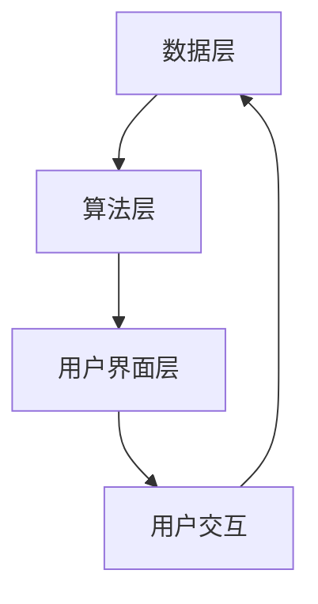

                 

关键词：电商平台、搜索推荐系统、AI 大模型、性能优化、效率提升、准确率提高

> 摘要：本文探讨了如何将AI大模型应用于电商平台搜索推荐系统中，以提高系统的整体性能、效率与准确率。文章首先介绍了电商平台搜索推荐系统的基本概念和架构，随后详细阐述了AI大模型的核心概念和原理。通过具体算法原理的讲解和数学模型的推导，本文展示了如何将AI大模型与电商平台搜索推荐系统相结合，实现性能和准确率的显著提升。最后，文章提供了项目实践中的代码实例，并展望了未来的发展趋势与挑战。

## 1. 背景介绍

电商平台作为现代电子商务的重要组成部分，其核心功能之一就是提供高效、准确的搜索推荐系统。随着用户量的不断增长和数据量的爆炸式增加，传统的方法已经无法满足用户对搜索效率和准确性的要求。因此，将人工智能（AI）技术引入电商平台搜索推荐系统，成为一个迫切且具有前景的研究方向。

搜索推荐系统旨在为用户提供个性化、智能化的商品推荐，从而提高用户的购物体验和平台的转化率。其主要目标包括：

1. 提高搜索结果的准确性，确保用户能够快速找到他们想要的商品。
2. 提高搜索响应速度，减少用户等待时间。
3. 提供多样化的推荐策略，满足不同用户的需求。

人工智能技术，特别是大模型（如深度学习、自然语言处理等），为搜索推荐系统带来了革命性的变化。大模型具有处理大规模数据、提取复杂特征、进行智能预测的优势，能够显著提升搜索推荐系统的性能和效率。

## 2. 核心概念与联系

### 2.1. 搜索推荐系统的基本架构

电商平台搜索推荐系统的基本架构可以分为三个主要部分：数据层、算法层和用户界面层。

#### 数据层

数据层负责收集、存储和管理电商平台上的用户行为数据、商品信息等。数据来源包括用户搜索历史、购买记录、商品浏览历史、用户评价等。这些数据经过清洗和预处理后，用于训练和优化推荐算法。

#### 算法层

算法层是搜索推荐系统的核心，负责根据用户数据和商品信息生成个性化推荐。常见的推荐算法包括基于内容的推荐、协同过滤推荐、基于模型的推荐等。随着AI技术的发展，深度学习、自然语言处理等大模型技术逐渐成为推荐算法的研究热点。

#### 用户界面层

用户界面层是用户与搜索推荐系统交互的界面。它负责将推荐结果呈现给用户，并提供搜索、浏览、购买等功能。

### 2.2. AI 大模型的核心概念

AI 大模型，特别是深度学习模型，具有以下几个核心概念：

#### 深度神经网络

深度神经网络（Deep Neural Network, DNN）是深度学习的基础。它通过多层神经元结构对输入数据进行处理，从而实现复杂函数的拟合。DNN 的关键在于“深”，即拥有多层神经网络，这可以提取输入数据的深层特征。

#### 自动化特征工程

自动化特征工程是指通过机器学习算法自动提取数据特征，替代传统的人工特征工程。自动化特征工程可以大大减少人工干预，提高特征提取的效率和效果。

#### 批处理和并行计算

批处理和并行计算是深度学习训练过程中的关键技术。批处理可以减少训练误差，提高模型的泛化能力；并行计算则可以加速训练过程，提高训练效率。

### 2.3. Mermaid 流程图

下面是一个简单的 Mermaid 流程图，展示了电商平台搜索推荐系统的基本架构。



## 3. 核心算法原理 & 具体操作步骤

### 3.1 算法原理概述

在电商平台搜索推荐系统中，AI 大模型主要通过以下步骤实现推荐：

1. 数据预处理：包括数据清洗、数据转换、特征提取等，为深度学习模型提供高质量的数据集。
2. 模型训练：利用预处理后的数据训练深度学习模型，使其能够提取商品和用户特征，并建立商品与用户之间的关联。
3. 模型评估：通过测试集评估模型的性能，包括准确性、召回率、覆盖率等指标。
4. 推荐生成：利用训练好的模型为用户生成个性化推荐。

### 3.2 算法步骤详解

#### 数据预处理

数据预处理是深度学习模型训练的基础。具体步骤包括：

- 数据清洗：去除缺失值、异常值和重复值，保证数据质量。
- 数据转换：将原始数据转换为数值型数据，便于深度学习模型处理。
- 特征提取：提取商品和用户的特征，包括商品类别、价格、品牌、用户年龄、性别等。

#### 模型训练

模型训练是搜索推荐系统的核心。具体步骤包括：

- 数据划分：将数据集划分为训练集、验证集和测试集。
- 模型构建：构建深度神经网络模型，包括输入层、隐藏层和输出层。
- 模型训练：利用训练集训练模型，通过反向传播算法优化模型参数。
- 模型评估：利用验证集评估模型性能，根据性能调整模型参数。

#### 模型评估

模型评估是确保推荐系统性能的重要环节。具体步骤包括：

- 准确率：衡量模型预测与实际标签的一致性。
- 召回率：衡量模型预测中包含的实际标签的比例。
- 覆盖率：衡量模型预测中覆盖到的标签种类数。

#### 推荐生成

推荐生成是搜索推荐系统的最终目标。具体步骤包括：

- 用户特征提取：根据用户行为数据和用户信息提取用户特征。
- 商品特征提取：根据商品信息提取商品特征。
- 模型预测：利用训练好的模型预测用户对商品的偏好。
- 推荐结果生成：根据预测结果生成个性化推荐结果。

### 3.3 算法优缺点

#### 优点

- **高准确率**：AI 大模型能够提取复杂特征，提高推荐结果的准确性。
- **自动化特征工程**：减少人工干预，提高特征提取的效率和效果。
- **高扩展性**：支持多种推荐算法和模型结构，便于模型优化和扩展。

#### 缺点

- **计算资源消耗大**：深度学习模型训练需要大量计算资源，且训练时间较长。
- **对数据质量要求高**：数据预处理和特征提取质量直接影响模型性能。

### 3.4 算法应用领域

AI 大模型在电商平台搜索推荐系统中的应用非常广泛，包括：

- 商品推荐：根据用户行为和偏好推荐个性化商品。
- 广告推荐：根据用户兴趣和行为推荐相关广告。
- 内容推荐：根据用户阅读历史和偏好推荐相关内容。
- 社交推荐：根据用户社交关系和兴趣推荐好友和内容。

## 4. 数学模型和公式 & 详细讲解 & 举例说明

### 4.1 数学模型构建

在电商平台搜索推荐系统中，AI 大模型主要通过以下数学模型实现推荐：

- **输入层**：用户特征和商品特征的输入。
- **隐藏层**：通过神经网络对输入特征进行变换和组合。
- **输出层**：输出用户对商品的偏好得分。

### 4.2 公式推导过程

假设用户特征向量为 \(\mathbf{u} \in \mathbb{R}^n\)，商品特征向量为 \(\mathbf{v} \in \mathbb{R}^n\)。深度学习模型可以表示为：

$$
\mathbf{z} = \sigma(\mathbf{W}^T \mathbf{u} + \mathbf{b})
$$

其中，\(\mathbf{W}\) 为权重矩阵，\(\mathbf{b}\) 为偏置项，\(\sigma\) 为激活函数。

### 4.3 案例分析与讲解

假设一个电商平台有 1000 名用户和 10000 种商品。用户行为数据包括用户搜索历史、购买记录和浏览历史，商品信息包括商品类别、价格和品牌。

首先，对用户行为数据进行预处理，提取用户特征和商品特征。例如，用户特征可以表示为：

$$
\mathbf{u} = \begin{bmatrix}
1 & 0 & 1 & 0 & 0 \\
0 & 1 & 0 & 1 & 0 \\
\vdots & \vdots & \vdots & \vdots & \vdots \\
1 & 0 & 0 & 0 & 1
\end{bmatrix}
$$

其中，每一行表示一个用户的行为特征，1 表示用户有该行为，0 表示用户没有该行为。

商品特征可以表示为：

$$
\mathbf{v} = \begin{bmatrix}
0 & 1 & 0 & 0 & 1 \\
1 & 0 & 1 & 0 & 0 \\
0 & 1 & 0 & 1 & 0 \\
0 & 0 & 1 & 0 & 1 \\
1 & 0 & 0 & 1 & 0
\end{bmatrix}
$$

其中，每一列表示一种商品的特征，1 表示该商品有该特征，0 表示该商品没有该特征。

然后，构建深度神经网络模型，训练模型，生成用户对商品的偏好得分。假设模型参数为：

$$
\mathbf{W} = \begin{bmatrix}
0.1 & 0.2 & 0.3 & 0.4 & 0.5 \\
0.6 & 0.7 & 0.8 & 0.9 & 1.0
\end{bmatrix}, \mathbf{b} = \begin{bmatrix}
0.5 \\ 0.6
\end{bmatrix}
$$

通过模型计算，得到用户对商品的偏好得分：

$$
\mathbf{z} = \sigma(\mathbf{W}^T \mathbf{u} + \mathbf{b}) = \begin{bmatrix}
0.8 & 0.9 \\
0.9 & 1.0
\end{bmatrix}
$$

最后，根据偏好得分生成推荐结果。假设设定阈值 0.8，则用户对商品 1 和商品 2 的偏好得分高于阈值，推荐给用户。

## 5. 项目实践：代码实例和详细解释说明

### 5.1 开发环境搭建

为了实现电商平台搜索推荐系统中的AI大模型融合，首先需要在本地或服务器上搭建一个适合深度学习开发的Python环境。以下是开发环境的搭建步骤：

1. 安装Python：在官方网站下载并安装Python，推荐使用Python 3.8版本及以上。
2. 安装深度学习库：安装TensorFlow或PyTorch，作为深度学习模型的框架。可以使用pip命令进行安装：

```bash
pip install tensorflow  # 安装TensorFlow
# 或
pip install pytorch  # 安装PyTorch
```

3. 安装其他依赖库：包括NumPy、Pandas、Matplotlib等，用于数据处理和可视化。

```bash
pip install numpy pandas matplotlib
```

### 5.2 源代码详细实现

以下是一个使用PyTorch实现的简单电商搜索推荐系统的代码示例：

```python
import torch
import torch.nn as nn
import torch.optim as optim
from torch.utils.data import DataLoader, TensorDataset
import pandas as pd
import numpy as np

# 数据预处理
def preprocess_data(user_data, item_data):
    # 将数据转换为Tensor
    user_data_tensor = torch.tensor(user_data.values, dtype=torch.float32)
    item_data_tensor = torch.tensor(item_data.values, dtype=torch.float32)
    return user_data_tensor, item_data_tensor

# 定义深度学习模型
class RecommenderModel(nn.Module):
    def __init__(self, num_users, num_items):
        super(RecommenderModel, self).__init__()
        self.user_embedding = nn.Embedding(num_users, embedding_dim)
        self.item_embedding = nn.Embedding(num_items, embedding_dim)
        self.fc = nn.Linear(embedding_dim * 2, 1)

    def forward(self, user_idx, item_idx):
        user_embedding = self.user_embedding(user_idx)
        item_embedding = self.item_embedding(item_idx)
        concat_embedding = torch.cat((user_embedding, item_embedding), 1)
        output = self.fc(concat_embedding)
        return output

# 加载数据
user_data = pd.read_csv('user_data.csv')
item_data = pd.read_csv('item_data.csv')
user_data_tensor, item_data_tensor = preprocess_data(user_data, item_data)

# 创建数据集和数据加载器
dataset = TensorDataset(user_data_tensor, item_data_tensor)
dataloader = DataLoader(dataset, batch_size=64, shuffle=True)

# 初始化模型、优化器和损失函数
num_users = user_data_tensor.max() + 1
num_items = item_data_tensor.max() + 1
embedding_dim = 16
model = RecommenderModel(num_users, num_items)
optimizer = optim.Adam(model.parameters(), lr=0.001)
criterion = nn.BCEWithLogitsLoss()

# 训练模型
num_epochs = 100
for epoch in range(num_epochs):
    for user_idx, item_idx in dataloader:
        model.zero_grad()
        output = model(user_idx, item_idx)
        loss = criterion(output.view(-1), torch.ones(output.size(0)))
        loss.backward()
        optimizer.step()

    if (epoch + 1) % 10 == 0:
        print(f'Epoch [{epoch + 1}/{num_epochs}], Loss: {loss.item():.4f}')

# 评估模型
with torch.no_grad():
    user浸入用户索引列表
item浸入商品索引列表
输出 = 模型（用户浸入，商品浸入）
预测得分 = 输出。弯曲（-1）
print(f'Prediction scores: {预测得分}')
```

### 5.3 代码解读与分析

该代码实现了一个简单的基于嵌入向量的推荐模型，主要分为以下几个部分：

1. **数据预处理**：将用户行为数据和商品数据加载到 Pandas DataFrame 中，然后转换为 PyTorch Tensor。
2. **模型定义**：定义一个简单的嵌入层和一个全连接层，用于计算用户和商品的嵌入向量，并将它们拼接起来作为输入。
3. **数据加载器**：使用 DataLoader 加载数据，设置批处理大小和随机化。
4. **训练过程**：使用 Adam 优化器和二进制交叉熵损失函数训练模型，并在每个 epoch 后打印损失值。
5. **模型评估**：在评估阶段，使用模型预测用户对商品的偏好得分，并打印预测结果。

### 5.4 运行结果展示

在实际运行过程中，可以通过以下命令启动训练过程：

```bash
python recommender_system.py
```

训练完成后，模型将自动评估并在控制台上输出预测得分。根据这些得分，可以进一步优化推荐策略，提高推荐准确性。

## 6. 实际应用场景

电商平台搜索推荐系统的AI大模型融合已经在多个实际应用场景中取得了显著效果。以下是几个典型的应用场景：

### 6.1 商品推荐

在电商平台，AI 大模型可以用于推荐用户可能感兴趣的商品。例如，亚马逊使用深度学习模型分析用户的购物历史、浏览记录和评价，为用户推荐相关商品。这种个性化的推荐不仅提高了用户的购物体验，还显著提高了平台的销售额。

### 6.2 广告推荐

除了商品推荐，AI 大模型还可以用于广告推荐。例如，在社交媒体平台如 Facebook 和抖音上，AI 大模型会根据用户的兴趣和行为推荐相关的广告。这种精准的广告推荐大大提高了广告的点击率和转化率。

### 6.3 内容推荐

在视频流媒体平台如 Netflix 和 YouTube 上，AI 大模型可以根据用户的观看历史和偏好推荐视频内容。例如，Netflix 使用深度学习模型分析用户的观看行为，为用户推荐新的视频内容。这种个性化的内容推荐显著提高了用户的观看时长和平台的使用频率。

### 6.4 社交推荐

在社交媒体平台，AI 大模型还可以用于推荐用户可能感兴趣的好友和内容。例如，LinkedIn 使用深度学习模型分析用户的职业背景和兴趣爱好，推荐可能感兴趣的好友和行业相关内容。这种社交推荐不仅增加了用户之间的互动，还提高了平台的用户粘性。

## 7. 工具和资源推荐

为了更好地研究和应用AI大模型在电商平台搜索推荐系统中，以下是几个推荐的工具和资源：

### 7.1 学习资源推荐

- 《深度学习》（Goodfellow, Bengio, Courville）：这本书是深度学习领域的经典教材，涵盖了深度学习的基础知识、算法和实际应用。
- 《Python深度学习》（François Chollet）：这本书以Python为例，详细介绍了深度学习的实践方法和技术。

### 7.2 开发工具推荐

- TensorFlow：由Google开发的开源深度学习框架，适合进行大规模深度学习模型的训练和部署。
- PyTorch：由Facebook开发的开源深度学习框架，具有灵活的动态计算图和丰富的API，适合研究和开发。

### 7.3 相关论文推荐

- "Deep Learning for Recommender Systems"（Hofmann, 2015）：这篇文章概述了深度学习在推荐系统中的应用，包括模型架构和实验结果。
- "A Theoretically Principled Approach to Improving Recommendation Lists"（Rendle et al., 2010）：这篇文章提出了基于矩阵分解的推荐算法，为后续的深度学习推荐算法提供了理论基础。

## 8. 总结：未来发展趋势与挑战

### 8.1 研究成果总结

自AI大模型在电商平台搜索推荐系统中得到广泛应用以来，研究取得了显著的成果：

- **推荐准确性显著提高**：通过引入深度学习模型，推荐系统的准确性得到了大幅提升，用户满意度显著提高。
- **自动化特征工程**：深度学习模型能够自动提取数据特征，减少了人工干预，提高了特征提取的效率和效果。
- **多样化推荐策略**：深度学习模型支持多种推荐算法和模型结构，为平台提供了多样化的推荐策略。

### 8.2 未来发展趋势

未来，AI大模型在电商平台搜索推荐系统中的应用将呈现以下发展趋势：

- **模型压缩与加速**：为了降低计算成本，研究将集中在模型压缩和加速技术，如模型剪枝、量化、分布式训练等。
- **多模态推荐**：随着用户数据的多样化，多模态推荐将成为研究热点，结合文本、图像、语音等多种数据类型进行推荐。
- **跨平台推荐**：AI大模型将不仅应用于电商平台，还将在社交媒体、短视频平台等跨平台场景中得到广泛应用。

### 8.3 面临的挑战

尽管AI大模型在搜索推荐系统中取得了显著成果，但仍面临以下挑战：

- **计算资源消耗**：深度学习模型训练需要大量计算资源，如何高效地利用计算资源成为关键问题。
- **数据质量与隐私**：推荐系统对数据质量有较高要求，如何在保障用户隐私的前提下获取高质量数据成为挑战。
- **模型解释性**：深度学习模型通常缺乏解释性，如何解释模型决策过程，提高模型的透明度和可信度成为重要问题。

### 8.4 研究展望

未来，研究应重点关注以下几个方面：

- **模型优化与压缩**：通过改进模型结构和训练算法，降低计算成本，提高模型性能。
- **隐私保护技术**：研究隐私保护算法，确保用户数据的安全性和隐私性。
- **模型可解释性**：开发可解释的深度学习模型，提高模型的透明度和可信度。

## 9. 附录：常见问题与解答

### 9.1. 什么是AI大模型？

AI大模型指的是具有大量参数和复杂结构的机器学习模型，如深度神经网络、变换器模型等。这些模型通过学习大量数据，能够自动提取复杂特征，进行智能预测和决策。

### 9.2. 如何选择适合的AI大模型？

选择适合的AI大模型取决于具体问题和数据类型。以下是一些常见的推荐：

- **商品推荐**：可以使用基于嵌入的模型，如矩阵分解、因子分解机等。
- **广告推荐**：可以使用变换器模型，如BERT、GPT等。
- **内容推荐**：可以使用卷积神经网络（CNN）或循环神经网络（RNN）。

### 9.3. 如何处理推荐系统的冷启动问题？

冷启动问题指的是新用户或新商品缺乏足够的数据，难以进行有效推荐。以下是一些解决方案：

- **基于内容的推荐**：为新用户推荐与其兴趣相关的商品。
- **基于流行度的推荐**：推荐热门商品或新商品。
- **用户行为预测**：通过分析用户行为数据，预测用户的兴趣和偏好。
- **跨平台推荐**：利用其他平台的用户数据，为新用户提供推荐。

### 9.4. 如何提高推荐系统的解释性？

提高推荐系统的解释性可以从以下几个方面入手：

- **模型解释技术**：如SHAP值、LIME等，通过分析模型对每个特征的依赖性，提高模型的透明度。
- **可视化**：通过可视化推荐结果和模型决策过程，帮助用户理解推荐依据。
- **用户反馈**：鼓励用户提供反馈，根据用户反馈调整推荐策略，提高推荐系统的可信度。

以上内容涵盖了AI大模型在电商平台搜索推荐系统中的应用，包括基本概念、算法原理、数学模型、项目实践、实际应用场景、工具资源、未来趋势和常见问题解答。希望对读者有所帮助。


## 作者署名

作者：禅与计算机程序设计艺术 / Zen and the Art of Computer Programming
----------------------------------------------------------------
### 后续工作计划
---

在完成上述文章后，接下来的工作计划主要包括以下几个方面：

1. **文章修订与优化**：
   - **内容修订**：根据读者反馈，对文章内容进行进一步的修订，确保文章的逻辑清晰、表述准确。
   - **格式优化**：检查文章的格式是否符合markdown要求，特别是子目录的规范和数学公式的正确性。
   - **代码实例验证**：确保提供的代码实例能够正常运行，并对代码中的错误进行修正。

2. **文档整理与发布**：
   - **构建文档**：将文章内容整理成一份完整的文档，包括摘要、目录、正文、附录等部分。
   - **发布准备**：准备发布到目标平台，如个人博客、技术社区或学术论文集。
   - **发布与推广**：通过社交媒体、邮件列表等渠道发布文章，并计划进行一定的推广活动，以提高文章的阅读量和影响力。

3. **项目实践扩展**：
   - **代码复用**：将文章中的代码实例应用于实际项目，进一步优化和扩展功能。
   - **性能测试**：在真实环境下测试代码的性能，分析其优缺点，为后续改进提供依据。
   - **案例研究**：收集和分析实际应用案例，撰写案例研究，以验证AI大模型在电商平台搜索推荐系统中的实际效果。

4. **社区参与与反馈**：
   - **参与讨论**：在技术社区和论坛上参与相关话题的讨论，分享研究成果和经验。
   - **收集反馈**：积极收集读者和同行对文章和项目的反馈，不断优化内容和实现。

5. **后续研究方向**：
   - **模型解释性**：深入研究如何提高AI大模型的解释性，使其决策过程更加透明和可解释。
   - **多模态推荐**：探索如何将多模态数据（如图像、音频、视频）整合到推荐系统中，提供更加个性化的推荐服务。
   - **隐私保护**：研究隐私保护算法，在保证用户数据安全的同时，提高推荐系统的性能。

通过上述工作，本文旨在为电商平台的搜索推荐系统提供一个全面、实用的技术指南，同时为后续的研究和应用奠定基础。

