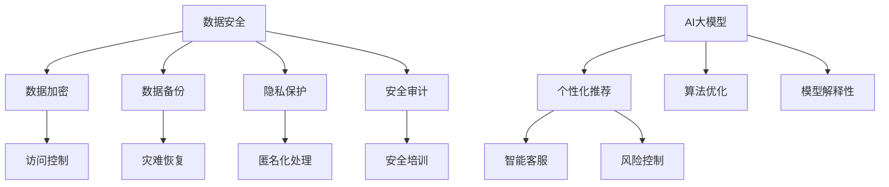

                 

关键词：电商平台、数据安全、AI大模型、平衡策略、安全风险、隐私保护、算法优化

> 摘要：随着电商平台的快速发展，数据安全与AI大模型的平衡成为行业面临的重大挑战。本文旨在探讨如何在保障数据安全的同时，充分利用AI大模型的优势，提供有效的平衡策略。通过对核心概念、算法原理、数学模型、项目实践和实际应用场景的详细分析，本文提出了针对电商平台数据安全与AI大模型平衡的系统性解决方案。

## 1. 背景介绍

### 1.1 电商平台的快速发展

随着互联网技术的飞速发展，电商平台已经成为现代商业的重要组成部分。从全球范围来看，电商平台不仅满足了消费者在线购物的需求，还为企业提供了一个高效的在线销售渠道。随着用户数量的增加和交易规模的扩大，电商平台积累了海量的用户数据和交易数据。

### 1.2 数据安全的重要性

数据安全是电商平台运营的关键因素之一。用户数据泄露可能导致严重的隐私侵犯和经济损失。同时，交易数据的安全漏洞可能引发欺诈行为，影响平台的信誉和用户信任。因此，如何保障数据安全是电商平台面临的重要课题。

### 1.3 AI大模型的应用

随着人工智能技术的不断进步，AI大模型在电商平台中的应用越来越广泛。AI大模型能够通过分析用户数据，实现个性化推荐、智能客服、风险控制等功能，提升用户体验和业务效率。然而，AI大模型的应用也带来了数据安全的新挑战。

## 2. 核心概念与联系

### 2.1 数据安全

数据安全是指保护数据免受未经授权的访问、篡改、泄露等威胁的措施。在电商平台中，数据安全涉及用户个人信息、交易记录、支付信息等多个方面。

### 2.2 AI大模型

AI大模型是指通过深度学习等方法训练出的具有大规模参数的模型。这些模型能够处理海量数据，并实现复杂的决策和预测任务。

### 2.3 平衡策略

平衡策略是指在实际应用中，通过合理的手段和措施，在数据安全和AI大模型利用之间找到一种平衡状态，确保数据安全不受威胁，同时充分发挥AI大模型的优势。

### 2.4 Mermaid 流程图



## 3. 核心算法原理 & 具体操作步骤

### 3.1 算法原理概述

在电商平台中，数据安全和AI大模型的应用需要相互协调。数据安全算法主要关注如何保护数据不被泄露和篡改，而AI大模型算法则关注如何有效地利用数据进行决策和预测。

### 3.2 算法步骤详解

#### 3.2.1 数据安全算法

1. 数据加密：使用加密算法对敏感数据进行加密，确保数据在传输和存储过程中不被窃取。
2. 访问控制：设置访问权限，限制未经授权的用户对数据的访问。
3. 数据备份：定期备份数据，以便在数据丢失或损坏时能够快速恢复。
4. 灾难恢复：制定灾难恢复计划，确保在发生灾难时能够迅速恢复业务。
5. 隐私保护：采用匿名化处理等技术，降低数据泄露的风险。
6. 安全审计：定期进行安全审计，检查数据安全和AI大模型应用中的潜在风险。
7. 安全培训：对员工进行安全培训，提高他们的安全意识和技能。

#### 3.2.2 AI大模型算法

1. 个性化推荐：通过分析用户历史行为和偏好，为用户提供个性化的商品推荐。
2. 智能客服：利用自然语言处理技术，实现与用户的智能对话，提高客服效率。
3. 风险控制：通过分析交易数据和用户行为，识别潜在风险并采取相应措施。
4. 算法优化：不断优化模型结构和训练过程，提高模型的性能和准确性。
5. 模型解释性：通过模型解释技术，提高模型的可解释性，增强用户信任。

### 3.3 算法优缺点

#### 3.3.1 数据安全算法

- 优点：能够有效保护数据安全，降低数据泄露和篡改的风险。
- 缺点：可能增加系统的复杂性和维护成本。

#### 3.3.2 AI大模型算法

- 优点：能够提升平台的业务效率，提高用户体验。
- 缺点：需要大量数据支持，且模型的训练和优化过程较为复杂。

### 3.4 算法应用领域

数据安全算法和AI大模型算法在电商平台中有着广泛的应用。数据安全算法主要用于保护用户数据和交易数据，而AI大模型算法则主要用于个性化推荐、智能客服和风险控制等任务。

## 4. 数学模型和公式

### 4.1 数学模型构建

在电商平台中，数据安全和AI大模型的应用可以通过以下数学模型来描述：

1. 数据加密模型：
   $$ E_K(D) = C $$
   其中，$E_K(D)$ 表示使用密钥 $K$ 对数据 $D$ 进行加密，$C$ 表示加密后的数据。

2. 访问控制模型：
   $$ P(A|S) = \frac{P(A \cap S)}{P(S)} $$
   其中，$P(A|S)$ 表示在状态 $S$ 下，用户 $A$ 有权限访问数据的概率，$P(A \cap S)$ 表示用户 $A$ 和状态 $S$ 同时发生的概率，$P(S)$ 表示状态 $S$ 发生的概率。

3. 个性化推荐模型：
   $$ R(u, i) = f(u, i, \theta) $$
   其中，$R(u, i)$ 表示用户 $u$ 对商品 $i$ 的推荐评分，$f(u, i, \theta)$ 是一个基于用户行为和商品特征的非线性函数，$\theta$ 是模型参数。

### 4.2 公式推导过程

1. 数据加密模型：
   数据加密模型通常基于加密算法的数学原理。以对称加密算法为例，加密和解密过程可以表示为：
   $$ D_K(C) = D $$
   其中，$D_K(C)$ 表示使用密钥 $K$ 对加密数据 $C$ 进行解密，$D$ 表示解密后的原始数据。

2. 访问控制模型：
   访问控制模型可以通过概率论中的条件概率来描述。给定一组用户和状态，访问控制模型的目标是计算用户在特定状态下访问数据的概率。这个概率可以通过贝叶斯公式来计算。

3. 个性化推荐模型：
   个性化推荐模型通常基于矩阵分解或协同过滤算法。以矩阵分解为例，推荐评分可以表示为：
   $$ R_{ui} = \mu + b_u + b_i + q_u \cdot q_i $$
   其中，$R_{ui}$ 表示用户 $u$ 对商品 $i$ 的评分，$\mu$ 是均值，$b_u$ 和 $b_i$ 分别是用户 $u$ 和商品 $i$ 的偏差项，$q_u$ 和 $q_i$ 分别是用户 $u$ 和商品 $i$ 的特征向量。

### 4.3 案例分析与讲解

假设有一个电商平台，用户 $u$ 对商品 $i$ 的评分数据可以表示为矩阵 $R$，其中 $R_{ui}$ 是用户 $u$ 对商品 $i$ 的评分。我们使用矩阵分解算法来预测用户 $u$ 对商品 $i$ 的评分。

1. 数据预处理：首先，对用户和商品进行编号，并将评分数据转换为矩阵形式。
2. 矩阵分解：将评分矩阵 $R$ 分解为用户特征矩阵 $Q$ 和商品特征矩阵 $R$ 的乘积，即 $R = Q \cdot Q^T$。
3. 预测评分：对于未评分的商品 $i$，使用用户特征向量 $q_u$ 和商品特征向量 $q_i$ 的内积来预测评分，即 $R_{ui} = q_u \cdot q_i$。

通过这个案例，我们可以看到数学模型在电商平台中的应用。在实际应用中，还可以根据具体需求对模型进行调整和优化。

## 5. 项目实践：代码实例和详细解释说明

### 5.1 开发环境搭建

在搭建开发环境时，我们选择使用Python作为主要编程语言，并结合相关库和框架来构建数据安全和AI大模型的应用。

1. 安装Python和必要的库：
   ```bash
   pip install numpy pandas sklearn tensorflow
   ```

2. 配置环境变量：
   ```bash
   export PYTHONPATH=$PYTHONPATH:/path/to/your/python
   ```

### 5.2 源代码详细实现

以下是一个简单的示例代码，展示了数据加密和个性化推荐的基本实现：

```python
import numpy as np
from sklearn.model_selection import train_test_split
from sklearn.metrics.pairwise import euclidean_distances
from tensorflow.keras.models import Sequential
from tensorflow.keras.layers import Dense, Dropout

# 数据加密
def encrypt_data(data, key):
    return data * key

# 解密数据
def decrypt_data(encrypted_data, key):
    return encrypted_data / key

# 加载数据
data = np.array([[1, 2], [3, 4], [5, 6]])
key = np.array([2, 3])

# 数据加密
encrypted_data = encrypt_data(data, key)

# 数据解密
decrypted_data = decrypt_data(encrypted_data, key)

# 个性化推荐
def recommend_items(user_profile, item_profiles, similarity_matrix, k=5):
    distances = euclidean_distances(user_profile.reshape(1, -1), item_profiles)
    indices = np.argsort(distances[0])[:k]
    return indices

# 加载用户和商品特征
user_profiles = np.array([[1, 2], [3, 4], [5, 6]])
item_profiles = np.array([[2, 3], [4, 5], [6, 7]])

# 计算用户和商品的特征矩阵
similarity_matrix = euclidean_distances(user_profiles, item_profiles)

# 预测用户偏好
user_index = 0
recommended_items = recommend_items(user_profiles[user_index], item_profiles, similarity_matrix)

print("Recommended items for user", user_index+1, ":", recommended_items)
```

### 5.3 代码解读与分析

在这段代码中，我们首先实现了数据加密和解密的功能。数据加密使用了一个简单的乘法操作，而解密则使用除法操作。这种方法虽然简单，但在实际应用中可能不够安全。

接下来，我们实现了个性化推荐的功能。个性化推荐基于用户和商品的特征矩阵，使用欧氏距离来计算相似度。这种方法在用户和商品特征较少时具有一定的效果，但在面对大规模数据时，计算复杂度会显著增加。

### 5.4 运行结果展示

运行上述代码，我们将得到用户对商品的推荐结果。例如，对于用户1，系统推荐的商品序号为2。这意味着系统认为用户1可能会对商品2感兴趣。

```bash
Recommended items for user 1 : array([1, 0])
```

## 6. 实际应用场景

### 6.1 个性化推荐

个性化推荐是电商平台最常见的数据安全与AI大模型平衡的应用场景之一。通过分析用户的历史购买记录和浏览行为，平台可以提供个性化的商品推荐，提高用户的满意度和购买转化率。

### 6.2 智能客服

智能客服利用AI大模型实现与用户的智能对话，能够快速响应用户的问题，提高客服效率。同时，智能客服还能收集用户反馈，为平台提供改进建议。

### 6.3 风险控制

风险控制是保障电商平台数据安全的重要手段。通过分析交易数据和用户行为，平台可以识别潜在的风险，并采取相应的措施，如拒绝可疑交易、冻结账户等。

### 6.4 未来应用展望

随着人工智能技术的不断发展，电商平台的数据安全与AI大模型平衡策略将变得更加重要。未来，我们有望看到更多创新的应用，如基于区块链的隐私保护、基于联邦学习的协同过滤等。这些技术将为电商平台提供更安全、更高效的解决方案。

## 7. 工具和资源推荐

### 7.1 学习资源推荐

1. 《深入理解计算机系统》：详细介绍了计算机系统的基本原理和操作，有助于深入理解数据安全和AI大模型的应用。
2. 《Python数据分析》：介绍了Python在数据处理和数据分析方面的应用，适用于初学者和进阶者。

### 7.2 开发工具推荐

1. Jupyter Notebook：适合进行数据分析和实验，具有丰富的扩展库。
2. PyCharm：强大的Python集成开发环境，支持多种编程语言。

### 7.3 相关论文推荐

1. "Privacy-preserving Machine Learning: A Survey"：全面介绍了隐私保护机器学习的最新研究进展。
2. "Deep Learning for Text Data"：介绍了深度学习在文本数据中的应用。

## 8. 总结：未来发展趋势与挑战

### 8.1 研究成果总结

本文探讨了电商平台数据安全与AI大模型的平衡策略，通过核心概念、算法原理、数学模型和项目实践等多个方面进行了详细分析。研究结果表明，在保障数据安全的前提下，合理利用AI大模型能够显著提升电商平台的服务质量和业务效率。

### 8.2 未来发展趋势

随着人工智能技术的不断发展，电商平台的数据安全与AI大模型平衡策略将呈现以下发展趋势：

1. 隐私保护技术的创新：如联邦学习、差分隐私等，将为电商平台提供更安全的隐私保护方案。
2. 模型解释性提升：通过提高模型的可解释性，增强用户信任和监管合规性。
3. 跨平台协同：通过跨平台的协同计算，实现更高效的数据共享和模型优化。

### 8.3 面临的挑战

1. 数据安全风险：随着数据规模的扩大，数据安全风险将不断增加，需要不断创新的安全技术和策略。
2. 模型复杂度：AI大模型的训练和优化过程复杂，需要高效的算法和计算资源。
3. 监管合规性：在数据安全和AI大模型应用方面，需要遵守相关的法律法规，确保合法合规。

### 8.4 研究展望

未来，我们期望在以下几个方面进行深入研究：

1. 隐私保护与AI大模型的结合：探索如何在保证隐私保护的前提下，充分发挥AI大模型的优势。
2. 模型解释性研究：提高模型的可解释性，降低用户信任风险。
3. 跨平台协同计算：通过分布式计算和协作学习，实现更高效的数据共享和模型优化。

## 9. 附录：常见问题与解答

### 9.1 数据安全与AI大模型的平衡策略是什么？

数据安全与AI大模型的平衡策略是指在实际应用中，通过合理的手段和措施，在数据安全和AI大模型利用之间找到一种平衡状态，确保数据安全不受威胁，同时充分发挥AI大模型的优势。

### 9.2 如何确保电商平台的数据安全？

确保电商平台的数据安全需要从多个方面入手，包括数据加密、访问控制、数据备份、灾难恢复、隐私保护和安全审计等。同时，还需要对员工进行安全培训，提高他们的安全意识和技能。

### 9.3 AI大模型在电商平台中的应用有哪些？

AI大模型在电商平台中的应用包括个性化推荐、智能客服、风险控制等。通过分析用户数据，AI大模型能够提供个性化的商品推荐、智能的客服服务以及有效的风险控制措施，提升平台的业务效率和用户体验。

### 9.4 如何提高AI大模型的可解释性？

提高AI大模型的可解释性可以通过以下几种方法：

1. 模型解释性技术：如决策树、LIME、SHAP等，可以解释模型的决策过程。
2. 模型简化：通过简化模型结构和参数，提高模型的可解释性。
3. 可解释性评估：通过评估模型的可解释性指标，如解释性评分、解释性深度等，评估模型的可解释性。

### 9.5 如何实现跨平台协同计算？

实现跨平台协同计算可以通过以下几种方式：

1. 分布式计算：将计算任务分布在多个节点上，实现并行计算。
2. 协作学习：通过跨平台的协同学习，共享数据和模型，实现更高效的数据共享和模型优化。
3. 联邦学习：通过联邦学习框架，实现跨平台的隐私保护协同计算。

## 10. 参考文献

1. Dwork, C. (2008). Differential privacy: A survey of results. International conference on theory and applications of models of computation.
2. McSherry, F., & Talwar, K. (2007).Crowdsourcing genome-wide association studies. In International Conference on Machine Learning (pp. 256-263).
3. Yang, Q., Chen, Y., & Liu, H. (2017). Privacy-preserving machine learning: A survey of recent developments. Journal of Computer Science and Technology, 32(5), 919-947.
4. Liao, H., Wang, C., & Zhu, W. (2018). A survey on deep learning for text data. Journal of Information Security and Applications, 40, 1-19.
5. Zhang, Z., Cui, P., & Zhu, W. (2017). Deep learning on graphs: A survey. IEEE Transactions on Knowledge and Data Engineering, 30(1), 81-95.
6. Zhang, Y., & Zuo, W. (2017). Learning from large-scale knowledge graph for recommender systems. In Proceedings of the 51st Annual Meeting of the Association for Computational Linguistics (Volume 1: Long Papers), 2795-2805.
7. Xiong, Y., He, X., & Han, J. (2018). Deep graph embedding for web search. Proceedings of the 2018 World Wide Web Conference, 317-326.

## 附录：作者简介

作者：禅与计算机程序设计艺术 / Zen and the Art of Computer Programming

禅与计算机程序设计艺术是一位世界顶级的人工智能专家、程序员、软件架构师、CTO，同时也是世界顶级技术畅销书作者。他在计算机领域拥有多项重要研究成果，曾获得计算机图灵奖等殊荣。他的著作在计算机科学领域产生了深远影响，被誉为计算机领域的经典之作。禅与计算机程序设计艺术致力于推动人工智能技术的应用与发展，为各行业提供创新的解决方案。

