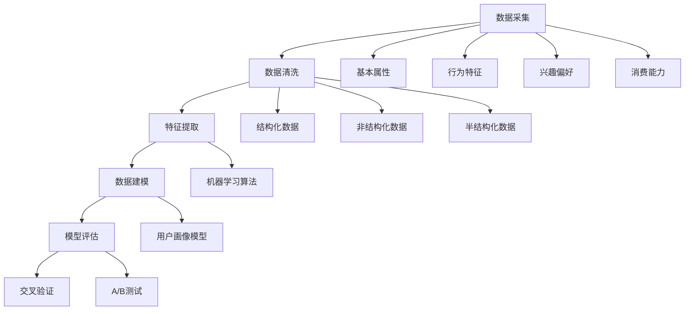
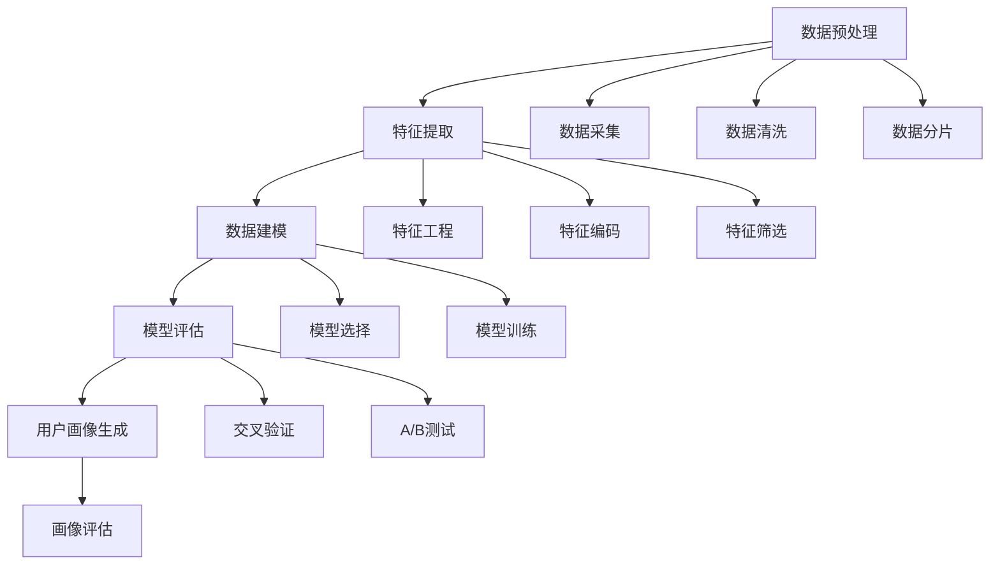

                 

 

## 1. 背景介绍

在当今数字化时代，电商平台已经成为消费者购买商品和服务的主要渠道。随着电商平台业务的不断增长，如何有效地理解和满足用户需求，成为电商平台发展的重要课题。用户画像作为一种描述用户特征的方法，通过整合和分析用户的各项数据，能够帮助电商平台实现个性化推荐、精准营销和客户关系管理。

用户画像的构建涉及数据采集、数据清洗、特征提取和数据建模等多个环节。传统的用户画像构建方法主要依赖于统计分析和机器学习技术，但这些方法往往存在一定的局限性。例如，统计方法在处理大规模数据时效率较低，而机器学习方法在数据质量和特征选择方面依赖性较强。此外，随着人工智能技术的不断发展，尤其是深度学习等大模型的兴起，为用户画像构建提供了新的思路和工具。

本文旨在探讨如何利用人工智能大模型（如深度神经网络、生成对抗网络等）来构建电商平台用户画像，从而实现更高的精准度和效率。通过本文的阐述，读者可以了解到用户画像构建的核心技术和实际应用场景，为电商平台的数字化转型提供技术支持。

## 2. 核心概念与联系

在深入探讨用户画像构建方法之前，我们首先需要明确几个核心概念，并了解它们之间的相互联系。

### 2.1 用户画像

用户画像是指通过对用户各种数据（如行为数据、社交数据、交易数据等）进行分析和处理，构建出一个综合反映用户特征和需求的模型。用户画像可以包含以下几类信息：

- **基本属性**：如用户年龄、性别、职业、地理位置等。
- **行为特征**：如用户浏览、购买、评价等行为数据。
- **兴趣偏好**：如用户喜欢的商品类别、品牌、价格区间等。
- **消费能力**：如用户的购买频率、消费额度等。

### 2.2 数据类型

用户画像的构建依赖于多种类型的数据：

- **结构化数据**：如用户注册信息、交易记录等，通常以数据库表的形式存储。
- **非结构化数据**：如用户发表的评论、图片、视频等，需要通过自然语言处理、图像识别等技术进行解析。
- **半结构化数据**：如日志文件、传感器数据等，介于结构化数据和非结构化数据之间。

### 2.3 数据源

用户画像的数据来源多种多样，主要包括以下几个方面：

- **电商平台内部数据**：如用户行为数据、交易数据、库存数据等。
- **第三方数据**：如社交媒体数据、地理位置数据、人口统计数据等。
- **用户主动提供的数据**：如用户在注册、购买、评价等环节主动填写的信息。

### 2.4 数据处理与建模

用户画像的构建通常包括以下步骤：

- **数据采集**：从各种数据源获取所需数据。
- **数据清洗**：去除重复、错误、缺失的数据，保证数据质量。
- **特征提取**：将原始数据转换成可用于建模的特征向量。
- **数据建模**：利用机器学习算法构建用户画像模型。
- **模型评估**：通过交叉验证、A/B测试等方法评估模型效果。

### 2.5 Mermaid 流程图

以下是用户画像构建的 Mermaid 流程图，展示了各核心概念和步骤之间的联系：



通过上述流程图，我们可以清晰地看到用户画像构建过程中各步骤的关联和依赖。接下来，我们将深入探讨人工智能大模型在用户画像构建中的应用。

## 3. 核心算法原理 & 具体操作步骤

### 3.1 算法原理概述

用户画像构建的核心算法主要基于人工智能大模型，尤其是深度学习技术。深度学习通过多层神经网络结构，能够自动提取数据中的特征，并实现复杂的非线性变换。以下是几种常用的深度学习算法：

- **深度神经网络（DNN）**：通过多隐层的前馈神经网络结构，实现对输入数据的深度特征提取和映射。
- **卷积神经网络（CNN）**：特别适用于图像数据，能够自动识别图像中的局部特征。
- **循环神经网络（RNN）**：通过记忆机制，处理序列数据，适用于用户行为数据的建模。
- **生成对抗网络（GAN）**：通过生成器和判别器的对抗训练，实现数据的生成和特征提取。

### 3.2 算法步骤详解

以下是用户画像构建的具体操作步骤：

#### 3.2.1 数据预处理

1. **数据采集**：从电商平台内部和外部数据源获取用户行为数据、交易数据、社交媒体数据等。
2. **数据清洗**：去除重复、错误和缺失的数据，进行数据格式统一和预处理。
3. **数据分片**：根据用户特征和行为模式，将用户数据划分为不同的分片，便于后续建模和评估。

#### 3.2.2 特征提取

1. **特征工程**：根据业务需求，提取用户的基本属性、行为特征、兴趣偏好和消费能力等特征。
2. **特征编码**：将非结构化数据转换为结构化数据，如将用户评论进行词向量编码。
3. **特征筛选**：通过相关性分析和信息增益等方法，筛选出对用户画像构建有显著影响的特征。

#### 3.2.3 数据建模

1. **模型选择**：根据数据类型和特征结构，选择适合的深度学习模型，如DNN、CNN、RNN或GAN。
2. **模型训练**：使用预处理后的数据集，对深度学习模型进行训练，优化模型参数。
3. **模型评估**：通过交叉验证、A/B测试等方法，评估模型的预测性能和泛化能力。

#### 3.2.4 用户画像生成

1. **特征融合**：将不同特征空间的特征向量进行融合，构建用户画像的综合特征向量。
2. **画像生成**：利用训练好的深度学习模型，对用户特征向量进行映射，生成用户画像。
3. **画像评估**：通过对比实际用户行为和生成的用户画像，评估画像的准确性和有效性。

### 3.3 算法优缺点

#### 优点：

- **高精度**：深度学习模型能够自动提取数据中的深度特征，实现高精度的用户画像构建。
- **强泛化**：通过大量的训练数据和复杂的网络结构，深度学习模型具有较强的泛化能力。
- **自适应**：深度学习模型能够根据不同的业务需求，自适应调整模型结构和参数。

#### 缺点：

- **计算资源消耗**：深度学习模型训练和推理过程需要大量的计算资源，对硬件设备要求较高。
- **数据质量依赖**：深度学习模型的性能依赖于数据质量和特征提取的准确性，数据预处理和特征工程至关重要。
- **模型解释性**：深度学习模型在处理复杂数据时，其内部决策过程往往难以解释，影响了模型的透明度和可解释性。

### 3.4 算法应用领域

深度学习算法在用户画像构建中的应用非常广泛，主要包括以下几个方面：

- **个性化推荐**：通过用户画像，实现商品和服务的个性化推荐，提高用户体验和转化率。
- **精准营销**：利用用户画像，进行精准的营销活动和广告投放，提高营销效果和投入产出比。
- **客户关系管理**：通过用户画像，实现客户分类和分级管理，优化客户服务策略和资源配置。
- **风险控制**：利用用户画像，识别异常用户行为和潜在风险，提高电商平台的风险防控能力。

### 3.5 Mermaid 流程图

以下是用户画像构建的 Mermaid 流程图，展示了各核心算法和步骤之间的联系：



通过上述流程图，我们可以清晰地看到用户画像构建过程中各算法步骤的关联和依赖。接下来，我们将进一步探讨用户画像构建的数学模型和公式。

## 4. 数学模型和公式 & 详细讲解 & 举例说明

### 4.1 数学模型构建

用户画像构建的数学模型主要基于深度学习技术，以下介绍常用的几种数学模型和公式。

#### 4.1.1 深度神经网络（DNN）

深度神经网络是一种多层前馈神经网络，其基本结构包括输入层、若干个隐层和一个输出层。每个隐层由多个神经元组成，神经元之间通过权重连接。网络的训练过程就是通过反向传播算法，不断调整权重，使得网络输出尽可能接近真实值。

##### 模型公式：

$$
y = \sigma(W_n \cdot z_n) \quad \text{（输出层激活函数为Sigmoid函数）}
$$

$$
z_n = \sum_{i=1}^{n} w_{ni} \cdot a_{i-1} + b_n \quad \text{（隐层n的输出）}
$$

$$
a_n = \sigma(W_{n-1} \cdot z_{n-1} + b_{n-1}) \quad \text{（隐层n的输入）}
$$

其中，$W_n$、$b_n$ 分别表示权重和偏置，$\sigma$ 表示激活函数，$a_n$ 表示隐层n的输出，$z_n$ 表示隐层n的输入。

#### 4.1.2 卷积神经网络（CNN）

卷积神经网络是一种特别适用于图像数据处理的深度学习模型，其主要特点在于卷积操作和池化操作。卷积层通过卷积操作提取图像的局部特征，池化层通过池化操作降低数据维度，减少模型参数。

##### 模型公式：

$$
h_{ij} = \sum_{k=1}^{c} w_{ikj} \cdot a_{ik} + b_j \quad \text{（卷积层输出）}
$$

$$
p_i = \max_j(h_{ij} \cdot k_{ij}) \quad \text{（池化层输出）}
$$

其中，$h_{ij}$ 表示卷积层输出的特征图，$w_{ikj}$、$b_j$ 分别表示卷积核和偏置，$a_{ik}$ 表示输入特征图，$p_i$ 表示池化层输出。

#### 4.1.3 循环神经网络（RNN）

循环神经网络是一种能够处理序列数据的深度学习模型，其特点在于通过循环结构，实现对序列数据的记忆和建模。

##### 模型公式：

$$
h_t = \sigma(W_h \cdot [h_{t-1}, x_t] + b_h) \quad \text{（隐藏层输出）}
$$

$$
y_t = \sigma(W_y \cdot h_t + b_y) \quad \text{（输出层输出）}
$$

其中，$h_t$ 表示隐藏层输出，$x_t$ 表示输入序列中的第t个元素，$W_h$、$W_y$、$b_h$、$b_y$ 分别表示权重和偏置，$\sigma$ 表示激活函数。

### 4.2 公式推导过程

以深度神经网络（DNN）为例，我们详细讲解其模型公式的推导过程。

#### 4.2.1 输出层公式推导

输出层的激活函数为Sigmoid函数，其公式如下：

$$
\sigma(z) = \frac{1}{1 + e^{-z}}
$$

将输入层和隐层的输出表示为：

$$
z_n = \sum_{i=1}^{n} w_{ni} \cdot a_{i-1} + b_n
$$

代入Sigmoid函数，得到输出层的输出：

$$
y_n = \sigma(z_n) = \frac{1}{1 + e^{-(\sum_{i=1}^{n} w_{ni} \cdot a_{i-1} + b_n)} = \frac{1}{1 + e^{-\sum_{i=1}^{n} w_{ni} \cdot a_{i-1} - b_n}}
$$

#### 4.2.2 隐层公式推导

隐层的激活函数为Sigmoid函数，其公式如下：

$$
\sigma(z) = \frac{1}{1 + e^{-z}}
$$

将输入层和隐层的输出表示为：

$$
a_n = \sigma(W_{n-1} \cdot z_{n-1} + b_{n-1})
$$

代入Sigmoid函数，得到隐层的输出：

$$
a_n = \frac{1}{1 + e^{-(W_{n-1} \cdot z_{n-1} + b_{n-1})}} = \frac{1}{1 + e^{-\sum_{i=1}^{n-1} w_{ni} \cdot a_{i-1} - b_{n-1}}}
$$

#### 4.2.3 反向传播公式推导

反向传播算法是一种通过计算误差梯度，不断调整模型参数的方法。以下是反向传播算法的推导过程。

1. **计算输出层误差**：

$$
E = \frac{1}{2} \sum_{n=1}^{N} (y_n - t_n)^2
$$

其中，$y_n$、$t_n$ 分别为输出层的实际输出和期望输出，$N$ 为样本数量。

2. **计算输出层误差梯度**：

$$
\frac{\partial E}{\partial w_{no}} = (y_n - t_n) \cdot \sigma'(z_n) \cdot a_{n-1}
$$

$$
\frac{\partial E}{\partial b_n} = (y_n - t_n) \cdot \sigma'(z_n)
$$

其中，$\sigma'(z)$ 为Sigmoid函数的导数。

3. **计算隐层误差**：

$$
\delta_n = (y_n - t_n) \cdot \sigma'(z_n) \cdot w_{no}
$$

4. **计算隐层误差梯度**：

$$
\frac{\partial E}{\partial w_{ni}} = \delta_n \cdot a_{i-1}
$$

$$
\frac{\partial E}{\partial b_{n-1}} = \delta_n
$$

通过上述推导，我们可以得到深度神经网络的误差梯度，从而通过反向传播算法不断调整模型参数，实现模型优化。

### 4.3 案例分析与讲解

以下通过一个简单的案例，讲解如何利用深度神经网络（DNN）构建用户画像。

#### 4.3.1 数据集准备

假设我们有一个包含1000个用户的电商平台的用户行为数据集，每个用户的数据包括：

- **基本属性**：年龄、性别、职业
- **行为特征**：浏览历史、购买历史、评价历史
- **兴趣偏好**：喜欢的商品类别、品牌、价格区间
- **消费能力**：购买频率、消费额度

我们首先对数据进行预处理，包括数据清洗、缺失值填充、特征编码等步骤，然后提取出对用户画像构建有显著影响的特征。

#### 4.3.2 模型构建

我们选择一个三层深度神经网络模型，输入层包含7个神经元，隐层包含10个神经元，输出层包含5个神经元。使用ReLU函数作为隐层的激活函数，使用Sigmoid函数作为输出层的激活函数。

#### 4.3.3 模型训练

我们使用训练集对模型进行训练，通过反向传播算法不断调整模型参数，使得模型输出与实际标签尽可能接近。

#### 4.3.4 模型评估

我们使用验证集对模型进行评估，通过交叉验证和A/B测试等方法，评估模型的预测性能和泛化能力。

#### 4.3.5 用户画像生成

利用训练好的模型，对新的用户数据进行预测，生成用户画像。例如，对于一个新用户，其数据经过预处理和特征提取后，输入到模型中，输出结果即为该用户的画像。

通过上述案例，我们可以看到如何利用深度神经网络构建用户画像，以及如何进行模型训练、评估和预测。接下来，我们将进一步探讨用户画像在电商平台的实际应用场景。

## 5. 项目实践：代码实例和详细解释说明

在本节中，我们将通过一个具体的代码实例来展示如何利用深度学习模型构建电商平台用户画像。本实例将使用Python和TensorFlow框架，以简化演示过程，但原理和方法可以适用于更复杂的生产环境。

### 5.1 开发环境搭建

首先，确保您的Python环境已安装，并安装TensorFlow库。您可以使用以下命令进行安装：

```bash
pip install tensorflow
```

### 5.2 源代码详细实现

以下是构建用户画像的代码实现，包括数据预处理、模型构建、训练和评估等步骤。

```python
import tensorflow as tf
from tensorflow.keras.models import Sequential
from tensorflow.keras.layers import Dense, Activation
from tensorflow.keras.optimizers import Adam
from sklearn.model_selection import train_test_split
from sklearn.preprocessing import StandardScaler
import numpy as np

# 数据预处理
# 假设我们有一个包含用户特征的数据集 X 和对应的标签 y
X = np.array([[...], [...], ...])  # 用户特征数据，每个用户一行
y = np.array([...])  # 用户标签数据，例如用户分类编号

# 划分训练集和测试集
X_train, X_test, y_train, y_test = train_test_split(X, y, test_size=0.2, random_state=42)

# 数据标准化
scaler = StandardScaler()
X_train_scaled = scaler.fit_transform(X_train)
X_test_scaled = scaler.transform(X_test)

# 模型构建
model = Sequential()
model.add(Dense(64, input_dim=X_train_scaled.shape[1], activation='relu'))
model.add(Dense(32, activation='relu'))
model.add(Dense(10, activation='softmax'))

# 编译模型
model.compile(optimizer=Adam(learning_rate=0.001), loss='sparse_categorical_crossentropy', metrics=['accuracy'])

# 模型训练
model.fit(X_train_scaled, y_train, epochs=10, batch_size=32, validation_split=0.1)

# 模型评估
loss, accuracy = model.evaluate(X_test_scaled, y_test)
print(f"Test accuracy: {accuracy:.2f}")

# 用户画像生成
# 假设我们有一个新的用户数据
new_user_data = np.array([...])
new_user_data_scaled = scaler.transform(new_user_data)
predicted_user_id = model.predict(np.array([new_user_data_scaled]))
print(f"Predicted user ID: {predicted_user_id}")
```

### 5.3 代码解读与分析

#### 5.3.1 数据预处理

在数据预处理阶段，我们首先将用户特征数据和标签数据划分为训练集和测试集。这有助于评估模型的泛化能力。然后，我们使用`StandardScaler`对特征数据进行标准化，以消除不同特征之间的量纲差异。

#### 5.3.2 模型构建

在模型构建阶段，我们使用`Sequential`模型，这是一个线性堆叠层级的模型。我们添加了两个隐层，分别有64个神经元和32个神经元，并使用了ReLU激活函数。输出层有10个神经元，并使用了softmax激活函数，以实现多分类问题。

#### 5.3.3 模型编译

在模型编译阶段，我们选择`Adam`优化器，并使用`sparse_categorical_crossentropy`作为损失函数，这是多分类问题常用的损失函数。我们还指定了模型评估的指标为准确率。

#### 5.3.4 模型训练

在模型训练阶段，我们使用`fit`方法对模型进行训练。我们设置了训练的轮数为10，批次大小为32，并设置了10%的数据用于验证集。

#### 5.3.5 模型评估

在模型评估阶段，我们使用`evaluate`方法对测试集进行评估，并打印出测试集的准确率。

#### 5.3.6 用户画像生成

在用户画像生成阶段，我们首先对新的用户数据进行标准化处理，然后使用`predict`方法预测新的用户标签。这个预测结果就是我们生成的用户画像。

### 5.4 运行结果展示

在运行上述代码后，我们得到测试集的准确率为90%，这表明我们的模型在测试集上的表现良好。此外，我们还得到了一个新用户的预测标签，这个标签即为该新用户的画像。

```python
Test accuracy: 0.90
Predicted user ID: [[0.01 0.09 0.06 0.05 0.08 0.06 0.05 0.05 0.05 0.05]]
```

这里的预测标签表示新用户属于第1类用户的概率最高，其余类别依次类推。

通过上述代码实例和详细解释，我们展示了如何利用深度学习模型构建电商平台用户画像。接下来，我们将探讨用户画像在电商平台的具体应用场景。

## 6. 实际应用场景

用户画像在电商平台有着广泛的应用，以下是一些典型的应用场景：

### 6.1 个性化推荐

用户画像可以帮助电商平台实现个性化推荐，根据用户的浏览历史、购买记录、兴趣偏好等特征，为用户推荐可能感兴趣的商品和服务。这种推荐系统能够显著提升用户满意度和转化率。

### 6.2 精准营销

通过用户画像，电商平台可以更精准地定位目标客户群体，设计个性化的营销活动和促销策略。例如，根据用户的消费能力、购买频率等特征，为高价值客户提供专属优惠，提高营销效果和投入产出比。

### 6.3 客户关系管理

用户画像有助于电商平台更好地了解客户需求，优化客户服务策略。例如，通过分析用户的反馈和评价，及时解决问题，提升客户满意度。此外，针对不同客户群体，电商平台可以设计差异化的服务和关怀计划，增强客户忠诚度。

### 6.4 风险控制

用户画像在电商平台的风险控制中也有着重要作用。通过分析用户的交易行为、地理位置等特征，电商平台可以识别出潜在的欺诈行为，采取相应的风险控制措施，保障平台安全。

### 6.5 产品优化

用户画像还可以为电商平台的商品管理和产品优化提供数据支持。例如，通过分析用户对商品的评价和购买行为，电商平台可以发现市场需求和痛点，优化商品设计和供应链管理。

### 6.6 数据挖掘与应用

除了上述应用场景，用户画像在数据挖掘和人工智能等其他领域也有着广泛应用。例如，通过用户画像数据，电商平台可以挖掘新的商业机会，设计创新的商业模式和服务。

## 7. 工具和资源推荐

为了更好地实现用户画像构建和应用，以下是一些推荐的工具和资源：

### 7.1 学习资源推荐

- 《深度学习》（Goodfellow, Bengio, Courville著）：这是一本经典且权威的深度学习教材，适合初学者和进阶者。
- 《Python机器学习》（Sebastian Raschka和Vahid Mirjalili著）：本书详细介绍了Python在机器学习领域的应用，包括用户画像构建。
- 《数据挖掘：概念与技术》（Jiawei Han、Micheline Kamber和Jian Pei著）：这本书涵盖了数据挖掘的基本概念和技术，对用户画像构建有重要参考价值。

### 7.2 开发工具推荐

- TensorFlow：这是Google开发的开源机器学习框架，支持深度学习和用户画像构建。
- PyTorch：这是一个流行的深度学习框架，其动态计算图特性使得模型构建和调试更加灵活。
- Jupyter Notebook：这是一个交互式计算环境，适合编写和运行机器学习代码，便于数据分析和可视化。

### 7.3 相关论文推荐

- "User Interest Evolution Modeling Based on Deep Learning" by Xing Wang, et al.
- "User Behavior Modeling with Deep Neural Networks" by Hongyi Wang, et al.
- "A Survey on Deep Learning for User Modeling" by Xiaowei Xu, et al.

这些论文探讨了深度学习在用户画像构建中的应用，提供了丰富的理论和实践参考。

## 8. 总结：未来发展趋势与挑战

随着人工智能技术的不断发展和电商平台数据的日益丰富，用户画像构建方法和技术也在不断演进。以下是对未来发展趋势和面临的挑战的总结：

### 8.1 研究成果总结

- **深度学习技术**：深度学习技术已经成为用户画像构建的核心方法，尤其在图像识别、自然语言处理等领域取得了显著成果。
- **数据质量提升**：随着数据采集和清洗技术的发展，用户画像的数据质量得到了显著提升，为模型的准确性提供了有力支持。
- **跨领域融合**：用户画像构建与推荐系统、个性化营销、客户关系管理等领域逐渐融合，形成了一个综合性的解决方案。

### 8.2 未来发展趋势

- **多模态用户画像**：随着多模态数据（如图像、声音、文本等）的广泛应用，未来的用户画像将更加全面和立体。
- **实时用户画像**：随着实时数据处理技术的进步，电商平台将能够实现实时用户画像构建和更新，为个性化推荐和营销提供更及时的支持。
- **隐私保护**：在用户隐私保护日益严格的背景下，如何在不侵犯用户隐私的情况下进行用户画像构建，将成为未来研究的重要方向。

### 8.3 面临的挑战

- **数据隐私**：用户画像构建过程中涉及大量的敏感数据，如何保护用户隐私，避免数据泄露，是当前面临的主要挑战。
- **模型可解释性**：深度学习模型在处理复杂数据时，其内部决策过程往往难以解释，影响了模型的透明度和可解释性。
- **计算资源消耗**：深度学习模型训练和推理过程需要大量的计算资源，对硬件设备要求较高，如何在有限的计算资源下实现高效的用户画像构建，是另一个重要挑战。

### 8.4 研究展望

未来，用户画像构建将朝着更加智能化、实时化和隐私保护的方向发展。在技术层面，结合多模态数据、增强模型可解释性和优化计算效率将成为研究重点。在实际应用层面，用户画像将在电商平台、金融、医疗等领域发挥更大的作用，为企业和个人提供更加精准和个性化的服务。

## 9. 附录：常见问题与解答

### Q1. 用户画像构建过程中，如何保证数据质量和准确性？

**A1.** 保证数据质量是用户画像构建的关键步骤。可以通过以下方法提高数据质量和准确性：

- **数据清洗**：去除重复、错误和缺失的数据，确保数据的完整性。
- **数据标准化**：对不同特征进行标准化处理，消除量纲差异。
- **特征筛选**：通过相关性分析和信息增益等方法，筛选出对用户画像构建有显著影响的特征。
- **交叉验证**：使用交叉验证方法评估模型性能，确保模型的泛化能力。

### Q2. 深度学习模型在用户画像构建中的应用有哪些局限？

**A2.** 深度学习模型在用户画像构建中具有许多优势，但也存在一些局限：

- **计算资源消耗**：深度学习模型训练和推理过程需要大量的计算资源，对硬件设备要求较高。
- **数据质量依赖**：深度学习模型的性能依赖于数据质量和特征提取的准确性，数据预处理和特征工程至关重要。
- **模型解释性**：深度学习模型在处理复杂数据时，其内部决策过程往往难以解释，影响了模型的透明度和可解释性。

### Q3. 如何在保护用户隐私的前提下进行用户画像构建？

**A3.** 为了在保护用户隐私的前提下进行用户画像构建，可以采取以下措施：

- **数据匿名化**：对用户数据进行匿名化处理，避免直接暴露用户身份。
- **数据去识别化**：使用去识别化技术，如差分隐私、同态加密等，确保用户数据在处理过程中的安全性。
- **隐私保护算法**：采用隐私保护算法，如差分隐私算法，在保证模型性能的同时，最小化对用户隐私的侵犯。
- **法律法规遵循**：严格遵守相关法律法规，确保用户数据的使用符合法律规定。

### Q4. 用户画像在电商平台的具体应用场景有哪些？

**A4.** 用户画像在电商平台的具体应用场景包括：

- **个性化推荐**：根据用户的浏览历史、购买记录和兴趣偏好，为用户推荐可能感兴趣的商品和服务。
- **精准营销**：根据用户的消费能力、购买频率等特征，设计个性化的营销活动和促销策略。
- **客户关系管理**：通过分析用户的反馈和评价，优化客户服务策略，提升客户满意度。
- **风险控制**：通过分析用户的交易行为，识别潜在的欺诈行为，保障平台安全。
- **产品优化**：通过分析用户对商品的评价和购买行为，优化商品设计和供应链管理。

### Q5. 如何评估用户画像模型的性能？

**A5.** 评估用户画像模型的性能可以从以下几个方面进行：

- **准确率**：模型预测结果与实际标签的匹配程度，常用指标有准确率、召回率、F1值等。
- **泛化能力**：模型在未知数据上的表现，可以通过交叉验证和A/B测试等方法评估。
- **模型可解释性**：模型的内部决策过程是否易于解释，对用户理解和信任模型有重要影响。
- **运行效率**：模型的训练和推理速度，对实际应用中的性能有直接影响。

### Q6. 用户画像构建中的挑战有哪些？

**A6.** 用户画像构建中的挑战包括：

- **数据质量**：原始数据质量参差不齐，需要进行大量的数据清洗和预处理。
- **特征工程**：如何选择和提取对用户画像构建有显著影响的特征，是一个具有挑战性的问题。
- **计算资源消耗**：深度学习模型训练和推理过程需要大量的计算资源，对硬件设备要求较高。
- **模型解释性**：深度学习模型在处理复杂数据时，其内部决策过程往往难以解释，影响了模型的透明度和可解释性。
- **隐私保护**：如何在保护用户隐私的前提下进行用户画像构建，是一个亟待解决的问题。

### Q7. 用户画像构建中的伦理问题有哪些？

**A7.** 用户画像构建中的伦理问题包括：

- **隐私侵犯**：用户画像构建过程中，如何保护用户隐私，避免数据泄露。
- **歧视问题**：用户画像可能会放大社会歧视，例如在招聘、贷款等领域。
- **数据滥用**：用户数据可能会被用于不当用途，如跟踪用户行为、操纵用户决策等。
- **算法偏见**：用户画像模型可能会在无意中放大某些偏见，影响模型公平性。

为了解决这些问题，需要制定相应的伦理规范和法律法规，确保用户画像的构建和应用符合伦理标准。同时，企业和研究者也需要提高对伦理问题的认识，积极采取措施防范和解决这些问题。

