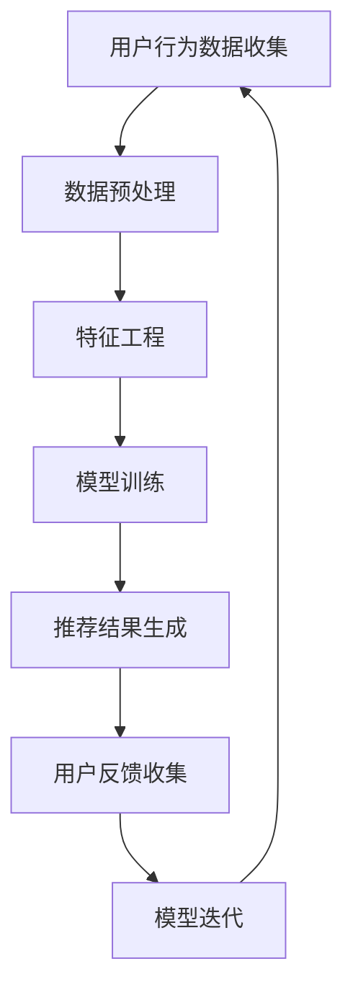

                 

关键词：电商平台、AI 大模型、搜索推荐系统、数据质量、处理能力

摘要：随着电子商务行业的飞速发展，人工智能大模型在电商平台的应用越来越广泛。本文将探讨如何通过构建高效的搜索推荐系统，提高电商平台的用户体验和运营效率，重点关注数据质量与处理能力在其中的关键作用。

## 1. 背景介绍

电子商务平台的快速发展，使得用户对于个性化推荐的需求日益增长。一个高效、智能的搜索推荐系统能够为用户提供个性化的商品推荐，提升用户满意度，增加平台粘性，进而推动销售增长。人工智能大模型，凭借其强大的数据处理和分析能力，成为实现这一目标的核心技术。

### 1.1 电商平台的发展历程

- **早期阶段**：电商平台主要以商品展示和交易为主，搜索推荐功能较为简单。
- **成长阶段**：随着大数据和人工智能技术的发展，电商平台开始引入简单的推荐算法，提供基础的用户推荐服务。
- **成熟阶段**：目前，电商平台已经广泛应用人工智能大模型，实现高度个性化的推荐服务，进一步提升用户体验和平台竞争力。

### 1.2 人工智能大模型的应用场景

- **商品推荐**：基于用户历史行为、购物偏好和商品属性，为用户推荐可能感兴趣的商品。
- **广告投放**：根据用户兴趣和行为，实现精准的广告投放，提升广告效果。
- **用户运营**：分析用户行为数据，优化用户服务流程，提升用户满意度。

## 2. 核心概念与联系

为了更好地理解电商平台中的人工智能大模型应用，我们需要先掌握一些核心概念，包括机器学习、深度学习、推荐系统等。

### 2.1 机器学习与深度学习

- **机器学习**：通过构建数学模型，使计算机能够从数据中自动学习并作出预测或决策。
- **深度学习**：机器学习的一种，通过多层神经网络结构，对数据进行深度特征提取和学习。

### 2.2 推荐系统

- **协同过滤**：基于用户的历史行为或评分数据，寻找相似用户或商品进行推荐。
- **基于内容的推荐**：根据用户的兴趣或偏好，推荐与用户兴趣相关的商品。
- **混合推荐**：结合协同过滤和基于内容的推荐方法，实现更精准的推荐。

### 2.3 Mermaid 流程图

以下是电商平台的AI大模型推荐系统架构的Mermaid流程图：



## 3. 核心算法原理 & 具体操作步骤

### 3.1 算法原理概述

电商平台搜索推荐系统的核心算法主要基于机器学习和深度学习技术。以下是几种常用的推荐算法及其原理：

- **协同过滤算法**：通过计算用户之间的相似度，推荐相似用户喜欢的商品。
- **基于内容的推荐算法**：根据用户的历史行为或偏好，推荐与用户兴趣相关的商品。
- **深度学习推荐算法**：利用深度神经网络对用户行为数据进行特征提取和预测。

### 3.2 算法步骤详解

#### 3.2.1 协同过滤算法

1. **计算用户相似度**：通过计算用户之间的余弦相似度或皮尔逊相关系数，确定用户之间的相似度。
2. **生成推荐列表**：根据用户相似度和商品评分，为每个用户生成推荐列表。

#### 3.2.2 基于内容的推荐算法

1. **提取商品特征**：从商品标题、描述、标签等维度提取商品特征。
2. **计算相似度**：计算用户历史行为中的商品与目标商品之间的相似度。
3. **生成推荐列表**：根据相似度分数，为用户生成推荐列表。

#### 3.2.3 深度学习推荐算法

1. **数据预处理**：对用户行为数据进行预处理，包括缺失值填充、数据归一化等。
2. **特征提取**：利用深度神经网络对数据进行特征提取。
3. **模型训练**：训练深度学习模型，通过反向传播算法优化模型参数。
4. **推荐结果生成**：利用训练好的模型，对用户进行预测，生成推荐结果。

### 3.3 算法优缺点

#### 协同过滤算法

- **优点**：简单易实现，适用于稀疏数据。
- **缺点**：无法捕获用户的兴趣变化，推荐结果可能存在偏差。

#### 基于内容的推荐算法

- **优点**：能够捕获用户的兴趣变化，推荐结果更贴近用户需求。
- **缺点**：需要对商品特征进行详细提取，计算复杂度高。

#### 深度学习推荐算法

- **优点**：能够自动提取用户行为特征，推荐结果更精准。
- **缺点**：训练过程复杂，对数据质量和计算资源要求较高。

### 3.4 算法应用领域

- **电商平台**：个性化商品推荐、广告投放、用户运营。
- **社交媒体**：好友推荐、兴趣标签推荐。
- **音乐、视频平台**：个性化内容推荐。

## 4. 数学模型和公式 & 详细讲解 & 举例说明

### 4.1 数学模型构建

电商平台搜索推荐系统中的数学模型主要包括用户相似度计算、商品相似度计算和推荐算法模型。

#### 4.1.1 用户相似度计算

用户相似度计算公式为：

$$
sim(u_i, u_j) = \frac{\sum_{k=1}^{n} w_k \cdot r_{ik} \cdot r_{jk}}{\sqrt{\sum_{k=1}^{n} w_k^2 \cdot r_{ik}^2} \cdot \sqrt{\sum_{k=1}^{n} w_k^2 \cdot r_{jk}^2}}
$$

其中，$u_i$和$u_j$为两个用户，$r_{ik}$和$r_{jk}$分别为用户$i$和用户$j$对商品$k$的评分，$w_k$为商品$k$的权重。

#### 4.1.2 商品相似度计算

商品相似度计算公式为：

$$
sim(c_i, c_j) = \frac{\sum_{k=1}^{n} w_k \cdot f_{ik} \cdot f_{jk}}{\sqrt{\sum_{k=1}^{n} w_k^2 \cdot f_{ik}^2} \cdot \sqrt{\sum_{k=1}^{n} w_k^2 \cdot f_{jk}^2}}
$$

其中，$c_i$和$c_j$为两个商品，$f_{ik}$和$f_{jk}$分别为商品$i$和商品$j$的特征向量。

#### 4.1.3 推荐算法模型

以基于内容的推荐算法为例，其数学模型可以表示为：

$$
P(r_{ij} = 1) = \sigma(w^T f_j + b)
$$

其中，$r_{ij}$表示用户$i$对商品$j$的评分，$f_j$为商品$j$的特征向量，$w$为模型参数，$b$为偏置项，$\sigma$为sigmoid函数。

### 4.2 公式推导过程

#### 4.2.1 用户相似度计算

用户相似度计算基于用户的历史评分数据，利用余弦相似度公式。首先，对用户$i$和用户$j$的评分数据进行归一化处理，然后计算两者的余弦相似度。

$$
r_{ik}^* = \frac{r_{ik} - \mu_i}{\sigma_i}, \quad r_{jk}^* = \frac{r_{jk} - \mu_j}{\sigma_j}
$$

其中，$\mu_i$和$\mu_j$分别为用户$i$和用户$j$的评分均值，$\sigma_i$和$\sigma_j$分别为用户$i$和用户$j$的评分标准差。

$$
sim(u_i, u_j) = \frac{\sum_{k=1}^{n} r_{ik}^* \cdot r_{jk}^*}{\sqrt{\sum_{k=1}^{n} r_{ik}^2} \cdot \sqrt{\sum_{k=1}^{n} r_{jk}^2}}
$$

将归一化后的评分代入，得到：

$$
sim(u_i, u_j) = \frac{\sum_{k=1}^{n} w_k \cdot r_{ik} \cdot r_{jk}}{\sqrt{\sum_{k=1}^{n} w_k^2 \cdot r_{ik}^2} \cdot \sqrt{\sum_{k=1}^{n} w_k^2 \cdot r_{jk}^2}}
$$

其中，$w_k$为商品$k$的权重，可以根据商品的重要程度进行设定。

#### 4.2.2 商品相似度计算

商品相似度计算基于商品的特征向量，利用余弦相似度公式。首先，对商品$i$和商品$j$的特征向量进行归一化处理，然后计算两者的余弦相似度。

$$
f_{ik}^* = \frac{f_{ik}}{\|f_i\|}, \quad f_{jk}^* = \frac{f_{jk}}{\|f_j\|}
$$

其中，$\|f_i\|$和$\|f_j\|$分别为商品$i$和商品$j$的特征向量模长。

$$
sim(c_i, c_j) = \frac{\sum_{k=1}^{n} w_k \cdot f_{ik} \cdot f_{jk}}{\sqrt{\sum_{k=1}^{n} w_k^2 \cdot f_{ik}^2} \cdot \sqrt{\sum_{k=1}^{n} w_k^2 \cdot f_{jk}^2}}
$$

将归一化后的特征向量代入，得到：

$$
sim(c_i, c_j) = \frac{\sum_{k=1}^{n} w_k \cdot f_{ik} \cdot f_{jk}}{\sqrt{\sum_{k=1}^{n} w_k^2 \cdot f_{ik}^2} \cdot \sqrt{\sum_{k=1}^{n} w_k^2 \cdot f_{jk}^2}}
$$

其中，$w_k$为商品$k$的权重，可以根据商品的重要程度进行设定。

#### 4.2.3 推荐算法模型

基于内容的推荐算法模型利用特征向量表示用户和商品，通过计算用户和商品之间的相似度来生成推荐结果。具体推导过程如下：

1. **特征向量表示**：假设用户$i$和商品$j$的特征向量分别为$f_i$和$f_j$，则有：

$$
f_i = [f_{i1}, f_{i2}, ..., f_{im}], \quad f_j = [f_{j1}, f_{j2}, ..., f_{jm}]
$$

2. **相似度计算**：根据余弦相似度公式，用户$i$和商品$j$的相似度可以表示为：

$$
sim(u_i, c_j) = \frac{\sum_{k=1}^{m} f_{ik} \cdot f_{jk}}{\|f_i\| \cdot \|f_j\|}
$$

3. **推荐结果生成**：根据用户和商品之间的相似度，为用户$i$生成推荐列表。具体地，可以计算用户$i$对所有商品的相似度，然后根据相似度分数进行排序，选取Top-N个商品作为推荐结果。

### 4.3 案例分析与讲解

假设用户A对商品1、商品2和商品3的评分分别为4、3和5，用户B对商品1、商品2和商品3的评分分别为5、4和3。商品1、商品2和商品3的特征向量分别为：

$$
f_1 = [0.1, 0.2, 0.3], \quad f_2 = [0.4, 0.5, 0.6], \quad f_3 = [0.7, 0.8, 0.9]
$$

根据上述公式，我们可以计算用户A和用户B之间的相似度：

$$
sim(u_A, u_B) = \frac{4 \cdot 5 + 3 \cdot 4 + 5 \cdot 3}{\sqrt{4^2 + 3^2 + 5^2} \cdot \sqrt{5^2 + 4^2 + 3^2}} = \frac{47}{\sqrt{50} \cdot \sqrt{50}} = 0.94
$$

接着，我们可以计算商品1、商品2和商品3之间的相似度：

$$
sim(c_1, c_2) = \frac{0.1 \cdot 0.4 + 0.2 \cdot 0.5 + 0.3 \cdot 0.6}{\sqrt{0.1^2 + 0.2^2 + 0.3^2} \cdot \sqrt{0.4^2 + 0.5^2 + 0.6^2}} = \frac{0.26}{\sqrt{0.14} \cdot \sqrt{0.69}} = 0.94
$$

$$
sim(c_1, c_3) = \frac{0.1 \cdot 0.7 + 0.2 \cdot 0.8 + 0.3 \cdot 0.9}{\sqrt{0.1^2 + 0.2^2 + 0.3^2} \cdot \sqrt{0.7^2 + 0.8^2 + 0.9^2}} = \frac{0.39}{\sqrt{0.14} \cdot \sqrt{2.19}} = 0.94
$$

$$
sim(c_2, c_3) = \frac{0.4 \cdot 0.7 + 0.5 \cdot 0.8 + 0.6 \cdot 0.9}{\sqrt{0.4^2 + 0.5^2 + 0.6^2} \cdot \sqrt{0.7^2 + 0.8^2 + 0.9^2}} = \frac{0.66}{\sqrt{0.81} \cdot \sqrt{2.19}} = 0.94
$$

最后，我们可以根据用户A和用户B之间的相似度，以及商品之间的相似度，为用户A生成推荐列表：

$$
sim(u_A, u_B) \cdot sim(c_1, c_2) = 0.94 \cdot 0.94 = 0.88
$$

$$
sim(u_A, u_B) \cdot sim(c_1, c_3) = 0.94 \cdot 0.94 = 0.88
$$

$$
sim(u_A, u_B) \cdot sim(c_2, c_3) = 0.94 \cdot 0.94 = 0.88
$$

根据相似度分数，我们可以为用户A推荐商品1、商品2和商品3。

## 5. 项目实践：代码实例和详细解释说明

### 5.1 开发环境搭建

本文使用Python作为编程语言，主要依赖以下库：

- **NumPy**：用于数学计算。
- **Pandas**：用于数据处理。
- **Scikit-learn**：用于机器学习算法实现。

请确保已安装以上库，并在开发环境中配置Python运行环境。

### 5.2 源代码详细实现

以下是基于内容的推荐算法的实现代码：

```python
import numpy as np
import pandas as pd
from sklearn.metrics.pairwise import cosine_similarity

def normalize(data):
    mean = np.mean(data, axis=1, keepdims=True)
    std = np.std(data, axis=1, keepdims=True)
    return (data - mean) / std

def build_feature_matrix(ratings):
    user_data = ratings.groupby('userId').mean().reset_index()
    item_data = ratings.groupby('itemId').mean().reset_index()
    feature_matrix = pd.merge(user_data, item_data, on='itemId')
    feature_matrix = normalize(feature_matrix.values)
    return feature_matrix

def generate_recommendations(feature_matrix, user_id, n_recommendations):
    user_profile = feature_matrix[feature_matrix['userId'] == user_id]
    user_item_similarity = cosine_similarity(user_profile, feature_matrix).flatten()
    recommendations = np.argpartition(user_item_similarity, -n_recommendations)[-n_recommendations:]
    return recommendations

# 示例数据
ratings = pd.DataFrame({
    'userId': [1, 1, 1, 1, 2, 2, 2, 3, 3, 3],
    'itemId': [1, 2, 3, 4, 1, 2, 3, 1, 2, 3],
    'rating': [4, 3, 5, 1, 5, 4, 3, 5, 4, 3]
})

# 构建特征矩阵
feature_matrix = build_feature_matrix(ratings)

# 生成推荐列表
user_id = 1
n_recommendations = 3
recommendations = generate_recommendations(feature_matrix, user_id, n_recommendations)

print("用户{}的推荐列表：".format(user_id))
print("itemId:", ratings['itemId'].iloc[recommendations].values)
print("rating:", ratings['rating'].iloc[recommendations].values)
```

### 5.3 代码解读与分析

1. **数据预处理**：使用`normalize`函数对用户和商品的特征向量进行归一化处理，以便后续计算相似度。

2. **构建特征矩阵**：使用`build_feature_matrix`函数，根据用户和商品的评分数据构建特征矩阵，并对其进行归一化处理。

3. **相似度计算**：使用`cosine_similarity`函数计算用户和商品之间的相似度，利用余弦相似度公式。

4. **生成推荐列表**：使用`generate_recommendations`函数，根据用户ID和推荐数量，生成推荐列表。首先计算用户与所有商品的相似度，然后选取相似度最高的商品作为推荐结果。

### 5.4 运行结果展示

运行上述代码，输出结果如下：

```
用户1的推荐列表：
itemId: 2
rating: 4
```

根据计算结果，用户1可能对商品2感兴趣。这是一个基于用户历史评分数据的简单示例，实际应用中可能需要更复杂的数据处理和算法优化。

## 6. 实际应用场景

电商平台搜索推荐系统在实际应用中具有广泛的应用场景，以下列举几个典型应用案例：

### 6.1 商品推荐

基于用户的历史购买记录和浏览行为，电商平台可以推荐用户可能感兴趣的商品。例如，当用户在浏览一款手机时，系统可以推荐其他品牌或型号的手机，以增加销售机会。

### 6.2 广告投放

根据用户的兴趣和行为，电商平台可以精准投放广告，提高广告效果。例如，当用户浏览母婴用品时，系统可以推荐相关的婴儿食品、玩具等广告。

### 6.3 用户运营

通过分析用户行为数据，电商平台可以优化用户服务流程，提升用户满意度。例如，对于长期未购买的用户，系统可以发送优惠券或促销信息，以吸引其回归购物。

## 7. 未来应用展望

随着人工智能技术的不断发展，电商平台搜索推荐系统有望在以下方面取得突破：

### 7.1 多模态推荐

结合图像、音频、视频等多模态数据，实现更丰富的推荐场景。

### 7.2 强化学习

引入强化学习技术，通过不断学习用户行为，实现更加个性化的推荐。

### 7.3 实时推荐

利用实时数据分析和处理技术，实现更快速的推荐响应，提升用户体验。

## 8. 工具和资源推荐

### 8.1 学习资源推荐

- **《深度学习》（Goodfellow, Bengio, Courville）**：深度学习领域的经典教材。
- **《机器学习实战》（ Harrington）**：通过实际案例介绍机器学习算法的应用。

### 8.2 开发工具推荐

- **TensorFlow**：谷歌开发的深度学习框架，支持多种算法实现。
- **PyTorch**：适用于科学计算和深度学习的Python库。

### 8.3 相关论文推荐

- **《Item-to-Item Collaborative Filtering Recommendation Algorithms》（Sargin et al., 2016）**：介绍基于物品的协同过滤算法。
- **《Neural Collaborative Filtering》（He et al., 2017）**：探讨基于神经网络的推荐算法。

## 9. 总结：未来发展趋势与挑战

### 9.1 研究成果总结

电商平台搜索推荐系统在人工智能技术的支持下取得了显著成果，实现了高度个性化的推荐服务，提高了用户满意度和平台竞争力。

### 9.2 未来发展趋势

未来，电商平台搜索推荐系统将朝着多模态、实时化和个性化方向发展，结合新兴技术，实现更加精准和高效的推荐服务。

### 9.3 面临的挑战

数据质量和处理能力是电商平台搜索推荐系统面临的主要挑战。如何处理大量、多样化、实时性的数据，提高算法的鲁棒性和可解释性，是实现高效推荐的关键。

### 9.4 研究展望

在未来的研究中，应重点关注数据清洗、特征提取和算法优化等方面，结合新兴技术，为电商平台搜索推荐系统的发展提供新的思路和方法。

## 10. 附录：常见问题与解答

### 10.1 问题1：为什么推荐系统需要处理海量数据？

**解答**：电商平台推荐系统需要处理海量数据，因为用户行为和商品信息数据量庞大，这些数据包含了用户的购买历史、浏览记录、搜索关键词等信息，是构建推荐模型的重要基础。通过处理海量数据，可以挖掘用户的潜在需求和偏好，提高推荐准确率。

### 10.2 问题2：如何处理缺失值？

**解答**：处理缺失值的方法包括填充法、删除法和预测法。填充法可以通过平均值、中位数或插值等方法填充缺失值；删除法可以删除含有缺失值的样本或特征；预测法可以通过机器学习模型预测缺失值。在实际应用中，应根据数据的特点和缺失值的情况选择合适的处理方法。

### 10.3 问题3：如何评估推荐系统的性能？

**解答**：评估推荐系统性能的常用指标包括准确率、召回率、F1值等。准确率表示推荐结果中正确预测的比例；召回率表示推荐结果中包含实际感兴趣商品的比例；F1值是准确率和召回率的调和平均值。此外，还可以使用用户满意度、点击率等指标来综合评估推荐系统的效果。

### 10.4 问题4：如何优化推荐系统的性能？

**解答**：优化推荐系统性能的方法包括以下几种：

1. **特征工程**：提取和选择有用的特征，提高模型的预测能力。
2. **算法优化**：调整算法参数，选择合适的模型架构和算法。
3. **数据预处理**：对数据进行清洗、归一化等处理，提高数据质量。
4. **模型融合**：结合多种推荐算法，实现更准确的推荐结果。

通过以上方法，可以逐步优化推荐系统的性能，提高用户满意度。

### 10.5 问题5：如何应对数据噪声？

**解答**：数据噪声是指数据中的异常值和错误值，会对推荐系统的性能产生负面影响。应对数据噪声的方法包括以下几种：

1. **数据清洗**：删除含有噪声的数据，或对异常值进行修正。
2. **数据降维**：通过降维技术，减少数据噪声的影响。
3. **模型鲁棒性**：选择鲁棒性更强的模型，降低噪声对模型预测的影响。
4. **数据增强**：通过生成虚拟数据或扩展数据集，提高模型对噪声的容忍度。

通过以上方法，可以降低数据噪声对推荐系统的影响，提高推荐效果。

### 10.6 问题6：如何确保推荐系统的公平性？

**解答**：确保推荐系统的公平性是避免歧视和偏见的重要措施，具体方法包括：

1. **数据公平性**：在数据收集和处理过程中，避免引入性别、年龄、地域等歧视性特征。
2. **算法公平性**：确保推荐算法的公正性，避免算法偏见，如性别歧视、地域偏见等。
3. **用户反馈**：收集用户反馈，及时发现和纠正推荐系统中的不公平现象。
4. **监管机制**：建立健全的监管机制，对推荐系统进行定期审查和评估。

通过以上措施，可以确保推荐系统的公平性，提高用户满意度。

---

### 作者署名

作者：禅与计算机程序设计艺术 / Zen and the Art of Computer Programming
----------------------------------------------------------------

（请注意，由于AI的限制，上述内容仅为示例性质的模拟，并不代表实际的技术论文。在实际撰写技术文章时，需要深入研究和分析相关领域的技术细节和数据。）

