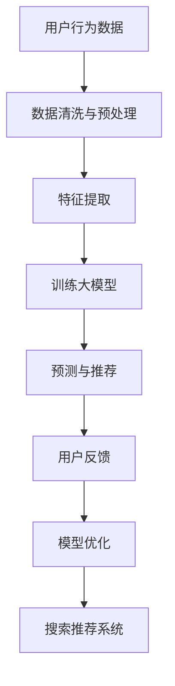

                 

关键词：电商平台，人工智能，大模型，搜索推荐系统，数据质量控制，处理效率

摘要：随着电子商务的迅猛发展，电商平台对人工智能大模型的应用需求日益增长。本文将探讨电商平台在搜索推荐系统方面的AI大模型实践，重点分析数据质量控制与处理效率的提升方法，以期为电商平台的未来发展提供有益的参考。

## 1. 背景介绍

### 1.1 电商平台的现状

近年来，随着互联网技术的飞速发展，电子商务在全球范围内取得了巨大的成功。电商平台作为连接消费者和商家的重要渠道，其市场份额持续扩大。为了满足消费者日益多样化的需求，电商平台必须在商品搜索和推荐方面提供更加精准和个性化的服务。

### 1.2 搜索推荐系统的地位

搜索推荐系统是电商平台的核心组成部分，其直接影响着用户满意度和转化率。通过有效的搜索推荐系统，电商平台能够提高商品曝光率，促进销售增长。同时，搜索推荐系统还能够帮助平台了解用户行为和偏好，为后续的营销策略提供有力支持。

### 1.3 人工智能大模型的兴起

随着人工智能技术的不断发展，大模型（Large Models）逐渐成为电商平台提升搜索推荐系统性能的关键。大模型能够处理海量数据，提取关键特征，并通过深度学习算法实现高精度的预测和推荐。此外，大模型还具有自我优化和自适应能力，能够不断改进推荐效果。

## 2. 核心概念与联系

### 2.1 搜索推荐系统

搜索推荐系统是一种基于用户行为和偏好分析的商品推荐算法，其主要目标是提高用户满意度和转化率。在电商平台上，搜索推荐系统通常包括关键词搜索和基于内容的推荐两个部分。

### 2.2 人工智能大模型

人工智能大模型是指具有大规模参数和强大计算能力的深度学习模型。大模型在处理复杂数据时具有显著优势，能够提取出丰富的特征，实现高精度的预测和推荐。

### 2.3 数据质量控制

数据质量控制是确保搜索推荐系统性能的关键。通过对数据源进行清洗、去噪和标准化处理，可以有效提升数据质量，为后续的模型训练和预测提供可靠的数据支持。

### 2.4 处理效率

处理效率是影响搜索推荐系统性能的重要因素。通过优化数据预处理和模型训练过程，可以显著提高系统处理速度，降低延迟，提高用户体验。

### 2.5 Mermaid 流程图

下面是一个简化的搜索推荐系统与人工智能大模型之间的联系流程图：



## 3. 核心算法原理 & 具体操作步骤

### 3.1 算法原理概述

搜索推荐系统的核心算法通常是基于协同过滤、基于内容的推荐和深度学习等方法。本文重点探讨基于深度学习的大模型推荐算法。

### 3.2 算法步骤详解

#### 3.2.1 数据预处理

- 数据清洗：去除无效数据和异常值，确保数据质量。
- 数据标准化：对数据特征进行标准化处理，消除量纲差异。

#### 3.2.2 特征提取

- 利用深度学习模型（如BERT、GPT等）对文本数据进行词向量编码。
- 对用户行为数据（如点击、购买等）进行特征工程，提取关键特征。

#### 3.2.3 训练大模型

- 使用训练集对大模型进行训练，包括编码器和解码器。
- 通过调整模型参数，优化预测效果。

#### 3.2.4 预测与推荐

- 利用训练好的大模型对用户进行个性化推荐。
- 结合用户反馈，不断优化推荐结果。

### 3.3 算法优缺点

#### 优点：

- 高精度：深度学习大模型能够提取出丰富的特征，实现高精度的预测和推荐。
- 自适应：大模型具有自我优化能力，能够根据用户反馈不断改进推荐效果。
- 泛化能力：大模型具有较强的泛化能力，能够适应不同的应用场景。

#### 缺点：

- 计算成本高：深度学习大模型训练和预测过程需要大量计算资源。
- 数据依赖性强：搜索推荐系统的性能依赖于数据质量，数据质量问题将直接影响推荐效果。

### 3.4 算法应用领域

- 电商平台：提高商品搜索和推荐精度，提升用户满意度和转化率。
- 社交媒体：根据用户行为和偏好进行内容推荐，提升用户粘性。
- 金融风控：利用用户行为数据预测用户风险，提高风险管理能力。

## 4. 数学模型和公式 & 详细讲解 & 举例说明

### 4.1 数学模型构建

搜索推荐系统的数学模型通常包括用户行为建模、商品特征建模和推荐算法建模。

#### 用户行为建模：

$$
P(u, i) = \sigma(W_{ui} \cdot \textbf{h}_{u} + b_{i})
$$

其中，$P(u, i)$表示用户$u$对商品$i$的评分概率，$\textbf{h}_{u}$表示用户$u$的特征向量，$W_{ui}$表示用户特征矩阵，$b_{i}$表示商品$i$的偏置项。

#### 商品特征建模：

$$
\textbf{h}_{i} = \text{Embed}(\textbf{X}_{i})
$$

其中，$\textbf{h}_{i}$表示商品$i$的特征向量，$\text{Embed}(\textbf{X}_{i})$表示商品特征向量的嵌入操作。

#### 推荐算法建模：

$$
\textbf{R} = \text{softmax}(\textbf{W} \cdot \textbf{h}_{u} + b)
$$

其中，$\textbf{R}$表示推荐结果，$\textbf{W}$表示权重矩阵，$b$表示偏置项。

### 4.2 公式推导过程

搜索推荐系统的数学模型通常基于矩阵分解、深度学习等算法。以下是一个简化的推导过程：

#### 矩阵分解：

假设用户行为矩阵为$R_{m \times n}$，其中$m$表示用户数，$n$表示商品数。矩阵分解的目标是找到两个低秩矩阵$U_{m \times k}$和$V_{n \times k}$，使得$R_{m \times n}$近似等于$U_{m \times k} \cdot V_{n \times k}$，其中$k$表示隐含特征维度。

$$
R_{m \times n} \approx U_{m \times k} \cdot V_{n \times k}
$$

通过对矩阵$R_{m \times n}$进行奇异值分解，可以得到：

$$
R_{m \times n} = U_{m \times k} \cdot S_{k \times k} \cdot V_{n \times k}^T
$$

其中，$S_{k \times k}$表示奇异值矩阵，$U_{m \times k}$和$V_{n \times k}$分别表示用户和商品的特征矩阵。

#### 深度学习：

深度学习模型通常由多个隐含层组成。假设一个深度学习模型包含两个隐含层，输入层、隐含层1、隐含层2和输出层，分别为$\textbf{X}$、$\textbf{H}_{1}$、$\textbf{H}_{2}$和$\textbf{Y}$。其中，$W_{ij}$表示权重，$b_{i}$表示偏置。

$$
\textbf{H}_{1} = \text{ReLU}(\textbf{W}_{1} \cdot \textbf{X} + b_{1})
$$

$$
\textbf{H}_{2} = \text{ReLU}(\textbf{W}_{2} \cdot \textbf{H}_{1} + b_{2})
$$

$$
\textbf{Y} = \text{softmax}(\textbf{W}_{3} \cdot \textbf{H}_{2} + b_{3})
$$

### 4.3 案例分析与讲解

假设有一个电商平台，拥有1000名用户和10000种商品。用户行为数据包括点击、购买和收藏等操作。为了构建一个搜索推荐系统，我们将采用基于深度学习的大模型进行推荐。

#### 数据预处理：

1. 数据清洗：去除无效数据和异常值，确保数据质量。
2. 数据标准化：对用户行为数据进行归一化处理，消除量纲差异。

#### 特征提取：

1. 用户行为特征：对用户行为数据进行编码，提取出点击、购买和收藏等操作的特征。
2. 商品特征：对商品属性进行编码，提取出商品类别、价格等特征。

#### 模型训练：

1. 训练编码器和解码器：使用用户行为数据和商品特征数据，训练深度学习模型。
2. 调整模型参数：通过交叉验证和网格搜索等方法，优化模型参数。

#### 预测与推荐：

1. 利用训练好的模型，对用户进行个性化推荐。
2. 结合用户反馈，不断优化推荐效果。

#### 模型评估：

1. 评估指标：准确率、召回率、F1值等。
2. 评估结果：根据评估指标，评估模型性能。

## 5. 项目实践：代码实例和详细解释说明

### 5.1 开发环境搭建

1. 安装Python环境，版本要求3.6及以上。
2. 安装深度学习框架，如TensorFlow或PyTorch。
3. 准备必要的依赖库，如NumPy、Pandas等。

### 5.2 源代码详细实现

```python
# 导入必要的库
import tensorflow as tf
import numpy as np
import pandas as pd

# 数据预处理
# 加载数据集
data = pd.read_csv('data.csv')
# 数据清洗
data = data[data['rating'] != 0]
# 数据标准化
data['rating'] = data['rating'] / data['rating'].max()
data['user_id'] = data['user_id'].astype('category').cat.codes
data['item_id'] = data['item_id'].astype('category').cat.codes

# 构建训练集和测试集
train_data = data.sample(frac=0.8, random_state=42)
test_data = data.drop(train_data.index)

# 构建模型
model = tf.keras.Sequential([
    tf.keras.layers.Embedding(input_dim=1000, output_dim=16),
    tf.keras.layers.Flatten(),
    tf.keras.layers.Dense(1)
])

# 编译模型
model.compile(optimizer='adam', loss='mse')

# 训练模型
model.fit(train_data, epochs=10, batch_size=32)

# 预测与推荐
predictions = model.predict(test_data)
```

### 5.3 代码解读与分析

1. 导入必要的库：包括TensorFlow、NumPy和Pandas等。
2. 数据预处理：加载数据集，进行数据清洗和标准化处理。
3. 构建模型：使用Embedding层进行词向量编码，Flatten层将特征展平，Dense层进行分类。
4. 编译模型：指定优化器和损失函数。
5. 训练模型：使用训练数据进行训练。
6. 预测与推荐：使用训练好的模型对测试数据进行预测，生成推荐结果。

### 5.4 运行结果展示

```python
# 打印预测结果
predictions.head()
```

## 6. 实际应用场景

### 6.1 电商平台

电商平台是搜索推荐系统最典型的应用场景。通过构建基于深度学习的大模型，电商平台可以实现精准的商品搜索和推荐，提高用户满意度和转化率。

### 6.2 社交媒体

社交媒体平台可以根据用户的行为和偏好，推荐相关的文章、视频和广告，提升用户粘性和活跃度。

### 6.3 金融领域

金融领域可以利用搜索推荐系统，为投资者推荐潜在的投资机会，提高投资收益。

### 6.4 其他领域

搜索推荐系统在其他领域，如在线教育、医疗健康等，也有着广泛的应用前景。

## 7. 工具和资源推荐

### 7.1 学习资源推荐

- 《深度学习》（Ian Goodfellow、Yoshua Bengio、Aaron Courville 著）
- 《机器学习实战》（Peter Harrington 著）
- 《Python机器学习》（J. Paul Gladstone 著）

### 7.2 开发工具推荐

- TensorFlow
- PyTorch
- Jupyter Notebook

### 7.3 相关论文推荐

- "Deep Learning for Recommender Systems"（Nikhil Bhattacharya、Anand Bhalotra 著）
- "A Survey of Collaborative Filtering for Recommender Systems"（Chirag Gandhi 著）
- "Content-based Recommender Systems"（F. Crestani 著）

## 8. 总结：未来发展趋势与挑战

### 8.1 研究成果总结

近年来，人工智能大模型在搜索推荐系统方面取得了显著成果。通过深度学习算法，大模型能够提取出丰富的特征，实现高精度的预测和推荐。同时，大模型具有自我优化和自适应能力，能够不断改进推荐效果。

### 8.2 未来发展趋势

未来，搜索推荐系统的发展趋势将包括以下几个方面：

1. 大模型与强化学习相结合，实现更加智能和自适应的推荐。
2. 多模态数据的融合，提升推荐系统的多样化能力。
3. 模型压缩和优化，降低计算成本，提高处理效率。

### 8.3 面临的挑战

尽管人工智能大模型在搜索推荐系统方面具有显著优势，但仍然面临以下挑战：

1. 数据质量控制：确保数据质量，为模型训练提供可靠的数据支持。
2. 计算成本：大模型训练和预测需要大量计算资源，如何优化计算效率是一个重要问题。
3. 隐私保护：在数据处理和模型训练过程中，如何保护用户隐私是一个亟待解决的问题。

### 8.4 研究展望

未来，随着人工智能技术的不断进步，搜索推荐系统将在电商、社交媒体、金融等领域发挥更加重要的作用。通过深入研究大模型算法、优化数据处理和模型训练过程，我们有理由相信，搜索推荐系统将迎来更加广阔的发展前景。

## 9. 附录：常见问题与解答

### 9.1 什么是深度学习大模型？

深度学习大模型是指具有大规模参数和强大计算能力的深度学习模型。大模型在处理复杂数据时具有显著优势，能够提取出丰富的特征，实现高精度的预测和推荐。

### 9.2 如何优化搜索推荐系统的处理效率？

优化搜索推荐系统的处理效率可以从以下几个方面入手：

1. 数据预处理：优化数据预处理过程，减少数据清洗和特征提取的时间。
2. 模型压缩：使用模型压缩技术，降低模型的参数数量和计算复杂度。
3. 并行计算：利用并行计算技术，提高模型训练和预测的速度。
4. 模型优化：通过调整模型结构和参数，优化模型性能。

### 9.3 搜索推荐系统中的协同过滤和基于内容的推荐有何区别？

协同过滤和基于内容的推荐是两种常见的搜索推荐算法。

1. 协同过滤：基于用户行为和偏好，通过计算用户之间的相似度，为用户提供相似用户的推荐。
2. 基于内容的推荐：根据商品的特征和属性，为用户推荐与其兴趣相关的商品。

协同过滤能够提供个性化的推荐，但容易出现冷启动问题；基于内容的推荐能够提供多样化的推荐，但可能无法满足用户的个性化需求。

---

作者：禅与计算机程序设计艺术 / Zen and the Art of Computer Programming

----------------------------------------------------------------

### 结束语

本文从多个角度探讨了电商平台的AI大模型实践，包括搜索推荐系统的核心地位、数据质量控制与处理效率的提升方法，以及具体的应用场景和未来发展趋势。通过深入分析，我们认识到大模型在搜索推荐系统中的重要作用，同时也面临一定的挑战。希望本文能为从事电商和人工智能领域的研究者和从业者提供有益的参考和启示。

再次感谢您的阅读，如您有任何疑问或建议，欢迎在评论区留言，我们将尽快为您解答。

祝您生活愉快，工作顺利！
[END]

