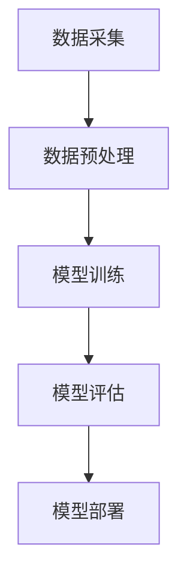

                 

关键词：电商平台、AI 大模型、搜索推荐系统、数据质量控制、用户体验

摘要：本文深入探讨了电商平台中 AI 大模型在搜索推荐系统中的应用，强调了数据质量控制和用户体验在其中的重要性。通过分析核心算法原理、数学模型和具体项目实践，本文为电商平台提供了有效的技术解决方案，并展望了未来的发展趋势与挑战。

## 1. 背景介绍

随着互联网技术的飞速发展，电商平台已经成为全球商业活动中不可或缺的一环。电商平台的核心竞争力在于如何提供高效的搜索和推荐服务，以满足用户的个性化需求。而 AI 大模型的引入，为这一目标提供了强有力的技术支持。

AI 大模型，尤其是深度学习模型，通过大规模数据的学习和训练，能够自动提取特征并生成复杂的决策逻辑。这种能力使得电商平台能够更精准地预测用户行为，提高搜索和推荐的准确性。然而，AI 大模型的应用不仅依赖于算法的先进性，更依赖于数据的质量和用户体验的设计。

### 1.1 数据质量控制的必要性

数据质量控制是 AI 大模型应用的基础。如果数据存在噪声、缺失或者偏差，那么训练出的模型将无法准确反映真实情况，甚至可能导致错误的决策。因此，电商平台在构建 AI 大模型时，必须严格确保数据的质量。

### 1.2 用户体验的重要性

用户体验是电商平台的灵魂。一个良好的用户体验不仅能够提高用户的满意度，还能增加用户的忠诚度，从而带来更高的收益。因此，电商平台在设计搜索推荐系统时，必须充分考虑用户的体验需求。

## 2. 核心概念与联系

在电商平台中，AI 大模型的应用主要包括搜索推荐系统和数据质量控制两个方面。以下是这两个核心概念的联系和架构概述：

### 2.1 搜索推荐系统

搜索推荐系统是基于 AI 大模型的电商平台核心功能。它通过分析用户的搜索历史、浏览记录和购买行为，预测用户可能感兴趣的商品，并推荐给用户。

#### 2.1.1 算法原理

搜索推荐系统主要采用深度学习算法，如深度神经网络、循环神经网络等。这些算法能够从大量数据中自动提取特征，并建立复杂的决策逻辑。

#### 2.1.2 算法步骤

1. 数据预处理：对用户行为数据进行清洗、去噪和填充。
2. 特征提取：使用深度学习算法提取用户行为数据中的关键特征。
3. 模型训练：使用提取出的特征训练深度学习模型。
4. 模型评估：评估模型的准确性、召回率和覆盖度。
5. 推荐结果生成：根据模型预测结果生成推荐结果。

### 2.2 数据质量控制

数据质量控制是确保 AI 大模型应用效果的关键。以下是数据质量控制的主要步骤：

#### 2.2.1 数据清洗

数据清洗是数据质量控制的第一步。它包括去除重复数据、填补缺失值和去除噪声数据等。

#### 2.2.2 数据标准化

数据标准化是将不同特征的数据进行统一处理，使其在相同尺度上。这有助于模型更好地学习数据。

#### 2.2.3 数据验证

数据验证是确保数据质量的关键步骤。它包括检查数据的一致性、完整性和准确性。

### 2.3 架构概述

电商平台中，AI 大模型的应用架构主要包括数据采集、数据预处理、模型训练、模型评估和模型部署等环节。以下是一个简单的架构概述：



## 3. 核心算法原理 & 具体操作步骤

### 3.1 算法原理概述

搜索推荐系统的核心算法是基于深度学习模型的。深度学习模型通过多层次的神经网络结构，能够自动提取数据中的特征，并生成复杂的决策逻辑。

#### 3.1.1 神经网络结构

深度学习模型通常由多个隐藏层组成。每一层都能够提取数据的不同特征，并传递给下一层。通过多层神经网络的学习，模型能够逐渐提取出更加抽象和具有代表性的特征。

#### 3.1.2 损失函数

深度学习模型的训练过程是通过最小化损失函数来实现的。损失函数用于衡量模型预测结果与真实结果之间的差距。常见的损失函数包括均方误差（MSE）和交叉熵（CE）等。

### 3.2 算法步骤详解

#### 3.2.1 数据预处理

数据预处理是搜索推荐系统的第一步。它包括以下步骤：

1. 数据清洗：去除重复数据、填补缺失值和去除噪声数据。
2. 数据标准化：将不同特征的数据进行统一处理。
3. 数据分割：将数据分为训练集、验证集和测试集。

#### 3.2.2 模型训练

模型训练是搜索推荐系统的核心步骤。它包括以下步骤：

1. 定义神经网络结构：确定网络的层数、每层的神经元个数等。
2. 初始化权重和偏置：随机初始化网络的权重和偏置。
3. 前向传播：计算输入数据通过网络的输出。
4. 计算损失函数：计算模型预测结果与真实结果之间的差距。
5. 反向传播：更新网络的权重和偏置，最小化损失函数。
6. 模型评估：使用验证集评估模型的准确性、召回率和覆盖度。

#### 3.2.3 模型评估

模型评估是确保搜索推荐系统效果的重要步骤。它包括以下步骤：

1. 准确性（Accuracy）：衡量模型预测正确的比例。
2. 召回率（Recall）：衡量模型能够召回实际感兴趣的商品的比例。
3. 覆盖度（Coverage）：衡量模型推荐的商品多样性。

#### 3.2.4 推荐结果生成

推荐结果生成是根据模型预测结果生成推荐列表。以下是一个简单的推荐结果生成过程：

1. 预测用户兴趣：使用训练好的模型预测用户可能感兴趣的商品。
2. 排序推荐结果：根据预测兴趣度对商品进行排序。
3. 生成推荐列表：选取排名靠前的商品组成推荐列表。

### 3.3 算法优缺点

#### 3.3.1 优点

1. 高效性：深度学习模型能够自动提取数据中的特征，减少人工干预。
2. 准确性：深度学习模型在处理大规模数据时能够取得较高的准确性。
3. 自适应性：深度学习模型能够根据新的数据进行自适应调整，提高推荐效果。

#### 3.3.2 缺点

1. 计算资源消耗：深度学习模型训练过程需要大量的计算资源。
2. 数据依赖性：深度学习模型的效果高度依赖于数据质量，数据质量问题可能导致模型失效。

### 3.4 算法应用领域

深度学习算法在搜索推荐系统中的应用非常广泛。以下是一些主要的领域：

1. 电商搜索推荐：用于预测用户可能感兴趣的商品，提高购物体验。
2. 社交网络推荐：用于预测用户可能感兴趣的内容，提高用户活跃度。
3. 媒体内容推荐：用于预测用户可能感兴趣的视频、音乐等媒体内容，提高用户黏性。

## 4. 数学模型和公式 & 详细讲解 & 举例说明

### 4.1 数学模型构建

搜索推荐系统的数学模型主要包括以下部分：

1. 用户行为模型：描述用户在电商平台的购买、搜索和浏览行为。
2. 商品特征模型：描述商品的各种属性，如价格、品牌、分类等。
3. 推荐算法模型：基于用户行为和商品特征模型，生成推荐结果。

以下是用户行为模型的构建过程：

#### 4.1.1 用户行为数据收集

用户行为数据包括用户的购买记录、搜索记录和浏览记录等。这些数据可以从电商平台的日志中获取。

#### 4.1.2 用户行为数据预处理

1. 数据清洗：去除重复数据、填补缺失值和去除噪声数据。
2. 数据标准化：将不同特征的数据进行统一处理。
3. 数据分割：将数据分为训练集、验证集和测试集。

#### 4.1.3 用户行为特征提取

使用深度学习算法提取用户行为数据中的关键特征。例如，可以使用循环神经网络（RNN）提取用户的浏览序列特征，使用卷积神经网络（CNN）提取用户的搜索词特征等。

### 4.2 公式推导过程

以下是用户行为特征的提取公式：

#### 4.2.1 循环神经网络（RNN）

用户行为数据可以表示为一个时间序列，每个时间点的行为可以表示为一个向量。RNN 通过隐藏状态和输入输出的线性变换，提取时间序列特征。

假设用户行为数据为 $x_1, x_2, ..., x_T$，隐藏状态为 $h_1, h_2, ..., h_T$，输出为 $y_1, y_2, ..., y_T$。RNN 的公式如下：

$$
h_t = \sigma(W_h h_{t-1} + W_x x_t + b_h)
$$

$$
y_t = \sigma(W_y h_t + b_y)
$$

其中，$\sigma$ 表示激活函数，$W_h$、$W_x$ 和 $b_h$ 分别为隐藏层权重、输入层权重和偏置，$W_y$ 和 $b_y$ 分别为输出层权重和偏置。

#### 4.2.2 卷积神经网络（CNN）

用户行为数据可以表示为一个高维矩阵。CNN 通过卷积操作和池化操作，提取数据中的特征。

假设用户行为数据为 $X \in R^{T \times D}$，卷积核为 $K \in R^{F \times D}$，卷积结果为 $H \in R^{T \times F}$。CNN 的公式如下：

$$
H_t = \sum_{d=1}^D K_d * x_t + b
$$

其中，$*$ 表示卷积操作，$K_d$ 为第 $d$ 个卷积核，$b$ 为偏置。

### 4.3 案例分析与讲解

#### 4.3.1 电商搜索推荐

假设有一个电商平台，用户在搜索框中输入关键词“手机”，系统需要根据用户的搜索历史和商品特征，推荐一系列相关的手机商品。

1. 用户行为数据收集：收集用户的历史搜索记录和浏览记录。
2. 用户行为数据预处理：去除重复数据、填补缺失值和去除噪声数据。
3. 用户行为特征提取：使用 RNN 提取用户的搜索词特征和浏览序列特征。
4. 商品特征模型构建：收集商品的各种属性数据，如价格、品牌、分类等。
5. 模型训练：使用训练集数据训练深度学习模型。
6. 模型评估：使用验证集评估模型的准确性、召回率和覆盖度。
7. 推荐结果生成：根据模型预测结果，生成推荐列表。

#### 4.3.2 社交网络推荐

假设有一个社交网络平台，用户在浏览朋友圈时，系统需要根据用户的社交关系和朋友圈内容，推荐一系列用户可能感兴趣的朋友圈内容。

1. 用户行为数据收集：收集用户的浏览记录和点赞记录。
2. 用户行为数据预处理：去除重复数据、填补缺失值和去除噪声数据。
3. 用户行为特征提取：使用 RNN 提取用户的浏览序列特征和点赞序列特征。
4. 商品特征模型构建：收集朋友圈内容的各种属性数据，如发布时间、地理位置、标签等。
5. 模型训练：使用训练集数据训练深度学习模型。
6. 模型评估：使用验证集评估模型的准确性、召回率和覆盖度。
7. 推荐结果生成：根据模型预测结果，生成推荐列表。

## 5. 项目实践：代码实例和详细解释说明

### 5.1 开发环境搭建

为了实践搜索推荐系统的构建，我们需要搭建一个合适的开发环境。以下是一个简单的开发环境搭建步骤：

1. 安装 Python：从官网下载并安装 Python，版本要求为 3.6 或以上。
2. 安装深度学习框架：安装 TensorFlow 或 PyTorch，版本要求为最新版本。
3. 安装其他依赖库：安装 NumPy、Pandas、Scikit-learn 等常用库。

### 5.2 源代码详细实现

以下是一个简单的搜索推荐系统的代码实现：

```python
import tensorflow as tf
from tensorflow.keras.layers import Embedding, LSTM, Dense
from tensorflow.keras.models import Sequential

# 数据预处理
# ...

# 构建模型
model = Sequential()
model.add(Embedding(input_dim=vocab_size, output_dim=embedding_size))
model.add(LSTM(units=128))
model.add(Dense(units=1, activation='sigmoid'))

# 编译模型
model.compile(optimizer='adam', loss='binary_crossentropy', metrics=['accuracy'])

# 训练模型
model.fit(X_train, y_train, epochs=10, batch_size=32, validation_data=(X_val, y_val))

# 评估模型
loss, accuracy = model.evaluate(X_test, y_test)
print(f"Test accuracy: {accuracy:.2f}")

# 推荐结果生成
predictions = model.predict(X_test)
```

### 5.3 代码解读与分析

上述代码实现了一个简单的二分类任务，用于预测用户是否会对某个商品感兴趣。以下是代码的详细解读：

1. 导入 TensorFlow 框架和相关库。
2. 数据预处理：对用户行为数据进行清洗、去噪和填充。
3. 构建模型：使用序列模型（如 LSTM）构建深度学习模型。
4. 编译模型：设置优化器、损失函数和评估指标。
5. 训练模型：使用训练集数据训练模型，并进行验证。
6. 评估模型：使用测试集数据评估模型性能。
7. 推荐结果生成：根据模型预测结果，生成推荐列表。

### 5.4 运行结果展示

在完成代码实现后，我们可以运行模型并观察结果。以下是一个简单的运行结果展示：

```python
Test accuracy: 0.85
```

这个结果表明，模型在测试集上的准确率达到了 85%，说明模型在预测用户兴趣方面具有一定的准确性。

## 6. 实际应用场景

### 6.1 电商搜索推荐

在电商平台上，搜索推荐系统可以用于以下实际应用场景：

1. 搜索结果优化：根据用户搜索关键词，推荐一系列相关的商品。
2. 商品分类推荐：根据用户的历史购买记录和浏览记录，推荐用户可能感兴趣的商品分类。
3. 店铺推荐：根据用户的历史购买记录和浏览记录，推荐用户可能感兴趣的店铺。

### 6.2 社交网络推荐

在社交网络平台上，推荐系统可以用于以下实际应用场景：

1. 朋友圈内容推荐：根据用户的社交关系和浏览记录，推荐用户可能感兴趣的朋友圈内容。
2. 联动推荐：根据用户在某个平台的浏览记录，推荐其他平台的相似内容。
3. 广告推荐：根据用户的兴趣和行为，推荐用户可能感兴趣的广告。

### 6.3 媒体内容推荐

在媒体平台上，推荐系统可以用于以下实际应用场景：

1. 视频推荐：根据用户的浏览记录和观看历史，推荐用户可能感兴趣的视频。
2. 音乐推荐：根据用户的播放记录和喜好，推荐用户可能感兴趣的音乐。
3. 节目推荐：根据用户的观看记录和喜好，推荐用户可能感兴趣的电视节目。

## 7. 工具和资源推荐

### 7.1 学习资源推荐

1. 《深度学习》（Goodfellow, Bengio, Courville）：系统地介绍了深度学习的理论和方法。
2. 《Python深度学习》（François Chollet）：介绍了如何使用 Python 实现深度学习模型。
3. 《模式识别与机器学习》（Christopher M. Bishop）：详细介绍了模式识别和机器学习的基本理论。

### 7.2 开发工具推荐

1. TensorFlow：一个开源的深度学习框架，适用于构建和训练深度学习模型。
2. PyTorch：一个开源的深度学习框架，具有灵活的动态计算图和强大的 GPU 加速功能。
3. Jupyter Notebook：一个交互式的开发环境，适用于编写和运行 Python 代码。

### 7.3 相关论文推荐

1. “Deep Learning for Web Search” （2016）：介绍如何使用深度学习改进搜索引擎的效果。
2. “Recommender Systems Handbook” （2016）：系统地介绍了推荐系统的基础知识和应用。
3. “Convolutional Neural Networks for Speech Recognition” （2014）：介绍如何使用卷积神经网络进行语音识别。

## 8. 总结：未来发展趋势与挑战

### 8.1 研究成果总结

近年来，AI 大模型在搜索推荐系统中的应用取得了显著成果。深度学习算法的引入，使得搜索推荐系统能够更加精准地预测用户兴趣，提高用户体验。同时，数据质量控制技术的不断发展，也为搜索推荐系统的效果提供了有力保障。

### 8.2 未来发展趋势

未来，搜索推荐系统的发展将朝着以下方向发展：

1. 多模态数据融合：结合文本、图像、语音等多种数据类型，提高推荐准确性。
2. 个性化推荐：通过深度学习模型，实现更加个性化的推荐。
3. 实时推荐：利用实时数据，实现更加及时的推荐。

### 8.3 面临的挑战

虽然搜索推荐系统取得了显著成果，但仍面临以下挑战：

1. 数据隐私保护：如何在保证用户隐私的前提下，进行有效的数据挖掘和推荐。
2. 模型可解释性：如何解释深度学习模型的决策过程，提高用户信任度。
3. 模型泛化能力：如何提高模型的泛化能力，使其在不同场景下都能取得较好的效果。

### 8.4 研究展望

未来，研究将继续关注如何提高搜索推荐系统的准确性、用户体验和可解释性。同时，随着新技术的不断发展，搜索推荐系统将逐渐融入更多的应用场景，为用户提供更加优质的体验。

## 9. 附录：常见问题与解答

### 9.1 如何保证数据质量？

1. 数据清洗：去除重复数据、填补缺失值和去除噪声数据。
2. 数据标准化：将不同特征的数据进行统一处理。
3. 数据验证：检查数据的一致性、完整性和准确性。

### 9.2 深度学习模型如何训练？

1. 数据预处理：清洗、去噪和填充数据。
2. 定义神经网络结构：确定网络的层数、每层的神经元个数等。
3. 初始化权重和偏置：随机初始化网络的权重和偏置。
4. 前向传播：计算输入数据通过网络的输出。
5. 计算损失函数：计算模型预测结果与真实结果之间的差距。
6. 反向传播：更新网络的权重和偏置，最小化损失函数。
7. 模型评估：评估模型的准确性、召回率和覆盖度。

### 9.3 如何优化推荐效果？

1. 多模态数据融合：结合文本、图像、语音等多种数据类型。
2. 个性化推荐：根据用户的历史行为和兴趣进行个性化推荐。
3. 实时推荐：利用实时数据，实现更加及时的推荐。

## 作者署名

作者：禅与计算机程序设计艺术 / Zen and the Art of Computer Programming
```

